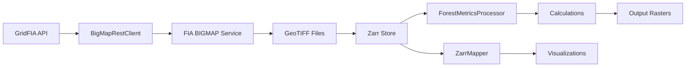

# API Reference

GridFIA provides a clean, Pythonic API for spatial forest analysis using USDA Forest Service
BIGMAP data. This reference documents all public interfaces.

## Quick Start

```python
from gridfia import GridFIA

api = GridFIA()

# Download species data
files = api.download_species(state="Montana", species_codes=["0202"])

# Create Zarr store
zarr_path = api.create_zarr("downloads/", "data/montana.zarr")

# Calculate metrics
results = api.calculate_metrics(zarr_path, calculations=["species_richness"])

# Create maps
maps = api.create_maps(zarr_path, map_type="diversity")
```

## API Structure

### Core API

| Module | Description |
|--------|-------------|
| [GridFIA](gridfia.md) | Main API class - primary entry point for all functionality |
| [Data Models](models.md) | Pydantic models for species info and calculation results |
| [Configuration](config.md) | Settings management with Pydantic v2 |
| [Exceptions](exceptions.md) | Domain-specific exception hierarchy |

### Calculations

| Module | Description |
|--------|-------------|
| [Calculations](calculations.md) | Forest metric calculations (diversity, biomass, species) |

### Utilities

| Module | Description |
|--------|-------------|
| [Utilities](utilities.md) | ZarrStore and LocationConfig classes |

## Public Exports

All public interfaces are accessible from the top-level package:

```python
from gridfia import (
    # Main API
    GridFIA,

    # Configuration
    GridFIASettings,
    load_settings,
    save_settings,

    # Utilities
    ZarrStore,

    # Exceptions
    GridFIAException,
    InvalidZarrStructure,
    SpeciesNotFound,
    CalculationFailed,
    APIConnectionError,
    InvalidLocationConfig,
    DownloadError,

    # Package info
    __version__,
)
```

## Method Reference

### GridFIA Class Methods

| Method | Description |
|--------|-------------|
| `list_species()` | List all available tree species from FIA BIGMAP |
| `download_species()` | Download species biomass rasters |
| `create_zarr()` | Convert GeoTIFFs to cloud-optimized Zarr |
| `calculate_metrics()` | Run forest metric calculations |
| `create_maps()` | Generate publication-ready visualizations |
| `get_location_config()` | Create location configuration |
| `list_calculations()` | List available calculations |
| `validate_zarr()` | Validate Zarr store structure |

### Available Calculations

GridFIA provides 15+ forest metrics through the calculation registry:

**Diversity Metrics**

| Calculation | Description |
|-------------|-------------|
| `species_richness` | Count of species per pixel |
| `shannon_diversity` | Shannon diversity index (H') |
| `simpson_diversity` | Simpson diversity index (1-D) |
| `evenness` | Pielou's evenness (J) |

**Biomass Metrics**

| Calculation | Description |
|-------------|-------------|
| `total_biomass` | Sum of biomass across all species |
| `species_proportion` | Species as proportion of total |
| `species_percentage` | Species as percentage of total |
| `biomass_threshold` | Pixels exceeding threshold |

**Species Analysis**

| Calculation | Description |
|-------------|-------------|
| `dominant_species` | Most abundant species per pixel |
| `species_presence` | Presence/absence mapping |
| `species_dominance` | Dominance indices |
| `rare_species` | Species with low biomass |
| `common_species` | Widely distributed species |

## Data Flow



## Configuration Options

GridFIA supports multiple configuration methods:

=== "Default Settings"

    ```python
    from gridfia import GridFIA

    # Use default configuration
    api = GridFIA()
    ```

=== "From File"

    ```python
    from gridfia import GridFIA

    # Load from YAML or JSON file
    api = GridFIA(config="config/production.yaml")
    ```

=== "Programmatic"

    ```python
    from gridfia import GridFIA, GridFIASettings
    from gridfia.config import CalculationConfig

    settings = GridFIASettings(
        output_dir="results",
        calculations=[
            CalculationConfig(name="species_richness", enabled=True),
            CalculationConfig(name="shannon_diversity", enabled=True),
        ]
    )
    api = GridFIA(config=settings)
    ```

=== "Environment Variables"

    ```bash
    export GRIDFIA_OUTPUT_DIR=/data/results
    export GRIDFIA_DEBUG=true
    ```

    ```python
    from gridfia import GridFIA

    # Settings loaded from environment
    api = GridFIA()
    ```

## Error Handling

All operations raise domain-specific exceptions:

```python
from gridfia import GridFIA, GridFIAException
from gridfia.exceptions import SpeciesNotFound, InvalidZarrStructure

api = GridFIA()

try:
    results = api.calculate_metrics("data.zarr")
except SpeciesNotFound as e:
    print(f"Species not found: {e.species_code}")
except InvalidZarrStructure as e:
    print(f"Invalid Zarr: {e.zarr_path}")
except GridFIAException as e:
    print(f"GridFIA error: {e.message}")
```

## Type Safety

GridFIA is fully typed with Pydantic v2 models:

```python
from gridfia import GridFIA
from gridfia.api import SpeciesInfo, CalculationResult
from typing import List

api = GridFIA()

# Type hints work correctly
species: List[SpeciesInfo] = api.list_species()
results: List[CalculationResult] = api.calculate_metrics("data.zarr")
```

## Integration Examples

### Jupyter Notebooks

```python
from gridfia import GridFIA
import pandas as pd

api = GridFIA()

# Interactive species exploration
species = api.list_species()
df = pd.DataFrame([s.model_dump() for s in species])
df.head()
```

### Data Pipelines

```python
from gridfia import GridFIA
from pathlib import Path

def process_state(state: str, output_dir: Path):
    """Process a single state."""
    api = GridFIA()

    # Download
    files = api.download_species(
        state=state,
        output_dir=output_dir / "downloads"
    )

    # Create Zarr
    zarr_path = api.create_zarr(
        output_dir / "downloads",
        output_dir / f"{state.lower()}.zarr"
    )

    # Calculate metrics
    results = api.calculate_metrics(
        zarr_path,
        output_dir=output_dir / "metrics"
    )

    return results
```

### Parallel Processing

```python
from concurrent.futures import ProcessPoolExecutor
from gridfia import GridFIA

def process_state(state: str):
    api = GridFIA()
    return api.download_species(state=state)

states = ["MT", "WY", "ID", "WA"]
with ProcessPoolExecutor(max_workers=4) as executor:
    results = list(executor.map(process_state, states))
```

## See Also

- [Getting Started](../user-guide/getting-started.md) - Installation and first steps
- [Tutorials](../tutorials/species-diversity-analysis.md) - Step-by-step guides
- [Architecture](../architecture/system-design.md) - System design overview
