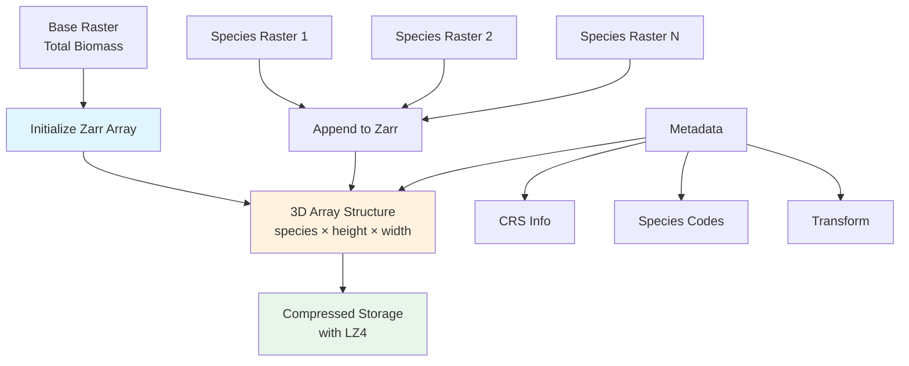

# Zarr Construction

The GridFIA Zarr construction system provides an efficient, scalable storage solution for multi-species forest biomass data, enabling fast analysis of large geospatial datasets.

## Overview

Zarr is an open-source data format designed for storing large N-dimensional arrays efficiently. GridFIA uses Zarr to create expandable 3D arrays that store biomass data for multiple tree species across North Carolina.

### Why Zarr?

- **Chunked storage** - Only load the data you need
- **Compression** - Typically 3-5x reduction in storage size
- **Parallel access** - Multiple processes can read simultaneously
- **Cloud-ready** - Works with object storage (S3, GCS)
- **Expandable** - Add new species without rewriting existing data

## Architecture



## Data Structure

### 3D Array Organization

```
Dimension 0 (Species):
  [0] = Total biomass (sum of all species)
  [1] = Species 1 (e.g., Loblolly Pine)
  [2] = Species 2 (e.g., Longleaf Pine)
  ...
  [n] = Species n

Dimension 1 (Height): Latitude pixels
Dimension 2 (Width): Longitude pixels
```

### Chunking Strategy

```python
chunks = (1, 1000, 1000)
# Optimized for:
# - Reading entire species layers
# - Spatial queries of ~1000×1000 pixel regions
# - Memory efficiency (~4MB per chunk)
```

## Creating a Zarr Container

### Basic Creation

```python
from gridfia.utils import create_expandable_zarr_from_base_raster

# Create zarr from total biomass raster
create_expandable_zarr_from_base_raster(
    base_raster_path="total_biomass_nc.tif",
    output_zarr_path="nc_biomass.zarr",
    chunk_size=(1, 1000, 1000)
)
```

### Step-by-Step Process

1. **Read base raster** (total biomass)
2. **Extract spatial metadata** (CRS, bounds, transform)
3. **Initialize 3D zarr array** with first layer
4. **Configure compression** (LZ4 for speed)
5. **Store metadata** as array attributes

### Example Output

```
Creating expandable Zarr from base raster: total_biomass_nc.tif
Output: nc_biomass.zarr
Raster dimensions: 14434 × 20021 pixels
Chunk size: (1, 1000, 1000)
Data type: float32
CRS: ESRI:102039
Valid pixels: 234,567,890 (81.2% coverage)
Biomass range: 0.1 - 456.7 Mg/ha
Mean biomass (valid pixels): 123.4 Mg/ha
```

## Adding Species Data

### Single Species Append

```python
from gridfia.utils import append_species_to_zarr

# Add a species layer
append_species_to_zarr(
    zarr_path="nc_biomass.zarr",
    species_raster_path="loblolly_pine.tif",
    species_code=131,
    species_name="Loblolly Pine"
)
```

### Batch Processing

```python
from gridfia.utils import batch_append_species_from_dir

# Process all species files in directory
results = batch_append_species_from_dir(
    zarr_path="nc_biomass.zarr",
    raster_dir="./species_rasters",
    pattern="*_biomass.tif"
)

print(f"Processed {results['success_count']} species")
print(f"Compression ratio: {results['compression_ratio']:.2f}x")
```

### From REST API

```python
from gridfia.external import BigMapRestClient
from scripts.add_api_species_to_zarr import APISpeciesProcessor

# Download and add species from API
processor = APISpeciesProcessor("nc_biomass.zarr")
processor.process_species("131")  # Loblolly Pine
```

## Metadata Management

### Stored Attributes

```python
import zarr

# Open zarr and inspect metadata
z = zarr.open_array("nc_biomass.zarr", mode='r')

print(z.attrs['description'])  # Dataset description
print(z.attrs['crs'])          # Coordinate reference system
print(z.attrs['bounds'])       # Spatial extent
print(z.attrs['species_codes']) # List of species codes
print(z.attrs['species_names']) # List of species names
```

### Metadata Schema

```json
{
  "description": "North Carolina Above Ground Biomass by Species",
  "source": "BIGMAP 2018 - Clipped to North Carolina",
  "crs": "ESRI:102039",
  "bounds": [-2195917.0, 1212972.0, -1595123.0, 1646299.0],
  "transform": [30.0, 0.0, -2195917.0, 0.0, -30.0, 1646299.0],
  "height": 14434,
  "width": 20021,
  "species_codes": [0, 131, 318, 111, 110],
  "species_names": ["Total", "Loblolly Pine", "Longleaf Pine", "Shortleaf Pine", "Slash Pine"],
  "units": "Mg/ha",
  "created": "2024-01-15T10:30:00",
  "compression": "blosc_lz4",
  "chunk_size": [1, 1000, 1000]
}
```

## Compression and Performance

### Compression Settings

```python
from numcodecs import Blosc

# Configure compression
compressor = Blosc(
    cname='lz4',      # Algorithm: lz4, zstd, zlib, snappy
    clevel=5,         # Level: 1-9 (higher = better ratio)
    shuffle=Blosc.SHUFFLE  # Byte shuffling for better compression
)
```

### Performance Benchmarks

| Operation | Time | Memory | Notes |
|-----------|------|--------|-------|
| Create zarr (289M pixels) | 45s | 1.2GB | Initial creation |
| Append species | 12s | 800MB | Per species |
| Read full species | 2.1s | 1.1GB | Entire layer |
| Read 1000×1000 chunk | 0.03s | 4MB | Single chunk |
| Compute statistics | 3.5s | 200MB | Using dask |

### Compression Ratios

```
Original size: 1.16 GB (float32)
Compressed size: 312 MB
Compression ratio: 3.7x
```

## Advanced Usage

### Parallel Processing with Dask

```python
import dask.array as da
import zarr

# Open zarr as dask array for parallel processing
z = zarr.open_array("nc_biomass.zarr", mode='r')
dask_array = da.from_zarr(z)

# Compute mean biomass for each species in parallel
species_means = da.mean(dask_array, axis=(1, 2)).compute()
```

### Spatial Queries

```python
# Extract data for specific region
def extract_region(zarr_path, bounds, species_index=0):
    z = zarr.open_array(zarr_path, mode='r')
    
    # Convert bounds to pixel indices
    transform = z.attrs['transform']
    col_start = int((bounds[0] - transform[2]) / transform[0])
    row_start = int((bounds[3] - transform[5]) / transform[4])
    col_end = int((bounds[2] - transform[2]) / transform[0])
    row_end = int((bounds[1] - transform[5]) / transform[4])
    
    # Extract region
    return z[species_index, row_start:row_end, col_start:col_end]
```

### Memory-Mapped Access

```python
# Access zarr without loading into memory
z = zarr.open_array("nc_biomass.zarr", mode='r')

# Process in chunks
for i in range(0, z.shape[1], 1000):
    for j in range(0, z.shape[2], 1000):
        chunk = z[:, i:i+1000, j:j+1000]
        # Process chunk without loading entire array
```

## Quality Assurance

### Validation Checks

```python
def validate_zarr(zarr_path):
    """Validate zarr integrity and consistency."""
    z = zarr.open_array(zarr_path, mode='r')
    
    # Check dimensions
    assert len(z.shape) == 3, "Must be 3D array"
    assert z.shape[0] >= 1, "Must have at least total layer"
    
    # Check metadata
    required_attrs = ['crs', 'transform', 'bounds', 'species_codes']
    for attr in required_attrs:
        assert attr in z.attrs, f"Missing required attribute: {attr}"
    
    # Check data integrity
    total_layer = z[0, :, :]
    assert np.all(total_layer >= 0), "Negative biomass values found"
    
    # Verify species sum approximates total
    if z.shape[0] > 1:
        species_sum = np.sum(z[1:, :, :], axis=0)
        diff = np.abs(total_layer - species_sum)
        assert np.mean(diff[total_layer > 0]) < 1.0, "Species sum doesn't match total"
    
    return True
```

### Repair and Maintenance

```python
# Recompute total from species layers
def repair_total_layer(zarr_path):
    z = zarr.open_array(zarr_path, mode='r+')
    if z.shape[0] > 1:
        z[0, :, :] = np.sum(z[1:, :, :], axis=0)
        print("Total layer recomputed from species data")

# Consolidate metadata
def consolidate_metadata(zarr_path):
    zarr.consolidate_metadata(zarr_path)
    print("Metadata consolidated for faster access")
```

## Integration Examples

### With REST API Pipeline

```python
from gridfia.external import BigMapRestClient
from gridfia.utils import append_species_to_zarr
import tempfile

client = BigMapRestClient()
zarr_path = "nc_biomass.zarr"

# Get missing species
all_species = client.list_available_species()
z = zarr.open_array(zarr_path, mode='r')
existing_codes = z.attrs.get('species_codes', [])

missing = [s for s in all_species if int(s['code']) not in existing_codes]

# Download and append missing species
for species in missing[:5]:  # Process 5 at a time
    with tempfile.NamedTemporaryFile(suffix='.tif') as tmp:
        # Download
        client.export_species_raster(
            species_code=species['code'],
            bbox=get_nc_bbox(),
            output_path=tmp.name
        )
        
        # Append
        append_species_to_zarr(
            zarr_path=zarr_path,
            species_raster_path=tmp.name,
            species_code=int(species['code']),
            species_name=species['name']
        )
```

### With Analysis Pipeline

```python
from gridfia.core import ForestMetricsProcessor

# Use zarr in analysis
processor = ForestMetricsProcessor(
    zarr_path="nc_biomass.zarr",
    config_path="config/analysis.yaml"
)

# Zarr enables efficient calculations
results = processor.calculate_metrics([
    "species_richness",
    "shannon_diversity",
    "dominant_species"
])
```

## Troubleshooting

### Common Issues

1. **Dimension Mismatch**
   ```python
   # Error: "Raster dimensions don't match zarr"
   # Solution: Ensure all rasters have same extent and resolution
   ```

2. **Memory Errors**
   ```python
   # Use smaller chunks
   create_expandable_zarr_from_base_raster(
       base_raster_path="input.tif",
       output_zarr_path="output.zarr",
       chunk_size=(1, 500, 500)  # Smaller chunks
   )
   ```

3. **Slow Performance**
   ```python
   # Enable parallel compression
   compressor = Blosc(cname='lz4', clevel=3, shuffle=Blosc.SHUFFLE, nthreads=4)
   ```

4. **Corrupted Zarr**
   ```python
   # Check and repair
   import zarr
   zarr.consolidate_metadata("nc_biomass.zarr")
   # Or recreate from source rasters
   ```

## Best Practices

1. **Choose appropriate chunk sizes**
   - Balance between memory usage and I/O efficiency
   - Typical: 500-2000 pixels per dimension

2. **Use consistent CRS**
   - All input rasters must have same projection
   - Reproject before appending if needed

3. **Validate data before appending**
   - Check for negative values
   - Verify spatial alignment
   - Ensure unique species codes

4. **Monitor storage growth**
   - Each species adds ~300MB (compressed)
   - Plan for 50+ species = ~15GB

5. **Regular maintenance**
   - Consolidate metadata periodically
   - Verify data integrity
   - Update documentation

## Performance Tips

- **Use native CRS** - Avoid reprojection during analysis
- **Align chunk boundaries** - Query data along chunk edges
- **Cache frequently used data** - Keep species list in memory
- **Use Dask for large operations** - Automatic parallelization
- **Consider cloud storage** - Zarr works well with S3/GCS

## See Also

- [REST API Download](rest-api-download.md) - Fetching species data from BIGMAP
- [Calculations](../api/calculations.md) - Forest metrics calculations
- [GridFIA API Reference](../api/gridfia.md) - Main API class documentation
- [Zarr Documentation](https://zarr.readthedocs.io/) - Official Zarr docs