# HDB Valuation Engine 🇸🇬

A quantitative tool for identifying undervalued Singapore public housing assets using spatial data analysis.

### **The Real-World Problems**
1. **The LRT Deception:** Commercial portals treat LRT (Light Rail) and MRT (Heavy Rail) as equal. This is false. LRT loops add significant commute latency. Buyers need a metric that rewards **True Connectivity**.
2. **The Lease Illusion:** Buyers often fixate on raw price, ignoring lease decay. A 'cheap' flat with 50 years remaining is often a worse asset than a pricier unit with 95 years.
3. **Data Overload:** With thousands of transactions, manual comparisons are impossible. Buyers need statistical anomaly detection, not just a search bar.

### **The Engineering Solution**
This engine ingests historical transaction data to calculate a **'True Value Score'** for every flat.
* **LRT-Exclusion Algorithm:** Uses Regex filtering and KDTree spatial indexing to calculate walking distance strictly to **MRT** nodes.
* **Depreciation Logic:** Normalizes price against remaining lease life to find the true cost of ownership.
* **Z-Score Ranking:** Identifies properties trading 2 deviations below their cluster average.

---

## Key Features
- **Dual Interface:** Use as a CLI tool OR as a Python module in your own projects
- Strict OOP pipeline with type hints and logging
- Robust lease parsing and inference (handles text and infers from `lease_commence_date` + `month`)
- Lease-adjusted price efficiency metric and group-wise Z-Score valuation
- Extended filters (exact/partial) and numeric ranges
- TransportScorer with KDTree and strict LRT exclusion (regex `^(BP|S[WE]|P[WE])`)
- Export to CSV/JSON/Parquet; optional full export
- Configurable peer grouping via `--group-by`
- Caching for fast repeated transport queries; cache management subcommand

## Algorithm Overview
1. Lease parsing/inference
   - Parse `remaining_lease` strings to float years (e.g., `61 years 04 months` → `61.33`).
   - If absent, infer years: `remaining_years = 99 - ((YYYY + (MM-1)/12) - lease_commence_year)`.
2. Price efficiency
   - `price_efficiency = resale_price / (floor_area_sqm * remaining_lease_years)`
3. Group-wise Z-Score
   - Group by `--group-by` (default: `town`, `flat_type`) and compute `z = (x - μ) / σ`.
4. Valuation score
   - `valuation_score = - z_price_efficiency` (higher → more undervalued).
5. Transport accessibility (optional)
   - Compute nearest MRT exit distance (LRT excluded) and `Accessibility_Score = max(0, 10 - 2 * dist_km)`.
   - By default adjusts price_efficiency; use `--no-accessibility-adjust` for analysis-only.

## System Architecture & Data Flow

```mermaid
flowchart TB
    subgraph Input["📊 Data Sources"]
        A1[HDB Resale CSV<br/>~200K+ Records]
        A2[LTA MRT Station<br/>GeoJSON API]
    end

    subgraph Pipeline["🔄 Processing Pipeline"]
        B1[HDBLoader<br/>Schema Normalization]
        B2[FeatureEngineer<br/>Lease Parsing & Inference]
        B3[TransportScorer<br/>KDTree Spatial Indexing]
        B4[ValuationEngine<br/>Statistical Scoring]
        B5[ReportGenerator<br/>Filtering & Ranking]
    end

    subgraph Algorithms["🧮 Core Algorithms"]
        C1["Lease Depreciation Model<br/>remaining = 99 - (txn_year - commence_year)"]
        C2["Price Efficiency<br/>PE = price / (area × lease_years)"]
        C3["LRT Exclusion Filter<br/>Regex: ^(BP|S[WE]|P[WE])"]
        C4["KDTree Nearest Neighbor<br/>O(log n) Spatial Query"]
        C5["Haversine Distance<br/>Great-Circle Calculation"]
        C6["Group-wise Z-Score<br/>z = (x - μ) / σ<br/>within (town, flat_type) cohorts"]
        C7["Accessibility Score<br/>AS = max(0, 10 - 2×dist_km)"]
        C8["Valuation Score<br/>VS = -z_PE × (1 + AS/10)"]
    end

    subgraph Output["📈 Outputs"]
        D1[Ranked DataFrame<br/>Top-N Undervalued Units]
        D2[CLI Report<br/>Formatted Table]
        D3[Export Files<br/>CSV/JSON/Parquet]
        D4[Programmatic API<br/>Python Module Integration]
    end

    A1 --> B1
    A2 --> B3
    B1 --> B2
    B2 --> C1
    B2 --> C2
    C1 --> B4
    C2 --> B4
    B3 --> C3
    C3 --> C4
    C4 --> C5
    C5 --> C7
    B4 --> C6
    C6 --> C8
    C7 --> C8
    C8 --> B5
    B5 --> D1
    D1 --> D2
    D1 --> D3
    D1 --> D4

    style Input fill:#e1f5ff,stroke:#01579b,stroke-width:2px
    style Pipeline fill:#f3e5f5,stroke:#4a148c,stroke-width:2px
    style Algorithms fill:#fff3e0,stroke:#e65100,stroke-width:2px
    style Output fill:#e8f5e9,stroke:#1b5e20,stroke-width:2px
    
    style C4 fill:#ffeb3b,stroke:#f57f17,stroke-width:3px
    style C6 fill:#ffeb3b,stroke:#f57f17,stroke-width:3px
    style C8 fill:#ffeb3b,stroke:#f57f17,stroke-width:3px
```



### Technical Highlights

**🎯 Statistical Rigor**
- Group-wise Z-score normalization ensures fair peer comparison across 26 towns and 7 flat types
- Robust handling of zero-variance groups and missing data
- Mathematical foundation allows for reproducible, bias-free property valuation

**🗺️ Geospatial Innovation**
- KDTree spatial indexing enables O(log n) nearest-neighbor queries on 200K+ properties
- Haversine distance calculation accounts for Earth's curvature (±0.5% accuracy)
- Regex-based LRT exclusion (BP/SW/SE/PW/PE lines) ensures only heavy rail stations are considered
- Caching mechanism reduces repeated spatial queries from minutes to milliseconds

**💰 Financial Modeling**
- Lease depreciation model adjusts for Singapore's 99-year leasehold system
- Time-value-of-money consideration through remaining lease normalization
- Price efficiency metric captures $/sqm/year for true cost-of-ownership analysis

**🏗️ Software Engineering**
- Object-oriented pipeline with strict type hints (PEP 484 compliant)
- Dual interface: CLI for analysts, Python API for integration
- 66% test coverage with 26/26 tests passing
- Comprehensive logging and error handling for production reliability

## Installation

From PyPI:
```
pip install hdb-valuation-engine
```

From source (recommended in a virtual environment):
```
python3 -m venv .venv
source .venv/bin/activate  # Windows: .venv\\Scripts\\Activate.ps1
pip install -r requirements.txt
```

## Quick Start

Platform-agnostic data fetching (no Make needed):
- Fetch all supported datasets (HDB resale CSV + MRT exits GeoJSON):
```
hdb-valuation-engine fetch
```
- Fetch entire HDB resale dataset (no row limit) plus MRT exits:
```
hdb-valuation-engine fetch --limit 0
```
- Only MRT exits to a custom path:
```
hdb-valuation-engine fetch --datasets mrt --mrt-out .data/LTAMRTStationExitGEOJSON.geojson
```
- Only HDB resale CSV with 10k rows to default location:
```
hdb-valuation-engine fetch --datasets resale --limit 10000
```

**Module usage (NEW - Clean Python API):**
```python
from hdb_valuation_engine import HDBValuationEngineApp

# Initialize the engine
app = HDBValuationEngineApp()

# Process data and get results
results = app.process(
    input_path="ResaleFlatPrices/Resale flat prices based on registration date from Jan-2017 onwards.csv",
    town="PUNGGOL",
    budget=600000,
    top_n=5
)

# Results is a pandas DataFrame
print(results)
print(f"\nFound {len(results)} undervalued properties")

# Access specific columns
for idx, row in results.iterrows():
    print(f"{row['town']}, {row['flat_type']}: ${row['resale_price']:,.0f} (Score: {row['valuation_score']:.2f})")
```

**With MRT accessibility:**
```python
from hdb_valuation_engine import HDBValuationEngineApp

app = HDBValuationEngineApp()

results = app.process(
    input_path="resale.csv",
    mrt_catalog=".data/LTAMRTStationExitGEOJSON.geojson",
    town="BISHAN",
    budget=800000,
    top_n=10
)

# Results include MRT distance and accessibility scores
print(results[['town', 'resale_price', 'Nearest_MRT', 'Dist_m', 'valuation_score']])
```

**See `EXAMPLES.md` for 10+ comprehensive usage examples including:**
- Using pre-loaded DataFrames
- Custom grouping and filters
- Exporting results
- Using individual pipeline components
- Integration with Flask/web APIs

CLI usage (after install):
```
hdb-valuation-engine --input "ResaleFlatPrices/Resale flat prices based on registration date from Jan-2017 onwards.csv" --top 5 -v
```

## Usage
```
hdb-valuation-engine --input <path/to/file.csv> [OPTIONS]
```

### Core options
- `--input` Path to HDB resale CSV data
- `--top` Number of results to display (default: 10)
- Logging: `-v` (INFO) or `-vv` (DEBUG)

### Filters
- Town: `--town PUNGGOL` (exact), `--town-like unggol` (partial)
- Flat Type: `--flat-type "5 ROOM"` (exact), `--flat-type-like room` (partial)
- Flat Model: `--flat-model "Improved"` (exact), `--flat-model-like improv` (partial)
- Storey: `--storey-min 7 --storey-max 12`
- Area (sqm): `--area-min 60 --area-max 120`
- Remaining Lease (years): `--lease-min 60 --lease-max 95`
- Budget (max `resale_price`): `--budget 600000`

### Grouping (peer comparison)
```
--group-by town flat_type [flat_model]
```

## Transport Accessibility (MRT via GeoJSON)
- Fast, cached KDTree for nearest MRT exit queries (10k+ rows). Cache saved under `.cache_transport/`.
- Provide LTA MRT Station Exit GeoJSON to enable accessibility scoring:
```
# You can fetch a current GeoJSON via the built-in fetcher
hdb-valuation-engine fetch --datasets mrt --mrt-out .data/LTAMRTStationExitGEOJSON.geojson

# Then reference it when running valuations
--mrt-catalog .data/LTAMRTStationExitGEOJSON.geojson
```
- Excludes LRT strictly via regex `^(BP|S[WE]|P[WE])` and filters names containing `LRT` as a fallback.
- Adds:
  - `Nearest_MRT`
  - `Dist_m`
  - `Accessibility_Score = max(0, 10 - 2 * dist_km)`
- Analysis-only mode (no adjustment):
```
--no-accessibility-adjust
```

### Exporting
```
--output top10.csv --output-format csv            # CSV (default)
--output top10.json --output-format json          # JSON
--output top10.parquet --output-format parquet    # Parquet (falls back to CSV if engine missing)
--export-full                                     # Export all filtered rows instead of Top-N
```

## Quick Usage Examples

0) Cache management subcommand
```
# Show cache directory
hdb-valuation-engine cache -v

# Clear cache in default location
hdb-valuation-engine cache --clear -v

# Use a custom cache dir
hdb-valuation-engine cache --transport-cache-dir .transport_cache --clear -v
```

1) Build and cache KDTree from LTA GeoJSON; show Top-10 with adjustment:
```
hdb-valuation-engine \
  --input "ResaleFlatPrices/Resale flat prices based on registration date from Jan-2017 onwards.csv" \
  --mrt-catalog ".data/LTAMRTStationExitGEOJSON.geojson" \
  --top 10 -v
```

2) Use cached KDTree on subsequent runs (faster); analysis-only mode (no price adjustment):
```
hdb-valuation-engine \
  --input "ResaleFlatPrices/Resale flat prices based on registration date from Jan-2017 onwards.csv" \
  --mrt-catalog ".data/LTAMRTStationExitGEOJSON.geojson" \
  --no-accessibility-adjust --top 10 -v
```

3) Custom cache directory and force clear before building:
```
hdb-valuation-engine \
  --input "ResaleFlatPrices/Resale flat prices based on registration date from Jan-2017 onwards.csv" \
  --mrt-catalog ".data/LTAMRTStationExitGEOJSON.geojson" \
  --transport-cache-dir ".transport_cache" --clear-transport-cache --top 5 -v
```

4) CSV catalog path (still supported; auto-excludes LRT lines):
```
hdb-valuation-engine \
  --input "ResaleFlatPrices/Resale flat prices based on registration date from Jan-2017 onwards.csv" \
  --mrt-catalog "/path/to/mrt_catalog.csv" --top 5 -v
```

5) Combine with group-by and export options:
```
hdb-valuation-engine \
  --input "ResaleFlatPrices/Resale flat prices based on registration date from Jan-2017 onwards.csv" \
  --mrt-catalog ".data/LTAMRTStationExitGEOJSON.geojson" \
  --group-by town flat_type flat_model \
  --export-full --output top.json --output-format json --top 10 -v
```

## Smoke Test Summary
- 2017 onwards: Parsed `remaining_lease` strings successfully; produced Top-10 Punggol table under budget 600k. Export worked.
- 2012–2014: Inferred remaining lease from `lease_commence_date` and `month`; produced Top-10 Punggol table.
- 2000–Feb 2012: Inference path also worked; produced Top-5 for Ang Mo Kio under budget 200k.
- Extended filters and partial matching verified; `--output`, `--export-full`, and `--output-format` worked as expected.

## Design & Implementation Notes
- Columns normalized to lowercase with underscores
- Robust z-score handling for zero-variance groups
- Logging across load, feature engineering, scoring, filtering, and export

## Release and Tagging

To create a 0.1.0 release and push the tag:
```
git add -A
git commit -m "chore(release): cut 0.1.0"

git tag -a v0.1.0 -m "Initial PyPI packaging for hdb-valuation-engine"

git push origin main
git push origin v0.1.0
```

## Running Tests

Note: You can fetch data without Make on any platform using the built-in fetch command:
```
# Fetch all datasets with defaults
hdb-valuation-engine fetch

# Fetch entire resale CSV and MRT exits
hdb-valuation-engine fetch --limit 0
```

- Recommended: use a virtual environment
```
python3 -m venv .venv
source .venv/bin/activate  # Windows: .venv\\Scripts\\Activate.ps1
pip install -r requirements.txt
pytest -q
```

### Optional dataset for an extra smoke test
One test is skipped by default unless a local dataset is available. To enable it:
- Create a folder named `ResaleFlatPrices` at the repository root (same level as `tests/` and `README.md`).
- Place one or more HDB resale CSV files inside that folder, for example:
  - `Resale flat prices based on registration date from Jan-2017 onwards.csv`

You can fetch a small sample automatically with:
```
make setup-venv          # one-time environment setup
make fetch-sample-data   # downloads a subset into ./ResaleFlatPrices/
```

When this folder exists and contains at least one `.csv` file, the optional smoke test in `tests/test_cli_export.py::TestOptionalRealDataset` will run. If the folder is missing or empty, the test is skipped with reason:

```
ResaleFlatPrices folder not present; skipping optional smoke test
```
