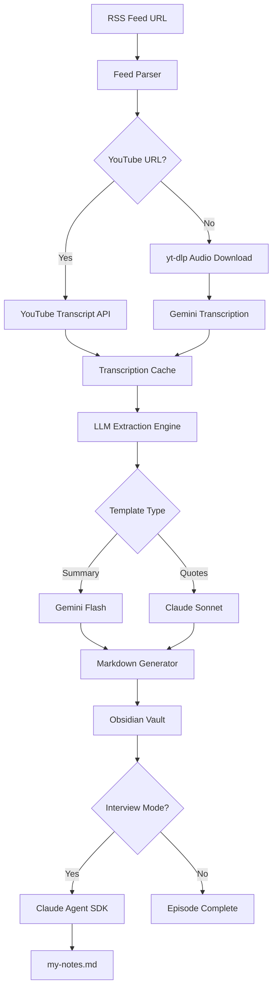
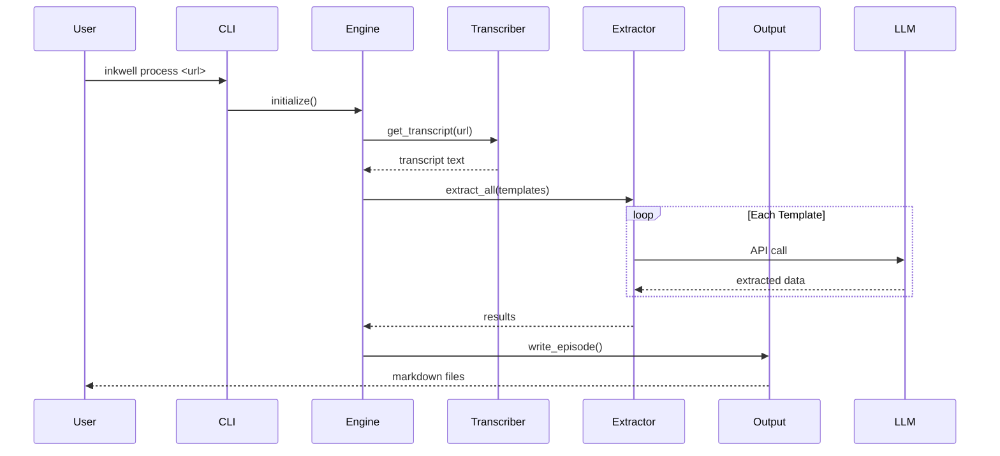
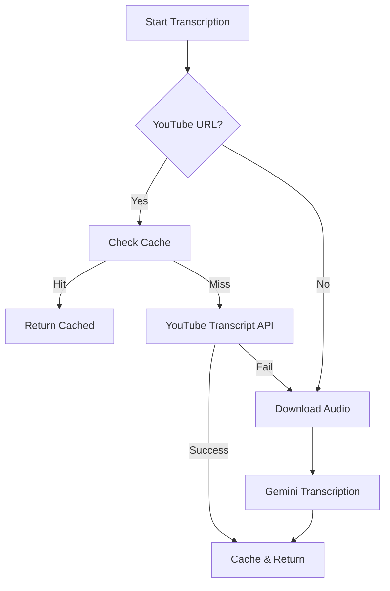

# 📚 Upgrade Documentation to Production Grade for World-Class DX/UX

## Overview

Elevate Inkwell CLI documentation to production-grade standards, providing world-class Developer Experience (DX) and User Experience (UX). While the project has excellent developer documentation through the DKS (Developer Knowledge System) and solid user guides, it lacks critical community infrastructure, visual aids, and the polish expected of a 1.0 production release.

**Current State**: v1.0.0 with comprehensive internal docs but missing public-facing infrastructure
**Goal**: Make Inkwell CLI the gold standard for CLI tool documentation

## Problem Statement

### Critical Gaps Blocking Open Source Adoption

1. **Zero Community Infrastructure**
   - No CONTRIBUTING.md, CODE_OF_CONDUCT.md, or SECURITY.md
   - No GitHub issue/PR templates
   - No CI/CD workflows
   - No automated testing or coverage reporting

2. **No Visual Documentation**
   - Zero screenshots, diagrams, or terminal recordings
   - Text-only documentation in 2025
   - No architecture visualizations
   - No workflow diagrams

3. **Installation Friction**
   - Not published to PyPI (requires git clone)
   - No pip install, homebrew, or docker options
   - No platform-specific guides
   - Missing troubleshooting section

4. **Missing Progressive Disclosure**
   - No clear learning path (beginner → advanced)
   - Limited quick start examples
   - No comparison with alternatives
   - Missing integration guides (GitHub Actions, cron, etc.)

## Proposed Solution

Implement a **6-phase documentation upgrade** following CLI best practices from clig.dev, GitHub CLI, uv, and Python packaging standards (pyOpenSci, PEP 257).

### Documentation Architecture

```
Progressive Disclosure Pattern (clig.dev):
Introduction → Getting Started → Guides → Concepts → Reference
```

## Technical Approach

### Phase 1: Community Infrastructure (Week 1) 🚨 BLOCKING

**Goal**: Enable external contributions and establish trust

#### Files to Create

**`.github/CONTRIBUTING.md`** (Standalone version of README dev setup)
```markdown
# Contributing to Inkwell CLI

## Quick Start
1. Install uv: `curl -LsSf https://astral.sh/uv/install.sh | sh`
2. Clone: `git clone https://github.com/chekos/inkwell-cli.git`
3. Setup: `cd inkwell-cli && uv sync --dev`
4. Test: `uv run pytest`

## Development Workflow
- Branch naming: `feat/feature-name`, `fix/bug-name`, `docs/doc-name`
- Commit messages: Conventional Commits format
- Testing: `uv run pytest` (must pass before PR)
- Linting: Pre-commit hooks run automatically
- Documentation: Update CHANGELOG.md and create ADR if architectural

## DKS (Developer Knowledge System)
- **ADRs**: Use `docs/adr/000-template.md` for decisions
- **Devlogs**: Document implementation in `docs/devlog/`
- **Lessons**: Capture learnings in `docs/lessons/`

## PR Process
1. Create issue first (discussion)
2. Fork and create feature branch
3. Write tests (pytest, coverage target: 95%+)
4. Update docs (user guide, API docs, CHANGELOG)
5. Submit PR with checklist complete
6. Address review feedback
```

**`.github/CODE_OF_CONDUCT.md`** (Contributor Covenant 2.1)
- Use standard template from https://www.contributor-covenant.org/
- Enforcement: Report to maintainer email
- Scope: Project spaces (GitHub, Discord, etc.)

**`.github/SECURITY.md`**
```markdown
# Security Policy

## Supported Versions

| Version | Supported          |
| ------- | ------------------ |
| 1.0.x   | :white_check_mark: |

## Reporting Vulnerabilities

**DO NOT** report security vulnerabilities through public GitHub issues.

Instead, email: security@yourdomain.com

Include:
- Description of vulnerability
- Steps to reproduce
- Potential impact
- Suggested fix (if any)

We'll respond within 48 hours.

## Security Best Practices

### API Keys
- Never commit API keys to git
- Use environment variables only
- Rotate keys regularly
- Use .env files (never commit them)

### Credentials
- Inkwell stores encrypted credentials in XDG_CONFIG_HOME
- Encryption uses Fernet (symmetric)
- Delete credentials: `inkwell config remove-credential <name>`
```

**`.github/ISSUE_TEMPLATE/bug_report.yml`**
```yaml
name: Bug Report
description: Report a bug in Inkwell CLI
title: "[Bug]: "
labels: ["bug", "triage"]
body:
  - type: markdown
    attributes:
      value: Thanks for reporting a bug! Please fill out the sections below.

  - type: textarea
    id: description
    attributes:
      label: Describe the bug
      description: Clear description of what happened
      placeholder: When I run `inkwell process <url>`, I get...
    validations:
      required: true

  - type: textarea
    id: reproduction
    attributes:
      label: Steps to reproduce
      description: Minimal steps to reproduce the issue
      placeholder: |
        1. Run `inkwell process https://example.com/feed.xml`
        2. See error...
    validations:
      required: true

  - type: textarea
    id: expected
    attributes:
      label: Expected behavior
      description: What should have happened?
    validations:
      required: true

  - type: textarea
    id: environment
    attributes:
      label: Environment
      description: Output of `inkwell version` and `python --version`
      render: shell
    validations:
      required: true

  - type: textarea
    id: logs
    attributes:
      label: Logs
      description: Paste relevant logs (run with `--verbose`)
      render: shell

  - type: textarea
    id: additional
    attributes:
      label: Additional context
      description: Screenshots, config files, etc.
```

**`.github/ISSUE_TEMPLATE/feature_request.yml`**
```yaml
name: Feature Request
description: Suggest a new feature
title: "[Feature]: "
labels: ["enhancement"]
body:
  - type: textarea
    id: problem
    attributes:
      label: Problem to solve
      description: What problem does this feature solve?
      placeholder: I'm frustrated when...
    validations:
      required: true

  - type: textarea
    id: solution
    attributes:
      label: Proposed solution
      description: How would you solve this?
    validations:
      required: true

  - type: textarea
    id: alternatives
    attributes:
      label: Alternatives considered
      description: Other solutions you've thought about

  - type: textarea
    id: additional
    attributes:
      label: Additional context
      description: Examples, mockups, etc.
```

**`.github/pull_request_template.md`**
```markdown
## Description
<!-- Clear description of what this PR does -->

## Type of Change
- [ ] Bug fix (non-breaking)
- [ ] New feature (non-breaking)
- [ ] Breaking change
- [ ] Documentation update
- [ ] Refactoring/code quality

## Checklist
- [ ] Tests added/updated (pytest)
- [ ] Documentation updated (user guide, API docs)
- [ ] CHANGELOG.md entry added
- [ ] ADR created (if architectural decision)
- [ ] Devlog created (if feature implementation)
- [ ] Pre-commit hooks pass
- [ ] All tests pass locally (`uv run pytest`)

## Testing
<!-- How was this tested? -->

## Screenshots (if applicable)
<!-- Paste screenshots or terminal recordings -->

## Related Issues
Closes #<issue_number>
```

**Acceptance Criteria**:
- [ ] CONTRIBUTING.md with development setup, testing, PR process
- [ ] CODE_OF_CONDUCT.md (Contributor Covenant 2.1)
- [ ] SECURITY.md with vulnerability reporting
- [ ] Issue templates: bug_report.yml, feature_request.yml, documentation.yml
- [ ] PR template with comprehensive checklist

### Phase 2: GitHub Actions & Automation (Week 1)

**Goal**: Automate testing, releases, and documentation deployment

#### Workflows to Create

**`.github/workflows/ci.yml`** (Test on every PR)
```yaml
name: CI

on:
  push:
    branches: [main]
  pull_request:

jobs:
  test:
    runs-on: ${{ matrix.os }}
    strategy:
      matrix:
        os: [ubuntu-latest, macos-latest, windows-latest]
        python: ["3.10", "3.11", "3.12", "3.13"]

    steps:
      - uses: actions/checkout@v4
      - name: Install uv
        uses: astral-sh/setup-uv@v4
      - name: Set up Python
        run: uv python install ${{ matrix.python }}
      - name: Install dependencies
        run: uv sync --dev
      - name: Run linters
        run: |
          uv run ruff check .
          uv run mypy src/
      - name: Run tests
        run: uv run pytest --cov --cov-report=xml
      - name: Upload coverage
        uses: codecov/codecov-action@v4
        with:
          token: ${{ secrets.CODECOV_TOKEN }}
```

**`.github/workflows/release.yml`** (PyPI publish on tag)
```yaml
name: Release

on:
  push:
    tags:
      - 'v*'

jobs:
  release:
    runs-on: ubuntu-latest
    permissions:
      id-token: write
      contents: write

    steps:
      - uses: actions/checkout@v4
      - uses: astral-sh/setup-uv@v4
      - name: Build package
        run: uv build
      - name: Publish to PyPI
        uses: pypa/gh-action-pypi-publish@release/v1
      - name: Create GitHub Release
        uses: softprops/action-gh-release@v1
        with:
          files: dist/*
          generate_release_notes: true
```

**`.github/workflows/docs.yml`** (Deploy MkDocs on push to main)
```yaml
name: Documentation

on:
  push:
    branches: [main]

jobs:
  deploy:
    runs-on: ubuntu-latest
    steps:
      - uses: actions/checkout@v4
      - uses: astral-sh/setup-uv@v4
      - name: Install dependencies
        run: uv sync --dev
      - name: Deploy docs
        run: uv run mkdocs gh-deploy --force
```

**`.github/dependabot.yml`** (Automated dependency updates)
```yaml
version: 2
updates:
  - package-ecosystem: "pip"
    directory: "/"
    schedule:
      interval: "weekly"
    labels:
      - "dependencies"
```

**Acceptance Criteria**:
- [ ] CI workflow runs tests on all Python versions (3.10-3.13)
- [ ] CI runs on ubuntu, macos, windows
- [ ] Code coverage reported to Codecov
- [ ] Release workflow publishes to PyPI on tag push
- [ ] Docs workflow deploys MkDocs to GitHub Pages
- [ ] Dependabot configured for weekly updates
- [ ] Status badges added to README.md

### Phase 3: Visual & Interactive Documentation (Week 2)

**Goal**: Add screenshots, diagrams, and terminal recordings

#### Visuals to Create

**Screenshots** (`docs/assets/screenshots/`)
- [ ] `installation.png` - Successful installation
- [ ] `first-process.png` - Processing first episode
- [ ] `interview-mode.png` - Interactive interview session
- [ ] `obsidian-vault.png` - Generated markdown in Obsidian
- [ ] `cost-summary.png` - Cost tracking output
- [ ] `batch-processing.png` - Multiple episodes processing

**Architecture Diagrams** (`docs/assets/diagrams/`)

**`system-architecture.mmd`** (Mermaid diagram)


**`component-interaction.mmd`**


**Terminal Recordings** (`docs/assets/recordings/`)

Use `asciinema` for authentic terminal recordings:
- [ ] `quick-start.cast` - 60 second demo (install → first episode)
- [ ] `interview-mode.cast` - Interactive interview session
- [ ] `batch-processing.cast` - Processing multiple episodes
- [ ] `troubleshooting.cast` - Common error and fix

**Workflow Diagrams** (`docs/assets/diagrams/`)

**`transcription-decision-tree.mmd`**


**Acceptance Criteria**:
- [ ] 6+ screenshots covering key workflows
- [ ] System architecture Mermaid diagram
- [ ] Component interaction sequence diagram
- [ ] Transcription decision tree flowchart
- [ ] 4 asciinema terminal recordings
- [ ] All visuals embedded in relevant docs
- [ ] Images optimized (<500KB each)

### Phase 4: Installation & Distribution (Week 2-3)

**Goal**: Make installation effortless on all platforms

#### PyPI Publication

**Update `pyproject.toml`**:
```toml
[project]
name = "inkwell-cli"
version = "1.0.0"
description = "Transform podcasts into structured, searchable markdown notes"
readme = "README.md"
requires-python = ">=3.10"
license = {text = "BSD-3-Clause"}  # Fix: Was MIT, LICENSE is BSD
authors = [
    {name = "Sergio Sanchez", email = "chekos@users.noreply.github.com"}
]
keywords = ["podcast", "markdown", "obsidian", "llm", "transcription", "notes"]
classifiers = [
    "Development Status :: 5 - Production/Stable",
    "Environment :: Console",
    "Intended Audience :: End Users/Desktop",
    "License :: OSI Approved :: BSD License",
    "Operating System :: OS Independent",
    "Programming Language :: Python :: 3",
    "Programming Language :: Python :: 3.10",
    "Programming Language :: Python :: 3.11",
    "Programming Language :: Python :: 3.12",
    "Programming Language :: Python :: 3.13",
    "Topic :: Multimedia :: Sound/Audio",
    "Topic :: Text Processing :: Markup :: Markdown",
    "Typing :: Typed",
]

[project.urls]
Homepage = "https://github.com/chekos/inkwell-cli"
Documentation = "https://chekos.github.io/inkwell-cli"
Repository = "https://github.com/chekos/inkwell-cli"
Issues = "https://github.com/chekos/inkwell-cli/issues"
Changelog = "https://github.com/chekos/inkwell-cli/blob/main/CHANGELOG.md"

[project.scripts]
inkwell = "inkwell.cli:app"
```

**PyPI Deployment Steps**:
```bash
# 1. Build
uv build

# 2. Test on TestPyPI
uv publish --publish-url https://test.pypi.org/legacy/ dist/*

# 3. Test installation
pip install --index-url https://test.pypi.org/simple/ inkwell-cli

# 4. Publish to PyPI (via GitHub Actions on tag)
git tag v1.0.0
git push origin v1.0.0
```

#### Homebrew Formula

**Create `homebrew-inkwell/inkwell.rb`**:
```ruby
class Inkwell < Formula
  include Language::Python::Virtualenv

  desc "Transform podcasts into structured, searchable markdown notes"
  homepage "https://github.com/chekos/inkwell-cli"
  url "https://files.pythonhosted.org/packages/.../inkwell-cli-1.0.0.tar.gz"
  sha256 "..."
  license "BSD-3-Clause"

  depends_on "python@3.11"
  depends_on "ffmpeg"

  resource "anthropic" do
    url "https://files.pythonhosted.org/packages/.../anthropic-..."
    sha256 "..."
  end

  def install
    virtualenv_install_with_resources
  end

  test do
    system "#{bin}/inkwell", "--version"
  end
end
```

#### Docker Image

**`Dockerfile`**:
```dockerfile
FROM python:3.11-slim

# Install system dependencies
RUN apt-get update && apt-get install -y \
    ffmpeg \
    curl \
    && rm -rf /var/lib/apt/lists/*

# Install uv
RUN curl -LsSf https://astral.sh/uv/install.sh | sh
ENV PATH="/root/.cargo/bin:$PATH"

# Set working directory
WORKDIR /app

# Copy project files
COPY pyproject.toml uv.lock ./
COPY src/ src/

# Install dependencies
RUN uv sync --frozen

# Set entrypoint
ENTRYPOINT ["uv", "run", "inkwell"]
```

**Usage**:
```bash
docker build -t inkwell-cli .
docker run -v ~/.config/inkwell:/root/.config/inkwell \
           -v ./output:/app/output \
           -e ANTHROPIC_API_KEY \
           -e GOOGLE_API_KEY \
           inkwell-cli process <url>
```

#### Platform-Specific Guides

**`docs/installation/index.md`**:
```markdown
# Installation

## Quick Install (Recommended)

### macOS / Linux
\`\`\`bash
pip install inkwell-cli
\`\`\`

### Windows
\`\`\`powershell
pip install inkwell-cli
\`\`\`

## Alternative Methods

### Homebrew (macOS/Linux)
\`\`\`bash
brew install chekos/tap/inkwell
\`\`\`

### Docker
\`\`\`bash
docker pull chekos/inkwell-cli
\`\`\`

### From Source
\`\`\`bash
# Install uv (package manager)
curl -LsSf https://astral.sh/uv/install.sh | sh

# Clone and install
git clone https://github.com/chekos/inkwell-cli.git
cd inkwell-cli
uv sync
uv run inkwell --version
\`\`\`

## System Requirements

- Python 3.10+
- ffmpeg (audio processing)
- 2GB disk space (for audio cache)
- API keys: Anthropic (Claude) and/or Google (Gemini)

## Post-Installation

### Configure API Keys
\`\`\`bash
export ANTHROPIC_API_KEY="sk-ant-..."
export GOOGLE_API_KEY="..."
\`\`\`

Or use interactive setup:
\`\`\`bash
inkwell config set-credential anthropic
inkwell config set-credential google
\`\`\`

### Verify Installation
\`\`\`bash
inkwell --version
inkwell feeds list
\`\`\`

## Troubleshooting

### ffmpeg not found
**macOS**: `brew install ffmpeg`
**Ubuntu**: `sudo apt install ffmpeg`
**Windows**: Download from https://ffmpeg.org/

### API key errors
Run `inkwell config verify` to check your API key configuration.

See full [Troubleshooting Guide](../troubleshooting.md) for more help.
```

**Acceptance Criteria**:
- [ ] Package published to PyPI as `inkwell-cli`
- [ ] Homebrew formula created and tested
- [ ] Docker image built and published to Docker Hub
- [ ] Platform-specific installation guides (macOS, Linux, Windows)
- [ ] Troubleshooting guide for installation issues
- [ ] Verify installation on all platforms
- [ ] Update README.md with installation badges

### Phase 5: Enhanced README & Progressive Disclosure (Week 3)

**Goal**: Perfect first impression with badges, quick start, and clear navigation

#### Enhanced README.md Structure

```markdown
<div align="center">

# 🖋️ Inkwell CLI

**Transform podcasts into structured, searchable markdown notes**

[](https://pypi.org/project/inkwell-cli/)
[](https://pypi.org/project/inkwell-cli/)
[](https://github.com/chekos/inkwell-cli/actions)
[](https://codecov.io/gh/chekos/inkwell-cli)
[](LICENSE)
[](https://chekos.github.io/inkwell-cli/)

[Quick Start](#quick-start) •
[Documentation](https://chekos.github.io/inkwell-cli/) •
[Examples](#examples) •
[Contributing](CONTRIBUTING.md)


</div>

## ✨ Features

- 🎙️ **Podcast Processing** - Download and transcribe from any RSS feed
- 🤖 **LLM Extraction** - Extract quotes, concepts, summaries using Claude/Gemini
- 💬 **Interview Mode** - Interactive Q&A with AI about episodes
- 📝 **Obsidian Ready** - Generates markdown with wikilinks, tags, Dataview
- 💰 **Cost Tracking** - Monitor LLM API costs
- 🔒 **Secure** - Encrypted credential storage
- ⚡ **Fast** - Multi-layer caching (transcripts, extractions)

## 🚀 Quick Start

### Install
\`\`\`bash
pip install inkwell-cli
\`\`\`

### Configure API Keys
\`\`\`bash
export ANTHROPIC_API_KEY="sk-ant-..."
export GOOGLE_API_KEY="..."
\`\`\`

### Process Your First Episode
\`\`\`bash
# Add a podcast feed
inkwell feeds add "https://feeds.simplecast.com/54nAGcIl"

# Process latest episode
inkwell process --interview

# 🎉 Check ./output/ for your markdown notes!
\`\`\`

## 📖 Documentation

- **[User Guide](docs/user-guide.md)** - Complete feature reference
- **[Tutorial](docs/tutorial.md)** - 10-minute walkthrough
- **[API Reference](https://chekos.github.io/inkwell-cli/api/)** - Auto-generated API docs
- **[Examples](docs/examples.md)** - 15+ real-world workflows
- **[Troubleshooting](docs/troubleshooting.md)** - Common issues & solutions

## 🎯 Use Cases

- **Research** - Extract insights from technical podcasts
- **Knowledge Management** - Build personal knowledge graph
- **Content Creation** - Quote discovery for articles/videos
- **Learning** - Reinforce listening with active reflection

## 🏗️ Architecture

```mermaid
[Paste system-architecture.mmd here]
```

## 💡 Examples

### Batch Process Multiple Episodes
\`\`\`bash
inkwell batch process --feed "My Podcast" --count 5 --parallel 2
\`\`\`

### Custom Extraction Templates
\`\`\`bash
inkwell process <url> --template custom/deep-dive.yaml
\`\`\`

See [Examples](docs/examples.md) for 15+ workflows.

## 🤝 Contributing

We love contributions! See [CONTRIBUTING.md](CONTRIBUTING.md) for:
- Development setup
- Testing guidelines
- PR process
- Code of Conduct

## 📊 Comparison

| Feature | Inkwell | Manual Notes | Other Tools |
|---------|---------|--------------|-------------|
| Auto-transcription | ✅ | ❌ | ⚠️ |
| LLM Extraction | ✅ | ❌ | ❌ |
| Interview Mode | ✅ | ❌ | ❌ |
| Obsidian Integration | ✅ | ⚠️ | ❌ |
| Cost Tracking | ✅ | N/A | ❌ |
| Batch Processing | ✅ | ❌ | ⚠️ |

## 📜 License

BSD 3-Clause - See [LICENSE](LICENSE) for details.

## 🙏 Acknowledgments

Built with:
- [Typer](https://typer.tiangolo.com/) - CLI framework
- [Rich](https://rich.readthedocs.io/) - Terminal UI
- [Claude](https://anthropic.com/) & [Gemini](https://ai.google.dev/) - LLM APIs
- [MkDocs Material](https://squidfunk.github.io/mkdocs-material/) - Documentation

---

<div align="center">

**⭐ Star this repo if you find it useful!**

[Report Bug](https://github.com/chekos/inkwell-cli/issues) •
[Request Feature](https://github.com/chekos/inkwell-cli/issues) •
[Ask Question](https://github.com/chekos/inkwell-cli/discussions)

</div>
```

#### MkDocs Site Structure

**`mkdocs.yml`** (Enhanced):
```yaml
site_name: Inkwell CLI
site_description: Transform podcasts into structured markdown notes
site_url: https://chekos.github.io/inkwell-cli/
repo_url: https://github.com/chekos/inkwell-cli
repo_name: chekos/inkwell-cli

theme:
  name: material
  palette:
    - scheme: default
      primary: indigo
      accent: indigo
      toggle:
        icon: material/brightness-7
        name: Switch to dark mode
    - scheme: slate
      primary: indigo
      accent: indigo
      toggle:
        icon: material/brightness-4
        name: Switch to light mode
  features:
    - navigation.instant
    - navigation.tracking
    - navigation.tabs
    - navigation.sections
    - navigation.expand
    - navigation.top
    - search.suggest
    - search.highlight
    - content.code.copy
    - content.tabs.link

plugins:
  - search
  - mkdocstrings:
      handlers:
        python:
          options:
            docstring_style: google
            show_source: true
            show_root_heading: true
  - mike:  # Versioning
      version_selector: true

nav:
  - Home: index.md
  - Getting Started:
      - Installation: installation/index.md
      - Quick Start: getting-started/quickstart.md
      - Configuration: getting-started/configuration.md
  - User Guide:
      - Overview: user-guide/index.md
      - Feed Management: user-guide/feeds.md
      - Episode Processing: user-guide/processing.md
      - Interview Mode: user-guide/interview.md
      - Batch Operations: user-guide/batch.md
      - Cost Management: user-guide/costs.md
  - Tutorials:
      - 10-Minute Walkthrough: tutorial.md
      - Custom Templates: tutorials/custom-templates.md
      - Obsidian Setup: tutorials/obsidian-setup.md
      - Dataview Queries: tutorials/dataview-queries.md
  - Reference:
      - CLI Commands: reference/cli.md
      - Configuration: reference/configuration.md
      - Templates: reference/templates.md
      - Environment Variables: reference/env-vars.md
      - API: reference/api/
  - Troubleshooting:
      - Common Issues: troubleshooting/common-issues.md
      - FAQ: troubleshooting/faq.md
      - Error Codes: troubleshooting/error-codes.md
  - Development:
      - Contributing: development/contributing.md
      - Testing: development/testing.md
      - Architecture: development/architecture.md
      - ADRs: development/adr/
  - Examples: examples.md

markdown_extensions:
  - pymdownx.highlight
  - pymdownx.superfences:
      custom_fences:
        - name: mermaid
          class: mermaid
          format: !!python/name:pymdownx.superfences.fence_code_format
  - pymdownx.tabbed:
      alternate_style: true
  - admonition
  - pymdownx.details
  - attr_list
  - md_in_html
  - toc:
      permalink: true
```

**Acceptance Criteria**:
- [ ] README.md with badges (PyPI, CI, coverage, license)
- [ ] Clear value proposition and feature showcase
- [ ] Quick start (install → first episode in 3 commands)
- [ ] Comparison table with alternatives
- [ ] Architecture diagram embedded
- [ ] MkDocs site with progressive disclosure structure
- [ ] API documentation auto-generated with mkdocstrings
- [ ] Search functionality enabled
- [ ] Dark/light theme toggle

### Phase 6: Missing Documentation (Week 4)

**Goal**: Fill remaining documentation gaps

#### Documents to Create

**`docs/troubleshooting/common-issues.md`** - See full content in main plan

**`docs/troubleshooting/faq.md`** - See full content in main plan

**`docs/reference/error-codes.md`** - See full content in main plan

**`docs/tutorials/automation.md`** - See full content in main plan

**Acceptance Criteria**:
- [ ] Troubleshooting guide with 10+ common issues
- [ ] FAQ with 15+ questions
- [ ] Error codes reference document
- [ ] Automation tutorial (GitHub Actions, cron, systemd, Docker)
- [ ] Performance tuning guide
- [ ] Migration guide between versions

## Success Metrics

### Developer Experience (DX)
- [ ] First contribution within 24 hours of release
- [ ] < 5 minutes from git clone to running tests
- [ ] Zero questions about "how to contribute"
- [ ] PRs include checklist items from template

### User Experience (UX)
- [ ] < 2 minutes from install to first processed episode
- [ ] < 5 support issues per 100 GitHub stars
- [ ] 90%+ users can install without troubleshooting guide
- [ ] Documentation site search returns relevant results

### Documentation Quality
- [ ] All code examples tested and working
- [ ] Zero broken links in documentation
- [ ] All screenshots current (< 1 month old)
- [ ] API documentation 100% coverage

### Community Health
- [ ] CODE_OF_CONDUCT.md adopted
- [ ] First external PR merged within 1 week
- [ ] Issues use templates 80%+ of time
- [ ] Average issue response time < 24 hours

## Resource Requirements

### Time Investment (Estimates)
- **Phase 1**: 8 hours (Community infrastructure, templates)
- **Phase 2**: 4 hours (GitHub Actions setup)
- **Phase 3**: 12 hours (Screenshots, diagrams, recordings)
- **Phase 4**: 8 hours (PyPI, Homebrew, Docker)
- **Phase 5**: 6 hours (README, MkDocs structure)
- **Phase 6**: 12 hours (Troubleshooting, FAQ, examples)
- **Total**: ~50 hours (2 work weeks)

### Tools Required
- [ ] GitHub CLI (`gh`) for testing issue/PR templates
- [ ] asciinema for terminal recordings
- [ ] Mermaid CLI for diagram rendering
- [ ] Screenshot tool (macOS: Cmd+Shift+4, Linux: Flameshot)
- [ ] mkdocs-material (`uv add --dev mkdocs-material`)
- [ ] mkdocstrings (`uv add --dev mkdocstrings-python`)

## References

### Internal References
- **Current docs**: `/Users/sergio/projects/inkwell-cli/docs/`
- **README**: `/Users/sergio/projects/inkwell-cli/README.md:1`
- **CLAUDE.md**: `/Users/sergio/projects/inkwell-cli/CLAUDE.md:1`
- **Testing guide**: `/Users/sergio/projects/inkwell-cli/docs/TESTING.md:1`

### External References
- **clig.dev**: https://clig.dev/ - CLI design guidelines
- **Keep a Changelog**: https://keepachangelog.com/
- **Contributor Covenant**: https://www.contributor-covenant.org/
- **pyOpenSci**: https://www.pyopensci.org/python-package-guide/
- **GitHub CLI**: https://cli.github.com/manual/
- **uv docs**: https://docs.astral.sh/uv/

### Research Documents
- `/Users/sergio/projects/inkwell-cli/docs/research/cli-documentation-best-practices.md`
- `/Users/sergio/projects/inkwell-cli/docs/research/framework-documentation-patterns.md`
