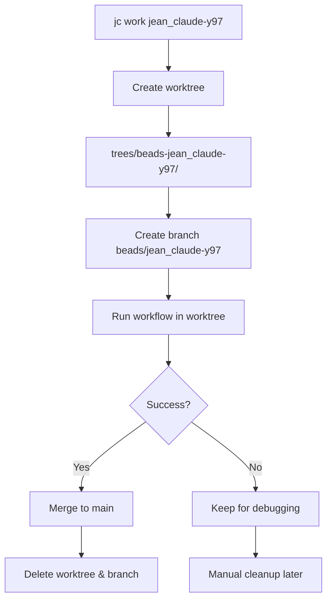

# Git Worktree Integration Design

## Problem Statement

Running multiple `jc work` workflows in parallel creates dangerous conflicts:
- All workflows modify the same working directory
- Changes from one workflow break others mid-execution
- Circular imports and cascading failures
- No isolation between autonomous agents

**Example**: When workflow A adds `from module_b import X` and workflow B simultaneously refactors `module_b`, workflow A's tests fail unexpectedly.

## Solution: Git Worktrees for Workflow Isolation

Each workflow runs in its own **git worktree** with an isolated working directory and dedicated feature branch.

### Key Benefits

✅ **Complete Isolation** - Each workflow has its own working directory
✅ **Parallel Execution** - Run unlimited workflows simultaneously
✅ **No Cross-Contamination** - Changes in one workflow don't affect others
✅ **Clean Git History** - Each workflow on its own feature branch
✅ **Safe Testing** - Tests run independently per workflow
✅ **Transparent UX** - User doesn't need to know about worktrees

---

## Architecture Design

### 1. Worktree Lifecycle



### 2. Directory Structure

```
jean_claude/                    # Main repo (git root)
├── .git/                       # Shared git database
├── agents/                     # Workflow state (shared across worktrees)
│   ├── beads-jean_claude-y97/
│   │   ├── state.json         # Tracks worktree_path
│   │   └── logs/
│   └── beads-jean_claude-7gq/
│       └── state.json
├── trees/                      # Worktree directory (gitignored)
│   ├── beads-jean_claude-y97/ # Worktree for workflow y97
│   │   ├── src/               # Isolated copy of source
│   │   ├── tests/             # Isolated copy of tests
│   │   └── .git               # Worktree metadata (points to main .git)
│   └── beads-jean_claude-7gq/ # Worktree for workflow 7gq
│       └── src/
└── src/                        # Main working directory
    └── jean_claude/
```

### 3. Branch Naming Convention

Pattern: `beads/{task_id}`

Examples:
- `beads/jean_claude-y97` - Extract mailbox utilities
- `beads/jean_claude-7gq` - Add logging to hooks
- `beads/jean_claude-400` - Remove barrel exports

Benefits:
- Clear association with beads task
- Consistent namespace
- Easy to filter: `git branch | grep beads/`
- Follows git convention (type/identifier)

### 4. State Schema Updates

Add to `WorkflowState`:

```python
class WorkflowState(BaseModel):
    # ... existing fields ...

    # Worktree tracking
    worktree_path: Path | None = None
    worktree_branch: str | None = None

    def get_project_root(self) -> Path:
        """Get the actual project root (worktree or main)."""
        return self.worktree_path or Path.cwd()
```

This allows workflows to track where they're executing and enables proper path resolution.

---

## Implementation Plan

### Phase 1: Worktree Management Module

Create `src/jean_claude/integrations/worktree.py`:

```python
"""Git worktree management for workflow isolation."""

from pathlib import Path
import subprocess
from dataclasses import dataclass


@dataclass
class WorktreeInfo:
    """Information about a workflow worktree."""
    workflow_id: str
    path: Path
    branch: str
    exists: bool


def create_workflow_worktree(
    workflow_id: str,
    base_branch: str = "main",
    repo_root: Path | None = None
) -> Path:
    """Create a new worktree for a workflow.

    Args:
        workflow_id: Workflow identifier (e.g., 'beads-jean_claude-y97')
        base_branch: Branch to checkout from (default: 'main')
        repo_root: Repository root (default: current directory)

    Returns:
        Path to created worktree

    Raises:
        RuntimeError: If worktree creation fails
        ValueError: If worktree already exists
    """
    repo_root = repo_root or Path.cwd()
    worktree_path = repo_root / "trees" / workflow_id
    branch_name = f"beads/{workflow_id.replace('beads-', '')}"

    # Safety checks
    if worktree_path.exists():
        raise ValueError(f"Worktree already exists: {worktree_path}")

    if branch_exists(branch_name, repo_root):
        raise ValueError(f"Branch already exists: {branch_name}")

    # Create worktree with new branch
    try:
        subprocess.run(
            ["git", "worktree", "add", "-b", branch_name,
             str(worktree_path), base_branch],
            cwd=repo_root,
            check=True,
            capture_output=True,
            text=True
        )
        return worktree_path
    except subprocess.CalledProcessError as e:
        raise RuntimeError(f"Failed to create worktree: {e.stderr}")


def remove_workflow_worktree(
    workflow_id: str,
    delete_branch: bool = True,
    force: bool = False,
    repo_root: Path | None = None
) -> None:
    """Remove a workflow worktree.

    Args:
        workflow_id: Workflow identifier
        delete_branch: Whether to delete the associated branch
        force: Force removal even if worktree has uncommitted changes
        repo_root: Repository root (default: current directory)
    """
    repo_root = repo_root or Path.cwd()
    worktree_path = repo_root / "trees" / workflow_id
    branch_name = f"beads/{workflow_id.replace('beads-', '')}"

    if not worktree_path.exists():
        return  # Already removed

    # Remove worktree
    cmd = ["git", "worktree", "remove", str(worktree_path)]
    if force:
        cmd.append("--force")

    try:
        subprocess.run(cmd, cwd=repo_root, check=True, capture_output=True)
    except subprocess.CalledProcessError as e:
        raise RuntimeError(f"Failed to remove worktree: {e.stderr}")

    # Optionally delete branch
    if delete_branch and branch_exists(branch_name, repo_root):
        subprocess.run(
            ["git", "branch", "-D" if force else "-d", branch_name],
            cwd=repo_root,
            check=True,
            capture_output=True
        )


def get_worktree_info(workflow_id: str, repo_root: Path | None = None) -> WorktreeInfo:
    """Get information about a workflow's worktree."""
    repo_root = repo_root or Path.cwd()
    worktree_path = repo_root / "trees" / workflow_id
    branch_name = f"beads/{workflow_id.replace('beads-', '')}"

    return WorktreeInfo(
        workflow_id=workflow_id,
        path=worktree_path,
        branch=branch_name,
        exists=worktree_path.exists()
    )


def list_workflow_worktrees(repo_root: Path | None = None) -> list[WorktreeInfo]:
    """List all workflow worktrees."""
    repo_root = repo_root or Path.cwd()
    trees_dir = repo_root / "trees"

    if not trees_dir.exists():
        return []

    worktrees = []
    for worktree_dir in trees_dir.iterdir():
        if worktree_dir.is_dir() and worktree_dir.name.startswith("beads-"):
            worktrees.append(get_worktree_info(worktree_dir.name, repo_root))

    return worktrees


def merge_workflow_to_main(
    workflow_id: str,
    delete_after_merge: bool = True,
    repo_root: Path | None = None
) -> None:
    """Merge workflow branch to main and optionally cleanup.

    Args:
        workflow_id: Workflow identifier
        delete_after_merge: Delete worktree and branch after merge
        repo_root: Repository root

    Raises:
        RuntimeError: If merge fails (conflicts, etc.)
    """
    repo_root = repo_root or Path.cwd()
    branch_name = f"beads/{workflow_id.replace('beads-', '')}"

    try:
        # Switch to main branch
        subprocess.run(
            ["git", "checkout", "main"],
            cwd=repo_root,
            check=True,
            capture_output=True
        )

        # Pull latest (in case main moved)
        subprocess.run(
            ["git", "pull", "--ff-only"],
            cwd=repo_root,
            check=True,
            capture_output=True
        )

        # Merge workflow branch
        result = subprocess.run(
            ["git", "merge", "--no-ff", "-m",
             f"Merge workflow {workflow_id}", branch_name],
            cwd=repo_root,
            check=True,
            capture_output=True,
            text=True
        )

        # Cleanup if requested
        if delete_after_merge:
            remove_workflow_worktree(workflow_id, delete_branch=True,
                                   force=False, repo_root=repo_root)

    except subprocess.CalledProcessError as e:
        # Check if it's a merge conflict
        if "CONFLICT" in e.stderr or "CONFLICT" in e.stdout:
            raise RuntimeError(
                f"Merge conflict! Resolve manually in {repo_root}\n"
                f"Run: git merge --abort  # to cancel\n"
                f"Or resolve conflicts and: git commit"
            )
        raise RuntimeError(f"Merge failed: {e.stderr}")


def branch_exists(branch_name: str, repo_root: Path) -> bool:
    """Check if a branch exists."""
    result = subprocess.run(
        ["git", "branch", "--list", branch_name],
        cwd=repo_root,
        capture_output=True,
        text=True
    )
    return bool(result.stdout.strip())
```

### Phase 2: Integrate with `jc work` Command

Modify `src/jean_claude/cli/commands/work.py`:

```python
from jean_claude.integrations.worktree import (
    create_workflow_worktree,
    get_worktree_info,
    merge_workflow_to_main
)

@click.command()
@click.argument("beads_id")
# ... options ...
def work(beads_id: str, model: str, ...) -> None:
    """Execute a workflow from a Beads task."""
    try:
        project_root = Path.cwd()
        workflow_id = f"beads-{beads_id}"

        # === NEW: Create worktree for workflow ===
        console.print("[bold blue]Creating isolated worktree...[/bold blue]")
        try:
            worktree_path = create_workflow_worktree(
                workflow_id=workflow_id,
                base_branch="main",
                repo_root=project_root
            )
            console.print(f"[green]✓[/green] Worktree created: [cyan]{worktree_path}[/cyan]")
            console.print(f"[dim]Branch: beads/{beads_id}[/dim]")
            console.print()

            # Use worktree as project root for all operations
            execution_root = worktree_path

        except ValueError as e:
            # Worktree already exists - resume in existing worktree
            info = get_worktree_info(workflow_id, project_root)
            console.print(f"[yellow]Using existing worktree:[/yellow] {info.path}")
            execution_root = info.path
        # === END NEW ===

        # ... rest of workflow execution ...
        # IMPORTANT: Pass execution_root instead of project_root

        # Initialize WorkflowState with worktree info
        workflow_state = WorkflowState(
            workflow_id=workflow_id,
            workflow_name=task.title,
            workflow_type="beads-task",
            beads_task_id=beads_id,
            beads_task_title=task.title,
            phase="planning",
            worktree_path=execution_root,  # NEW
            worktree_branch=f"beads/{beads_id}"  # NEW
        )

        # Save state in MAIN repo (not worktree) for persistence
        workflow_state.save(project_root)

        # Run workflow in worktree context
        final_state = anyio.run(
            run_two_agent_workflow,
            spec_content,
            execution_root,  # Use worktree path, not main repo
            workflow_id,
            model,
            model,
            None,
            auto_confirm,
            event_logger,
        )

        # On success: merge and cleanup
        if final_state.is_complete():
            console.print("[bold blue]Merging changes to main...[/bold blue]")
            merge_workflow_to_main(
                workflow_id=workflow_id,
                delete_after_merge=True,
                repo_root=project_root
            )
            console.print("[green]✓[/green] Changes merged and worktree cleaned up")

    except Exception as e:
        console.print(f"[bold red]Error:[/bold red] {e}")
        console.print(f"[yellow]Worktree preserved for debugging:[/yellow] {execution_root}")
        raise click.Abort()
```

### Phase 3: Integrate with `jc implement` Command

Modify `src/jean_claude/cli/commands/implement.py`:

```python
def implement(workflow_id: str, ...) -> None:
    """Resume implementing a workflow."""
    project_root = Path.cwd()

    # Load existing workflow state
    state = WorkflowState.load(workflow_id, project_root)

    # Check if workflow is using a worktree
    if state.worktree_path:
        if not state.worktree_path.exists():
            console.print("[yellow]⚠ Worktree missing, recreating...[/yellow]")
            worktree_path = create_workflow_worktree(
                workflow_id=workflow_id,
                base_branch=state.worktree_branch or "main",
                repo_root=project_root
            )
            state.worktree_path = worktree_path
            state.save(project_root)

        execution_root = state.worktree_path
        console.print(f"[dim]Resuming in worktree: {execution_root}[/dim]")
    else:
        # Legacy workflow without worktree
        execution_root = project_root
        console.print("[yellow]⚠ Legacy workflow (no worktree isolation)[/yellow]")

    # Continue workflow in appropriate context
    # ...
```

### Phase 4: Cleanup Commands

Add `src/jean_claude/cli/commands/worktrees.py`:

```python
"""Worktree management commands."""

import click
from rich.console import Console
from rich.table import Table

from jean_claude.integrations.worktree import (
    list_workflow_worktrees,
    remove_workflow_worktree,
)

console = Console()


@click.group()
def worktrees():
    """Manage workflow worktrees."""
    pass


@worktrees.command("list")
def list_worktrees():
    """List all active workflow worktrees."""
    worktrees = list_workflow_worktrees()

    if not worktrees:
        console.print("[dim]No active worktrees[/dim]")
        return

    table = Table(title="Active Workflow Worktrees")
    table.add_column("Workflow ID", style="cyan")
    table.add_column("Branch", style="yellow")
    table.add_column("Path", style="dim")

    for wt in worktrees:
        table.add_row(wt.workflow_id, wt.branch, str(wt.path))

    console.print(table)


@worktrees.command("cleanup")
@click.option("--force", is_flag=True, help="Force cleanup even with uncommitted changes")
@click.argument("workflow_id", required=False)
def cleanup_worktrees(workflow_id: str | None, force: bool):
    """Clean up workflow worktrees.

    If WORKFLOW_ID provided, removes that specific worktree.
    Otherwise, removes all worktrees for completed workflows.
    """
    from jean_claude.core.state import WorkflowState
    from pathlib import Path

    project_root = Path.cwd()

    if workflow_id:
        # Remove specific worktree
        console.print(f"Removing worktree for {workflow_id}...")
        remove_workflow_worktree(workflow_id, delete_branch=True,
                               force=force, repo_root=project_root)
        console.print("[green]✓[/green] Worktree removed")
    else:
        # Remove all completed workflow worktrees
        worktrees = list_workflow_worktrees(project_root)
        removed_count = 0

        for wt in worktrees:
            try:
                state = WorkflowState.load(wt.workflow_id, project_root)
                if state.phase == "complete":
                    console.print(f"Cleaning up completed workflow: {wt.workflow_id}")
                    remove_workflow_worktree(wt.workflow_id, delete_branch=True,
                                           force=force, repo_root=project_root)
                    removed_count += 1
            except FileNotFoundError:
                # Orphaned worktree (no state file)
                console.print(f"[yellow]Removing orphaned worktree: {wt.workflow_id}[/yellow]")
                remove_workflow_worktree(wt.workflow_id, delete_branch=True,
                                       force=force, repo_root=project_root)
                removed_count += 1

        console.print(f"[green]✓[/green] Cleaned up {removed_count} worktree(s)")
```

Register in `src/jean_claude/cli/main.py`:

```python
from jean_claude.cli.commands.worktrees import worktrees

cli.add_command(worktrees)
```

---

## Edge Cases and Solutions

### 1. Worktree Already Exists

**Scenario**: User runs `jc work jean_claude-y97` twice
**Solution**: Detect existing worktree, resume in it (don't recreate)

### 2. Branch Already Exists

**Scenario**: Previous workflow failed, branch left behind
**Solution**: Check branch state, prompt user to cleanup or force-recreate

### 3. Main Repo Has Uncommitted Changes

**Scenario**: User has WIP in main directory
**Solution**:
- Option A: Stash changes before creating worktree
- Option B: Require clean working directory
- **Recommended**: Option B (safer)

### 4. Merge Conflicts

**Scenario**: Two workflows modify the same file
**Solution**:
- Conflict detected during merge to main
- Keep worktree for manual resolution
- Provide clear instructions to user
- Mark workflow as "needs_merge"

### 5. Worktree Manually Deleted

**Scenario**: User deletes `trees/beads-jean_claude-y97/` directory
**Solution**: `jc implement` recreates it from branch

### 6. Process Crash Mid-Workflow

**Scenario**: System crash while workflow running
**Solution**: State saved in main repo survives, resume in worktree

### 7. Multiple Simultaneous Merges

**Scenario**: 3 workflows complete at once, all try to merge
**Solution**:
- Merges are sequential (git operations are atomic)
- Second merge waits for first to complete
- Lock file in .git/ prevents conflicts

---

## Testing Strategy

### Unit Tests

1. `test_worktree_creation.py` - Create/remove operations
2. `test_worktree_info.py` - Query operations
3. `test_worktree_merge.py` - Merge logic
4. `test_worktree_edge_cases.py` - Error conditions

### Integration Tests

1. `test_work_command_worktree.py` - Full workflow in worktree
2. `test_parallel_workflows.py` - Multiple workflows simultaneously
3. `test_implement_resume.py` - Resume in existing worktree
4. `test_merge_workflow.py` - Successful merge to main
5. `test_merge_conflicts.py` - Conflict handling

### Manual Testing

1. Run 3 workflows in parallel - verify isolation
2. Crash workflow mid-execution - verify resume works
3. Create merge conflict - verify conflict handling
4. Clean up stale worktrees - verify cleanup command

---

## Performance Considerations

### Disk Space

- Each worktree is a full copy of the working directory
- Typical jean_claude repo: ~50MB per worktree
- 10 parallel workflows = 500MB
- **Solution**: Automatic cleanup of completed workflows

### Creation Speed

- Git worktree creation: ~100ms
- Negligible overhead compared to workflow duration (minutes)

### Git Operations

- All worktrees share same `.git/` database
- Objects are shared (no duplication)
- Only working files are duplicated

---

## Migration Strategy

### Backward Compatibility

Support both modes during transition:

```python
# In WorkflowState
def get_project_root(self) -> Path:
    """Get project root (worktree if available, else main)."""
    if self.worktree_path and self.worktree_path.exists():
        return self.worktree_path
    return Path.cwd()
```

### Rollout Plan

1. **Phase 1**: Implement worktree module, add tests
2. **Phase 2**: Make worktrees optional (flag: `--use-worktree`)
3. **Phase 3**: Enable by default with opt-out (`--no-worktree`)
4. **Phase 4**: Remove opt-out, always use worktrees

---

## User Experience

### Transparent Mode (Recommended)

User runs familiar commands, worktrees are automatic:

```bash
# User doesn't think about worktrees
$ jc work jean_claude-y97 --auto-confirm
Creating isolated worktree...
✓ Worktree created: trees/beads-jean_claude-y97
Branch: beads/jean_claude-y97

# ... workflow runs ...

✓ All features completed!
Merging changes to main...
✓ Changes merged and worktree cleaned up
```

### Advanced Mode

Power users can inspect/manage worktrees:

```bash
# List active worktrees
$ jc worktrees list
┏━━━━━━━━━━━━━━━━━━━━━━┳━━━━━━━━━━━━━━━━━━━━━━┳━━━━━━━━━━━━━━━━┓
┃ Workflow ID          ┃ Branch               ┃ Path           ┃
┡━━━━━━━━━━━━━━━━━━━━━━╇━━━━━━━━━━━━━━━━━━━━━━╇━━━━━━━━━━━━━━━━┩
│ beads-jean_claude-y97│ beads/jean_claude-y97│ trees/beads-...│
└──────────────────────┴──────────────────────┴────────────────┘

# Manually inspect a worktree
$ cd trees/beads-jean_claude-y97/
$ git status
On branch beads/jean_claude-y97
...

# Clean up completed workflows
$ jc worktrees cleanup
Cleaning up completed workflow: beads-jean_claude-y97
✓ Cleaned up 1 worktree(s)
```

---

## Benefits Summary

### For Parallel Execution

- ✅ Complete isolation between workflows
- ✅ No circular imports
- ✅ No test contamination
- ✅ Safe concurrent execution

### For Git Workflow

- ✅ Clean feature branch per task
- ✅ Clear git history
- ✅ Easy code review (one PR per workflow)
- ✅ Easy rollback (revert merge commit)

### For Debugging

- ✅ Failed workflow preserved in worktree
- ✅ Can inspect exact state at failure
- ✅ Can manually fix and resume
- ✅ State persists across crashes

### For User Experience

- ✅ Transparent - works automatically
- ✅ Familiar - same commands
- ✅ Powerful - advanced control when needed
- ✅ Safe - conflicts detected at merge time

---

## Implementation Checklist

- [ ] Create `worktree.py` module with all functions
- [ ] Add worktree fields to `WorkflowState`
- [ ] Modify `work.py` to create worktrees
- [ ] Modify `implement.py` to resume in worktrees
- [ ] Add `worktrees` CLI command group
- [ ] Write unit tests for worktree operations
- [ ] Write integration tests for parallel workflows
- [ ] Update documentation
- [ ] Test migration from legacy (no worktree) workflows
- [ ] Add logging for all worktree operations
- [ ] Handle merge conflicts gracefully
- [ ] Implement automatic cleanup of completed workflows

---

## Open Questions

1. **Should we auto-pull main before creating worktree?**
   - Pro: Ensures worktree starts from latest main
   - Con: Slows down workflow start
   - **Recommendation**: Yes, always start from latest main

2. **Should we auto-push feature branches?**
   - Pro: Backup in case of local failure
   - Con: Clutters remote with many branches
   - **Recommendation**: No, branches are local only

3. **How to handle very old stale worktrees?**
   - Add `last_accessed` timestamp
   - Auto-cleanup worktrees older than 7 days?
   - **Recommendation**: Manual cleanup only (user decides)

4. **Should agents/ directory be in main repo or worktree?**
   - **Main repo**: State persists across worktree deletion
   - **Worktree**: State isolated per workflow
   - **Recommendation**: Main repo (more robust)

---

## Conclusion

Git worktrees provide **perfect isolation** for parallel workflow execution while maintaining a clean, understandable git history. The implementation is straightforward, the UX remains transparent, and the benefits are immediate.

This solves the parallel execution problem completely and enables safe autonomous workflow orchestration at scale.
