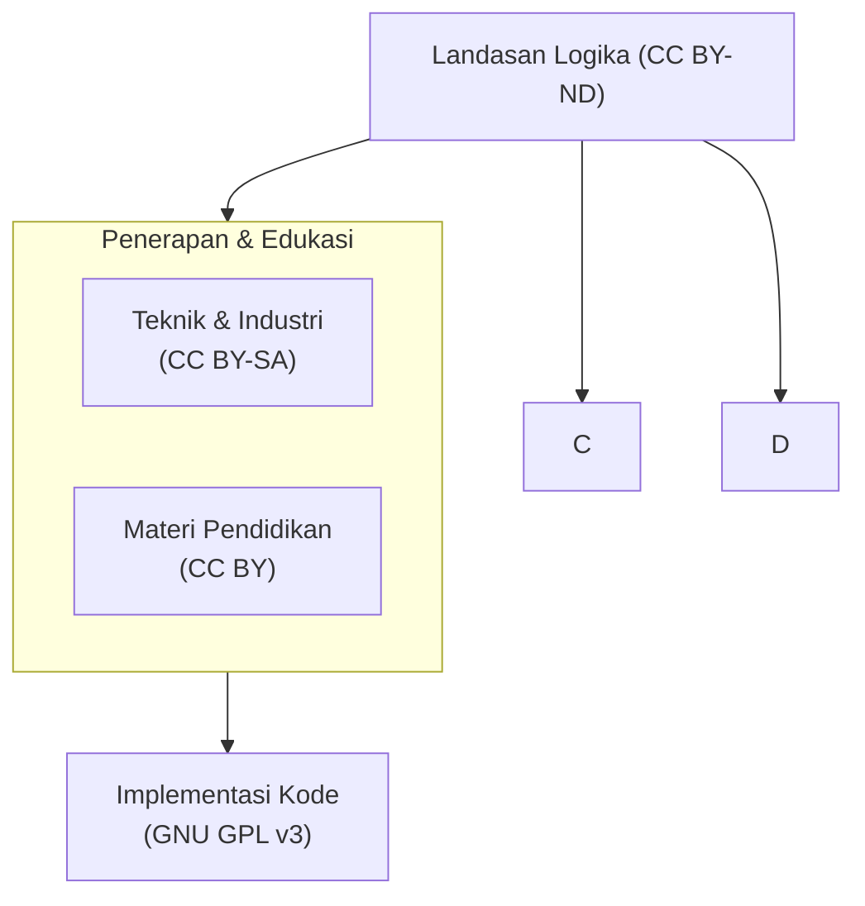

# Arsitektur Lisensi TP-OCM

## 📜 Filosofi Perlindungan Diferensial

Lisensi TP-OCM dirancang berdasarkan prinsip **segmentasi epistemik**: perlindungan hukum yang berbeda untuk jenis konten yang berbeda, sesuai dengan fungsi dan nilai filosofisnya dalam ekosistem.

> **Prinsip Utama:** **Melindungi ide, membebaskan penerapan, membuka kolaborasi.**

---

## 🗺️ Peta Lisensi

Diagram berikut menggambarkan hubungan hierarkis dan fungsional antar komponen lisensi TP-OCM:

---

## 📋 Detail Lisensi per Komponen

### 1. **Landasan Logika Formal & Aksiomatik**
*   **Lisensi:** **Creative Commons Attribution-NoDerivatives 4.0 International (CC BY-ND 4.0)**
*   **Cakupan File:** `/docs/PAPER_FORMAL_LOGIC.md` dan dokumen aksiomatik inti lainnya.
*   **Filosofi & Tujuan:**
    *   **Melindungi integritas konseptual** sistem TP-OCM dari distorsi atau simplifikasi yang dapat merusak logika dasarnya.
    *   Memastikan bahwa **struktur aksiomatik, teorema, dan derivasi logis** tetap menjadi referensi tunggal yang otoritatif.
    *   **Mengizinkan:** Kutipan, distribusi, penggunaan komersial dan non-komersial, **dengan syarat atribusi yang jelas kepada penemu (Nur Rohmat Hidayatulloh)**.
    *   **Melarang:** Membuat, mendistribusikan, atau mempublikasikan **adaptasi/modifikasi** dari materi ini.
*   **Interpretasi Penting:** "Tidak Ada Turunan" (**ND**) diterapkan pada **inti logika dan struktur pembuktian**. Analisis, komentar, atau penjelasan pedagogis yang tidak mengubah makna atau urutan logika inti tidak dianggap sebagai pelanggaran.

### 2. **Penerapan Teknis & Industri**
*   **Lisensi:** **Creative Commons Attribution-ShareAlike 4.0 International (CC BY-SA 4.0)**
*   **Cakupan File:** `/docs/PAPER_TEKNIS.md`, `/docs/PAPER_INDUSTRI.md`, dan panduan implementasi.
*   **Filosofi & Tujuan:**
    *   **Mendorong inovasi praktis** dan adopsi industri dengan syarat yang adil.
    *   Menciptakan **ekosistem terbuka** di mana perbaikan dan turunan teknis harus dibagikan kembali dengan komunitas.
    *   **Mengizinkan:** Penggunaan, adaptasi, dan distribusi untuk tujuan komersial dan non-komersial.
    *   **Mewajibkan:**
        1.  **Atribusi** kepada penemu.
        2.  **Lisensi yang Sama ("ShareAlike")** untuk semua turunan materi ini.
*   **Hubungan dengan Logika Formal:** Dokumen ini dapat menjelaskan, mengilustrasikan, dan mengaplikasikan logika dari dokumen CC BY-ND, tetapi tidak boleh mengubah atau menggantikan logika inti tersebut.

### 3. **Materi Pendidikan & Pedagogis**
*   **Lisensi:** **Creative Commons Attribution 4.0 International (CC BY 4.0)**
*   **Cakupan File:** `/docs/PAPER_PEDAGOGIS.md`, slide presentasi, materi workshop.
*   **Filosofi & Tujuan:**
    *   **Memaksimalkan penyebaran pengetahuan** dan kemudahan akses untuk pendidikan.
    *   Memberi kebebasan penuh kepada pendidik untuk **mengadaptasi, menerjemahkan, dan menyusun ulang** materi untuk konteks pengajaran mereka.
    *   **Mengizinkan:** Semua penggunaan, termasuk adaptasi dan komersialisasi.
    *   **Mewajibkan:** Hanya **atribusi** kepada penemu.
*   **Hubungan dengan Komponen Lain:** Materi ini merupakan "jembatan" yang dapat merujuk dan menjelaskan baik logika formal (CC BY-ND) maupun penerapan teknis (CC BY-SA), dengan bahasa yang lebih mudah diakses.

### 4. **Implementasi Kode Sumber**
*   **Lisensi:** **GNU General Public License v3.0 (GPL v3)**
*   **Cakupan File:** Semua file kode sumber dalam direktori `/src/` dan `/examples/`.
*   **Filosofi & Tujuan:**
    *   **Menjamin kebebasan pengguna dan pengembang** untuk menggunakan, mempelajari, memodifikasi, dan membagikan kode.
    *   **Mencegah enkapsulasi (pengurungan)** kode ke dalam perangkat lunak berpemilik yang tidak membagikan modifikasinya.
    *   **Mengizinkan:** Penggunaan, modifikasi, distribusi.
    *   **Mewajibkan:** Kode turunan yang didistribusikan harus **dilisensikan di bawah GPL v3 yang sama** ("copyleft").
*   **Keterkaitan dengan Dokumen:** Kode adalah realisasi dari konsep yang dijelaskan dalam dokumen. Dia berdiri di atas fondasi logika tetapi diatur oleh norma komunitas perangkat lunak bebas yang berbeda.

---

## ⚖️ Prinsip Koeksistensi dan Resolusi

1.  **Tidak Ada Konflik:** Arsitektur ini dirancang agar setiap lisensi mengatur domainnya sendiri. Penggunaan dokumen CC BY-ND sebagai referensi dalam proyek berlisensi CC BY-SA atau GPL v3 diperbolehkan dan dianjurkan.
2.  **Prinsip "Atribusi Berjenjang":** Dalam karya turunan yang menggunakan beberapa komponen (misalnya, sebuah buku teks dan perangkat lunak), atribusi harus diberikan kepada penemu TP-OCM untuk komponen konseptual, dan kepada kontributor kode untuk bagian implementasi, sesuai dengan lisensi masing-masing.
3.  **Klarifikasi "Turunan" (Derivative):**
    *   Sebuah **program komputer** yang mengimplementasikan algoritma TP-OCM adalah **turunan dari kode sumber** dan diatur oleh **GPL v3**.
    *   Sebuah **paper akademik** yang menganalisis atau memperluas logika TP-OCM **bukan** turunan dari dokumen CC BY-ND selama tidak menyalin atau memodifikasi teks pembuktian inti secara substansial. Paper tersebut diatur oleh kebijakan penerbit jurnal.
    *   Sebuah **modul pengajaran** yang menyederhanakan penjelasan adalah **turunan dari materi pedagogis (CC BY)** dan harus menyertakan atribusi.

---

## 🛡️ Pernyataan Perlindungan Identitas Intelektual

Struktur lisensi ini bertujuan untuk:
1.  **Melindungi** integritas penemuan konseptual Nur Rohmat Hidayatulloh sebagai **Landasan Logika Formal (CC BY-ND)**.
2.  **Mendorong** inovasi dan kolaborasi yang adil di bidang **Penerapan Teknis (CC BY-SA)** dan **Edukasi (CC BY)**.
3.  **Menjamin** kebebasan dan keterbukaan **Komunitas Perangkat Lunak (GPL v3)**.

Dengan demikian, TP-OCM bukan sekadar kumpulan kode, tetapi sebuah **sistem pengetahuan lengkap** dengan kerangka perlindungan dan penyebaran yang disesuaikan untuk setiap lapisannya.

---

**Penemu dan Pemegang Hak Cipta Arsitektur TP-OCM:**  
Nur Rohmat Hidayatulloh  
*Dibentuk di Pakualaman, 24 Desember 2025*