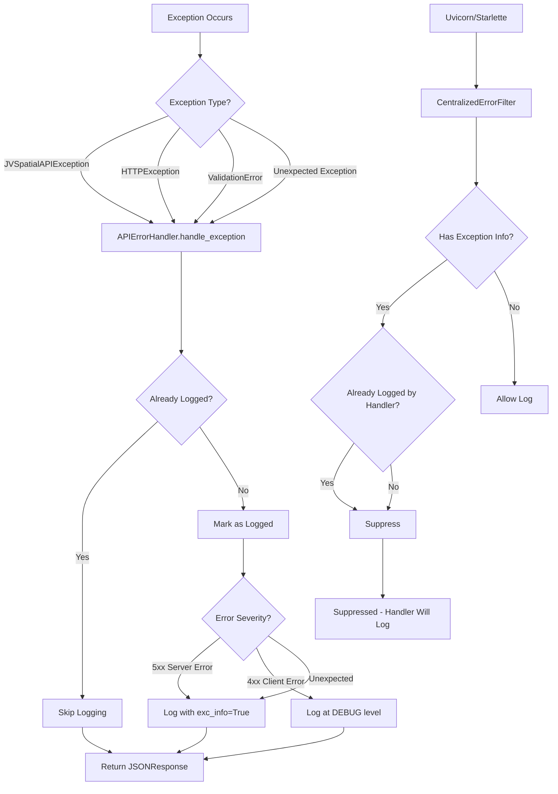

# Error Handling Guide

## Overview

jvspatial provides a comprehensive exception hierarchy for robust error handling and graceful degradation in your applications.

## Exception Hierarchy

All jvspatial exceptions inherit from `JVSpatialError`:

```python
from jvspatial.exceptions import (
    JVSpatialError,         # Base exception
    EntityNotFoundError,    # Entity lookup failures
    NodeNotFoundError,      # Node-specific not found
    EdgeNotFoundError,      # Edge-specific not found
    DatabaseError,          # Database operation failures
    ConnectionError,        # Database connection issues
    GraphError,             # Graph structure problems
    WalkerExecutionError,   # Walker runtime errors
    ConfigurationError,     # Configuration problems
)
from pydantic import ValidationError  # Pydantic validation errors
```

## Basic Exception Handling

```python
import asyncio
from jvspatial.core import Node
from jvspatial.exceptions import JVSpatialError, EntityNotFoundError, ValidationError

class User(Node):
    name: str = ""
    email: str = ""

async def handle_user_operations():
    try:
        # Entity operations that might fail
        user = await User.create(name="Alice", email="alice@example.com")
        retrieved = await User.get("invalid_id")

        # Object.get() returns None if not found
        if retrieved is None:
            raise EntityNotFoundError(
                message="User not found",
                entity_type="User",
                entity_id="invalid_id"
            )

    except EntityNotFoundError as e:
        print(f"Entity not found: {e.message}")
        print(f"Entity type: {e.entity_type}, ID: {e.entity_id}")

    except ValidationError as e:
        # Pydantic ValidationError - handle field errors
        print(f"Validation failed: {e}")
        if hasattr(e, 'errors'):
            for error in e.errors():
                print(f"  {error.get('loc', [])}: {error.get('msg', '')}")

    except JVSpatialError as e:
        # Catch-all for any jvspatial error
        print(f"jvspatial error: {e.message}")
        if e.details:
            print(f"Details: {e.details}")

    except Exception as e:
        # Handle unexpected errors
        print(f"Unexpected error: {e}")
```

## Database Exception Handling

```python
from jvspatial.exceptions import DatabaseError, ConnectionError, QueryError
from jvspatial.core import GraphContext

async def robust_database_operations():
    try:
        ctx = GraphContext()
        users = await User.find({"context.active": True})

    except ConnectionError as e:
        print(f"Database connection failed: {e.message}")
        print(f"Database type: {e.database_type}")
        # Implement retry logic or fallback

    except QueryError as e:
        print(f"Query failed: {e.message}")
        print(f"Query: {e.query}")
        # Log query for debugging

    except DatabaseError as e:
        print(f"Database operation failed: {e.message}")
        # Handle database-level errors
```

## Walker Exception Handling

```python
from jvspatial.exceptions import WalkerExecutionError, WalkerTimeoutError
from jvspatial.core import Walker, on_visit

class SafeWalker(Walker):
    @on_visit(User)
    async def process_user(self, here: User):
        try:
            # Potentially risky operations
            result = await some_external_service(here)
            self.report(result)
        except Exception as e:
            # Log error and continue traversal
            self.report({"error": str(e), "user_id": here.id})

async def safe_traversal():
    try:
        walker = SafeWalker()
        result = await walker.spawn(start_node)

    except WalkerTimeoutError as e:
        print(f"Walker timed out after {e.timeout_seconds} seconds")
        # Access partial results
        partial_report = await walker.get_report()

    except WalkerExecutionError as e:
        print(f"Walker execution failed: {e.message}")
        print(f"Walker class: {e.walker_class}")
```

## Configuration Exception Handling

```python
from jvspatial.exceptions import ConfigurationError, InvalidConfigurationError
from jvspatial.db import create_database

def setup_database_with_fallback():
    try:
        # Try preferred database
        db = create_database("mongodb", db_name="mydb")

    except (InvalidConfigurationError, ValueError) as e:
        print(f"MongoDB configuration invalid: {e}")

        # Fall back to JSON database
        try:
            db = create_database("json", base_path="./data")
            print("Falling back to JSON database")
        except ConfigurationError:
            raise ConfigurationError("No database backend available")

    return db
```

## Streamlined Error Reporting System

jvspatial implements a centralized error reporting system that ensures each exception is logged exactly once with proper context, preventing duplicate logs from framework components.

### Core Principle

**Single Source of Truth**: The `APIErrorHandler` is the authoritative logger for all exceptions. Framework-level error logs (from uvicorn/starlette) are suppressed to prevent duplicates.

### Error Handling Flow

When an exception occurs in the API:

1. The exception is caught by FastAPI's exception handling system
2. `APIErrorHandler.handle_exception()` processes the exception
3. The root exception is extracted (handling ExceptionGroup and chaining)
4. The exception is checked against a tracking system to prevent duplicate logging
5. If not already logged, the exception is logged with appropriate context
6. Framework-level logs are suppressed by `CentralizedErrorFilter`



### Stack Trace Policy

Stack traces are included in logs based on error severity:

- **Server Errors (5xx)**: Full stack traces with `exc_info=True` for debugging
- **Unexpected Errors**: Full stack traces to help diagnose issues
- **Client Errors (4xx)**: No stack traces - logged at DEBUG level to keep logs clean

This approach ensures:
- Production logs remain clean and focused
- Debugging information is available when needed
- No duplicate stack traces clutter the logs

### Exception Tracking

The system uses a context variable to track exceptions that have been logged:

- Each exception is identified by its object ID
- Root exceptions are extracted from ExceptionGroup (Python 3.11+) and chained exceptions
- Once logged, the exception ID is marked to prevent duplicate logging
- This prevents duplicates even if exceptions propagate through multiple layers

### ExceptionGroup Handling

Python 3.11+ wraps exceptions in `ExceptionGroup` for task groups. The system:

- Extracts the first nested exception from ExceptionGroup
- Recursively follows exception chains (`__cause__` and `__context__`)
- Logs the root cause exception with full context

### Exception Chaining

The system handles exception chaining properly:

- Follows `__cause__` (explicit chaining) first
- Then follows `__context__` (implicit chaining) if different
- Extracts the root cause for logging
- Suppresses "During handling of the above exception" messages from framework logs

### Benefits

- **No Duplicates**: Each exception logged exactly once
- **Proper Context**: All exceptions logged with request context (path, method, request_id)
- **Clean Logs**: Client errors don't clutter logs with stack traces
- **Debugging**: Server errors have full stack traces for debugging
- **Robust**: Handles ExceptionGroup, chaining, and edge cases

## Best Practices

1. **Use Specific Exceptions**: Catch specific exceptions before general ones
2. **Graceful Degradation**: Implement fallback behavior where possible
3. **Error Reporting**: Include relevant context in error messages
4. **Transaction Safety**: Use `try`/`except` in database operations
5. **Walker Safety**: Handle walker-specific errors appropriately
6. **Trust the System**: The centralized error handler will log all exceptions - don't add manual logging

## See Also

- [Database Configuration Guide](configuration.md)
- [Walker Patterns](walker-patterns.md)
- [Advanced Error Handling](advanced-error-handling.md)