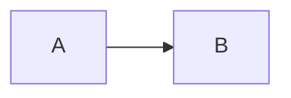

# Graph Visualization

Generate renderable graph representations in DOT (Graphviz) and Mermaid formats for documentation, debugging, and analysis.

## Overview

jvspatial provides utilities for exporting your graph structure into standard visualization formats. This is useful for:
- **Documentation**: Visual representation of your graph structure
- **Debugging**: Understanding graph relationships and connections
- **Analysis**: Exploring graph topology and node/edge distributions
- **Presentation**: Including graphs in reports or documentation

## Quick Start

```python
from jvspatial.core import GraphContext
from jvspatial.core.graph import generate_graph_dot, generate_graph_mermaid

# Get your graph context
context = GraphContext()

# Generate DOT format (Graphviz)
dot_graph = await generate_graph_dot(context, output_file="graph.dot")

# Generate Mermaid format
mermaid_graph = await generate_graph_mermaid(context, output_file="graph.mermaid")
```

## Basic Usage

### Using GraphContext Method

The simplest way to export your graph:

```python
from jvspatial.core import GraphContext

context = GraphContext()

# Export as DOT format
dot_graph = await context.export_graph(
    format="dot",
    output_file="my_graph.dot",
    rankdir="LR"
)

# Export as Mermaid format
mermaid_graph = await context.export_graph(
    format="mermaid",
    output_file="my_graph.mermaid",
    direction="LR"
)
```

### Direct Function Calls

For more control, use the direct functions:

```python
from jvspatial.core.graph import generate_graph_dot, generate_graph_mermaid, export_graph

# Generate DOT format
dot = await generate_graph_dot(
    context,
    graph_name="my_graph",
    rankdir="LR",
    node_shape="box",
    include_attributes=True,
    output_file="output.dot"  # Optional: save to file
)

# Generate Mermaid format
mermaid = await generate_graph_mermaid(
    context,
    graph_type="flowchart",
    direction="LR",
    include_attributes=True,
    output_file="output.mermaid"  # Optional: save to file
)

# Convenience function
result = await export_graph(
    context,
    format="dot",  # or "mermaid"
    output_file="graph.dot"  # Optional
)
```

## DOT Format (Graphviz)

DOT is the Graphviz graph description language. It's ideal for:
- Static image generation (PNG, SVG, PDF)
- Documentation with diagrams
- Complex graph layouts

### Basic DOT Export

```python
dot = await generate_graph_dot(
    context,
    graph_name="company_graph",
    rankdir="LR",  # Left to Right
    node_shape="box",
    include_attributes=True,
    output_file="graph.dot"
)
```

### Custom Styling

```python
dot = await generate_graph_dot(
    context,
    graph_name="styled_graph",
    rankdir="TB",  # Top to Bottom
    node_shape="ellipse",
    include_attributes=True,
    node_attributes=["name", "role"],  # Limit attributes shown
    style_options={
        "splines": "ortho",  # Orthogonal edge routing
        "nodesep": "1.0",    # Node separation
        "ranksep": "1.5"     # Rank separation
    },
    output_file="styled.dot"
)
```

### Rendering DOT Files

After generating a DOT file, render it with Graphviz:

```bash
# Generate PNG image
dot -Tpng graph.dot -o graph.png

# Generate SVG image
dot -Tsvg graph.dot -o graph.svg

# Generate PDF
dot -Tpdf graph.dot -o graph.pdf
```

## Mermaid Format

Mermaid is a diagramming syntax that renders in Markdown, GitHub, GitLab, and many other tools. It's ideal for:
- Documentation in Markdown files
- GitHub/GitLab README files
- Online documentation sites
- Mermaid Live Editor

### Basic Mermaid Export

```python
mermaid = await generate_graph_mermaid(
    context,
    graph_type="flowchart",  # or "graph"
    direction="LR",          # Left to Right
    include_attributes=True,
    output_file="graph.mermaid"
)
```

### Mermaid Flowchart vs Graph

```python
# Flowchart (directed edges with arrows)
flowchart = await generate_graph_mermaid(
    context,
    graph_type="flowchart",
    direction="LR",
    output_file="flowchart.mermaid"
)

# Graph (undirected edges)
graph = await generate_graph_mermaid(
    context,
    graph_type="graph",
    direction="TB",
    output_file="graph.mermaid"
)
```

### Using Mermaid in Markdown

```markdown
# My Graph Structure


```

## Advanced Features

### Filtering Nodes and Edges

Filter to show only specific node or edge types:

```python
def business_nodes_only(node_data: dict) -> bool:
    """Filter to show only business-related nodes."""
    node_name = node_data.get("name", "")
    return node_name in ["PersonNode", "OrganizationNode", "ProjectNode"]

dot = await generate_graph_dot(
    context,
    node_filter=business_nodes_only,
    output_file="business_graph.dot"
)

mermaid = await generate_graph_mermaid(
    context,
    node_filter=business_nodes_only,
    output_file="business_graph.mermaid"
)
```

### Limiting Attributes

Control which attributes appear in node/edge labels:

```python
dot = await generate_graph_dot(
    context,
    node_attributes=["name", "role", "status"],  # Only these attributes
    edge_attributes=["type", "weight"],          # Only these edge attributes
    output_file="simplified.dot"
)
```

### Layout Options

#### DOT Layout Directions

```python
# Top to Bottom (default)
dot = await generate_graph_dot(context, rankdir="TB")

# Left to Right
dot = await generate_graph_dot(context, rankdir="LR")

# Bottom to Top
dot = await generate_graph_dot(context, rankdir="BT")

# Right to Left
dot = await generate_graph_dot(context, rankdir="RL")
```

#### Mermaid Layout Directions

```python
# Top to Bottom
mermaid = await generate_graph_mermaid(context, direction="TB")

# Top Down (same as TB)
mermaid = await generate_graph_mermaid(context, direction="TD")

# Left to Right
mermaid = await generate_graph_mermaid(context, direction="LR")

# Right to Left
mermaid = await generate_graph_mermaid(context, direction="RL")

# Bottom to Top
mermaid = await generate_graph_mermaid(context, direction="BT")
```

### Node Shapes (DOT only)

```python
# Box (default)
dot = await generate_graph_dot(context, node_shape="box")

# Ellipse
dot = await generate_graph_dot(context, node_shape="ellipse")

# Circle
dot = await generate_graph_dot(context, node_shape="circle")

# Diamond
dot = await generate_graph_dot(context, node_shape="diamond")
```

### Themes (Mermaid only)

```python
mermaid = await generate_graph_mermaid(
    context,
    theme="default"   # default, dark, forest, neutral
)
```

## Return Value vs File Output

All graph generation functions:
- **Always return** the graph string
- **Optionally save** to a file when `output_file` is specified

```python
# Returns value only
graph_string = await generate_graph_dot(context)
print(graph_string)

# Returns value AND saves to file
graph_string = await generate_graph_dot(context, output_file="graph.dot")
# graph_string contains the same content as graph.dot file
```

## Complete Example

```python
import asyncio
from jvspatial.core import GraphContext, Node
from jvspatial.core.graph import generate_graph_dot, generate_graph_mermaid
from jvspatial.db.factory import create_database
from jvspatial.core.context import set_default_context

# Define nodes
class PersonNode(Node):
    name: str = ""
    role: str = ""

class OrganizationNode(Node):
    name: str = ""
    industry: str = ""

async def main():
    # Setup
    db = create_database(db_type="json", base_path="./jvdb", auto_create=True)
    context = GraphContext(database=db)
    set_default_context(context)

    # Create nodes
    person = await PersonNode.create(name="Alice", role="Engineer")
    org = await OrganizationNode.create(name="Acme Corp", industry="Tech")
    await person.connect(org)

    # Generate DOT format
    dot = await generate_graph_dot(
        context,
        graph_name="organization_graph",
        rankdir="LR",
        node_shape="box",
        include_attributes=True,
        output_file="org_graph.dot"
    )

    # Generate Mermaid format
    mermaid = await generate_graph_mermaid(
        context,
        graph_type="flowchart",
        direction="LR",
        include_attributes=True,
        output_file="org_graph.mermaid"
    )

    print("✓ Graph visualizations generated!")

if __name__ == "__main__":
    asyncio.run(main())
```

## API Reference

### `generate_graph_dot()`

```python
async def generate_graph_dot(
    context: GraphContext,
    include_attributes: bool = True,
    node_filter: Optional[Callable[[Dict[str, Any]], bool]] = None,
    edge_filter: Optional[Callable[[Dict[str, Any]], bool]] = None,
    node_attributes: Optional[List[str]] = None,
    edge_attributes: Optional[List[str]] = None,
    graph_name: str = "jvspatial_graph",
    rankdir: str = "TB",
    node_shape: str = "box",
    style_options: Optional[Dict[str, Any]] = None,
    output_file: Optional[str] = None,
) -> str
```

**Parameters:**
- `context`: GraphContext instance for accessing graph data
- `include_attributes`: Whether to include node/edge attributes as labels
- `node_filter`: Optional function to filter nodes (receives node dict, returns bool)
- `edge_filter`: Optional function to filter edges (receives edge dict, returns bool)
- `node_attributes`: List of node attributes to include in label (None = all)
- `edge_attributes`: List of edge attributes to include in label (None = all)
- `graph_name`: Name of the graph in DOT format
- `rankdir`: Graph direction: TB, LR, BT, RL
- `node_shape`: Shape for nodes: box, ellipse, circle, diamond, etc.
- `style_options`: Additional style options for the graph
- `output_file`: Optional file path to save the DOT output

**Returns:** DOT format string

### `generate_graph_mermaid()`

```python
async def generate_graph_mermaid(
    context: GraphContext,
    graph_type: str = "graph",
    include_attributes: bool = True,
    node_filter: Optional[Callable[[Dict[str, Any]], bool]] = None,
    edge_filter: Optional[Callable[[Dict[str, Any]], bool]] = None,
    node_attributes: Optional[List[str]] = None,
    edge_attributes: Optional[List[str]] = None,
    direction: str = "TB",
    theme: Optional[str] = None,
    output_file: Optional[str] = None,
) -> str
```

**Parameters:**
- `context`: GraphContext instance for accessing graph data
- `graph_type`: Type of graph: "graph" (undirected) or "flowchart" (directed)
- `include_attributes`: Whether to include node/edge attributes as labels
- `node_filter`: Optional function to filter nodes (receives node dict, returns bool)
- `edge_filter`: Optional function to filter edges (receives edge dict, returns bool)
- `node_attributes`: List of node attributes to include in label (None = all)
- `edge_attributes`: List of edge attributes to include in label (None = all)
- `direction`: Graph direction: TB, TD, BT, RL, LR
- `theme`: Optional theme: default, dark, forest, neutral
- `output_file`: Optional file path to save the Mermaid output

**Returns:** Mermaid format string

### `export_graph()`

Convenience function for exporting graphs:

```python
async def export_graph(
    context: GraphContext,
    format: str = "dot",
    output_file: Optional[str] = None,
    **kwargs: Any,
) -> str
```

**Parameters:**
- `context`: GraphContext instance
- `format`: Output format: "dot" or "mermaid"
- `output_file`: Optional file path to save the output
- `**kwargs`: Additional arguments passed to format-specific generator

**Returns:** Graph representation string

### `GraphContext.export_graph()`

Method on GraphContext for easy access:

```python
async def export_graph(
    self,
    format: str = "dot",
    output_file: Optional[str] = None,
    **kwargs: Any,
) -> str
```

## Rendering Tools

### Graphviz (for DOT files)

**Installation:**
```bash
# macOS
brew install graphviz

# Ubuntu/Debian
sudo apt-get install graphviz

# Windows
# Download from: https://graphviz.org/download/
```

**Rendering:**
```bash
dot -Tpng graph.dot -o graph.png
dot -Tsvg graph.dot -o graph.svg
dot -Tpdf graph.dot -o graph.pdf
```

### Mermaid (for Mermaid files)

**Online Tools:**
- [Mermaid Live Editor](https://mermaid.live) - Edit and preview online
- [GitHub/GitLab](https://github.com) - Automatic rendering in Markdown

**Local Tools:**
- VS Code with Mermaid extension
- Mermaid CLI: `npm install -g @mermaid-js/mermaid-cli`

**Usage in Markdown:**
```markdown

```

## Best Practices

### 1. Use Appropriate Formats

- **DOT**: For static images, documentation, presentations
- **Mermaid**: For Markdown documentation, GitHub README files

### 2. Limit Attributes for Readability

```python
# Show only key attributes
dot = await generate_graph_dot(
    context,
    node_attributes=["name", "status"],  # Limit to 2-3 key fields
    output_file="simple.dot"
)
```

### 3. Use Filtering for Large Graphs

```python
# Focus on specific node types
def important_nodes(node_data: dict) -> bool:
    return node_data.get("name") in ["UserNode", "ProductNode"]

dot = await generate_graph_dot(
    context,
    node_filter=important_nodes,
    output_file="focused.dot"
)
```

### 4. Choose Appropriate Layouts

```python
# Small graphs: Left-to-Right or Top-to-Bottom
dot = await generate_graph_dot(context, rankdir="LR")

# Large graphs: Top-to-Bottom with spacing
dot = await generate_graph_dot(
    context,
    rankdir="TB",
    style_options={"ranksep": "2.0", "nodesep": "1.5"}
)
```

### 5. Save and Version Control

```python
# Always save outputs with descriptive names
await generate_graph_dot(
    context,
    output_file="docs/graphs/user_network.dot"
)

# Commit to version control for documentation
```

## Troubleshooting

### Large Graphs Cause Performance Issues

**Solution:** Use filtering and limit attributes:

```python
dot = await generate_graph_dot(
    context,
    node_filter=lambda n: n.get("important", False),
    node_attributes=["name"],  # Minimal attributes
    output_file="filtered.dot"
)
```

### Nodes Not Appearing in Graph

**Solution:** Ensure nodes are connected to the root or other visible nodes:

```python
from jvspatial.core.entities import Root

root = await Root.get()
await root.connect(your_node)  # Connect to root for visibility
```

### Edge Labels Too Long

**Solution:** Limit edge attributes:

```python
dot = await generate_graph_dot(
    context,
    edge_attributes=["type"],  # Only show edge type
    output_file="simplified.dot"
)
```

## See Also

- [Graph Context Guide](graph-context.md) - GraphContext usage
- [Graph Traversal](graph-traversal.md) - Traversing graphs with Walkers
- [Node Operations](node-operations.md) - Working with nodes
- [Entity Reference](entity-reference.md) - Complete entity API
- [Examples](../examples/core/graph_visualization_example.py) - Complete example

---

**[← Back to README](README.md)** | **[Graph Context →](graph-context.md)**

