# Architecture Overview

## System Architecture

### High-Level Architecture

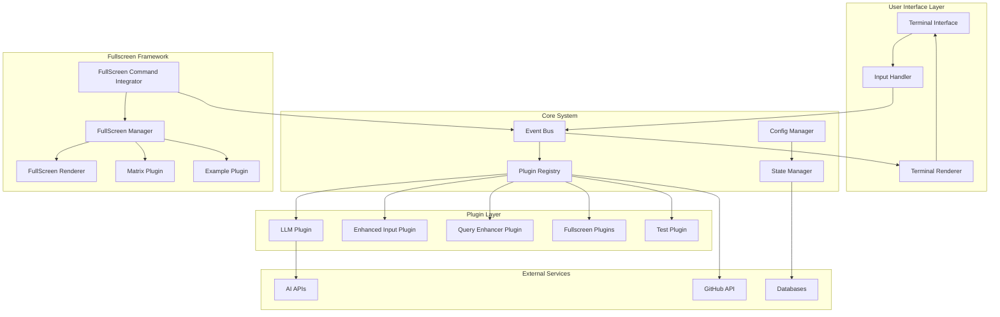

### Core Components

#### Event Bus
**Purpose**: Central communication hub for all system components
**Key Features**:
- Asynchronous event processing
- Hook-based plugin integration
- Event cancellation support
- Priority-based hook execution

```python
class EventBus:
    async def publish_event(self, event_type: str, data: dict) -> EventResult
    async def register_hook(self, event_type: str, hook_func: callable, priority: int)
    async def unregister_hook(self, hook_id: str)
```

#### Plugin Registry
**Purpose**: Dynamic plugin discovery and lifecycle management
**Key Features**:
- Auto-discovery of plugins from directory
- Plugin dependency resolution
- Configuration merging
- Status monitoring

```python
class PluginRegistry:
    def discover_plugins(self, directory: str) -> List[Plugin]
    def register_plugin(self, plugin_class: type) -> Plugin
    def get_plugin_status(self, plugin_name: str) -> PluginStatus
```

#### Fullscreen Framework
**Purpose**: Complete terminal takeover for immersive experiences
**Key Features**:
- Dynamic plugin discovery and command registration
- Alternate buffer management with proper restoration
- Real-time animation and input handling
- Clean separation from core CLI functionality

```python
class FullScreenCommandIntegrator:
    def discover_and_register_plugins(self, plugins_dir: Path) -> int
    def _register_plugin_commands(self, plugin_class: Type) -> bool
    def unregister_plugin(self, plugin_name: str) -> bool

class FullScreenManager:
    async def launch_plugin(self, plugin_name: str) -> bool
    def register_plugin(self, plugin: FullScreenPlugin) -> bool
    def get_plugin(self, name: str) -> Optional[FullScreenPlugin]

class FullScreenRenderer:
    def setup_terminal(self) -> bool
    def restore_terminal(self) -> bool
    def write_at(self, x: int, y: int, text: str, color: str = None)
```

**Plugin Structure**:
- Located in `plugins/fullscreen/`
- Auto-discovered and registered as slash commands
- Inherit from `FullScreenPlugin` base class
- Metadata-driven command registration

## Component Architecture

### I/O System Architecture

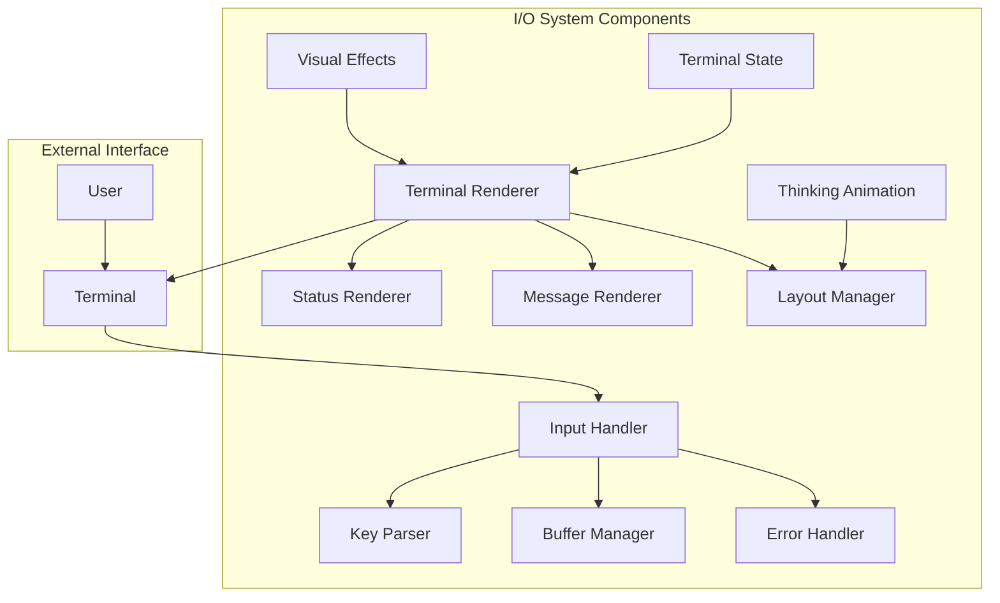

#### Terminal Renderer
**Purpose**: Main rendering coordinator
**Responsibilities**:
- Coordinate all visual updates
- Manage render loop timing (20 FPS)
- Handle dirty region tracking
- Integrate visual effects

#### Input Handler
**Purpose**: Advanced keyboard input processing
**Responsibilities**:
- Raw terminal input capture
- Key sequence parsing
- Input validation and sanitization
- Error recovery

#### Visual Effects
**Purpose**: Centralized visual styling and effects
**Capabilities**:
- Gradient generation
- Shimmer animations
- Color management
- Theme support

### Plugin Architecture

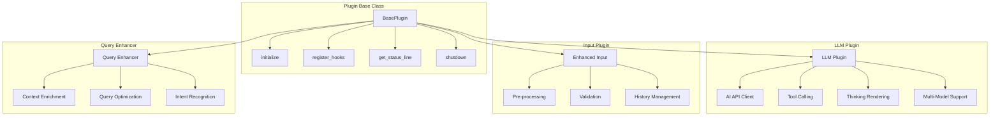

## Data Flow Architecture

### Event Processing Flow

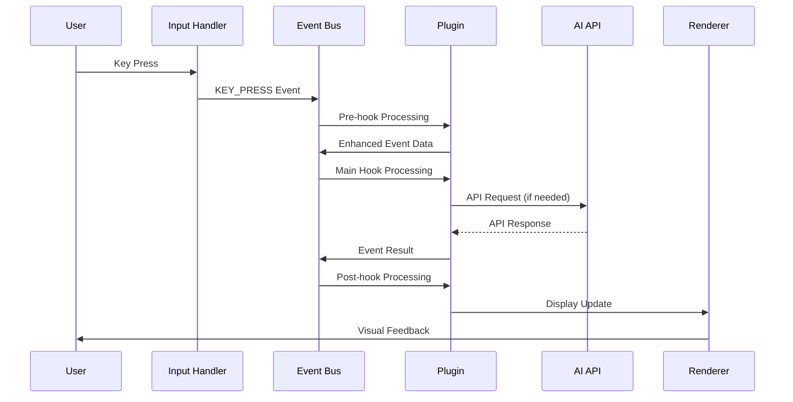

### Configuration Management Flow

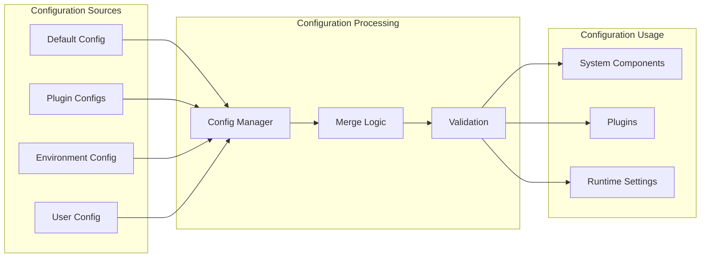

## Security Architecture

### Security Layers

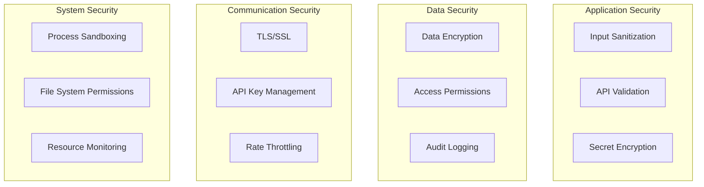

### Security Controls

#### Input Security
- **Sanitization**: Remove dangerous characters and sequences
- **Validation**: Verify input format and constraints
- **Rate Limiting**: Prevent abuse through excessive requests

```python
class SecurityManager:
    def sanitize_input(self, user_input: str) -> str:
        """Remove potentially dangerous input"""
        
    def validate_api_request(self, request: dict) -> bool:
        """Validate API request structure"""
        
    def check_rate_limit(self, user_id: str) -> bool:
        """Check if user exceeds rate limits"""
```

## Performance Architecture

### Performance Optimization Strategy

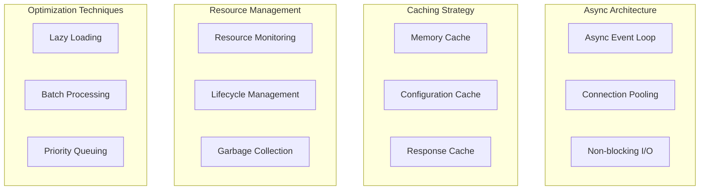

### Performance Metrics

#### System Performance
- **Render FPS**: Target 20 FPS for smooth terminal updates
- **Response Time**: < 100ms for user interactions
- **Memory Usage**: < 100MB for typical operations
- **CPU Usage**: < 5% during idle state

#### AI Performance
- **API Response Time**: Track and optimize AI API calls
- **Context Processing**: Efficient context management
- **Tool Orchestration**: Minimize overhead in multi-tool operations

## Scalability Architecture

### Horizontal Scaling Considerations

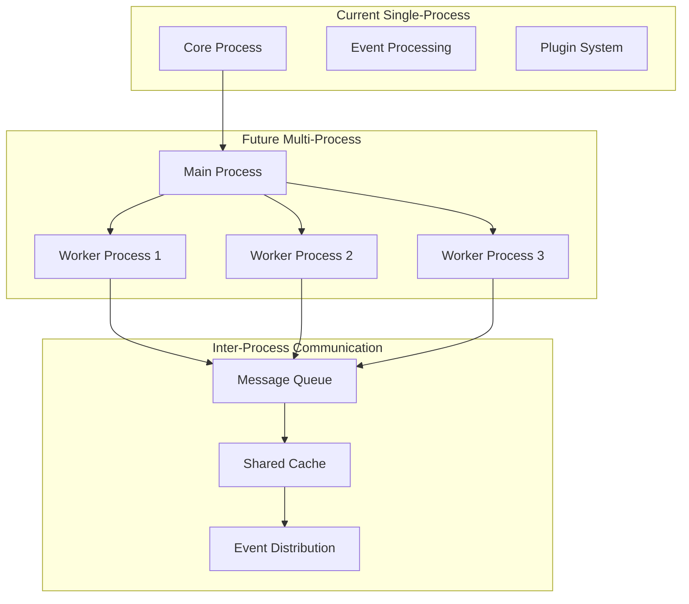

### Plugin Scaling
- **Isolated Plugin Processes**: Run plugins in separate processes
- **Resource Limits**: Enforce memory and CPU limits per plugin
- **Health Monitoring**: Monitor plugin health and restart if needed
- **Dynamic Loading**: Load plugins on-demand to save resources

## Integration Architecture

### External System Integration

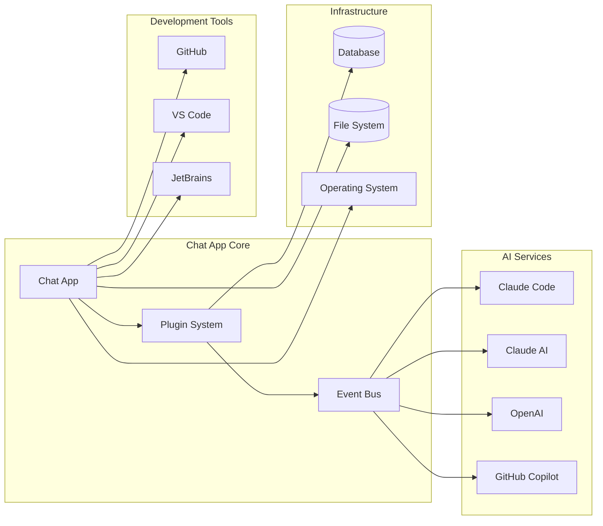

## Deployment Architecture

### Local Development Deployment

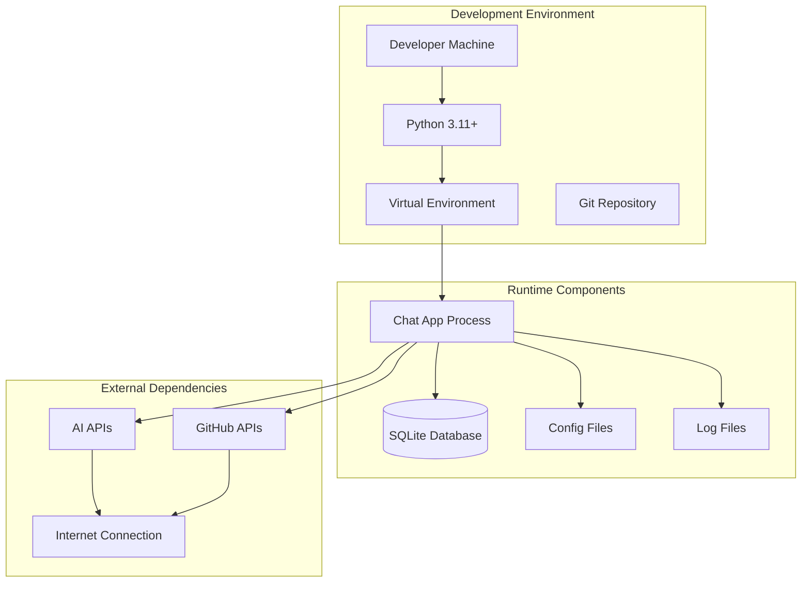

### Future Cloud Deployment

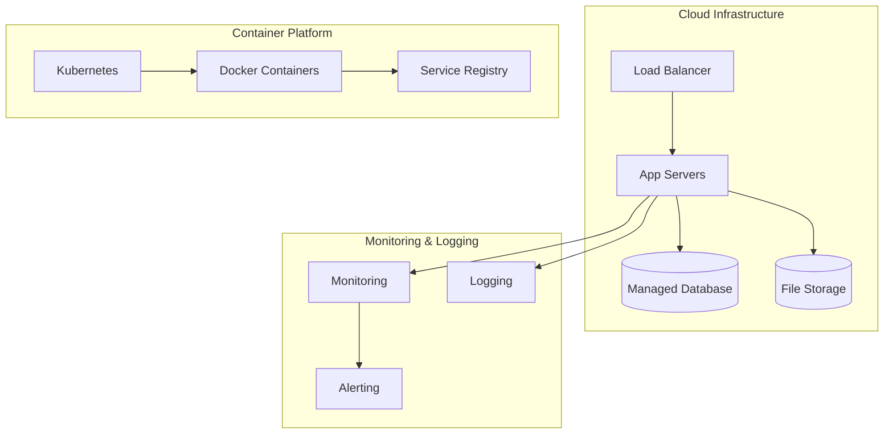

## Quality Architecture

### Quality Assurance Framework

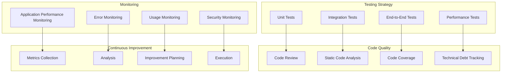

---

*This architecture overview provides a comprehensive understanding of the Chat App system design, component relationships, and architectural patterns that enable effective AI-assisted development.*