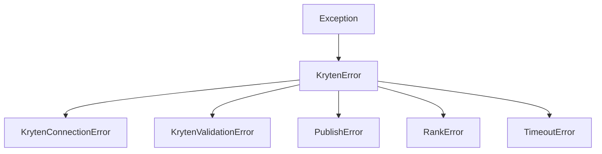

# Error Handling & Resilience

This guide details the exception hierarchy in `kryten-py`, the built-in retry mechanisms, and how to handle errors effectively.

## 1. Exception Hierarchy

All custom exceptions inherit from `KrytenError`.



### `KrytenError`
Base class for all library-specific exceptions.

### `KrytenConnectionError`
Raised when:
*   Initial connection to NATS fails.
*   Connection is lost and cannot be re-established.
*   Operations are attempted while disconnected (e.g., `client.publish` before `connect`).

### `KrytenValidationError`
Raised when:
*   Configuration is invalid (missing fields, invalid types).
*   Event data cannot be parsed into models.

### `PublishError`
Raised when:
*   A NATS publish operation fails (after retries).
*   Subject is invalid.

### `RankError` (Implicit)
When using `safe_` methods (e.g., `safe_kick_user`), insufficient rank is reported via the return dictionary (`{"success": False, "error": "Insufficient rank..."}`), not raised as an exception. This design choice prevents control flow interruptions for expected permission issues.

## 2. Retry Logic

`kryten-py` implements automatic retries for critical operations.

### NATS Connection
*   **Config:** `nats.max_reconnect_attempts` (default: -1/infinite) and `nats.reconnect_time_wait` (default: 2s).
*   **Behavior:** The underlying `nats-py` client handles reconnection automatically. `KrytenClient` exposes `disconnected_cb` and `reconnected_cb` to log these state changes.

### Command Publishing
The library does **not** currently implement automatic retries for individual command publishes (e.g., `send_chat`) to avoid message duplication (e.g., sending the same chat message twice).
*   **Recommendation:** Application logic should handle retries for idempotent operations if `PublishError` is caught.

## 3. Handling Errors in Event Handlers

Event handlers run concurrently. An unhandled exception in one handler does **not** crash the client or affect other handlers.

### Best Practice: Try/Except Blocks
Always wrap handler logic to catch application-specific errors.

```python
@client.on("chatmsg")
async def on_chat(event):
    try:
        if event.message == "!risky":
            await perform_risky_op()
    except ValueError as e:
        # Handle known logical error
        await client.send_chat(event.channel, f"Error: {e}")
    except Exception as e:
        # Catch-all to log unexpected failures
        client.logger.error(f"Handler failed: {e}", exc_info=True)
```

### Timeout Handling
Handlers have a default execution timeout (configured via `handler_timeout`, default 30s). If a handler hangs, it will be cancelled to free up resources.

```python
# Custom timeout for specific operation
try:
    async with asyncio.timeout(5.0):
        await long_running_task()
except asyncio.TimeoutError:
    logger.warning("Task timed out")
```

## 4. Subject Builder & Debugging

The library uses aggressive normalization for NATS subjects to ensure consistent routing.

### Normalization Rules
If you are debugging raw NATS messages, be aware that channel names and domains are normalized:
1.  **Lowercase:** `CyTu.be` -> `cytu.be`
2.  **No Dots:** `cytu.be` -> `cytube`
3.  **Spaces to Hyphens:** `My Channel` -> `my-channel`

**Example:**
*   Input: Channel `420.Grindhouse` on `CyTu.be`
*   Subject: `kryten.events.cytube.420grindhouse.chatmsg`

This normalization happens internally in `kryten.subject_builder`. If subscribing manually to raw subjects, you must match this format.
