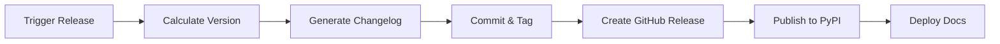

<!-- markdownlint-disable MD046 -->
# Releasing

This guide covers the release process for maintainers and contributors with release permissions.

## Overview

Releases are automated through GitHub Actions. The workflow handles version bumping, changelog generation, Git tagging, PyPI publishing, and documentation deployment.



## Triggering a Release

=== "GitHub Actions (Recommended)"

    1. Navigate to **Actions** → **Create Release**
    2. Click **Run workflow**
    3. Select the release type (`patch`, `minor`, or `major`)
    4. Click **Run workflow** to start

    !!! tip "When to Use"
        Best for scheduled releases or when you need full control over timing.

=== "PR Labels"

    Add one of these labels to a PR before merging:

    - `release:patch` — Bug fixes only
    - `release:minor` — New features (backward-compatible)
    - `release:major` — Breaking changes

    The release triggers automatically after the PR merges to `main`.

    !!! tip "When to Use"
        Best for feature releases tied to specific PRs.

## Release Types

| Type    | Version Change    | Use Case                                         |
| ------- | ----------------- | ------------------------------------------------ |
| `patch` | `1.0.0` → `1.0.1` | Bug fixes, security patches, documentation fixes |
| `minor` | `1.0.0` → `1.1.0` | New features, deprecations, non-breaking changes |
| `major` | `1.0.0` → `2.0.0` | Breaking API changes, major refactors            |

!!! info "Versioning Standard"
    This project follows [Semantic Versioning 2.0.0](https://semver.org/).

## Pre-Release Checklist

Before triggering a release, verify:

- [ ] All CI checks pass on `main`
- [ ] Branch is up to date with no pending critical PRs
- [ ] Changelog fragments exist in `changelog.d/` (or PR has `no-changelog` label)
- [ ] No blocking issues in the milestone
- [ ] Dependencies are up to date (if applicable)

```bash
# Verify changelog fragments exist
ls changelog.d/*.md

# Preview the changelog (optional)
nox -s changelog -- --draft
```

## Automated Workflow Steps

When a release is triggered, the following happens automatically:

| Step | Action                            | Tool/Service                                   |
| ---- | --------------------------------- | ---------------------------------------------- |
| 1    | Calculate next version            | GitHub Actions                                 |
| 2    | Generate changelog from fragments | [Towncrier](https://towncrier.readthedocs.io/) |
| 3    | Update `CHANGELOG.md`             | Towncrier                                      |
| 4    | Bump version in `pyproject.toml`  | Automated script                               |
| 5    | Commit changes                    | Git                                            |
| 6    | Create Git tag                    | Git                                            |
| 7    | Push to `main`                    | Git                                            |
| 8    | Create GitHub Release             | GitHub API                                     |
| 9    | Build distribution                | `hatch build`                                  |
| 10   | Publish to PyPI                   | `pypa/gh-action-pypi-publish`                  |
| 11   | Deploy documentation              | GitHub Pages                                   |

## Changelog Fragments

Each user-facing change requires a changelog fragment in `changelog.d/`.

### Fragment Format

```txt
changelog.d/<issue-or-pr-number>.<type>.md
```

### Fragment Types

| Type          | Description                       | Example             |
| ------------- | --------------------------------- | ------------------- |
| `.security`   | Security vulnerability fixes      | `215.security.md`   |
| `.removed`    | Removed features                  | `201.removed.md`    |
| `.deprecated` | Soon-to-be removed features       | `189.deprecated.md` |
| `.added`      | New features or functionality     | `142.added.md`      |
| `.changed`    | Changes to existing functionality | `178.changed.md`    |
| `.fixed`      | Bug fixes                         | `156.fixed.md`      |

### Example Fragment

```markdown
<!-- changelog.d/142.added.md -->
Added support for async context managers in `Client` class.
```

!!! tip "Skip Changelog"
    For changes that don't need changelog entries (typos, CI tweaks), add the `no-changelog` label to the PR

## Post-Release Verification

After a release completes:

1. **Verify PyPI**: Check [PyPI project page](https://pypi.org/project/lbx/) for the new version
2. **Verify GitHub Release**: Confirm release notes are accurate
3. **Verify Docs**: Check live documentation reflects changes
4. **Test Installation**:

   ```bash
   pip install lbx==X.Y.Z
   ```

## Troubleshooting

### Common Issues

| Problem                | Cause                   | Solution                                  |
| ---------------------- | ----------------------- | ----------------------------------------- |
| Release workflow fails | CI checks failing       | Fix failing tests, re-run workflow        |
| PyPI upload fails      | Version already exists  | Ensure version was bumped correctly       |
| PyPI upload fails      | Invalid token           | Verify `PYPI_API_TOKEN` secret            |
| Empty changelog        | No fragments found      | Add fragments or use `no-changelog`       |
| Docs not updating      | Deploy step failed      | Check `gh-pages` branch and workflow logs |
| Tag already exists     | Previous failed release | Delete tag and retry                      |

### Manual Recovery

If the automated release fails partway through:

```bash
# Check current state
git fetch --tags
git log --oneline -5

# If tag was created but release failed, delete and retry
git tag -d vX.Y.Z
git push origin :refs/tags/vX.Y.Z
```

## Hotfix Releases

For critical bugs in production:

1. Create a hotfix branch from the release tag:

   ```bash
   git checkout -b hotfix/issue-description vX.Y.Z
   ```

2. Apply the fix and add a changelog fragment

3. Open a PR to `main`

4. After merge, trigger a `patch` release immediately

## Rollback Procedures

!!! danger "Use with Caution"
    Only roll back if the release causes critical issues.

!!! warning "Manual Process Required"
    Since releases are automated via GitHub Actions, rollbacks must be performed manually.

### Yank from PyPI (Soft Rollback)

Prevents new installations but doesn't remove existing ones:

**Via PyPI Web Interface** (Only method available):

- Go to PyPI project page
- Navigate to Releases → Select version → Options → Yank
- Add reason for yanking

### Full Rollback

1. **Yank the release** from PyPI (see above)
2. **Update GitHub Release** with warning banner
3. **Create hotfix release** with the fix
4. **Communicate** with users via GitHub Discussions or issues

## Configuration Reference

### Required Secrets

Configure these in **Settings → Secrets and variables → Actions**:

| Secret           | Purpose         | How to Obtain                                             |
| ---------------- | --------------- | --------------------------------------------------------- |
| `PYPI_API_TOKEN` | PyPI publishing | [PyPI API tokens](https://pypi.org/manage/account/token/) |

!!! note "Trusted Publishers"
    Consider using [PyPI Trusted Publishers](https://docs.pypi.org/trusted-publishers/) instead of API tokens for improved security.

### Key Files

| File                            | Purpose                       |
| ------------------------------- | ----------------------------- |
| `.github/workflows/ci.yml`      | CI checks and tests workflow  |
| `.github/workflows/release.yml` | Release automation workflow   |
| `pyproject.toml`                | Project metadata and version  |
| `changelog.d/`                  | Changelog fragments directory |
| `docs/changelog.md`             | Generated changelog           |
| `towncrier.toml`                | Towncrier configuration       |

### Useful Commands

```bash
# Preview changelog without making changes
nox -s changelog -- --draft

# Build distribution locally
hatch build

# Deploy docs manually (if needed)
nox -s docs_deploy
```

## Release Schedule

!!! info "Optional Section"
    Include if you have a regular release cadence.

| Release Type | Frequency | Day               |
| ------------ | --------- | ----------------- |
| Minor        | Quarterly | First Monday      |
| Patch        | As needed | Any day           |
| Major        | As needed | With announcement |

## See Also

**Contributing Guides:**

- [Contributing Overview](index.md)
- [Development Setup](development.md)
- [Testing Guide](testing.md)

**External Resources:**

- [Semantic Versioning](https://semver.org/)
- [Towncrier Documentation](https://towncrier.readthedocs.io/)
- [GitHub Actions](https://docs.github.com/en/actions)
- [Hatch Documentation](https://hatch.pypa.io/)
- [PyPI Trusted Publishers](https://docs.pypi.org/trusted-publishers/)
