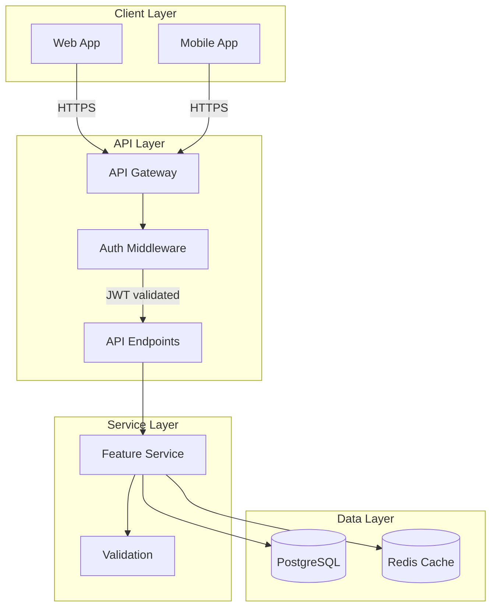
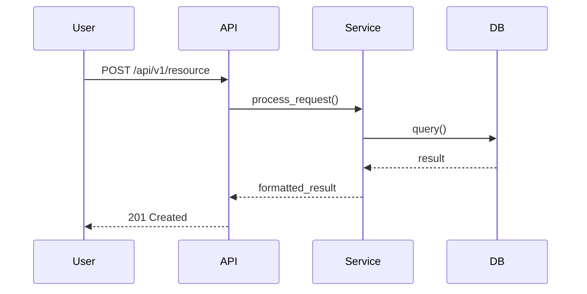
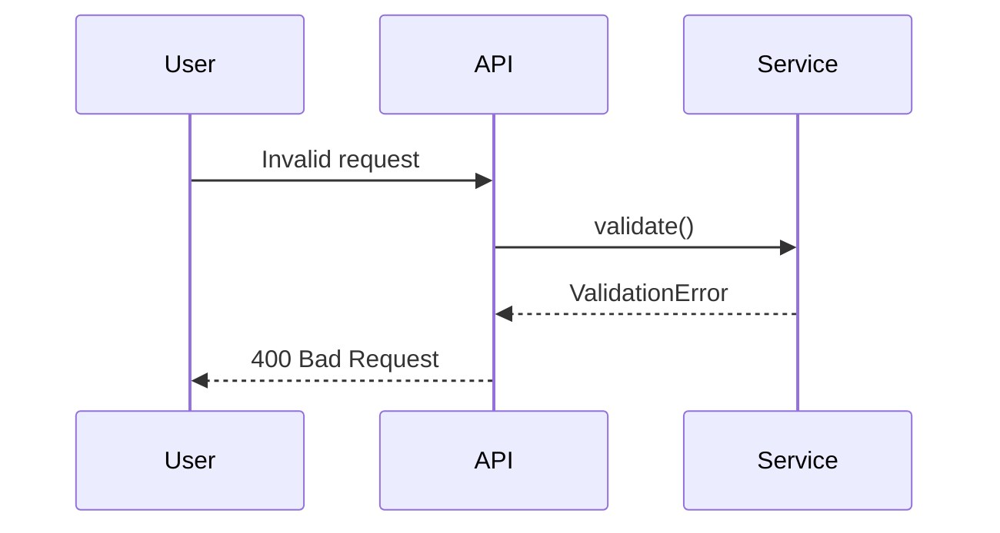

# {Feature Name} - Technical Design

<!-- Replace {Feature Name} with your feature name, matching requirements.md -->

## Architecture Overview

<!-- Example architecture diagram for a typical API feature.
     Replace with your actual components and interactions. -->



## Guardrail Mapping
**Maps guardrails from requirements.md to design components**

### Testing Coverage
- **Unit tests:** [Services/functions to test]
- **Integration tests:** [API flows to test]
- **Coverage target:** [X% minimum]

### Security Basics
- **Authentication:** [Method and location]
- **Authorization:** [RBAC/ABAC implementation]
- **Input validation:** [Where and how]
- **OWASP mitigations:** [Specific controls]

### Error Handling
- **Error hierarchy:** [Exception classes]
- **User messaging:** [Safe error messages]
- **Internal logging:** [What to capture]

### Logging & Observability
- **Structured logging:** [Format and fields]
- **Correlation IDs:** [How propagated]
- **Metrics:** [Counters/gauges to track]

### API Design
- **Versioning:** [Strategy, e.g., /v1/]
- **Pagination:** [Cursor/offset approach]
- **Error format:** [RFC 7807 or custom]

### Data Validation
- **Request validation:** [Schema validation approach]
- **Business rules:** [Domain validation]
- **Output sanitization:** [XSS prevention]

### Database Migrations
- **Migration tool:** [Alembic/Prisma/etc.]
- **Rollback strategy:** [How to reverse]
- **Backfill approach:** [Separate from schema changes]

### Documentation
- **API docs:** [OpenAPI/Swagger location]
- **Code comments:** [Where required]
- **README updates:** [What to document]

## Components

### 1. {Component Name}
**Purpose:** What this component does
**Location:** `{path/to/component}/`
**Dependencies:**
- Component X
- Library Y

**Key Classes/Functions:**
```
class ServiceName:
    def method_name(param: Type) -> ReturnType:
        """Description of what this does"""
        pass
```

**State Management:**
- What state does this manage?
- How is state persisted?

### 2. {Component Name}
[Repeat for each component]

## Data Models

### {Model Name}
```
Table: table_name

Columns:
- id: UUID (PK)
- field1: VARCHAR(255) NOT NULL
- field2: INTEGER DEFAULT 0
- created_at: TIMESTAMP WITH TIME ZONE

Indexes:
- idx_field1 ON (field1)
- idx_composite ON (field1, field2)
```

## Database Schema Changes

### New Tables
```sql
CREATE TABLE table_name (
    id UUID PRIMARY KEY DEFAULT gen_random_uuid(),
    field1 VARCHAR(255) NOT NULL,
    created_at TIMESTAMP WITH TIME ZONE DEFAULT NOW()
);
```

### Modified Tables
```sql
ALTER TABLE existing_table
ADD COLUMN new_field VARCHAR(100);

CREATE INDEX idx_new_field ON existing_table(new_field);
```

### Migration Strategy
- Migration file: `YYYY-MM-DD_description`
- Rollback approach: [describe]
- Data migration needed: Yes/No
- Downtime required: Yes/No

## API Endpoints

### POST /api/v1/{resource}
**Description:** What this endpoint does

**Authentication:** Required/Optional
**Authorization:** Roles: [list]

**Request:**
```json
{
  "field": "value",
  "nested": {
    "field": "value"
  }
}
```

**Response (201):**
```json
{
  "id": "uuid",
  "field": "value",
  "created_at": "2025-01-15T10:00:00Z"
}
```

**Errors:**
- 400: Invalid request - [conditions]
- 401: Unauthorized
- 403: Forbidden - [conditions]
- 404: Not found - [conditions]
- 500: Server error

### GET /api/v1/{resource}/{id}
[Repeat for each endpoint]

## Sequence Diagrams

### Happy Path


### Error Handling


## Security Considerations

### Authentication
- Method: [JWT/OAuth/Session]
- Token handling: [Storage, expiry]

### Authorization
- Strategy: [RBAC/ABAC]
- Resource-level: [specific rules]

### Data Validation
- Input: [Validation approach]
- Sanitization: [XSS/injection prevention]
- SQL injection: [Parameterized queries]

### Sensitive Data
- Passwords: [Hashing approach]
- API keys: [Storage approach]
- PII: [Handling approach]
- Logging exclusions: [What NOT to log]

## Performance Considerations

### Caching
- What: [data to cache]
- Where: [Redis/Memory/CDN]
- TTL: [time]
- Invalidation: [strategy]

### Database Optimization
- Indexes: [critical indexes]
- Query optimization: [approach]
- Connection pooling: [settings]

### Background Jobs
- Tasks: [list]
- Queue: [technology]
- Retry logic: [strategy]

## Error Handling

### Error Types
```
class FeatureError(Exception):
    """Base exception for feature"""
    status_code = 500

class ValidationError(FeatureError):
    status_code = 400

class NotFoundError(FeatureError):
    status_code = 404
```

### Logging Strategy
- Level: INFO for normal, ERROR for failures
- Include: Request ID, user ID, timestamp
- Exclude: Passwords, API keys, PII

### User Messaging
- Success: Clear confirmation
- Errors: User-friendly, actionable
- Never expose: Stack traces, internal details

## Testing Strategy

### Unit Tests
- What to test: Business logic
- Mocking: External dependencies
- Coverage: >80%

### Integration Tests
- Scenarios: [list]
- Database: [test DB approach]
- External APIs: Mocked

### E2E Tests (if applicable)
- User flows: [critical paths]
- Tools: [testing framework]

## Deployment Considerations

### Infrastructure
- Compute: [requirements]
- Database: [requirements]
- Storage: [requirements]

### Configuration
- Environment variables: [list]
- Secrets: [how managed]

### Monitoring
- Metrics: [what to track]
- Alerts: [conditions]
- Logging: [destinations]

## Open Technical Questions
1. [Question 1]
2. [Question 2]

---
**Status:** Draft | Approved | Implemented
**Created:** YYYY-MM-DD
**Last Updated:** YYYY-MM-DD
