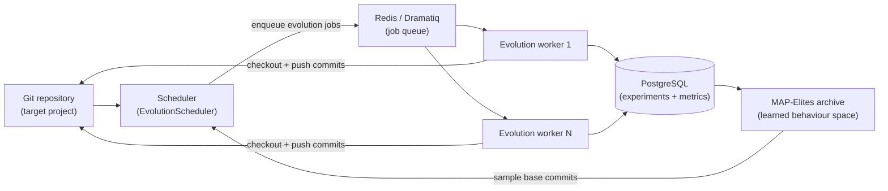
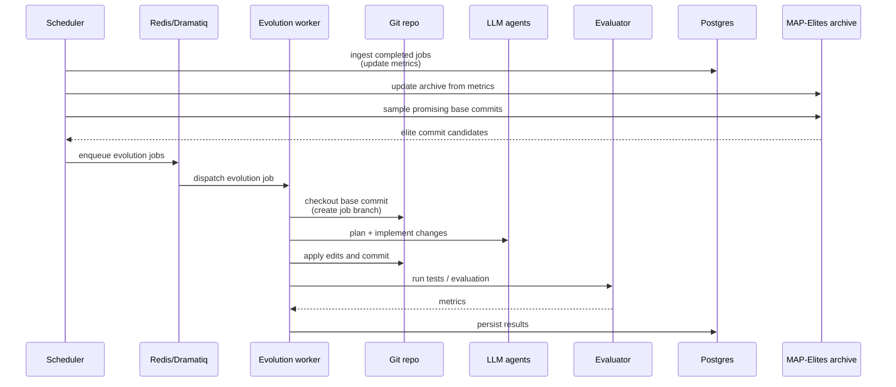

## Loreley

> Whole-repository Quality-Diversity optimization for real git codebases.

Loreley is an automated Quality-Diversity optimization system that **evolves entire git repositories**, not just single files or scripts. It continuously samples promising commits, asks external agents to plan and implement changes, evaluates them, and archives the best-performing and most diverse variants for later reuse.

Loreley is inspired by systems such as [AlphaEvolve](https://deepmind.google/blog/alphaevolve-a-gemini-powered-coding-agent-for-designing-advanced-algorithms/) and open-source efforts like [OpenEvolve](https://github.com/algorithmicsuperintelligence/openevolve), but is designed from day one for **whole-repo evolution**, a **learned behaviour space**, and a **production-grade distributed loop**.

---

### Challenges → core ideas

| Challenge in real repositories | Loreley core idea |
| --- | --- |
| Single-file evolution cannot express cross-module refactors and production changes | **Whole-repo evolution** |
| Hand-crafted behaviour descriptors do not generalise across projects | **Learned behaviour space** |
| Demo-style pipelines do not scale to distributed, long-running operation | **Production-grade distributed loop** |

---

### Methodology

Loreley treats software evolution as **quality-diversity search over the commit graph of a real repository**, guided by a learned behaviour space and driven by a production-grade distributed loop. Instead of using LLMs as one-shot patch generators, it organises planning, editing, evaluation, and archiving into a repeatable system that can safely explore improvements while remaining auditable (git), testable (evaluator), and operable (scheduler + workers).

---

### Core ideas

#### 1) Whole-repo evolution

Whole-repo evolution makes the **git commit** the fundamental unit of search. This solves the practical limitation of single-file optimisation: real improvements often require changing multiple modules, updating configs and build scripts, and keeping tests and tooling intact.

Repository-scale evolution has been demonstrated in the literature (for example, [SATLUTION](https://arxiv.org/pdf/2509.07367)), but many repository-scale loops are champion-based and rulebase-driven: a single “current best” becomes the next baseline, and extensive human-authored rules are used to keep the agent on track. This design can limit diversity and makes quality-diversity methods difficult to realise.


Loreley is designed to be **QD-native at repository scale**:

- it keeps a MAP-Elites archive of **multiple elites** across behavioural niches (not a single champion line),
- it samples from those niches as inspirations for new jobs,
- and it uses evaluator gates + repository semantics as the primary source of constraints, minimising dependence on domain-specific rulebases.

#### 2) Learned behaviour space

Quality-diversity methods require a behaviour space. Hand-crafted behaviour descriptors (file counts, line deltas, test counts, etc.) are brittle and often project-specific.


Loreley derives behaviour descriptors from **repo-state code embeddings** (file-level embeddings cached by git blob SHA and aggregated into a commit vector), optionally reduced with PCA. Summary embeddings remain available as an optional utility, but are not used for MAP-Elites behaviour descriptors in repo-state mode.

Under similar fitness, the archive can preserve structurally different improvements (refactors vs micro-optimisations vs feature shifts) as distinct behavioural niches, enabling exploration without collapsing to a single style of change.

#### 3) Production-grade distributed loop

Production-grade evolution requires more than an agent loop: it needs distributed execution, resource controls, and persistent traceability.

Loreley runs a long-lived loop with:

- a scheduler that ingests completed jobs, samples base commits, and enqueues new jobs,
- a Redis/Dramatiq worker fleet that runs planning/coding/evaluation per job,
- a PostgreSQL-backed store for experiments, commits, metrics, and archive state,
- explicit lifecycle controls (max unfinished jobs, optional total job caps, seed population, best-candidate branch export).

You can run a long optimisation campaign on a repository, scaling workers horizontally, while keeping the evolution process reproducible and observable.

---

### System overview

At a high level, Loreley sits between your git repository, a pool of LLM-based agents, and a MAP-Elites archive:



- **Scheduler**: keeps the experiment in sync with the repository, ingests completed jobs, samples new base commits from the MAP-Elites archive, and enqueues evolution jobs.
- **Workers**: for each job, check out a base commit, call external planning/coding/evaluation agents, create a new commit, and persist metrics.
- **Archive**: stores a diverse set of high-performing commits in a learned behaviour space, which the scheduler uses to inspire the next round of jobs.

---

### Evolution loop

The core evolution loop connects the scheduler, workers, git repository, evaluation plugins, and the MAP-Elites archive:



This loop can run indefinitely against a long-lived repository, gradually populating the MAP-Elites archive with diverse, high-quality commits.

---

### Architecture at a glance

Loreley is organised into a few main areas:

- **Configuration (`loreley.config`)** – a single `Settings` object (pydantic-settings) centralises environment-driven configuration for logging, database, Redis/Dramatiq, scheduler, worker repositories, and MAP-Elites knobs.
- **Database (`loreley.db`)** – SQLAlchemy engine/session helpers plus ORM models for repositories, experiments, commits, metrics, evolution jobs, and archive state.
- **Experiments (`loreley.core.experiments`)** – helpers for normalising the target git worktree into a `Repository`, deriving an `Experiment` from MAP-Elites and evaluator settings, and reusing the same experiment across scheduler runs.
- **MAP-Elites core (`loreley.core.map_elites`)** – repository preprocessing/chunking utilities, repo-state code embeddings (file cache), dimensionality reduction, archive management, sampling, and snapshot persistence via `MapElitesManager` (summary embeddings are optional utilities).
- **Worker pipeline (`loreley.core.worker`)** – worktree lifecycle, planning, coding, evaluation, evolution commits, commit summaries, and job persistence used by Dramatiq actors.
- **Tasks (`loreley.tasks`)** – Redis broker helpers and the `run_evolution_job(job_id)` Dramatiq actor that runs the evolution worker.
- **Scheduler (`loreley.scheduler`)** – `EvolutionScheduler` ingests completed jobs into MAP-Elites, dispatches pending jobs, maintains a seed population (when a root commit is configured), and can create a best-fitness branch when an experiment reaches its job cap.
- **Operational scripts (`script/run_scheduler.py`, `script/run_worker.py`)** – CLI shims that wire up Loguru/Rich logging, settings, the Redis broker, and the scheduler/worker entrypoints.
- **Docs (`docs/`)** – focused guides for configuration, scheduler behaviour, worker operations, and the MAP-Elites pipeline.

Module-level documentation lives under `docs/loreley/**` and `docs/script/**`. The rendered site is built with MkDocs into `site/`.

---

### Requirements & tooling

- Python 3.11+
- [`uv`](https://github.com/astral-sh/uv) for dependency management
- PostgreSQL and Redis (Dramatiq broker)
- Git (worktrees, LFS optional)
- Access to configured external planning/coding/evaluation agents

---

### Quick start

#### 1. Clone and install

```bash
git clone <YOUR_FORK_OR_ORIGIN_URL> loreley
cd loreley
uv sync          # install dependencies from pyproject.toml / uv.lock
```

If you already have an environment, you can pin dependencies without creating a workspace:

```bash
uv sync --no-workspace
```

#### 2. Bring up PostgreSQL + Redis (recommended for local dev)

Loreley requires PostgreSQL (metadata store) and Redis (Dramatiq broker). If you have Docker installed, you can start both with:

```bash
docker compose up -d postgres redis
```

#### 3. Configure

Copy the example environment file and edit the values:

```bash
cp env.example .env
```

All runtime settings come from environment variables consumed by `loreley.config.Settings`. Common examples:

- **Core app**
  - `APP_NAME`
  - `APP_ENV` (environment name, for example `development` / `staging` / `production`)
  - `LOG_LEVEL` (Loguru and Dramatiq log level)
- **Database**
  - `DATABASE_URL`
  - or individual `DB_SCHEME`, `DB_HOST`, `DB_PORT`, `DB_USER`, `DB_PASSWORD`, `DB_NAME`, `DB_POOL_SIZE`, `DB_MAX_OVERFLOW`, `DB_POOL_TIMEOUT`, `DB_ECHO`
- **Task queue / Dramatiq**
  - `TASKS_REDIS_URL` or (`TASKS_REDIS_HOST`, `TASKS_REDIS_PORT`, `TASKS_REDIS_DB`, `TASKS_REDIS_PASSWORD`)
  - `TASKS_REDIS_NAMESPACE`, `TASKS_QUEUE_NAME`
  - `TASKS_WORKER_MAX_RETRIES`, `TASKS_WORKER_TIME_LIMIT_SECONDS`
- **Scheduler**
  - `SCHEDULER_REPO_ROOT`
  - `SCHEDULER_POLL_INTERVAL_SECONDS`
  - `SCHEDULER_MAX_UNFINISHED_JOBS`, `SCHEDULER_MAX_TOTAL_JOBS`
  - `SCHEDULER_SCHEDULE_BATCH_SIZE`, `SCHEDULER_DISPATCH_BATCH_SIZE`, `SCHEDULER_INGEST_BATCH_SIZE`
- **Worker repository**
  - `WORKER_REPO_REMOTE_URL`, `WORKER_REPO_BRANCH`, `WORKER_REPO_WORKTREE`
  - `WORKER_REPO_ENABLE_LFS`, `WORKER_REPO_FETCH_DEPTH`, `WORKER_REPO_JOB_BRANCH_PREFIX`, `WORKER_REPO_JOB_BRANCH_TTL_HOURS`
- **Worker planning / coding**
  - `WORKER_PLANNING_CODEX_*` and `WORKER_CODING_CODEX_*` options configuring the default Codex-based planning/coding backends
  - `WORKER_PLANNING_BACKEND` and `WORKER_CODING_BACKEND` optional dotted paths to custom agent backends that implement the same protocol as the default Codex CLI backend
- **Evaluator**
  - `WORKER_EVALUATOR_PLUGIN`, `WORKER_EVALUATOR_PYTHON_PATHS`
  - `WORKER_EVALUATOR_TIMEOUT_SECONDS`, `WORKER_EVALUATOR_MAX_METRICS`
- **Evolution objective**
  - `WORKER_EVOLUTION_GLOBAL_GOAL` – plain-language global objective shared across jobs
- **MAP-Elites**
  - `MAPELITES_EXPERIMENT_ROOT_COMMIT` – optional experiment root commit used for seeding
  - `MAPELITES_EMBEDDING_MODE` (currently only `repo_state`)
  - `MAPELITES_FILE_EMBEDDING_CACHE_BACKEND` (`db` (default) or `memory`)
  - `MAPELITES_REPO_STATE_MAX_FILES` (optional cap for repo-state file enumeration)
  - `MAPELITES_PREPROCESS_*`, `MAPELITES_CHUNK_*`, `MAPELITES_CODE_EMBEDDING_*`
  - `MAPELITES_DIMENSION_REDUCTION_*`, `MAPELITES_FEATURE_*`, `MAPELITES_ARCHIVE_*`, `MAPELITES_FITNESS_*`, `MAPELITES_SAMPLER_*`, `MAPELITES_SEED_POPULATION_SIZE`
  - `MAPELITES_SUMMARY_*`, `MAPELITES_SUMMARY_EMBEDDING_*` (optional summary embedding utilities; not used for MAP-Elites behaviour descriptors in repo-state mode)

See `docs/loreley/config.md` for the exhaustive list.

Before starting long-running processes, you can run a quick preflight check:

```bash
uv run loreley doctor --role all
```

---

### Running Loreley

#### Scheduler loop

The scheduler drives ingestion, scheduling, dispatch, seeding, and archive maintenance:

```bash
uv run loreley scheduler        # continuous loop
uv run loreley scheduler --once # single tick

# legacy wrappers (still supported)
uv run python script/run_scheduler.py        # continuous loop
uv run python script/run_scheduler.py --once # single tick

# or invoke the module directly
uv run python -m loreley.scheduler.main        # continuous loop
uv run python -m loreley.scheduler.main --once # single tick
```

See `docs/script/run_scheduler.md` and `docs/loreley/scheduler/main.md` for details on scheduler behaviour and configuration.

#### Worker process

A worker process consumes jobs from Dramatiq, applies planning/coding/evaluation, and pushes results back into the database:

```bash
uv run loreley worker

# legacy wrapper (still supported)
uv run python script/run_worker.py
```

The worker configures Loguru/Rich logging, initialises the Redis broker defined in `loreley.tasks.broker`, imports `loreley.tasks.workers`, and launches a single-threaded Dramatiq worker bound to `TASKS_QUEUE_NAME`.

See `docs/script/run_worker.md`, `docs/loreley/core/worker/evolution.md`, and the other worker module docs under `docs/loreley/core/worker/` for deeper operational guidance.

---

### Documentation map

The full documentation lives under `docs/` and is rendered into `site/` via MkDocs. Useful entry points:

- `docs/index.md` – high-level overview and navigation.
- `docs/loreley/config.md` – global settings and environment variables.
- `docs/loreley/db/` – database engine/sessions and ORM models.
- `docs/loreley/core/map-elites/` – MAP-Elites pipeline (repo-state repository embeddings, preprocessing/chunking helpers, dimensionality reduction, sampler, snapshots, and optional summary embeddings).
- `docs/loreley/core/worker/` – planning, coding, evaluator, evolution loop, commit summaries, job store, and worker repository.
- `docs/loreley/scheduler/main.md` – scheduler internals and configuration.
- `docs/loreley/tasks/` – Redis broker and Dramatiq actors.
- [docs/loreley/api.md](docs/loreley/api.md) – UI API (FastAPI, read-only JSON).
- [docs/loreley/ui.md](docs/loreley/ui.md) – Streamlit UI dashboard (read-only observability).
- `docs/script/` – CLI wrappers for the scheduler and worker.

---

### Project layout

- `loreley/` – core services (`config`, `db`, `core/map_elites`, `core/worker`, `scheduler`, `tasks`).
- `script/` – CLI shims (`run_scheduler.py`, `run_worker.py`).
- `docs/` – module-level docs under `docs/loreley` and `docs/script`, rendered into `site/`.
- `pyproject.toml`, `uv.lock` – dependency definitions for `uv`.
- `examples/` – self-contained optimisation examples used for testing and demos.

---

### Examples

- **`examples/circle-packing`** – a geometric optimisation benchmark based on the classical
  [circle packing](https://en.wikipedia.org/wiki/Circle_packing) problem. The example defines:
  - a small standalone problem repository in `examples/circle-packing` with a `solution.py`
    that exposes `pack_circles(n: int = 26)` and returns `n` non-overlapping circles inside
    the unit square; the default instance uses `n = 26` and the objective is to maximise
    the sum of radii subject to the non-overlap and boundary constraints;
  - a companion evaluation environment in `examples/circle_packing_env` with an
    `evaluate.py` plugin that checks geometric validity (no overlap, inside bounds) and
    reports `sum_radii` (main objective), `packing_density`, and `num_circles`.

  You can wire this into the worker by pointing
  `WORKER_EVALUATOR_PYTHON_PATHS` at `examples/circle_packing_env` and setting
  `WORKER_EVALUATOR_PLUGIN=evaluate:plugin`, then letting MAP-Elites evolve better packings.

  The best evolved result for this example is available on the `evolution/best/b11e0430`
  branch of the `examples/circle-packing` repository.

---

### License

See `LICENSE` for details.
