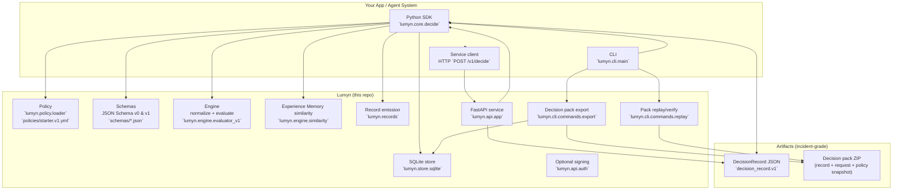
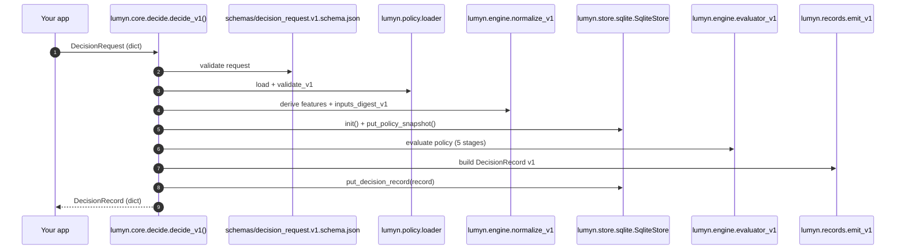
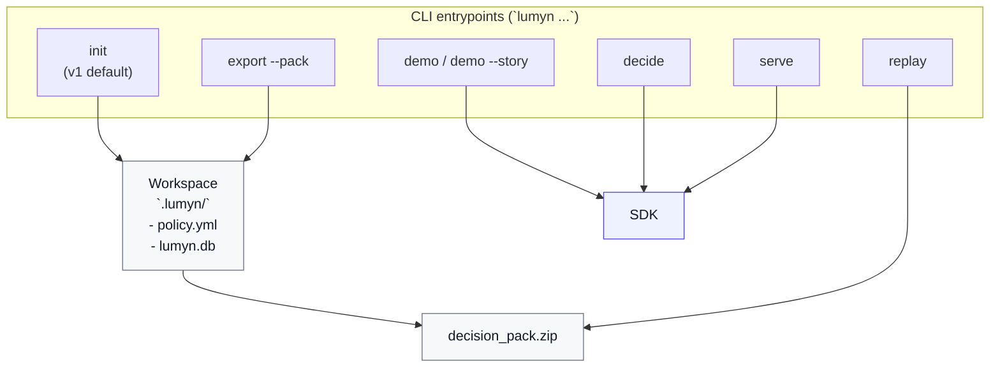

# Architecture

This document describes Lumyn’s architecture: a Python SDK, a CLI, and an optional FastAPI service that all produce deterministic `DecisionRecord` artifacts.

## High-level component architecture

## SDK flow: `decide_v1()` end-to-end

The SDK is the source-of-truth flow; both the CLI and the service call into it.

## CLI flows

## Key "source of truth" files

- SDK core: `src/lumyn/core/decide.py`
- Policy V1: `src/lumyn/policy/validate.py` (strict validation logic)
- Engine V1: `src/lumyn/engine/evaluator_v1.py`
- Records: `src/lumyn/records/emit_v1.py`
- Service: `src/lumyn/api/routes_v1.py`
