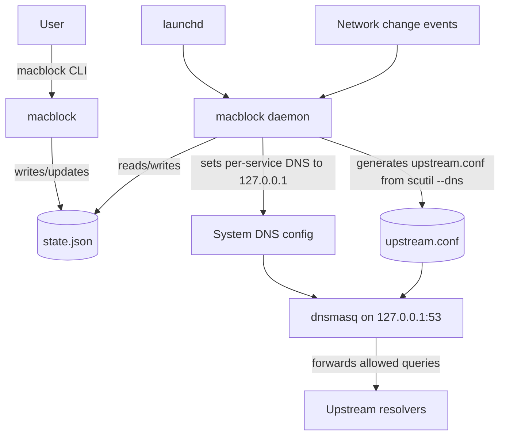

# macblock

[](https://github.com/SpyicyDev/macblock/actions/workflows/ci.yml)
[](https://pypi.org/project/macblock/)
[](LICENSE)

Local DNS sinkhole for macOS using `dnsmasq` on `127.0.0.1:53`, with automatic system DNS configuration and split-DNS preservation.

## Why?

I like Pi-Hole, but I don't necessarily want to deploy a whole box on a network for DNS adblock, or have the whole network go through it. I also wanted a better solution than running Pi-Hole in a container on MacOS, which felt like adding a whole lot of overhead for a relatively lightweight service. After some searching, I found I could configure `dnsmasq` myself and run a fairly simple sinkhole as a service. `macblock` is a CLI and long-running management service that make the installation, configuration, and management of a `dnsmasq`-based DNS sinkhole on MacOS easy.

## Vibe-coding disclaimer

Most of this project was vibe-coded with careful code review and analysis of what the daemon touches. Every effort was made to ensure that the services here are using root as little as possible. If you find any holes I missed, please open an issue or a PR!

## Features

- Blocks ads, trackers, and malware at the DNS level
- Automatically configures DNS for managed network services
- Preserves VPN/corporate split-DNS routing
- Pause/resume with automatic timers
- Whitelist/blacklist management
- Multiple blocklist sources (StevenBlack, HaGeZi, OISD) or a custom URL

## Install

### Via Homebrew (recommended)

```bash
brew install SpyicyDev/formulae/macblock
```

Or, if you prefer adding the tap explicitly:

```bash
brew tap SpyicyDev/formulae
brew install macblock
```

### Via PyPI

This installs the `macblock` CLI, but you still need `dnsmasq` available on your system (recommended via Homebrew):

```bash
brew install dnsmasq
python3 -m pip install macblock
```

### Quick start

`macblock` performs privileged operations (launchd + system DNS changes). You can run root-required commands with `sudo`, or omit it and let `macblock` auto-elevate.

```bash
sudo macblock install
sudo macblock enable
macblock status
```

## Usage

```text
macblock <command> [flags]
```

### Global flags

- `-h`, `--help`: show help for a command
- `-V`, `--version`: show version

### Commands

Status & diagnostics:

- `macblock status`: show current status
- `macblock doctor`: run diagnostics and health checks
- `macblock logs [--component daemon|dnsmasq] [--lines N] [--follow] [--stream auto|stdout|stderr]`: view logs
- `macblock test <domain>`: test resolution against the local resolver

Control:

- `sudo macblock enable`: enable DNS blocking
- `sudo macblock disable`: disable DNS blocking
- `sudo macblock pause <duration>`: temporarily disable (e.g. `10m`, `2h`, `1d`)
- `sudo macblock resume`: resume blocking

Installation & updates:

- `sudo macblock install [--force] [--skip-update]`: install system integration
- `sudo macblock uninstall [--force]`: remove system integration
- `sudo macblock update [--source <name|url>] [--sha256 <hash>]`: download + compile blocklist and reload dnsmasq

Configuration:

- `macblock sources list`: list available blocklist sources
- `sudo macblock sources set <source>`: set blocklist source (updates state only; run `sudo macblock update` to download/compile/apply)
- `macblock upstreams list`: list configured fallback upstream DNS servers (if any)
- `sudo macblock upstreams set [ip ...]`: set fallback upstream DNS servers (prompts if none provided)
- `sudo macblock upstreams reset`: reset fallback upstream DNS servers to built-in defaults
- `macblock allow list`: list whitelisted domains
- `sudo macblock allow add|remove <domain>`: manage whitelist
- `macblock deny list`: list blacklisted domains
- `sudo macblock deny add|remove <domain>`: manage blacklist

Tip: `macblock <command> --help` shows per-command usage.

## How it works

1. `dnsmasq` listens on `127.0.0.1:53` and serves DNS.
2. The macblock daemon watches for network changes and reconciles state.
3. When enabled, macblock sets DNS to `127.0.0.1` for a set of managed macOS network services (it intentionally skips VPN-ish services/devices).
4. macblock generates dnsmasq upstream routing from `scutil --dns` so domain-specific resolvers (VPN/corporate split-DNS) keep working.
5. Blocked domains are answered as `NXDOMAIN` via dnsmasq rules.



Note: Encrypted DNS (DoH/DoT) can bypass macblock; `macblock doctor` warns if detected.

## `macblock test` behavior

`macblock test <domain>` runs `dig` against `127.0.0.1:53` and uses the compiled block rules to interpret `NXDOMAIN`:

- If the domain matches a block rule, `NXDOMAIN` is reported as **BLOCKED**.
- If the domain does not match a block rule, `NXDOMAIN` is reported as **does not exist**.

If you don't have `dig`, install it with:

```bash
brew install bind
```

## Uninstall

See `docs/UNINSTALL.md`.

Quick version:

```bash
sudo macblock uninstall

# If installed via Homebrew
brew uninstall macblock dnsmasq

# If installed via PyPI
python3 -m pip uninstall macblock
```

## Filesystem footprint

macblock keeps its on-disk footprint intentionally small and predictable:

- `/Library/Application Support/macblock/`: persistent state + configuration
  - `state.json`, `version`, `blocklist.*`, `whitelist.txt`, `blacklist.txt`, `dns.exclude_services`, `upstream.fallbacks`, `etc/dnsmasq.conf`
- `/Library/Logs/macblock/`: service logs (managed by launchd)
  - `daemon.{out,err}.log`, `dnsmasq.{out,err}.log`
- `/var/db/macblock/`: runtime state (safe to delete; will be recreated)
  - `upstream.conf`, `daemon.pid`, `daemon.ready`, `dnsmasq/dnsmasq.pid`
- `/Library/LaunchDaemons/`: launchd plists
  - `com.local.macblock.daemon.plist`, `com.local.macblock.dnsmasq.plist`

macblock also modifies system DNS settings via `networksetup`.

## Service classification and overrides

macblock chooses a set of “managed” network services to apply DNS changes to (and intentionally skips VPN-ish services/devices) using a heuristic.

If a service is being managed when you don't want it to be (or vice-versa), you can override selection by creating:

- `/Library/Application Support/macblock/dns.exclude_services`

Format:

- One exact service name per line.
- Blank lines are ignored.
- Lines starting with `#` are comments.

To find the exact service names on your system:

```bash
/usr/sbin/networksetup -listallnetworkservices
```

Example:

```text
# Keep macblock from touching these services
Tailscale Tunnel
My VPN
```

## Troubleshooting

- Run `macblock doctor` first.
- View logs: `macblock logs --component daemon --stream stderr` or `macblock logs --component dnsmasq --stream stderr`.
- Verify DNS state: `scutil --dns` (macblock uses this to preserve split DNS).
- Port conflict on `:53`: `sudo lsof -i :53 -P -n`.

## Attribution

macblock can download third-party blocklists from:

- StevenBlack hosts: https://github.com/StevenBlack/hosts
- HaGeZi DNS blocklists: https://github.com/hagezi/dns-blocklists
- OISD: https://oisd.nl/

Please review each upstream project's license/terms. macblock does not vendor or redistribute these lists in this repository.

## Security

See `SECURITY.md` for the threat model and privileged footprint.

## Development

Tooling:

```bash
brew install just direnv
```

Then:

```bash
direnv allow
just sync
just ci
```

## License

MIT
