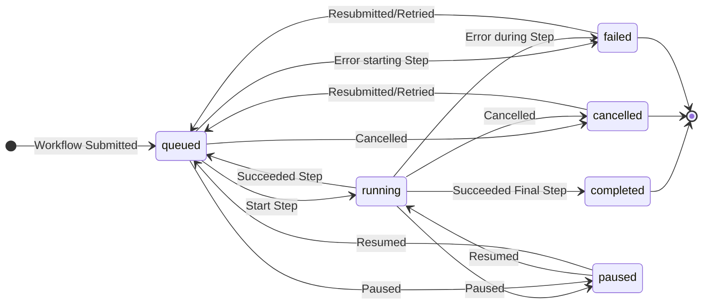

# MADSci Workcell Manager

The MADSci Workcell Manager handles the operation of a **Workcell**, a collection of **Nodes**, **Locations**, and **Resources** that are scheduled together to perform **Workflows**. A lab may consist of multiple Workcells, with each Workcell able to execute workflows independently.


## Installation

See the main [README](../../README.md#installation) for installation options. This package is available as:
- PyPI: `pip install madsci.workcell_manager`
- Docker: Included in `ghcr.io/ad-sdl/madsci`
- **Example configuration**: See [example_lab/managers/example_workcell.manager.yaml](../../example_lab/managers/example_workcell.manager.yaml)

**Dependencies**: MongoDB and Redis (see [example docker-compose](./workcell_manager.compose.yaml) or [example_lab](../../example_lab/))

## Usage

### Quick Start

Use the [example_lab](../../example_lab/) as a starting point:

```bash
# Start with working example
docker compose up  # From repo root
# Workcell Manager available at http://localhost:8005/docs

# Or run standalone using the server class
python -c "from madsci.workcell_manager.workcell_server import WorkcellManager; WorkcellManager().run_server()"
```

### Workcell Setup

For custom deployments:

```bash
# Create a Workcell Definition
madsci workcell create
```

See [example_workcell.manager.yaml](../../example_lab/managers/example_workcell.manager.yaml) for configuration options.

### Workcell Client

Use `WorkcellClient` to submit workflows and manage workcell operations:

```python
from madsci.client.workcell_client import WorkcellClient

workcell_client = WorkcellClient("http://localhost:8005")

# Submit workflow from file (recommended)
workflow = workcell_client.submit_workflow(
    workflow="path/to/workflow.yaml",
    json_inputs={"test_param": 10},
    file_inputs={"input_file": "./data.csv"}
)

# Access workflow results with helper methods
# Get datapoint ID from a specific step
datapoint_id = workflow.get_datapoint_id("analysis_step")

# Get full datapoint object from a specific step
datapoint = workflow.get_datapoint("analysis_step")

# Or create workflow programmatically
from madsci.common.types.workflow_types import WorkflowDefinition
from madsci.common.types.step_types import StepDefinition

wf_def = WorkflowDefinition(
    name="Test Workflow",
    parameters=[{"name": "test_param", "default": 0}],
    steps=[StepDefinition(
        name="Test Step",
        node="liquidhandler_1",  # Must exist in workcell
        action="test_action",
        args={"test_arg": "${test_param}"}
    )]
)
workflow = workcell_client.submit_workflow(workflow=wf_def)

# Query workflow status
status = workcell_client.query_workflow(workflow.workflow_id)
```

**Example workflows**: See [example_lab/workflows/](../../example_lab/workflows/) for complete workflow definitions.

**Workflow Result Access:**
```python
# Submit workflow and wait for completion (await_completion=True by default)
workflow = workcell_client.submit_workflow("analysis.workflow.yaml")

# Or submit without waiting and poll status manually
workflow = workcell_client.submit_workflow("analysis.workflow.yaml", await_completion=False)
while not workflow.status.terminal:
    workflow = workcell_client.query_workflow(workflow.workflow_id)
    time.sleep(1)

# Access step results efficiently
analysis_datapoint_id = workflow.get_datapoint_id("analysis_step")
analysis_result = workflow.get_datapoint("analysis_step")

# Results are automatically validated and properly typed
if analysis_result.datapoint_type == "value":
    data = analysis_result.value  # Direct access to result data
elif analysis_result.datapoint_type == "file":
    file_path = analysis_result.file_path  # Access to result files
```

## Defining a Workcell

You can create a new `WorkcellDefinition` file (typically a `.workcell.yaml`) using the command `madsci workcell create`

### Nodes

Nodes are required to execute the action required by each step in a Workflow. Each Node typically corresponds to a physical device (robot, instrument, sensor, etc.) in your laboratory.

In the workcell definition files `nodes` section, you can specify each node avaiable in the workcell as a mapping of node alias to the node's URL. When specifying the node to execute a step on in a Workflow, you should use the node alias defined here, rather than the node name according to the node itself.

### Locations

You can define important locations in your workcell, optionally linking them to container resources, using the `locations` list. This top-level element of the `WorkcellDefinition` allows you to provide a list of `LocationDefinition` objects.

#### Location Properties

Each `LocationDefinition` has the following important properties:

- **`location_name`** and **`location_id`**: Human-readable name and unique identifier for the location
- **`reference`**: Dictionary mapping node names to node-specific representations of the location
- **`resource_id`** or **`resource_definition`**: Optional container resource attachment

#### Location Reference Examples

The `reference` dictionary allows different nodes to refer to the same physical location using their own coordinate systems or naming conventions:

```yaml
# Example workcell.manager.yaml
locations:
  - location_name: "sample_rack_position_1"
    location_id: "01ARZ3NDEKTSV4RRFFQ69G5FAV"
    reference:
      # Robot arm uses XYZ coordinates
      "robot_arm_1": {"x": 150.5, "y": 200.0, "z": 75.0}
      # Liquid handler uses well plate notation
      "liquidhandler_1": {"plate": "plate1", "well": "A01"}
      # Camera uses pixel coordinates
      "camera_1": {"pixel_x": 320, "pixel_y": 240}
      # Simple string reference for other nodes
      "barcode_reader": "rack_position_1"
    resource_definition:
      resource_type: "sample_tube"
      capacity: "1.5mL"
```

#### Using Locations in Workflows

When defining workflow steps, reference locations by name. The workcell manager automatically provides the appropriate node-specific reference:

```python
# In a workflow step definition
StepDefinition(
    name="Move sample",
    node="robot_arm_1",
    action="move_to_location",
    locations=["sample_rack_position_1"]  # Robot receives {"x": 150.5, "y": 200.0, "z": 75.0}
)

StepDefinition(
    name="Pipette sample",
    node="liquidhandler_1",
    action="aspirate",
    locations=["sample_rack_position_1"]  # Liquid handler receives {"plate": "plate1", "well": "A01"}
)
```

#### Common Location Patterns

**Tip rack locations** for liquid handlers:
```yaml
- location_name: "tip_rack_200uL"
  reference:
    "liquidhandler_1": {"rack": "tips_200", "position": 1}
    "robot_arm_1": {"x": 100, "y": 150, "z": 80}
```

**Shared workspace locations**:
```yaml
- location_name: "transfer_station"
  reference:
    "robot_arm_1": {"x": 250, "y": 250, "z": 100}
    "conveyor_belt": {"station": "transfer"}
    "sensor_node": {"zone": "transfer_area"}
```

This flexible reference system enables different nodes to work with the same physical locations using their native coordinate systems and naming conventions.

## Defining Workflows

MADSci Workcell Managers accept `WorkflowDefinition`s, which define a sequence of steps to be run on a Workcell. Each step represents an Action to be taken by a Node.

Workflows can either be directly created as python objects, or defined as YAML files (typically with the `.workflow.yaml` extension) which are then read, validated, and submitted by the workcell client.

**Enhanced Features:**
- **Flexible data handling**: Support for JSON inputs, file uploads, and complex parameter types
- **Result validation**: Automatic validation of step results and datapoint creation
- **Helper methods**: Convenient access to step results via `get_datapoint()` and `get_datapoint_id()`
- **Error handling**: Improved error reporting and workflow recovery mechanisms
- **Type safety**: Full validation of workflow parameters and step arguments

### Steps

The `steps` list allows you to specify a sequence of `StepDefinition`s, which are evaluated by the Workcell Manager's Scheduler and executed when able.

A step has the following important properties:

- `name`: the human-readable name of the step
- `description`: optional, a longer/more-detailed description of the step
- `node`: the name of the node used to perform this step. This must match the name of a node in the workcell definition (so if the node's name and the alias used by the workcell differ, use the workcell's version)
- `action`: the name of the action to be performed (must match an action provided by the node)
- `args`: a dictionary of argument names and values to pass to the node when executing the action
- `files`: a dictionary of file argument names and paths to upload to the node when executing the action
- `locations`: any locations to be passed to the node as arguments. Note that this will send _just the representation relevant to that node_, so the workcell's `LocationDefinition` must include a reference value matching the node name.
- `conditions`: a list of user-specified conditions that must be met before this step can be run.
- `data_labels`: allows you to attach unique labels to datapoints returned as part of the action results.

**Enhanced Result Handling:**
Steps now support flexible return types from nodes, including direct JSON data, datapoint IDs, file paths, and custom Pydantic models. The workcell engine automatically handles serialization and provides convenient access methods for retrieving results.

### Parameters

You can, optionally, specify `WorkflowParameter`s in the `parameters` field of a workflow. These consist of a `name` and, optionally, a `default` value. When submitting a workflow, you can specify values for these parameters to be used in the workflow.

You can use a workflow parameter's value in a workflow definition with the following syntax:

- `${parameter_name}`
- `$parameter_name`

If a parameter has no default value and a value is not provided when the workflow is submitted, an exception is thrown.

## Workflow Lifecycle

The below state diagrams illustrates the evolution of a Workflow's status over the course of it's life, from submission to reaching a terminal state.


## Database Migration Tools

MADSci Workcell Manager includes automated MongoDB migration tools that handle schema changes and version tracking for the workcell management system.

### Features

- **Version Compatibility Checking**: Automatically detects mismatches between MADSci package version and MongoDB schema version
- **Automated Backup**: Creates MongoDB dumps using `mongodump` before applying migrations to enable rollback on failure
- **Schema Management**: Creates collections and indexes based on schema definitions
- **Index Management**: Ensures required indexes exist for optimal query performance
- **Location Independence**: Auto-detects schema files or accepts explicit paths
- **Safe Migration**: All changes are applied transactionally with automatic rollback on failure

### Usage

#### Standard Usage
```bash
# Run migration for workcells database (auto-detects schema file)
python -m madsci.common.mongodb_migration_tool --database madsci_workcells

# Migrate with explicit database URL
python -m madsci.common.mongodb_migration_tool --db-url mongodb://localhost:27017 --database madsci_workcells

# Use custom schema file
python -m madsci.common.mongodb_migration_tool --database madsci_workcells --schema-file /path/to/schema.json

# Create backup only
python -m madsci.common.mongodb_migration_tool --database madsci_workcells --backup-only

# Restore from backup
python -m madsci.common.mongodb_migration_tool --database madsci_workcells --restore-from /path/to/backup

# Check version compatibility without migrating
python -m madsci.common.mongodb_migration_tool --database madsci_workcells --check-version
```

#### Docker Usage
When running in Docker containers, use docker-compose to execute migration commands:

```bash
# Run migration for workcells database in Docker
docker-compose run --rm workcell-manager python -m madsci.common.mongodb_migration_tool --db-url 'mongodb://mongodb:27017' --database 'madsci_workcells' --schema-file '/app/madsci/workcell_manager/schema.json'

# Create backup only in Docker
docker-compose run --rm workcell-manager python -m madsci.common.mongodb_migration_tool --db-url 'mongodb://mongodb:27017' --database 'madsci_workcells' --schema-file '/app/madsci/workcell_manager/schema.json' --backup-only

# Check version compatibility in Docker
docker-compose run --rm workcell-manager python -m madsci.common.mongodb_migration_tool --db-url 'mongodb://mongodb:27017' --database 'madsci_workcells' --schema-file '/app/madsci/workcell_manager/schema.json' --check-version
```

### Server Integration

The Workcell Manager server automatically checks for version compatibility on startup. If a mismatch is detected, the server will refuse to start and display migration instructions:

```bash
DATABASE INITIALIZATION REQUIRED! SERVER STARTUP ABORTED!
The database exists but needs version tracking setup.
To resolve this issue, run the migration tool and restart the server.
```

### Schema File Location

The migration tool automatically searches for schema files in:
- `madsci/workcell_manager/schema.json`

### Backup Location

Backups are stored in `.madsci/mongodb/backups/` with timestamped filenames:
- Format: `madsci_workcells_backup_YYYYMMDD_HHMMSS`
- Can be restored using the `--restore-from` option

### Requirements

- MongoDB server running and accessible
- MongoDB tools (`mongodump`, `mongorestore`) installed
- Appropriate database permissions for the specified user

## ID Generation

MADSci uses **ULID (Universally Unique Lexicographically Sortable Identifier)** for all ID generation throughout the system. ULIDs provide several advantages over traditional UUIDs:

- **Better performance** than UUIDs
- **Lexicographical sorting** capability
- **Timestamp-based ordering** for natural chronological sorting
- **Universally unique** identification

When working with MADSci workflows, all workflow IDs, step IDs, and other identifiers are ULIDs. This ensures consistent ordering and efficient database operations.

### ULID Example
```python
from madsci.common.utils import new_ulid_str

# Generate a new ULID for custom use cases
custom_id = new_ulid_str()
# Example output: '01ARZ3NDEKTSV4RRFFQ69G5FAV'
```

## Scheduler Architecture

The MADSci Workcell Manager uses a pluggable scheduler architecture to determine workflow execution order and resource allocation. Schedulers implement the `AbstractScheduler` interface and are responsible for determining which workflows are ready to run and their execution priority.

### Available Schedulers

#### Default FIFO Scheduler
The default scheduler implements a **First-In-First-Out (FIFO)** strategy with the following characteristics:

- **Execution Order**: Workflows are executed in the order they were submitted
- **Resource Checking**: Validates that required nodes and resources are available before marking workflows as ready
- **Condition Evaluation**: Evaluates user-defined conditions before allowing workflow execution
- **Priority Assignment**: Assigns priority based on submission time (earlier submissions get higher priority)

#### Custom Scheduler Implementation

You can create custom schedulers by extending the `AbstractScheduler` class:

```python
from madsci.workcell_manager.schedulers.scheduler import AbstractScheduler
from madsci.common.types.workflow_types import SchedulerMetadata, Workflow

class CustomScheduler(AbstractScheduler):
    def run_iteration(self, workflows: list[Workflow]) -> dict[str, SchedulerMetadata]:
        """
        Custom scheduling logic goes here.

        Returns:
            dict mapping workflow IDs to SchedulerMetadata with:
            - ready_to_run: bool indicating if workflow can execute
            - priority: int for execution ordering (higher = more priority)
            - reasons: list of strings explaining why workflow isn't ready (if applicable)
        """
        scheduler_metadata = {}

        for workflow in workflows:
            # Custom logic to determine readiness and priority
            metadata = SchedulerMetadata(
                ready_to_run=True,  # Your logic here
                priority=100,       # Your priority calculation
                reasons=[]          # Any blocking reasons
            )
            scheduler_metadata[workflow.workflow_id] = metadata

        return scheduler_metadata
```

### Scheduler Configuration

Schedulers have access to the following components through the base class:
- **WorkcellStateHandler**: Current state of the workcell and workflows
- **ResourceClient**: Interface to the resource management system
- **LocationClient**: Interface to location management
- **EventClient**: For logging scheduler decisions and events

The scheduler's `run_iteration` method is called at regular intervals by the Workcell Engine to reassess workflow readiness and priorities based on current system state.

## Configuration

The Workcell Manager can be configured using environment variables with the `WORKCELL_` prefix, configuration files, or programmatically through settings objects.

### Environment Variables

| Variable | Default | Description |
|----------|---------|-------------|
| `WORKCELL_SERVER_URL` | `http://localhost:8005` | The URL where the workcell manager server will run |
| `WORKCELL_MANAGER_DEFINITION` | `workcell.manager.yaml` | Path to the workcell definition file |
| `WORKCELLS_DIRECTORY` | `~/.madsci/workcells` | Directory for storing workcell-related files |
| `WORKCELL_REDIS_HOST` | `localhost` | Redis server hostname for state management |
| `WORKCELL_REDIS_PORT` | `6379` | Redis server port |
| `WORKCELL_REDIS_PASSWORD` | `None` | Redis server password (if required) |
| `WORKCELL_MONGO_URL` | `None` | MongoDB connection URL for persistent storage |
| `WORKCELL_SCHEDULER_UPDATE_INTERVAL` | `2.0` | Scheduler iteration interval (seconds) |
| `WORKCELL_NODE_UPDATE_INTERVAL` | `1.0` | Node status polling interval (seconds) |
| `WORKCELL_COLD_START_DELAY` | `0` | Startup delay for the workcell engine (seconds) |
| `WORKCELL_SCHEDULER` | `madsci.workcell_manager.schedulers.default_scheduler` | Scheduler module path |
| `WORKCELL_GET_ACTION_RESULT_RETRIES` | `3` | Number of retries for retrieving action results |

### Configuration Files

Configuration can be loaded from multiple file formats (checked in order):
1. **Environment files**: `.env`, `workcell.env`
2. **TOML files**: `settings.toml`, `workcell.settings.toml`
3. **YAML files**: `settings.yaml`, `workcell.settings.yaml`
4. **JSON files**: `settings.json`, `workcell.settings.json`

#### Example YAML Configuration
```yaml
# workcell.settings.yaml
server_url: "http://localhost:8005"
manager_definition: "my_workcell.yaml"
redis_host: "redis.example.com"
redis_port: 6379
scheduler_update_interval: 1.5
node_update_interval: 0.5
scheduler: "my_lab.custom_scheduler"
```

#### Example Environment File
```bash
# workcell.env
WORKCELL_SERVER_URL=http://localhost:8005
WORKCELL_REDIS_HOST=redis.production.com
WORKCELL_REDIS_PASSWORD=secure_password
WORKCELL_SCHEDULER_UPDATE_INTERVAL=3.0
```

### Performance Tuning

#### Timing Configuration
- **Scheduler Update Interval**: Controls how frequently workflows are evaluated for execution. Lower values provide faster response times but increase CPU usage.
- **Node Update Interval**: Controls how frequently node status is polled. Must be ≤ scheduler_update_interval for consistent behavior.
- **Cold Start Delay**: Useful in containerized environments to allow dependencies to fully start before beginning operations.

#### Resource Configuration
- **Action Result Retries**: Increase for unreliable network conditions or high-latency environments.
- **Redis Configuration**: For high-throughput scenarios, consider Redis clustering or dedicated Redis instances.

### Integration with Other Services

The workcell manager integrates with other MADSci services through URL configuration. Ensure these services are accessible:

- **Event Manager** (Port 8001): For logging workflow events and system monitoring
- **Resource Manager** (Port 8003): For resource allocation and inventory tracking
- **Data Manager** (Port 8004): For storing workflow results and file management
- **Location Manager** (Port 8006): For managing laboratory locations and resource attachments

Configure these URLs through the respective service environment variables or use the default localhost URLs for local development.

## Error Handling and Recovery

The Workcell Manager provides robust error handling and recovery mechanisms to ensure reliable workflow execution.

### Automatic Recovery Features

- **Node Connection Recovery**: Automatically retries connections to unresponsive nodes
- **Action Result Retrieval**: Configurable retry attempts for retrieving step results (default: 3 retries)
- **Workflow State Persistence**: Redis-based state management ensures workflow state survives service restarts
- **Resource Cleanup**: Automatic cleanup of failed workflows to prevent resource leaks

### Error Types and Handling

#### Workflow-Level Errors
- **Validation Errors**: Parameter validation, missing nodes, or invalid step definitions
- **Resource Conflicts**: Insufficient resources or conflicting resource requirements
- **Execution Timeouts**: Steps that exceed configured timeout limits

#### Node-Level Errors
- **Connection Failures**: Network issues or node unavailability
- **Action Failures**: Instrument errors, invalid parameters, or hardware problems
- **Result Retrieval Failures**: Network timeouts or corrupted response data

### Error Recovery Strategies

```python
from madsci.client.workcell_client import WorkcellClient

client = WorkcellClient("http://localhost:8005")

# Option 1: Retry failed workflows
try:
    workflow = client.submit_workflow("experiment.yaml")
except Exception as e:
    print(f"Workflow failed: {e}")
    # Automatically retry with the same parameters
    retry_workflow = client.retry_workflow(workflow.workflow_id)

# Option 2: Handle errors gracefully
workflow = client.submit_workflow(
    "experiment.yaml",
    await_completion=False,
    raise_on_failed=False  # Don't raise exceptions on workflow failure
)

# Monitor and handle errors manually
while not workflow.status.terminal:
    workflow = client.query_workflow(workflow.workflow_id)

    if workflow.status.failed:
        print("Workflow failed. Attempting recovery...")
        # Custom error handling logic
        break

    time.sleep(1)
```

## Testing and Development

### Running Tests

The workcell manager includes comprehensive tests covering core functionality:

```bash
# Run all tests
pytest

# Run specific test modules
pytest tests/test_workcell_server.py
pytest tests/test_default_scheduler.py
pytest tests/test_workcell_engine.py

# Run tests with coverage
pytest --cov=madsci.workcell_manager

# Run integration tests (requires Docker)
pytest tests/integration/
```

### Development Setup

```bash
# Install in development mode with all dependencies
pdm install -G:all

# Run pre-commit checks
just checks

# Start local services for testing
just up

# Build Docker images
just build
```

### Creating Test Workflows

```python
# tests/test_custom_workflow.py
import pytest
from madsci.common.types.workflow_types import WorkflowDefinition, StepDefinition
from madsci.client.workcell_client import WorkcellClient

def test_custom_workflow(client: WorkcellClient):
    """Test a custom workflow with your specific requirements."""

    # Define a simple test workflow
    workflow_def = WorkflowDefinition(
        name="Test Workflow",
        parameters=[{"name": "sample_count", "default": 1}],
        steps=[
            StepDefinition(
                name="Initialize",
                node="test_node",
                action="initialize",
                args={"count": "${sample_count}"}
            )
        ]
    )

    # Submit and validate workflow execution
    workflow = client.submit_workflow(workflow_def, {"sample_count": 5})
    assert workflow.status.completed
    assert len(workflow.steps) == 1
```

### Mock Testing

For unit tests that don't require real hardware:

```python
# Use mock nodes for isolated testing
from unittest.mock import Mock, patch

@patch('madsci.workcell_manager.workcell_utils.find_node_client')
def test_workflow_execution_mock(mock_find_node):
    """Test workflow execution with mocked nodes."""

    # Create mock node client
    mock_node = Mock()
    mock_node.get_action_result.return_value = {"status": "completed", "data": "test_result"}
    mock_find_node.return_value = mock_node

    # Your test logic here
    pass
```

## Troubleshooting

### Common Issues

#### Redis Connection Problems
```bash
# Check Redis connectivity
redis-cli ping

# Verify Redis configuration
echo "WORKCELL_REDIS_HOST=localhost" >> .env
echo "WORKCELL_REDIS_PORT=6379" >> .env
```

#### Node Connection Failures
```python
# Debug node connectivity
from madsci.client.workcell_client import WorkcellClient

client = WorkcellClient("http://localhost:8005")

# Check node status
nodes = client.list_nodes()
for node_name, node_url in nodes.items():
    try:
        # Test node connectivity
        response = requests.get(f"{node_url}/health", timeout=5)
        print(f"{node_name}: {response.status_code}")
    except Exception as e:
        print(f"{node_name}: FAILED - {e}")
```

#### Workflow Debugging
```python
# Enable detailed logging for workflow debugging
import logging
logging.basicConfig(level=logging.DEBUG)

# Check workflow status in detail
workflow = client.query_workflow(workflow_id)
print(f"Workflow Status: {workflow.status}")
for step in workflow.steps:
    print(f"Step {step.name}: {step.status}")
```

### Performance Issues

#### High CPU Usage
- Increase `scheduler_update_interval` to reduce scheduler frequency
- Increase `node_update_interval` to reduce node polling frequency
- Check for excessive workflow submissions

#### Memory Usage
- Monitor Redis memory usage with `redis-cli info memory`
- Clear completed workflows: `client.clear_completed_workflows()`
- Reduce workflow history retention if needed

#### Slow Workflow Execution
- Check node response times: `client.ping_nodes()`
- Verify network connectivity between services
- Monitor resource availability through Resource Manager

For additional support, see the [main MADSci documentation](../../README.md) or check the [troubleshooting guide](../../docs/troubleshooting.md).
