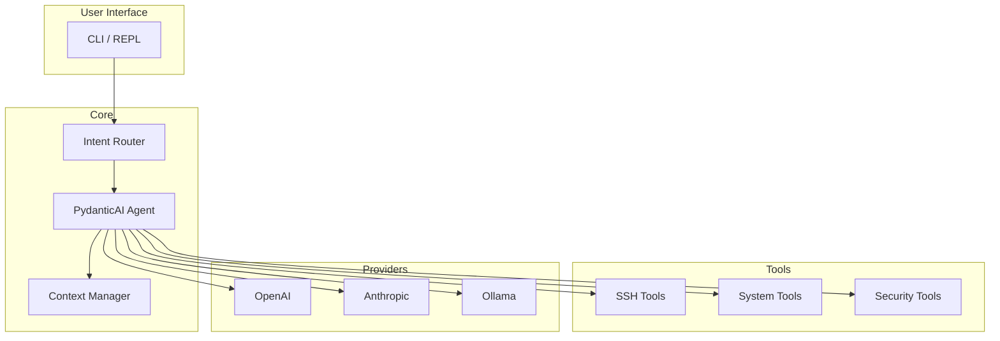

# Architecture Decisions

Key architectural decisions and their rationale.

## Overview

Merlya is built on a modular architecture designed for extensibility, security, and ease of use.



## ADR-001: PydanticAI for Agent Framework

**Status:** Accepted

**Context:** We needed a framework for building LLM-powered agents with tool calling capabilities.

**Decision:** Use PydanticAI as the agent framework.

**Rationale:**
- Type-safe with Pydantic models
- Native async support
- Clean tool definition API
- Multi-provider support
- Active development and community

**Consequences:**
- Dependency on PydanticAI
- Benefits from upstream improvements
- May need to adapt to API changes

---

## ADR-002: AsyncSSH for SSH Connections

**Status:** Accepted

**Context:** SSH connectivity is core to Merlya's functionality.

**Decision:** Use asyncssh for all SSH operations.

**Rationale:**
- Pure Python, no external dependencies
- Async-native for concurrent connections
- Full SSH2 protocol support
- Jump host support built-in
- Active maintenance

**Consequences:**
- Async-only API
- Connection pooling needed for performance
- Memory overhead for many connections

---

## ADR-003: Connection Pooling

**Status:** Accepted

**Context:** Frequent SSH connections are slow and resource-intensive.

**Decision:** Implement connection pooling with automatic cleanup.

**Rationale:**
- Avoid connection overhead for repeated commands
- Limit concurrent connections
- Automatic cleanup of idle connections
- Graceful shutdown handling

**Implementation:**
```python
class SSHPool:
    max_connections: int = 10
    idle_timeout: int = 300  # 5 minutes

    async def get_connection(host) -> SSHConnection
    async def release_connection(conn)
    async def cleanup_idle()
```

---

## ADR-004: Keyring for Credential Storage

**Status:** Accepted

**Context:** API keys and credentials need secure storage.

**Decision:** Use the system keyring (via `keyring` library).

**Rationale:**
- OS-level security (Keychain, Secret Service, Credential Manager)
- No plaintext secrets in config files
- Standard cross-platform solution
- Fallback to in-memory with warning

**Consequences:**
- Requires keyring backend on Linux
- May need user interaction for first-time setup
- Headless servers need alternative setup

---

## ADR-005: Local Intent Classification

**Status:** Superseded (v0.8.0)

**Context:** Not all user inputs require LLM processing.

**Decision:** Use pattern-based local classifier for intent routing with LLM fallback.

**Rationale:**
- Fast (< 1ms) classification using regex patterns
- No external dependencies or model files
- Works offline
- Reduces API costs
- LLM fallback for complex/ambiguous intents

**Implementation:**
```
User Input → Pattern Matcher → [High Confidence] → Direct Handler
                            → [Low Confidence]  → LLM Classification → Agent
```

**Consequences:**
- Simpler deployment (no model files)
- Pattern maintenance required for new intents
- LLM fallback handles edge cases gracefully

**Note:** Previously used ONNX embeddings, removed in v0.8.0 for simplicity.

---

## ADR-006: YAML Configuration with SQLite Storage

**Status:** Accepted

**Context:** Configuration needs to be human-readable and editable. Host inventory requires structured storage with querying capabilities.

**Decision:** Use YAML for configuration files and SQLite for host inventory.

**Rationale:**
- YAML: Human-friendly syntax, widely used in DevOps
- YAML: Native support for complex structures
- SQLite: Fast querying for host lookups
- SQLite: Supports tagging, filtering, and search
- SQLite: Single file, no server needed

**File Locations:**
- `~/.merlya/config.yaml` - Main configuration
- `~/.merlya/merlya.db` - Host inventory (SQLite)
- `~/.merlya/logs/` - Log files
- `~/.merlya/history` - Command history

**Configuration Example:**
```yaml
general:
  language: en
  log_level: info

model:
  provider: openrouter
  model: amazon/nova-2-lite-v1:free

ssh:
  connect_timeout: 30
  pool_timeout: 600
```

---

## ADR-007: Plugin Architecture

**Status:** Proposed

**Context:** Users need to extend Merlya with custom tools.

**Decision:** Entry-point based plugin system.

**Rationale:**
- Standard Python packaging approach
- Easy distribution via PyPI
- Namespace isolation
- Lazy loading

**Proposed Interface:**
```python
# pyproject.toml
[project.entry-points."merlya.tools"]
my_tool = "my_package:MyTool"

# Implementation
class MyTool(MerlyaTool):
    name = "my_tool"
    description = "Does something useful"

    async def execute(self, params: dict) -> ToolResult:
        ...
```

---

## ADR-008: Loguru for Logging

**Status:** Accepted

**Context:** Debugging and monitoring require good logging with minimal configuration.

**Decision:** Use [loguru](https://github.com/Delgan/loguru) for logging.

**Rationale:**
- Zero-configuration out of the box
- Automatic rotation and retention
- Human-readable colored output for development
- Exception catching with full traceback
- Easy to use API (`logger.info()`, `logger.error()`)
- Async-safe

**Implementation:**
```python
from loguru import logger

logger.info("✅ Operation completed successfully")
logger.warning("⚠️ Connection retry required")
logger.error("❌ SSH connection failed: {error}", error=e)
```

**Log Levels:**
- DEBUG: Detailed execution flow
- INFO: Key operations and results
- WARNING: Recoverable issues
- ERROR: Failures requiring attention

**Emoji Convention:**
All log messages use emojis for visual clarity (see CONTRIBUTING.md).

---

## ADR-009: Multi-Provider LLM Support

**Status:** Accepted

**Context:** Users have different LLM provider preferences and cost constraints.

**Decision:** Abstract LLM provider interface with multiple implementations. OpenRouter as default for free tier access.

**Supported Providers:**
- OpenRouter (default) - 100+ models, free tier available
- OpenAI (GPT-4o, GPT-4o-mini)
- Anthropic (Claude 3.5 Sonnet, Haiku)
- Ollama (local models, no API key needed)

**Interface:**
```python
class LLMProvider(Protocol):
    async def generate(prompt: str) -> str
    async def generate_with_tools(prompt: str, tools: list) -> ToolCall
```

---

## ADR-010: Security Model

**Status:** Accepted

**Context:** Merlya executes commands on remote systems.

**Decision:** Implement defense-in-depth security model.

**Layers:**
1. **Credential Protection** - Keyring storage
2. **Command Review** - User confirmation for destructive commands
3. **Input Validation** - Pydantic models for all inputs
4. **Audit Logging** - All commands logged
5. **Principle of Least Privilege** - Minimal permissions

**Dangerous Command Detection:**
```python
DANGEROUS_PATTERNS = [
    r"rm\s+-rf",
    r"mkfs",
    r"dd\s+if=",
    r">\s*/dev/",
    r"chmod\s+777",
]
```

---

## ADR-011: Non-Interactive Mode Credential Handling

**Status:** Accepted (v0.7.8)

**Context:** When running in non-interactive mode (`merlya run --yes`), the agent cannot prompt users for credentials. Previously, this led to infinite retry loops when sudo/su commands required passwords.

**Decision:** Fail-fast with clear error messages when credentials are needed but cannot be obtained.

**Rationale:**

- Immediate failure prevents wasted API calls and timeouts
- Clear error messages guide users to proper solutions
- Three resolution paths documented: keyring, NOPASSWD, interactive mode
- `permanent_failure` flag tells agent to stop retrying

**Implementation:**
```python
# In request_credentials() and ssh_execute()
if ctx.auto_confirm and missing_credentials:
    return CommandResult(
        success=False,
        message="Cannot obtain credentials in non-interactive mode",
        data={
            "non_interactive": True,
            "permanent_failure": True,  # Signal: do not retry
        }
    )
```

**Solutions for users:**

1. Store credentials in keyring: `merlya secret set sudo:host:password`
2. Configure NOPASSWD sudo on target hosts
3. Run in interactive mode (without `--yes`)

**Consequences:**

- Clear failure instead of timeout loops
- Better CI/CD integration (fast failure)
- Requires pre-configuration for automated elevated commands

---

## ADR-012: ElevationMethod Enum for Host Configuration

**Status:** Accepted (v0.7.8)

**Context:** Elevation method was stored as strings with inconsistent validation, causing NULL values and validation errors.

**Decision:** Use `ElevationMethod` enum with explicit values and proper NULL handling.

**Enum Values:**
```python
class ElevationMethod(str, Enum):
    NONE = "none"              # No elevation
    SUDO = "sudo"              # sudo (NOPASSWD)
    SUDO_PASSWORD = "sudo_password"  # sudo with password
    DOAS = "doas"              # doas (NOPASSWD)
    DOAS_PASSWORD = "doas_password"  # doas with password
    SU = "su"                  # su with password
```

**Handling:**

- NULL in database → `ElevationMethod.NONE`
- Invalid strings → `ElevationMethod.NONE`
- `/hosts edit` uses enum mapping
- Import (TOML/CSV) maps strings to enum values

**Consequences:**

- Type-safe elevation configuration
- No more validation errors on NULL
- Consistent behavior across all code paths

---

## Future Considerations

### Under Evaluation

- **WebSocket support** for real-time streaming
- **Kubernetes integration** via kubectl
- **Terraform integration** for IaC
- **Metrics collection** for monitoring dashboards

### Rejected

- **GUI Application** - Focus on CLI/API for automation
- **Custom LLM training** - Too resource-intensive for scope
- **Multi-tenant SaaS** - Security complexity, out of scope
