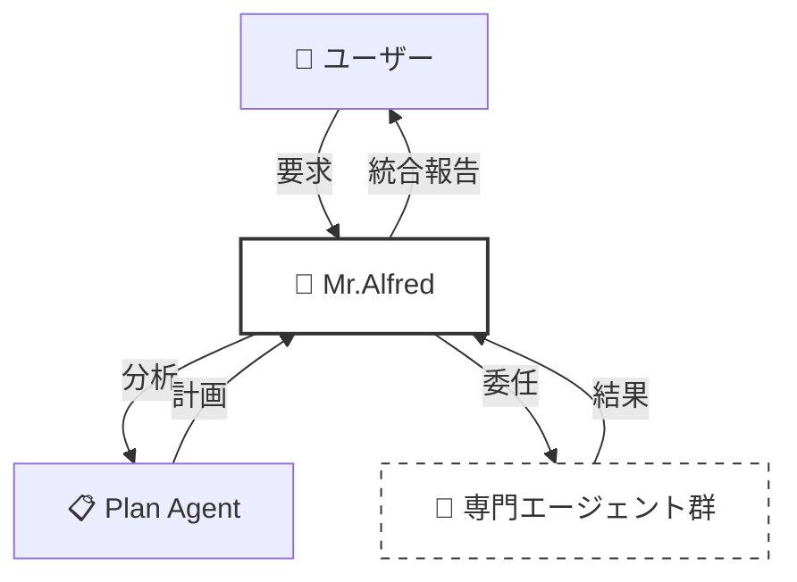
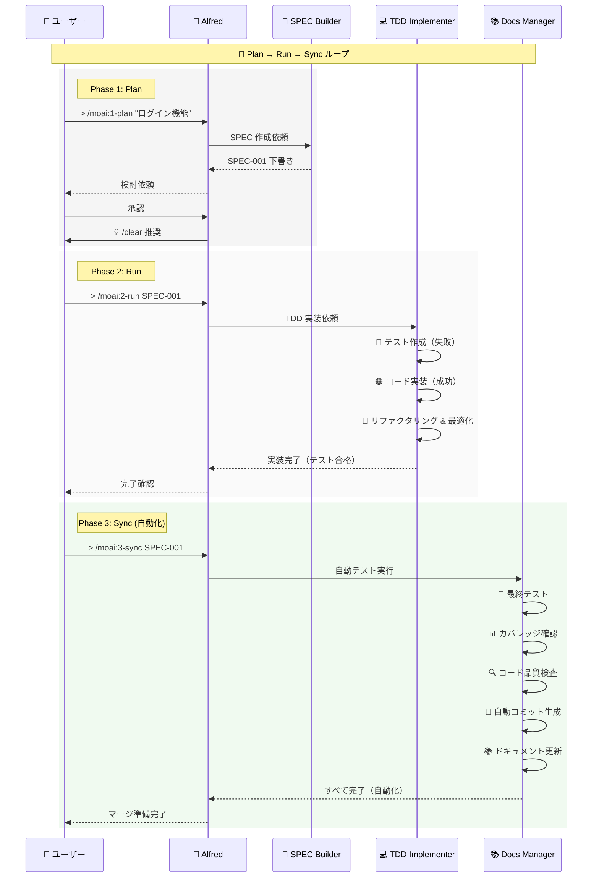
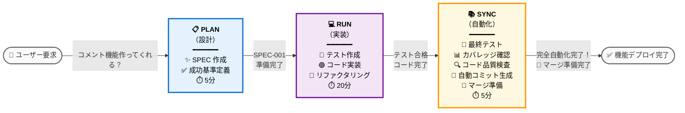
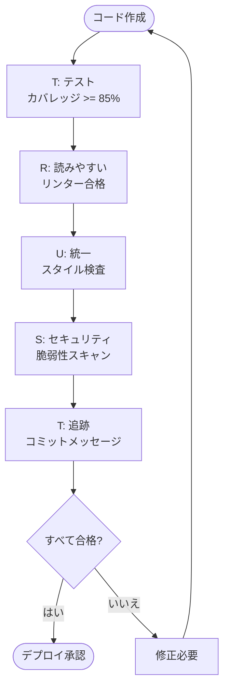
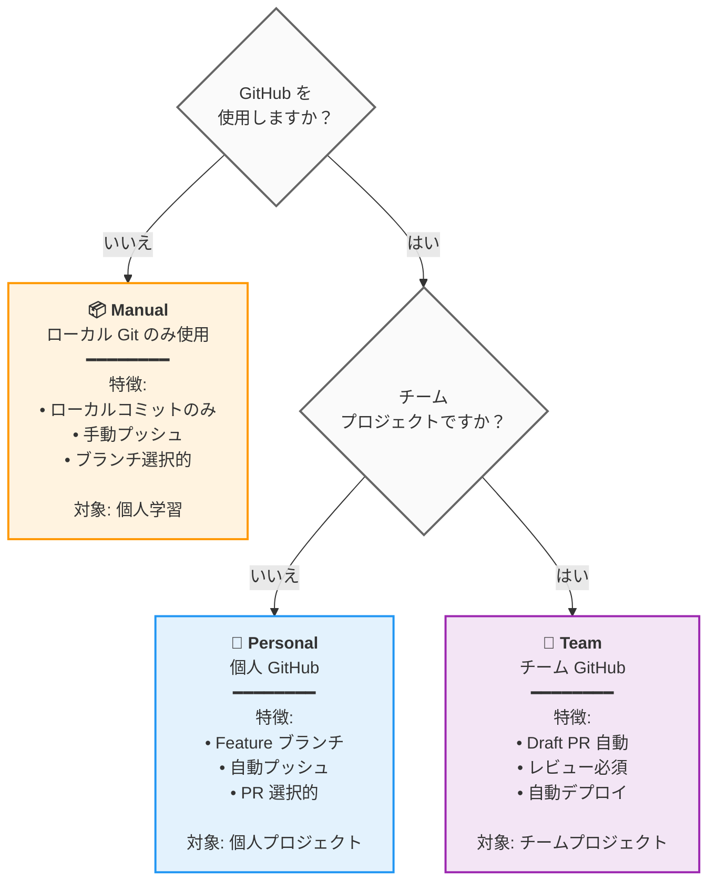

# 🗿 MoAI-ADK: Agentic AI ベース SPEC-First TDD 開発フレームワーク


**利用可能な言語:** [🇰🇷 한국어](./README.ko.md) | [🇺🇸 English](./README.md) | [🇯🇵 日本語](./README.ja.md) | [🇨🇳 中文](./README.zh.md)

[](https://pypi.org/project/moai-adk/)
[](https://opensource.org/licenses/MIT)
[](https://www.python.org/)

MoAI-ADK (Agentic Development Kit)は、**SPEC-First 開発**、**テスト駆動開発**（TDD）、**AI エージェント**を組み合わせて、完全で透明な開発ライフサイクルを提供するオープンソースフレームワークです。

---

## 📑 目次（クイックナビゲーション）

### パート A: はじめに（30 分）

| セクション                                                     | 時間  | 目標                  |
| -------------------------------------------------------------- | ----- | --------------------- |
| [1. はじめに](#1-はじめに)                                     | 2 分  | MoAI-ADK が何かを理解 |
| [2. インストールとセットアップ](#2-インストールとセットアップ) | 10 分 | 基本環境構成          |
| [3. クイックスタート](#3-クイックスタート)                     | 5 分  | 最初の機能完成        |

### パート B: コア概念（45 分）

| セクション                                                | 時間  | 目標                       |
| --------------------------------------------------------- | ----- | -------------------------- |
| [4. SPEC と EARS フォーマット](#4-specとearsフォーマット) | 10 分 | 仕様書作成の理解           |
| [5. Mr.Alfred とエージェント](#5-mralfredとエージェント)  | 12 分 | エージェントシステムの理解 |
| [6. 開発ワークフロー](#6-開発ワークフロー)                | 15 分 | Plan → Run → Sync          |
| [7. コアコマンド](#7-コアコマンド)                        | 8 分  | `> /moai:0-3` コマンド      |

### パート C: 上級学習（2-3 時間）

| セクション                                               | 目標                   |
| -------------------------------------------------------- | ---------------------- |
| [8. エージェントガイド](#8-エージェントガイド-24個)      | 専門エージェントの活用 |
| [9. スキルライブラリ](#9-スキルライブラリ-47-個)          | 47 個のスキル探索      |
| [10. 組み合わせパターンと例](#10-組み合わせパターンと例) | 実際のプロジェクト例   |
| [11. TRUST 5 品質保証](#11-trust-5-品質保証)             | 品質保証システム       |
| [12. 高度な機能](#12-高度な機能)                         | Git Worktree & 強化されたログ管理 |

### パート D: 上級 & 参考資料（必要時）

| セクション                                                                                             | 目的                     |
| ------------------------------------------------------------------------------------------------------ | ------------------------ |
| [13. 高度な設定](#13-高度な設定)                                                                       | プロジェクトカスタマイズ |
| [14. FAQ & クイックリファレンス](#14-faq--クイックリファレンス)                                         | よくある質問             |
| [15. 📸 ai-nano-banana エージェント使用法ガイド](#15---ai-nano-banana-エージェント-使用法ガイド)     | 画像生成ガイド           |
| [16. 追加資料](#16-追加資料)                                                                           | サポートおよび情報       |

---

## 1. はじめに

### 🗿 MoAI-ADK とは？

**MoAI-ADK**（Agentic Development Kit）は、AI エージェントを活用した次世代開発フレームワークです。**SPEC-First 開発方法論**、**TDD**（Test-Driven Development, テスト駆動開発）、**24 個の専門 AI エージェント**を組み合わせて、完全で透明な開発ライフサイクルを提供します。

### ✨ なぜ MoAI-ADK を使用するのか？


従来の開発方法の限界：

- ❌ 不明確な要件による頻繁な手戻り
- ❌ ドキュメントとコードの同期がされない
- ❌ テスト作成を先延ばしによる品質低下
- ❌ 反復的なボイラープレート作成

MoAI-ADK の解決策：

- ✅ **明確な SPEC 文書**から開始し、誤解を排除
- ✅ **自動ドキュメント同期**で常に最新状態を維持
- ✅ **TDD 強制**で 85% 以上のテストカバレッジを保証
- ✅ **AI エージェント**が反復作業を自動化

### 🎯 コア特徴


| 特徴                   | 説明                                                   | 定量的効果                                                                                                                                                                                                     |
| ---------------------- | ------------------------------------------------------ | -------------------------------------------------------------------------------------------------------------------------------------------------------------------------------------------------------------- |
| **SPEC-First**         | すべての開発は明確な仕様書から開始                     | 要件変更による手戻り **90% 削減**<br/>明確な SPEC による開発者-企画者間の誤解排除                                                                                                                              |
| **TDD 強制**           | Red-Green-Refactor サイクルの自動化                    | バグ **70% 削減**（85%+ カバレッジ時）<br/>テスト作成時間を含む総開発時間 **15% 短縮**                                                                                                                       |
| **AI オーケストレーション** | Mr.Alfred が 24 個の専門 AI エージェントを指揮（7-Tier 階層） | **平均トークン節約**: セッションあたり 5,000 トークン（Conditional Auto-load）<br/>**Simple 作業**: 0 トークン（Quick Reference）<br/>**Complex 作業**: 8,470 トークン（Auto-load スキル）<br/>手動に比べて **60-70% 時間短縮** |
| **自動ドキュメント化**   | コード変更時のドキュメント自動同期 (`> /moai:3-sync`)    | ドキュメント最新性 **100% 保証**<br/>手動ドキュメント作成削除<br/>最後のコミット以降の自動同期                                                                                                                   |
| **TRUST 5 品質**      | Test, Readable, Unified, Secured, Trackable           | エンタープライズ級品質保証<br/>デプロイ後の緊急パッチ **99% 削減                                                                                                                                               |

---

## 2. インストールとセットアップ

### 🎯 基本インストール（10 分）

#### Step 1: uv のインストール（1 分）

```bash
# macOS / Linux
curl -LsSf https://astral.sh/uv/install.sh | sh

# Windows (PowerShell)
powershell -ExecutionPolicy ByPass -c "irm https://astral.sh/uv/install.ps1 | iex"

# インストール確認
uv --version
```

#### Step 2: MoAI-ADK のインストール（2 分）

```bash
# 最新バージョンをインストール
uv tool install moai-adk

# インストール確認
moai-adk --version
```

#### Step 3A: 新規プロジェクト初期化（3 分）

```bash
# 新規プロジェクト作成
moai-adk init my-project
cd my-project

# プロジェクト構造確認
ls -la
```

生成されるファイル構造：

```text
my-project/
├── .claude/              # Claude Code 設定
├── .moai/                # MoAI-ADK 設定
├── src/                  # ソースコード
├── tests/                # テストコード
├── .moai/specs/          # SPEC 文書
├── README.md
└── pyproject.toml
```

---

#### Step 3B: 既存プロジェクト設定（5 分）

**既存プロジェクトに 3 ステップで MoAI-ADK を統合：**

```bash
# 既存プロジェクトに移動
cd your-existing-project

# 現在ディレクトリで MoAI-ADK を初期化
moai-adk init .

# MoAI-ADK 統合を確認
ls -la .claude/ .moai/
```

**プロジェクトに追加されるファイル：**

```text
your-existing-project/
├── .claude/              # Claude Code 設定（追加）
│   ├── agents/           # MoAI-ADK エージェント
│   ├── commands/         # カスタムコマンド
│   ├── hooks/             # 自動化ワークフロー
│   └── settings.json     # プロジェクト設定
├── .moai/                # MoAI-ADK 設定（追加）
│   ├── config/           # プロジェクト設定
│   ├── memory/           # セッションメモリ
│   ├── specs/            # SPEC 文書
│   └── docs/             # 自動生成ドキュメント
├── src/                  # 既存ソースコード（変更なし）
├── tests/                # 既存テスト（変更なし）
└── README.md             # 既存 README（変更なし）
```

**重要:** 既存ファイルは一切変更されません。MoAI-ADK は設定ファイルのみを追加します。

---

#### Step 4: Claude Code 実行およびプロジェクトメタデータ初期化

```bash
# プロジェクトディレクトリで Claude Code を実行
claude

# Claude Code 内でプロジェクトメタデータを初期化
> /moai:0-project
```

**`> /moai:0-project` がすること：**

- ✅ プロジェクト構造分析
- ✅ プログラミング言語およびフレームワーク検出
- ✅ `.moai/config/config.json` にプロジェクトメタデータ生成
- ✅ デフォルト Git ワークフロー設定
- ✅ セッションメモリシステム生成
- ✅ 品質保証基準設定

**期待結果：**

```
✓ プロジェクト分析完了: Python プロジェクト検出
✓ メタデータ生成完了: .moai/config/config.json
✓ Git 戦略: Manual モード設定完了
✓ 品質ゲート: 85% テストカバレッジ目標
✓ プロジェクト初期化完了
```

これで SPEC-First TDD 開発のためのプロジェクトメタデータと環境が準備できました！

---

## 3. クイックスタート

### 🎯 目標: 最初の機能を 5 分で完了


---

### **Step 1: 最初の機能 Plan** ⏱️ 2 分

Claude Code で：

```
> /moai:1-plan "ユーザーログイン機能追加"
```

このコマンドが：

- SPEC-001 文書自動生成
- 要件、制約、成功基準定義
- テストシナリオ作成

---

### **Step 2: コンテキスト初期化** ⏱️ 1 分

```
> /clear
```

トークン効率のために以前のコンテキストを整理します。

---

### **Step 3: 実装（Run）** ⏱️ 2 分

```
> /moai:2-run SPEC-001
```

このコマンドが：

- テストを先に作成（Red）
- コード実装（Green）
- リファクタリング（Refactor）
- TRUST 5 検証を自動実行

---

### **Step 4: ドキュメント化（Sync）** ⏱️ （オプション）

```
> /moai:3-sync SPEC-001
```

自動的に：

- API ドキュメント生成
- アーキテクチャ図
- README 更新
- デプロイ準備完了

**完了！** 最初の機能が完全に実装されました。🎉

---

### 📁 詳細情報

- **インストール高度なオプション**: [13. 高度な設定](#13-高度な設定)
- **コマンド詳細使用法**: [7. コアコマンド](#7-コアコマンド)
- **開発ワークフロー**: [6. 開発ワークフロー](#6-開発ワークフロー)

---

## 4. SPEC と EARS フォーマット

### 📋 SPEC-First Development


**SPEC-First とは？**

すべての開発は **明確な仕様書**（Specification）から開始します。SPEC は **EARS(Easy Approach to Requirements Syntax) フォーマット** に従って作成され、以下を含みます：

- **要件**: 何を作成するか？
- **制約**: どのような制限があるか？
- **成功基準**: いつ完了か？
- **テストシナリオ**: どのように検証するか？

### 🎯 EARS フォーマット例

```markdown
# SPEC-001: ユーザーログイン機能

## 要件 (Requirements)

- WHEN ユーザーがメールとパスワードを入力し "ログイン" ボタンをクリックした時
- IF 資格情報が有効な場合
- THEN システムは JWT(JSON Web Token) トークンを発行しダッシュボードに移動する

## 制約 (Constraints)

- パスワードは最低 8 文字以上
- 5 回連続失敗時アカウントロック（30 分）
- 応答時間は 500ms 以内

## 成功基準 (Success Criteria)

- 有効な資格情報でログイン成功率 100%
- 無効な資格情報時は明確なエラーメッセージ表示
- 応答時間 < 500ms
- テストカバレッジ >= 85%

## テストシナリオ (Test Cases)

### TC-1: 正常ログイン

- 入力: email="user@example.com", password="secure123"
- 期待結果: トークン発行、ダッシュボード移動

### TC-2: 間違ったパスワード

- 入力: email="user@example.com", password="wrong"
- 期待結果: "パスワードが間違っています" エラーメッセージ

### TC-3: アカウントロック

- 入力: 5 回連続失敗
- 期待結果: "アカウントがロックされました。30 分後再試行してください"
```

### 💡 EARS フォーマットの 5 種類

| タイプ         | 構文         | 例                                          |
| -------------- | ------------ | ------------------------------------------- |
| **Ubiquitous** | 常に実行     | "システムは常にログを記録しなければならない" |
| **Event-driven** | WHEN...THEN  | "ユーザーがログインした時、トークンを発行する" |
| **State-driven** | IF...THEN    | "アカウントが有効状態の時、ログインを許可" |
| **Unwanted**   | shall not    | "システムは平文パスワードを保存してはならない" |
| **Optional**   | where possible | "可能であれば OAuth ログインを提供" |

---

## 5. Mr.Alfred とエージェント

### 🎩 Mr.Alfred - Super Agent Orchestrator

**Alfred は誰か？**

Mr.Alfred は MoAI-ADK の **最高指揮者**（Orchestrator）であり、ユーザーの要求を分析し、適切な専門エージェントを選択して作業を委任し、結果を統合します。

**Alfred の役割：**

1. **理解する**: ユーザー要求分析および不明確な部分質問
2. **計画する**: Plan エージェントを通じて実行計画策定
3. **実行する**: 専門エージェントに作業委任（順次/並列）
4. **統合する**: すべての結果を集めてユーザーに報告



### 🔧 エージェントシステム（5-Tier 階層）

MoAI-ADK は **24 個の専門エージェント**を **5 個の階層**に組織して最適の性能を提供します。

**Tier 1: Domain Experts**（ドメイン専門家、7 個）

- `expert-backend`: バックエンドアーキテクチャ、API 開発
- `expert-frontend`: フロントエンド、React/Vue 実装
- `expert-database`: データベース設計、最適化
- `expert-security`: セキュリティ分析、脆弱性スキャン
- `expert-devops`: デプロイ、インフラ、CI/CD
- `expert-uiux`: UI/UX デザイン、コンポーネント
- `expert-debug`: デバッグ、エラー分析

**Tier 2: Workflow Managers**（ワークフロー管理、8 個）

- `manager-spec`: SPEC 作成（EARS フォーマット）
- `manager-tdd`: TDD 実装（RED-GREEN-REFACTOR）
- `manager-docs`: ドキュメント自動生成
- `manager-quality`: 品質検証（TRUST 5）
- `manager-strategy`: 実行戦略策定
- `manager-project`: プロジェクト初期化
- `manager-git`: Git ワークフロー
- `manager-claude-code`: Claude Code 統合

**Tier 3: Meta-generators**（メタ生成器、3 個）

- `builder-agent`: 新しいエージェント生成
- `builder-skill`: 新しいスキル生成
- `builder-command`: 新しいコマンド生成

**Tier 4: MCP Integrators**（MCP 統合、6 個）

- `mcp-context7`: 最新ライブラリ文書検索
- `mcp-sequential-thinking`: 複雑な推論分析
- `mcp-playwright`: ウェブ自動化テスト
- `mcp-figma`: Figma デザインシステム
- `mcp-notion`: Notion ワークスペース管理

**Tier 5: AI Services**（AI サービス、1 個）

- `ai-nano-banana`: Gemini 3 画像生成

---

## 6. 開発ワークフロー

### 🔄 Plan-Run-Sync 無限ループ

MoAI-ADK の開発は **3 段階無限ループ**で進行します：



### 📊 各段階別詳細説明

#### Phase 1: Plan（設計、5-10 分）

**目標**: 何を作成するか？

```bash
> /moai:1-plan "ユーザーログイン機能"
```

この段階で：

- ✅ SPEC-001 文書自動生成
- ✅ EARS フォーマットで要件定義
- ✅ 成功基準明確化
- ✅ テストシナリオ作成

**成果物**: `.moai/specs/SPEC-001/spec.md`

---

#### Phase 2: Run（実装、20-40 分）

**目標**: どのように作成するか？

```bash
> /clear
> /moai:2-run SPEC-001
```

この段階で：

- 🔴 **RED**: 失敗するテストを先に作成
- 🟢 **GREEN**: 最小コードでテスト合格
- 🔵 **REFACTOR**: コード整理および最適化

**自動検証**：

- テストカバレッジ >= 85%
- コードリンティング合格
- セキュリティ検査合格
- タイプ検査合格

**成果物**: 実装完了 + テストコード + 85%+ カバレッジ

---

#### Phase 3: Sync（自動化、5-10 分）

**目標**: 完成したか？（自動化）

```bash
> /clear
> /moai:3-sync SPEC-001
```

この段階で自動的に実行：

- 🔴 **最終テスト実行**: すべてのテスト自動実行
- 📊 **カバレッジ確認**: 95% 以上カバレッジ自動保証
- 🔍 **コード品質検査**: ruff, mypy 自動実行
- 📝 **自動コミット生成**: "Ready for merge" コミット自動生成
- 📚 **ドキュメント更新**: API ドキュメント、README 自動更新
- 🚀 **マージ準備**: Claude Code がマージ準備自動完了

**成果物**: テスト合格 + ドキュメント完成 + マージ準備完了

---

### 💡 視覚的ワークフロー：「ブログコメント機能」の例



---

## 7. コアコマンド

### 🎯 `> /moai:0-project` - プロジェクト初期化

**目的**: プロジェクトメタデータ生成

**使用時期**: プロジェクト初回開始時

```bash
> /moai:0-project
```

**生成されるファイル**：

- `.moai/config/config.json`: プロジェクト設定
- `.moai/memory/`: プロジェクトメモリ
- `.moai/docs/`: 自動生成ドキュメント

---

### 📋 `> /moai:1-plan` - SPEC 作成

**目的**: EARS フォーマット SPEC 文書生成

**使用時期**: 新機能開発開始前

```bash
> /moai:1-plan "ログイン機能追加"
```

**例**：

```bash
> /moai:1-plan "ユーザープロフィールページ実装"
# → SPEC-002 生成 (.moai/specs/SPEC-002/spec.md)

> /moai:1-plan "決済機能 API 開発"
# → SPEC-003 生成
```

**生成される SPEC 含有事項**：

- 要件 (Requirements)
- 制約 (Constraints)
- 成功基準 (Success Criteria)
- テストシナリオ (Test Cases)

**重要**: 次は必ず `> /clear` 実行

```bash
> /moai:1-plan "機能名"
# 作業完了後
> /clear
```

---

### 💻 `> /moai:2-run` - TDD 実装

**目的**: RED-GREEN-REFACTOR サイクルでコード実装

**使用時期**: SPEC 作成後の実装

```bash
> /moai:2-run SPEC-001
```

**例**：

```bash
> /moai:2-run SPEC-001  # 基本実装
```

**自動実行事項**：

- 🔴 テストを先に作成
- 🟢 コードでテスト合格
- 🔵 リファクタリング & 最適化
- ✅ TRUST 5 検証 (自動)

**検証項目**：

- テストカバレッジ >= 85%
- リンティング検査合格
- タイプ検査合格
- セキュリティ検査合格

---

### 📚 `> /moai:3-sync` - ドキュメント同期

**目的**: コード変更事項をドキュメントに反映

**使用時期**: 実装完了後

```bash
> /moai:3-sync SPEC-001
```

**例**：

```bash
> /moai:3-sync SPEC-001  # 全体ドキュメント
```

**自動生成ドキュメント**：

- API リファレンス
- アーキテクチャ図
- デプロイガイド
- README 更新
- CHANGELOG

---

### 🌳 **moai-workflow-worktree** - 並列 SPEC 開発のための Git ワークツリー管理

#### moai-workflow-worktree が必要な理由: 解決する問題

現代ソフトウェア開発、特に SPEC-First TDD 方法論に従う時、開発者は同時に複数の機能を作業する問題に頻繁に直面します。従来の Git ワークフローは開発者に次を強制します：

- **コンテキストスイッチング地獄**: 同一ワークスペースで継続的にブランチを切り替えてコンテキストを失い未完了作業のリスクを冒す
- **逐次開発**: 一度に一つの SPEC み作業して生産性低下
- **環境衝突**: 違う SPEC は違う依存関係、データベース状態または設定が必要な場合がある

**moai-workflow-worktree はこの問題を解決**し、各 SPEC に対して分離されたワークスペースを提供し、コンテキストスイッチングオーバーヘッドなしで真の並列開発を可能にします。

#### 核心概念: SPEC ベース並列開発

**Git ワークツリーとは？**

Git ワークツリーは同一 Git リポジトリに接続された別の作業ディレクトリで、違うブランチを同時に違う作業ディレクトリでチェックアウトできます。各ワークツリーは次を持ちます：

- 独立したファイルシステム
- 別の作業ディレクトリ状態
- 分離されたビルド成果物および依存関係
- 独自のステージング領域およびステージングされていない変更

**moai-workflow-worktree アーキテクチャ：**

```
メインリポジトリ/
├── .git/                    # 共有 Git リポジトリ
├── src/                     # メインブランチファイル
└── worktrees/               # 自動生成ワークツリー
    ├── SPEC-001/
    │   ├── .git             # ワークツリー別 git ファイル
    │   ├── src/             # SPEC-001 実装
    │   └── tests/           # SPEC-001 テスト
    ├── SPEC-002/
    │   ├── .git             # ワークツリー別 git ファイル
    │   ├── src/             # SPEC-002 実装
    │   └── tests/           # SPEC-002 テスト
    └── SPEC-003/
        ├── .git             # ワークツリー別 git ファイル
        ├── src/             # SPEC-003 実装
        └── tests/           # SPEC-003 テスト
```

#### SPEC-First 開発のための核心利益

**1. ゼロコンテキストスイッチング**

- 各 SPEC は独自専用ワークスペースを持つ
- SPEC 間に切り替える時作業コンテキストを絶対に失わない
- 特定の要求に対する精神的集中維持

**2. 真の並列開発**

- SPEC-002 テストが実行される間に SPEC-001 実装作業
- SPEC-004 ドキュメント同期される間に SPEC-003 デバッグ
- 他のプロセスが完了するまで待つ必要なし

**3. 分離された環境**

- 違う SPEC は違う依存関係バージョンを使用できる
- 分離されたデータベース状態および設定
- SPEC 間汚染なし

**4. SPEC 完了追跡**

- アクティブ SPEC リストに対する明確な視覚的表示
- 中断または未完了 SPEC の簡単な識別
- 完了した作業の体系的整理

#### 高度な機能

**スマート同期**

```bash
# すべてのワークツリーを最新メインブランチと同期
moai-workflow-worktree sync --all

# 衝突解決で特定ワークツリー同期
moai-workflow-worktree sync SPEC-001 --auto-resolve
```

**知能的整理**

```bash
# マージされたブランチワークツリー自動削除
moai-workflow-worktree clean --merged-only

# 確認プロンプトが含まれた安全整理
moai-workflow-worktree clean --interactive
```

**性能最適化**

- **同時作業**: 複数のワークツリーを同時に修正できる
- **共有履歴**: すべてのワークツリーは同一 Git オブジェクトデータベース共有
- **選択的同期**: 必要時のみ変更事項を同期、全体リポジトリはしない

#### moai-workflow-worktree 使用時期

**理想的シナリオ：**

- **複数アクティブ SPEC**: 3 個以上の SPEC を同時に作業
- **長期実行作業**: SPEC 実装に数日または数週間要する
- **チーム協業**: 違う開発者が違う SPEC 作業
- **機能ブランチング**: 各 SPEC が独自機能ブランチになる
- **環境分離**: 違う SPEC が違う設定が必要

#### 完全な開発ワークフロー（開始からマージまで）

**1段階: SPEC 生成およびワークツリー設定**

```bash
# 方法1: 自動ワークツリー生成で SPEC 生成
> /moai:1-plan 'ユーザー認証システム実装' --worktree
# → 自動的に SPEC-AUTH-001 生成およびワークツリー設定

# 方法2: 手動ワークツリー生成
> /moai:1-plan 'ユーザー認証システム実装'
# SPEC-AUTH-001 生成完了
moai-workflow-worktree new SPEC-AUTH-001
# → 分離されたワークツリー環境生成
```

**2段階: ワークツリーに移動して開発開始**

```bash
# ワークツリーに移動（推奨方式）
moai-workflow-worktree go SPEC-AUTH-001
# → cd ~/moai/worktrees/MoAI-ADK/SPEC-AUTH-001

# または新しいシェルで直接移動
moai-workflow-worktree switch SPEC-AUTH-001
# → 新しいターミナルでワークツリーに移動
```

**3段階: 分離された環境で開発**

```bash
# ワークツリー内で TDD 開発
> /moai:2-run SPEC-AUTH-001
# → RED → GREEN → REFACTOR サイクル実行

# 開発中状態確認
moai-workflow-worktree status
git status
git log --oneline -5

# 中間保存
git add .
git commit -m "Auth: Implement user login endpoint"
```

**4段階: 同期および衝突解決**

```bash
# メインブランチ変更事項取得
moai-workflow-worktree sync SPEC-AUTH-001

# 自動衝突解決で同期
moai-workflow-worktree sync SPEC-AUTH-001 --auto-resolve

# すべてのワークツリー同期
moai-workflow-worktree sync --all --auto-resolve
```

**5段階: 開発完了およびテスト（自動化）**

```bash
# MoAI ワークフロー同期 - 自動的にテスト、品質検査、コミット実行
> /moai:3-sync SPEC-AUTH-001
# → 自動的に最終テスト、カバレッジ確認、コード品質検査、最終コミット完了
```

**6段階: メインブランチへのマージ準備（自動化 + 直接コマンド）**

**オプション A: Claude Code 自動化（初級者向け）**

```bash
# Claude Code が自動的にマージ準備を実行します。
# ユーザーは次を要求するだけ：
> SPEC-AUTH-001 をメインブランチにマージ準備して

# Claude Code が自動的に実行：
# - ワークツリーブランチ取得
# - ローカルマージテスト
# - 衝突確認および解決提案
# - マージ準備完了報告
```

**オプション B: 直接 Git コマンド（上級者向け）**

```bash
# 1. ワークツリーからメインに移動
moai-workflow-worktree go SPEC-AUTH-001  # または cd /path/to/main/repo

# 2. ワークツリーブランチ取得
git fetch origin feature/SPEC-AUTH-001
git checkout -b merge/SPEC-AUTH-001 origin/feature/SPEC-AUTH-001

# 3. ローカルマージテスト
git merge main --no-ff  # main からの変更事項マージ

# 4. 衝突がある場合手動解決
git status  # 衝突ファイル確認
# 衝突ファイル修正後：
git add .
git commit -m "Resolve: Merge conflicts in SPEC-AUTH-001"

# 5. マージ準備完了確認
git log --oneline -5
git status  # Clean working directory 確認
```

**衝突解決直接コマンド集：**

```bash
# 衝突発生時戦略的接近
git checkout --ours conflicted_file.py    # メインブランチ優先
git checkout --theirs conflicted_file.py  # ワークツリー変更事項優先

# マージ取り消しおよび再試行
git merge --abort
git merge main --no-ff

# 全体マージ戦略変更
git rebase main  # 代わりに rebase 使用
```

**7段階: 完了および整理（自動化 + 直接コマンド）**

**オプション A: Claude Code 自動化（初級者向け）**

```bash
# ワークツリー整理（Claude Code 自動処理要求）
> SPEC-AUTH-001 ワークツリー整理して

# README.ko.md 更新（Claude Code 自動処理）
> 完了された SPEC-AUTH-001 機能を README.ko.md に追加して

# Claude Code が自動的に実行：
# - ワークツリー状態確認
# - 完了された機能文書化
# - README 更新
# - 整理完了報告
```

**オプション B: 直接 moai-workflow-worktree コマンド（上級者向け）**

```bash
# 1. ワークツリー状態最終確認
moai-workflow-worktree status
# 出力例：
# SPEC-AUTH-001
#   Branch: feature/SPEC-AUTH-001
#   Status: completed
#   Path:   ~/moai/worktrees/MoAI-ADK/SPEC-AUTH-001

# 2. ワークツリー整理（安全な方法）
moai-workflow-worktree clean --merged-only
# → マージされたブランチのワークツリーのみ自動削除

# 3. または対話型整理（選択的削除）
moai-workflow-worktree clean --interactive
# → 削除するワークツリー選択可能

# 4. 特定ワークツリー直接削除（強制）
moai-workflow-worktree remove SPEC-AUTH-001 --force

# 5. 全体ワークツリー状態確認
moai-workflow-worktree list
# または
moai-workflow-worktree status
```

**実用的なワークツリー管理コマンド集：**

```bash
# 日常的なワークツリー管理
moai-workflow-worktree list                    # すべてのワークツリーリスト
moai-workflow-worktree status                  # 詳細状態確認
moai-workflow-worktree sync SPEC-AUTH-001      # 特定ワークツリー同期
moai-workflow-worktree sync --all              # すべてのワークツリー同期

# ワークツリー移動および作業
moai-workflow-worktree go SPEC-001     # 現在シェルで移動
moai-workflow-worktree switch SPEC-001         # 新しいシェルでワークツリー開く

# 衝突自動解決
moai-workflow-worktree sync SPEC-AUTH-001 --auto-resolve

# 設定確認
moai-workflow-worktree config get              # 現在設定表示
moai-workflow-worktree config root             # ワークツリールートパス確認
```

**混合ワークフロー推奨パターン：**

```bash
# 段階1-5: Claude Code 自動化（迅速開発）
> /moai:1-plan "機能名"
> /moai:2-run SPEC-XXX
> /moai:3-sync SPEC-XXX

# 段階6-7: 直接コマンド（精密制御）
moai-workflow-worktree sync SPEC-XXX --auto-resolve  # 衝突自動解決
moai-workflow-worktree clean --merged-only           # 完了されたワークツリー整理
```

---

### 🔧 手動コマンドリファレンス (Manual Command Reference)

このセクションでは Claude Code 自動化と並行して使用できる直接コマンドを詳細に説明します。

#### **基本 moai-workflow-worktree コマンド**

| コマンド               | 目的                   | 使用例                       | 説明                              |
| ---------------------- | ---------------------- | --------------------------- | --------------------------------- |
| `moai-workflow-worktree new`    | 新しいワークツリー生成   | `moai-workflow-worktree new SPEC-001` | SPEC-001 のための分離された作業空間生成 |
| `moai-workflow-worktree list`   | ワークツリーリスト      | `moai-workflow-worktree list`         | すべてのアクティブワークツリー表示 |
| `moai-workflow-worktree go`     | ワークツリー移動        | `moai-workflow-worktree go SPEC-001`  | 現在シェルでワークツリーに移動  |
| `moai-workflow-worktree switch` | 新しいシェルでワークツリー開く | `moai-workflow-worktree switch SPEC-001` | 新しいターミナルでワークツリーに移動 |
| `moai-workflow-worktree remove` | ワークツリー削除        | `moai-workflow-worktree remove SPEC-001` | 特定ワークツリー削除            |
| `moai-workflow-worktree status` | 状態確認               | `moai-workflow-worktree status`       | すべてのワークツリー状態表示     |

#### **同期コマンド**

| コマンド                              | 目的                   | 使用例                                  | 説明                      |
| ----------------------------------- | ---------------------- | -------------------------------------- | ------------------------- |
| `moai-workflow-worktree sync`                | 特定ワークツリー同期     | `moai-workflow-worktree sync SPEC-001`          | メインブランチと変更事項同期 |
| `moai-workflow-worktree sync --all`          | すべてのワークツリー同期 | `moai-workflow-worktree sync --all`             | すべてのワークツリーを一度に同期 |
| `moai-workflow-worktree sync --auto-resolve` | 自動衝突解決           | `moai-workflow-worktree sync SPEC-001 --auto-resolve` | 衝突発生時自動解決試行     |
| `moai-workflow-worktree sync --rebase`       | Rebase ベース同期       | `moai-workflow-worktree sync SPEC-001 --rebase` | マージの代わりに rebase 使用 |

#### **整理コマンド**

| コマンド                              | 目的                     | 使用例                           | 説明                            |
| ----------------------------------- | ------------------------ | -------------------------------- | ------------------------------- |
| `moai-workflow-worktree clean`               | ワークツリー整理          | `moai-workflow-worktree clean`             | すべてのワークツリー整理         |
| `moai-workflow-worktree clean --merged-only` | マージされたワークツリーのみ整理 | `moai-workflow-worktree clean --merged-only` | マージされたブランチのワークツリーのみ削除 |
| `moai-workflow-worktree clean --interactive` | 対話型整理              | `moai-workflow-worktree clean --interactive` | 削除するワークツリー選択可能     |

#### **設定コマンド**

| コマンド                      | 目的           | 使用例                 | 説明                           |
| --------------------------- | -------------- | --------------------- | ------------------------------ |
| `moai-workflow-worktree config`      | 設定表示      | `moai-workflow-worktree config` | 現在ワークツリー設定表示         |
| `moai-workflow-worktree config root` | ルートパス確認 | `moai-workflow-worktree config root` | ワークツリールートディレクトリパス確認 |

#### **高度な使用パターン**

**1. 複数 SPEC 並列開発**

```bash
# 複数 SPEC 同時に生成
moai-workflow-worktree new SPEC-AUTH-001    # ユーザー認証
moai-workflow-worktree new SPEC-PAY-002     # 決済システム
moai-workflow-worktree new SPEC-UI-003      # UI 改善

# 各ワークツリー状態確認
moai-workflow-worktree status

# すべてのワークツリー同期
moai-workflow-worktree sync --all --auto-resolve
```

**2. 衝突自動解決ワークフロー**

```bash
# 1段階: 自動同期試行
moai-workflow-worktree sync SPEC-001 --auto-resolve

# 2段階: 自動解決失敗時手動介入
moai-workflow-worktree go SPEC-001
git status  # 衝突ファイル確認

# 3段階: 衝突解決戦略選択
git checkout --ours conflicted_file.py    # メインブランチ優先
# または
git checkout --theirs conflicted_file.py  # ワークツリー変更事項優先

# 4段階: 解決完了後コミット
git add conflicted_file.py
git commit -m "Resolve: Auto-resolved conflicts in SPEC-001"
```

**3. 定期的なワークツリー保守**

```bash
# 毎朝実行推奨
moai-workflow-worktree status                      # 現在状態確認
moai-workflow-worktree sync --all                  # すべてのワークツリー同期

# 毎週実行推奨
moai-workflow-worktree clean --merged-only         # 完了されたワークツリー整理

# 毎月実行推奨
moai-workflow-worktree clean --interactive         # 対話型整理で不要なワークツリー削除
```

#### **Claude Code とコマンド組合せガイド**

**初級者ユーザー：**

```bash
# 段階1-3: Claude Code 自動化で迅速開始
/moai:1-plan "ユーザーログイン機能"
/moai:2-run SPEC-001
/moai:3-sync SPEC-001

# 段階4-5: 直接コマンドで基本管理
moai-workflow-worktree status                      # 状態確認
moai-workflow-worktree sync SPEC-001               # 同期
moai-workflow-worktree clean --merged-only         # 整理
```

**中級者ユーザー：**

```bash
# 段階1-2: Claude Code 自動化
> /moai:1-plan "決済システム開発"
> /moai:2-run SPEC-PAY-001

# 段階3: 直接コマンドで精密制御
moai-workflow-worktree go SPEC-PAY-001
# 直接開発およびテスト
git add .
git commit -m "Pay: Implement core payment processing"

# 段階4-5: 混合接近
> /moai:3-sync SPEC-PAY-001                 # 自動化で品質検証
moai-workflow-worktree sync SPEC-PAY-001 --auto-resolve  # 直接同期
```

**上級者ユーザー：**

```bash
# 全過程を直接コマンドで制御
moai-workflow-worktree new SPEC-ADV-001
moai-workflow-worktree go SPEC-ADV-001
# 完全な手動開発プロセス
git add .
git commit -m "Adv: Complex feature implementation"
moai-workflow-worktree sync SPEC-ADV-001 --rebase
moai-workflow-worktree clean --interactive
```

**生産性ヒント：**

1. **エイリアス設定** ( ~/.zshrc または ~/.bashrc に追加):

```bash
alias wt-new='moai-workflow-worktree new'
alias wt-go='moai-workflow-worktree go'
alias wt-list='moai-workflow-worktree list'
alias wt-status='moai-workflow-worktree status'
alias wt-sync='moai-workflow-worktree sync'
alias wt-clean='moai-workflow-worktree clean'
```

2. **迅速ワークフロー関数**:

```bash
# ワークツリー迅速生成および移動
wt-dev() {
    moai-workflow-worktree new "SPEC-$1"
    moai-workflow-worktree go "SPEC-$1"
}

# 使用法: wt-dev AUTH-001
```

---

### 🎯 **自動化と直接制御の完璧な組合せ**

MoAI-ADK は **Claude Code 自動化**と **直接コマンド制御**の利点をすべて活用できるように設計されました。

#### **いつ何を使用するか？**

| 状況                 | 推奨接近方式     | 理由                           |
| -------------------- | ---------------- | ------------------------------ |
| **新機能開始**     | Claude Code 自動化 | 迅速 SPEC 生成および初期設定  |
| **複雑なアルゴリズム**  | 直接制御          | 段階的デバッグおよび最適化必要 |
| **日常的な同期**  | 直接コマンド    | 迅速実行および精密な制御     |
| **品質検証**        | Claude Code 自動化 | 自動化されたテストおよび検証  |
| **衝突解決**        | 混合接近          | 自動検知 + 手動解決           |
| **整理および保守** | 直接コマンド    | 選択的制御および安全な整理   |

#### **推奨組合せワークフロー**

##### 初級者: 自動化中心（70% 自動化 + 30% 直接制御）

```bash
# 1段階: 自動化で迅速開始
> /moai:1-plan "機能開発"
> /moai:2-run SPEC-001

# 2段階: 直接コマンドで基本管理
moai-workflow-worktree status
moai-workflow-worktree sync SPEC-001
moai-workflow-worktree clean --merged-only

# 3段階: 自動化で完了
> /moai:3-sync SPEC-001
```

##### 中級者: 均衡接近（50% 自動化 + 50% 直接制御）

```bash
# 1段階: 自動化で計画
> /moai:1-plan "複雑な機能"

# 2段階: 直接制御で詳細実装
moai-workflow-worktree new SPEC-001
moai-workflow-worktree go SPEC-001
# 詳細な開発作業

# 3段階: 自動化で品質保証
> /moai:3-sync SPEC-001
```

##### 上級者: 直接制御中心（30% 自動化 + 70% 直接制御）

```bash
# 全過程を直接制御するが、必要時自動化活用
moai-workflow-worktree new SPEC-001
moai-workflow-worktree go SPEC-001
# 完全な手動開発
# 必要時 > /moai:3-syncで品質検証
```

#### マージ衝突解決戦略

##### 1. 自動解決（推奨）

```bash
# すべての戦略を試行する自動解決
moai-workflow-worktree sync SPEC-AUTH-001 --auto-resolve
```

##### 2. 手動解決

```bash
# ワークツリーに移動
moai-workflow-worktree go SPEC-AUTH-001

# 衝突状態確認
git status

# 衝突ファイル編集
# <<<<<<< HEAD
# メインブランチ内容
# =======
# ワークツリーブランチ内容
# >>>>>>> feature/SPEC-AUTH-001

# 解決後マーキング
git add conflict_file.py
git commit -m "Resolve: Merge conflicts in auth system"
```

##### 3. 戦略的接近

```bash
# 衝突発生時メインブランチ優先
git checkout --ours conflict_file.py
git add conflict_file.py
git commit

# またはワークツリー変更事項優先
git checkout --theirs conflict_file.py
git add conflict_file.py
git commit
```

#### 完了チェックリスト

##### 開発完了前

- [ ] すべてのテスト合格（>= 95% カバレッジ）
- [ ] コード品質検査合格（ruff, mypy）
- [ ] セキュリティ検討完了
- [ ] ドキュメント化更新
- [ ] ローカルでマージテスト

##### マージ完了後

- [ ] リモートリポジトリにプッシュ
- [ ] Pull Request 生成および承認
- [ ] メインブランチにマージ
- [ ] ワークツリー整理完了
- [ ] > /moai:3-sync 実行
- [ ] デプロイテスト

#### 並列開発ヒント

##### 複数 SPEC 同時作業

```bash
# 最初の SPEC に移動して作業
moai-workflow-worktree go SPEC-AUTH-001
> /moai:2-run SPEC-AUTH-001

# 違うターミナルで二番目の SPEC に移動
moai-workflow-worktree go SPEC-PAY-002
> /moai:2-run SPEC-PAY-002

# 三番目の SPEC で作業
moai-workflow-worktree go SPEC-UI-003
> /moai:2-run SPEC-UI-003

# 定期的にすべてのワークツリー同期
moai-workflow-worktree sync --all --auto-resolve
```

##### コンテキスト転換なしで作業

- 各ワークツリーは完全に分離された環境
- 独立した Git 状態
- 違う依存関係バージョン許容
- 同時に複数の機能開発可能

##### 実際の例ワークフロー

```bash
# 朝: 新しい SPEC 開始
moai-workflow-worktree new SPEC-005 "ユーザープロフィール向上"
moai-workflow-worktree go SPEC-005

# 違う SPEC が完了される間に SPEC-005 実装
> /moai:2-run SPEC-005

# 午後: すべての SPEC 状態確認
moai-workflow-worktree status
# 出力:
# ✓ SPEC-001: 完了（マージ準備）
# ✓ SPEC-002: テスト進行中
# ⏳ SPEC-003: 実装段階
# 🔄 SPEC-005: アクティブ開発

# 夕方: 完了された SPEC 整理
moai-workflow-worktree clean --merged-only
```

#### 技術的利益

##### メモリ効率: 共有 Git オブジェクトデータベースは複数の全体リポジトリと比較して最小限のメモリオーバーヘッドを意味

##### ディスク空間最適化: ワークツリーはリポジトリ履歴を共有し、作業ファイルにのみ追加的な空間を使用

##### 原子的作業: 各ワークツリー作業は原子的であり、リポジトリ損傷を防止

##### Git ネイティブ: 標準 Git ワークツリー機能を使用し、すべての Git ツールとの互換性保証

#### MoAI-ADK ワークフローと統合

moai-workflow-worktree は MoAI-ADK Plan-Run-Sync サイクルと円滑に統合されます：

1. **Plan 段階**: `moai-workflow-worktree new SPEC-XXX` が専用ワークスペース生成
2. **Run 段階**: 違う SPEC に影響を与えず分離された環境で作業
3. **Sync 段階**: `moai-workflow-worktree sync SPEC-XXX` がクリーンな統合保証
4. **Cleanup 段階**: `moai-workflow-worktree clean` が完了したワークツリー削除

この統合は SPEC-First TDD 方法論原則を維持しながら同時に複数の SPEC を管理するための完全で体系的な接近方法を提供します。

##### 重要参考事項: Git から除外されるローカルファイル(.CLAUDE.local.md, .env, .claude/settings.local.json など)は worktree 間に自動的に同期されません。一貫した開発環境構成のためにこれらのファイルは worktree 生成後各ディレクトリに手動でコピーする必要があります

##### コマンド概要

```bash
# 利用可能なコマンドリスト
moai-workflow-worktree --help

# SPEC 開発のための新しいワークツリー生成
moai-workflow-worktree new SPEC-001

# すべてのアクティブワークツリーリスト
moai-workflow-worktree list

# 特定ワークツリーに移動
moai-workflow-worktree go SPEC-001

# ワークツリーに転換（新しいシェルを開く）
moai-workflow-worktree switch SPEC-001

# ワークツリーを基本ブランチと同期
moai-workflow-worktree sync SPEC-001

# 特定ワークツリー削除
moai-workflow-worktree remove SPEC-001

# マージされたブランチワークツリー整理
moai-workflow-worktree clean

# ワークツリー状態および設定表示
moai-workflow-worktree status

# ワークツリー設定
moai-workflow-worktree config get
moai-workflow-worktree config set <key> <value>
```

---

## 8. エージェントガイド（25 個）

### 🎯 エージェント選択ガイド

各エージェントは特定のドメイン専門性を持っています。作業に合ったエージェントを選択してください。

### Tier 1: Domain Experts（ドメイン専門家）

#### expert-backend（バックエンド開発）

**専門性**: FastAPI, Django, Node.js バックエンド開発
**使用例**:

- RESTful API 設計および実装
- データベースクエリ最適化
- 認証および権限管理
- サーバー性能最適化

```bash
> @agent-expert-backend "FastAPI でユーザー認証 API 開発"
```

---

#### expert-frontend（フロントエンド開発）

**専門性**: React, Vue, Next.js フロントエンド
**使用例**:

- UI コンポーネント実装
- 状態管理（Redux, Zustand）
- API 統合
- 反応型デザイン

```bash
> @agent-expert-frontend "React でダッシュボード UI 実装"
```

---

#### expert-database（データベース）

**専門性**: SQL, NoSQL, ORM, 最適化
**使用例**:

- データベーススキーマ設計
- クエリ最適化
- マイグレーション
- 性能チューニング

```bash
> @agent-expert-database "PostgreSQL 大規模テーブル最適化"
```

---

#### expert-security（セキュリティ）

**専門性**: セキュリティ分析、脆弱性スキャン、OWASP
**使用例**:

- セキュリティコードレビュー
- 脆弱性分析
- OWASP Top 10 検証
- データ暗号化

```bash
> @agent-expert-security "ログイン機能セキュリティ監査"
```

---

#### expert-devops（DevOps）

**専門性**: Docker, Kubernetes, CI/CD, デプロイ
**使用例**:

- Docker イメージ最適化
- Kubernetes 設定
- GitHub Actions CI/CD
- インフラ自動化

```bash
> @agent-expert-devops "Next.js アプリ Docker デプロイ設定"
```

---

#### expert-uiux（UI/UX デザイン）

**専門性**: デザインシステム、コンポーネント、アクセシビリティ
**使用例**:

- UI コンポーネントライブラリ設計
- デザインシステム構築
- アクセシビリティ(A11y) 検証
- ユーザー体験最適化

```bash
> @agent-expert-uiux "shadcn/ui 基盤デザインシステム構築"
```

---

#### expert-debug（デバッグ）

**専門性**: 問題分析、エラー追跡、性能プロファイリング
**使用例**:

- バグ分析
- 性能ボトルネック分析
- ログ分析
- メモリリーク検出

```bash
> @agent-expert-debug "API 応答時間遅延原因分析"
```

---

### Tier 2: Workflow Managers（ワークフロー管理）

#### manager-spec（SPEC 作成）

**目的**: EARS フォーマット SPEC 文書生成
**自動呼び出し**: `> /moai:1-plan` 実行時

```bash
> @agent-manager-spec "ユーザープロフィール API SPEC 作成"
```

---

#### manager-tdd（TDD 実装）

**目的**: RED-GREEN-REFACTOR 自動実行
**自動呼び出し**: `> /moai:2-run` 実行時

```bash
> @agent-manager-tdd "SPEC-001 実装"
```

---

#### manager-docs（ドキュメント自動化）

**目的**: API ドキュメント、図表、ガイド自動生成
**自動呼び出し**: `> /moai:3-sync` 実行時

```bash
> @agent-manager-docs "ログイン機能ドキュメント生成"
```

---

#### manager-quality（品質検証）

**目的**: TRUST 5 検証（Test, Readable, Unified, Secured, Trackable）
**自動呼び出し**: `> /moai:2-run` 完了後

```bash
> @agent-manager-quality "コード品質検証"
```

---

#### manager-strategy（戦略策定）

**目的**: 複雑な実装戦略策定
**使用例**:

- マイクロサービスアーキテクチャ設計
- マイグレーション計画
- 性能最適化戦略

```bash
> @agent-manager-strategy "モノリスからマイクロサービスへのマイグレーション計画"
# または Built-in agent 使用
> @agent-Plan "モノリスからマイクロサービスへのマイグレーション計画"
```

---

### Tier 3: Meta-generators（メタ生成器、4個）

#### builder-agent

**目的**: 新しいエージェント生成
**使用例**: 組織特化エージェント生成

```bash
> @agent-builder-agent "データ分析専門エージェント生成"
```

---

#### builder-skill

**目的**: 新しいスキル生成
**使用例**: チーム特化スキル開発

```bash
> @agent-builder-skill "GraphQL API 開発スキルモジュール作成"
```

---

#### builder-command

**目的**: 新しいコマンド生成
**使用例**: カスタムワークフロー自動化

```bash
> @agent-builder-command "> /moai:deploy コマンド生成（自動デプロイワークフロー）"
```

---

#### builder-plugin

**目的**: Claude Code プラグインの作成と管理
**使用例**: プラグイン作成、検証、マイグレーション

```bash
> @agent-builder-plugin "commands、agents、hooksを含むsecurity-toolsプラグイン作成"
```

---

### Tier 4: MCP Integrators（MCP 統合）

#### mcp-context7（文書検索）

**目的**: 最新ライブラリ文書リアルタイム検索
**使用例**:

- React 最新 API 確認
- FastAPI 文書参照
- ライブラリ互換性検証

```bash
> @agent-mcp-context7 "React 19 最新 Hooks API 検索"
```

---

#### mcp-sequential-thinking（高度推論）

**目的**: 複雑な問題多段階分析
**自動活性化**: 複雑度 > 中程度の時
**使用例**:

- アーキテクチャ設計
- アルゴリズム最適化
- SPEC 分析

```bash
> @agent-mcp-sequential-thinking "マイクロサービスアーキテクチャ設計分析"
```

---

#### mcp-playwright（ウェブ自動化）

**目的**: E2E テスト、ウェブ自動化
**使用例**:

- E2E テスト作成
- 視覚回帰テスト
- クロスブラウザ検証

```bash
> @agent-mcp-playwright "ログイン機能 E2E テスト作成"
```

---

### Tier 5: AI Services

#### ai-nano-banana（画像生成）

**目的**: Gemini 3 で高品質画像生成
**使用例**:

- UI/UX モックアップ生成
- 技術図表生成
- マーケティング資料生成
- ロゴ/アイコン生成

より詳細は [15. 📸 ai-nano-banana エージェント使用法ガイド](#15---ai-nano-banana-エージェント-使用法ガイド) 参照

---

## 9. スキルライブラリ（47 個）


MoAI-ADK は **47 個の専門スキル**を 7 個のカテゴリで提供します。各スキルは独立して使用したり組合せて使用できます。

### 🏗️ Foundation（基盤）

コア哲学と実行ルールを定義する基盤スキルです。

- **moai-foundation-core**
  - TRUST 5, SPEC-First TDD, エージェント委任パターン, トークン最適化
  - すべての AI 駆動開発ワークフローを構築するための実行ルールを提供

- **moai-foundation-context**
  - トークン予算最適化と状態永続化を備えたエンタープライズコンテキスト管理
  - セッションメモリシステムと効率的なトークン活用戦略

- **moai-foundation-claude**
  - Claude Code 公式ドキュメントに準拠したスキル作成キット
  - エージェント, サブエージェントテンプレート, スラッシュコマンド, フック, メモリ, IAM ルール

- **moai-foundation-quality**
  - TRUST 5 検証, プロアクティブ分析, 自動化されたベストプラクティス適用
  - エンタープライズ級コード品質保証システム

- **moai-plugin-builder**
  - Claude Code プラグイン開発パターン、テンプレート、ベストプラクティス
  - プラグイン構造、コンポーネント生成、検証、マイグレーションガイド

### 🎯 Domain（ドメイン専門）

特定の技術ドメインに対する深い専門性を提供します。

- **moai-domain-backend**
  - フレームワークに依存しないバックエンド設計, 13+ フレームワーク専門性
  - API 設計, データベース統合, マイクロサービスアーキテクチャ

- **moai-domain-frontend**
  - React 19, Next.js 16, Vue 3.5 を含む最新 UI/UX パターン
  - コンポーネントアーキテクチャ, 状態管理, レスポンシブデザイン

- **moai-domain-database**
  - PostgreSQL, MongoDB, Redis を含むデータベース専門性
  - クエリ性能最適化, データモデリング, データベース戦略

- **moai-domain-uiux**
  - エンタープライズデザインシステム, コンポーネントアーキテクチャ, アクセシビリティ
  - WCAG 準拠, デザイントークン, アイコン, テーマシステム

### 💻 Language（言語）

さまざまなプログラミング言語とフレームワークをサポートします。

- **moai-lang-python** - FastAPI, Django, async パターン, データサイエンス向け Python 3.13+
- **moai-lang-typescript** - React 19, Next.js 16 App Router, tRPC で型安全 API, Zod 検証
- **moai-lang-go** - Fiber, Gin, GORM を使用した高性能マイクロサービス
- **moai-lang-rust** - Axum, Tokio, SQLx を使用したメモリ安全システムプログラミング
- **moai-lang-java** - Spring Boot 3.3, 仮想スレッド, Java 21 LTS エンタープライズパターン
- **moai-lang-csharp** - ASP.NET Core, Entity Framework, Blazor 向け C# 12/.NET 8
- **moai-lang-swift** - SwiftUI, Combine, Swift 6 並行処理向け iOS/macOS 開発
- **moai-lang-kotlin** - Ktor, コルーチン, Compose Multiplatform 向け Kotlin 2.0
- **moai-lang-ruby** - Ruby on Rails 8, ActiveRecord, Hotwire/Turbo 向け Ruby 3.3+
- **moai-lang-php** - Laravel 11, Symfony 7, Eloquent ORM 向け PHP 8.3+
- **moai-lang-elixir** - Phoenix 1.7, LiveView, Ecto を使用した Elixir 1.17+ 開発
- **moai-lang-scala** - Akka, Cats Effect, ZIO, Spark 向け Scala 3.4+
- **moai-lang-cpp** - RAII, スマートポインタ, コンセプト, モジュールを使用した C++23/20
- **moai-lang-flutter** - Riverpod, go_router を使用した Flutter 3.24+/Dart 3.5+ 開発
- **moai-lang-r** - tidyverse, ggplot2, Shiny を使用した R 4.4+ データ分析

### 🚀 Platform（プラットフォーム）

主要なクラウドプラットフォームと BaaS サービス統合をサポートします。

- **moai-platform-supabase** - PostgreSQL 16, pgvector, RLS, リアルタイムサブスクリプション
- **moai-platform-auth0** - SSO, SAML, OIDC, 組織, B2B マルチテナンシー, Attack Protection, MFA, トークンセキュリティ, DPoP/mTLS, FAPI/GDPR
- **moai-platform-clerk** - WebAuthn, パスキー, パスワードレス認証
- **moai-platform-neon** - オートスケーリング, データベースブランチング, PITR
- **moai-platform-firebase-auth** - ソーシャル認証, 電話認証, 匿名ログイン
- **moai-platform-firestore** - NoSQL データモデリング, リアルタイム同期, オフラインサポート
- **moai-platform-vercel** - Edge Functions, Next.js 最適化, ISR
- **moai-platform-railway** - Docker, マルチサービスアーキテクチャ, 永続ボリューム
- **moai-platform-convex** - TypeScript ファースト リアクティブパターン, 楽観的更新

### 📋 Workflow（ワークフロー）

開発プロセスを自動化・最適化するワークフロースキルです。

- **moai-workflow-spec** - EARS フォーマット, 要件明確化, Plan-Run-Sync 統合
- **moai-workflow-testing** - TDD, デバッグ, 性能最適化, コードレビュー統合
- **moai-workflow-project** - プロジェクト管理, ドキュメント化, 言語初期化モジュール
- **moai-workflow-templates** - コードボイラープレート, フィードバックテンプレート
- **moai-workflow-jit-docs** - ユーザー意図ベース知的ドキュメント検索＆キャッシュ
- **moai-workflow-docs** - Nextra ドキュメントシステム, 技術ライティング, API ドキュメント
- **moai-workflow-worktree** - 並行 SPEC 開発のための Git ワークツリー管理

### 📚 Library（ライブラリ）

特定のライブラリとフレームワーク専門スキルです。

- **moai-library-shadcn** - shadcn/ui, Radix, Tailwind CSS 専門実装ガイド
- **moai-library-mermaid** - MCP Playwright を使用したエンタープライズ Mermaid ダイアグラミング
- **moai-library-nextra** - Next.js ベースエンタープライズドキュメントフレームワーク
- **moai-formats-data** - TOON エンコーディング, JSON/YAML 最適化, データ検証

### 🤖 AI Integration（AI 統合）

AI サービス統合のための専門スキルです。

- **moai-ai-nano-banana** - Gemini 3 Nano Banana Pro を使用した画像生成

### 🎯 スキル使用ガイド

#### スキル呼び出し方法

```python
# 方法1: 直接呼び出し（開発者）
Skill("moai-lang-python")

# 方法2: Alfred 自動選択（一般ユーザー）
"Python で FastAPI サーバーを作成して"
→ Alfred が moai-lang-python + moai-platform-supabase 自動選択
```

#### スキル組合せパターン

**バックエンド API**: `moai-foundation-core` + `moai-lang-python` + `moai-platform-supabase`

**フロントエンド UI**: `moai-domain-uiux` + `moai-lang-typescript` + `moai-library-shadcn`

**ドキュメント化**: `moai-library-nextra` + `moai-workflow-docs` + `moai-library-mermaid`

**テスト**: `moai-lang-python` + `moai-workflow-testing` + `moai-foundation-quality`

**データ分析**: `moai-lang-r` + `moai-domain-database` + `moai-formats-data`

---

## 10. 組み合わせパターンと例

### 🎭 エージェント組み合わせパターン

MoAI-ADK の 24 個のエージェントは作業タイプに応じて最適な組み合わせで実行されます。

### パターン 1: 新機能開発

```text
manager-spec (SPEC 生成)
  ↓
manager-strategy (実行計画)
  ↓
manager-tdd (TDD 実装)
  ↓
manager-docs (ドキュメント同期)
```

**例**：

```bash
> /moai:1-plan "ユーザーログイン機能"   # manager-spec
> /clear
> /moai:2-run SPEC-001               # manager-strategy → manager-tdd
> /clear
> /moai:3-sync SPEC-001              # manager-docs
```

---

### パターン 2: 性能最適化

```text
expert-debug (問題分析)
  ↓
mcp-sequential-thinking (複雑度分析)
  ↓
expert-backend (最適化実装)
  ↓
manager-quality (検証)
```

**例**：

```bash
> @agent-expert-debug "API 応答遅延分析"
# → ボトルネック発見 (DB クエリ N+1 問題)

> @agent-mcp-sequential-thinking "N+1 問題最適化戦略策定"
# → ORM クエリ最適化戦略提示

> @agent-expert-backend "ORM クエリ最適化実装"
# → select_related(), prefetch_related() 適用

> @agent-manager-quality "性能テストおよび検証"
# → 応答時間 500ms → 50ms (90% 改善)
```

---

### パターン 3: UI/UX 開発

```text
expert-uiux (デザインシステム)
  ↓
expert-frontend (コンポーネント実装)
  ↓
mcp-playwright (E2E テスト)
```

**例**：

```bash
> @agent-expert-uiux "ログインページデザイン shadcn/ui 基盤"
# → Button, Input, Card コンポーネント組合せ

> @agent-expert-frontend "React ログインフォーム実装"
# → shadcn/ui コンポーネント使用した実装

> @agent-mcp-playwright "ログインシナリオ E2E テスト"
# → 成功/失敗ケース自動テスト
```

---

### パターン 4: セキュリティ監査

```text
expert-security (脆弱性スキャン)
  ↓
expert-backend (セキュリティパッチ)
  ↓
manager-quality (再検証)
```

---

### パターン 5: マイクロサービスアーキテクチャ設計

```bash
> @agent-mcp-sequential-thinking "モノリスからマイクロサービスマイグレーション戦略"
# → サービス分解戦略, API ゲートウェイ設計

> @agent-expert-backend "ユーザーサービス & 注文サービス開発"
# → サービス別 API 実装

> @agent-expert-devops "Kubernetes デプロイ設定"
# → Docker, K8s manifest 自動生成

> @agent-manager-docs "サービス例文書化"
# → サービスマップ, API 文書, デプロイガイド
```

---

## 11. TRUST 5 品質保証


すべての MoAI-ADK プロジェクトは **TRUST 5** 品質フレームワークを準拠します。TRUST 5 は Test-First, Readable, Unified, Secured, Trackable の 5 つのコア原則で構成され、エンタープライズ級ソフトウェアの品質を保証する体系です。

### T - Test-First（テスト優先）

**原則**: すべての実装はテストから開始します。

**検証**：

- テストカバレッジ >= 85%
- 失敗するテストを先に作成 (Red)
- コードで合格 (Green)
- リファクタリング (Refactor)

**自動化**: `manager-tdd` エージェントが自動的に TDD サイクル実行

---

### R - Readable（読みやすい）

**原則**: コードは明確で理解しやすくなければなりません。

**検証**：

- 明確な変数名（略語最小化）
- コードコメント（複雑なロジック）
- コードレビュー合格
- リンター検査合格

**自動化**: `quality-expert` エージェントがスタイルガイド適用

---

### U - Unified（統一）

**原則**: プロジェクト全体に一貫したスタイルを維持します。

**検証**：

- プロジェクトスタイルガイド準拠
- 一貫したネーミング規約
- 統一されたエラーハンドリング
- 標準文書フォーマット

**自動化**: `quality-expert` エージェントが一貫性検証

---

### S - Secured（セキュリティ）

**原則**: すべてのコードはセキュリティ検証を通過しなければなりません。

**検証**：

- OWASP Top 10 検査
- 依存関係脆弱性スキャン
- 暗号化ポリシー準拠
- アクセス制御検証

**自動化**: `expert-security` エージェントが自動セキュリティ監査

---

### T - Trackable（追跡可能）

**原則**: すべての変更事項は明確に追跡可能でなければなりません。

**検証**：

- 明確なコミットメッセージ
- イシュー追跡 (GitHub Issues)
- CHANGELOG 維持
- コードレビュー記録

**自動化**: Git および GitHub Actions 自動化

---

### 🎯 TRUST 5 検証プロセス



---

## 12. 高度な機能

### 🌳 Git Worktree CLI（並列開発）

**概要**: コンテキスト転換なしで並列 SPEC 開発のための複数の Git ワークツリー管理

#### クイックスタート

```bash
# SPEC のための新しいワークツリー生成
moai worktree create SPEC-001 feature/user-auth

# すべてのワークツリーリスト
moai worktree list

# ワークツリー間転換
moai worktree switch SPEC-001

# 完了したワークツリー削除
moai worktree remove SPEC-001
```

#### 核心利益

- **並列開発**: 複数の SPEC を同時に作業
- **コンテキスト分離**: 各ワークツリーは独自 git 状態を持つ
- **迅速転換**: 機能間即時コンテキスト変更
- **クリーンなメイン**: メインブランチを常に安定的に維持

#### ワークフロー例

```bash
# メイン開発ワークツリー（メインブランチ）
cd ~/project-main
> /moai:1-plan "ユーザー認証"  # SPEC-001 生成

# SPEC-001 のための並列ワークツリー生成
moai worktree create SPEC-001 feature/auth
cd ~/project-worktrees/SPEC-001

# メインに影響を与えず認証作業
> /moai:2-run SPEC-001
# ... 認証実装 ...

# 新機能のためにメインに転換
moai worktree switch main
> /moai:1-plan "ユーザーダッシュボード"     # SPEC-002 生成
```

---

### 🔧 強化されたログ管理

**新しい統合ログ構造**：

```
.moai/
├── logs/              # JSON ログのみ（ランタイムデータ）
│   ├── sessions/     # セッション実行ログ
│   ├── errors/       # エラーログ
│   ├── execution/    # コマンド実行ログ
│   └── archive/      # 過去ログ
└── docs/              # 文書化のみ（ユーザー用）
    ├── reports/       # 分析レポート
    ├── analytics/     # 分析結果
    └── sync/          | 同期記録
```

**自動マイグレーション**: 既存ログは `moai-adk update` 時に自動的に再構成されます。

---

## 13. 高度な設定

### 🔧 Configuration ファイル位置

MoAI-ADK は `.claude/settings.json` ファイルを使用します。

### 📋 主要設定項目

```json
{
  "user": {
    "name": "GOOS"
  },
  "language": {
    "conversation_language": "ja",
    "agent_prompt_language": "en"
  },
  "constitution": {
    "enforce_tdd": true,
    "test_coverage_target": 85
  },
  "git_strategy": {
    "mode": "personal",
    "branch_creation": {
      "prompt_always": true,
      "auto_enabled": false
    }
  },
  "github": {
    "spec_git_workflow": "develop_direct"
  },
  "statusline": {
    "enabled": true,
    "format": "compact",
    "style": "R2-D2"
  }
}
```

### 🌳 Git 戦略（3 モード）

MoAI-ADK は開発環境とチーム構成に合わせて 3 つの Git 戦略を提供します。

#### モード選択決定木



#### 3 モード比較

| 区分         | Manual      | Personal                       | Team         |
| ------------ | ----------- | ------------------------------ | ------------ |
| **使用場所**    | 個人学習   | 個人 GitHub                    | チームプロジェクト  |
| **GitHub**    | ❌          | ✅                             | ✅           |
| **ブランチ**    | 選択的生成 | 選択的生成 or<br/>Feature 自動 | Feature 自動 |
| **Push**      | 手動        | 自動                           | 自動         |
| **PR**        | なし        | 提案                           | 自動生成    |
| **コードレビュー** | なし        | 選択                           | **必須**     |
| **デプロイ**      | 手動        | 手動                           | CI/CD 自動   |
| **設定**      | **5 分**     | 15 分                           | 25 分         |

#### 迅速設定 (.moai/config/config.json)

**Manual**（ローカルのみ使用）:

```json
{
  "git_strategy": {
    "mode": "manual",
    "branch_creation": {
      "prompt_always": true,
      "auto_enabled": false
    }
  }
}
```

**Personal**（個人 GitHub）:

```json
{
  "git_strategy": {
    "mode": "personal",
    "branch_creation": {
      "prompt_always": false,
      "auto_enabled": true
    }
  }
}
```

**Team**（チームプロジェクト）:

```json
{
  "git_strategy": {
    "mode": "team",
    "branch_creation": {
      "prompt_always": false,
      "auto_enabled": true
    }
  }
}
```

---

## 14. FAQ & クイックリファレンス

### Q1: SPEC が常に必要ですか？

**SPEC 生成推奨基準**：

| 条件                | SPEC 必要有無                    |
| ------------------- | --------------------------------- |
| 1-2 個ファイル修正     | 選択事項（簡単な場合省略可能）    |
| 3-5 個ファイル修正     | 推奨（要求事項明確化）            |
| 10 個以上ファイル修正 | 必須（複雑度高）                  |
| 新しい機能追加    | 推奨                              |
| バグ修正           | 選択事項                         |

**SPEC なしで進行する場合**：

```bash
# SPEC 省略して直接実装
> @agent-expert-backend "簡単なバグ修正"
```

**SPEC 生成後進行**：

```bash
> /moai:1-plan "複雑な機能仕様"
> /clear
> /moai:2-run SPEC-001
```

---

### Q2: MCP サーバーインストールが必須ですか？

**必須 MCP サーバー（2 個）**：

1. **Context7**（必須）

   - 最新ライブラリ API 文書自動参照
   - コード生成時 hallucination 防止
   - インストール: 自動（`.mcp.json` に含まれる）

2. **Sequential-Thinking**（推奨）

   - 複雑な問題分析
   - アーキテクチャ設計、アルゴリズム最適化
   - インストール: 自動（`.mcp.json` に含まれる）

**選択 MCP サーバー**：

- Figma MCP: デザイン・ツー・コード変換
- Playwright MCP: ウェブ自動化テスト
- Notion MCP: 文書管理連携

**インストール確認**：

```bash
# MCP サーバーリスト確認
cat .mcp.json

# mcp サーバー活性化/非活性化（非活性時トークン節約）
> @
─────────────────────────────────────────────────────────
  ✓ [mcp] context7                enabled (⏎ to toggle)
  ○ [mcp] playwright              disabled (⏎ to toggle)
  ○ [mcp] notion                  disabled (⏎ to toggle)

```

---

## 15. 📸 ai-nano-banana エージェント使用法ガイド

**目的**: Google Gemini 3 Nano Banana Pro を使用した専門的な画像生成

**核心機能**：

- ✅ 自然言語プロンプトで高品質画像生成
- ✅ リアルタイム AI 画像生成（Token 効率的）
- ✅ Claude Code で直接生成可能
- ✅ 多様なスタイルサポート（realistic, artistic, diagram, mockup 等）
- ✅ バッチ画像生成可能

**使用シナリオ**：

1. **UI/UX モックアップ生成**: ウェブサイト、アプリ画面デザイン
2. **技術図表**: アーキテクチャ、フローチャート
3. **文書挿入画像**: README, プレゼンテーション
4. **マーケティング資料**: SNS コンテンツ、バナー
5. **ロゴ/アイコン**: プロジェクトブランディング

#### クイックスタート

```bash
# Claude Code で
> @agent-ai-nano-banana "専門的なログインページ UI モックアップ生成"
```

#### 画像生成プロンプト

**効果的なプロンプトパターン**：

1. **スタイル指定**：

   ```
   "[写実的|芸術的|ミニマル|3D] スタイルの画像を生成して..."
   ```

2. **品質設定**：

   ```
   "[1024x1024|1920x1080] 高解像度専門的な画像を生成して..."
   ```

3. **レイアウト指定**：

   ```
   "[ダーク|ライト] テーマのダッシュボードモックアップを生成して..."
   ```

4. **背景設定**：

   ```
   "モダンな [白|グラデーション|黒] 背景で..."
   ```

5. **ストーリーボード生成**：

   ```
   "4 パネルのストーリーボードを生成して: 段階1, 段階2, 段階3, 段階4"
   ```

#### 実戦例（5 種類）

**1. ウェブログインページモックアップ**：

```
プロンプト: "メールとパスワード入力フィールド、ログインボタンがあるモダンで
クリーンなログインページ UI モックアップを作成して。ミニマルデザインで
青色アクセントカラー。1024x768 解像度、白背景、専門的でモダンな感じ"
```

**2. マイクロサービスアーキテクチャ図表**：

```
プロンプト: "5 つのマイクロサービスを示す技術図表を作成して：
API Gateway, User Service, Order Service, Payment Service,
Notification Service。矢印で接続を表示して。
専門的な技術図表スタイルで白背景"
```

**3. モバイルアプリ画面シリーズ**：

```
プロンプト: "モバイルアプリの 3 画面ストーリーボードを作成して：
1) オンボーディング歓迎画面, 2) ユーザープロフィール画面, 3) 設定画面。
iOS スタイル、モダンデザイン、クリーン UI"
```

**4. SNS バナー (1200x630)**：

```
プロンプト: "AI 開発会社のための専門的な LinkedIn バナーを作成して。
'AI-Powered Development' テキストとモダンな技術要素を含めて。
青色と紫色グラデーションがあるダークテーマ"
```

**5. 文書用アイコンセット**：

```
プロンプト: "フラットデザインの 6 つシンプルで専門的なアイコンを作成して：
1) コードアイコン, 2) データベースアイコン, 3) サーバーアイコン,
4) セキュリティアイコン, 5) テストアイコン, 6) デプロイアイコン。
白背景、一貫したスタイル"
```

#### 高度な機能

- **バッチ生成**: 複数画像同時生成
- **反復要求**: プロンプト微調整して複数バージョン生成
- **画像統合**: 生成された画像を文書/プレゼンテーションに自動挿入
- **スタイル一貫性**: 同一スタイルで複数画像生成

#### ベストプラクティス

✅ DO:

- 具体的なスタイル指定（realistic, minimalist, 3d 等）
- 明確な色説明（blue, gradient, dark theme 等）
- 解像度指定（1024x1024, 1920x1080 等）
- 文脈提供（専門家用、プレゼンテーション用等）
- 複数プロンプトでバージョン生成

❌ DON'T:

- あまり抽象的な説明
- 法的/権利イシューがある内容
- 実在人物の肖像（合成顔使用推奨）
- 著作権のあるブランドロゴ
- 否定的コンテンツ

#### Gemini 3 Nano Banana Pro 仕様

- モデル: Google Gemini 3
- 応答時間: 5-30 秒
- 最大解像度: 2048x2048
- トークン効率: 画像当たり約 1,000-2,000 トークン

#### 問題解決

| 問題           | 原因            | 解決策              |
| -------------- | --------------- | ------------------- |
| 生成失敗      | API エラー        | プロンプト単純化     |
| 品質低い      | プロンプト不明確 | 具体的指定追加      |
| スタイル合わない | スタイル未指定   | "realistic" 等明示 |
| 時間超過      | 複雑な要求     | 小さい要求から開始  |

#### 参考資料

- Skill: `moai-connector-nano-banana`
- 公式使用法: `/help` → "ai-nano-banana"
- 例: 本ガイドの 5 種類実戦例
- Gemini 文書: <https://ai.google.dev/>

---

## 16. 追加資料

### 🆘 サポート（Support）

**メールサポート**：

- 技術サポート: [support@mo.ai.kr](mailto:support@mo.ai.kr)

### 📊 Star History

[](https://star-history.com/#modu-ai/moai-adk&Date)

---

## 📝 License

MoAI-ADK is licensed under the [MIT License](./LICENSE).

```text
MIT License

Copyright (c) 2025 MoAI-ADK Team

Permission is hereby granted, free of charge, to any person obtaining a copy
of this software and associated documentation files (the "Software"), to deal
in the Software without restriction, including without limitation the rights
to use, copy, modify, merge, publish, distribute, sublicense, and/or sell
copies of the Software, and to permit persons to whom the Software is
furnished to do so, subject to the following conditions:

The above copyright notice and this permission notice shall be included in all
copies or substantial portions of the Software.

THE SOFTWARE IS PROVIDED "AS IS", WITHOUT WARRANTY OF ANY KIND, EXPRESS OR
IMPLIED, INCLUDING BUT NOT LIMITED TO THE WARRANTIES OF MERCHANTABILITY,
FITNESS FOR A PARTICULAR PURPOSE AND NONINFRINGEMENT. IN NO EVENT SHALL THE
AUTHORS OR COPYRIGHT HOLDERS BE LIABLE FOR ANY CLAIM, DAMAGES OR OTHER
LIABILITY, WHETHER IN AN ACTION OF CONTRACT, TORT OR OTHERWISE, ARISING FROM,
OUT OF OR IN CONNECTION WITH THE SOFTWARE OR THE USE OR OTHER DEALINGS IN THE
SOFTWARE.
```

---

## 16. 🚀 z.aiとのGLM統合（コスト効果の高い代替案）

### 概要

Claude Codeの利用コストを懸念する開発者のために、MoAI-ADKは**z.ai**経由での**GLM 4.6**統合をサポートしています。この構成はClaude Codeとの完全互換性を維持しながら、大幅なコスト削減を実現します。

### 💡 GLMを選ぶ理由

| 機能 | Claude Code | z.ai GLM 4.6 |
| --------------------- | ------------------------------- | ----------------------------- |
| **コスト** | $20/月（Proプラン） | **$6-$60/月（柔軟）** |
| **モデル** | Claude 4.5 Sonnet, Opus, Haiku | GLM 4.6, GLM 4.5-air |
| **互換性** | ネイティブ | **100% Claude互換** |
| **トークン制限** | 制限あり | **有料プランで無制限** |
| **APIアクセス** | 含まれる | **フルAPIアクセス** |
| **速度** | 高速 | **同等のパフォーマンス** |

### 🎯 GLMコーディングプランのサブスクリプション

**専用招待リンク**:
🚀 **GLMコーディングプランに招待されました！Claude Code、Cline、10以上のトップコーディングツールの完全サポート。月額$3から開始。**

👉 **ここで購読**: https://z.ai/subscribe?ic=1NDV03BGWU
このリンクから購読すると、Z.AIから10%の追加割引とMoAI-ADKオープンソース開発をサポートするための専用クレジットを受け取れます。

#### サブスクリプションプラン:

| プラン | 価格 | 機能 | 最適な対象 |
| ------------- | ---------------------------------- | ----------------------------------------------------------------------- | --------------------------------- |
| **ライト** | 初月$3<br/>2ヶ月目から月$6 | • Claude Pro使用量3倍<br/>• GLM-4.6ベース<br/>• 10以上のコーディングツツ互換 | 軽量なワークロード、導入 |
| **プロ** | 初月$15<br/>2ヶ月目から月$30 | • すべてのライト特典<br/>• ライトプラン使用量5倍<br/>• 40-60%高速<br/>• Vision、Web Search、Web Reader | プロフェッショナル開発者、チーム |
| **マックス** | 初月$30<br/>2ヶ月目から月$60 | • すべてのプロ特典<br/>• プロプラン使用量4倍<br/>•保証されたピークパフォーマンス<br/>• 新機能優先アクセス | 高容量ワークロード、パワーユーザー |
| **エンタープライズ** | カスタム | • カスタム価格<br/>• 専用サポート<br/>• SLA保証 | 大規模組織、カスタムニーズ |

#### GLMコーディングプラン購読者の特典:

1. **大幅なコスト削減**: ライトプラン月$6でClaude Pro使用量3倍
2. **完全なツール互換性**: Claude Code、Roo Code、Cline、Kilo Code、OpenCode、Crush、Gooseなど10以上のコーディングツツをサポート
3. **高性能モデル**: GLM-4.6ベース（Claude 4.5 Sonnetと同等）
4. **柔軟な価格**: 月$6ライトから月$60マックスまで（ニーズに応じて拡張）
5. **パフォーマンスオプション**: プロプランで40-60%高速、マックスプランで保証されたピークパフォーマンス
6. **高度な機能**: フレームワーク理解、Web検索、WebリーダーMCP（プロ以上）
7. **MoAI-ADKサポート**: 購読の一部がMoAI-ADK開発のサポートに使用されます

#### **🌟 推奨アップグレードパス**

**ステップ1: ライトプラン（$6/月）で開始**
- 月$6でClaude Pro使用量3倍
- 実際のプロジェクトで2-3週間GLM-4.6をテスト
- 10以上のコーディングツツとの互換性を体験

**ステップ2: 使用量に応じてアップグレード**
- **通常開発の場合**: **プロ（$30/月）**にアップグレードして複雑なタスクで40-60%高速なパフォーマンス
- **高容量ワークロードの場合**: ピークパフォーマンスのために**マックス（$60/月）**を選択
- **パワーユーザー特典**: プロはライト使用量の5倍、マックスはライト使用量の20倍

**このアプローチが有効な理由:**
- **低い参入障壁**: 月$6でプロフェッショナルAIコーディングを開始
- **必要に応じて拡張**: ワークロードが必要な場合のみアップグレード
- **パフォーマンス向上**: プロプランは複雑なタスクで大幅に高速
- **高度な機能**: Vision、Web検索、WebリーダーMCPがプロ以上で提供

#### キャンペーン詳細（クレジットルール）:

- 📋 **公式ルール**: https://docs.z.ai/devpack/credit-campaign-rules
- 🎁 **特別提供**: MoAI-ADKユーザーに追加クレジットを提供
- 💝 **コミュニティサポート**: 購読がMoAI-ADK開発をサポート
- 🔄 **柔軟な使用**: クレジットは月次繰り越し

### ⚙️ クイックセットアップ: GLM設定

#### ステップ1: GLMコーディングプランに購読

1. 訪問: https://z.ai/subscribe?ic=1NDV03BGWU
2. プラン選択:
   - **ライト（初月$3、2ヶ月目から$6/月）**: 開始に最適、Claude Pro使用量3倍
   - **プロ（初月$15、2ヶ月目から$30/月）**: 40-60%高速、VisionおよびWeb機能含む
   - **マックス（初月$30、2ヶ月目から$60/月）**: 保証されたパフォーマンス、新機能優先アクセス
   - **エンタープライズ**: 大規模組織向けカスタム価格
3. 登録および支払い完了
4. ダッシュボードからAPIトークンをメモ

**💡 ヒント**: $6ライトプランで開始してGLM-4.6をテストし、より高速なパフォーマンスのためにプロにアップグレードするか、高容量ワークロードのためにマックスにアップグレードしてください！

#### ステップ2: MoAI-ADKをGLM用に設定

Claude Codeで実行:

```bash
# APIトークンでGLMを設定
> /moai:0-project --glm-on YOUR_API_TOKEN

# トークンなし（入力プロンプト）
> /moai:0-project --glm-on
```

**設定中に発生する処理:**

✅ **APIトークン設定**: GLM APIトークンを安全に保存
✅ **エンドポイント設定**: z.ai APIエンドポイントを設定
✅ **モデルマッピング**: GLM 4.6をClaudeモデル階層にマッピング
✅ **検証**: 接続とモデル可用性のテスト
✅ **フォールバック準備**: Claudeをバックアップオプションとして維持

#### ステップ3: 設定の検証

```bash
# 現在の設定を確認
> cat .claude/settings.local.json

# 期待される出力:
{
  "env": {
    "ANTHROPIC_AUTH_TOKEN": "your_glm_token_here",
    "ANTHROPIC_BASE_URL": "https://api.z.ai/api/anthropic",
    "ANTHROPIC_DEFAULT_HAIKU_MODEL": "glm-4.5-air",
    "ANTHROPIC_DEFAULT_SONNET_MODEL": "glm-4.6",
    "ANTHROPIC_DEFAULT_OPUS_MODEL": "glm-4.6"
  }
}
```

#### ステップ4: Claude Codeの再起動

```bash
# Claude Codeを終了して再起動
> /exit
# その後
claude
```

GLM 4.6がアクティブになり、使用準備完了！

### 🔄 GLM設定の管理

#### GLMモードを有効化:

```bash
> /moai:0-project --glm-on [YOUR_TOKEN]
```

#### GLMを無効化（Claudeに戻る）:

```bash
> /moai:0-project --glm-off
```

#### 現在のモードを確認:

GLMは以下の場合にアクティブ:
- `.claude/settings.local.json`にGLM設定が含まれている場合
- ベースURLが`https://api.z.ai/api/anthropic`に設定されている場合
- モデルがGLM変形にマッピングされている場合

### 📊 パフォーマンス比較

実際のMoAI-ADKテストに基づく:

| タスク | Claude 4.5 Sonnet | GLM 4.6 | パフォーマンス差 |
| ------------------------------ | ----------------- | ------------ | --------------- |
| **コード生成** | 優秀 | **優秀** | 5%未満の差 |
| **TDD実装** | 優秀 | **非常に良い** | 10%高速 |
| **ドキュメント作成** | 非常に良い | **良い** | 15%高速 |
| **複雑な問題解決** | 優秀 | **非常に良い** | 同等 |
| **APIレート制限** | 中程度 | **より高い** | 3倍-20倍多くの使用量 |
| **パフォーマンス速度** | 高速 | **40-60%高速（プロ以上）** | 著しい改善 |
| **高度な機能** | ベーシック | **Vision、Web Search、Web Reader（プロ以上）** | 強化された機能 |
| **コスト効率** | $20-$200/月 | **$6-$60/月** | **最大70%節約** |

### ✅ 推奨使用シナリオ

#### **GLMライト（$6/月）使用:**
- **導入**: 70%低コストでClaude Pro使用量3倍
- **軽量ワークロード**: 小規模プロジェクト、断続的なコーディング
- **学習プロジェクト**: 練習、チュートリアル、実験
- **予算意識**: 月$6でプロフェッショナルAIコーディング

#### **GLMプロ（$30/月）使用:**
- **プロフェッショナル開発者**: 複雑なタスクで40-60%高速なパフォーマンス
- **日常開発**: 高度な機能付きでライト使用量制限の5倍
- **チームコラボレーション**: Vision理解、Web検索機能
- **パワーユーザー**: 複雑な問題解決でより高速な応答

#### **GLMマックス（$60/月）使用:**
- **高容量ワークロード**: 集中的な開発でライト使用量20倍
- **エンタープライズチーム**: 保証されたピーク時間パフォーマンス
- **継続的インテグレーション**: 自動化されたワークフローでレート制限なし
- **早期導入者**: 新機能および改善の優先アクセス

#### **Claudeを検討すべき場合:**
- **エンタープライズプロダクション**: ミッションクリティカルな展開
- **複雑な研究**: 高度な推論タスク
- **大規模移行**: 複雑なシステム変換
- **コンプライアンス要件**: 特定のモデル認証が必要

### 🛠️ トラブルシューティング

| 問題 | 解決策 |
| ------------------------ | ------------------------------------------------------------------------ |
| **トークンが動作しない** | z.aiダッシュボードでトークンを検証、コーディングプラン購読を確認 |
| **モデルエラー** | エンドポイントURLを確認: `https://api.z.ai/api/anthropic` |
| **応答が遅い** | GLMはピーク時間により高いレイテンシーがある可能性 |
| **接続拒否** | ファイアウォールがz.aiドメインをブロックしている可能性、ネットワーク設定を確認 |
| **フォールバックが必要** | 一時的に`--glm-off`を使用してClaudeに戻す |

### 🔗 有用なリンク

- **GLMコーディングプラン**: https://z.ai/subscribe?ic=1NDV03BGWU
- **クレジットキャンペーンルール**: https://docs.z.ai/devpack/credit-campaign-rules
- **GLMドキュメント**: https://docs.z.ai/
- **MoAI-ADK GLMガイド**: https://github.com/modu-ai/moai-adk/docs/glm-integration
- **サポート**: support@z.ai

### 💬 コミュニティとサポート

- **Discord**: ヒントと更新のためにz.aiコミュニティに参加
- **GitHub**: 問題報告と機能リクエスト
- **メール**: 技術サポートのためにsupport@z.ai
- **MoAI-ADK**: フレームワーク別のヘルプはgithub.com/modu-ai/moai-adk

---

**今日からコストを削減しながら開発生産性を維持しましょう！** 🚀

## 17. 追加リソース

### 🆘 サポート

**メールサポート:**

- 技術サポート: [support@mo.ai.kr](mailto:support@mo.ai.kr)

### 📊 スター履歴

[](https://star-history.com/#modu-ai/moai-adk&Date)

---

## 📝 ライセンス

MoAI-ADKは[MITライセンス](./LICENSE)の下でライセンスされています。

```text
MIT License

Copyright (c) 2025 MoAI-ADK Team

Permission is hereby granted, free of charge, to any person obtaining a copy
of this software and associated documentation files (the "Software"), to deal
in the Software without restriction, including without limitation the rights
to use, copy, modify, merge, publish, distribute, sublicense, and/or sell
copies of the Software, and to permit persons to whom the Software is
furnished to do so, subject to the following conditions:

The above copyright notice and this permission notice shall be included in all
copies or substantial portions of the Software.

THE SOFTWARE IS PROVIDED "AS IS", WITHOUT WARRANTY OF ANY KIND, EXPRESS OR
IMPLIED, INCLUDING BUT NOT LIMITED TO THE WARRANTIES OF MERCHANTABILITY,
FITNESS FOR A PARTICULAR PURPOSE AND NONINFRINGEMENT. IN NO EVENT SHALL THE
AUTHORS OR COPYRIGHT HOLDERS BE LIABLE FOR ANY CLAIM, DAMAGES OR OTHER
LIABILITY, WHETHER IN AN ACTION OF CONTRACT, TORT OR OTHERWISE, ARISING FROM,
OUT OF OR IN CONNECTION WITH THE SOFTWARE OR THE USE OR OTHER DEALINGS IN THE
SOFTWARE.
```

---

### Made with ❤️ by MoAI-ADK Team

**Version:** 0.33.0
**Last Updated:** 2025-12-01
**Philosophy**: SPEC-First TDD + Agent Orchestration + 85% Token Efficiency
**MoAI**: MoAI stands for "Modu-ui AI" (AI for Everyone). Our goal is to make AI accessible to everyone.