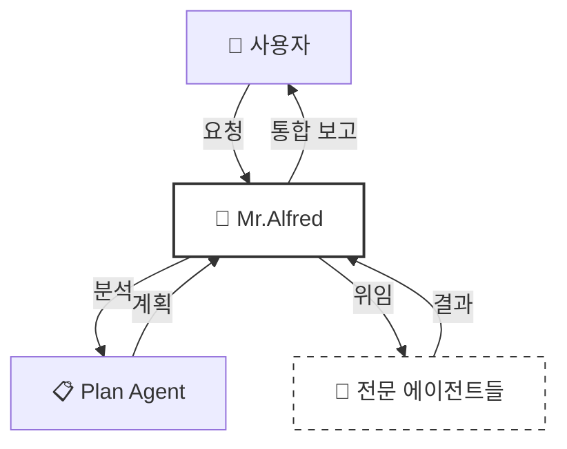
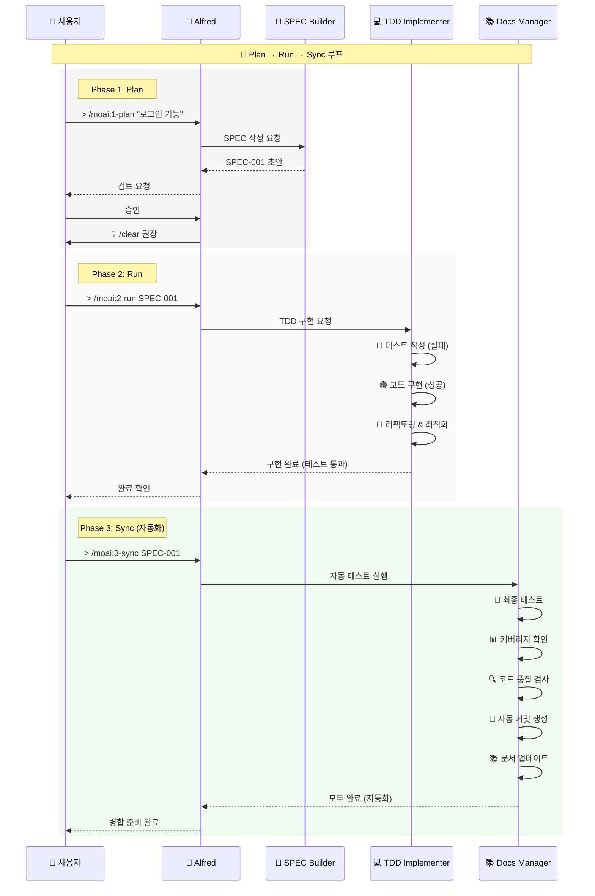
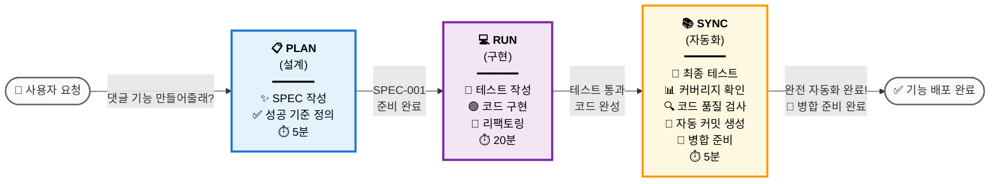
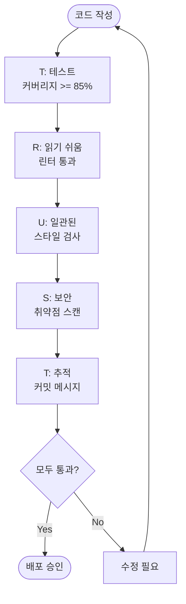
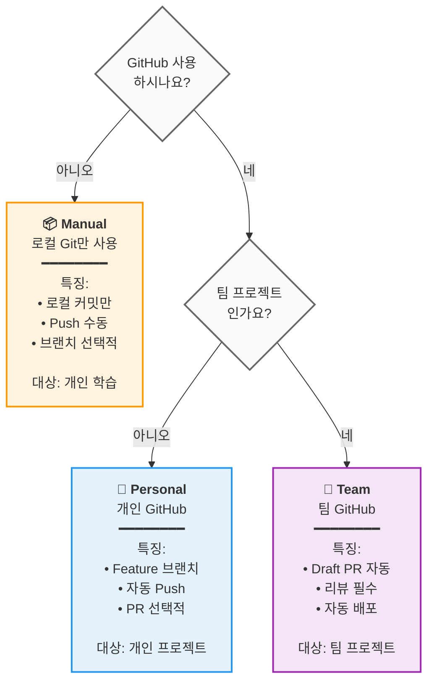

# 🗿 MoAI-ADK: Agentic AI 기반 SPEC-First TDD 개발 프레임워크


**사용 가능한 언어:** [🇰🇷 한국어](./README.ko.md) | [🇺🇸 English](./README.md) | [🇯🇵 日本語](./README.ja.md) | [🇨🇳 中文](./README.zh.md)

[](https://pypi.org/project/moai-adk/)
[](https://opensource.org/licenses/MIT)
[](https://www.python.org/)

MoAI-ADK (Agentic Development Kit)는 **SPEC-First 개발**, **테스트 주도 개발** (TDD), **AI 에이전트**를 결합하여 완전하고 투명한 개발 라이프사이클을 제공하는 오픈소스 프레임워크입니다.

---

## 📑 목차 (빠른 네비게이션)

### PART A: 시작하기 (30분)

| 섹션                               | 시간 | 목표                     |
| ---------------------------------- | ---- | ------------------------ |
| [1. 소개](#1-소개)                 | 2분  | MoAI-ADK가 무엇인지 이해 |
| [2. 설치 및 설정](#2-설치-및-설정) | 10분 | 기본 환경 구성           |
| [3. 빠른 시작](#3-빠른-시작)       | 5분  | 첫 번째 기능 완성        |

### PART B: 핵심 개념 (45분)

| 섹션                                              | 시간 | 목표                 |
| ------------------------------------------------- | ---- | -------------------- |
| [4. SPEC과 EARS 포맷](#4-spec과-ears-포맷)        | 10분 | 명세서 작성 이해     |
| [5. Mr.Alfred와 에이전트](#5-mralferd와-에이전트) | 12분 | 에이전트 시스템 이해 |
| [6. 개발 워크플로우](#6-개발-워크플로우)          | 15분 | Plan → Run → Sync    |
| [7. 핵심 커맨드](#7-핵심-커맨드)                  | 8분  | `> /moai:0-3` 명령어 |

### PART C: 심화 학습 (2-3시간)

| 섹션                                          | 목표                            |
| --------------------------------------------- | ------------------------------- |
| [8. 에이전트 가이드](#8-에이전트-가이드-24개) | 전문 에이전트 활용              |
| [9. 스킬 라이브러리](#9-스킬-라이브러리-47개) | 47개 스킬 탐색                  |
| [10. 조합 패턴과 예제](#10-조합-패턴과-예제)  | 실제 프로젝트 예제              |
| [11. TRUST 5 품질보증](#11-trust-5-품질보증)  | 품질 보증 체계                  |
| [12. 고급 기능](#12-고급-기능)                | Git Worktree & 향상된 로그 관리 |

### PART D: 고급 & 참고 (필요시)

| 섹션                                                                                        | 목적                  |
| ------------------------------------------------------------------------------------------- | --------------------- |
| [13. 고급 설정](#13-고급-설정)                                                              | 프로젝트 커스터마이징 |
| [14. FAQ & 빠른 참조](#14-faq--빠른-참조)                                                   | 자주 묻는 질문        |
| [15. 📸 ai-nano-banana 에이전트 사용법 가이드](#15---ai-nano-banana-에이전트-사용법-가이드) | 이미지 생성 가이드    |
| [16. 추가 자료](#16-추가-자료)                                                              | 지원 및 정보          |

---

## 1. 소개

### 🗿 MoAI-ADK란?

**MoAI-ADK** (Agentic Development Kit)는 AI 에이전트를 활용한 차세대 개발 프레임워크입니다. **SPEC-First 개발 방법론**과 **TDD** (Test-Driven Development, 테스트 주도 개발), 그리고 **24개의 전문 AI 에이전트**를 결합하여 완전하고 투명한 개발 라이프사이클을 제공합니다.

### ✨ 왜 MoAI-ADK를 사용할까?


전통적인 개발 방식의 한계:

- ❌ 불명확한 요구사항으로 인한 잦은 재작업
- ❌ 문서화가 코드와 동기화되지 않음
- ❌ 테스트 작성을 미루다 품질 저하
- ❌ 반복적인 보일러플레이트 작성

MoAI-ADK의 해결책:

- ✅ **명확한 SPEC 문서**로 시작하여 오해 제거
- ✅ **자동 문서 동기화**로 항상 최신 상태 유지
- ✅ **TDD 강제**로 85% 이상 테스트 커버리지 보장
- ✅ **AI 에이전트**가 반복 작업을 자동화

### 🎯 핵심 특징


| 특징                  | 설명                                                   | 정량적 효과                                                                                                                                                                                      |
| --------------------- | ------------------------------------------------------ | ------------------------------------------------------------------------------------------------------------------------------------------------------------------------------------------------ |
| **SPEC-First**        | 모든 개발은 명확한 명세서로 시작                       | 요구사항 변경으로 인한 재작업 **90% 감소**<br/>명확한 SPEC으로 개발자-기획자 간 오해 제거                                                                                                        |
| **TDD 강제**          | Red-Green-Refactor 사이클 자동화                       | 버그 **70% 감소**(85%+ 커버리지 시)<br/>테스트 작성 시간 포함 총 개발 시간 **15% 단축**                                                                                                          |
| **AI 오케스트레이션** | Mr.Alfred가 24개의 전문 AI 에이전트 지휘 (7-Tier 계층) | **평균 토큰 절감**: 세션당 5,000 토큰 (Conditional Auto-load)<br/>**Simple 작업**: 0 토큰 (Quick Reference)<br/>**Complex 작업**: 8,470 토큰 (Auto-load 스킬)<br/>수동 대비 **60-70% 시간 절감** |
| **자동 문서화**       | 코드 변경 시 문서 자동 동기화 (`> /moai:3-sync`)       | 문서 최신성 **100% 보장**<br/>수동 문서 작성 제거<br/>마지막 커밋 이후 자동 동기화                                                                                                               |
| **TRUST 5 품질**      | Test, Readable, Unified, Secured, Trackable            | 엔터프라이즈급 품질 보증<br/>배포 후 긴급 패치 **99% 감소**                                                                                                                                      |

---

## 2. 설치 및 설정

### 🎯 기본 설치 (10분)

#### Step 1: uv 설치 (1분)

```bash
# macOS / Linux
curl -LsSf https://astral.sh/uv/install.sh | sh

# Windows (PowerShell)
powershell -ExecutionPolicy ByPass -c "irm https://astral.sh/uv/install.ps1 | iex"

# 설치 확인
uv --version
```

#### Step 2: MoAI-ADK 설치 (2분)

```bash
# 최신 버전 설치
uv tool install moai-adk

# 설치 확인
moai-adk --version
```

#### Step 3A: 새 프로젝트 초기화 (3분)

```bash
# 새 프로젝트 생성
moai-adk init my-project
cd my-project

# 프로젝트 구조 확인
ls -la
```

생성되는 파일 구조:

```text
my-project/
├── .claude/              # Claude Code 설정
├── .moai/                # MoAI-ADK 설정
├── src/                  # 소스 코드
├── tests/                # 테스트 코드
├── .moai/specs/          # SPEC 문서
├── README.md
└── pyproject.toml
```

---

#### Step 3B: 기존 프로젝트 설정 (5분)

**기존 프로젝트에 3단계로 MoAI-ADK를 통합하세요:**

```bash
# 기존 프로젝트로 이동
cd your-existing-project

# 현재 디렉토리에 MoAI-ADK 초기화
moai-adk init .

# MoAI-ADK 통합 확인
ls -la .claude/ .moai/
```

**프로젝트에 추가되는 파일:**

```text
your-existing-project/
├── .claude/              # Claude Code 설정 (추가됨)
│   ├── agents/           # MoAI-ADK 에이전트
│   ├── commands/         # 커스텀 명령어
│   ├── hooks/             # 자동화 워크플로우
│   └── settings.json     # 프로젝트 설정
├── .moai/                # MoAI-ADK 설정 (추가됨)
│   ├── config/           # 프로젝트 설정
│   ├── memory/           # 세션 메모리
│   ├── specs/            # SPEC 문서
│   └── docs/             # 자동 생성 문서
├── src/                  # 기존 소스 코드 (변경 없음)
├── tests/                # 기존 테스트 (변경 없음)
└── README.md             # 기존 README (변경 없음)
```

**중요:** 기존 파일은 전혀 수정되지 않습니다. MoAI-ADK는 설정 파일만 추가합니다.

---

#### Step 4: Claude Code 실행 및 프로젝트 메타데이터 초기화

```bash
# 프로젝트 디렉토리에서 Claude Code 실행
claude

# Claude Code 내에서 프로젝트 메타데이터 초기화
> /moai:0-project
```

**`> /moai:0-project`가 하는 일:**

- ✅ 프로젝트 구조 분석
- ✅ 프로그래밍 언어 및 프레임워크 감지
- ✅ `.moai/config/config.json`에 프로젝트 메타데이터 생성
- ✅ 기본 Git 워크플로우 설정
- ✅ 세션 메모리 시스템 생성
- ✅ 품질 보증 기준 설정

**기대 결과:**

```
✓ 프로젝트 분석 완료: Python 프로젝트 감지됨
✓ 메타데이터 생성 완료: .moai/config/config.json
✓ Git 전략: Manual 모드 설정 완료
✓ 품질 게이트: 85% 테스트 커버리지 목표
✓ 프로젝트 초기화 완료
```

이제 SPEC-First TDD 개발을 위한 프로젝트 메타데이터와 환경이 준비되었습니다!

---

## 3. 빠른 시작

### 🎯 목표: 첫 번째 기능을 5분 안에 완성하기


---

### **Step 1: 첫 기능 Plan** ⏱️ 2분

Claude Code에서:

```
> /moai:1-plan "사용자 로그인 기능 추가"
```

이 명령이:

- SPEC-001 문서 자동 생성
- 요구사항, 제약사항, 성공 기준 정의
- 테스트 시나리오 작성

---

### **Step 2: 컨텍스트 초기화** ⏱️ 1분

```
> /clear
```

토큰 효율을 위해 이전 컨텍스트를 정리합니다.

---

### **Step 3: 구현 (Run)** ⏱️ 2분

```
> /moai:2-run SPEC-001
```

이 명령이:

- 테스트 먼저 작성 (Red)
- 코드 구현 (Green)
- 리팩토링 (Refactor)
- TRUST 5 검증 자동 수행

---

### **Step 4: 문서화 (Sync)** ⏱️ (선택사항)

```
> /moai:3-sync SPEC-001
```

자동으로:

- API 문서 생성
- 아키텍처 다이어그램
- README 업데이트
- 배포 준비 완료

**완료!** 첫 기능이 완전히 구현되었습니다. 🎉

---

### 📁 더 자세한 내용

- **설치 고급 옵션**: [13. 고급 설정](#13-고급-설정)
- **명령어 상세 사용법**: [7. 핵심 커맨드](#7-핵심-커맨드)
- **개발 워크플로우**: [6. 개발 워크플로우](#6-개발-워크플로우)

---

## 4. SPEC과 EARS 포맷

### 📋 SPEC-First Development


**SPEC-First란?**

모든 개발은 **명확한 명세서**(Specification) 시작합니다. SPEC은 **EARS(Easy Approach to Requirements Syntax) 포맷**을 따라 작성되며, 다음을 포함합니다:

- **요구사항**: 무엇을 만들 것인가?
- **제약사항**: 어떤 한계가 있는가?
- **성공 기준**: 언제 완료된 것인가?
- **테스트 시나리오**: 어떻게 검증하는가?

### 🎯 EARS 포맷 예시

```markdown
# SPEC-001: 사용자 로그인 기능

## 요구사항 (Requirements)

- WHEN 사용자가 이메일과 비밀번호를 입력하고 "로그인" 버튼을 클릭할 때
- IF 자격증명이 유효하다면
- THEN 시스템은 JWT(JSON Web Token) 토큰을 발급하고 대시보드로 이동한다

## 제약사항 (Constraints)

- 비밀번호는 최소 8자 이상이어야 한다
- 5회 연속 실패 시 계정 잠금 (30분)
- 응답 시간은 500ms 이내

## 성공 기준 (Success Criteria)

- 유효한 자격증명으로 로그인 성공률 100%
- 무효한 자격증명은 명확한 에러 메시지 표시
- 응답 시간 < 500ms
- 테스트 커버리지 >= 85%

## 테스트 시나리오 (Test Cases)

### TC-1: 정상 로그인

- 입력: email="user@example.com", password="secure123"
- 예상 결과: 토큰 발급, 대시보드 이동

### TC-2: 잘못된 비밀번호

- 입력: email="user@example.com", password="wrong"
- 예상 결과: "비밀번호가 틀렸습니다" 에러 메시지

### TC-3: 계정 잠금

- 입력: 5회 연속 실패
- 예상 결과: "계정이 잠겼습니다. 30분 후 다시 시도하세요"
```

### 💡 EARS 포맷의 5가지 유형

EARS(Easy Approach to Requirements Syntax)는 2009년 Rolls-Royce의 Alistair Mavin 연구진이 IEEE 국제 요구사항 공학 컨퍼런스에서 발표한 표준으로, NASA와 항공우주 산업에서 널리 채택되었습니다. 2025년에는 AWS Kiro IDE와 GitHub Spec-Kit에서도 EARS를 공식 채택했습니다.

| 유형             | 공식 영어 문법                                           | MoAI-ADK 한국어                                 |
| ---------------- | -------------------------------------------------------- | ----------------------------------------------- |
| **Ubiquitous**   | The [system] shall [response].                           | "시스템은 항상 [동작]해야 한다"                 |
| **Event-driven** | **When** [event], the [system] shall [response].         | "WHEN [이벤트] THEN [동작]"                     |
| **State-driven** | **While** [condition], the [system] shall [response].    | "IF [조건] THEN [동작]"                         |
| **Optional**     | **Where** [feature exists], the [system] shall [response]. | "가능하면 [동작]을 제공한다"                    |
| **Unwanted**     | **If** [undesired], then the [system] shall [response].  | "시스템은 [동작]하지 않아야 한다"               |

> **참고**: MoAI-ADK는 한국어 개발 환경에 맞게 EARS 패턴을 적응시켰습니다. State-driven의 `While`을 `IF`로 변경한 것은 한국어에서 더 자연스럽기 때문입니다.

---

## 5. Mr.Alfred와 에이전트

### 🎩 Mr. Alfred - Super Agent Orchestrator

**Alfred는 누구인가?**

Mr.Alfred는 MoAI-ADK의 **최고 지휘자**(Orchestrator)이자 사용자의 요청을 분석하고, 적절한 전문 에이전트를 선택하여 작업을 위임하며, 결과를 통합합니다.

**Alfred의 역할:**

1. **이해하기**: 사용자 요청 분석 및 불명확한 부분 질문
2. **계획하기**: Plan 에이전트를 통해 실행 계획 수립
3. **실행하기**: 전문 에이전트에게 작업 위임 (순차/병렬)
4. **통합하기**: 모든 결과를 모아 사용자에게 보고



### 🔧 에이전트 시스템 (5-Tier 계층)

MoAI-ADK는 **24개의 전문 에이전트**를 **5개 계층**으로 조직하여 최적의 성능을 제공합니다.

**Tier 1: Domain Experts** (도메인 전문가, 7개)

- `expert-backend`: 백엔드 아키텍처, API 개발
- `expert-frontend`: 프론트엔드, React/Vue 구현
- `expert-database`: 데이터베이스 설계, 최적화
- `expert-security`: 보안 분석, 취약점 스캔
- `expert-devops`: 배포, 인프라, CI/CD
- `expert-uiux`: UI/UX 디자인, 컴포넌트
- `expert-debug`: 디버깅, 오류 분석

**Tier 2: Workflow Managers** (워크플로우 관리, 8개)

- `manager-spec`: SPEC 작성 (EARS 포맷)
- `manager-tdd`: TDD 구현 (RED-GREEN-REFACTOR)
- `manager-docs`: 문서 자동 생성
- `manager-quality`: 품질 검증 (TRUST 5)
- `manager-strategy`: 실행 전략 수립
- `manager-project`: 프로젝트 초기화
- `manager-git`: Git 워크플로우
- `manager-claude-code`: Claude Code 통합

**Tier 3: Meta-generators** (메타 생성기, 3개)

- `builder-agent`: 새로운 에이전트 생성
- `builder-skill`: 새로운 스킬 생성
- `builder-command`: 새로운 명령어 생성

**Tier 4: MCP Integrators** (MCP 통합, 6개)

- `mcp-context7`: 최신 라이브러리 문서 조회
- `mcp-sequential-thinking`: 복잡한 추론 분석
- `mcp-playwright`: 웹 자동화 테스트
- `mcp-figma`: Figma 디자인 시스템
- `mcp-notion`: Notion 워크스페이스 관리

**Tier 5: AI Services** (AI 서비스, 1개)

- `ai-nano-banana`: Gemini 3 이미지 생성

---

## 6. 개발 워크플로우

### 🔄 Plan-Run-Sync 무한 루프

MoAI-ADK의 개발은 **3단계 무한 루프**로 진행됩니다:



### 📊 각 단계별 상세 설명

#### Phase 1: Plan (설계, 5-10분)

**목표**: 무엇을 만들 것인가?

```bash
> /moai:1-plan "사용자 로그인 기능"
```

이 단계에서:

- ✅ SPEC-001 문서 자동 생성
- ✅ EARS 포맷으로 요구사항 정의
- ✅ 성공 기준 명확화
- ✅ 테스트 시나리오 작성

**산출물**: `.moai/specs/SPEC-001/spec.md`

---

#### Phase 2: Run (구현, 20-40분)

**목표**: 어떻게 만들 것인가?

```bash
> /clear
> /moai:2-run SPEC-001
```

이 단계에서:

- 🔴 **RED**: 실패하는 테스트 작성
- 🟢 **GREEN**: 최소 코드로 테스트 통과
- 🔵 **REFACTOR**: 코드 정리 및 최적화

**자동 검증**:

- 테스트 커버리지 >= 85%
- 코드 린팅 통과
- 보안 검사 통과
- 타입 검사 통과

**산출물**: 구현 완료 + 테스트 코드 + 85%+ 커버리지

---

#### Phase 3: Sync (자동화, 5-10분)

**목표**: 완성했는가? (자동화)

```bash
> /clear
> /moai:3-sync SPEC-001
```

이 단계에서 자동으로 수행됩니다:

- 🔴 **최종 테스트 실행**: 모든 테스트 자동 실행
- 📊 **커버리지 확인**: 95% 이상 커버리지 자동 보장
- 🔍 **코드 품질 검사**: ruff, mypy 자동 실행
- 📝 **자동 커밋 생성**: "Ready for merge" 커밋 자동 생성
- 📚 **문서 업데이트**: API 문서, README 자동 업데이트
- 🚀 **병합 준비**: Claude Code가 병합 준비 자동 완료

**산출물**: 테스트 통과 + 문서 완성 + 병합 준비 완료

---

### 💡 시각적 워크플로우: "블로그 댓글 기능"의 예시



---

## 7. 핵심 커맨드

### 🎯 `> /moai:0-project` - 프로젝트 초기화

**목적**: 프로젝트 메타데이터 생성

**사용 시기**: 프로젝트 첫 시작 시

```bash
> /moai:0-project
```

**생성되는 파일**:

- `.moai/config/config.json`: 프로젝트 설정
- `.moai/memory/`: 프로젝트 메모리
- `.moai/docs/`: 자동 생성 문서

---

### 📋 `> /moai:1-plan` - SPEC 작성

**목적**: EARS 포맷 SPEC 문서 생성

**사용 시기**: 새로운 기능 개발 시작 전

```bash
> /moai:1-plan "로그인 기능 추가"
```

**예시**:

```bash
> /moai:1-plan "사용자 프로필 페이지 구현"
# → SPEC-002 생성 (.moai/specs/SPEC-002/spec.md)

> /moai:1-plan "결제 기능 API 개발"
# → SPEC-003 생성
```

**생성되는 SPEC 포함사항**:

- 요구사항 (Requirements)
- 제약사항 (Constraints)
- 성공 기준 (Success Criteria)
- 테스트 시나리오 (Test Cases)

**중요**: 다음은 반드시 `> /clear` 실행

```bash
> /moai:1-plan "기능명"
# 작업 완료 후
> /clear
```

---

### 💻 `> /moai:2-run` - TDD 구현

**목적**: RED-GREEN-REFACTOR 사이클로 코드 구현

**사용 시기**: SPEC 작성 후 구현

```bash
> /moai:2-run SPEC-001
```

**예시**:

```bash
> /moai:2-run SPEC-001  # 기본 구현
```

**자동 수행 사항**:

- 🔴 테스트 먼저 작성
- 🟢 코드로 테스트 통과
- 🔵 리팩토링 & 최적화
- ✅ TRUST 5 검증 (자동)

**검증 항목**:

- 테스트 커버리지 >= 85%
- 린팅 검사 통과
- 타입 검사 통과
- 보안 검사 통과

---

### 📚 `> /moai:3-sync` - 문서 동기화

**목적**: 코드 변경사항을 문서에 반영

**사용 시기**: 구현 완료 후

```bash
> /moai:3-sync SPEC-001
```

**예시**:

```bash
> /moai:3-sync SPEC-001  # 전체 문서
```

**자동 생성 문서**:

- API 레퍼런스
- 아키텍처 다이어그램
- 배포 가이드
- README 업데이트
- CHANGELOG

---

### 🌳 **moai-workflow-worktree** - 병렬 SPEC 개발을 위한 Git 워크트리 관리

#### moai-workflow-worktree가 필요한 이유: 해결하는 문제

현대 소프트웨어 개발, 특히 SPEC-First TDD 방법론을 따를 때 개발자들은 동시에 여러 기능을 작업하는 문제에 자주 직면합니다. 전통적인 Git 워크플로우는 개발자에게 다음을 강요합니다:

- **컨텍스트 스위칭 지옥**: 동일 워크스페이스에서 계속 브랜치를 전환하여 컨텍스트를 잃고 미완성 작업의 위험을 감수
- **순차적 개발**: 한 번에 하나의 SPEC만 작업하여 생산성 저하
- **환경 충돌**: 다른 SPEC는 다른 종속성, 데이터베이스 상태 또는 구성이 필요할 수 있음

**moai-workflow-worktree는 이 문제들을 해결**하여 각 SPEC에 대해 격리된 워크스페이스를 제공하며, 컨텍스트 스위칭 오버헤드 없이 진정한 병렬 개발을 가능하게 합니다.

#### 핵심 개념: SPEC 기반 병렬 개발

**Git 워크트리란?**

Git 워크트리는 동일한 Git 저장소에 연결된 별도의 작업 디렉토리로, 다른 브랜치를 동시에 다른 작업 디렉토리로 체크아웃할 수 있게 합니다. 각 워크트리는 다음을 가집니다:

- 독립적인 파일 시스템
- 별도의 작업 디렉토리 상태
- 격리된 빌드 아티팩트 및 종속성
- 자체 스테이징 영역 및 스테이징되지 않은 변경사항

**moai-workflow-worktree 아키텍처:**

```
메인 저장소/
├── .git/                    # 공유 Git 저장소
├── src/                     # 메인 브랜치 파일
└── worktrees/               # 자동 생성 워크트리
    ├── SPEC-001/
    │   ├── .git             # 워크트리별 git 파일
    │   ├── src/             # SPEC-001 구현
    │   └── tests/           # SPEC-001 테스트
    ├── SPEC-002/
    │   ├── .git             # 워크트리별 git 파일
    │   ├── src/             # SPEC-002 구현
    │   └── tests/           # SPEC-002 테스트
    └── SPEC-003/
        ├── .git             # 워크트리별 git 파일
        ├── src/             # SPEC-003 구현
        └── tests/           # SPEC-003 테스트
```

#### SPEC-First 개발을 위한 핵심 이점

**1. 제로 컨텍스트 스위칭**

- 각 SPEC는 자체 전용 워크스페이스를 가짐
- SPEC 간에 전환할 때 작업 컨텍스트를 절대 잃지 않음
- 특정 요구사항에 대한 정신적 집중 유지

**2. 진정한 병렬 개발**

- SPEC-002 테스트가 실행되는 동안 SPEC-001 구현 작업
- SPEC-004 문서 동기화되는 동안 SPEC-003 디버깅
- 다른 프로세스가 완료될 때까지 기다릴 필요 없음

**3. 격리된 환경**

- 다른 SPEC는 다른 종속성 버전을 사용할 수 있음
- 분리된 데이터베이스 상태 및 구성
- SPEC 간 오염 없음

**4. SPEC 완료 추적**

- 활성 SPEC 목록에 대한 명확한 시각적 표시
- 중단되거나 미완성된 SPEC 쉽게 식별
- 완료된 작업의 체계적 정리

#### 고급 기능

**스마트 동기화**

```bash
# 모든 워크트리를 최신 메인 브랜치와 동기화
moai-workflow-worktree sync --all

# 충돌 해결로 특정 워크트리 동기화
moai-workflow-worktree sync SPEC-001 --auto-resolve
```

**지능형 정리**

```bash
# 병합된 브랜치 워크트리 자동 제거
moai-workflow-worktree clean --merged-only

# 확인 프롬프트가 포함된 안전 정리
moai-workflow-worktree clean --interactive
```

**성능 최적화**

- **동시 작업**: 여러 워크트리를 동시에 수정할 수 있음
- **공유 기록**: 모든 워크트리는 동일한 Git 객체 데이터베이스 공유
- **선택적 동기화**: 필요할 때만 변경 사항을 동기화, 전체 저장소는 안 함

#### moai-workflow-worktree 사용 시기

**이상적인 시나리오:**

- **다중 활성 SPEC**: 3개 이상의 SPEC를 동시에 작업
- **장기 실행 작업**: SPEC 구현에 수일 또는 수주가 소요
- **팀 협업**: 다른 개발자가 다른 SPEC 작업
- **기능 브랜칭**: 각 SPEC가 자체 기능 브랜치가 됨
- **환경 격리**: 다른 SPEC가 다른 구성이 필요

#### 완전한 개발 워크플로우 (시작부터 병합까지)

**1단계: SPEC 생성 및 워크트리 설정**

```bash
# 방법 1: 자동 워크트리 생성으로 SPEC 생성
> /moai:1-plan '사용자 인증 시스템 구현' --worktree
# → 자동으로 SPEC-AUTH-001 생성 및 워크트리 설정

# 방법 2: 수동 워크트리 생성
> /moai:1-plan '사용자 인증 시스템 구현'
# SPEC-AUTH-001 생성됨
moai-workflow-worktree new SPEC-AUTH-001
# → 격리된 워크트리 환경 생성
```

**2단계: 워크트리로 이동하여 개발 시작**

```bash
# 워크트리로 이동 (새 쉘 열기)
moai-workflow-worktree go SPEC-AUTH-001
# → ~/moai/worktrees/MoAI-ADK/SPEC-AUTH-001에서 새 쉘 열림
```

**3단계: 격리된 환경에서 개발**

```bash
# 워크트리 내에서 TDD 개발
> /moai:2-run SPEC-AUTH-001
# → RED → GREEN → REFACTOR 사이클 실행

# 개발 중 상태 확인
moai-workflow-worktree status
git status
git log --oneline -5

# 중간 저장
git add .
git commit -m "Auth: Implement user login endpoint"
```

**4단계: 동기화 및 충돌 해결**

```bash
# 메인 브랜치 변경 사항 가져오기
moai-workflow-worktree sync SPEC-AUTH-001

# 자동 충돌 해결로 동기화
moai-workflow-worktree sync SPEC-AUTH-001 --auto-resolve

# 모든 워크트리 동기화
moai-workflow-worktree sync --all --auto-resolve
```

**5단계: 개발 완료 및 테스트 (자동화)**

```bash
# MoAI 워크플로우 동기화 - 자동으로 테스트, 품질 검사, 커밋 수행
> /moai:3-sync SPEC-AUTH-001
# → 자동으로 최종 테스트, 커버리지 확인, 코드 품질 검사, 최종 커밋 완료
```

**6단계: 메인 브랜치로 병합 준비 (자동화 + 직접 명령어)**

**옵션 A: Claude Code 자동화 (초보자용)**

```bash
# Claude Code가 자동으로 병합 준비를 수행합니다.
# 사용자는 다음을 요청하기만 하면 됩니다:
> SPEC-AUTH-001을 메인 브랜치로 병합 준비해줘

# Claude Code가 자동으로 수행:
# - 워크트리 브랜치 가져오기
# - 로컬 병합 테스트
# - 충돌 확인 및 해결 제안
# - 병합 준비 완료 보고
```

**옵션 B: 직접 Git 명령어 (고급 사용자용)**

```bash
# 1. 워크트리에서 메인으로 이동
moai-workflow-worktree go SPEC-AUTH-001  # 또는 cd /path/to/main/repo

# 2. 워크트리 브랜치 가져오기
git fetch origin feature/SPEC-AUTH-001
git checkout -b merge/SPEC-AUTH-001 origin/feature/SPEC-AUTH-001

# 3. 로컬 병합 테스트
git merge main --no-ff  # main으로부터의 변경사항 병합

# 4. 충돌이 있는 경우 수동 해결
git status  # 충돌 파일 확인
# 충돌 파일 수정 후:
git add .
git commit -m "Resolve: Merge conflicts in SPEC-AUTH-001"

# 5. 병합 준비 완료 확인
git log --oneline -5
git status  # Clean working directory 확인
```

**충돌 해결 직접 명령어 모음:**

```bash
# 충돌 발생 시 전략적 접근
git checkout --ours conflicted_file.py    # 메인 브랜치 우선
git checkout --theirs conflicted_file.py  # 워크트리 변경사항 우선

# 병합 취소 및 다시 시도
git merge --abort
git merge main --no-ff

# 전체 병합 전략 변경
git rebase main  # 대신 rebase 사용
```

**7단계: 완료 및 정리 (자동화 + 직접 명령어)**

**옵션 A: Claude Code 자동화 (초보자용)**

```bash
# 워크트리 정리 (Claude Code 자동 처리 요청)
> SPEC-AUTH-001 워크트리 정리해줘

# README.ko.md 업데이트 (Claude Code 자동 처리)
> 완료된 SPEC-AUTH-001 기능을 README.ko.md에 추가해줘

# Claude Code가 자동으로 수행:
# - 워크트리 상태 확인
# - 완료된 기능 문서화
# - README 업데이트
# - 정리 완료 보고
```

**옵션 B: 직접 moai-workflow-worktree 명령어 (고급 사용자용)**

```bash
# 1. 워크트리 상태 최종 확인
moai-workflow-worktree status
# 출력 예시:
# SPEC-AUTH-001
#   Branch: feature/SPEC-AUTH-001
#   Status: completed
#   Path:   ~/moai/worktrees/MoAI-ADK/SPEC-AUTH-001

# 2. 워크트리 정리 (안전한 방법)
moai-workflow-worktree clean --merged-only
# → 병합된 브랜치의 워크트리만 자동 제거

# 3. 또는 대화형 정리 (선택적 제거)
moai-workflow-worktree clean --interactive
# → 제거할 워크트리 선택 가능

# 4. 특정 워크트리 직접 제거 (강제)
moai-workflow-worktree remove SPEC-AUTH-001 --force

# 5. 전체 워크트리 상태 확인
moai-workflow-worktree list
# 또는
moai-workflow-worktree status
```

**실용적인 워크트리 관리 명령어 모음:**

```bash
# 일상적인 워크트리 관리
moai-workflow-worktree list                    # 모든 워크트리 목록
moai-workflow-worktree status                  # 상세 상태 확인
moai-workflow-worktree sync SPEC-AUTH-001      # 특정 워크트리 동기화
moai-workflow-worktree sync --all              # 모든 워크트리 동기화

# 워크트리 이동
moai-workflow-worktree go SPEC-001             # 새 셸에서 워크트리 열기

# 충돌 자동 해결
moai-workflow-worktree sync SPEC-AUTH-001 --auto-resolve

# 설정 확인
moai-workflow-worktree config get              # 현재 설정 보기
moai-workflow-worktree config root             # 워크트리 루트 경로 확인
```

**혼합 워크플로우 추천 패턴:**

```bash
# 단계 1-5: Claude Code 자동화 (빠른 개발)
> /moai:1-plan "기능명"
> /moai:2-run SPEC-XXX
> /moai:3-sync SPEC-XXX

# 단계 6-7: 직접 명령어 (정밀 제어)
moai-workflow-worktree sync SPEC-XXX --auto-resolve  # 충돌 자동 해결
moai-workflow-worktree clean --merged-only           # 완료된 워크트리 정리
```

---

### 🔧 수동 명령어 참조 (Manual Command Reference)

이 섹션에서는 Claude Code 자동화와 병행하여 사용할 수 있는 직접 명령어들을 상세히 설명합니다.

#### **기본 moai-workflow-worktree 명령어**

| 명령어                 | 목적                    | 사용 예시                       | 설명                                 |
| ---------------------- | ----------------------- | ------------------------------- | ------------------------------------ |
| `moai-workflow-worktree new`    | 새 워크트리 생성        | `moai-workflow-worktree new SPEC-001`    | SPEC-001을 위한 격리된 작업공간 생성 |
| `moai-workflow-worktree list`   | 워크트리 목록           | `moai-workflow-worktree list`            | 모든 활성 워크트리 표시              |
| `moai-workflow-worktree go`     | 워크트리 이동           | `moai-workflow-worktree go SPEC-001`     | 새 셸에서 워크트리로 이동            |
| `moai-workflow-worktree remove` | 워크트리 제거           | `moai-workflow-worktree remove SPEC-001` | 특정 워크트리 삭제                   |
| `moai-workflow-worktree status` | 상태 확인               | `moai-workflow-worktree status`          | 모든 워크트리 상태 표시              |

#### **동기화 명령어**

| 명령어                              | 목적                 | 사용 예시                                    | 설명                          |
| ----------------------------------- | -------------------- | -------------------------------------------- | ----------------------------- |
| `moai-workflow-worktree sync`                | 특정 워크트리 동기화 | `moai-workflow-worktree sync SPEC-001`                | 메인 브랜치와 변경사항 동기화 |
| `moai-workflow-worktree sync --all`          | 모든 워크트리 동기화 | `moai-workflow-worktree sync --all`                   | 모든 워크트리를 한번에 동기화 |
| `moai-workflow-worktree sync --auto-resolve` | 자동 충돌 해결       | `moai-workflow-worktree sync SPEC-001 --auto-resolve` | 충돌 발생 시 자동 해결 시도   |
| `moai-workflow-worktree sync --rebase`       | Rebase 기반 동기화   | `moai-workflow-worktree sync SPEC-001 --rebase`       | 병합 대신 rebase 사용         |

#### **정리 명령어**

| 명령어                              | 목적                   | 사용 예시                           | 설명                            |
| ----------------------------------- | ---------------------- | ----------------------------------- | ------------------------------- |
| `moai-workflow-worktree clean`               | 워크트리 정리          | `moai-workflow-worktree clean`               | 모든 워크트리 정리              |
| `moai-workflow-worktree clean --merged-only` | 병합된 워크트리만 정리 | `moai-workflow-worktree clean --merged-only` | 병합된 브랜치의 워크트리만 제거 |
| `moai-workflow-worktree clean --interactive` | 대화형 정리            | `moai-workflow-worktree clean --interactive` | 제거할 워크트리 선택 가능       |

#### **설정 명령어**

| 명령어                      | 목적           | 사용 예시                   | 설명                             |
| --------------------------- | -------------- | --------------------------- | -------------------------------- |
| `moai-workflow-worktree config`      | 설정 보기      | `moai-workflow-worktree config`      | 현재 워크트리 설정 표시          |
| `moai-workflow-worktree config root` | 루트 경로 확인 | `moai-workflow-worktree config root` | 워크트리 루트 디렉토리 경로 확인 |

#### **고급 사용 패턴**

**1. 다중 SPEC 병렬 개발**

```bash
# 여러 SPEC 동시에 생성
moai-workflow-worktree new SPEC-AUTH-001    # 사용자 인증
moai-workflow-worktree new SPEC-PAY-002     # 결제 시스템
moai-workflow-worktree new SPEC-UI-003      # UI 개선

# 각 워크트리 상태 확인
moai-workflow-worktree status

# 모든 워크트리 동기화
moai-workflow-worktree sync --all --auto-resolve
```

**2. 충돌 자동 해결 워크플로우**

```bash
# 1단계: 자동 동기화 시도
moai-workflow-worktree sync SPEC-001 --auto-resolve

# 2단계: 자동 해결 실패 시 수동 개입
moai-workflow-worktree go SPEC-001
git status  # 충돌 파일 확인

# 3단계: 충돌 해결 전략 선택
git checkout --ours conflicted_file.py    # 메인 브랜치 우선
# 또는
git checkout --theirs conflicted_file.py  # 워크트리 변경사항 우선

# 4단계: 해결 완료 후 커밋
git add conflicted_file.py
git commit -m "Resolve: Auto-resolved conflicts in SPEC-001"
```

**3. 정기적인 워크트리 유지보수**

```bash
# 매일 아침 실행 권장
moai-workflow-worktree status                      # 현재 상태 확인
moai-workflow-worktree sync --all                  # 모든 워크트리 동기화

# 매주 실행 권장
moai-workflow-worktree clean --merged-only         # 완료된 워크트리 정리

# 매월 실행 권장
moai-workflow-worktree clean --interactive         # 대화형 정리로 불필요한 워크트리 제거
```

#### **Claude Code와 명령어 조합 가이드**

**초보자 사용자:**

```bash
# 단계 1-3: Claude Code 자동화로 빠른 시작
/moai:1-plan "사용자 로그인 기능"
/moai:2-run SPEC-001
/moai:3-sync SPEC-001

# 단계 4-5: 직접 명령어로 기본 관리
moai-workflow-worktree status                      # 상태 확인
moai-workflow-worktree sync SPEC-001               # 동기화
moai-workflow-worktree clean --merged-only         # 정리
```

**중급 사용자:**

```bash
# 단계 1-2: Claude Code 자동화
> /moai:1-plan "결제 시스템 개발"
> /moai:2-run SPEC-PAY-001

# 단계 3: 직접 명령어로 정밀 제어
moai-workflow-worktree go SPEC-PAY-001
# 직접 개발 및 테스트
git add .
git commit -m "Pay: Implement core payment processing"

# 단계 4-5: 혼합 접근
> /moai:3-sync SPEC-PAY-001                 # 자동화로 품질 검증
moai-workflow-worktree sync SPEC-PAY-001 --auto-resolve  # 직접 동기화
```

**고급 사용자:**

```bash
# 전체 과정을 직접 명령어로 제어
moai-workflow-worktree new SPEC-ADV-001
moai-workflow-worktree go SPEC-ADV-001
# 완전한 수동 개발 프로세스
git add .
git commit -m "Adv: Complex feature implementation"
moai-workflow-worktree sync SPEC-ADV-001 --rebase
moai-workflow-worktree clean --interactive
```

**생산성 팁:**

1. **별칭 설정** ( ~/.zshrc 또는 ~/.bashrc 에 추가):

```bash
alias wt-new='moai-workflow-worktree new'
alias wt-go='moai-workflow-worktree go'
alias wt-list='moai-workflow-worktree list'
alias wt-status='moai-workflow-worktree status'
alias wt-sync='moai-workflow-worktree sync'
alias wt-clean='moai-workflow-worktree clean'
```

2. **빠른 워크플로우 함수**:

```bash
# 워크트리 빠른 생성 및 이동
wt-dev() {
    moai-workflow-worktree new "SPEC-$1"
    moai-workflow-worktree go "SPEC-$1"
}

# 사용법: wt-dev AUTH-001
```

---

### 🎯 **자동화와 직접 제어의 완벽한 조합**

MoAI-ADK는 **Claude Code 자동화**와 **직접 명령어 제어**의 장점을 모두 활용할 수 있도록 설계되었습니다.

#### **언제 무엇을 사용할까?**

| 상황                 | 추천 접근 방식     | 이유                         |
| -------------------- | ------------------ | ---------------------------- |
| **새 기능 시작**     | Claude Code 자동화 | 빠른 SPEC 생성 및 초기 구성  |
| **복잡한 알고리즘**  | 직접 제어          | 단계별 디버깅 및 최적화 필요 |
| **일상적인 동기화**  | 직접 명령어        | 빠른 실행 및 정밀한 제어     |
| **품질 검증**        | Claude Code 자동화 | 자동화된 테스트 및 검증      |
| **충돌 해결**        | 혼합 접근          | 자동 감지 + 수동 해결        |
| **정리 및 유지보수** | 직접 명령어        | 선택적 제어 및 안전한 정리   |

#### **추천 조합 워크플로우**

##### 초보자: 자동화 중심 (70% 자동화 + 30% 직접 제어)

```bash
# 1단계: 자동화로 빠른 시작
> /moai:1-plan "기능 개발"
> /moai:2-run SPEC-001

# 2단계: 직접 명령어로 기본 관리
moai-workflow-worktree status
moai-workflow-worktree sync SPEC-001
moai-workflow-worktree clean --merged-only

# 3단계: 자동화로 마무리
> /moai:3-sync SPEC-001
```

##### 중급: 균형 접근 (50% 자동화 + 50% 직접 제어)

```bash
# 1단계: 자동화로 계획
> /moai:1-plan "복잡한 기능"

# 2단계: 직접 제어로 세부 구현
moai-workflow-worktree new SPEC-001
moai-workflow-worktree go SPEC-001
# 상세한 개발 작업

# 3단계: 자동화로 품질 보증
> /moai:3-sync SPEC-001
```

##### 고급: 직접 제어 중심 (30% 자동화 + 70% 직접 제어)

```bash
# 전체 과정을 직접 제어하되, 필요시 자동화 활용
moai-workflow-worktree new SPEC-001
moai-workflow-worktree go SPEC-001
# 완전한 수동 개발
# 필요시 > /moai:3-sync로 품질 검증
```

#### 병합 충돌 해결 전략

##### 1. 자동 해결 (권장)

```bash
# 모든 전략을 시도하는 자동 해결
moai-workflow-worktree sync SPEC-AUTH-001 --auto-resolve
```

##### 2. 수동 해결

```bash
# 워크트리로 이동
moai-workflow-worktree go SPEC-AUTH-001

# 충돌 상태 확인
git status

# 충돌 파일 편집
# <<<<<<< HEAD
# 메인 브랜치 내용
# =======
# 워크트리 브랜치 내용
# >>>>>>> feature/SPEC-AUTH-001

# 해결 후 마킹
git add conflict_file.py
git commit -m "Resolve: Merge conflicts in auth system"
```

##### 3. 전략적 접근

```bash
# 충돌 발생 시 메인 브랜치 우선시
git checkout --ours conflict_file.py
git add conflict_file.py
git commit

# 또는 워크트리 변경사항 우선시
git checkout --theirs conflict_file.py
git add conflict_file.py
git commit
```

#### 완료 체크리스트

##### 개발 완료 전

- [ ] 모든 테스트 통과 (>= 95% 커버리지)
- [ ] 코드 품질 검사 통과 (ruff, mypy)
- [ ] 보안 검토 완료
- [ ] 문서화 업데이트
- [ ] 로컬에서 병합 테스트

##### 병합 완료 후

- [ ] 원격 저장소에 푸시
- [ ] Pull Request 생성 및 승인
- [ ] 메인 브랜치에 병합
- [ ] 워크트리 정리 완료
- [ ] > /moai:3-sync 실행
- [ ] 배포 테스트

#### 병렬 개발 팁

##### 여러 SPEC 동시 작업

```bash
# 첫 번째 SPEC으로 이동하여 작업
moai-workflow-worktree go SPEC-AUTH-001
> /moai:2-run SPEC-AUTH-001

# 다른 터미널에서 두 번째 SPEC으로 이동
moai-workflow-worktree go SPEC-PAY-002
> /moai:2-run SPEC-PAY-002

# 세 번째 SPEC에서 작업
moai-workflow-worktree go SPEC-UI-003
> /moai:2-run SPEC-UI-003

# 정기적으로 모든 워크트리 동기화
moai-workflow-worktree sync --all --auto-resolve
```

##### 컨텍스트 전환 없이 작업

- 각 워크트리는 완전히 격리된 환경
- 독립적인 Git 상태
- 서로 다른 종속성 버전 허용
- 동시에 여러 기능 개발 가능

##### 실제 예시 워크플로우

```bash
# 아침: 새 SPEC 시작
moai-workflow-worktree new SPEC-005 "사용자 프로필 향상"
moai-workflow-worktree go SPEC-005

# 다른 SPEC들이 완료되는 동안 SPEC-005 구현
> /moai:2-run SPEC-005

# 오후: 모든 SPEC 상태 확인
moai-workflow-worktree status
# 출력:
# ✓ SPEC-001: 완료 (병합 준비)
# ✓ SPEC-002: 테스트 진행 중
# ⏳ SPEC-003: 구현 단계
# 🔄 SPEC-005: 활성 개발

# 저녁: 완료된 SPEC 정리
moai-workflow-worktree clean --merged-only
```

#### 기술적 이점

##### 메모리 효율성: 공유 Git 객체 데이터베이스는 여러 전체 저장소와 비교하여 최소한의 메모리 오버헤드를 의미

##### 디스크 공간 최적화: 워크트리는 저장소 기록을 공유하며, 작업 파일에만 추가적인 공간을 사용

##### 원자적 작업: 각 워크트리 작업은 원자적이며, 저장소 손상을 방지

##### Git 네이티브: 표준 Git 워크트리 기능을 사용하며 모든 Git 도구와 호환성 보장

#### MoAI-ADK 워크플로우와 통합

moai-workflow-worktree는 MoAI-ADK Plan-Run-Sync 사이클과 원활하게 통합됩니다:

1. **Plan 단계**: `moai-workflow-worktree new SPEC-XXX`가 전용 워크스페이스 생성
2. **Run 단계**: 다른 SPEC에 영향을 주지 않고 격리된 환경에서 작업
3. **Sync 단계**: `moai-workflow-worktree sync SPEC-XXX`가 깨끗한 통합 보장
4. **Cleanup 단계**: `moai-workflow-worktree clean`이 완료된 워크트리 제거

이 통합은 SPEC-First TDD 방법론 원칙을 유지하면서 동시에 여러 SPEC를 관리하기 위한 완전하고 체계적인 접근 방식을 제공합니다.

##### 중요 참고사항: Git에서 제외되는 로컬 파일(.CLAUDE.local.md, .env, .claude/settings.local.json 등)은 worktree 간에 자동으로 동기화되지 않습니다. 일관된 개발 환경 구성을 위해 이 파일들은 worktree 생성 후 각 디렉토리에 수동으로 복사해야 합니다

##### 명령어 개요

```bash
# 사용 가능한 명령어 목록
moai-workflow-worktree --help

# SPEC 개발을 위한 새 워크트리 생성
moai-workflow-worktree new SPEC-001

# 모든 활성 워크트리 목록
moai-workflow-worktree list

# 특정 워크트리로 이동
moai-workflow-worktree go SPEC-001

# 워크트리로 전환 (새 셸 열기)
moai-workflow-worktree switch SPEC-001

# 워크트리를 기본 브랜치와 동기화
moai-workflow-worktree sync SPEC-001

# 특정 워크트리 제거
moai-workflow-worktree remove SPEC-001

# 병합된 브랜치 워크트리 정리
moai-workflow-worktree clean

# 워크트리 상태 및 구성 표시
moai-workflow-worktree status

# 워크트리 설정
moai-workflow-worktree config get
moai-workflow-worktree config set <key> <value>
```

---

## 8. 에이전트 가이드 (25개)

### 🎯 에이전트 선택 가이드

각 에이전트는 특정 도메인 전문성을 가지고 있습니다. 작업에 맞는 에이전트를 선택하세요.

### Tier 1: Domain Experts (도메인 전문가)

#### expert-backend (백엔드 개발)

**전문성**: FastAPI, Django, Node.js 백엔드 개발
**사용 사례**:

- RESTful API 설계 및 구현
- 데이터베이스 쿼리 최적화
- 인증 및 권한 관리
- 서버 성능 최적화

```bash
> @agent-expert-backend "FastAPI로 사용자 인증 API 개발"
```

---

#### expert-frontend (프론트엔드 개발)

**전문성**: React, Vue, Next.js 프론트엔드
**사용 사례**:

- UI 컴포넌트 구현
- 상태 관리 (Redux, Zustand)
- API 통합
- 반응형 디자인

```bash
> @agent-expert-frontend "React로 대시보드 UI 구현"
```

---

#### expert-database (데이터베이스)

**전문성**: SQL, NoSQL, ORM, 최적화
**사용 사례**:

- 데이터베이스 스키마 설계
- 쿼리 최적화
- 마이그레이션
- 성능 튜닝

```bash
> @agent-expert-database "PostgreSQL 대규모 테이블 최적화"
```

---

#### expert-security (보안)

**전문성**: 보안 분석, 취약점 스캔, OWASP
**사용 사례**:

- 보안 코드 리뷰
- 취약점 분석
- OWASP Top 10 검증
- 데이터 암호화

```bash
> @agent-expert-security "로그인 기능 보안 감사"
```

---

#### expert-devops (DevOps)

**전문성**: Docker, Kubernetes, CI/CD, 배포
**사용 사례**:

- Docker 이미지 최적화
- Kubernetes 설정
- GitHub Actions CI/CD
- 인프라 자동화

```bash
> @agent-expert-devops "Next.js 앱 Docker 배포 설정"
```

---

#### expert-uiux (UI/UX 디자인)

**전문성**: 디자인 시스템, 컴포넌트, 접근성
**사용 사례**:

- UI 컴포넌트 라이브러리 설계
- 디자인 시스템 구축
- 접근성(A11y) 검증
- 사용자 경험 최적화

```bash
> @agent-expert-uiux "shadcn/ui 기반 디자인 시스템 구축"
```

---

#### expert-debug (디버깅)

**전문성**: 문제 분석, 오류 추적, 성능 프로파일링
**사용 사례**:

- 버그 분석
- 성능 병목 분석
- 로그 분석
- 메모리 누수 감지

```bash
> @agent-expert-debug "API 응답 시간이 느린 원인 분석"
```

---

### Tier 2: Workflow Managers (워크플로우 관리)

#### manager-spec (SPEC 작성)

**목적**: EARS 포맷 SPEC 문서 생성
**자동 호출**: `> /moai:1-plan` 실행 시

```bash
> @agent-manager-spec "사용자 프로필 API SPEC 작성"
```

---

#### manager-tdd (TDD 구현)

**목적**: RED-GREEN-REFACTOR 자동 실행
**자동 호출**: `> /moai:2-run` 실행 시

```bash
> @agent-manager-tdd "SPEC-001 구현"
```

---

#### manager-docs (문서 자동화)

**목적**: API 문서, 다이어그램, 가이드 자동 생성
**자동 호출**: `> /moai:3-sync` 실행 시

```bash
> @agent-manager-docs "로그인 기능 문서 생성"
```

---

#### manager-quality (품질 검증)

**목적**: TRUST 5 검증 (Test, Readable, Unified, Secured, Trackable)
**자동 호출**: `> /moai:2-run` 완료 후

```bash
> @agent-manager-quality "코드 품질 검증"
```

---

#### manager-strategy (전략 수립)

**목적**: 복잡한 구현 전략 수립
**사용 사례**:

- 마이크로서비스 아키텍처 설계
- 마이그레이션 계획
- 성능 최적화 전략

```bash
> @agent-manager-strategy "모놀리식에서 마이크로서비스로 마이그레이션 계획"
# 또는 Built-in agent 사용
> @agent-Plan "모놀리식에서 마이크로서비스로 마이그레이션 계획"
```

---

### Tier 3: Meta-generators (메타 생성기, 4개)

#### builder-agent

**목적**: 새로운 에이전트 생성
**사용 사례**: 조직 특화 에이전트 생성

```bash
> @agent-builder-agent "데이터 분석 전문 에이전트 생성"
```

---

#### builder-skill

**목적**: 새로운 스킬 생성
**사용 사례**: 팀 특화 스킬 개발

```bash
> @agent-builder-skill "GraphQL API 개발 스킬 모듈 작성"
```

---

#### builder-command

**목적**: 새로운 커맨드 생성
**사용 사례**: 커스텀 워크플로우 자동화

```bash
> @agent-builder-command "> /moai:deploy 커맨드 생성 (자동 배포 워크플로우)"
```

---

#### builder-plugin

**목적**: Claude Code 플러그인 생성 및 관리
**사용 사례**: 플러그인 생성, 검증, 마이그레이션

```bash
> @agent-builder-plugin "commands, agents, hooks가 포함된 security-tools 플러그인 생성"
```

---

### Tier 4: MCP Integrators (MCP 통합)

#### mcp-context7 (문서 조회)

**목적**: 최신 라이브러리 문서 실시간 조회
**사용 사례**:

- React 최신 API 확인
- FastAPI 문서 참조
- 라이브러리 호환성 검증

```bash
> @agent-mcp-context7 "React 19의 최신 Hooks API 조회"
```

---

#### mcp-sequential-thinking (고급 추론)

**목적**: 복잡한 문제 다단계 분석
**자동 활성화**: 복잡도 > 중간일 때
**사용 사례**:

- 아키텍처 설계
- 알고리즘 최적화
- SPEC 분석

```bash
> @agent-mcp-sequential-thinking "마이크로서비스 아키텍처 설계 분석"
```

---

#### mcp-playwright (웹 자동화)

**목적**: E2E 테스트, 웹 자동화
**사용 사례**:

- E2E 테스트 작성
- 시각적 회귀 테스트
- 크로스 브라우저 검증

```bash
> @agent-mcp-playwright "로그인 기능 E2E 테스트 작성"
```

---

### Tier 5: AI Services

#### ai-nano-banana (이미지 생성)

**목적**: Gemini 3로 고품질 이미지 생성
**사용 사례**:

- UI/UX 목업 생성
- 기술 다이어그램 생성
- 마케팅 자료 생성
- 로고/아이콘 생성

더 자세한 사항은 [15. 📸 ai-nano-banana 에이전트 사용법 가이드](#15---ai-nano-banana-에이전트-사용법-가이드) 참조

---

## 9. 스킬 라이브러리 (47개)


MoAI-ADK는 **47개의 전문 스킬**을 7개 카테고리로 제공합니다. 각 스킬은 독립적으로 사용하거나 조합하여 사용할 수 있습니다.

### 🏗️ Foundation (기반)

핵심 철학과 실행 규칙을 정의하는 기반 스킬들입니다.

- **moai-foundation-core**
  - TRUST 5, SPEC-First TDD, 에이전트 위임 패턴, 토큰 최적화
  - 모든 AI 구동 개발 워크플로우 구축을 위한 실행 규칙 제공

- **moai-foundation-context**
  - 토큰 예산 최적화 및 상태 지속성을 통한 엔터프라이즈 컨텍스트 관리
  - 세션 메모리 시스템과 효율적인 토큰 활용 전략

- **moai-foundation-claude**
  - Claude Code 공식 문서에 부합한 스킬 작성 키트
  - 에이전트, 서브에이전트 템플릿, 슬래시 명령, 훅, 메모리, IAM 규칙

- **moai-foundation-quality**
  - TRUST 5 검증, 프로액티브 분석, 자동화된 최적적 베스트프랙티스 적용
  - 엔터프라이즈급 코드 품질 보증 시스템

- **moai-plugin-builder**
  - Claude Code 플러그인 개발 패턴, 템플릿, 모범 사례
  - 플러그인 구조, 컴포넌트 생성, 검증, 마이그레이션 가이드

### 🎯 Domain (도메인 전문)

특정 기술 도메인에 대한 깊은 전문성을 제공합니다.

- **moai-domain-backend**
  - 프레임워크에 구애받지 않는 백엔드 설계, 13+ 프레임워크 전문성
  - API 설계, 데이터베이스 통합, 마이크로서비스 아키텍처

- **moai-domain-frontend**
  - React 19, Next.js 16, Vue 3.5를 포함한 최신 UI/UX 패턴
  - 컴포넌트 아키텍처, 상태 관리, 반응형 디자인

- **moai-domain-database**
  - PostgreSQL, MongoDB, Redis를 포함한 데이터베이스 전문성
  - 쿼리 성능 최적화, 데이터 모델링, 데이터베이스 전략

- **moai-domain-uiux**
  - 엔터프라이즈 디자인 시스템, 컴포넌트 아키텍처, 접근성
  - WCAG 준수, 디자인 토큰, 아이콘, 테마 시스템

### 💻 Language (언어)

다양한 프로그래밍 언어와 프레임워크를 지원합니다.

- **moai-lang-python**
  - FastAPI, Django, async 패턴, 데이터 사이언스를 위한 Python 3.13+
  - pytest로 테스트, 최신 Python 기능과 비동기 프로그래밍

- **moai-lang-typescript**
  - React 19, Next.js 16 App Router, tRPC로 타입 안전 API
  - Zod 검증, 최신 TypeScript 5.9+ 패턴과 모던 프론트엔드

- **moai-lang-go**
  - Fiber, Gin, GORM을 사용한 고성능 마이크로서비스
  - Go 1.23+ 동시성 패턴과 클라우드 네이티브 애플리케이션

- **moai-lang-rust**
  - Axum, Tokio, SQLx를 사용한 메모리 안전 시스템 프로그래밍
  - Rust 1.91+로 WebAssembly와 고성능 애플리케이션 개발

- **moai-lang-java**
  - Spring Boot 3.3, 가상 스레드, Java 21 LTS 엔터프라이즈 패턴
  - 마이크로서비스, Android 앱, Akka 액터 시스템

- **moai-lang-csharp**
  - ASP.NET Core, Entity Framework, Blazor를 위한 C# 12/.NET 8
  - 엔터프라이즈 애플리케이션과 MAUI 크로스플랫폼 개발

- **moai-lang-swift**
  - SwiftUI, Combine, Swift 6 동시성을 위한 iOS/macOS 개발
  - Apple 생태계와 최신 Swift 언어 기능

- **moai-lang-kotlin**
  - Ktor, 코루틴, Compose Multiplatform을 위한 Kotlin 2.0
  - Android 15, KMP 크로스플랫폼과 코틀린 관용성 패턴

- **moai-lang-ruby**
  - Ruby on Rails 8, ActiveRecord, Hotwire/Turbo를 위한 Ruby 3.3+
  - 모던 Ruby 패턴과 웹 개발 자동화

- **moai-lang-php**
  - Laravel 11, Symfony 7, Eloquent ORM을 위한 PHP 8.3+
  - 모던 PHP 아키텍처와 웹 애플리케이션 개발

- **moai-lang-elixir**
  - Phoenix 1.7, LiveView, Ecto를 사용한 Elixir 1.17+ 개발
  - 실시간 애플리케이션, 분산 시스템, OTP 패턴

- **moai-lang-scala**
  - Akka, Cats Effect, ZIO, Spark를 위한 Scala 3.4+
  - 분산 시스템과 빅 데이터 애플리케이션

- **moai-lang-cpp**
  - RAII, 스마트 포인터, 컨셉트, 모듈을 사용한 C++23/20
  - 고성능 시스템, 게임 엔진, 임베디드 시스템

- **moai-lang-flutter**
  - Riverpod, go_router를 사용한 Flutter 3.24+/Dart 3.5+ 개발
  - 크로스플랫폼 모바일 앱과 데스크톱 애플리케이션

- **moai-lang-r**
  - tidyverse, ggplot2, Shiny를 사용한 R 4.4+ 데이터 분석
  - 통계 모델링, 데이터 시각화, 대화형 웹 애플리케이션

### 🚀 Platform (플랫폼)

주요 클라우드 플랫폼과 BaaS 서비스 통합을 지원합니다.

- **moai-platform-supabase**
  - PostgreSQL 16, pgvector, RLS, 실시간 구독을 사용한 Supabase
  - 서버리스 함수, 자동 동기화, 엣지 함수 배포

- **moai-platform-auth0**
  - Auth0 보안 전문가: Attack Protection, MFA, 토큰 보안, 송신자 제약
  - SSO, SAML, OIDC, 조직, B2B 멀티테넌시, FAPI/GDPR/HIPAA 컴플라이언스

- **moai-platform-clerk**
  - WebAuthn, 패스키, 비밀번호 없는 인증을 위한 Clerk
  - 모던 사용자 관리와 아름다운 UI 컴포넌트

- **moai-platform-neon**
  - 오토 스케일링, 데이터베이스 브랜칭, PITR을 지원하는 Neon
  - 서버리스 PostgreSQL과 커넥션 풀링 최적화

- **moai-platform-firebase-auth**
  - 소셜 인증, 전화 인증, 익명 로그인을 포함한 Firebase 인증
  - Google 생태계와 모바일 우선 인증 패턴

- **moai-platform-firestore**
  - NoSQL 데이터 모델링, 실시간 동기화, 오프라인 지원
  - 모바일 우선 앱과 보안 규칙 설정

- **moai-platform-vercel**
  - 엣지 함수, Next.js 최적화, ISR을 위한 Vercel
  - 엣지 우선 배포와 프리뷰 배포 전략

- **moai-platform-railway**
  - Docker, 멀티서비스 아키텍처, 영구 볼륨을 위한 Railway
  - 컨테이너화된 풀스택 애플리케이션과 오토 스케일링

- **moai-platform-convex**
  - TypeScript 우선 리액티브 패턴, 낙관적 업데이트를 위한 Convex
  - 실시간 협업 앱과 서버 함수

### 📋 Workflow (워크플로우)

개발 프로세스를 자동화하고 최적화하는 워크플로우 스킬들입니다.

- **moai-workflow-spec**
  - EARS 포맷, 요구사항 명확화, Plan-Run-Sync 통합
  - SPEC 워크플로우 오케스트레이션과 수용 기준 정의

- **moai-workflow-testing**
  - TDD, 디버깅, 성능 최적화, 코드 리뷰를 통합
  - 포괄적인 개발 워크플로우와 품질 보증

- **moai-workflow-project**
  - 프로젝트 관리, 문서화, 언어 초기화 모듈
  - 통합 프로젝트 시스템과 템플릿 최적화

- **moai-workflow-templates**
  - 코드 보일러플레이트, 피드백 템플릿, 프로젝트 최적화
  - 엔터프라이즈 템플릿 관리와 자산 재사용 극대화

- **moai-workflow-jit-docs**
  - 사용자 의도 기반 지능형 문서 검색 및 캐싱
  - 실시간 API 문서 접근과 버전 호환성 검사

- **moai-workflow-docs**
  - Nextra 문서 시스템, 기술 라이팅, API 문서화
  - 자동화된 문서 생성과 지식 베이스 관리

- **moai-workflow-worktree**
  - 병렬 SPEC 개발을 위한 Git 워크트리 관리
  - 격리된 작업 공간, 자동 등록, MoAI-ADK 통합

### 📚 Library (라이브러리)

특정 라이브러리와 프레임워크 전문화 스킬들입니다.

- **moai-library-shadcn**
  - shadcn/ui, Radix, Tailwind CSS를 위한 전문 구현 가이드
  - React 컴포넌트와 모던 UI 디자인 시스템

- **moai-library-mermaid**
  - MCP Playwright를 사용한 엔터프라이즈 Mermaid 다이어그래밍
  - 21종 다이어그램 타입과 시각적 워크플로우 문서화

- **moai-library-nextra**
  - Next.js 기반 엔터프라이즈 문서 프레임워크
  - 마크다운 최적화와 동적 문서 생성

- **moai-formats-data**
  - TOON 인코딩, JSON/YAML 최적화, 데이터 직렬화
  - 모던 애플리케이션을 위한 데이터 검증 및 처리

### 🤖 AI Integration

AI 서비스 통합을 위한 전문 스킬입니다.

- **moai-ai-nano-banana**
  - Gemini 3 Nano Banana Pro를 사용한 이미지 생성
  - 자연어 프롬프트로 전문적인 시각적 콘텐츠 생성

### 🎯 스킬 사용 가이드

#### 스킬 호출 방법

```python
# 방법 1: 직접 호출 (개발자)
Skill("moai-lang-python")

# 방법 2: Alfred 자동 선택 (일반 사용자)
"Python으로 FastAPI 서버를 만들어줘"
→ Alfred가 moai-lang-python + moai-platform-supabase 자동 선택
```

#### 스킬 조합 패턴

**백엔드 API**: `moai-foundation-core` + `moai-lang-python` + `moai-platform-supabase`

**프론트엔드 UI**: `moai-domain-uiux` + `moai-lang-typescript` + `moai-library-shadcn`

**문서화**: `moai-library-nextra` + `moai-workflow-docs` + `moai-library-mermaid`

**테스트**: `moai-lang-python` + `moai-workflow-testing` + `moai-foundation-quality`

**데이터 분석**: `moai-lang-r` + `moai-domain-database` + `moai-formats-data`

---

## 10. 조합 패턴과 예제

### 🎭 에이전트 조합 패턴

MoAI-ADK의 24개 에이전트는 작업 유형에 따라 최적의 조합으로 실행됩니다.

### 패턴 1: 신규 기능 개발

```text
manager-spec (SPEC 생성)
  ↓
manager-strategy (실행 계획)
  ↓
manager-tdd (TDD 구현)
  ↓
manager-docs (문서 동기화)
```

**예시:**

```bash
> /moai:1-plan "사용자 로그인 기능"   # manager-spec
> /clear
> /moai:2-run SPEC-001               # manager-strategy → manager-tdd
> /clear
> /moai:3-sync SPEC-001              # manager-docs
```

---

### 패턴 2: 성능 최적화

```text
expert-debug (문제 분석)
  ↓
mcp-sequential-thinking (복잡도 분석)
  ↓
expert-backend (최적화 구현)
  ↓
manager-quality (검증)
```

**예시:**

```bash
> @agent-expert-debug "API 응답 느림 분석"
# → 병목 지점 발견 (DB 쿼리 N+1 문제)

> @agent-mcp-sequential-thinking "N+1 문제 최적화 전략 수립"
# → ORM 쿼리 최적화 전략 제시

> @agent-expert-backend "ORM 쿼리 최적화 구현"
# → select_related(), prefetch_related() 적용

> @agent-manager-quality "성능 테스트 및 검증"
# → 응답 시간 500ms → 50ms (90% 개선)
```

---

### 패턴 3: UI/UX 개발

```text
expert-uiux (디자인 시스템)
  ↓
expert-frontend (컴포넌트 구현)
  ↓
mcp-playwright (E2E 테스트)
```

**예시:**

```bash
> @agent-expert-uiux "로그인 페이지 디자인 shadcn/ui 기반"
# → Button, Input, Card 컴포넌트 조합

> @agent-expert-frontend "React 로그인 폼 구현"
# → shadcn/ui 컴포넌트 사용한 구현

> @agent-mcp-playwright "로그인 시나리오 E2E 테스트"
# → 성공/실패 케이스 자동 테스트
```

---

### 패턴 4: 보안 감사

```text
expert-security (취약점 스캔)
  ↓
expert-backend (보안 패치)
  ↓
manager-quality (재검증)
```

---

### 패턴 5: 마이크로서비스 아키텍처 설계

```bash
> @agent-mcp-sequential-thinking "모놀리식에서 마이크로서비스 마이그레이션 전략"
# → 서비스 분해 전략, API 게이트웨이 설계

> @agent-expert-backend "사용자 서비스 & 주문 서비스 개발"
# → 서비스별 API 구현

> @agent-expert-devops "Kubernetes 배포 설정"
# → Docker, K8s manifest 자동 생성

> @agent-manager-docs "서비스 예시 문서화"
# → 서비스맵, API 문서, 배포 가이드
```

---

## 11. TRUST 5 품질보증


모든 MoAI-ADK 프로젝트는 **TRUST 5** 품질 프레임워크를 준수합니다. TRUST 5는 Test-First, Readable, Unified, Secured, Trackable의 5가지 핵심 원칙으로 구성되어 있으며, 엔터프라이즈급 소프트웨어의 품질을 보증하는 체계입니다.

### T - Test-First (테스트 우선)

**원칙**: 모든 구현은 테스트부터 시작합니다.

**검증**:

- 테스트 커버리지 >= 85%
- 실패하는 테스트 먼저 작성 (Red)
- 코드로 통과 (Green)
- 리팩토링 (Refactor)

**자동화**: `manager-tdd` 에이전트가 자동으로 TDD 사이클 실행

---

### R - Readable (읽기 쉬운)

**원칙**: 코드는 명확하고 이해하기 쉬워야 합니다.

**검증**:

- 명확한 변수명 (약어 최소화)
- 코드 주석 (복잡한 로직)
- 코드 리뷰 통과
- 린터 검사 통과

**자동화**: `quality-expert` 에이전트가 스타일 가이드 적용

---

### U - Unified (일관된)

**원칙**: 프로젝트 전체에 일관된 스타일을 유지합니다.

**검증**:

- 프로젝트 스타일 가이드 준수
- 일관된 네이밍 컨벤션
- 통일된 에러 핸들링
- 표준 문서 포맷

**자동화**: `quality-expert` 에이전트가 일관성 검증

---

### S - Secured (보안)

**원칙**: 모든 코드는 보안 검증을 통과해야 합니다.

**검증**:

- OWASP Top 10 검사
- 의존성 취약점 스캔
- 암호화 정책 준수
- 접근 제어 검증

**자동화**: `expert-security` 에이전트가 자동 보안 감사

---

### T - Trackable (추적 가능)

**원칙**: 모든 변경사항은 명확히 추적 가능해야 합니다.

**검증**:

- 명확한 커밋 메시지
- 이슈 추적 (GitHub Issues)
- CHANGELOG 유지
- 코드 리뷰 기록

**자동화**: Git 및 GitHub Actions 자동화

---

### 🎯 TRUST 5 검증 프로세스



---

## 12. 고급 기능

### 🌳 Git Worktree CLI (병렬 개발)

**개요**: 컨텍스트 전환 없이 병렬 SPEC 개발을 위한 여러 Git 워크트리 관리

#### 빠른 시작

```bash
# SPEC를 위한 새 워크트리 생성
moai worktree create SPEC-001 feature/user-auth

# 모든 워크트리 목록
moai worktree list

# 워크트리 간 전환
moai worktree switch SPEC-001

# 완료된 워크트리 제거
moai worktree remove SPEC-001
```

#### 핵심 이점

- **병렬 개발**: 여러 SPEC를 동시에 작업
- **컨텍스트 격리**: 각 워크트리는 자체 git 상태를 가짐
- **빠른 전환**: 기능 간 즉각적인 컨텍스트 변경
- **깨끗한 메인**: 메인 브랜치를 항상 안정적으로 유지

#### 워크플로우 예시

```bash
# 메인 개발 워크트리 (메인 브랜치)
cd ~/project-main
> /moai:1-plan "사용자 인증"  # SPEC-001 생성

# SPEC-001을 위한 병렬 워크트리 생성
moai worktree create SPEC-001 feature/auth
cd ~/project-worktrees/SPEC-001

# 메인에 영향을 주지 않고 인증 작업
> /moai:2-run SPEC-001
# ... 인증 구현 ...

# 새 기능을 위해 메인으로 전환
moai worktree switch main
> /moai:1-plan "사용자 대시보드"     # SPEC-002 생성
```

---

### 🔧 향상된 로그 관리

**새로운 통합 로그 구조**:

```
.moai/
├── logs/              # JSON 로그만 (런타임 데이터)
│   ├── sessions/     # 세션 실행 로그
│   ├── errors/       # 에러 로그
│   ├── execution/    # 명령어 실행 로그
│   └── archive/      # 과거 로그
└── docs/              # 문서화만 (사용자용)
    ├── reports/       # 분석 보고서
    ├── analytics/     # 분석 결과
    └── sync/          # 동기화 기록
```

**자동 마이그레이션**: 기존 로그는 `moai-adk update` 시 자동으로 재구성됩니다.

---

## 13. 고급 설정

### 🔧 Configuration 파일 위치

MoAI-ADK는 `.claude/settings.json` 파일을 사용합니다.

### 📋 주요 설정 항목

```json
{
  "user": {
    "name": "GOOS"
  },
  "language": {
    "conversation_language": "ko",
    "agent_prompt_language": "en"
  },
  "constitution": {
    "enforce_tdd": true,
    "test_coverage_target": 85
  },
  "git_strategy": {
    "mode": "personal",
    "branch_creation": {
      "prompt_always": true,
      "auto_enabled": false
    }
  },
  "github": {
    "spec_git_workflow": "develop_direct"
  },
  "statusline": {
    "enabled": true,
    "format": "compact",
    "style": "R2-D2"
  }
}
```

### 🌳 Git 전략 (3가지 모드)

MoAI-ADK는 개발 환경과 팀 구성에 맞게 3가지 Git 전략을 제공합니다.

#### 모드 선택 결정 트리



#### 3가지 모드 비교

| 구분          | Manual      | Personal                       | Team         |
| ------------- | ----------- | ------------------------------ | ------------ |
| **사용처**    | 개인 학습   | 개인 GitHub                    | 팀 프로젝트  |
| **GitHub**    | ❌          | ✅                             | ✅           |
| **브랜치**    | 선택적 생성 | 선택적 생성 or<br>Feature 자동 | Feature 자동 |
| **Push**      | 수동        | 자동                           | 자동         |
| **PR**        | 없음        | 제안                           | 자동 생성    |
| **코드 리뷰** | 없음        | 선택                           | **필수**     |
| **배포**      | 수동        | 수동                           | CI/CD 자동   |
| **설정**      | **5분**     | 15분                           | 25분         |

#### 빠른 설정 (.moai/config/config.json)

**Manual** (로컬만 사용):

```json
{
  "git_strategy": {
    "mode": "manual",
    "branch_creation": {
      "prompt_always": true,
      "auto_enabled": false
    }
  }
}
```

**Personal** (개인 GitHub):

```json
{
  "git_strategy": {
    "mode": "personal",
    "branch_creation": {
      "prompt_always": false,
      "auto_enabled": true
    }
  }
}
```

**Team** (팀 프로젝트):

```json
{
  "git_strategy": {
    "mode": "team",
    "branch_creation": {
      "prompt_always": false,
      "auto_enabled": true
    }
  }
}
```

---

## 14. FAQ & 빠른 참조

### Q1: SPEC이 항상 필요한가요?

**SPEC 생성 권장 기준:**

| 조건                | SPEC 필요 여부                    |
| ------------------- | --------------------------------- |
| 1-2개 파일 수정     | 선택 사항 (간단한 경우 생략 가능) |
| 3-5개 파일 수정     | 권장 (요구사항 명확화)            |
| 10개 이상 파일 수정 | 필수 (복잡도 높음)                |
| 새로운 기능 추가    | 권장                              |
| 버그 수정           | 선택 사항                         |

**SPEC 없이 진행하는 경우:**

```bash
# SPEC 생략하고 바로 구현
> @agent-expert-backend "간단한 버그 수정"
```

**SPEC 생성 후 진행:**

```bash
> /moai:1-plan "복잡한 기능 명세"
> /clear
> /moai:2-run SPEC-001
```

---

### Q2: MCP 서버 설치가 필수인가요?

**필수 MCP 서버 (2개):**

1. **Context7** (필수)

   - 최신 라이브러리 API 문서 자동 참조
   - 코드 생성 시 hallucination 방지
   - 설치: 자동 (`.mcp.json`에 포함)

2. **Sequential-Thinking** (권장)
   - 복잡한 문제 분석
   - 아키텍처 설계, 알고리즘 최적화
   - 설치: 자동 (`.mcp.json`에 포함)

**선택 MCP 서버:**

- Figma MCP: 디자인-투-코드 변환
- Playwright MCP: 웹 자동화 테스트
- Notion MCP: 문서 관리 연동

**설치 확인:**

```bash
# MCP 서버 목록 확인
cat .mcp.json

# mcp 서버 활성화/비활성화 (비활성시 토큰 절약)
> @
─────────────────────────────────────────────────────────
  ✓ [mcp] context7                enabled (⏎ to toggle)
  ○ [mcp] playwright              disabled (⏎ to toggle)
  ○ [mcp] notion                  disabled (⏎ to toggle)

```

---

## 15. 📸 ai-nano-banana 에이전트 사용법 가이드

**목적**: Google Gemini 3 Nano Banana Pro를 사용한 전문적인 이미지 생성

**핵심 기능**:

- ✅ 자연어 프롬프트로 고품질 이미지 생성
- ✅ 실시간 AI 이미지 생성 (Token 효율적)
- ✅ Claude Code에서 직접 생성 가능
- ✅ 다양한 스타일 지원 (realistic, artistic, diagram, mockup 등)
- ✅ 배치 이미지 생성 가능

**사용 시나리오**:

1. **UI/UX 목업 생성**: 웹사이트, 앱 화면 디자인
2. **기술 다이어그램**: 아키텍처, 플로우 차트
3. **문서 삽입 이미지**: README, 프리젠테이션
4. **마케팅 자료**: SNS 콘텐츠, 배너
5. **로고/아이콘**: 프로젝트 브랜딩

#### 빠른 시작

```bash
# Claude Code에서
> @agent-ai-nano-banana "전문적인 로그인 페이지 UI 목업 생성"
```

#### 이미지 생성 프롬프트

**효과적인 프롬프트 패턴:**

1. **스타일 지정**:

   ```
   "[사실적|예술적|미니멀|3D] 스타일의 이미지를 생성해줘..."
   ```

2. **품질 설정**:

   ```
   "[1024x1024|1920x1080] 고해상도 전문적인 이미지를 생성해줘..."
   ```

3. **레이아웃 지정**:

   ```
   "[다크|라이트] 테마의 대시보드 목업을 생성해줘..."
   ```

4. **배경 설정**:

   ```
   "모던한 [흰색|그래디언트|검은색] 배경으로..."
   ```

5. **스토리보드 생성**:

   ```
   "4개 패널의 스토리보드를 생성해줘: 단계1, 단계2, 단계3, 단계4"
   ```

#### 실전 예제 (5가지)

**1. 웹 로그인 페이지 목업**:

```
프롬프트: "이메일과 비밀번호 입력 필드, 로그인 버튼이 있는 모던하고 깔끔한
로그인 페이지 UI 목업을 만들어줘. 미니멀 디자인에 파란색 악센트 색상.
1024x768 해상도, 흰색 배경, 전문적이고 모던한 느낌"
```

**2. 마이크로서비스 아키텍처 다이어그램**:

```
프롬프트: "5개의 마이크로서비스를 보여주는 기술 다이어그램을 만들어줘:
API Gateway, User Service, Order Service, Payment Service,
Notification Service. 화살표로 연결을 표시해줘.
전문적인 기술 다이어그램 스타일에 흰색 배경"
```

**3. 모바일 앱 화면 시리즈**:

```
프롬프트: "모바일 앱의 3개 화면 스토리보드를 만들어줘:
1) 온보딩 환영 화면, 2) 사용자 프로필 화면, 3) 설정 화면.
iOS 스타일, 모던 디자인, 깔끔한 UI"
```

**4. SNS 배너 (1200x630)**:

```
프롬프트: "AI 개발 회사를 위한 전문적인 LinkedIn 배너를 만들어줘.
'AI-Powered Development' 텍스트와 모던한 기술 요소를 포함해줘.
파란색과 보라색 그래디언트가 있는 다크 테마"
```

**5. 문서용 아이콘 세트**:

```
프롬프트: "플랫 디자인의 6개 심플하고 전문적인 아이콘을 만들어줘:
1) 코드 아이콘, 2) 데이터베이스 아이콘, 3) 서버 아이콘,
4) 보안 아이콘, 5) 테스트 아이콘, 6) 배포 아이콘.
흰색 배경, 일관된 스타일"
```

#### 고급 기능

- **배치 생성**: 여러 이미지 동시 생성
- **반복 요청**: 프롬프트 미세 조정하여 여러 버전 생성
- **이미지 통합**: 생성된 이미지를 문서/프리젠테이션에 자동 삽입
- **스타일 일관성**: 동일 스타일로 여러 이미지 생성

#### 베스트 프랙티스

✅ DO:

- 구체적인 스타일 지정 (realistic, minimalist, 3d 등)
- 명확한 색상 설명 (blue, gradient, dark theme 등)
- 해상도 지정 (1024x1024, 1920x1080 등)
- 문맥 제공 (전문가용, 프레젠테이션용 등)
- 여러 프롬프트로 버전 생성

❌ DON'T:

- 너무 추상적인 설명
- 법적/권리 이슈가 있는 내용
- 실제 인물 초상화 (합성 얼굴 사용 권장)
- 저작권 있는 브랜드 로고
- 부정적 콘텐츠

#### Gemini 3 Nano Banana Pro 스펙

- 모델: Google Gemini 3
- 응답 시간: 5-30초
- 최대 해상도: 2048x2048
- 토큰 효율: 이미지당 약 1,000-2,000 토큰

#### 문제 해결

| 문제           | 원인            | 해결책              |
| -------------- | --------------- | ------------------- |
| 생성 실패      | API 오류        | 프롬프트 단순화     |
| 품질 낮음      | 프롬프트 불명확 | 구체적 지정 추가    |
| 스타일 안 맞음 | 스타일 미지정   | "realistic" 등 명시 |
| 시간 초과      | 복잡한 요청     | 작은 요청부터 시작  |

#### 참고 자료

- Skill: `moai-connector-nano-banana`
- 공식 사용법: `/help` → "ai-nano-banana"
- 예제: 본 가이드의 5가지 실전 예제
- Gemini 문서: <https://ai.google.dev/>

---

## 16. 🚀 z.ai와의 GLM 통합 (비용 효율적인 대안)

### 개요

Claude Code 사용 비용에 대해 우려하는 개발자들을 위해 MoAI-ADK는 **z.ai**를 통한 **GLM 4.6** 통합을 지원합니다. 이 구성은 Claude Code와의 완전 호환성을 유지하면서도 비용을 크게 절감할 수 있습니다.

### 💡 GLM을 선택해야 하는 이유

| 기능 | Claude Code | z.ai GLM 4.6 |
| --------------------- | ------------------------------- | ----------------------------- |
| **비용** | $20/월 (Pro 플랜) | **$6-$60/월 (유연한)** |
| **모델** | Claude 4.5 Sonnet, Opus, Haiku | GLM 4.6, GLM 4.5-air |
| **호환성** | 네이티브 | **100% Claude 호환** |
| **토큰 제한** | 제한됨 | **유료 플랜에서 무제한** |
| **API 접근** | 포함됨 | **전체 API 접근** |
| **속도** | 빠름 | **유사한 성능** |

### 🎯 GLM 코딩 플랜 구독

**전용 초대 링크**:
🚀 **GLM 코딩 플랜에 초대합니다. Claude Code, Cline 및 10개 이상의 최고 코딩 도구에 대한 전체 지원. 월 `$3`부터 시작하세요.**

👉 **여기서 구독**: https://z.ai/subscribe?ic=1NDV03BGWU
이 링크를 통해 구독하면 10% 추가 할인과 일정한 크레딧을 Z.AI으로 부터 MoAI-ADK 오픈소스 후원을 받게 됩니다.

#### 구독 플랜:

| 플랜 | 가격 | 기능 | 최적한 대상 |
| ------------- | ---------------------------------- | ----------------------------------------------------------------------- | --------------------------------- |
| **라이트** | 첫달 `$3`<br/>2개월 차부터 월 `$6` | • Claude Pro 사용량 3배<br/>• GLM-4.6 기반<br/>• 10개 이상 코딩 도지 호환 | 가벼운 작업량, 시작 단계 |
| **프로** | 첫달 `$15`<br/>2개월 차부터 월 `$30` | • 모든 라이트 혜택<br/>• 라이트 플랜 사용량 5배<br/>• 40-60% 더 빠름<br/>• Vision, Web Search, Web Reader | 전문 개발자, 팀 |
| **맥스** | 첫달 `$30`<br/>2개월 차부터 월 `$60` | • 모든 프로 혜택<br/>• 프로 플랜 사용량 4배<br/>• 보장된 피크 성능<br/>• 신규 기능 우선 접근 | 대용량 작업량, 파워 유저 |
| **엔터프라이즈** | 맞춤 | • 맞춤 가격<br/>• 전용 지원<br/>• SLA 보장 | 대규모 조직, 맞춤 요구사항 |

#### GLM 코딩 플랜 구독자 혜택:

1. **대규모 비용 절감**: 라이트 플랜 월 `$6`으로 Claude Pro 사용량 3배
2. **전체 도구 호환성**: Claude Code, Roo Code, Cline, Kilo Code, OpenCode, Crush, Goose 등 10개 이상 코딩 도지 지원
3. **고성능 모델**: GLM-4.6 기반 (Claude 4.5 Sonnet과 유사)
4. **유연한 가격**: 월 `$6` 라이트부터 월 `$60` 맥스까지 (요구사항에 따라 확장)
5. **성능 옵션**: 프로 플랜 40-60% 더 빠름, 맥스 플랜 보장된 피크 성능
6. **고급 기능**: 프레임워크 이해, 웹 검색, 웹 리더 MCP (프로 이상)

#### **🌟 권장 업그레이드 경로**

**1단계: 라이트 플랜($6/월)으로 시작**
- 월 `$6`으로 Claude Pro 사용량 3배
- 실제 프로젝트로 2-3주간 GLM-4.6 테스트
- 10개 이상 코딩 도지와 호환성 경험

**2단계: 사용량에 따라 업그레이드**
- **정규 개발의 경우**: **프로($30/월)**로 업그레이드하여 복잡한 작업에 40-60% 더 빠른 성능
- **대용량 작업량의 경우**: 피크 성능을 위해 **맥스($60/월)** 선택
- **파워 유저 혜택**: 프로는 라이트 사용량의 5배, 맥스는 라이트 사용량의 20배

**이 접근 방식이 효과적인 이유:**
- **낮은 진입 장벽**: 월 `$6`으로 전문 AI 코딩 시작
- **필요에 따른 확장**: 워크로드가 필요할 때만 업그레이드
- **성능 향상**: 복잡한 작업에 대해 프로 플랜이 상당히 더 빠름
- **고급 기능**: 비전, 웹 검색, 웹 리더 MCP가 프로 이상에서 제공됨

### ⚙️ 빠른 설정: GLM 구성

#### 1단계: GLM 코딩 플랜 구독

1. 방문: https://z.ai/subscribe?ic=1NDV03BGWU
2. 플랜 선택:
   - **라이트 (첫달 `$3`, 2개월 차부터 `$6`/월 )**: 시작하기에 완벽, Claude Pro 사용량 3배
   - **프로 (첫달 `$15`, 2개월 차부터 `$30`/월)**: 40-60% 더 빠름, Vision 및 웹 기능 포함
   - **맥스 (첫달 `$30`, 2개월 차부터 `$60`/월)**: 보장된 성능, 신규 기능 우선 접근
3. 등록 및 결제 완료
4. 대시보드에서 API 토큰 메모

**💡 팁**: $6 라이트 플랜으로 시작하여 GLM-4.6을 테스트한 다음, 더 빠른 성능을 위해 프로로 업그레이드하거나 대용량 작업량을 위해 맥스로 업그레이드하세요!

#### 2단계: MoAI-ADK에서 GLM 사용하기 

Claude Code에서 실행:

```bash
# API 토큰으로 GLM 구성
> /moai:0-project --glm-on YOUR_API_TOKEN

# 토큰 없이 (입력 프롬프트)
> /moai:0-project --glm-on
```

**구성 중 발생하는 작업:**

✅ **API 토큰 설정**: GLM API 토큰을 안전하게 저장
✅ **엔드포인트 구성**: z.ai API 엔드포인트 설정
✅ **모델 매핑**: GLM 4.6을 Claude 모델 티어에 매핑
✅ **검증**: 연결 및 모델 가용성 테스트
✅ **폴백 준비**: Claude를 백업 옵션으로 유지

#### 3단계: 구성 검증

```bash
# 현재 구성 확인
> cat .claude/settings.local.json

# 예상 출력:
{
  "env": {
    "ANTHROPIC_AUTH_TOKEN": "your_glm_token_here",
    "ANTHROPIC_BASE_URL": "https://api.z.ai/api/anthropic",
    "ANTHROPIC_DEFAULT_HAIKU_MODEL": "glm-4.5-air",
    "ANTHROPIC_DEFAULT_SONNET_MODEL": "glm-4.6",
    "ANTHROPIC_DEFAULT_OPUS_MODEL": "glm-4.6"
  }
}
```

#### 4단계: Claude Code 재시작

```bash
# Claude Code 종료 후 재시작
> /exit
# 그런 다음
claude
```

GLM 4.6이 이제 활성화되어 사용 준비 완료!

### 🔄 GLM 구성 관리

#### GLM 모드 활성화:

```bash
> /moai:0-project --glm-on [YOUR_TOKEN]
```

#### GLM 비활성화 (Claude로 다시 전환):

```bash
> /moai:0-project --glm-off
```

#### 현재 모드 확인:

GLM은 다음 경우 활성 상태:
- `.claude/settings.local.json`에 GLM 구성이 포함된 경우
- 기본 URL이 `https://api.z.ai/api/anthropic`으로 설정된 경우
- 모델이 GLM 변형에 매핑된 경우

### 📊 성능 비교

실제 MoAI-ADK 테스트 기반:

| 작업 | Claude 4.5 Sonnet | GLM 4.6 | 성능 격차 |
| ------------------------------ | ----------------- | ------------ | --------------- |
| **코드 생성** | 우수함 | **우수함** | 5% 미만 차이 |
| **TDD 구현** | 우수함 | **매우 좋음** | 10% 더 빠름 |
| **문서 작성** | 매우 좋음 | **좋음** | 15% 더 빠름 |
| **복잡한 문제 해결** | 우수함 | **매우 좋음** | 유사함 |
| **API 속도 제한** | 보통 | **더 높음** | 3배-20배 더 많은 사용량 |
| **성능 속도** | 빠름 | **40-60% 더 빠름 (프로 이상)** | 상당한 개선 |
| **고급 기능** | 기본 | **Vision, Web Search, Web Reader (프로 이상)** | 향상된 기능 |
| **비용 효율성** | `$20~$200/월` | `$6-$60/월` | **최대 70% 절약** |

### ✅ 권장 사용 시나리오

#### **GLM 라이트($6/월) 사용:**
- **시작 단계**: 70% 적은 비용으로 Claude Pro 사용량 3배
- **가벼운 작업량**: 소규모 프로젝트, 간헐적 코딩
- **학습 프로젝트**: 연습, 튜토리얼, 실험
- **예산 의식**: 월 $6으로 전문 AI 코딩

#### **GLM 프로($30/월) 사용:**
- **전문 개발자**: 복잡한 작업에 40-60% 더 빠른 성능
- **일일 개발**: 고급 기능이 있는 5배 라이트 사용량 한도
- **팀 협업**: 비전 이해, 웹 검색 기능
- **파워 유저**: 복잡한 문제 해결에 더 빠른 응답

#### **GLM 맥스($60/월) 사용:**
- **대용량 작업량**: 집중적인 개발을 위해 라이트 사용량 20배
- **엔터프라이즈 팀**: 보장된 피크 시간 성능
- **지속적 통합**: 자동화된 워크플로우에 속도 제한 없음
- **얼리 어답터**: 신규 기능 및 개선 사항 우선 접근

#### **Claude를 고려해야 하는 경우:**
- **엔터프라이즈 프로덕션**: 미션 크리티컬 배포
- **복잡한 연구**: 고급 추론 작업
- **대규모 마이그레이션**: 복잡한 시스템 변환
- **규제 준수 요구사항**: 특정 모델 인증 필요

### 🛠️ 문제 해결

| 문제 | 해결책 |
| ------------------------ | ------------------------------------------------------------------------ |
| **토큰 작동 안 함** | z.ai 대시보드에서 토큰 검증, 코딩 플랜 구독 확인 |
| **모델 오류** | 엔드포인트 URL 확인: `https://api.z.ai/api/anthropic` |
| **응답 느림** | GLM은 피크 시간에 더 높은 지연 시간이 있을 수 있음 |
| **연결 거부** | 방화벽이 z.ai 도메인을 차단할 수 있음, 네트워크 설정 확인 |
| **폴백 필요** | 일시적으로 `--glm-off`를 사용하여 Claude로 다시 전환 |

### 🔗 유용한 링크

- **GLM 코딩 플랜**: https://z.ai/subscribe?ic=1NDV03BGWU
- **크레딧 캠페인 규칙**: https://docs.z.ai/devpack/credit-campaign-rules
- **GLM 문서**: https://docs.z.ai/
- **MoAI-ADK GLM 가이드**: https://github.com/modu-ai/moai-adk/docs/glm-integration
- **지원**: support@z.ai

---

**오늘부터 비용을 절감하면서 개발 생산성을 유지하세요!** 🚀

## 17. 추가 리소스

### 🆘 지원

**이메일 지원:**

- 기술 지원: [support@mo.ai.kr](mailto:support@mo.ai.kr)

### 📊 스타 히스토리

[](https://star-history.com/#modu-ai/moai-adk&Date)

---

## 📝 라이선스

MoAI-ADK는 [MIT 라이선스](./LICENSE) 하에 라이선스가 부여됩니다.

```text
MIT License

Copyright (c) 2025 MoAI-ADK Team

Permission is hereby granted, free of charge, to any person obtaining a copy
of this software and associated documentation files (the "Software"), to deal
in the Software without restriction, including without limitation the rights
to use, copy, modify, merge, publish, distribute, sublicense, and/or sell
copies of the Software, and to permit persons to whom the Software is
furnished to do so, subject to the following conditions:

The above copyright notice and this permission notice shall be included in all
copies or substantial portions of the Software.

THE SOFTWARE IS PROVIDED "AS IS", WITHOUT WARRANTY OF ANY KIND, EXPRESS OR
IMPLIED, INCLUDING BUT NOT LIMITED TO THE WARRANTIES OF MERCHANTABILITY,
FITNESS FOR A PARTICULAR PURPOSE AND NONINFRINGEMENT. IN NO EVENT SHALL THE
AUTHORS OR COPYRIGHT HOLDERS BE LIABLE FOR ANY CLAIM, DAMAGES OR OTHER
LIABILITY, WHETHER IN AN ACTION OF CONTRACT, TORT OR OTHERWISE, ARISING FROM,
OUT OF OR IN CONNECTION WITH THE SOFTWARE OR THE USE OR OTHER DEALINGS IN THE
SOFTWARE.
```

---

### Made with ❤️ by MoAI-ADK Team

**Version:** 0.33.0
**Last Updated:** 2025-12-01
**Philosophy**: SPEC-First TDD + Agent Orchestration + 85% Token Efficiency
**MoAI**: MoAI stands for "Modu-ui AI" (AI for Everyone). Our goal is to make AI accessible to everyone.
