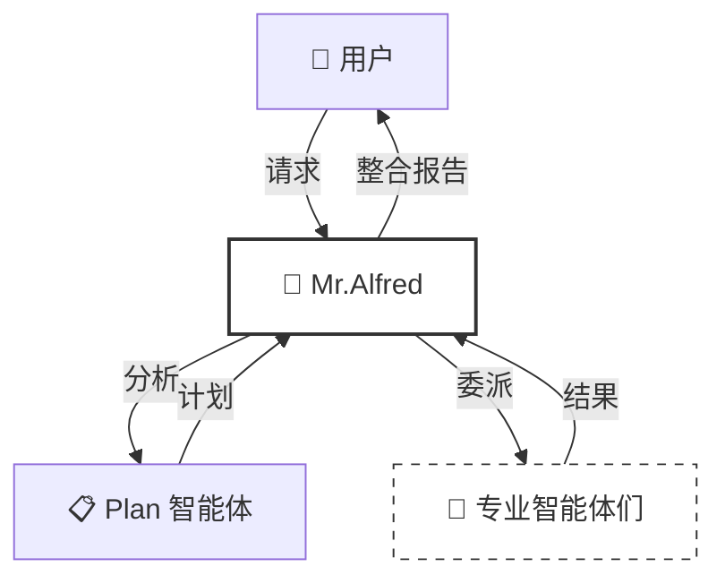
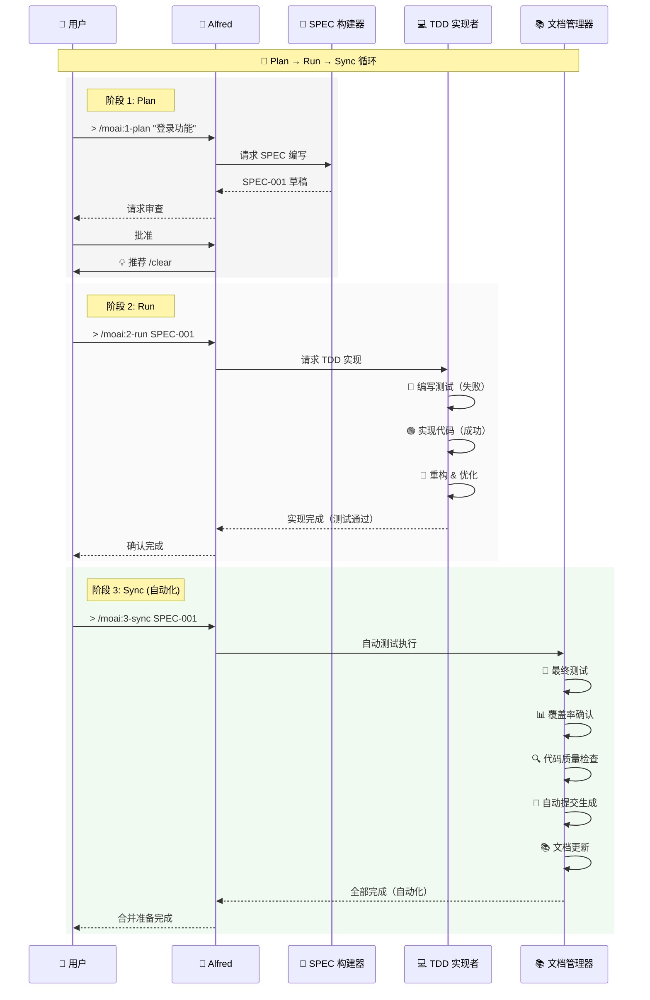
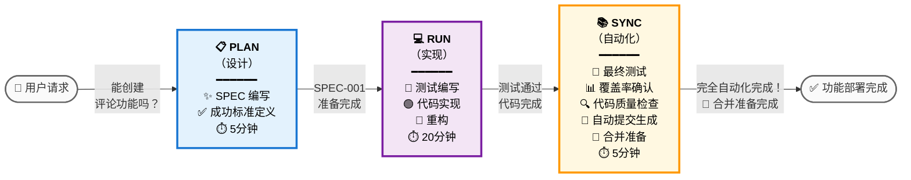
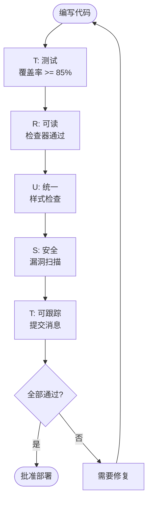
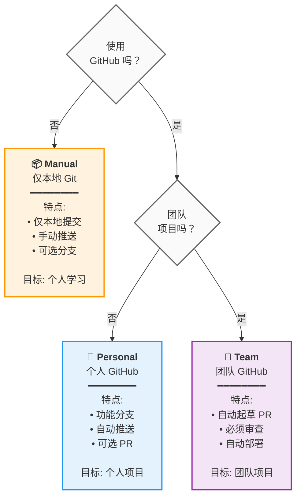

# 🗿 MoAI-ADK: 基于 AI 智能体的 SPEC-First TDD 开发框架


**可用语言:** [🇰🇷 한국어](./README.ko.md) | [🇺🇸 English](./README.md) | [🇯🇵 日本語](./README.ja.md) | [🇨🇳 中文](./README.zh.md)

[](https://pypi.org/project/moai-adk/)
[](https://opensource.org/licenses/MIT)
[](https://www.python.org/)

MoAI-ADK (Agentic Development Kit) 是结合 **SPEC-First 开发**、**测试驱动开发**（TDD）和 **AI 智能体**的开源框架，提供完整且透明的开发生命周期。

---

## 📑 目录（快速导航）

### PART A: 入门（30 分钟）

| 章节                           | 时间    | 目标                     |
| ------------------------------ | ------- | ------------------------ |
| [1. 介绍](#1-介绍)             | 2 分钟  | 理解 MoAI-ADK 是什么     |
| [2. 安装和设置](#2-安装和设置) | 10 分钟 | 配置基础环境             |
| [3. 快速开始](#3-快速开始)     | 5 分钟  | 完成第一个功能           |

### PART B: 核心概念（45 分钟）

| 章节                                      | 时间    | 目标                     |
| ----------------------------------------- | ------- | ------------------------ |
| [4. SPEC 和 EARS 格式](#4-spec和ears格式) | 10 分钟 | 理解规格文档编写         |
| [5. Mr.Alfred 和智能体](#5-mralfred和智能体) | 12 分钟 | 理解智能体系统           |
| [6. 开发工作流](#6-开发工作流)            | 15 分钟 | Plan → Run → Sync        |
| [7. 核心命令](#7-核心命令)                | 8 分钟  | `> /moai:0-3` 命令       |

### PART C: 深度学习（2-3 小时）

| 章节                                         | 目标                     |
| -------------------------------------------- | ------------------------ |
| [8. 智能体指南](#8-智能体指南-24个)              | 专业智能体利用           |
| [9. 技能库](#9-技能库47个)                  | 47 个技能探索            |
| [10. 组合模式和示例](#10-组合模式和示例)     | 实际项目示例             |
| [11. TRUST 5 质量保证](#11-trust-5-质量保证) | 质量保证系统             |
| [12. 高级功能](#12-高级功能)                 | Git Worktree & 增强的日志管理 |

### PART D: 高级和参考（需要时）

| 章节                                                                                       | 目的                     |
| ------------------------------------------------------------------------------------------ | ------------------------ |
| [13. 高级设置](#13-高级设置)                                                              | 项目自定义               |
| [14. FAQ & 快速参考](#14-faq--快速参考)                                                  | 常见问题                 |
| [15. 📸 ai-nano-banana 智能体使用指南](#15---ai-nano-banana-智能体使用指南)                   | 图像生成指南             |
| [16. 附加资源](#16-附加资源)                                                              | 支持和信息               |

---

## 1. 介绍

### 🗿 MoAI-ADK 是什么？

**MoAI-ADK** (Agentic Development Kit) 是基于 AI 智能体驱动的下一代开发框架。它结合 **SPEC-First 开发方法论**、**TDD**（测试驱动开发）和 **24 个专业 AI 智能体**，提供完整且透明的开发生命周期。

### ✨ 为什么选择 MoAI-ADK？


传统开发的局限性：

- ❌ 由于需求不明确而频繁返工
- ❌ 文档与代码不同步
- ❌ 推迟测试导致质量下降
- ❌ 重复的样板代码编写

MoAI-ADK 的解决方案：

- ✅ 从**清晰的 SPEC 文档**开始，消除误解
- ✅ **自动文档同步**始终保持最新状态
- ✅ **TDD 强制**保证 85%+ 测试覆盖率
- ✅ **AI 智能体**自动化重复任务

### 🎯 核心功能


| 功能             | 描述                                        | 定量效果                                                                                                                                                             |
| ---------------- | ------------------------------------------- | -------------------------------------------------------------------------------------------------------------------------------------------------------------------- |
| **SPEC-First**   | 所有开发都从清晰的规格开始                  | 由于需求变更导致的返工**减少 90%**<br/>清晰的 SPEC 消除开发者-规划者之间的误解                                                                                   |
| **TDD 强制**     | 自动 Red-Green-Refactor 循环                | （85%+ 覆盖率）错误**减少 70%**<br/>包括测试编写的总开发时间**减少 15%**                                                                                           |
| **AI 编排**      | Mr.Alfred 指挥 24 个专业 AI 智能体（7-Tier 层级） | 平均令牌节省：每会话 5,000 令牌（条件性自动加载）<br/>**简单任务**：0 令牌（快速参考）<br/>**复杂任务**：8,470 令牌（自动加载技能）<br/>相比手动**60-70% 时间节省** |
| **自动文档**     | 代码更改时自动文档同步（`> /moai:3-sync`）  | **100% 文档新鲜度保证**<br/>消除手动文档编写<br/>最后一次提交以来的自动同步                                                                                      |
| **TRUST 5 质量** | Test, Readable, Unified, Secured, Trackable | 企业级质量保证<br/>部署后紧急补丁**减少 99%**                                                                                                                       |

---

## 2. 安装和设置

### 🎯 基本安装（10 分钟）

#### 步骤 1：安装 uv（1 分钟）

```bash
# macOS / Linux
curl -LsSf https://astral.sh/uv/install.sh | sh

# Windows (PowerShell)
powershell -ExecutionPolicy ByPass -c "irm https://astral.sh/uv/install.ps1 | iex"

# 验证安装
uv --version
```

#### 步骤 2：安装 MoAI-ADK（2 分钟）

```bash
# 安装最新版本
uv tool install moai-adk

# 验证安装
moai-adk --version
```

#### 步骤 3A：初始化新项目（3 分钟）

```bash
# 创建新项目
moai-adk init my-project
cd my-project

# 检查项目结构
ls -la
```

生成的文件结构：

```text
my-project/
├── .claude/              # Claude Code 配置
├── .moai/                # MoAI-ADK 配置
├── src/                  # 源代码
├── tests/                # 测试代码
├── .moai/specs/          # SPEC 文档
├── README.md
└── pyproject.toml
```

---

#### 步骤 3B：设置现有项目（5 分钟）

**对于现有项目，通过 3 个简单步骤集成 MoAI-ADK：**

```bash
# 导航到您的现有项目
cd your-existing-project

# 在当前目录中初始化 MoAI-ADK
moai-adk init .

# 验证 MoAI-ADK 集成
ls -la .claude/ .moai/
```

**添加到您项目的内容：**

```text
your-existing-project/
├── .claude/              # Claude Code 配置（添加）
│   ├── agents/           # MoAI-ADK 智能体
│   ├── commands/         # 自定义命令
│   ├── hooks/             # 自动化工作流
│   └── settings.json     # 项目设置
├── .moai/                # MoAI-ADK 配置（添加）
│   ├── config/           # 项目配置
│   ├── memory/           # 会话内存
│   ├── specs/            # SPEC 文档
│   └── docs/             # 自动生成文档
├── src/                  # 您现有的源代码（未更改）
├── tests/                # 您现有的测试（未更改）
└── README.md             # 您现有的 README（未更改）
```

**重要：** 您的现有文件保持不变。MoAI-ADK 只添加配置文件。

---

#### 步骤 4：运行 Claude Code 和初始化项目元数据

```bash
# 在项目目录中运行 Claude Code
claude

# 在 Claude Code 中，初始化项目元数据
> /moai:0-project
```

**`/moai:0-project` 的作用：**

- ✅ 分析项目结构
- ✅ 检测编程语言和框架
- ✅ 在 `.moai/config/config.json` 中生成项目元数据
- ✅ 设置默认 Git 工作流配置
- ✅ 创建会话内存系统
- ✅ 配置质量保证标准

**预期输出：**

```
✓ 项目分析完成：检测到 Python 项目
✓ 元数据生成完成：.moai/config/config.json
✓ Git 策略：手动模式配置完成
✓ 质量门：85% 测试覆盖率目标
✓ 项目初始化成功
```

项目元数据和环境现在已准备好进行 SPEC-First TDD 开发！

---

## 3. 快速开始

### 🎯 目标：5 分钟完成第一个功能


---

### **步骤 1：规划第一个功能** ⏱️ 2 分钟

在 Claude Code 内：

```
> /moai:1-plan "添加用户登录功能"
```

这个命令将：

- 自动生成 SPEC-001 文档
- 定义需求、约束、成功标准
- 创建测试场景

---

### **步骤 2：初始化上下文** ⏱️ 1 分钟

```
> /clear
```

为了令牌效率，清除之前的上下文。

---

### **步骤 3：实现（Run）** ⏱️ 2 分钟

```
> /moai:2-run SPEC-001
```

这个命令将：

- 首先编写测试（Red）
- 实现代码（Green）
- 重构（Refactor）
- 自动执行 TRUST 5 验证

---

### **步骤 4：文档（Sync）** ⏱️ （可选）

```
> /moai:3-sync SPEC-001
```

自动地：

- 生成 API 文档
- 创建架构图
- 更新 README
- 准备部署

**完成！** 第一个功能已完全实现。🎉

---

### 📁 更多信息

- **高级安装选项**: [13. 高级设置](#13-高级设置)
- **详细命令使用**: [7. 核心命令](#7-核心命令)
- **开发工作流**: [6. 开发工作流](#6-开发工作流)

---

## 4. SPEC 和 EARS 格式

### 📋 SPEC-First 开发


**什么是 SPEC-First？**

所有开发都从**清晰的规格**开始。SPEC 遵循 **EARS（Easy Approach to Requirements Syntax）格式**，包含：

- **需求**: 要构建什么？
- **约束**: 有哪些限制？
- **成功标准**: 何时完成？
- **测试场景**: 如何验证？

### 🎯 EARS 格式示例

```markdown
# SPEC-001: 用户登录功能

## 需求 (Requirements)

- WHEN 用户输入邮箱和密码并点击"登录"按钮时
- IF 凭证有效
- THEN 系统应发放 JWT (JSON Web Token) 并导航到仪表板

## 约束 (Constraints)

- 密码必须至少 8 个字符
- 连续 5 次失败后锁定账户（30 分钟）
- 响应时间必须在 500ms 以内

## 成功标准 (Success Criteria)

- 有效凭证登录成功率 100%
- 对无效凭证显示清晰的错误消息
- 响应时间 < 500ms
- 测试覆盖率 >= 85%

## 测试场景 (Test Cases)

### TC-1: 成功登录

- 输入: email="user@example.com", password="secure123"
- 期待结果: 发放令牌，导航到仪表板

### TC-2: 无效密码

- 输入: email="user@example.com", password="wrong"
- 期待结果: "密码不正确"错误消息

### TC-3: 账户锁定

- 输入: 连续 5 次失败
- 期待结果: "账户已锁定。30 分钟后重试"
```

### 💡 EARS 格式的 5 种类型

| 类型             | 语法           | 示例                               |
| ---------------- | -------------- | ---------------------------------- |
| **Ubiquitous**   | 总是执行       | "系统应始终记录活动"               |
| **Event-driven** | WHEN...THEN    | "当用户登录时，发放令牌"           |
| **State-driven** | IF...THEN      | "如果账户处于活动状态，则允许登录" |
| **Unwanted**     | shall not      | "系统不得以明文形式存储密码"       |
| **Optional**     | where possible | "在可能的情况下提供 OAuth 登录"    |

---

## 5. Mr.Alfred 和智能体

### 🎩 Mr. Alfred - 超级智能体编排者

**Mr. Alfred 是什么？**

Mr. Alfred 是 MoAI-ADK 的**首席编排者**（Orchestrator），分析用户请求，选择合适的专业智能体来委派任务，并整合结果。

**Alfred 的角色：**

1. **理解**: 分析用户请求并澄清模糊性
2. **规划**: 通过 Plan 智能体建立执行计划
3. **执行**: 将任务委派给专业智能体（顺序/并行）
4. **整合**: 收集所有结果并向用户报告



### 🔧 智能体系统（5-Tier 层级）

MoAI-ADK 将**24 个专业智能体**组织成**5 个层级**以提供最佳性能。

**Tier 1: Domain Experts**（领域专家，7个）

- `expert-backend`: 后端架构、API 开发
- `expert-frontend`: 前端、React/Vue 实现
- `expert-database`: 数据库设计、优化
- `expert-security`: 安全分析、漏洞扫描
- `expert-devops`: 部署、基础设施、CI/CD
- `expert-uiux`: UI/UX 设计、组件
- `expert-debug`: 调试、错误分析

**Tier 2: Workflow Managers**（工作流管理，8个）

- `manager-spec`: SPEC 编写（EARS 格式）
- `manager-tdd`: TDD 实现（RED-GREEN-REFACTOR）
- `manager-docs`: 文档自动生成
- `manager-quality`: 质量验证（TRUST 5）
- `manager-strategy`: 执行策略规划
- `manager-project`: 项目初始化
- `manager-git`: Git 工作流
- `manager-claude-code`: Claude Code 集成

**Tier 3: Meta-generators**（元生成器，3个）

- `builder-agent`: 创建新智能体
- `builder-skill`: 创建新技能
- `builder-command`: 创建新命令

**Tier 4: MCP Integrators**（MCP 集成，6个）

- `mcp-context7`: 最新库文档实时查询
- `mcp-sequential-thinking`: 复杂推理分析
- `mcp-playwright`: Web 自动化测试
- `mcp-figma`: Figma 设计系统
- `mcp-notion`: Notion 工作空间管理

**Tier 5: AI Services**（AI 服务，1个）

- `ai-nano-banana`: Gemini 3 图像生成

---

## 6. 开发工作流

### 🔄 Plan-Run-Sync 无限循环

MoAI-ADK 的开发以**3 阶段无限循环**进行：



### 📊 各阶段详细说明

#### 阶段 1: Plan（设计，5-10 分钟）

**目标**: 要构建什么？

```bash
> /moai:1-plan "用户登录功能"
```

在这个阶段：

- ✅ 自动生成 SPEC-001 文档
- ✅ 以 EARS 格式定义需求
- ✅ 明确成功标准
- ✅ 编写测试场景

**产出物**: `.moai/specs/SPEC-001/spec.md`

---

#### 阶段 2: Run（实现，20-40 分钟）

**目标**: 如何构建？

```bash
> /clear
> /moai:2-run SPEC-001
```

在这个阶段：

- 🔴 **RED**: 首先编写失败的测试
- 🟢 **GREEN**: 通过代码让测试通过
- 🔵 **REFACTOR**: 清理和优化代码

**自动验证**:

- 测试覆盖率 >= 85%
- 通过代码检查
- 通过安全检查
- 通过类型检查

**产出物**: 实现完成 + 测试代码 + 85%+ 覆盖率

---

#### 阶段 3: Sync（自动化，5-10 分钟）

**目标**: 完成了吗？（自动化）

```bash
> /clear
> /moai:3-sync SPEC-001
```

这个阶段自动执行：

- 🔴 **最终测试执行**: 所有测试自动运行
- 📊 **覆盖率确认**: 95% 以上覆盖率自动保证
- 🔍 **代码质量检查**: ruff、mypy 自动执行
- 📝 **自动提交生成**: "Ready for merge" 提交自动生成
- 📚 **文档更新**: API 文档、README 自动更新
- 🚀 **合并准备**: Claude Code 自动完成合并准备

**产出物**: 测试通过 + 文档完成 + 合并准备完成

---

### 💡 可视化工作流："博客评论功能"示例



---

## 7. 核心命令

### 🎯 `> /moai:0-project` - 项目初始化

**目的**: 生成项目元数据

**使用时机**: 项目首次启动时

```bash
> /moai:0-project
```

**生成的文件**:

- `.moai/config/config.json`: 项目设置
- `.moai/memory/`: 项目内存
- `.moai/docs/`: 自动生成文档

---

### 📋 `> /moai:1-plan` - SPEC 编写

**目的**: EARS 格式 SPEC 文档生成

**使用时机**: 新功能开发开始前

```bash
> /moai:1-plan "添加登录功能"
```

**示例**:

```bash
> /moai:1-plan "实现用户档案页面"
# → SPEC-002 创建 (.moai/specs/SPEC-002/spec.md)

> /moai:1-plan "开发支付功能 API"
# → SPEC-003 创建
```

**生成的 SPEC 包含**:

- 需求 (Requirements)
- 约束 (Constraints)
- 成功标准 (Success Criteria)
- 测试场景 (Test Cases)

**重要**: 接下来必须执行`> /clear`

```bash
> /moai:1-plan "功能名"
# 完成后
> /clear
```

---

### 💻 `> /moai:2-run` - TDD 实现

**目的**: RED-GREEN-REFACTOR 循环代码实现

**使用时机**: SPEC 编写后实现时

```bash
> /moai:2-run SPEC-001
```

**示例**:

```bash
> /moai:2-run SPEC-001  # 基本实现
```

**自动执行事项**:

- 🔴 测试首先编写
- 🟢 代码通过测试
- 🔵 重构 & 优化
- ✅ TRUST 5 验证（自动）

**验证项**:

- 测试覆盖率 >= 85%
- 代码检查通过
- 类型检查通过
- 安全检查通过

---

### 📚 `> /moai:3-sync` - 文档同步

**目的**: 在文档中反映代码更改

**使用时机**: 实现完成后

```bash
> /moai:3-sync SPEC-001
```

**示例**:

```bash
> /moai:3-sync SPEC-001  # 整体文档
```

**自动生成文档**:

- API 参考
- 架构图
- 部署指南
- README 更新
- CHANGELOG

---

### 🌳 **moai-workflow-worktree** - 并行 SPEC 开发的 Git 工作树管理

#### 为什么选择 moai-workflow-worktree？解决的问题

在现代软件开发中，特别是遵循 SPEC-First TDD 方法论时，开发者经常面临同时处理多个功能的问题。传统 Git 工作流迫使开发者：

- **上下文切换地狱**: 在同一工作空间中不断切换分支，失去上下文并面临未完成工作的风险
- **顺序开发**: 一次只能处理一个 SPEC，降低生产力
- **环境冲突**: 不同的 SPEC 可能需要不同的依赖、数据库状态或配置

**moai-workflow-worktree 解决了这些问题**，为每个 SPEC 提供隔离的工作空间，实现无上下文切换开销的真正并行开发。

#### 核心概念：基于 SPEC 的并行开发

**什么是 Git 工作树？**

Git 工作树是链接到同一 Git 仓库的独立工作目录，允许在不同工作目录中同时检出不同的分支。每个工作树具有：

- 独立的文件系统
- 分离的工作目录状态
- 隔离的构建工件和依赖
- 独立的暂存区和未暂存更改

**moai-workflow-worktree 架构:**

```
主仓库/
├── .git/                    # 共享 Git 仓库
├── src/                     # 主分支文件
└── worktrees/               # 自动创建的工作树
    ├── SPEC-001/
    │   ├── .git             # 工作树特定 git 文件
    │   ├── src/             # SPEC-001 实现
    │   └── tests/           # SPEC-001 测试
    ├── SPEC-002/
    │   ├── .git             # 工作树特定 git 文件
    │   ├── src/             # SPEC-002 实现
    │   └── tests/           # SPEC-002 测试
    └── SPEC-003/
        ├── .git             # 工作树特定 git 文件
        ├── src/             # SPEC-003 实现
        └── tests/           # SPEC-003 测试
```

#### SPEC-First 开发的核心优势

**1. 零上下文切换**

- 每个 SPEC 都有专用工作空间
- SPEC 间切换时绝不会丢失工作上下文
- 保持对特定需求的精神专注

**2. 真正的并行开发**

- SPEC-002 测试运行时处理 SPEC-001 实现
- SPEC-004 文档同步时处理 SPEC-003 调试
- 无需等待其他进程完成

**3. 隔离环境**

- 不同 SPEC 可以使用不同依赖版本
- 分离的数据库状态和配置
- SPEC 间无污染

**4. SPEC 完成跟踪**

- 活动 SPEC 列表的清晰视觉显示
- 轻松识别中断或未完成的 SPEC
- 完成工作的系统清理

#### 高级功能

**智能同步**

```bash
# 所有工作树与最新主分支同步
moai-workflow-worktree sync --all

# 带冲突解决的特定工作树同步
moai-workflow-worktree sync SPEC-001 --auto-resolve
```

**智能清理**

```bash
# 已合并分支工作树自动删除
moai-workflow-worktree clean --merged-only

# 带确认提示的安全清理
moai-workflow-worktree clean --interactive
```

**性能优化**

- **并发操作**: 可以同时修改多个工作树
- **共享历史记录**: 所有工作树共享相同的 Git 对象数据库
- **选择性同步**: 仅同步需要的更改，而不是整个仓库

#### 何时使用 moai-workflow-worktree

**理想场景:**

- **多个活动 SPEC**: 同时处理 3 个或更多 SPEC
- **长期运行任务**: SPEC 实现需要数天或数周
- **团队协作**: 不同开发者处理不同 SPEC
- **功能分支**: 每个 SPEC 成为自己的功能分支
- **环境隔离**: 不同 SPEC 需要不同配置

#### 完整的开发工作流（从开始到合并）

**步骤 1: SPEC 创建和工作树设置**

```bash
# 方法 1: 带自动工作树创建的 SPEC 创建
> /moai:1-plan '实现用户认证系统' --worktree
# → 自动创建 SPEC-AUTH-001 和工作树设置

# 方法 2: 手动工作树创建
> /moai:1-plan '实现用户认证系统'
# SPEC-AUTH-001 创建完成
moai-workflow-worktree new SPEC-AUTH-001
# → 创建隔离的工作树环境
```

**步骤 2: 移动到工作树并开始开发**

```bash
# 移动到工作树（推荐方式）
moai-workflow-worktree go SPEC-AUTH-001
# → cd ~/moai/worktrees/MoAI-ADK/SPEC-AUTH-001

# 或在新 shell 中直接移动
moai-workflow-worktree switch SPEC-AUTH-001
# → 在新终端窗口中移动到工作树
```

**步骤 3: 在隔离环境中开发**

```bash
# 在工作树内进行 TDD 开发
> /moai:2-run SPEC-AUTH-001
# → 执行 RED → GREEN → REFACTOR 循环

# 开发中状态检查
moai-workflow-worktree status
git status
git log --oneline -5

# 中间保存
git add .
git commit -m "Auth: 实现用户登录端点"
```

**步骤 4: 同步和冲突解决**

```bash
# 获取主分支更改
moai-workflow-worktree sync SPEC-AUTH-001

# 带自动冲突解决的同步
moai-workflow-worktree sync SPEC-AUTH-001 --auto-resolve

# 同步所有工作树
moai-workflow-worktree sync --all --auto-resolve
```

**步骤 5: 开发完成和测试（自动化）**

```bash
# MoAI 工作流同步 - 自动执行测试、质量检查、提交
> /moai:3-sync SPEC-AUTH-001
# → 自动执行最终测试、覆盖率确认、代码质量检查、最终提交完成
```

**步骤 6: 主分支合并准备（自动化 + 直接命令）**

**选项 A: Claude Code 自动化（初学者）**

```bash
# Claude Code 自动执行合并准备
# 用户只需要请求：
> 将 SPEC-AUTH-001 准备合并到主分支

# Claude Code 自动执行：
# - 获取工作树分支
# - 本地合并测试
# - 冲突检查和解决建议
# - 合并准备完成报告
```

**选项 B: 直接 Git 命令（高级用户）**

```bash
# 1. 从工作树移动到主分支
moai-workflow-worktree go SPEC-AUTH-001  # 或 cd /path/to/main/repo

# 2. 获取工作树分支
git fetch origin feature/SPEC-AUTH-001
git checkout -b merge/SPEC-AUTH-001 origin/feature/SPEC-AUTH-001

# 3. 本地合并测试
git merge main --no-ff  # 从主分支合并更改

# 4. 如有冲突手动解决
git status  # 检查冲突文件
# 冲突文件编辑后：
git add .
git commit -m "解决：SPEC-AUTH-001 中的合并冲突"

# 5. 确认合并准备完成
git log --oneline -5
git status  # 确认干净的工作目录
```

**冲突解决直接命令集合:**

```bash
# 冲突时的策略方法
git checkout --ours conflicted_file.py    # 优先主分支
git checkout --theirs conflicted_file.py  # 优先工作树更改

# 取消合并并重试
git merge --abort
git merge main --no-ff

# 更改整个合并策略
git rebase main  # 使用 rebase 代替
```

**步骤 7: 完成和清理（自动化 + 直接命令）**

**选项 A: Claude Code 自动化（初学者）**

```bash
# 工作树清理（请求 Claude Code 自动处理）
> 清理 SPEC-AUTH-001 工作树

# README.ko.md 更新（Claude Code 自动处理）
> 将完成的 SPEC-AUTH-001 功能添加到 README.ko.md

# Claude Code 自动执行：
# - 工作树状态检查
# - 完成的功能文档化
# - README 更新
# - 清理完成报告
```

**选项 B: 直接 moai-workflow-worktree 命令（高级用户）**

```bash
# 1. 工作树状态最终确认
moai-workflow-worktree status
# 输出示例：
# SPEC-AUTH-001
#   Branch: feature/SPEC-AUTH-001
#   Status: completed
#   Path:   ~/moai/worktrees/MoAI-ADK/SPEC-AUTH-001

# 2. 工作树清理（安全方式）
moai-workflow-worktree clean --merged-only
# → 仅自动删除已合并分支的工作树

# 3. 或交互式清理（选择性删除）
moai-workflow-worktree clean --interactive
# → 可选择要删除的工作树

# 4. 直接删除特定工作树（强制）
moai-workflow-worktree remove SPEC-AUTH-001 --force

# 5. 整体工作树状态检查
moai-workflow-worktree list
# 或
moai-workflow-worktree status
```

**实用的工作树管理命令集合:**

```bash
# 日常工作树管理
moai-workflow-worktree list                    # 所有工作树列表
moai-workflow-worktree status                  # 详细状态检查
moai-workflow-worktree sync SPEC-AUTH-001      # 特定工作树同步
moai-workflow-worktree sync --all              # 同步所有工作树

# 工作树移动和操作
moai-workflow-worktree go SPEC-001     # 在当前 shell 中移动
moai-workflow-worktree switch SPEC-001         # 在新 shell 中打开工作树

# 自动冲突解决
moai-workflow-worktree sync SPEC-AUTH-001 --auto-resolve

# 设置检查
moai-workflow-worktree config get              # 查看当前设置
moai-workflow-worktree config root             # 检查工作树根路径
```

**混合工作流推荐模式:**

```bash
# 步骤 1-5: Claude Code 自动化（快速开发）
> /moai:1-plan "功能名"
> /moai:2-run SPEC-XXX
> /moai:3-sync SPEC-XXX

# 步骤 6-7: 直接命令（精确控制）
moai-workflow-worktree sync SPEC-XXX --auto-resolve  # 自动冲突解决
moai-workflow-worktree clean --merged-only           # 清理完成的工作树
```

---

### 🔧 直接命令参考（Manual Command Reference）

本节详细介绍可与 Claude Code 自动化一起使用的直接命令。

#### **基本 moai-workflow-worktree 命令**

| 命令                 | 目的                    | 使用示例                      | 描述                               |
| ---------------------- | ----------------------- | ----------------------------- | ---------------------------------- |
| `moai-workflow-worktree new`    | 创建新工作树            | `moai-workflow-worktree new SPEC-001`   | 为 SPEC-001 创建隔离的工作空间     |
| `moai-workflow-worktree list`   | 工作树列表              | `moai-workflow-worktree list`           | 显示所有活动工作树                 |
| `moai-workflow-worktree go`     | 移动到工作树            | `moai-workflow-worktree go SPEC-001`    | 在当前 shell 中移动到工作树        |
| `moai-workflow-worktree switch` | 在新 shell 中打开工作树 | `moai-workflow-worktree switch SPEC-001` | 在新终端中移动到工作树             |
| `moai-workflow-worktree remove` | 删除工作树              | `moai-workflow-worktree remove SPEC-001` | 删除特定工作树                     |
| `moai-workflow-worktree status` | 状态检查                | `moai-workflow-worktree status`         | 显示所有工作树状态                 |

#### **同步命令**

| 命令                              | 目的                 | 使用示例                                | 描述                          |
| --------------------------------- | -------------------- | --------------------------------------- | ----------------------------- |
| `moai-workflow-worktree sync`                | 特定工作树同步       | `moai-workflow-worktree sync SPEC-001`           | 与主分支同步更改             |
| `moai-workflow-worktree sync --all`          | 同步所有工作树       | `moai-workflow-worktree sync --all`              | 一次性同步所有工作树         |
| `moai-workflow-worktree sync --auto-resolve` | 自动冲突解决         | `moai-workflow-worktree sync SPEC-001 --auto-resolve` | 冲突时尝试自动解决           |
| `moai-workflow-worktree sync --rebase`       | 基于 Rebase 的同步   | `moai-workflow-worktree sync SPEC-001 --rebase`       | 使用 rebase 代替合并         |

#### **清理命令**

| 命令                              | 目的                   | 使用示例                        | 描述                            |
| --------------------------------- | ---------------------- | ------------------------------- | ------------------------------- |
| `moai-workflow-worktree clean`               | 工作树清理             | `moai-workflow-worktree clean`            | 清理所有工作树                 |
| `moai-workflow-worktree clean --merged-only` | 清理已合并的工作树     | `moai-workflow-worktree clean --merged-only` | 仅删除已合并分支的工作树       |
| `moai-workflow-worktree clean --interactive` | 交互式清理             | `moai-workflow-worktree clean --interactive` | 可选择要删除的工作树           |

#### **设置命令**

| 命令                      | 目的           | 使用示例               | 描述                     |
| --------------------------- | -------------- | ----------------------- | ------------------------ |
| `moai-workflow-worktree config`      | 查看设置       | `moai-workflow-worktree config`  | 显示当前工作树设置        |
| `moai-workflow-worktree config root` | 检查根路径    | `moai-workflow-worktree config root` | 检查工作树根目录路径     |

#### **高级使用模式**

**1. 多 SPEC 并行开发**

```bash
# 同时创建多个 SPEC
moai-workflow-worktree new SPEC-AUTH-001    # 用户认证
moai-workflow-worktree new SPEC-PAY-002     # 支付系统
moai-workflow-worktree new SPEC-UI-003      # UI 改进

# 检查每个工作树状态
moai-workflow-worktree status

# 同步所有工作树
moai-workflow-worktree sync --all --auto-resolve
```

**2. 自动冲突解决工作流**

```bash
# 步骤 1: 尝试自动同步
moai-workflow-worktree sync SPEC-001 --auto-resolve

# 步骤 2: 自动解决失败时手动介入
moai-workflow-worktree go SPEC-001
git status  # 检查冲突文件

# 步骤 3: 选择冲突解决策略
git checkout --ours conflicted_file.py    # 优先主分支
# 或
git checkout --theirs conflicted_file.py  # 优先工作树更改

# 步骤 4: 解决完成后提交
git add conflicted_file.py
git commit -m "解决：SPEC-001 中的自动冲突"
```

**3. 定期工作树维护**

```bash
# 推荐每天早上执行
moai-workflow-worktree status                      # 当前状态检查
moai-workflow-worktree sync --all                  # 同步所有工作树

# 推荐每周执行
moai-workflow-worktree clean --merged-only         # 清理完成的工作树

# 推荐每月执行
moai-workflow-worktree clean --interactive         # 交互式清理删除不必要的工作树
```

#### **Claude Code 与命令组合指南**

**初学者用户:**

```bash
# 步骤 1-3: Claude Code 自动化快速开始
/moai:1-plan "用户登录功能"
/moai:2-run SPEC-001
/moai:3-sync SPEC-001

# 步骤 4-5: 直接命令基本管理
moai-workflow-worktree status                      # 状态检查
moai-workflow-worktree sync SPEC-001               # 同步
moai-workflow-worktree clean --merged-only         # 清理
```

**中级用户:**

```bash
# 步骤 1-2: Claude Code 自动化
> /moai:1-plan "支付系统开发"
> /moai:2-run SPEC-PAY-001

# 步骤 3: 直接命令精确控制
moai-workflow-worktree go SPEC-PAY-001
# 直接开发和测试
git add .
git commit -m "Pay: 实现核心支付处理"

# 步骤 4-5: 混合方式
> /moai:3-sync SPEC-PAY-001                 # 自动化质量验证
moai-workflow-worktree sync SPEC-PAY-001 --auto-resolve  # 直接同步
```

**高级用户:**

```bash
# 整个过程直接命令控制
moai-workflow-worktree new SPEC-ADV-001
moai-workflow-worktree go SPEC-ADV-001
# 完全手动开发过程
git add .
git commit -m "Adv: 复杂功能实现"
moai-workflow-worktree sync SPEC-ADV-001 --rebase
moai-workflow-worktree clean --interactive
```

**生产力提示:**

1. **别名设置** (在 ~/.zshrc 或 ~/.bashrc 中添加):

```bash
alias wt-new='moai-workflow-worktree new'
alias wt-go='moai-workflow-worktree go'
alias wt-list='moai-workflow-worktree list'
alias wt-status='moai-workflow-worktree status'
alias wt-sync='moai-workflow-worktree sync'
alias wt-clean='moai-workflow-worktree clean'
```

2. **快速工作流函数**:

```bash
# 工作树快速创建和移动
wt-dev() {
    moai-workflow-worktree new "SPEC-$1"
    moai-workflow-worktree go "SPEC-$1"
}

# 使用法: wt-dev AUTH-001
```

---

### 🎯 **自动化与直接控制的完美结合**

MoAI-ADK 设计为能够同时利用 **Claude Code 自动化**和**直接命令控制**的优势。

#### **何时使用什么？**

| 情况                 | 推荐方法          | 原因                         |
| -------------------- | ----------------- | ---------------------------- |
| **新功能开始**       | Claude Code 自动化 | 快速 SPEC 生成和初始配置     |
| **复杂算法**         | 直接控制          | 需要分步调试和优化           |
| **日常同步**         | 直接命令          | 快速执行和精确控制           |
| **质量验证**         | Claude Code 自动化 | 自动化测试和验证             |
| **冲突解决**         | 混合方式          | 自动检测 + 手动解决          |
| **清理和维护**       | 直接命令          | 选择性控制和安全清理         |

#### **推荐的组合工作流**

##### 初学者：自动化中心（70% 自动化 + 30% 直接控制）

```bash
# 步骤 1: 自动化快速开始
> /moai:1-plan "功能开发"
> /moai:2-run SPEC-001

# 步骤 2: 直接命令基本管理
moai-workflow-worktree status
moai-workflow-worktree sync SPEC-001
moai-workflow-worktree clean --merged-only

# 步骤 3: 自动化完成
> /moai:3-sync SPEC-001
```

##### 中级：平衡方法（50% 自动化 + 50% 直接控制）

```bash
# 步骤 1: 自动化规划
> /moai:1-plan "复杂功能"

# 步骤 2: 直接控制详细实现
moai-workflow-worktree new SPEC-001
moai-workflow-worktree go SPEC-001
# 详细开发工作

# 步骤 3: 自动化质量保证
> /moai:3-sync SPEC-001
```

##### 高级：直接控制中心（30% 自动化 + 70% 直接控制）

```bash
# 整个过程直接控制，需要时利用自动化
moai-workflow-worktree new SPEC-001
moai-workflow-worktree go SPEC-001
# 完全手动开发
# 必要时用 > /moai:3-sync 质量验证
```

#### 合并冲突解决策略

##### 1. 自动解决（推荐）

```bash
# 尝试所有策略的自动解决
moai-workflow-worktree sync SPEC-AUTH-001 --auto-resolve
```

##### 2. 手动解决

```bash
# 移动到工作树
moai-workflow-worktree go SPEC-AUTH-001

# 检查冲突状态
git status

# 编辑冲突文件
# <<<<<<< HEAD
# 主分支内容
# =======
# 工作树分支内容
# >>>>>>> feature/SPEC-AUTH-001

# 解决后标记
git add conflict_file.py
git commit -m "解决：认证系统中的合并冲突"
```

##### 3. 策略性方法

```bash
# 冲突时优先主分支
git checkout --ours conflict_file.py
git add conflict_file.py
git commit

# 或优先工作树更改
git checkout --theirs conflict_file.py
git add conflict_file.py
git commit
```

#### 完成检查清单

##### 开发完成前

- [ ] 所有测试通过（>= 95% 覆盖率）
- [ ] 代码质量检查通过（ruff, mypy）
- [ ] 安全审查完成
- [ ] 文档更新
- [ ] 本地合并测试

##### 合并完成后

- [ ] 推送到远程仓库
- [ ] 创建并获得 Pull Request 批准
- [ ] 合并到主分支
- [ ] 工作树清理完成
- [ ] 执行 > /moai:3-sync
- [ ] 部署测试

#### 并行开发提示

##### 多个 SPEC 同时工作

```bash
# 移动到第一个 SPEC 并工作
moai-workflow-worktree go SPEC-AUTH-001
> /moai:2-run SPEC-AUTH-001

# 在另一个终端中移动到第二个 SPEC
moai-workflow-worktree go SPEC-PAY-002
> /moai:2-run SPEC-PAY-002

# 在第三个 SPEC 中工作
moai-workflow-worktree go SPEC-UI-003
> /moai:2-run SPEC-UI-003

# 定期同步所有工作树
moai-workflow-worktree sync --all --auto-resolve
```

##### 无上下文切换工作

- 每个工作树是完全隔离的环境
- 独立的 Git 状态
- 允许不同的依赖版本
- 可同时开发多个功能

##### 实际示例工作流

```bash
# 早上：开始新的 SPEC
moai-workflow-worktree new SPEC-005 "用户档案改进"
moai-workflow-worktree go SPEC-005

# 其他 SPEC 完成时实现 SPEC-005
> /moai:2-run SPEC-005

# 下午：检查所有 SPEC 状态
moai-workflow-worktree status
# 输出:
# ✓ SPEC-001: 完成（合并准备）
# ✓ SPEC-002: 测试进行中
# ⏳ SPEC-003: 实现阶段
# 🔄 SPEC-005: 活动开发

# 晚上：清理完成的 SPEC
moai-workflow-worktree clean --merged-only
```

#### 技术优势

##### 内存效率：共享 Git 对象数据库意味着与多个完整仓库相比，具有最小的内存开销

##### 磁盘空间优化：工作树共享仓库历史记录，仅使用工作文件的额外空间

##### 原子操作：每个工作树操作都是原子的，防止仓库损坏

##### Git 原生：使用标准 Git 工作树功能，保证与所有 Git 工具的兼容性

#### 与 MoAI-ADK 工作流集成

moai-workflow-worktree 与 MoAI-ADK Plan-Run-Sync 循环无缝集成：

1. **Plan 阶段**: `moai-workflow-worktree new SPEC-XXX` 创建专用工作空间
2. **Run 阶段**: 在隔离环境中工作，不影响其他 SPEC
3. **Sync 阶段**: `moai-workflow-worktree sync SPEC-XXX` 确保干净的集成
4. **Cleanup 阶段**: `moai-workflow-worktree clean` 删除完成的工作树

这种集成在保持 SPEC-First TDD 方法论原则的同时，为管理多个 SPEC 提供了完整且系统化的方法。

##### 重要注意：从 Git 中排除的本地文件(.CLAUDE.local.md, .env, .claude/settings.local.json 等)不会在工作树之间自动同步。为确保一致的开发环境配置，这些文件必须在创建工作树后手动复制到各个目录中。

##### 命令概述

```bash
# 可用命令列表
moai-workflow-worktree --help

# 为 SPEC 开发创建新工作树
moai-workflow-worktree new SPEC-001

# 所有活动工作树列表
moai-workflow-worktree list

# 移动到特定工作树
moai-workflow-worktree go SPEC-001

# 切换到工作树（打开新 shell）
moai-workflow-worktree switch SPEC-001

# 将工作树与基础分支同步
moai-workflow-worktree sync SPEC-001

# 删除特定工作树
moai-workflow-worktree remove SPEC-001

# 清理已合并分支的工作树
moai-workflow-worktree clean

# 显示工作树状态和配置
moai-workflow-worktree status

# 工作树配置
moai-workflow-worktree config get
moai-workflow-worktree config set <key> <value>
```

---

## 8. 智能体指南（25个）

### 🎯 智能体选择指南

每个智能体都具有特定的领域专业知识。为任务选择合适的智能体。

### Tier 1: Domain Experts (领域专家)

#### expert-backend (后端开发)

**专业知识**: FastAPI、Django、Node.js 后端开发
**使用场景**:

- RESTful API 设计和实现
- 数据库查询优化
- 身份验证和授权管理
- 服务器性能优化

```bash
> @agent-expert-backend "使用 FastAPI 开发用户认证 API"
```

---

#### expert-frontend (前端开发)

**专业知识**: React、Vue、Next.js 前端
**使用场景**:

- UI 组件实现
- 状态管理 (Redux, Zustand)
- API 集成
- 响应式设计

```bash
> @agent-expert-frontend "使用 React 实现仪表板 UI"
```

---

#### expert-database (数据库)

**专业知识**: SQL、NoSQL、ORM、优化
**使用场景**:

- 数据库架构设计
- 查询优化
- 迁移
- 性能调优

```bash
> @agent-expert-database "优化大型 PostgreSQL 表"
```

---

#### expert-security (安全)

**专业知识**: 安全分析、漏洞扫描、OWASP
**使用场景**:

- 安全代码审查
- 漏洞分析
- OWASP Top 10 验证
- 数据加密

```bash
> @agent-expert-security "登录功能安全审计"
```

---

#### expert-devops (DevOps)

**专业知识**: Docker、Kubernetes、CI/CD、部署
**使用场景**:

- Docker 镜像优化
- Kubernetes 配置
- GitHub Actions CI/CD
- 基础设施自动化

```bash
> @agent-expert-devops "为 Next.js 应用设置 Docker 部署"
```

---

#### expert-uiux (UI/UX 设计)

**专业知识**: 设计系统、组件、可访问性
**使用场景**:

- UI 组件库设计
- 设计系统构建
- 可访问性(A11y)验证
- 用户体验优化

```bash
> @agent-expert-uiux "基于 shadcn/ui 构建设计系统"
```

---

#### expert-debug (调试)

**专业知识**: 问题分析、错误跟踪、性能分析
**使用场景**:

- 错误分析
- 性能瓶颈分析
- 日志分析
- 内存泄漏检测

```bash
> @agent-expert-debug "分析 API 响应时间缓慢的原因"
```

---

### Tier 2: Workflow Managers (工作流管理)

#### manager-spec (SPEC 编写)

**目的**: EARS 格式 SPEC 文档生成
**自动调用**: `> /moai:1-plan` 执行时

```bash
> @agent-manager-spec "为用户档案 API 编写 SPEC"
```

---

#### manager-tdd (TDD 实现)

**目的**: RED-GREEN-REFACTOR 自动执行
**自动调用**: `> /moai:2-run` 执行时

```bash
> @agent-manager-tdd "实现 SPEC-001"
```

---

#### manager-docs (文档自动生成)

**目的**: API 文档、图表、指南自动生成
**自动调用**: `> /moai:3-sync` 执行时

```bash
> @agent-manager-docs "生成登录功能文档"
```

---

#### manager-quality (质量验证)

**目的**: TRUST 5 验证 (Test, Readable, Unified, Secured, Trackable)
**自动调用**: `> /moai:2-run` 完成后

```bash
> @agent-manager-quality "验证代码质量"
```

---

#### manager-strategy (策略规划)

**目的**: 复杂实现策略规划
**使用场景**:

- 微服务架构设计
- 迁移规划
- 性能优化策略

```bash
> @agent-manager-strategy "规划从单体到微服务的迁移"
# 或使用内置智能体
> @agent-Plan "规划从单体到微服务的迁移"
```

---

### Tier 3: Meta-generators (元生成器, 4个)

#### builder-agent

**目的**: 创建新智能体
**使用场景**: 创建组织特定智能体

```bash
> @agent-builder-agent "创建数据分析专业智能体"
```

---

#### builder-skill

**目的**: 创建新技能
**使用场景**: 开发团队特定技能

```bash
> @agent-builder-skill "编写 GraphQL API 开发技能模块"
```

---

#### builder-command

**目的**: 创建新命令
**使用场景**: 自定义工作流自动化

```bash
> @agent-builder-command "创建 > /moai:deploy 命令 (自动部署工作流)"
```

---

#### builder-plugin

**目的**: 创建和管理 Claude Code 插件
**使用场景**: 插件创建、验证、迁移

```bash
> @agent-builder-plugin "创建包含 commands、agents、hooks 的 security-tools 插件"
```

---

### Tier 4: MCP Integrators (MCP 集成)

#### mcp-context7 (文档查询)

**目的**: 最新库文档实时查询
**使用场景**:

- 检查 React 最新 API
- 参考 FastAPI 文档
- 验证库兼容性

```bash
> @agent-mcp-context7 "查询 React 19 的最新 Hooks API"
```

---

#### mcp-sequential-thinking (高级推理)

**目的**: 复杂问题多阶段分析
**自动激活**: 复杂度 > 中等时
**使用场景**:

- 架构设计
- 算法优化
- SPEC 分析

```bash
> @agent-mcp-sequential-thinking "分析微服务架构设计"
```

---

#### mcp-playwright (Web 自动化)

**目的**: E2E 测试、Web 自动化
**使用场景**:

- E2E 测试编写
- 视觉回归测试
- 跨浏览器验证

```bash
> @agent-mcp-playwright "编写登录功能的 E2E 测试"
```

---

### Tier 5: AI Services

#### ai-nano-banana (图像生成)

**目的**: 使用 Gemini 3 生成高质量图像
**使用场景**:

- UI/UX 模型生成
- 技术图表创建
- 营销材料
- 徽标/图标生成

更多详情请参见 [15. 📸 ai-nano-banana 智能体使用指南](#15---ai-nano-banana-智能体使用指南)

---

## 9. 技能库（47个）


MoAI-ADK 在 7 个类别中提供 **47 个专业技能**。每个技能可以独立或组合使用。

### 🏗️ Foundation（基础）

定义核心哲学和执行规则的基础技能。

- **moai-foundation-core**
  - TRUST 5、SPEC-First TDD、智能体委派模式、令牌优化
  - 为所有 AI 驱动开发工作流提供执行规则

- **moai-foundation-context**
  - 具有令牌预算优化和状态持久化的企业级上下文管理
  - 会话内存系统和高效令牌利用策略

- **moai-foundation-claude**
  - 符合 Claude Code 官方文档的技能编写套件
  - 智能体、子智能体模板、斜杠命令、钩子、内存、IAM 规则

- **moai-foundation-quality**
  - TRUST 5 验证、主动分析、自动化最佳实践执行
  - 企业级代码质量保证系统

- **moai-plugin-builder**
  - Claude Code 插件开发模式、模板、最佳实践
  - 插件结构、组件生成、验证、迁移指南

### 🎯 Domain（领域专业）

为特定技术领域提供深度专业知识。

- **moai-domain-backend**
  - 框架无关的后端设计，13+ 框架专业知识
  - API 设计、数据库集成、微服务架构

- **moai-domain-frontend**
  - 包括 React 19、Next.js 16、Vue 3.5 的现代 UI/UX 模式
  - 组件架构、状态管理、响应式设计

- **moai-domain-database**
  - 包括 PostgreSQL、MongoDB、Redis 的数据库专业知识
  - 查询性能优化、数据建模、数据库策略

- **moai-domain-uiux**
  - 企业设计系统、组件架构、可访问性
  - WCAG 合规、设计令牌、图标、主题系统

### 💻 Language（语言）

支持各种编程语言和框架。

- **moai-lang-python** - Python 3.13+ 用于 FastAPI、Django、async 模式、数据科学
- **moai-lang-typescript** - React 19、Next.js 16 App Router、tRPC 类型安全 API、Zod 验证
- **moai-lang-go** - Fiber、Gin、GORM 高性能微服务
- **moai-lang-rust** - Axum、Tokio、SQLx 内存安全系统编程
- **moai-lang-java** - Spring Boot 3.3、虚拟线程、Java 21 LTS 企业模式
- **moai-lang-csharp** - C# 12/.NET 8 用于 ASP.NET Core、Entity Framework、Blazor
- **moai-lang-swift** - iOS/macOS 开发用 SwiftUI、Combine、Swift 6 并发
- **moai-lang-kotlin** - Kotlin 2.0 用于 Ktor、协程、Compose Multiplatform
- **moai-lang-ruby** - Ruby 3.3+ 用于 Ruby on Rails 8、ActiveRecord、Hotwire/Turbo
- **moai-lang-php** - PHP 8.3+ 用于 Laravel 11、Symfony 7、Eloquent ORM
- **moai-lang-elixir** - Elixir 1.17+ 开发用 Phoenix 1.7、LiveView、Ecto
- **moai-lang-scala** - Scala 3.4+ 用于 Akka、Cats Effect、ZIO、Spark
- **moai-lang-cpp** - C++23/20 用 RAII、智能指针、概念、模块
- **moai-lang-flutter** - Flutter 3.24+/Dart 3.5+ 开发用 Riverpod、go_router
- **moai-lang-r** - R 4.4+ 数据分析用 tidyverse、ggplot2、Shiny

### 🚀 Platform（平台）

支持主要云平台和 BaaS 服务集成。

- **moai-platform-supabase** - PostgreSQL 16、pgvector、RLS、实时订阅
- **moai-platform-auth0** - SSO、SAML、OIDC、组织、B2B 多租户、攻击防护、MFA、令牌安全、DPoP/mTLS、FAPI/GDPR
- **moai-platform-clerk** - WebAuthn、密钥、无密码认证
- **moai-platform-neon** - 自动扩展、数据库分支、PITR
- **moai-platform-firebase-auth** - 社交认证、电话认证、匿名登录
- **moai-platform-firestore** - NoSQL 数据建模、实时同步、离线支持
- **moai-platform-vercel** - Edge Functions、Next.js 优化、ISR
- **moai-platform-railway** - Docker、多服务架构、持久卷
- **moai-platform-convex** - TypeScript 优先响应式模式、乐观更新

### 📋 Workflow（工作流）

自动化和优化开发流程的工作流技能。

- **moai-workflow-spec** - EARS 格式、需求澄清、Plan-Run-Sync 集成
- **moai-workflow-testing** - TDD、调试、性能优化、代码审查集成
- **moai-workflow-project** - 项目管理、文档化、语言初始化模块
- **moai-workflow-templates** - 代码样板、反馈模板
- **moai-workflow-jit-docs** - 用户意图基础智能文档搜索和缓存
- **moai-workflow-docs** - Nextra 文档系统、技术写作、API 文档
- **moai-workflow-worktree** - 并行 SPEC 开发的 Git worktree 管理

### 📚 Library（库）

特定库和框架的专业技能。

- **moai-library-shadcn** - shadcn/ui、Radix、Tailwind CSS 专业实现指南
- **moai-library-mermaid** - 使用 MCP Playwright 的企业 Mermaid 图表
- **moai-library-nextra** - 基于 Next.js 的企业文档框架
- **moai-formats-data** - TOON 编码、JSON/YAML 优化、数据验证

### 🤖 AI 集成

AI 服务集成的专业技能。

- **moai-ai-nano-banana** - 使用 Gemini 3 Nano Banana Pro 的图像生成

### 🎯 技能使用指南

#### 技能调用方法

```python
# 方法 1: 直接调用 (开发者)
Skill("moai-lang-python")

# 方法 2: Alfred 自动选择 (普通用户)
"用 Python 创建 FastAPI 服务器"
→ Alfred 自动选择 moai-lang-python + moai-platform-supabase
```

#### 技能组合模式

**后端 API**: `moai-foundation-core` + `moai-lang-python` + `moai-platform-supabase`

**前端 UI**: `moai-domain-uiux` + `moai-lang-typescript` + `moai-library-shadcn`

**文档化**: `moai-library-nextra` + `moai-workflow-docs` + `moai-library-mermaid`

**测试**: `moai-lang-python` + `moai-workflow-testing` + `moai-foundation-quality`

**数据分析**: `moai-lang-r` + `moai-domain-database` + `moai-formats-data`

---

## 10. 组合模式和示例

### 🎭 智能体组合模式

MoAI-ADK 的 24 个智能体根据任务类型以最佳组合执行。

### 模式 1: 新功能开发

```text
manager-spec (SPEC 生成)
  ↓
manager-strategy (执行计划)
  ↓
manager-tdd (TDD 实现)
  ↓
manager-docs (文档同步)
```

**示例**:

```bash
> /moai:1-plan "用户登录功能"   # manager-spec
> /clear
> /moai:2-run SPEC-001               # manager-strategy → manager-tdd
> /clear
> /moai:3-sync SPEC-001              # manager-docs
```

---

### 模式 2: 性能优化

```text
expert-debug (问题分析)
  ↓
mcp-sequential-thinking (复杂度分析)
  ↓
expert-backend (优化实现)
  ↓
manager-quality (验证)
```

**示例**:

```bash
> @agent-expert-debug "分析 API 响应缓慢"
# → 发现瓶颈 (DB 查询 N+1 问题)

> @agent-mcp-sequential-thinking "规划 N+1 问题优化策略"
# → 建议 ORM 查询优化策略

> @agent-expert-backend "实现 ORM 查询优化"
# → 应用 select_related(), prefetch_related()

> @agent-manager-quality "性能测试和验证"
# → 响应时间 500ms → 50ms (90% 改进)
```

---

### 模式 3: UI/UX 开发

```text
expert-uiux (设计系统)
  ↓
expert-frontend (组件实现)
  ↓
mcp-playwright (E2E 测试)
```

**示例**:

```bash
> @agent-expert-uiux "基于 shadcn/ui 的登录页面设计"
# → Button, Input, Card 组件组合

> @agent-expert-frontend "实现 React 登录表单"
# → 使用 shadcn/ui 组件的实现

> @agent-mcp-playwright "登录场景的 E2E 测试"
# → 成功/失败案例的自动测试
```

---

### 模式 4: 安全审计

```text
expert-security (漏洞扫描)
  ↓
expert-backend (安全补丁)
  ↓
manager-quality (重新验证)
```

---

### 模式 5: 微服务架构设计

```bash
> @agent-mcp-sequential-thinking "规划从单体到微服务的迁移策略"
# → 服务分解策略、API 网关设计

> @agent-expert-backend "开发用户服务和订单服务"
# → 服务特定 API 实现

> @agent-expert-devops "Kubernetes 部署配置"
# → 自动生成 Docker、K8s 清单

> @agent-manager-docs "服务示例文档"
# → 服务映射、API 文档、部署指南
```

---

## 11. TRUST 5 质量保证


所有 MoAI-ADK 项目都遵循 **TRUST 5** 质量框架。TRUST 5 由 5 个核心原则组成：Test-First、Readable、Unified、Secured、Trackable，确保企业级软件质量。

### T - Test-First (测试优先)

**原则**: 所有实现都从测试开始。

**验证**:

- 测试覆盖率 >= 85%
- 首先编写失败的测试 (Red)
- 通过代码实现 (Green)
- 重构

**自动化**: `manager-tdd` 智能体自动执行 TDD 循环

---

### R - Readable (可读)

**原则**: 代码必须清晰且易于理解。

**验证**:

- 清晰的变量名 (最小化缩写)
- 代码注释 (复杂逻辑)
- 通过代码审查
- 通过代码检查

**自动化**: `quality-expert` 智能体应用样式指南

---

### U - Unified (统一)

**原则**: 在整个项目中保持一致的样式。

**验证**:

- 遵循项目样式指南
- 一致的命名约定
- 统一的错误处理
- 标准化的文档格式

**自动化**: `quality-expert` 智能体验证一致性

---

### S - Secured (安全)

**原则**: 所有代码都必须通过安全验证。

**验证**:

- OWASP Top 10 检查
- 依赖漏洞扫描
- 加密策略合规
- 访问控制验证

**自动化**: `expert-security` 智能体执行自动安全审计

---

### T - Trackable (可跟踪)

**原则**: 所有更改都必须清晰可跟踪。

**验证**:

- 清晰的提交消息
- 问题跟踪 (GitHub Issues)
- 维护 CHANGELOG
- 代码审查记录

**自动化**: Git 和 GitHub Actions 自动化

---

### 🎯 TRUST 5 验证流程



---

## 12. 高级功能

### 🌳 Git Worktree CLI (并行开发)

**概述**: 管理多个 Git 工作树，实现并行 SPEC 开发而无需上下文切换。

#### 快速开始

```bash
# 为 SPEC 创建新工作树
moai worktree create SPEC-001 feature/user-auth

# 所有工作树列表
moai worktree list

# 工作树间切换
moai worktree switch SPEC-001

# 删除已完成的工作树
moai worktree remove SPEC-001
```

#### 核心优势

- **并行开发**: 同时处理多个 SPEC
- **上下文隔离**: 每个工作树都有自己的 git 状态
- **快速切换**: 功能之间的即时上下文更改
- **保持主分支稳定**: 始终保持主分支稳定

#### 工作流示例

```bash
# 主开发工作树 (主分支)
cd ~/project-main
> /moai:1-plan "用户认证"  # 创建 SPEC-001

# 为 SPEC-001 创建并行工作树
moai worktree create SPEC-001 feature/auth
cd ~/project-worktrees/SPEC-001

# 在不影响主分支的情况下处理认证
> /moai:2-run SPEC-001
# ... 实现认证 ...

# 切换回主分支处理新功能
moai worktree switch main
> /moai:1-plan "用户仪表板"     # 创建 SPEC-002
```

---

### 🔧 增强的日志管理

**新的统一日志结构**:

```
.moai/
├── logs/              # 仅 JSON 日志 (运行时数据)
│   ├── sessions/     # 会话执行日志
│   ├── errors/       # 错误日志
│   ├── execution/    # 命令执行日志
│   └── archive/      # 历史日志
└── docs/              # 仅文档 (面向用户)
    ├── reports/       # 分析报告
    ├── analytics/     # 分析结果
    └── sync/          # 同步记录
```

**自动迁移**: `moai-adk update` 时现有日志会自动重组。

---

## 13. 高级设置

### 🔧 配置文件位置

MoAI-ADK 使用 `.claude/settings.json` 文件。

### 📋 主要配置项

```json
{
  "user": {
    "name": "GOOS"
  },
  "language": {
    "conversation_language": "zh",
    "agent_prompt_language": "en"
  },
  "constitution": {
    "enforce_tdd": true,
    "test_coverage_target": 85
  },
  "git_strategy": {
    "mode": "personal",
    "branch_creation": {
      "prompt_always": true,
      "auto_enabled": false
    }
  },
  "github": {
    "spec_git_workflow": "develop_direct"
  },
  "statusline": {
    "enabled": true,
    "format": "compact",
    "style": "R2-D2"
  }
}
```

### 🌳 Git 策略 (3 种模式)

MoAI-ADK 提供适合开发环境和团队组成的 3 种 Git 策略。

#### 模式选择决策树



#### 3 种模式比较

| 区分          | Manual      | Personal                       | Team         |
| ------------- | ----------- | ------------------------------ | ------------ |
| **使用场景**  | 个人学习    | 个人 GitHub                    | 团队项目     |
| **GitHub**    | ❌          | ✅                             | ✅           |
| **分支**      | 可选创建    | 可选创建 or<br/>功能自动       | 功能自动     |
| **推送**      | 手动        | 自动                           | 自动         |
| **PR**        | 无          | 建议                           | 自动创建     |
| **代码审查**  | 无          | 可选                           | **必须**     |
| **部署**      | 手动        | 手动                           | CI/CD 自动   |
| **设置时间**  | **5 分钟**  | 15 分钟                       | 25 分钟      |

#### 快速设置 (.moai/config/config.json)

**Manual** (仅本地使用):

```json
{
  "git_strategy": {
    "mode": "manual",
    "branch_creation": {
      "prompt_always": true,
      "auto_enabled": false
    }
  }
}
```

**Personal** (个人 GitHub):

```json
{
  "git_strategy": {
    "mode": "personal",
    "branch_creation": {
      "prompt_always": false,
      "auto_enabled": true
    }
  }
}
```

**Team** (团队项目):

```json
{
  "git_strategy": {
    "mode": "team",
    "branch_creation": {
      "prompt_always": false,
      "auto_enabled": true
    }
  }
}
```

---

## 14. FAQ & 快速参考

### Q1: SPEC 总是必需的吗？

**SPEC 生成推荐标准**:

| 条件                | SPEC 需求                    |
| ------------------- | ---------------------------- |
| 1-2 个文件修改      | 可选 (简单情况可以跳过)       |
| 3-5 个文件修改      | 推荐 (明确需求)               |
| 10 个以上文件修改   | 必需 (复杂度高)                |
| 新功能添加          | 推荐                          |
| 错误修复            | 可选                          |

**不使用 SPEC 进行时**:

```bash
# 跳过 SPEC 直接实现
> @agent-expert-backend "简单错误修复"
```

**使用 SPEC 进行时**:

```bash
> /moai:1-plan "复杂功能规格"
> /clear
> /moai:2-run SPEC-001
```

---

### Q2: MCP 服务器安装是必需的吗？

**必需 MCP 服务器 (2个)**:

1. **Context7** (必需)

   - 最新库 API 文档自动引用
   - 代码生成时防止幻觉
   - 安装: 自动 (包含在 `.mcp.json` 中)

2. **Sequential-Thinking** (推荐)

   - 复杂问题分析
   - 架构设计、算法优化
   - 安装: 自动 (包含在 `.mcp.json` 中)

**可选 MCP 服务器**:

- Figma MCP: 设计到代码转换
- Playwright MCP: Web 自动化测试
- Notion MCP: 文档管理集成

**安装验证**:

```bash
# 检查 MCP 服务器列表
cat .mcp.json

# 启用/禁用 mcp 服务器 (禁用时节省令牌)
> @
─────────────────────────────────────────────────────────
  ✓ [mcp] context7                enabled (⏎ to toggle)
  ○ [mcp] playwright              disabled (⏎ to toggle)
  ○ [mcp] notion                  disabled (⏎ to toggle)

```

---

## 15. 📸 ai-nano-banana 智能体使用指南

**目的**: 使用 Google Gemini 3 Nano Banana Pro 进行专业图像生成

**核心功能**:

- ✅ 自然语言提示生成高质量图像
- ✅ 实时 AI 图像生成 (Token 高效)
- ✅ Claude Code 中直接生成
- ✅ 多种风格支持 (realistic, artistic, diagram, mockup 等)
- ✅ 批量图像生成

**使用场景**:

1. **UI/UX 模型生成**: 网站、应用屏幕设计
2. **技术图表**: 架构、流程图表
3. **文档插入图像**: README、演示文稿
4. **营销材料**: 社交媒体内容、横幅
5. **徽标/图标**: 项目品牌化

#### 快速开始

```bash
# Claude Code 中
> @agent-ai-nano-banana "生成专业登录页面 UI 模型"
```

#### 图像生成提示

**有效提示模式**:

1. **风格指定**:

   ```
   "[写实|艺术|极简|3D] 风格的图像生成..."
   ```

2. **质量设置**:

   ```
   "[1024x1024|1920x1080] 高分辨率专业图像生成..."
   ```

3. **布局指定**:

   ```
   "[深色|浅色] 主题的仪表板模型生成..."
   ```

4. **背景设置**:

   ```
   "现代 [白色|渐变|黑色] 背景中..."
   ```

5. **故事板生成**:

   ```
   "生成 4 面板故事板: 步骤 1, 步骤 2, 步骤 3, 步骤 4"
   ```

#### 实战示例 (5 种)

**1. Web 登录页面模型**:

```
提示: "创建包含邮箱和密码输入字段、登录按钮的
现代简洁登录页面 UI 模型。极简设计，蓝色
强调色。1024x768 分辨率，白色背景，专业和
现代感觉"
```

**2. 微服务架构图表**:

```
提示: "创建展示 5 个微服务的技术图表：
API Gateway, User Service, Order Service, Payment Service,
Notification Service。用箭头表示连接。
专业技术图表风格，白色背景"
```

**3. 移动应用屏幕系列**:

```
提示: "创建 3 屏移动应用故事板：
1) 欢迎屏幕，2) 用户档案屏幕，3) 设置屏幕。
iOS 风格，现代设计，简洁 UI"
```

**4. 社交媒体横幅 (1200x630)**:

```
提示: "为 AI 开发公司创建专业 LinkedIn 横幅。
包含 'AI-Powered Development' 文本和现代技术元素。
蓝紫色渐变的深色主题"
```

**5. 文档图标集**:

```
提示: "创建 6 个简单、专业、扁平设计的图标：
1) 代码图标，2) 数据库图标，3) 服务器图标，
4) 安全图标，5) 测试图标，6) 部署图标。
白色背景，一致风格"
```

#### 高级功能

- **批量生成**: 同时生成多个图像
- **重复请求**: 微调提示生成多个版本
- **图像集成**: 自动将生成的图像插入文档/演示文稿
- **风格一致性**: 生成相同风格的多个图像

#### 最佳实践

✅ 推荐:

- 指定具体风格 (realistic, minimalist, 3d 等)
- 明确的颜色描述 (蓝色、渐变、深色主题等)
- 分辨率指定 (1024x1024, 1920x1080 等)
- 提供上下文 (专业用、演示文稿用等)
- 使用多个提示生成版本

❌ 不推荐:

- 过于抽象的描述
- 法律/权利问题的内容
- 真实人物肖像 (推荐使用合成面孔)
- 版权品牌徽标
- 负面内容

#### Gemini 3 Nano Banana Pro 规格

- 模型: Google Gemini 3
- 响应时间: 5-30 秒
- 最大分辨率: 2048x2048
- Token 效率: 每张图像约 1,000-2,000 Token

#### 问题解决

| 问题         | 原因         | 解决方案         |
| ------------ | ------------ | ---------------- |
| 生成失败     | API 错误     | 简化提示         |
| 品质低       | 提示不明确   | 添加具体细节     |
| 风格不匹配   | 风格未指定   | 指定 "realistic" 等 |
| 超时         | 复杂请求     | 从小请求开始     |

#### 参考资料

- 技能: `moai-connector-nano-banana`
- 官方用法: `/help` → "ai-nano-banana"
- 示例: 本指南中的 5 种实战示例
- Gemini 文档: <https://ai.google.dev/>

---

## 16. 附加资源

### 🆘 支持 (Support)

**电子邮件支持**:

- 技术支持: [support@mo.ai.kr](mailto:support@mo.ai.kr)

### 📊 Star History

[](https://star-history.com/#modu-ai/moai-adk&Date)

---

## 📝 许可证

MoAI-ADK 在 [MIT 许可证](./LICENSE) 下获得许可。

```text
MIT License

Copyright (c) 2025 MoAI-ADK Team

Permission is hereby granted, free of charge, to any person obtaining a copy
of this software and associated documentation files (the "Software"), to deal
in the Software without restriction, including without limitation the rights
to use, copy, modify, merge, publish, distribute, sublicense, and/or sell
copies of the Software, and to permit persons to whom the Software is
furnished to do so, subject to the following conditions:

The above copyright notice and this permission notice shall be included in all
copies or substantial portions of the Software.

THE SOFTWARE IS PROVIDED "AS IS", WITHOUT WARRANTY OF ANY KIND, EXPRESS OR
IMPLIED, INCLUDING BUT NOT LIMITED TO THE WARRANTIES OF MERCHANTABILITY,
FITNESS FOR A PARTICULAR PURPOSE AND NONINFRINGEMENT. IN NO EVENT SHALL THE
AUTHORS OR COPYRIGHT HOLDERS BE LIABLE FOR ANY CLAIM, DAMAGES OR OTHER
LIABILITY, WHETHER IN AN ACTION OF CONTRACT, TORT OR OTHERWISE, ARISING FROM,
OUT OF OR IN CONNECTION WITH THE SOFTWARE OR THE USE OR OTHER DEALINGS IN THE
SOFTWARE.
```

---

## 16. 🚀 GLM 与 z.ai 集成（经济高效的替代方案）

### 概述

对于担心 Claude Code 使用成本的开发者，MoAI-ADK 支持通过 **z.ai** 进行 **GLM 4.6** 集成。此配置在保持与 Claude Code 完全兼容的同时，大幅降低成本。

### 💡 选择 GLM 的理由

| 功能 | Claude Code | z.ai GLM 4.6 |
| --------------------- | ------------------------------- | ----------------------------- |
| **成本** | $20/月（Pro 计划） | **$6-$60/月（灵活）** |
| **模型** | Claude 4.5 Sonnet, Opus, Haiku | GLM 4.6, GLM 4.5-air |
| **兼容性** | 原生 | **100% Claude 兼容** |
| **令牌限制** | 限制 | **付费计划无限制** |
| **API 访问** | 包含 | **完整 API 访问** |
| **速度** | 快速 | **相当的性能** |

### 🎯 GLM 编程计划订阅

**专属邀请链接**:
🚀 **您已受邀加入 GLM 编程计划！享受对 Claude Code、Cline 和 10 多个顶级编码工具的完全支持。月费仅 3 美元起。**

👉 **在此订阅**: https://z.ai/subscribe?ic=1NDV03BGWU
通过此链接订阅，您将从 Z.AI 获得 10% 额外折扣和专用积分，用于支持 MoAI-ADK 开源开发。

#### 订阅计划:

| 计划 | 价格 | 功能 | 最适合 |
| ------------- | ---------------------------------- | ----------------------------------------------------------------------- | --------------------------------- |
| **轻量** | 第一个月 $3<br/>第二个月起 $6/月 | • Claude Pro 使用量 3 倍<br/>• GLM-4.6 驱动<br/>• 10 多个编码工具兼容 | 轻量级工作负载，入门 |
| **专业** | 第一个月 $15<br/>第二个月起 $30/月 | • 所有轻量级权益<br/>• 轻量级计划使用量 5 倍<br/>• 40-60% 更快<br/>• Vision、Web Search、Web Reader | 专业开发者、团队 |
| **最大** | 第一个月 $30<br/>第二个月起 $60/月 | • 所有专业权益<br/>• 专业计划使用量 4 倍<br/>• 保证峰值性能<br/>• 新功能优先访问 | 大容量工作负载、高级用户 |
| **企业** | 定制 | • 定制定价<br/>• 专属支持<br/>• SLA 保证 | 大型组织、定制需求 |

#### GLM 编程计划订阅者权益:

1. **大幅成本节省**: 轻量级计划月费 $6 即可享受 Claude Pro 使用量 3 倍
2. **完整工具兼容性**: 支持 Claude Code、Roo Code、Cline、Kilo Code、OpenCode、Crush、Goose 等 10 多个编码工具
3. **高性能模型**: 基于 GLM-4.6（与 Claude 4.5 Sonnet 相当）
4. **灵活定价**: 从月费 $6 轻量级到 $60 最大（根据需求扩展）
5. **性能选项**: 专业计划快 40-60%，最大计划保证峰值性能
6. **高级功能**: 框架理解、Web 搜索、Web Reader MCP（专业及以上）
7. **MoAI-ADK 支持**: 订阅的一部分用于支持 MoAI-ADK 开发

#### **🌟 推荐升级路径**

**第1步：轻量级计划（$6/月）开始**
- 月费 $6 享受 Claude Pro 使用量 3 倍
- 用实际项目测试 GLM-4.6 2-3 周
- 体验与 10 多个编码工具的兼容性

**第2步：根据使用量升级**
- **常规开发**: 升级到**专业（$30/月）**，复杂任务快 40-60%
- **大容量工作负载**: 选择**最大（$60/月）**获得峰值性能
- **高级用户权益**: 专业计划是轻量级使用量的 5 倍，最大计划是轻量级使用量的 20 倍

**此方法有效的原因:**
- **低入门门槛**: 月费 $6 开始专业 AI 编程
- **按需扩展**: 仅在需要工作负载时升级
- **性能提升**: 专业计划在复杂任务上显著更快
- **高级功能**: 专业及以上提供 Vision、Web 搜索、Web Reader MCP

#### 活动详情（信用规则）:

- 📋 **官方规则**: https://docs.z.ai/devpack/credit-campaign-rules
- 🎁 **特别优惠**: MoAI-ADK 用户额外信用
- 💝 **社区支持**: 订阅支持 MoAI-ADK 开发
- 🔄 **灵活使用**: 信用按月结转

### ⚙️ 快速设置：GLM 配置

#### 第1步：订阅 GLM 编程计划

1. 访问: https://z.ai/subscribe?ic=1NDV03BGWU
2. 选择计划:
   - **轻量级（第一个月 $3，第二个月起 $6/月）**: 完美入门，Claude Pro 使用量 3 倍
   - **专业（第一个月 $15，第二个月起 $30/月）**: 快 40-60%，包含 Vision 和 Web 功能
   - **最大（第一个月 $30，第二个月起 $60/月）**: 保证性能，新功能优先访问
   - **企业**: 大型组织定制定价
3. 完成注册和支付
4. 从仪表板记录 API 令牌

**💡 提示**: 从 $6 轻量级计划开始测试 GLM-4.6，然后为更快性能升级到专业，或为大容量工作负载升级到最大！

#### 第2步：将 MoAI-ADK 配置为 GLM

在 Claude Code 中执行:

```bash
# 使用 API 令牌配置 GLM
> /moai:0-project --glm-on YOUR_API_TOKEN

# 无令牌（输入提示）
> /moai:0-project --glm-on
```

**配置期间发生的操作:**

✅ **API 令牌设置**: 安全存储 GLM API 令牌
✅ **端点配置**: 设置 z.ai API 端点
✅ **模型映射**: 将 GLM 4.6 映射到 Claude 模型层
✅ **验证**: 测试连接和模型可用性
✅ **回退准备**: 将 Claude 保留为备份选项

#### 第3步：验证配置

```bash
# 检查当前配置
> cat .claude/settings.local.json

# 预期输出:
{
  "env": {
    "ANTHROPIC_AUTH_TOKEN": "your_glm_token_here",
    "ANTHROPIC_BASE_URL": "https://api.z.ai/api/anthropic",
    "ANTHROPIC_DEFAULT_HAIKU_MODEL": "glm-4.5-air",
    "ANTHROPIC_DEFAULT_SONNET_MODEL": "glm-4.6",
    "ANTHROPIC_DEFAULT_OPUS_MODEL": "glm-4.6"
  }
}
```

#### 第4步：重启 Claude Code

```bash
# 退出 Claude Code 并重启
> /exit
# 然后
claude
```

GLM 4.6 现已激活，准备使用！

### 🔄 GLM 配置管理

#### 启用 GLM 模式:

```bash
> /moai:0-project --glm-on [YOUR_TOKEN]
```

#### 禁用 GLM（切换回 Claude）:

```bash
> /moai:0-project --glm-off
```

#### 检查当前模式:

当满足以下条件时 GLM 处于活动状态:
- `.claude/settings.local.json` 包含 GLM 配置
- 基础 URL 设置为 `https://api.z.ai/api/anthropic`
- 模型映射到 GLM 变体

### 📊 性能比较

基于实际 MoAI-ADK 测试:

| 任务 | Claude 4.5 Sonnet | GLM 4.6 | 性能差距 |
| ------------------------------ | ----------------- | ------------ | --------------- |
| **代码生成** | 优秀 | **优秀** | 差异小于 5% |
| **TDD 实现** | 优秀 | **非常好** | 快 10% |
| **文档编写** | 非常好 | **好** | 快 15% |
| **复杂问题解决** | 优秀 | **非常好** | 相当 |
| **API 速率限制** | 中等 | **更高** | 3-20 倍更多使用量 |
| **性能速度** | 快速 | **40-60% 更快（专业及以上）** | 显著改善 |
| **高级功能** | 基本 | **Vision、Web Search、Web Reader（专业及以上）** | 增强功能 |
| **成本效率** | $20-$200/月 | **$6-$60/月** | **节省高达 70%** |

### ✅ 推荐使用场景

#### **GLM 轻量级（$6/月）使用:**
- **入门**: 成本降低 70%，Claude Pro 使用量 3 倍
- **轻量级工作负载**: 小型项目、间歇性编码
- **学习项目**: 练习、教程、实验
- **预算意识**: 月费 $6 专业 AI 编码

#### **GLM 专业（$30/月）使用:**
- **专业开发者**: 复杂任务快 40-60%
- **日常开发**: 高级功能，轻量级使用量限制 5 倍
- **团队协作**: Vision 理解、Web 搜索功能
- **高级用户**: 复杂问题解决响应更快

#### **GLM 最大（$60/月）使用:**
- **大容量工作负载**: 密集开发，轻量级使用量 20 倍
- **企业团队**: 保证高峰时段性能
- **持续集成**: 自动化工作流无速率限制
- **早期采用者**: 新功能和改进优先访问

#### **考虑 Claude 的情况:**
- **企业生产**: 关键任务部署
- **复杂研究**: 高级推理任务
- **大规模迁移**: 复杂系统转换
- **合规要求**: 特定模型认证

### 🛠️ 故障排除

| 问题 | 解决方案 |
| ------------------------ | ------------------------------------------------------------------------ |
| **令牌不工作** | 从 z.ai 仪表板验证令牌，确认编程计划订阅 |
| **模型错误** | 检查端点 URL: `https://api.z.ai/api/anthropic` |
| **响应慢** | GLM 在高峰时段可能有更高延迟 |
| **连接被拒绝** | 防火墙可能阻止 z.ai 域，检查网络设置 |
| **需要回退** | 临时使用 `--glm-off` 切换回 Claude |

### 🔗 有用链接

- **GLM 编程计划**: https://z.ai/subscribe?ic=1NDV03BGWU
- **信用活动规则**: https://docs.z.ai/devpack/credit-campaign-rules
- **GLM 文档**: https://docs.z.ai/
- **MoAI-ADK GLM 指南**: https://github.com/modu-ai/moai-adk/docs/glm-integration
- **支持**: support@z.ai

### 💬 社区与支持

- **Discord**: 加入 z.ai 社区获取提示和更新
- **GitHub**: 报告问题和功能请求
- **邮件**: 技术支持联系 support@z.ai
- **MoAI-ADK**: 框架特定帮助访问 github.com/modu-ai/moai-adk

---

**从今天开始节省成本，同时保持开发生产力！** 🚀

## 17. 额外资源

### 🆘 支持

**邮件支持:**

- 技术支持: [support@mo.ai.kr](mailto:support@mo.ai.kr)

### 📊 星标历史

[](https://star-history.com/#modu-ai/moai-adk&Date)

---

## 📝 许可证

MoAI-ADK 在 [MIT 许可证](./LICENSE) 下授权。

```text
MIT License

Copyright (c) 2025 MoAI-ADK Team

Permission is hereby granted, free of charge, to any person obtaining a copy
of this software and associated documentation files (the "Software"), to deal
in the Software without restriction, including without limitation the rights
to use, copy, modify, merge, publish, distribute, sublicense, and/or sell
copies of the Software, and to permit persons to whom the Software is
furnished to do so, subject to the following conditions:

The above copyright notice and this permission notice shall be included in all
copies or substantial portions of the Software.

THE SOFTWARE IS PROVIDED "AS IS", WITHOUT WARRANTY OF ANY KIND, EXPRESS OR
IMPLIED, INCLUDING BUT NOT LIMITED TO THE WARRANTIES OF MERCHANTABILITY,
FITNESS FOR A PARTICULAR PURPOSE AND NONINFRINGEMENT. IN NO EVENT SHALL THE
AUTHORS OR COPYRIGHT HOLDERS BE LIABLE FOR ANY CLAIM, DAMAGES OR OTHER
LIABILITY, WHETHER IN AN ACTION OF CONTRACT, TORT OR OTHERWISE, ARISING FROM,
OUT OF OR IN CONNECTION WITH THE SOFTWARE OR THE USE OR OTHER DEALINGS IN THE
SOFTWARE.
```

---

### ❤️ by MoAI-ADK 团队创建

**版本**: 0.33.0
**最后更新**: 2025-12-01
**理念**: SPEC-First TDD + 智能体编排 + 85% Token 效率
**MoAI**: MoAI 意为"所有人的 AI (Modu-ui AI)"。我们的目标是让每个人都能使用 AI。