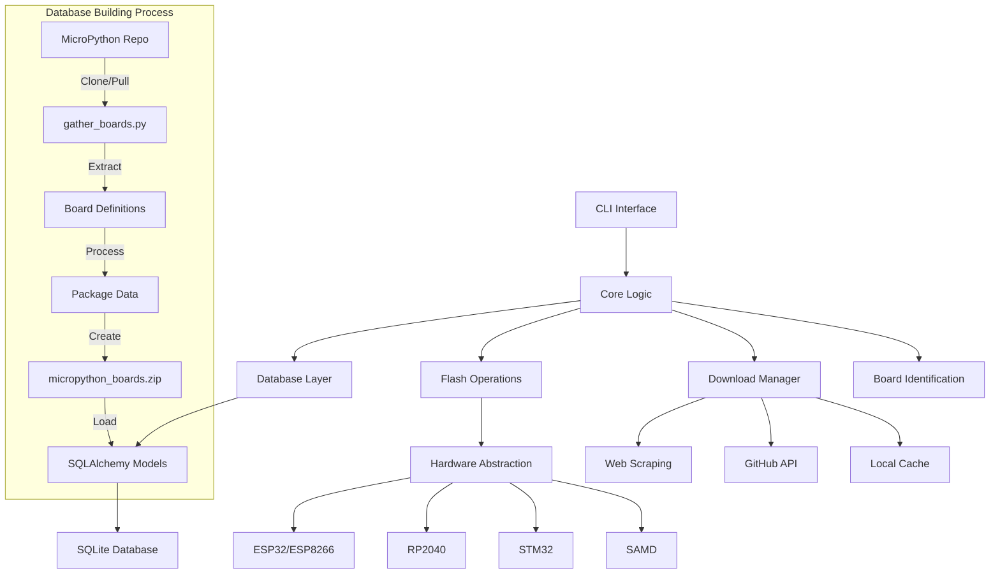

# MPFlash Architecture Documentation

## Overview

MPFlash is a command-line tool and Python library for managing MicroPython firmware across multiple hardware platforms. This document provides a comprehensive overview of the system architecture, design decisions, and implementation details.

## System Architecture

### High-Level Architecture

```
┌─────────────────────────────────────────────────────────────────┐
│                        MPFlash CLI                              │
├─────────────────────────────────────────────────────────────────┤
│  CLI Layer (cli_*.py)                                          │
│  ├─ Command Parsing & Validation                               │
│  ├─ User Interface (Rich/Click)                                │
│  └─ Error Handling & Logging                                   │
├─────────────────────────────────────────────────────────────────┤
│  Core Logic Layer                                              │
│  ├─ Board Detection & Identification                           │
│  ├─ Firmware Download & Management                             │
│  ├─ Flash Operations                                           │
│  └─ Database Operations                                        │
├─────────────────────────────────────────────────────────────────┤
│  Hardware Abstraction Layer                                    │
│  ├─ Platform-Specific Flash Implementations                    │
│  ├─ Bootloader Activation Methods                              │
│  └─ Serial Communication                                       │
├─────────────────────────────────────────────────────────────────┤
│  Data Layer                                                    │
│  ├─ SQLite Database (Boards & Firmware)                       │
│  ├─ File System (Firmware Storage)                            │
│  └─ Configuration Management                                   │
└─────────────────────────────────────────────────────────────────┘
```

### Component Interaction



## Core Components

### 1. CLI Layer (`cli_*.py`)

The CLI layer provides the user interface using Click and Rich for enhanced terminal experience.

#### Key Files:
- `cli_main.py`: Main entry point and command registration
- `cli_group.py`: Click group configuration and global options
- `cli_list.py`: Board listing functionality
- `cli_download.py`: Firmware download commands
- `cli_flash.py`: Board flashing commands

#### Design Patterns:
- **Command Pattern**: Each CLI command is implemented as a separate module
- **Decorator Pattern**: Click decorators for command definition
- **Template Method**: Common CLI patterns abstracted in base functions

```python
# Example CLI command structure
@cli.command()
@click.option("--version", default="stable")
@click.option("--board", multiple=True)
def download(version: str, board: tuple):
    """Download firmware command implementation."""
    # Command logic here
```

### 2. Core Logic Layer

Contains the main business logic for board management, firmware operations, and orchestration.

#### Board Detection (`connected.py`)
```python
def get_connected_comports(
    serial_ports: Optional[List[str]] = None,
    ignore_ports: Optional[List[str]] = None,
    include_bluetooth: bool = False
) -> List[ConnectedBoard]:
    """Get list of connected MicroPython boards."""
    # Implementation handles:
    # - Serial port enumeration
    # - Board identification
    # - Filtering and exclusion
    # - Error handling
```

#### Firmware Management (`downloaded.py`)
```python
class FirmwareManager:
    """Manages local firmware storage and metadata."""
    
    def __init__(self, firmware_dir: Path):
        self.firmware_dir = firmware_dir
        self.db_session = get_database_session()
    
    def find_firmware(self, board_id: str, version: str) -> Optional[Path]:
        """Find firmware file for board and version."""
        # Implementation checks:
        # - Local file existence
        # - Database records
        # - Version compatibility
```

### 3. Database Layer (`db/`)

SQLite database with SQLAlchemy ORM for persistent storage of board information and firmware metadata.

#### Database Schema

```sql
-- Boards table
CREATE TABLE boards (
    board_id VARCHAR(40) NOT NULL,
    version VARCHAR(12) NOT NULL,
    board_name VARCHAR NOT NULL,
    mcu VARCHAR NOT NULL,
    variant VARCHAR DEFAULT '',
    port VARCHAR(30) NOT NULL,
    path VARCHAR NOT NULL,
    description VARCHAR NOT NULL,
    family VARCHAR DEFAULT 'micropython',
    custom BOOLEAN DEFAULT false,
    PRIMARY KEY (board_id, version)
);

-- Firmware table
CREATE TABLE firmwares (
    board_id VARCHAR(40) NOT NULL,
    version VARCHAR(12) NOT NULL,
    firmware_file VARCHAR NOT NULL,
    port VARCHAR(20) DEFAULT '',
    description VARCHAR DEFAULT '',
    source VARCHAR NOT NULL,
    build INTEGER DEFAULT 0,
    custom BOOLEAN DEFAULT false,
    PRIMARY KEY (board_id, version, firmware_file),
    FOREIGN KEY (board_id, version) REFERENCES boards (board_id, version)
);

-- Metadata table
CREATE TABLE metadata (
    name VARCHAR PRIMARY KEY,
    value VARCHAR NOT NULL
);
```

#### Database Operations

```python
class DatabaseManager:
    """Handles database operations and migrations."""
    
    def migrate_database(self, boards: bool = True, firmwares: bool = True):
        """Migrate database schema and data."""
        # Implementation handles:
        # - Schema migrations
        # - Data migrations
        # - Version tracking
        # - Error recovery
    
    def populate_boards(self, boards_data: List[dict]):
        """Populate boards table from scraped data."""
        # Bulk insert operations
        # Conflict resolution
        # Data validation
```

#### Database Update Process

The board database needs to be updated periodically as MicroPython evolves, since board definitions and variants can be added or changed in different MicroPython versions. This process is automated through the `mpflash/db/gather_boards.py` script.

```python
def package_repo(mpy_path: Path):
    """Update board database from MicroPython repository."""
    # Get list of MicroPython versions to process
    mp_versions = micropython_versions(minver="1.18")
    
    # Extract board information for each version
    longlist = boardlist_from_repo(
        versions=mp_versions,
        mpy_dir=mpy_path,
    )
    
    # Package into compressed CSV format
    zip_file = HERE / "micropython_boards.zip"
    create_zip_file(longlist, zip_file=zip_file)
```

The update process:
1. **Version Collection**: Gets a list of MicroPython versions to process (v1.18 and newer)
2. **Repository Analysis**: For each version:
   - Checks out the specific version tag
   - Analyzes the board definitions
   - Extracts board information including variants
3. **Data Aggregation**: Combines board information across all versions
4. **Storage**: Creates a compressed CSV file containing all board data

Key information stored for each board:
- Version: MicroPython version where the board is defined
- Board ID: Unique identifier
- Board Name: Human-readable name
- MCU: Microcontroller type
- Variant: Board variant (if any)
- Port: MicroPython port (esp32, rp2, etc.)
- Path: Location in MicroPython repository
- Description: Board description
- Family: Board family (typically "micropython")

To update the board database:
```bash
# Clone MicroPython repository if needed
git clone https://github.com/micropython/micropython.git

# Run the update script
python -m mpflash.db.gather_boards /path/to/micropython/repo
```

This process ensures that MPFlash's board database stays current with MicroPython's supported hardware.

### 4. Hardware Abstraction Layer

Platform-specific implementations for different MicroPython ports.

#### Flash Implementations (`flash/`)

```python
class FlashBase:
    """Base class for flash implementations."""
    
    def __init__(self, port: str, firmware_path: Path):
        self.port = port
        self.firmware_path = firmware_path
    
    def flash_firmware(self) -> bool:
        """Flash firmware to device. Must be implemented by subclasses."""
        raise NotImplementedError
    
    def enter_bootloader(self) -> bool:
        """Enter bootloader mode. Platform-specific implementation."""
        raise NotImplementedError
```

#### Platform-Specific Implementations

**ESP32/ESP8266 (`flash/esp.py`)**
```python
class ESPFlash(FlashBase):
    """Flash implementation for ESP32/ESP8266 using esptool."""
    
    def flash_firmware(self) -> bool:
        """Flash using esptool."""
        # Uses esptool.py for flashing
        # Handles different chip variants
        # Manages bootloader activation
        return self._run_esptool_flash()
    
    def _run_esptool_flash(self) -> bool:
        """Execute esptool flash command."""
        cmd = [
            "esptool.py",
            "--chip", self.chip_type,
            "--port", self.port,
            "--baud", "460800",
            "write_flash",
            "--flash_size=detect",
            "0x0", str(self.firmware_path)
        ]
        # Execute command and handle errors
```

**RP2040 (`flash/rp2.py`)**
```python
class RP2040Flash(FlashBase):
    """Flash implementation for RP2040 using UF2 file copy."""
    
    def flash_firmware(self) -> bool:
        """Flash using UF2 file copy."""
        # Activates bootloader (BOOTSEL mode)
        # Waits for drive to mount
        # Copies UF2 file to drive
        # Waits for reboot
        return self._copy_uf2_file()
    
    def enter_bootloader(self) -> bool:
        """Enter RP2040 bootloader mode."""
        # Touch 1200 baud to enter bootloader
        # Wait for drive to appear
        return self._touch_1200_baud()
```

#### Bootloader Activation (`bootloader/`)

```python
class BootloaderManager:
    """Manages different bootloader activation methods."""
    
    METHODS = {
        "touch1200": Touch1200Bootloader,
        "mpy": MicropythonBootloader,
        "manual": ManualBootloader,
        "auto": AutoBootloader
    }
    
    def activate_bootloader(self, method: str, port: str) -> bool:
        """Activate bootloader using specified method."""
        bootloader_class = self.METHODS.get(method)
        if not bootloader_class:
            raise ValueError(f"Unknown bootloader method: {method}")
        
        bootloader = bootloader_class(port)
        return bootloader.activate()
```

### 5. Download System (`download/`)

Handles firmware download from various sources.

#### Web Scraping (`download/from_web.py`)
```python
class FirmwareDownloader:
    """Downloads firmware from micropython.org."""
    
    def __init__(self, base_url: str = "https://micropython.org/download/"):
        self.base_url = base_url
        self.session = requests.Session()
    
    def download_firmware(
        self, 
        board_id: str, 
        version: str = "stable"
    ) -> Optional[Path]:
        """Download firmware for specific board and version."""
        # Steps:
        # 1. Scrape board page for firmware links
        # 2. Filter by version
        # 3. Download firmware file
        # 4. Verify download integrity
        # 5. Update database
        return firmware_path
```

#### GitHub Integration (`download/github.py`)
```python
class GitHubDownloader:
    """Downloads firmware from GitHub releases."""
    
    def __init__(self, token: Optional[str] = None):
        self.github = Github(token)
        self.repo = self.github.get_repo("micropython/micropython")
    
    def get_latest_release(self) -> dict:
        """Get latest MicroPython release information."""
        # Uses GitHub API to get release info
        # Handles rate limiting
        # Caches results
```

### 6. Board Identification (`mpboard_id/`)

Sophisticated board identification system that can detect board type, MCU, and firmware version.

```python
class BoardIdentifier:
    """Identifies connected MicroPython boards."""
    
    def __init__(self, timeout: float = 10.0):
        self.timeout = timeout
        self.identification_methods = [
            self._identify_via_build_info,
            self._identify_via_sys_info,
            self._identify_via_usb_info,
            self._identify_via_fallback
        ]
    
    def identify_board(self, port: str) -> Optional[dict]:
        """Identify board on specified port."""
        for method in self.identification_methods:
            try:
                result = method(port)
                if result:
                    return result
            except Exception as e:
                log.debug(f"Identification method {method.__name__} failed: {e}")
        
        return None
    
    def _identify_via_build_info(self, port: str) -> Optional[dict]:
        """Use MicroPython sys.implementation._build for identification."""
        # Connects to MicroPython REPL
        # Executes sys.implementation._build
        # Parses build information
        # Returns board details
```

## Design Patterns and Principles

### 1. Strategy Pattern

Used for different flash implementations:

```python
class FlashStrategy:
    """Strategy interface for flash operations."""
    
    def flash(self, port: str, firmware: Path) -> bool:
        """Flash firmware to device."""
        pass

class ESPFlashStrategy(FlashStrategy):
    """ESP32/ESP8266 flash strategy."""
    
    def flash(self, port: str, firmware: Path) -> bool:
        # ESP-specific implementation
        pass

class RP2040FlashStrategy(FlashStrategy):
    """RP2040 flash strategy."""
    
    def flash(self, port: str, firmware: Path) -> bool:
        # RP2040-specific implementation
        pass
```

### 2. Factory Pattern

Used for creating flash implementations:

```python
class FlashFactory:
    """Factory for creating flash implementations."""
    
    @staticmethod
    def create_flasher(port_type: str, port: str, firmware: Path) -> FlashBase:
        """Create appropriate flash implementation."""
        flashers = {
            "esp32": ESPFlash,
            "esp8266": ESPFlash,
            "rp2": RP2040Flash,
            "stm32": STM32Flash,
            "samd": SAMDFlash
        }
        
        flasher_class = flashers.get(port_type)
        if not flasher_class:
            raise ValueError(f"Unsupported port type: {port_type}")
        
        return flasher_class(port, firmware)
```

### 3. Observer Pattern

Used for progress reporting:

```python
class ProgressObserver:
    """Observer for flash progress updates."""
    
    def update(self, progress: float, message: str):
        """Update progress information."""
        pass

class ConsoleProgressObserver(ProgressObserver):
    """Console-based progress observer."""
    
    def update(self, progress: float, message: str):
        print(f"Progress: {progress:.1%} - {message}")

class FlashOperation:
    """Flash operation with progress reporting."""
    
    def __init__(self):
        self.observers: List[ProgressObserver] = []
    
    def add_observer(self, observer: ProgressObserver):
        """Add progress observer."""
        self.observers.append(observer)
    
    def _notify_observers(self, progress: float, message: str):
        """Notify all observers of progress."""
        for observer in self.observers:
            observer.update(progress, message)
```

### 4. Repository Pattern

Used for database operations:

```python
class BoardRepository:
    """Repository for board data access."""
    
    def __init__(self, session: Session):
        self.session = session
    
    def find_by_id(self, board_id: str, version: str) -> Optional[Board]:
        """Find board by ID and version."""
        return self.session.query(Board).filter_by(
            board_id=board_id,
            version=version
        ).first()
    
    def find_compatible_boards(self, mcu: str, port: str) -> List[Board]:
        """Find boards compatible with MCU and port."""
        return self.session.query(Board).filter_by(
            mcu=mcu,
            port=port
        ).all()
    
    def save(self, board: Board):
        """Save board to database."""
        self.session.add(board)
        self.session.commit()
```

## Error Handling Strategy

### Exception Hierarchy

```python
class MPFlashError(Exception):
    """Base exception for MPFlash operations."""
    pass

class BoardNotFoundError(MPFlashError):
    """Raised when board cannot be found or identified."""
    pass

class FirmwareNotFoundError(MPFlashError):
    """Raised when firmware cannot be found or downloaded."""
    pass

class FlashError(MPFlashError):
    """Raised when flash operation fails."""
    pass

class BootloaderError(MPFlashError):
    """Raised when bootloader activation fails."""
    pass
```

### Error Handling Patterns

```python
def safe_board_operation(func):
    """Decorator for safe board operations."""
    def wrapper(*args, **kwargs):
        try:
            return func(*args, **kwargs)
        except BoardNotFoundError as e:
            log.error(f"Board not found: {e}")
            return None
        except FlashError as e:
            log.error(f"Flash operation failed: {e}")
            return False
        except Exception as e:
            log.error(f"Unexpected error: {e}")
            raise
    return wrapper

@safe_board_operation
def flash_board(port: str, firmware: Path) -> bool:
    """Flash firmware to board with error handling."""
    # Implementation here
```

## Performance Considerations

### 1. Lazy Loading

```python
class LazyFlashModule:
    """Lazy-loaded flash module."""
    
    def __init__(self):
        self._esptool = None
        self._pyusb = None
    
    @property
    def esptool(self):
        """Lazy-load esptool module."""
        if self._esptool is None:
            import esptool
            self._esptool = esptool
        return self._esptool
```

### 2. Caching

```python
from functools import lru_cache
from cachetools import TTLCache

class BoardCache:
    """Cache for board information."""
    
    def __init__(self):
        self.cache = TTLCache(maxsize=100, ttl=300)  # 5 minute TTL
    
    @lru_cache(maxsize=50)
    def get_board_info(self, board_id: str) -> Optional[dict]:
        """Get cached board information."""
        # Implementation with caching
```

### 3. Concurrent Operations

```python
import concurrent.futures
from typing import List, Callable

class ConcurrentFlasher:
    """Flash multiple boards concurrently."""
    
    def __init__(self, max_workers: int = 4):
        self.max_workers = max_workers
    
    def flash_boards(self, flash_tasks: List[Callable]) -> List[bool]:
        """Flash multiple boards concurrently."""
        with concurrent.futures.ThreadPoolExecutor(max_workers=self.max_workers) as executor:
            futures = [executor.submit(task) for task in flash_tasks]
            results = [future.result() for future in concurrent.futures.as_completed(futures)]
        
        return results
```

## Security Considerations

### 1. Input Validation

```python
def validate_serial_port(port: str) -> bool:
    """Validate serial port format."""
    import re
    
    # Windows: COM1, COM2, etc.
    # Linux: /dev/ttyUSB0, /dev/ttyACM0, etc.
    # macOS: /dev/cu.usbserial-*, /dev/tty.usbserial-*
    
    patterns = [
        r'^COM\d+$',  # Windows
        r'^/dev/tty(USB|ACM)\d+$',  # Linux
        r'^/dev/cu\.[a-zA-Z0-9_-]+$',  # macOS
    ]
    
    return any(re.match(pattern, port) for pattern in patterns)
```

### 2. Safe File Operations

```python
def safe_firmware_download(url: str, destination: Path) -> bool:
    """Safely download firmware file."""
    try:
        # Validate URL
        if not url.startswith(('https://', 'http://')):
            raise ValueError("Invalid URL scheme")
        
        # Create secure temporary file
        with tempfile.NamedTemporaryFile(delete=False) as tmp_file:
            response = requests.get(url, stream=True, timeout=30)
            response.raise_for_status()
            
            # Verify content type
            if not response.headers.get('content-type', '').startswith('application/'):
                raise ValueError("Invalid content type")
            
            # Write to temporary file
            for chunk in response.iter_content(chunk_size=8192):
                tmp_file.write(chunk)
            
            # Verify file integrity (if checksum available)
            # Move to final destination
            shutil.move(tmp_file.name, destination)
            return True
            
    except Exception as e:
        log.error(f"Download failed: {e}")
        return False
```

## Testing Architecture

### 1. Test Pyramid

```
    ┌─────────────────┐
    │   E2E Tests     │  ← CLI integration tests
    │   (Slow, Few)   │
    ├─────────────────┤
    │ Integration     │  ← Component interaction tests
    │ Tests           │
    │ (Medium, More)  │
    ├─────────────────┤
    │  Unit Tests     │  ← Function/method tests
    │  (Fast, Many)   │
    └─────────────────┘
```

### 2. Test Fixtures

```python
@pytest.fixture
def mock_board():
    """Mock board for testing."""
    return ConnectedBoard(
        port="COM3",
        board_id="TEST_BOARD",
        board_name="Test Board",
        mcu="TestMCU",
        version="v1.25.0",
        family="micropython"
    )

@pytest.fixture
def temp_firmware_dir(tmp_path):
    """Temporary firmware directory."""
    firmware_dir = tmp_path / "firmware"
    firmware_dir.mkdir()
    return firmware_dir
```

### 3. Mock Strategies

```python
class MockSerial:
    """Mock serial connection for testing."""
    
    def __init__(self, responses: List[str]):
        self.responses = responses
        self.response_index = 0
    
    def read(self, size: int = 1) -> bytes:
        """Mock read operation."""
        if self.response_index < len(self.responses):
            response = self.responses[self.response_index]
            self.response_index += 1
            return response.encode()
        return b""
    
    def write(self, data: bytes) -> int:
        """Mock write operation."""
        return len(data)
```

## Configuration Management

### 1. Configuration Hierarchy

```
Environment Variables
         ↓
Command Line Arguments
         ↓
Configuration Files
         ↓
Default Values
```

### 2. Configuration Classes

```python
@dataclass
class MPFlashConfig:
    """Configuration for MPFlash operations."""
    
    firmware_dir: Path = field(default_factory=lambda: Path.home() / "Downloads" / "firmware")
    database_path: Path = field(default_factory=lambda: Path.home() / ".mpflash" / "mpflash.db")
    log_level: str = "INFO"
    timeout: float = 30.0
    max_concurrent_operations: int = 4
    ignore_ports: List[str] = field(default_factory=list)
    
    @classmethod
    def from_env(cls) -> 'MPFlashConfig':
        """Create configuration from environment variables."""
        config = cls()
        
        if firmware_dir := os.getenv("MPFLASH_FIRMWARE"):
            config.firmware_dir = Path(firmware_dir)
        
        if ignore_ports := os.getenv("MPFLASH_IGNORE"):
            config.ignore_ports = ignore_ports.split()
        
        return config
```

## Release Process

### Pre-release Checklist

Before releasing:

- [ ] Run board database update using `gather_boards.py` script:
  ```bash
  # Update board database from latest MicroPython repository
  python -m mpflash.db.gather_boards /path/to/micropython/repo
  
  # Commit and push the updated database
  git add mpflash/db/micropython_boards.zip
  git commit -m "chore: update board database for release"
  git push
  ```
- [ ] All tests passing
- [ ] Documentation updated
- [ ] Version bumped appropriately
- [ ] Changelog updated
- [ ] No breaking changes without major version bump

This architecture documentation provides a comprehensive overview of MPFlash's design, implementation patterns, and architectural decisions. It serves as a guide for developers who want to understand, maintain, or extend the system.
