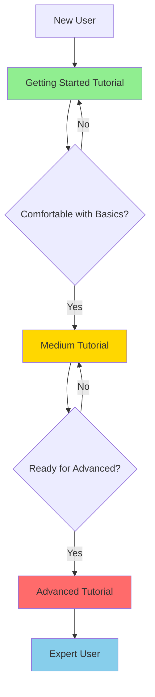

# 🎓 Interactive Tutorial System

## Overview

Nexus includes a comprehensive **interactive tutorial system** designed to teach you the CLI through hands-on practice. The tutorials are self-paced, progressively structured, and use your actual data for real-world learning.

!!! success "Recommended Learning Path"
    Start with the interactive tutorials for the best learning experience!
    
    ```bash
    nexus tutorial run getting-started  # 10-15 min
    nexus tutorial run medium           # 20-30 min
    nexus tutorial run advanced         # 30-40 min
    ```

---

## Why Interactive Tutorials?

### Traditional Documentation Problems
- ❌ Passive reading doesn't build muscle memory
- ❌ Unclear learning progression
- ❌ No hands-on practice
- ❌ Easy to get lost or skip important concepts

### Interactive Tutorial Benefits
- ✅ **Hands-on practice** - Run real commands
- ✅ **Progressive learning** - Build from basics to advanced
- ✅ **Self-paced** - Pause and resume anytime
- ✅ **Real data** - Use your actual Zotero/vault/manuscripts
- ✅ **Contextual help** - Hints and tips at each step
- ✅ **Clear navigation** - Always know where you are

---

## Tutorial Levels

### 🟢 Getting Started (7 steps, ~10 min)

**Perfect for:** First-time users, initial setup

**What you'll learn:**
- Installation verification with `nexus doctor`
- Configuration basics with `nexus config`
- Command structure and navigation
- Your first Zotero search
- JSON output for automation

**Start here:**
```bash
nexus tutorial run getting-started
```

[See detailed breakdown →](tutorial-guide.md#getting-started-tutorial)

---

### 🟡 Medium - Domain Workflows (11 steps, ~20 min)

**Perfect for:** Users ready to explore specific workflows

**What you'll learn:**

**Research Workflow** (4 steps)
- Literature discovery and search
- Paper details and metadata
- Citation generation (APA, BibTeX)
- Tag exploration and filtering

**Knowledge Workflow** (3 steps)
- Vault search across all notes
- Reading notes with frontmatter
- Graph analysis and statistics

**Other Workflows** (4 steps)
- Teaching: Course management
- Writing: Manuscript tracking
- Unified search across all domains

**Start here:**
```bash
nexus tutorial run medium
```

[See detailed breakdown →](tutorial-guide.md#medium-tutorial)

---

### 🔴 Advanced - Power User (12 steps, ~30 min)

**Perfect for:** Experienced users ready for automation

**What you'll learn:**

**Batch Operations** (4 steps)
- Bulk manuscript status updates
- Progress tracking for multiple manuscripts
- Metadata export (JSON/CSV)

**Graph Visualization** (2 steps)
- GraphML export for Gephi/Cytoscape
- D3.js export for web visualizations

**Integration & Automation** (6 steps)
- JSON pipelines with Claude
- Bibliography citation checking
- Quarto project automation
- Custom workflow patterns

**Start here:**
```bash
nexus tutorial run advanced
```

[See detailed breakdown →](tutorial-guide.md#advanced-tutorial)

---

## Quick Commands

### List Available Tutorials
```bash
nexus tutorial list
```

Shows all available tutorials with descriptions, step counts, and estimated duration.

### Run a Tutorial
```bash
# Getting Started (recommended first)
nexus tutorial run getting-started

# Domain Workflows
nexus tutorial run medium

# Advanced Techniques
nexus tutorial run advanced
```

### Resume from Specific Step
```bash
# Resume Medium tutorial from step 5
nexus tutorial run medium --step 5

# Resume Advanced tutorial from step 10
nexus tutorial run advanced --step 10
```

### Get Help
```bash
nexus tutorial --help
```

---

## Tutorial Features

### Interactive Prompts
Each step includes interactive confirmations:
```
Have you tried this command? [y/n] (y):
Continue to next step? [y/n] (y):
```

### Contextual Hints
Every step includes helpful hints:
```
💡 Hint: This command supports --json for machine-readable output
```

### Progress Tracking
Always know where you are:
```
╭─────────────────── Step 5/11 ────────────────────╮
│ Vault Search                                      │
│ ...                                               │
╰───────────────────────────────────────────────────╯
```

### Pause and Resume
Life happens! Resume exactly where you left off:
```bash
# Paused at step 7? Resume here
nexus tutorial run medium --step 7
```

---

## Learning Path Visualization



---

## Tutorial Content Coverage

### Commands Demonstrated

**Getting Started** (5 commands)
```bash
nexus doctor
nexus config
nexus --help
nexus research zotero search
--json flag usage
```

**Medium** (15+ commands)
```bash
nexus research zotero search|get|cite|tags|by-tag
nexus knowledge vault search|read|graph
nexus teach course list
nexus write manuscript list
nexus knowledge search
```

**Advanced** (20+ commands)
```bash
nexus write manuscript batch-status|batch-progress|export
nexus knowledge vault export graphml|d3|json
nexus write bib check
nexus teach quarto build|info
JSON pipeline patterns
```

### Domains Covered

| Domain | Getting Started | Medium | Advanced |
|--------|----------------|--------|----------|
| **Research** | ✅ Basic search | ✅ Full workflow | ✅ Integration |
| **Knowledge** | ❌ | ✅ Full workflow | ✅ Graph export |
| **Teaching** | ❌ | ✅ Overview | ✅ Automation |
| **Writing** | ❌ | ✅ Overview | ✅ Batch ops |

---

## Tips for Success

### Before Starting
1. **Install Nexus**: Ensure `nexus --version` works
2. **Run health check**: `nexus doctor` shows what's available
3. **Set aside time**: 10-40 minutes depending on level
4. **Have data ready**: Zotero library, vault, or manuscripts (optional but helpful)

### During Tutorials
1. **Actually run the commands** - Don't just read them
2. **Experiment** - Try variations of shown commands
3. **Take notes** - Build your own cheat sheet
4. **Ask questions** - Note what's unclear for later

### After Tutorials
1. **Practice regularly** - Use commands in real workflows
2. **Build aliases** - Create shortcuts for common tasks
3. **Integrate with Claude** - Try automation patterns shown
4. **Share feedback** - Help improve tutorials for others

---

## Troubleshooting

### Tutorial Won't Start
```bash
# Check installation
nexus --version

# Verify tutorials exist
nexus tutorial list

# Use correct level name
nexus tutorial run getting-started  # ✅ Correct
nexus tutorial run beginner         # ❌ Wrong
```

### Commands Fail During Tutorial
- Run `nexus doctor` to check component availability
- Some commands require Zotero, vault, or other components
- Tutorial explains patterns even if data is missing
- Not having everything configured is OK - you'll still learn!

### Want to Skip Steps
```bash
# Jump to step 5
nexus tutorial run medium --step 5

# Steps are numbered 1-indexed
```

### Lost Your Place
- Step numbers are shown in each step title
- Resume with `--step N` flag
- No penalty for restarting from beginning

---

## Additional Resources

### Documentation
- **[Tutorial Guide](tutorial-guide.md)** - Complete tutorial documentation
- **[Quick Reference](tutorial-quick-ref.md)** - One-page cheat sheet
- **[CLI Reference](../reference/cli.md)** - All command details

### Traditional Tutorials
- **[First Steps](first-steps.md)** - Manual walkthrough
- **[Vault Setup](vault-setup.md)** - Obsidian configuration
- **[Zotero Integration](zotero.md)** - Literature management
- **[Graph Visualization](graph-viz.md)** - Knowledge graphs

### Getting Help
- **In-tutorial**: Each step has hints and examples
- **Command help**: `nexus <command> --help`
- **Documentation**: Full guides in this site
- **Issues**: [GitHub Issues](https://github.com/Data-Wise/nexus-cli/issues)

---

## Comparison with Traditional Tutorials

| Aspect | Interactive Tutorials | Written Tutorials |
|--------|---------------------|------------------|
| **Learning Style** | Hands-on practice | Reading & reference |
| **Time Required** | 10-40 min total | Varies widely |
| **Progress Tracking** | Built-in | Self-managed |
| **Pause/Resume** | Automatic | Manual |
| **Best For** | Initial learning | Quick reference |
| **Commands** | Must run them | Can just read |

!!! tip "Use Both!"
    Interactive tutorials for initial learning, written tutorials for reference.

---

## What's Next?

### After Completing Tutorials

1. **Practice with Real Work**
   - Use Nexus in your actual research/teaching/writing
   - Build custom scripts for repeated tasks
   - Integrate with Claude for AI workflows

2. **Explore Advanced Features**
   - [User Guide](../guide/overview.md) - In-depth coverage
   - [MCP Server](../reference/mcp.md) - Claude Desktop integration
   - [Python API](../reference/api.md) - Programmatic usage

3. **Contribute Back**
   - Share your workflows
   - Suggest tutorial improvements
   - Help other users

---

## Ready to Learn?

Choose your starting point:

=== "🟢 New User"
    ```bash
    nexus tutorial run getting-started
    ```
    Start here if you're new to Nexus or CLIs in general.

=== "🟡 Some Experience"
    ```bash
    nexus tutorial run medium
    ```
    Jump here if you understand basic CLI navigation.

=== "🔴 Power User"
    ```bash
    nexus tutorial run advanced
    ```
    Go here if you want batch operations and integrations.

---

**Happy Learning!** 🎓

For more details, see the [Complete Tutorial Guide →](tutorial-guide.md)
