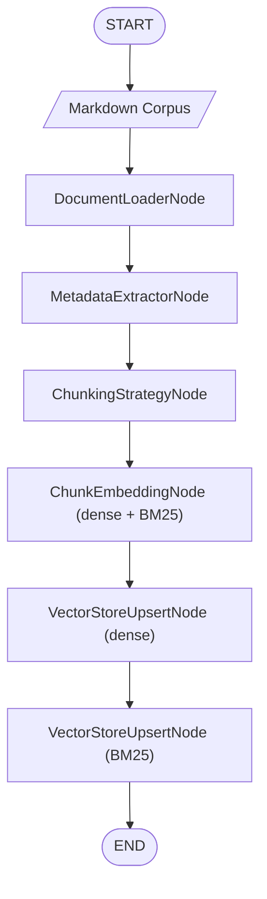
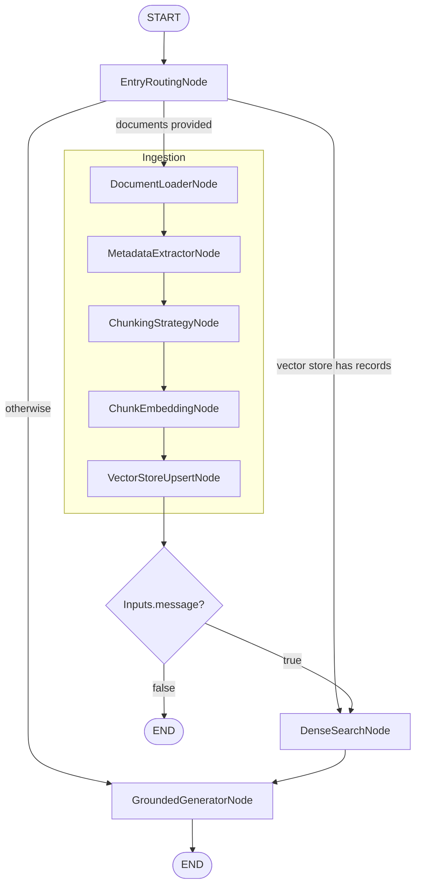
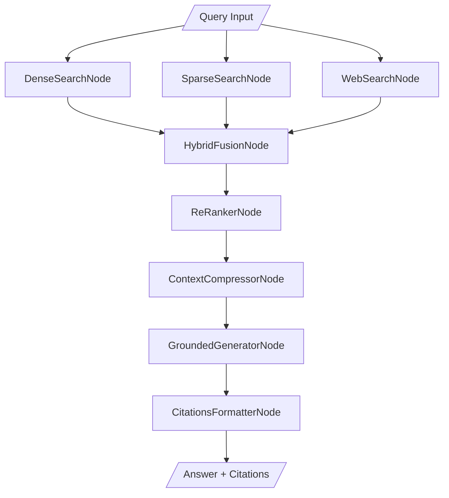
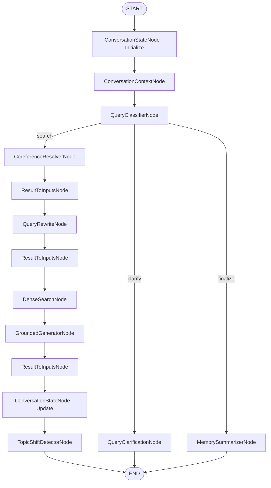

```mermaid
graph TD;
        __start__([START])
        session_manager(SessionManagementNode)
        conversation_state(ConversationStateNode)
        conversation_history_sync(ResultToInputsNode)
        answer_cache_check(AnswerCachingNode)
        query_rewrite(QueryRewriteNode)
        rewrite_to_search(ResultToInputsNode)
        multi_hop_planner(MultiHopPlannerNode)
        plan_to_search_query(PlanToSearchQueryNode)
        dense_search(DenseSearchNode)
        source_router(SourceRouterNode)
        grounded_generator(GroundedGeneratorNode)
        hallucination_guard(HallucinationGuardNode)
        guard_to_policy(ResultToInputsNode)
        policy_compliance(PolicyComplianceNode)
        memory_privacy(MemoryPrivacyNode)
        answer_cache_store(AnswerCachingNode)
        policy_to_stream_inputs(ResultToInputsNode)
        streaming_generator(StreamingGeneratorNode)
        conversation_state_update(ConversationStateNode)
        cache_hit_to_inputs(ResultToInputsNode)
        __end__([END])
        __start__ --> session_manager;
        answer_cache_check -. &nbsp;hit&nbsp; .-> cache_hit_to_inputs;
        answer_cache_check -. &nbsp;miss&nbsp; .-> query_rewrite;
        answer_cache_store --> policy_to_stream_inputs;
        cache_hit_to_inputs --> conversation_state_update;
        conversation_history_sync --> answer_cache_check;
        conversation_state --> conversation_history_sync;
        dense_search --> source_router;
        grounded_generator --> hallucination_guard;
        guard_to_policy --> policy_compliance;
        hallucination_guard --> guard_to_policy;
        memory_privacy --> answer_cache_store;
        multi_hop_planner --> plan_to_search_query;
        plan_to_search_query --> dense_search;
        policy_compliance --> memory_privacy;
        policy_to_stream_inputs --> streaming_generator;
        query_rewrite --> rewrite_to_search;
        rewrite_to_search --> multi_hop_planner;
        session_manager --> conversation_state;
        source_router --> grounded_generator;
        streaming_generator --> conversation_state_update;
        conversation_state_update --> __end__;
```

```mermaid
graph TD
DatasetNode["DatasetNode (dataset)"]
VariantRetrievalNode["VariantRetrievalNode (variant_retrieval)"]
RetrievalToInputs["ResultToInputsNode (retrieval_to_inputs)"]
RetrievalEvalVector["RetrievalEvaluationNode (retrieval_eval_vector)"]
RetrievalEvalHybrid["RetrievalEvaluationNode (retrieval_eval_hybrid)"]
BatchGeneratorNode["BatchGenerationNode (batch_generator)"]
GenerationToInputs["ResultToInputsNode (generation_to_inputs)"]
AnswerQualityNode["AnswerQualityEvaluationNode (answer_quality)"]
AnswerMetricsToInputs["ResultToInputsNode (answer_metrics_to_inputs)"]
LLMJudgeNode["LLMJudgeNode (llm_judge)"]
VariantScoringNode["VariantScoringNode (variant_scoring)"]
VariantToInputs["ResultToInputsNode (variant_to_inputs)"]
ABTestingNode["ABTestingNode (ab_testing)"]
FeedbackSynthesisNode["FeedbackSynthesisNode (feedback_synthesis)"]
FeedbackToInputs["ResultToInputsNode (feedback_to_inputs)"]
UserFeedbackNode["UserFeedbackCollectionNode (user_feedback)"]
FeedbackCollectionToInputs["ResultToInputsNode (feedback_collection_to_inputs)"]
FeedbackNormalizerNode["FeedbackNormalizerNode (feedback_normalizer)"]
FeedbackIngestionNode["FeedbackIngestionNode (feedback_ingestion)"]
MetricsToInputs["ResultToInputsNode (metrics_to_inputs)"]
FailureAnalysisNode["FailureAnalysisNode (failure_analysis)"]
AnalyticsInputsNode["ResultToInputsNode (analytics_inputs)"]
AnalyticsExportNode["AnalyticsExportNode (analytics_export)"]
DataAugmentationNode["DataAugmentationNode (data_augmentation)"]
TurnAnnotationNode["TurnAnnotationNode (turn_annotation)"]

DatasetNode --> VariantRetrievalNode
VariantRetrievalNode --> RetrievalToInputs
RetrievalToInputs --> RetrievalEvalVector
RetrievalEvalVector --> RetrievalEvalHybrid
RetrievalEvalHybrid --> BatchGeneratorNode
BatchGeneratorNode --> GenerationToInputs
GenerationToInputs --> AnswerQualityNode
AnswerQualityNode --> AnswerMetricsToInputs
AnswerMetricsToInputs --> LLMJudgeNode
LLMJudgeNode --> VariantScoringNode
VariantScoringNode --> VariantToInputs
VariantToInputs --> ABTestingNode
ABTestingNode --> FeedbackSynthesisNode
FeedbackSynthesisNode --> FeedbackToInputs
FeedbackToInputs --> UserFeedbackNode
UserFeedbackNode --> FeedbackCollectionToInputs
FeedbackCollectionToInputs --> FeedbackNormalizerNode
FeedbackNormalizerNode --> FeedbackIngestionNode
FeedbackIngestionNode --> MetricsToInputs
MetricsToInputs --> FailureAnalysisNode
FailureAnalysisNode --> AnalyticsInputsNode
AnalyticsInputsNode --> AnalyticsExportNode
AnalyticsExportNode --> DataAugmentationNode
DataAugmentationNode --> TurnAnnotationNode
TurnAnnotationNode --> End([END])
```

# Demo Workflow Design for Conversational Search

- **Version:** 0.2
- **Author:** Claude
- **Date:** 2025-11-26
- **Status:** Approved

## Overview

This document defines the minimal set of demo workflows that collectively demonstrate all conversational search nodes. Each demo is designed to be self-contained, progressively introducing complexity, and covering distinct feature sets with minimal overlap.

## Demo Strategy

We organize demos into **6 workflows** that map to the node composition patterns from the requirements document: Demo 0 builds the hybrid index foundation, and the remaining five progressive demos build on top of that indexing work.

1. **Demo 0: Hybrid Search Indexing** - Persist deterministic dense embeddings and sparse metadata inside Pinecone so downstream retrieval demos can assume a populated vector store.
2. **Demo 1: Basic RAG Pipeline** - Core ingestion and retrieval
3. **Demo 2: Hybrid Search** - Retrieval, fusion, and ranking (Demo 0 prepopulates the indexes so this workflow focuses on multi-retriever fusion and summarization)
4. **Demo 3: Conversational Search** - Multi-turn conversation with memory
5. **Demo 4: Production-Ready Pipeline** - Guardrails, compliance, and optimization
6. **Demo 5: Evaluation & Research** - Metrics, analytics, and continuous improvement

---

## Demo 0: Hybrid Search Indexing

**Goal:** Persist deterministic dense embeddings and the metadata required for sparse retrieval inside Pinecone so downstream demos can assume a fully populated vector store.

### Use Case
- Run ingestion once per corpus snapshot to keep index building orthogonal to multi-retriever experiments.
- Surface the same vectors for both dense and sparse retrievers so that Keyword BM25 can rehydrate chunk content from Pinecone metadata.

### Indexing Flow


### Configuration Highlights
```yaml
corpus:
  docs_path: "examples/conversational_search/data/docs"
  chunk_size: 600
  chunk_overlap: 80

vector_store:
  type: "pinecone"
  pinecone:
    index_name: "orcheo-hybrid-demo"
    namespace: "hybrid_search"
    client_kwargs:
      api_key: "[[pinecone_api_key]]"
      environment: "[[pinecone_environment]]"
```

### Running the Demo
```bash
python examples/conversational_search/demo_0/hybrid_indexing.py
```

## Demo 1: Basic RAG Pipeline

**Goal:** Demonstrate a flexible conversational pipeline that supports both RAG (with documents) and non-RAG (without documents) modes.

### Use Case
A versatile assistant that can:
- Answer questions using a product knowledge base when documents are provided (RAG mode)
- Generate general responses without retrieval when no documents are attached (non-RAG mode)

### Workflow Graph



### Nodes Demonstrated
- **EntryRoutingNode** (Custom TaskNode) - Computes ingestion/search/generator mode ahead of routing
- **Switch** (Logic) - Routes execution based on `routing_mode`
- **IfElseNode** (Logic) - Conditional branching for post-ingestion routing
- **DocumentLoaderNode** (P0) - Load markdown documentation files
- **MetadataExtractorNode** (P0) - Extract title, source, section metadata
- **ChunkingStrategyNode** (P0) - Split documents with overlap
- **ChunkEmbeddingNode** (P0) - Embed chunks using deterministic/dense models and emit named vector records
- **VectorStoreUpsertNode** (P0) - Persist chunk embeddings into the configured vector store
- **DenseSearchNode** (P0) - Retrieve top-k relevant chunks (when documents exist)
- **GroundedGeneratorNode** (P0) - Generate answers with citations (RAG) or without (non-RAG)

### Branching Logic
The demo uses a two-stage routing strategy:

1. **Entry routing**: The custom `EntryRoutingNode` inspects the request payload and existing `InMemoryVectorStore` records to compute `routing_mode` (`ingestion`, `search`, or `generator`). The `Switch`-based `entry_router` reads this value and sends execution directly to the loader, search node, or generator.

2. **post_ingestion_router**: After new chunks are indexed, an `IfElseNode` evaluates `{{inputs.query}}` OR `{{inputs.message}}` truthiness
   - `true` branch → Search pipeline (RAG mode with retrieval)
   - `false` branch → End workflow (ingestion-only mode)

### Configuration Highlights
```yaml
document_loader:
  source_type: "file"
  file_patterns: ["docs/**/*.md"]

chunking:
  strategy: "recursive_character"
  chunk_size: 512
  chunk_overlap: 50

chunk_embedding:
  embedding_functions:
    default: "text-embedding-3-small"
vector_upsert:
  vector_store: "in_memory"

dense_search:
  top_k: 5
  similarity_threshold: 0.7

generator:
  model: "gpt-4o-mini"
  temperature: 0.3
  include_citations: true
```

### Sample Interactions

**RAG Mode (with documents):**
```
User: [Uploads documentation] + "How do I configure authentication?"
System: "To configure authentication, you need to set up OAuth2 credentials... [source: docs/auth.md:42-56]"
```

**Non-RAG Mode (without documents):**
```
User: "What is the capital of France?"
System: "The capital of France is Paris. It is located in the north-central part of the country."
```

---

## Demo 2: Hybrid Search with Ranking

**Goal:** Show advanced retrieval combining dense and sparse search with fusion, AI summarization, and live web search.

This demo assumes the Pinecone indexes have already been created by Demo 0 (hybrid indexing) so the workflow can concentrate on retrieval and grounding.

### Use Case
A legal document search system that needs both semantic understanding and exact keyword matching for statute citations, with the ability to fetch fresh web results for recent case law.

Before invoking this workflow, run Demo 0 (hybrid indexing) so Pinecone already contains the corpus vectors that both the dense and sparse retrievers query. After fusion, a ReRankerNode reorders the combined results and an AI-based context summarizer condenses the supporting passages so generation stays within local token limits.

### Workflow Graph



### Additional Nodes Demonstrated
- **SparseSearchNode** (P0) - Keyword-based sparse retrieval
- **WebSearchNode** (P0) - Live web search for fresh results
- **HybridFusionNode** (P0) - RRF fusion of dense, sparse, and web results
- **ReRankerNode** (P1) - Apply secondary ordering to fused results (Demo uses PineconeRerankNode)
- **ContextCompressorNode** (P0) - AI summarizer that condenses retrieved context
- **CitationsFormatterNode** (P1) - Format citations with URL, title, snippet

### Configuration Highlights
```yaml
sparse_search:
  top_k: 10

web_search:
  provider: "tavily"
  max_results: 5
  search_depth: "advanced"

hybrid_fusion:
  strategy: "reciprocal_rank_fusion"
  weights:
    dense: 0.5
    sparse: 0.3
    web: 0.2

context:
  summary_model: "openai:gpt-4o-mini"
  summary_prompt: >
    Summarize the retrieved context into a concise paragraph using the
    numbered citations for attribution.
  max_tokens: 400
```

### Running the Demo
```bash
python examples/conversational_search/demo_2_hybrid_search/demo_2.py
```

### Sample Interaction
```
User: "Find cases mentioning 'reasonable doubt' and mens rea"
System: "Cases addressing reasonable doubt in mens rea analysis include...
[1] State v. Johnson (2019) - ¶42-45 [Internal Database]
[2] Federal Guidelines §2.01 [Internal Database]
[3] Recent Supreme Court ruling on mens rea (2024) [Web: supreme.justia.com]"
```

---

## Demo 3: Conversational Search

**Goal:** Demonstrate multi-turn conversation with context tracking, query rewriting, and coreference resolution.

### Use Case
A customer support chatbot that handles follow-up questions and maintains conversation context.

### Workflow Graph



### Additional Nodes Demonstrated
- **ConversationStateNode** (P0) - Maintain session context and history
- **QueryClassifierNode** (P0) - Route queries (search/clarify/finalize)
- **CoreferenceResolverNode** (P0) - Resolve pronouns ("it", "that feature")
- **QueryRewriteNode** (P0) - Expand queries using conversation history
- **TopicShiftDetectorNode** (P0) - Detect conversation divergence
- **QueryClarificationNode** (P1) - Request user clarification
- **MemorySummarizerNode** (P1) - Write episodic memory

### Configuration Highlights
```yaml
conversation_state:
  max_turns: 20
  memory_store: "in_memory"

query_classifier:
  model: "gpt-4o-mini"
  categories: ["search", "clarify", "finalize"]

coreference_resolver:
  method: "transformer"
  model: "coref-distilroberta-base"

query_rewrite:
  strategy: "conversational_expansion"
  include_last_n_turns: 3

topic_shift_detector:
  threshold: 0.6
  action_on_shift: "summarize_previous"
```

### Sample Interaction
```
User: "How do I reset my password?"
AI: "You can reset your password by clicking 'Forgot Password'..."

User: "Where is that button?"  [coreference: "that button" = "Forgot Password"]
AI: "The 'Forgot Password' button is located below the login form..."

User: "What about API keys?"  [topic shift detected]
AI: "I notice you're switching to API keys. To summarize our password discussion: ... Now, regarding API keys..."
```

---

## Demo 4: Production-Ready Pipeline

**Goal:** Showcase guardrails, compliance, caching, and optimization for production deployment.

### Use Case
An enterprise knowledge assistant with strict compliance requirements, hallucination prevention, and performance optimization.

### Workflow Graph



### Additional Nodes Demonstrated
- **IncrementalIndexerNode** (P1) - Delta-sync for document updates
- **SessionManagementNode** (P1) - Lifecycle and concurrency control
- **AnswerCachingNode** (P1) - Semantic caching with TTL
- **MultiHopPlannerNode** (P1) - Decompose complex queries
- **SourceRouterNode** (P1) - Route to appropriate knowledge sources
- **HallucinationGuardNode** (P1) - Validate answer grounding
- **PolicyComplianceNode** (P1) - Filter PII and enforce content policies
- **MemoryPrivacyNode** (P1) - Apply retention and redaction policies
- **StreamingGeneratorNode** (P1) - Stream responses for UX

### Configuration Highlights
```yaml
incremental_indexer:
  sync_interval_minutes: 60
  change_detection: "checksum"

session_management:
  max_concurrent_sessions: 100
  session_timeout_minutes: 30
  cleanup_strategy: "idle"

answer_caching:
  cache_ttl_seconds: 3600
  similarity_threshold: 0.92
  strategy: "semantic"

multi_hop_planner:
  max_hops: 3
  decomposition_model: "gpt-4o-mini"

hallucination_guard:
  method: "llm_judge"
  model: "gpt-4o"
  threshold: 0.8
  action_on_failure: "fallback"

policy_compliance:
  filters: ["pii", "toxicity", "profanity"]
  pii_redaction: true
  audit_logging: true

memory_privacy:
  retention_days: 30
  redact_pii: true
  anonymization_method: "hash"

streaming_generator:
  buffer_size: 10
  flush_interval_ms: 100
```

### Sample Interaction
```
User: "My email is john@example.com, can you look up my order?"
System: [streaming] "Let me check your order for [REDACTED]..."
[Hallucination guard detects ungrounded claim, triggers fallback]
System: "I found multiple orders. Could you provide your order number?"
```

---

## Demo 5: Evaluation & Research Pipeline

**Goal:** Demonstrate evaluation, analytics, feedback collection, and A/B testing for continuous improvement.

### Use Case
A research team iterating on retrieval strategies with systematic evaluation and user feedback loops.

### Workflow Graph



### Additional Nodes Demonstrated
- **DatasetNode** (P2) - Manage golden evaluation datasets
- **ABTestingNode** (P2) - Route traffic between variants
- **RetrievalEvaluationNode** (P2) - Compute Recall@k, MRR, NDCG
- **AnswerQualityEvaluationNode** (P2) - Score faithfulness, relevance
- **LLMJudgeNode** (P2) - LLM-based answer evaluation
- **UserFeedbackCollectionNode** (P2) - Collect thumbs up/down, ratings
- **FeedbackIngestionNode** (P2) - Persist feedback to analytics
- **FailureAnalysisNode** (P2) - Categorize failure modes
- **AnalyticsExportNode** (P2) - Export metrics to warehouse
- **DataAugmentationNode** (P2) - Generate synthetic training data
- **TurnAnnotationNode** (P2) - Capture structured labels

### Configuration Highlights
```yaml
dataset:
  source: "golden_queries_v2.json"
  schema_version: "1.0"
  split: "test"

ab_testing:
  variants:
    - name: "vector_only"
      traffic_percentage: 50
    - name: "hybrid_fusion"
      traffic_percentage: 50
  experiment_id: "retrieval_comparison_001"

retrieval_evaluation:
  metrics: ["recall@5", "recall@10", "mrr", "ndcg@10"]
  relevance_labels: true

answer_quality_evaluation:
  metrics: ["faithfulness", "relevance", "completeness"]
  reference_required: false

llm_judge:
  model: "gpt-4o"
  criteria:
    - "factual_accuracy"
    - "citation_quality"
    - "coherence"
  scale: "1-5"

user_feedback:
  explicit: ["thumbs", "rating"]
  implicit: ["dwell_time", "reformulation"]

failure_analysis:
  categories:
    - "no_results"
    - "irrelevant_results"
    - "hallucination"
    - "incomplete_answer"
  reporting_threshold: 0.05

analytics_export:
  destination: "bigquery"
  batch_size: 100
  flush_interval_seconds: 300

data_augmentation:
  techniques: ["paraphrase", "negative_sampling", "query_expansion"]
  target_count: 1000
```

### Sample Outputs
```
Retrieval Metrics (Variant A vs B):
  Recall@5:  0.72 vs 0.81 (+12.5%)
  MRR:       0.65 vs 0.73 (+12.3%)
  NDCG@10:   0.68 vs 0.76 (+11.8%)

Answer Quality:
  Faithfulness:  4.2/5
  Relevance:     4.5/5
  Completeness:  3.8/5

Failure Analysis:
  No results:        3.2%
  Irrelevant:        8.1%
  Hallucination:     2.4%
  Incomplete:        5.3%

User Feedback:
  Positive:  78%
  Negative:  22%
  Avg Dwell: 45s
```

---

## Node Coverage Matrix (Demos 1-5)

The matrix below tracks node coverage for the five progressive demos; Demo 0 is a preparatory indexing workflow that reuses the ingestion nodes already shown in Demo 1 and therefore is not enumerated separately.

| Node | Demo 1 | Demo 2 (Retrieval + Fusion) | Demo 3 | Demo 4 | Demo 5 |
|------|--------|---------------------------|--------|--------|--------|
| **Data Ingestion** |
| DocumentLoaderNode | ✓ | | | | |
| ChunkingStrategyNode | ✓ | | | | |
| MetadataExtractorNode | ✓ | | | | |
| ChunkEmbeddingNode | ✓ | | | | |
| VectorStoreUpsertNode | ✓ | | | | |
| IncrementalIndexerNode | | | | ✓ | |
| **Retrieval** |
| DenseSearchNode | ✓ | ✓ | ✓ | ✓ | ✓ |
| SparseSearchNode | | ✓ | | | |
| WebSearchNode | | ✓ | | | |
| HybridFusionNode | | ✓ | | | ✓ |
| ReRankerNode | | ✓ | | | |
| SourceRouterNode | | | | ✓ | |
| **Query Processing** |
| QueryRewriteNode | | | ✓ | ✓ | |
| CoreferenceResolverNode | | | ✓ | | |
| QueryClassifierNode | | | ✓ | | |
| ContextCompressorNode | | ✓ | | | |
| MultiHopPlannerNode | | | | ✓ | |
| **Conversation** |
| ConversationStateNode | | | ✓ | ✓ | |
| ConversationCompressorNode | | | | | |
| TopicShiftDetectorNode | | | ✓ | | |
| MemorySummarizerNode | | | ✓ | | |
| **Generation & Guardrails** |
| GroundedGeneratorNode | ✓ | ✓ | ✓ | ✓ | ✓ |
| StreamingGeneratorNode | | | | ✓ | |
| HallucinationGuardNode | | | | ✓ | |
| CitationsFormatterNode | | ✓ | | | |
| QueryClarificationNode | | | ✓ | | |
| **Memory & Optimization** |
| AnswerCachingNode | | | | ✓ | |
| SessionManagementNode | | | | ✓ | |
| **Compliance** |
| PolicyComplianceNode | | | | ✓ | |
| MemoryPrivacyNode | | | | ✓ | |
| **Evaluation & Tooling** |
| DatasetNode | | | | | ✓ |
| RetrievalEvaluationNode | | | | | ✓ |
| AnswerQualityEvaluationNode | | | | | ✓ |
| TurnAnnotationNode | | | | | ✓ |
| LLMJudgeNode | | | | | ✓ |
| DataAugmentationNode | | | | | ✓ |
| FailureAnalysisNode | | | | | ✓ |
| UserFeedbackCollectionNode | | | | | ✓ |
| FeedbackIngestionNode | | | | | ✓ |
| ABTestingNode | | | | | ✓ |
| AnalyticsExportNode | | | | | ✓ |
| **Total Nodes** | 6 | 12 | 19 | 28 | 39 |
| **Unique New** | 6 | 6 | 7 | 9 | 11 |

**Note:** ConversationCompressorNode is not demonstrated in any workflow (39 out of 40 nodes covered). This is intentional as it's functionally similar to MemorySummarizerNode and would be used in specialized high-throughput scenarios not covered by these basic demos.

---

## Implementation Roadmap

### Phase 1: Basic Demos (Weeks 1-2)
- **Demo 0**: Hybrid Search Indexing
  - Focus: Persist deterministic dense embeddings and metadata so downstream demos can start with a populated vector store
  - Deliverable: Pinecone indexes with dense and sparse vectors that can be reused for retrieval experiments

- **Demo 1**: Basic RAG Pipeline
  - Focus: Core P0 nodes, simple linear flow
  - Deliverable: Working example with sample docs

- **Demo 2**: Hybrid Search (retrieval + fusion)
  - Focus: Multi-retriever fusion and ranking built on the indexes created by Demo 0
  - Deliverable: Retrieval workflow with metrics comparing fusion outcomes

### Phase 2: Conversational Demos (Weeks 3-4)
- **Demo 3**: Conversational Search
  - Focus: State management, multi-turn interaction
  - Deliverable: Interactive CLI chat interface

### Phase 3: Production Demos (Weeks 5-6)
- **Demo 4**: Production-Ready Pipeline
  - Focus: Guardrails, caching, streaming
  - Deliverable: Deployment-ready configuration

### Phase 4: Research Demos (Weeks 7-8)
- **Demo 5**: Evaluation & Research Pipeline
  - Focus: Metrics, A/B testing, feedback loops
  - Deliverable: Full evaluation framework with dashboard

---

## Demo Artifacts

Each demo will include:

1. **Python Script(s)** (`demo_{n}.py` or `demo_{n}_k.py`)
   - Executable workflow runner for server-side execution
   - Inline configuration via `DEFAULT_CONFIG` dictionary
   - Sample queries
   - Output formatting
   - Designed to be uploaded to Orcheo server

2. **Sample Data** (`demo_{n}_data/`)
   - Input documents/queries
   - Golden datasets (Demo 5)
   - Expected outputs

3. **README** (`demo_{n}_README.md`)
   - Use case description
   - Setup instructions
   - Expected results
   - Troubleshooting guide

**Note:** All demos are designed to be uploaded to the Orcheo server and executed server-side using the workflow orchestration platform. Configuration is embedded directly in the demo scripts for simplicity.

---

## Testing Strategy

### Unit Tests
- Each node tested independently in `tests/nodes/conversational_search/test_*.py`
- Mock external dependencies (LLM APIs, vector stores)

### Integration Tests
- Each demo has end-to-end test in `tests/integration/test_demo_{n}.py`
- Use smaller sample datasets
- Validate node connections and state flow

### Smoke Tests
- Quick validation that all demos run without errors
- Part of CI/CD pipeline
- Use cached responses for determinism

---

## Success Metrics

### For Demo Users
- **Time to First Answer**: < 5 minutes from clone to running demo
- **Comprehension**: Users can explain what each demo demonstrates
- **Customization**: Users can modify configs without code changes

### For Development Team
- **Coverage**: 39 out of 40 nodes demonstrated across 5 workflows (97.5% coverage)
- **Maintainability**: Single node change requires update to ≤ 2 demos
- **Documentation**: Each demo has complete standalone documentation

---

## Future Extensions

### Demo 6: Multi-Source Knowledge Graph (Future)
- Demonstrates Neo4j/graph database integration
- Entity resolution and relationship traversal
- Complex multi-hop reasoning over structured data

### Demo 7: Domain-Specific Fine-tuning (Future)
- Use DataAugmentationNode to generate training data
- Fine-tune embedding models for domain adaptation
- Compare performance against base models

---

## Appendix: Demo File Structure

```
examples/conversational_search/
├── demo_0/
│   └── hybrid_indexing.py
├── demo_1_basic_rag/
│   ├── demo.py
│   ├── README.md
│   └── data/
│       ├── docs/
│       └── queries.json
├── demo_2_hybrid_search/
│   ├── demo_2_2.py
│   ├── README.md
│   └── data/
├── demo_3_conversational/
│   ├── demo.py
│   ├── README.md
│   └── data/
├── demo_4_production/
│   ├── demo.py
│   ├── README.md
│   └── data/
├── demo_5_evaluation/
│   ├── demo.py
│   ├── README.md
│   └── data/
│       ├── golden_dataset.json
│       └── relevance_labels.json
└── README.md  # Overview of all demos
```

---

## Conclusion

These 5 progressive demos, underpinned by the preparatory Demo 0 indexing workflow, provide complete coverage of all conversational search nodes while maintaining clear separation of concerns. Each demo builds on previous concepts while introducing new capabilities, making it easy for users to learn incrementally and for developers to maintain the codebase.

The design prioritizes:
- **Minimal overlap**: Each node appears in exactly the demos where it's most relevant
- **Progressive complexity**: Demos increase in sophistication from basic RAG to full evaluation pipelines
- **Real-world scenarios**: Each demo maps to actual use cases teams would encounter
- **Complete coverage**: 39 out of 40 nodes demonstrated across the five progressive workflows (only ConversationCompressorNode omitted as it's similar to MemorySummarizerNode); Demo 0 reuses the same ingestion nodes instead of expanding the matrix
- **Visual clarity**: Mermaid diagrams provide clear visual representation of workflow graphs
