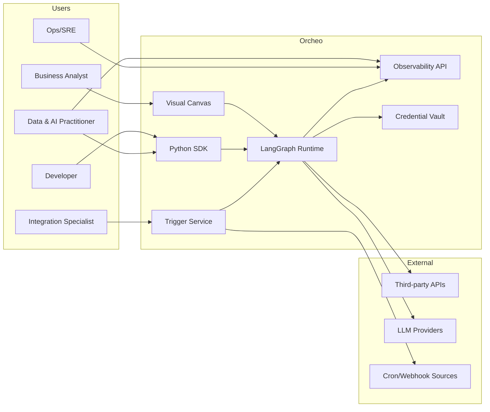
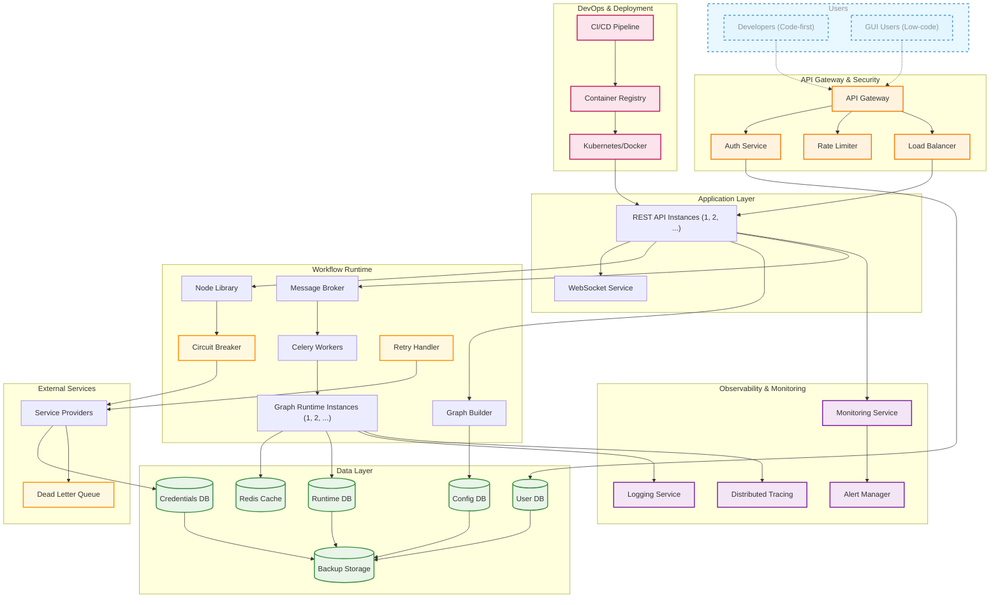

# Software Design Description
## For Orcheo – Hybrid Workflow Automation Platform

Version 1.0
Prepared by Codex
Orcheo Development Team
27 Sep 2025

Table of Contents
=================
* [Revision History](#revision-history)
* 1 [Introduction](#1-introduction)
  * 1.1 [Document Purpose](#11-document-purpose)
  * 1.2 [Product Scope](#12-product-scope)
  * 1.3 [Definitions, Acronyms and Abbreviations](#13-definitions-acronyms-and-abbreviations)
  * 1.4 [References](#14-references)
  * 1.5 [Document Overview](#15-document-overview)
* 2 [Design](#2-overall-description)
  * 2.1 [Stakeholder Concerns](#21-stakeholder-concerns)
  * 2.2 [Selected Viewpoints](#22-selected-viewpoints)
    * 2.2.1 [Context](#221-context)
    * 2.2.2 [Composition](#222-composition)
    * 2.2.3 [Logical](#223-logical)
    * 2.2.4 [Dependency](#224-dependency)
    * 2.2.5 [Information](#225-information)
    * 2.2.6 [Patterns](#226-patterns)
    * 2.2.7 [Interface](#227-interface)
    * 2.2.8 [Structure](#228-structure)
    * 2.2.9 [Interaction](#229-interaction)
    * 2.2.10 [State dynamics](#2210-state-dynamics)
    * 2.2.11 [Algorithm](#2211-algorithm)
    * 2.2.12 [Resources](#2212-resources)
    * 2.2.13 [Physical](#2213-physical)
    * 2.2.14 [Deployment](#2214-deployment)
    * 2.2.15 [Concurrency](#2215-concurrency)
    * 2.2.16 [Behavioral](#2216-behavioral)
  * 2.3 [Design Views](#23-views)
* 3 [Appendixes](#3-appendixes)

## Revision History
| Name | Date | Reason For Changes | Version |
| ---- | ---- | ------------------ | ------- |
| Codex | 27 Sep 2025 | Initial SDD aligned with PRD v1.0 | 0.1 |

## 1. Introduction

### 1.1 Document Purpose
This Software Design Description (SDD) documents the architectural approach for Orcheo, a hybrid workflow automation platform that merges a low-code visual experience with a code-first SDK. It targets engineering, product, and operations stakeholders who require a shared understanding of system responsibilities prior to implementation.

### 1.2 Product Scope
Orcheo delivers a unified automation surface where visual designers can assemble workflows while developers extend capabilities through a Python SDK built atop LangGraph. Core scope includes: dual-mode workflow authoring, secure credential management, real-time observability, robust trigger handling, and an extensible node ecosystem. The initial release focuses on reliable backend execution, governed integrations, and instrumentation that supports AI-native workflows.

### 1.3 Definitions, Acronyms and Abbreviations
- **AI Node**: A workflow node that encapsulates model prompting, inference, and downstream decision logic.
- **Credential Vault**: Managed service for storing, rotating, and injecting scoped secrets into runtime executions.
- **Flow Canvas**: Visual designer for assembling automation graphs without writing code.
- **LangGraph**: Underlying orchestration framework that powers code-first workflow graphs.
- **Node Library**: Curated catalog of reusable workflow nodes, spanning task automation and AI-powered steps.
- **Run Artifact**: Persisted execution output (logs, prompts, responses, metrics) available for replay and analysis.
- **Trigger**: Workflow entry point driven by webhooks, schedules, or API events.

### 1.4 References
- **Product Requirements Document**: ["Orcheo – Hybrid Workflow Automation Platform PRD" (prd.md)](../prd.md), version 1.0, dated 6 Sep 2025.
- **Roadmap**: ["Orcheo Roadmap" (roadmap.md)](../roadmap.md), last updated 28 Sep 2025.
- **Design document template**: https://github.com/jam01/SDD-Template/blob/master/template.md

### 1.5 Document Overview
Section 2 details design considerations across stakeholder concerns, viewpoints, and specific architectural views. It captures the domain context, component boundaries, operational behaviors, and deployment model that satisfy PRD-specified goals. Section 3 enumerates appendixes and open follow-ups.

## 2. Overall Description

### 2.1 Stakeholder Concerns
| Stakeholder | Primary Concerns | Addressed In |
| ----------- | ---------------- | ------------ |
| Developer-platform engineers | Typed SDK, custom node lifecycle, integration safety, deployment parity | Sections 2.2.2, 2.2.7, 2.2.14 |
| Operations & integration specialists | Reliable triggers, credential governance, observability, failure handling | Sections 2.2.4, 2.2.5, 2.2.9 |
| Data & AI practitioners | Multi-model orchestration, reproducibility, artifact tracking | Sections 2.2.3, 2.2.10, 2.3.2 |
| Business & GTM owners | Low-code authoring, template-driven onboarding, monitored executions | Sections 2.2.1, 2.2.8, 2.3.3 |
| Security & compliance reviewers | Access control, secret isolation, auditability | Sections 2.2.4, 2.2.12, 2.2.13 |
| Product management | Roadmap increments, risk mitigation, rollout phases | Sections 2.2.6, 2.3.4, 3 |

### 2.2 Selected Viewpoints
This SDD adopts viewpoints that map to PRD priorities for dual authoring modes, secure runtime execution, and AI-centric observability. Less critical viewpoints for the initial milestone are documented with current assumptions and deferred work.

#### 2.2.1 Context
The platform exposes a backend-first service accessible by SDK users and canvas users. External actors include service providers invoked by workflow nodes, credential issuers, and observability consumers. The primary system boundary wraps API gateway, application services, workflow runtime, data stores, and monitoring plane.

#### 2.2.2 Composition
The solution is decomposed into gateway/security edge, application tier (REST & WebSocket APIs), workflow runtime (LangGraph execution, task orchestration), data stores (configuration, runtime history, credentials), and observability services. A frontend canvas consumes backend APIs but is optional for SDK-centric deployments.

#### 2.2.3 Logical
Logical structure centers on bounded contexts: Workflow Authoring, Workflow Execution, Credential Management, and Observability. SDK and canvas both translate workflows into a normalized graph specification persisted in the Config store. Execution components load graphs, resolve credentials at runtime, and emit artifacts to observability sinks.

#### 2.2.4 Dependency
Core dependencies include LangGraph runtime, message broker for asynchronous work distribution, Celery workers for task execution, and backing databases (PostgreSQL for configuration/runtime, Redis for caching). External integrations rely on service provider APIs reached through hardened connectors governed by the credential vault.

#### 2.2.5 Information
Configuration data (workflow graphs, node metadata) is stored in the Config DB with versioning. Runtime data (execution logs, run status, artifacts) resides in a dedicated Runtime DB. Credentials remain in an encrypted store with scoped access tokens. Observability data flows to logging, monitoring, tracing, and alerting pipelines to satisfy per-run introspection requirements.

#### 2.2.6 Patterns
Key patterns include event-driven orchestration (message broker + workers), circuit breaker with retry handling for external calls, and strategy pattern for node execution engines (AI nodes vs. deterministic tasks). Infrastructure follows a layered onion architecture to maintain separation between API, orchestration, and persistence concerns.

#### 2.2.7 Interface
External interfaces comprise REST APIs for workflow management, credential administration, and execution control; WebSockets for live trace streaming; and SDK abstractions that wrap these endpoints in typed Python clients. Key backend entry points include `POST/GET/PUT/DELETE /workflows` for CRUD operations, a `POST /workflows/import-python` endpoint that accepts LangGraph-compatible Python scripts and registers their graph definitions, `POST /workflows/{id}/execute` plus `GET/DELETE /executions/{id}` for run coordination, and WebSocket streaming on `/ws/executions/{id}` for live telemetry. The SDK now layers an `HttpWorkflowExecutor` helper on top of the REST API, using `httpx` with exponential backoff, retryable status detection, and automatic bearer token headers to simplify triggering runs from code-first clients. Integrations expose connector interfaces that standardize authentication handshakes and payload schemas.

#### 2.2.8 Structure
The system enforces clear separation between presentation (canvas, SDK CLI), application services (FastAPI endpoints), and execution runtime. Shared libraries define graph schemas and node contracts, ensuring parity between visual and code-based authoring. Feature flags gate beta functionality per rollout phase.

#### 2.2.9 Interaction
Typical interactions include: (1) authoring a workflow via canvas or SDK, where SDK authors can push LangGraph Python scripts directly to the backend importer before persistence; (2) triggering a run through webhook or schedule; (3) runtime execution dispatching tasks through brokers/workers; (4) observability plane streaming updates to clients. Failure scenarios invoke retry handlers, circuit breakers, and dead-letter queues.

#### 2.2.10 State dynamics
Workflow runs transition through states Draft → Validated → Scheduled → Running → Succeeded/Failed → Archived. Credential secrets track Issued → Active → Rotating → Revoked lifecycle. Node executions surface intermediate states (Pending, Executing, Retrying) to support replay and audit requirements.

#### 2.2.11 Algorithm
Scheduling logic prioritizes trigger queues with configurable backoff, supports idempotent webhook handling, and enforces concurrency limits per workflow. AI node execution applies guarded prompt templating, token budget enforcement, and decision branches to handle model responses. Retry algorithms implement exponential backoff with circuit-breaker thresholds.

#### 2.2.12 Resources
Compute resources include API instances, WebSocket service, and worker pools sized based on workflow volume tiers. Redis cache accelerates graph resolution and credential token lookups. Storage uses managed databases with automated backups routed to cold storage for disaster recovery.

#### 2.2.13 Physical
Initial deployment targets managed cloud infrastructure (Kubernetes-based) across primary region clusters with redundancy for databases and caches. Credential storage uses dedicated secret management infrastructure with hardware security module (HSM) backing when available.

#### 2.2.14 Deployment
CI/CD pipelines build container images, run automated tests, and deploy to orchestrated clusters via progressive rollouts. Feature toggles allow dark-launch of new nodes. Separate environments (dev, staging, production) ensure credential segregation and observability configuration per environment.

#### 2.2.15 Concurrency
Workflow runs execute concurrently across worker pools while honoring per-workflow and per-user limits. Shared resources like credential tokens are locked via optimistic concurrency and scoped leases. WebSocket sessions stream updates per run without blocking API threads by leveraging async event loops.

#### 2.2.16 Behavioral
Behavioral expectations follow PRD goals: visual edits update backend configuration once the user saves changes (auto-save remains a potential future enhancement); SDK commits remain version-controlled; triggers guarantee at-least-once execution; observability delivers near real-time run telemetry; failures raise alerts aligned with operational SLAs.

#### 2.2.17 LangGraph Script Guardrails
LangGraph ingestion now enforces explicit safety and performance guardrails beyond FastAPI defaults. Scripts larger than 128 KiB (measured post UTF-8 encoding) are rejected early to avoid allocator pressure and abuse from oversized submissions. Execution is wrapped in a sixty-second wall-clock timeout that interrupts unbounded loops to prevent ingestion workers from hanging under denial-of-service attempts. Additionally, compiled bytecode is cached across identical script bodies so repeat imports avoid redundant RestrictedPython compilation, lowering latency for common iteration loops without sacrificing isolation.

### 2.3 Views
This section captures concrete views derived from the selected viewpoints.

#### 2.3.1 Context & Deployment View
The following paired views first anchor Orcheo within its environment and then detail the runtime and platform topology that satisfies those interactions.

- Business-facing analysts depend on the visual canvas for low-code authoring, while developers and data & AI practitioners extend workflows through the SDK against the same runtime contracts and lean on observability for reproducibility.
- Integration specialists configure trigger policies that bridge scheduling systems with the LangGraph runtime, and operations teams rely on observability APIs for live telemetry.
- External systems comprise third-party SaaS APIs, LLM providers, and event sources that drive triggers; the credential vault mediates secure access for runtime executions.

The deployment diagram that follows elaborates on how those responsibilities map onto specific services and infrastructure components.

Key design notes:
- Gateway layer centralizes authentication, rate limiting, and load balancing to enforce security controls before workflows interact with core services.
- Workflow runtime isolates compute-heavy execution paths from request/response APIs, supporting elastic scaling for AI workloads and long-running automations.
- Observability plane subscribes to runtime events, enabling the execution viewer and alerting commitments in the PRD.

#### 2.3.2 Authoring & Runtime View
The front-end ecosystem extends the backend through a modular canvas, ensuring parity with SDK-authored workflows while preserving runtime governance.

```mermaid
graph TD
    subgraph "User Interface Layer"
        AuthUI[Authentication UI]
        Dashboard[Dashboard]
        CanvasUI[Workflow Canvas UI]
        SettingsUI[Settings UI]
    end

    subgraph "Core Modules"
        AuthModule[Authentication Module]
        CanvasModule[Workflow Canvas]
        NodeLibraryModule[Node Library]
        TracesModule[Traces & Monitoring]
        ConfigModule[Configuration Module]
    end

    subgraph "Node & Graph Management"
        NodeEditor[Node Editor]
        AgenticTools[Agentic Tools Manager]
        SubgraphConfig[Sub-graph Configuration]
        GraphConfig[Graph Configuration]
        NodeRegistry[Node Registry]
    end

    subgraph "API Communication"
        APIClient[API Client]
        WebSocketClient[WebSocket Client]
        AuthService[Auth Service]
        WorkflowService[Workflow Service]
        NodeService[Node Service]
    end

    subgraph "Utilities & Services"
        ValidationService[Validation Service]
        CacheService[Cache Service]
        EventBus[Event Bus]
        NotificationService[Notification Service]
        ThemeService[Theme Service]
    end

    %% UI to Module connections
    AuthUI --> AuthModule
    Dashboard --> TracesModule
    CanvasUI --> CanvasModule
    CanvasUI --> NodeLibraryModule
    SettingsUI --> ConfigModule

    %% Module to Node/Graph Management
    CanvasModule --> NodeEditor
    CanvasModule --> GraphConfig
    NodeLibraryModule --> NodeRegistry
    NodeEditor --> AgenticTools
    NodeEditor --> SubgraphConfig
    ConfigModule --> GraphConfig

    %% API Communication connections
    AuthModule --> AuthService
    CanvasModule --> WorkflowService
    NodeLibraryModule --> NodeService
    TracesModule --> WebSocketClient
    AuthService --> APIClient
    WorkflowService --> APIClient
    NodeService --> APIClient
    NodeService --> WebSocketClient

    %% Utilities connections
    NodeEditor --> ValidationService
    GraphConfig --> ValidationService
    APIClient --> CacheService
    TracesModule --> NotificationService
    CanvasModule --> EventBus
    AuthModule --> ThemeService

    %% Backend connection
    APIClient -.->|REST API| Backend[Backend APIs]
    WebSocketClient -.->|WebSocket| Backend

    %% Styling
    classDef uiNodes fill:#e3f2fd,stroke:#1976d2,stroke-width:2px
    classDef coreNodes fill:#f3e5f5,stroke:#7b1fa2,stroke-width:2px
    classDef nodeNodes fill:#fff3e0,stroke:#f57c00,stroke-width:2px
    classDef apiNodes fill:#fff8e1,stroke:#ff8f00,stroke-width:2px
    classDef utilityNodes fill:#fce4ec,stroke:#c2185b,stroke-width:2px
    classDef backendNodes fill:#f5f5f5,stroke:#616161,stroke-width:2px,stroke-dasharray: 5 5

    class AuthUI,Dashboard,CanvasUI,SettingsUI uiNodes
    class AuthModule,CanvasModule,NodeLibraryModule,TracesModule,ConfigModule coreNodes
    class NodeEditor,AgenticTools,SubgraphConfig,GraphConfig,NodeRegistry nodeNodes
    class APIClient,WebSocketClient,AuthService,WorkflowService,NodeService apiNodes
    class ValidationService,CacheService,EventBus,NotificationService,ThemeService utilityNodes
    class Backend backendNodes
```

Key design notes:
- Canvas and SDK share schema validation services to maintain a single source of truth for workflow structures.
- WebSocket streaming backs the execution viewer, enabling AI practitioners to trace prompt/response cycles per node.
- Node registry and agentic tools support extensibility goals, enabling contribution of new nodes without UI rewrites.

#### 2.3.3 Runtime Behavior View
- **Trigger handling**: Webhooks enqueue events in the message broker with deduplication keys; cron schedules feed into the same queue through a scheduler service.
- **Credential injection**: Vault tokens are resolved at execution start; tokens are scoped to the run and destroyed upon completion or failure.
- **Credential health**: An OAuth-aware vault service refreshes expiring tokens, tracks validation status, and blocks workflow dispatch until credentials are healthy; operators can inspect and trigger health checks via dedicated REST endpoints.
- **Observability pipeline**: Workers emit structured logs, metrics, and traces, which drive alerts per SLAs defined in the PRD.
- **Failure management**: Circuit breakers short external calls after threshold breaches, routing payloads to the dead-letter queue for manual intervention.

#### 2.3.4 Risk & Mitigation View
- **LangGraph complexity**: Progressive rollout with reference workflows and developer documentation; spike time allocated for complex agentic nodes.
- **Canvas performance**: Early load testing of large graphs, virtualized rendering, and incremental persistence to avoid data loss.
- **Credential security**: Zero-trust access controls, audit logging for secret access, periodic rotation enforced via platform policies.
- **Adoption hurdles**: Template library and guided onboarding for business users; SDK examples and CI hooks for developers.

## 3. Appendixes
- **Open Questions**: Finalize credential vault vendor; determine artifact retention policy for AI-generated content.
- **Future Enhancements**: Workflow marketplace, team workspaces, on-prem deployment alignment with roadmap milestones.
