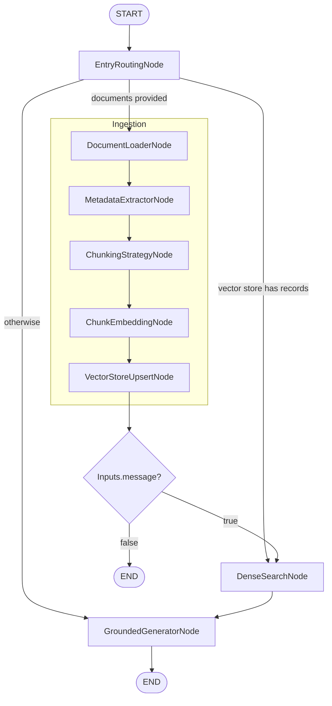

# Demo 1: Basic RAG Pipeline

A LangGraph workflow that can answer questions with or without uploaded documents. The graph conditionally routes through ingestion (load → metadata → chunk → embed) when files are present, performs semantic search when chunks exist in the shared `InMemoryVectorStore`, and otherwise falls back to direct generation.

## Highlights
- **Entry routing**: `EntryRoutingNode` inspects the current request plus vector store state to choose ingestion, search-only, or direct generation.
- **Configurable ingestion**: `DocumentLoaderNode`, `MetadataExtractorNode`, `ChunkingStrategyNode`, `ChunkEmbeddingNode`, and `VectorStoreUpsertNode` are parameterized through `DEFAULT_CONFIG`.
- **Semantic search**: `DenseSearchNode` queries the in-memory store with adjustable `top_k` and score threshold.
- **Grounded generation**: `GroundedGeneratorNode` (OpenAI `gpt-4o-mini`) produces inline-cited answers using retrieved chunks or handles non-RAG prompts when no context exists.

## Requirements
1. Install dependencies: `uv sync --all-groups` (this installs the new `examples` dependency group so the `orcheo-backend` package is available for the vault helpers). If you already have the base dependencies, you can instead run `uv sync --group examples`.
2. Create an OpenAI credential for the generator node:
   ```bash
   orcheo credential create openai_api_key --secret sk-your-key
   ```
   The script relies on the Orcheo vault (`~/.orcheo/vault.sqlite` by default) via `setup_credentials()`.

## Running Locally
```bash
python examples/conversational_search/demo_1_basic_rag/demo.py
```
The script automatically executes two passes:
1. **Non-RAG phase** – Runs the compiled graph before any documents are indexed to show direct answering.
2. **RAG phase** – Creates a temporary file, ingests it, and re-runs the graph to demonstrate retrieval + grounded generation.

## Deploying to Orcheo
- Upload `demo.py` to your workspace; the platform picks up `build_graph()` and `DEFAULT_CONFIG`.
- Invoke through the console or API:
  - Provide `documents` (with `storage_path`) plus a `message` to trigger ingestion/search.
  - Provide only `message` for non-RAG generation; if the vector store already has chunks from previous runs, the entry router will still perform search.

## Inputs
```python
# With documents (RAG)
{
    "inputs": {
        "documents": [
            {
                "storage_path": "/abs/path/document.txt",
                "source": "document.txt",
                "metadata": {"category": "tech"},
            }
        ],
        "message": "What is Orcheo?",
    }
}

# Without documents (non-RAG)
{
    "inputs": {
        "message": "What is the capital of France?"
    }
}
```

## Configuration (DEFAULT_CONFIG)
```python
DEFAULT_CONFIG = {
    "ingestion": {
        "chunking": {
            "chunk_size": 512,
            "chunk_overlap": 64,
        },
    },
    "retrieval": {
        "search": {
            "top_k": 5,
            "similarity_threshold": 0.0,
        },
    },
}
```
Override these values when calling the workflow to tune chunk granularity or recall/precision.

## Workflow

- `entry_router` is implemented with a `Switch` edge.
- `post_ingestion_router` (an `IfElse` edge) ensures queries exist before searching; otherwise the run ends after indexing.

## Expected Outputs
`GroundedGeneratorNode`'s response is exposed through the `generator` result, e.g.:
```python
{
    "reply": "Orcheo is a workflow orchestration platform...",
    "citations": [
        {
            "id": "1",
            "snippet": "Orcheo is a powerful workflow orchestration platform...",
            "sources": ["document.txt"],
        }
    ],
    "tokens_used": 156,
    "mode": "rag",
}
```
When no document context exists the `citations` list is empty and `mode` is `non_rag`.

## Next Steps
- Adjust `chunk_size` / `chunk_overlap` for different file types.
- Experiment with `top_k` and `similarity_threshold` to balance precision and latency.
- Swap `GroundedGeneratorNode` arguments to point at other providers or models via Orcheo credentials.
- Persist embeddings in a durable vector store implementation instead of the in-memory default for multi-session recall.
