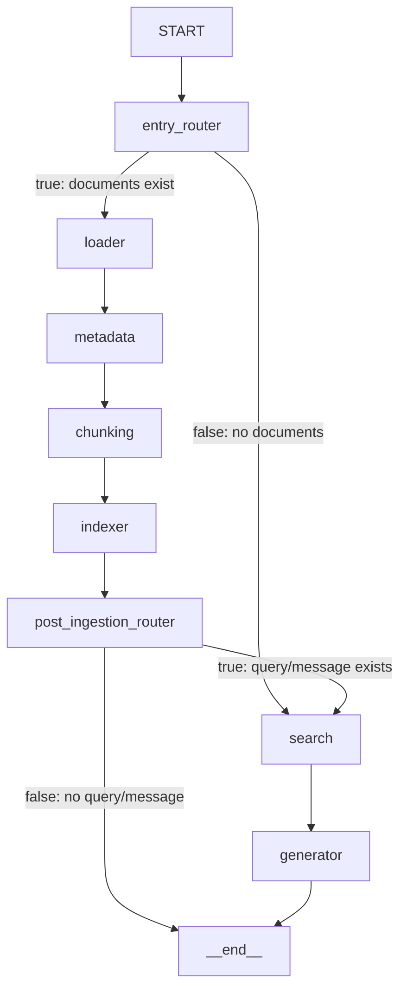

# Dataflow Documentation: Basic RAG Demo

## Overview

This document describes the complete dataflow when a user adds a textual attachment and sends a message, from input to response generation in the Basic RAG (Retrieval-Augmented Generation) demo.

## High-Level Flow

```
File Upload → ChatKit Upload Endpoint → Attachment Store → User Input → Entry Router (IfElseNode) → [Ingestion Pipeline] → Post-Ingestion Router (IfElseNode) → [Search Pipeline] → Response
```

## Detailed Step-by-Step Dataflow

### Phase 0: File Upload (ChatKit)

**File:** [chatkit.py:552-639](../../../apps/backend/src/orcheo_backend/app/routers/chatkit.py#L552-L639)

**Purpose:** Handle file attachment before message submission

**Frontend Configuration:**
- Accepted formats: `.txt`, `.md`, `.json`, `.csv`, `.log`
- Max size: 5MB per file
- Max count: 10 files

**Processing:**
1. User selects file(s) in ChatKit composer
2. Files are uploaded to `/api/chatkit/upload` endpoint
3. Backend validates file encoding (UTF-8 or latin-1)
4. Generates unique attachment ID: `atc_{8_hex_chars}`
5. Stores file on disk at `CHATKIT_STORAGE_PATH` (default: `~/.orcheo/chatkit/`)
   - Filename format: `{attachment_id}_{original_filename}`
6. Creates `FileAttachment` object with:
   - `id`: Generated attachment ID
   - `name`: Original filename
   - `mime_type`: Content type (e.g., "text/plain")
7. Saves attachment metadata to ChatKit server's attachment store
8. Returns metadata to frontend:
   ```json
   {
     "id": "atc_abc12345",
     "name": "document.txt",
     "mime_type": "text/plain",
     "type": "file",
     "size": 1234,
     "storage_path": "~/.orcheo/chatkit/atc_abc12345_document.txt"
   }
   ```

**Important:** At this stage, the document is stored on disk and metadata is saved in the ChatKit attachment store, but the file **content is not returned** to the frontend. Content extraction happens later in DocumentLoaderNode during workflow execution to avoid redundant processing.

---

### Phase 1: User Input (Workflow Invocation)

**Input Format:**
```python
{
    "inputs": {
        "documents": [
            {
                "storage_path": "~/.orcheo/chatkit/atc_abc12345_document.txt",
                "source": "document.txt",
                "metadata": {"key": "value"}
            }
        ],
        "message": "User's query text"
    }
}
```

**Note:** The `content` field is **not** included at this stage. DocumentLoaderNode will read the content from `storage_path`.

**How Attachments Reach the Workflow:**
1. User sends message with attached file(s)
2. ChatKit includes attachment metadata (including `storage_path`) in the workflow request
3. Workflow receives document metadata in `inputs.documents` (without content)
4. DocumentLoaderNode reads file content from `storage_path` during execution

**State Structure:**
- `inputs`: Dictionary containing user-provided data (including document content)
- `results`: Dictionary that accumulates node outputs (using dict_reducer)
- `messages`: Message history (inherited from MessagesState)

---

### Phase 2: Entry Routing Decision (`entry_router` IfElseNode)

**File:** [demo.py:96-104](demo.py#L96-L104)

**Node Type:** IfElseNode (DecisionNode)

**Purpose:** Route workflow based on presence of documents

**Configuration:**
```python
IfElseNode(
    name="entry_router",
    conditions=[
        Condition(
            left="{{inputs.documents}}",
            operator="is_truthy",
        )
    ],
)
```

**Processing:**
1. Evaluates whether `inputs.documents` is truthy (exists and non-empty)
2. Returns branch key: `"true"` or `"false"`
3. Workflow conditional edge maps:
   - `"true"` → Route to **loader** (ingestion pipeline)
   - `"false"` → Route to **search** (skip to retrieval)

**Data Transformation:**
```python
# Input State
{
    "inputs": {
        "documents": [{...}],
        "message": "What is Orcheo?"
    }
}

# Output stored in state.results["entry_router"]
"true"  # Branch key indicating documents are present
```

**Decision:** Since `documents` exists in inputs, evaluates to `"true"` and routes to **loader**

---

### Phase 3: Ingestion Pipeline

#### 3.1 Document Loader Node (`loader`)

**File:** [ingestion.py:85-163](../../src/orcheo/nodes/conversational_search/ingestion.py#L85-L163)

**Purpose:** Normalize raw document payloads into validated Document objects and read content from storage

**Processing:**
1. Extracts documents from `state.inputs.documents`
2. Converts each payload to `RawDocumentInput` (handles strings, dicts, or Document objects)
3. **Reads file content from `storage_path` if provided** (UTF-8 or latin-1 decoding)
4. Generates document IDs (uses provided ID or generates `{node_name}-doc-{index}`)
5. Merges default metadata with document-specific metadata
6. Creates normalized `Document` objects with extracted content

**Data Transformation:**
```python
# Input from state.inputs.documents
RawDocumentInput(
    storage_path="~/.orcheo/chatkit/atc_abc12345_document.txt",
    source="document.txt",
    metadata={...}
)

# DocumentLoaderNode reads content from storage_path
# File content: "Orcheo is a powerful workflow orchestration platform..."

# Output stored in state.results["loader"]
{
    "documents": [
        Document(
            id="loader-doc-0",
            content="Orcheo is a powerful workflow orchestration platform...",
            metadata={"category": "tech"},
            source="document.txt"
        )
    ]
}
```

---

#### 3.2 Metadata Extractor Node (`metadata`)

**File:** [ingestion.py:243-329](../../src/orcheo/nodes/conversational_search/ingestion.py#L243-L329)

**Purpose:** Enrich documents with structured metadata

**Processing:**
1. Retrieves documents from `state.results["loader"]["documents"]`
2. Applies static metadata defaults
3. Appends tags to metadata (if configured)
4. Infers title from first non-empty line if not present
5. Validates required metadata fields

**Data Transformation:**
```python
# Input Document
Document(id="loader-doc-0", content="Orcheo is...", metadata={...})

# Output stored in state.results["metadata"]
{
    "documents": [
        Document(
            id="loader-doc-0",
            content="Orcheo is...",
            metadata={
                "category": "tech",
                "title": "Orcheo is a powerful workflow orchestration platform..."
            },
            source="manual_test"
        )
    ]
}
```

---

#### 3.3 Chunking Strategy Node (`chunking`)

**File:** [ingestion.py:142-234](../../src/orcheo/nodes/conversational_search/ingestion.py#L142-L234)

**Configuration:**
- `chunk_size`: 512 characters
- `chunk_overlap`: 64 characters

**Purpose:** Split documents into overlapping chunks for better retrieval granularity

**Processing:**
1. Retrieves documents from `state.results["metadata"]["documents"]`
2. For each document:
   - Iterates through content with sliding window
   - Creates chunks of max `chunk_size` characters
   - Overlaps by `chunk_overlap` characters
   - Assigns sequential index to each chunk
   - Generates chunk ID: `{document_id}-chunk-{index}`
   - Merges document metadata with chunk-specific metadata

**Data Transformation:**
```python
# Input Document (185 chars)
Document(id="loader-doc-0", content="Orcheo is a powerful workflow...")

# Output stored in state.results["chunking"]
{
    "chunks": [
        DocumentChunk(
            id="loader-doc-0-chunk-0",
            document_id="loader-doc-0",
            index=0,
            content="Orcheo is a powerful workflow...",
            metadata={
                "document_id": "loader-doc-0",
                "chunk_index": 0,
                "source": "manual_test",
                "category": "tech",
                "title": "Orcheo is..."
            }
        )
        # Additional chunks if content exceeds 512 chars
    ]
}
```

---

#### 3.4 Embedding Indexer Node (`indexer`)

**File:** [ingestion.py:340-428](../../src/orcheo/nodes/conversational_search/ingestion.py#L340-L428)

**Purpose:** Generate embeddings and store in vector store

**Processing:**
1. Retrieves chunks from `state.results["chunking"]["chunks"]`
2. Validates required metadata keys (`document_id`, `chunk_index`)
3. Extracts text content from each chunk
4. Calls embedding function to generate vectors
   - **Default:** Uses `deterministic_embedding_function` (SHA256-based)
   - Converts text → SHA256 hash → first 16 bytes as floats in [0,1]
5. Creates `VectorRecord` objects combining:
   - Chunk ID
   - Embedding vector (16 dimensions)
   - Original text content
   - Chunk metadata
6. Upserts records to vector store (in-memory dictionary)

**Embedding Function:**
```python
# File: ingestion.py:28-36
def deterministic_embedding_function(texts):
    for text in texts:
        digest = hashlib.sha256(text.encode("utf-8")).digest()
        vector = [byte / 255.0 for byte in digest[:16]]
```

**Data Transformation:**
```python
# Input Chunk
DocumentChunk(id="loader-doc-0-chunk-0", content="Orcheo is...")

# Output stored in state.results["indexer"]
{
    "indexed": 1,
    "ids": ["loader-doc-0-chunk-0"],
    "namespace": None
}

# Stored in InMemoryVectorStore.records
{
    "loader-doc-0-chunk-0": VectorRecord(
        id="loader-doc-0-chunk-0",
        values=[0.423, 0.891, ...],  # 16-dim vector
        text="Orcheo is a powerful workflow...",
        metadata={
            "document_id": "loader-doc-0",
            "chunk_index": 0,
            "source": "manual_test",
            "category": "tech"
        }
    )
}
```

---

#### 3.5 Post-Ingestion Router (`post_ingestion_router` IfElseNode)

**File:** [demo.py:107-120](demo.py#L107-L120)

**Node Type:** IfElseNode (DecisionNode)

**Purpose:** Determine if search should be performed after ingestion

**Configuration:**
```python
IfElseNode(
    name="post_ingestion_router",
    conditions=[
        Condition(
            left="{{inputs.query}}",
            operator="is_truthy",
        ),
        Condition(
            left="{{inputs.message}}",
            operator="is_truthy",
        ),
    ],
    condition_logic="or",
)
```

**Processing:**
1. Evaluates whether `inputs.query` OR `inputs.message` is truthy
2. Uses `"or"` logic to combine conditions (either condition can be true)
3. Returns branch key: `"true"` or `"false"`
4. Workflow conditional edge maps:
   - `"true"` → Route to **search** (query/message present)
   - `"false"` → Route to **__end__** (ingestion-only mode)

**Data Transformation:**
```python
# Input State
{
    "inputs": {
        "documents": [{...}],
        "message": "What is Orcheo?"
    }
}

# Output stored in state.results["post_ingestion_router"]
"true"  # Branch key indicating query/message is present
```

**Decision:** Since `message` exists in inputs, evaluates to `"true"` and routes to **search**

**Note:** The router accepts both `query` and `message` keys using OR logic. This maintains compatibility with ChatKit (which sends `message`) while supporting explicit `query` fields in other contexts.

---

### Phase 4: Search Pipeline

#### 4.1 Vector Search Node (`search`)

**File:** [retrieval.py:37-109](../../src/orcheo/nodes/conversational_search/retrieval.py#L37-L109)

**Configuration:**
- `top_k`: 5 results
- `score_threshold`: 0.0 (no filtering)

**Purpose:** Retrieve most relevant chunks using semantic similarity

**Processing:**
1. Extracts query from `state.inputs["query"]` or falls back to `state.inputs["message"]`
2. Validates query is non-empty string
3. Embeds the query text:
   - Uses same embedding function as indexing
   - Generates 16-dimensional vector from query
4. Calls vector store search:
   - Computes cosine similarity between query vector and all stored chunk vectors
   - Sorts by similarity score (descending)
   - Returns top 5 results
5. Filters results by score_threshold
6. Normalizes results into `SearchResult` objects

**Cosine Similarity Calculation:**
```python
# File: vector_store.py:80-98
def _cosine_similarity(query_vec, chunk_vec):
    dot_product = sum(q * c for q, c in zip(query_vec, chunk_vec))
    query_norm = sqrt(sum(q * q for q in query_vec))
    chunk_norm = sqrt(sum(c * c for c in chunk_vec))
    return dot_product / (query_norm * chunk_norm)
```

**Data Transformation:**
```python
# Input
query = "What is Orcheo?"
query_embedding = [0.312, 0.745, ...]  # 16-dim vector

# Vector Store Search
# Compares query vector against all stored chunk vectors
# Returns top 5 by cosine similarity

# Output stored in state.results["search"]
{
    "results": [
        SearchResult(
            id="loader-doc-0-chunk-0",
            score=0.923,  # Cosine similarity score
            text="Orcheo is a powerful workflow orchestration platform...",
            metadata={
                "document_id": "loader-doc-0",
                "chunk_index": 0,
                "source": "manual_test",
                "category": "tech"
            },
            source="vector",
            sources=["vector"]
        ),
        # Up to 4 more results
    ]
}
```

---

#### 4.2 Grounded Generator Node (`generator`)

**File:** [generation.py:44-196](../../src/orcheo/nodes/conversational_search/generation.py#L44-L196)

**Configuration:**
- `max_tokens`: 512
- `temperature`: 0.1
- `citation_style`: "inline"
- `max_retries`: 2

**Purpose:** Generate a grounded response with citations

**Processing:**

1. **Extract Query:**
   - Retrieves query from `state.inputs["query"]` or falls back to `state.inputs["message"]`
   - Validates it's a non-empty string

2. **Resolve Context:**
   - Retrieves search results from `state.results["search"]["results"]`
   - Converts to `SearchResult` objects (top 5 chunks)

3. **Build Prompt:**
   ```python
   # File: generation.py:127-137
   system_prompt + "\n\n" +
   "Question: {query}\n" +
   "Context:\n" +
   "[1] {chunk_1_text}\n" +
   "[2] {chunk_2_text}\n" +
   "...\n\n" +
   "Cite sources in inline style using the provided identifiers."
   ```

4. **Generate Response:**
   - Calls LLM (or default mock function)
   - **Default behavior:** Returns placeholder text
   - Real implementation would call OpenAI/Anthropic
   - Retries up to 2 times with exponential backoff on failure

5. **Build Citations:**
   ```python
   # File: generation.py:167-179
   citations = [
       {
           "id": "1",
           "source_id": "loader-doc-0-chunk-0",
           "snippet": "Orcheo is a powerful workflow...",  # Truncated to 160 chars
           "sources": ["vector"]
       },
       # One per search result
   ]
   ```

6. **Attach Citations:**
   - For inline style: `"{response} [1] [2] [3] [4] [5]"`
   - For footnote style: `"{response}\n\nFootnotes: [1] [2] [3] [4] [5]"`
   - For endnote style: `"{response}\n\nEndnotes: [1] [2] [3] [4] [5]"`

7. **Estimate Token Usage:**
   - Simple word-based counting: `len((prompt + completion).split())`

**Data Transformation:**
```python
# Input Context (from search)
results = [
    SearchResult(id="...", score=0.923, text="Orcheo is...", ...),
    SearchResult(id="...", score=0.847, text="It allows users...", ...),
    # 3 more results
]

# Output stored in state.results["generator"]
{
    "response": "Orcheo is a powerful workflow orchestration platform built on LangGraph. It allows users to create, manage, and execute complex workflows combining AI nodes, task nodes, and external integrations. [1] [2] [3] [4] [5]",
    "citations": [
        {
            "id": "1",
            "source_id": "loader-doc-0-chunk-0",
            "snippet": "Orcheo is a powerful workflow orchestration platform built on LangGraph. It allows users to create, manage, and execute complex workflows combining AI nodes…",
            "sources": ["vector"]
        },
        # 4 more citations
    ],
    "tokens_used": 87,
    "citation_style": "inline"
}
```

---

### Phase 5: Final State

**Complete State Structure:**
```python
{
    "inputs": {
        "documents": [...],      # Original document attachment
        "message": "What is Orcheo?"
    },
    "results": {
        "loader": {
            "documents": [Document(...)]
        },
        "metadata": {
            "documents": [Document(with enriched metadata)]
        },
        "chunking": {
            "chunks": [DocumentChunk(...)]
        },
        "indexer": {
            "indexed": 1,
            "ids": ["loader-doc-0-chunk-0"],
            "namespace": None
        },
        "search": {
            "results": [SearchResult(...), ...]  # Top 5 matches
        },
        "generator": {
            "response": "Grounded answer with [1] [2] citations",
            "citations": [{...}, ...],
            "tokens_used": 87,
            "citation_style": "inline"
        }
    },
    "messages": [],  # Inherited from MessagesState
    "structured_response": None
}
```

---

## Key Data Structures

### Document
```python
{
    "id": str,           # Unique identifier
    "content": str,      # Full text content
    "metadata": dict,    # Arbitrary key-value pairs
    "source": str        # Origin identifier
}
```

### DocumentChunk
```python
{
    "id": str,              # Unique chunk ID
    "document_id": str,     # Parent document ID
    "index": int,           # Chunk sequence number
    "content": str,         # Chunk text (max 512 chars)
    "metadata": dict,       # Merged from document + chunk info
    "token_count": int      # Computed property (word count)
}
```

### VectorRecord
```python
{
    "id": str,           # Chunk ID
    "values": [float],   # 16-dimensional embedding vector
    "text": str,         # Original chunk text
    "metadata": dict     # Chunk metadata
}
```

### SearchResult
```python
{
    "id": str,           # Chunk ID
    "score": float,      # Cosine similarity (0-1)
    "text": str,         # Chunk text
    "metadata": dict,    # Chunk metadata
    "source": str,       # Retriever name ("vector")
    "sources": [str]     # List of contributing retrievers
}
```

---

## Shared Vector Store

**Implementation:** `InMemoryVectorStore` (singleton instance shared across ingestion and retrieval)

**Location:** Created in `build_graph()` function and passed to:
- `ChunkEmbeddingNode` (emits vector records for persistence metadata)
- `VectorStoreUpsertNode` (upserts records into the store)
- `DenseSearchNode` (reads for retrieval)

**Storage:** Dictionary mapping chunk IDs to VectorRecord objects
```python
{
    "loader-doc-0-chunk-0": VectorRecord(...),
    "loader-doc-0-chunk-1": VectorRecord(...),
    # etc.
}
```

**Operations:**
- `upsert(records)`: Stores/updates records by ID
- `search(query, top_k, filter)`: Returns top_k most similar records

---

## Configuration Parameters

### Ingestion Config
```python
{
    "ingestion": {
        "chunking": {
            "chunk_size": 512,       # Max chars per chunk
            "chunk_overlap": 64      # Overlap between chunks
        }
    }
}
```

### Retrieval Config
```python
{
    "retrieval": {
        "search": {
            "top_k": 5,                  # Results to retrieve
            "similarity_threshold": 0.0   # Min score filter
        }
    }
}
```

---

## Performance Characteristics

### Embedding Function
- **Type:** Deterministic SHA256-based (for testing/demo)
- **Dimensions:** 16
- **Speed:** Very fast (no ML inference)
- **Quality:** Low (not semantic, only useful for exact/near-exact matches)

**Note:** In production, replace with:
- OpenAI embeddings (1536 dims)
- Sentence transformers (384-768 dims)
- Custom fine-tuned models

### Vector Store
- **Type:** In-memory dictionary
- **Persistence:** None (data lost on restart)
- **Scalability:** Limited by RAM
- **Search:** O(n) linear scan with cosine similarity

**Note:** In production, replace with:
- Pinecone (cloud vector database)
- Qdrant (self-hosted)
- Weaviate (hybrid search)

---

## Error Handling

### Validation Points
1. **DocumentLoader:** Validates document format, generates IDs
2. **MetadataExtractor:** Validates required metadata fields
3. **Chunking:** Validates chunk_overlap < chunk_size
4. **Indexer:** Validates required metadata keys, embedding dimensions
5. **Search:** Validates non-empty query string
6. **Generator:** Validates non-empty context, retries on failure

### Fallback Behaviors
- **No documents:** Raises ValueError
- **No query:** Routes to __end__ (no search)
- **No search results:** Raises ValueError in generator
- **LLM failure:** Retries with exponential backoff (max 2 retries)

---

## Workflow Graph Structure



**Node Types:**
- **entry_router, post_ingestion_router:** IfElseNode (DecisionNode) - Branching logic nodes
- **loader, metadata, chunking, indexer:** TaskNode subclasses - Data processing nodes
- **search:** DenseSearchNode (TaskNode) - Retrieval node
- **generator:** GroundedGeneratorNode (TaskNode) - Generation node

**Edge Types:**
- **Conditional:** entry_router → {loader, search}, post_ingestion_router → {search, __end__}
- **Direct:** All others

**Branching Nodes:**
- **entry_router:** Evaluates `{{inputs.documents}}` truthiness to route between ingestion and search
- **post_ingestion_router:** Evaluates `{{inputs.query}}` OR `{{inputs.message}}` truthiness to determine if search is needed

---

## Summary

The dataflow follows this sequence:

1. **File Upload:** User uploads document via ChatKit
   - File stored on disk at `CHATKIT_STORAGE_PATH`
   - Metadata (including `storage_path`) returned to frontend
   - **Content is NOT sent to frontend**
2. **Input Processing:** User provides document attachment metadata + message
3. **Entry Routing (IfElseNode):**
   - Evaluates `{{inputs.documents}}` truthiness
   - Routes to ingestion pipeline if documents present, otherwise to search
4. **Document Ingestion:**
   - DocumentLoaderNode reads content from `storage_path`
   - Load and validate documents
   - Extract/enrich metadata
   - Split into overlapping chunks (512 chars, 64 overlap)
   - Generate embeddings (16-dim SHA256-based)
   - Store in vector database
5. **Post-Ingestion Routing (IfElseNode):**
   - Evaluates `{{inputs.query}}` OR `{{inputs.message}}` truthiness using OR logic
   - Routes to search if query/message present, otherwise ends workflow
6. **Retrieval:**
   - Embed user query
   - Find top 5 similar chunks via cosine similarity
7. **Generation:**
   - Build prompt with query + context chunks
   - Generate grounded response (mock/placeholder by default)
   - Attach inline citations [1] [2] [3] [4] [5]
8. **Output:** Final state contains response, citations, and all intermediate results

The entire pipeline is orchestrated by LangGraph with a shared vector store enabling communication between ingestion and retrieval phases. File content extraction is deferred to DocumentLoaderNode to avoid redundant processing before workflow execution. Routing logic is now handled by reusable IfElseNode decision nodes from the logic.branching module, eliminating custom routing functions.
