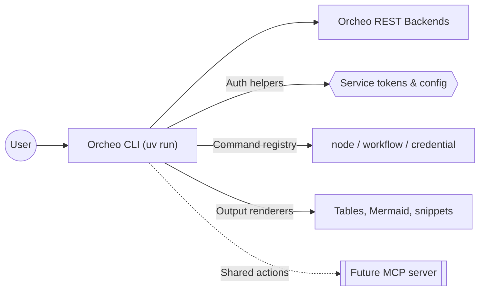

# Orcheo CLI Design

## Purpose

Extend Orcheo's developer tooling with a command-line interface tailored for
LangGraph-first workflows. The CLI gives code-centric teams insight into the
same workflow, node, and credential data that the canvas exposes while staying
aligned with the shared REST APIs and authentication flows.

## Goals

- **Node discovery** – enumerate available nodes, surface metadata (inputs,
  outputs, categories), and filter by tags so developers can quickly find the
  building blocks they need from the terminal.
- **Workflow management** – list, inspect, and trigger workflows that were
  authored via code or canvas. Retrieval includes version history, execution
  status, and the ability to output a Mermaid representation for quick
  visualization in docs or terminals.
- **Credential management** – show credential status, expiry details, and vault
  scopes. Generate reference snippets in the `[[cred_name]]` format to keep CLI
  onboarding aligned with SDK usage.
- **Reference code generation** – scaffold Python snippets that demonstrate how
  to instantiate nodes, set credentials, and run graphs so developers can copy
  and paste working examples.
- **Future MCP packaging** – share the same command implementations via an MCP
  server so AI coding agents can rely on the CLI contract without bespoke
  integrations.

## Non-goals

- Replacing the canvas UX or providing full workflow editing capabilities in
  the terminal. The CLI focuses on inspection, execution, and reference
  generation that augment existing code-first workflows.
- Shipping a custom authentication mechanism. The CLI consumes the service
  token model defined in `authentication_design.md`.

## Command Surface

The CLI adds a new `orcheo` entry point with the following high-level command
groups. For the complete list of available commands, see the
[Available Commands](../README.md#available-commands) section in the README.

Each command uses the existing REST APIs exposed by the backend. Shared helpers
handle:

- Authentication via service tokens shared with the SDK.
- Pagination and table rendering via rich text output.
- Mermaid generation for workflows using the canonical graph definition from
  the backend so the CLI stays consistent with the canvas exports.

## Architecture Overview

Mermaid diagrams will use the default theme to maximize compatibility across renderers.

The CLI will live inside `packages/sdk` to reuse the existing HTTP client,
models, and authentication primitives. A thin `main.py` entry point exposes the
`orcheo` console script while individual command modules focus on API
translation and presentation.

## Implementation Plan

1. **Bootstrap CLI package** – add Typer- or Click-based command registry under
   `packages/sdk/orcheo_sdk/cli/`, wire into `pyproject.toml`, and document
   installation via `uv run orcheo-cli ...`.
2. **Node discovery commands** – call node catalog endpoints, render tables, and
   support filtering flags.
3. **Workflow management commands** – implement list/show/run with Mermaid
   output and execution streaming.
4. **Credential commands** – list credentials, show health, manage create/
   update/delete flows, and output `[[cred_name]]` helper text.
5. **Reference generation** – scaffold Python snippets that import `orcheo-sdk`
   helpers for node instantiation and run triggers.
6. **MCP packaging spike** – prove that the same command registry can be wrapped
   in an MCP server without duplicating business logic.

## Error Handling & Resilience

- **Backend connectivity** – wrap outbound requests with a retry policy (e.g.,
  exponential backoff capped at ~30 seconds) and surface actionable messages
  when the CLI cannot reach the API. Failures fall back to non-zero exit codes
  with guidance to check network access or run in offline mode when supported.
- **Authentication issues** – detect missing or invalid service tokens before
  issuing requests and explain how to refresh tokens via the existing SDK
  helpers. Credential-scoped errors include the credential name so operators can
  rotate or re-issue the `[[cred_name]]` reference quickly.
- **Workflow validation errors** – capture validation responses from the
  backend, display the offending fields, and ensure commands exit with context
  (status code, validation summary, link to docs) so the CLI integrates cleanly
  with CI pipelines.

## Configuration & Environment Support

- **Primary configuration via environment variables** – the CLI reads the
  backend URL from `ORCHEO_API_URL` and the service token from
  `ORCHEO_SERVICE_TOKEN`, matching the SDK's configuration story and enabling
  secure distribution through standard secret managers.
- **Profiles for multiple environments** – optional profiles live in
  `~/.config/orcheo/cli.toml` (or `%APPDATA%\Orcheo\cli.toml` on Windows) where
  developers can define named environments (e.g., `dev`, `staging`, `prod`). The
  active profile can be selected via `--profile` or the `ORCHEO_PROFILE`
  environment variable, with environment variables always taking precedence.
- **Ephemeral overrides** – command flags such as `--api-url` or
  `--service-token` allow one-off overrides without persisting secrets to disk.

## Offline Operation

- **Supported commands** – development workflows continue to function offline:
  `orcheo node list/show`, `orcheo code scaffold`, and rendering previously
  cached workflow definitions remain available without network access.
- **Unsupported commands** – deployment-focused operations (`orcheo workflow`
  run/list/show against live data and all `orcheo credential` mutations)
  require connectivity because they read or mutate server state.
- **Caching model** – the CLI stores read-only metadata from successful online
  sessions in `~/.cache/orcheo/` with timestamps. Offline commands transparently
  serve cached data and warn when the cache is older than 24 hours so users know
  to refresh once reconnected. Cached entries are encrypted at rest using the
  platform's keyring APIs when available to prevent credential leakage.

## Open Questions

- Validate the cache encryption approach on platforms without native keyring
  support.

## Tracking

- Owner: Developer tooling squad
- Target milestone: Milestone 5 (Node Ecosystem & Integrations)
- Status: In progress
