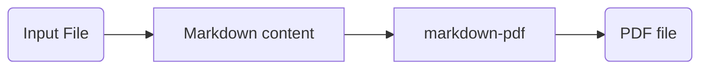
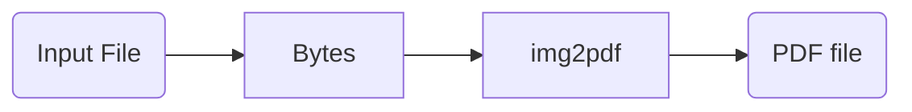
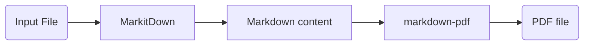
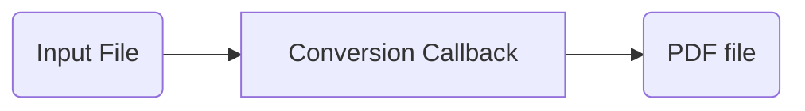

<div align="center">
<h1>PdfItDown</h1>
<h2>Convert Everything to PDF</h2>
</div>
<br>
<div align="center">
    <a href="https://discord.gg/AXcVf269"></a>
</div>
<br>
<div align="center">
    
</div>

**PdfItDown** is a python package that relies on [`markitdown` by Microsoft](https://github.com/microsoft/markitdown/), [`markdown_pdf`](https://github.com/vb64/markdown-pdf) and [img2pdf](https://pypi.org/project/img2pdf/). Visit us on our [documentation website](https://pdfitdown.eu)!

### Applicability

**PdfItDown** is applicable to the following file formats:

- Markdown
- PowerPoint
- Word
- Excel
- HTML
- Text-based formats (CSV, XML, JSON)
- ZIP files (iterates over contents)
- Image files (PNG, JPG)

The format-specific support needs to be evaluated for the specific reader you are using.

### How does it work?

**PdfItDown** works in a very simple way:

- From **markdown** to PDF (default)



- From **image** to PDF (default)



- From other **text-based** file formats or **unstructured** file formats to PDF (default)



- Using a **custom conversion callback**



### Installation and Usage

To install **PdfItDown**, just run:

```bash
pip install pdfitdown
```

You can now use the **command line tool**:

```
Usage: pdfitdown [OPTIONS]

  Convert (almost) everything to PDF

Options:
  -i, --inputfile TEXT   Path to the input file(s) that need to be converted
                         to PDF. Can be used multiple times.
  -o, --outputfile TEXT  Path to the output PDF file(s). If more than one
                         input file is provided, you should provide an equal
                         number of output files.
  -t, --title TEXT       Title to include in the PDF metadata. Default: 'File
                         Converted with PdfItDown'. If more than one file is
                         provided, it will be ignored.
  -d, --directory TEXT   Directory whose files you want to bulk-convert to
                         PDF. If `--inputfile` is also provided, this option
                         will be ignored. Defaults to None.
  --help                 Show this message and exit.
```

An example usage can be:

```bash
pdfitdown -i README.md -o README.pdf -t "README"
```

Or you can use it **inside your python scripts**:

```python
from pdfitdown.pdfconversion import Converter

converter = Converter()
converter.convert(file_path = "business_grow.md", output_path = "business_growth.pdf", title="Business Growth for Q3 in 2024")
converter.convert(file_path = "logo.png", output_path = "logo.pdf")
converter.convert(file_path = "users.xlsx", output_path = "users.pdf")
```

You can also convert **multiple files at once**:

- In the CLI:

```bash
# with custom output paths
pdfitdown -i test0.png -i test1.md -o testoutput0.pdf -o testoutput1.pdf
# with inferred output paths
pdfitdown -i test0.png -i test1.csv
```

- In the Python API:

```python
from pdfitdown.pdfconversion import Converter

converter = Converter()
# with custom output paths
converter.multiple_convert(file_paths = ["business_growth.md", "logo.png"], output_paths = ["business_growth.pdf", "logo.pdf"])
# with inferred output paths
converter.multiple_convert(file_paths = ["business_growth.md", "logo.png"])
```

You can bulk-convert **all the files in a directory**:

- In the CLI:

```bash
pdfitdown -d tests/data/testdir
```

- In the Python API:

```python
from pdfitdown.pdfconversion import Converter

converter = Converter()
output_paths = converter.convert_directory(directory_path = "tests/data/testdir")
print(output_paths)
```

In the python API you can also define a **custom callback for the conversion**. In this example, we use Google Gemini to summarize a file and save its content as a PDF:

```python
from pathlib import Path
from pdfitdown.pdfconversion import Converter
from markdown_pdf import MarkdownPdf, Section
from google import genai

client = genai.Client()

def conversion_callback(input_file: str, output_file: str, title: str | None = None, overwrite: bool = True)
    uploaded_file = client.files.upload(file=Path(input_file))
    response = client.models.generate_content(
        model="gemini-2.0-flash",
        contents=["Give me a summary of this file.", uploaded_file],
    )
    content = response.text
    pdf = MarkdownPdf(toc_level=0)
    pdf.add_section(Section(content))
    pdf.meta["title"] = title or "Summary by Gemini"
    pdf.save(output_file)
    return output_fle

converter = Converter(conversion_callback=conversion_callback)
converter.convert(file_path = "business_growth.md", output_path = "business_growth.pdf", title="Business Growth for Q3 in 2024")
```

Moreover, the python API provides you with the possibility of mounting PdfItDown conversion features into a backend server built with Starlette and Starlette-compatible frameworks (such as FastAPI):

```python
from starlette.applications import Starlette
from starlette.requests import Request
from startlette.responses import PlainTextResponse
from starlette.routing import Route
from pdfitdown.pdfconversion import Converter
from pdfitdown.server import mount

async def hello_world(request: Request) -> PlainTextResponse:
    return PlainTextResponse(content="hello world!")

routes = Route("/helloworld", hello_world)
app = Starlette(routes=routes)

app = mount(app, converter=Converter(), path="/conversions/pdf", name="pdfitdown")
```

Now you can send file payloads to the `/conversions/pdf` endpoint through POST requests and get the content of the converted file back, in the response content:

```python
import httpx

with open("file.txt", "rb") as f:
    content = f.read()

files = {"file_upload": ("file.txt", content, "text/plain")}

with httpx.Client() as client:
    response = client.post("http://localhost:80/conversions/pdf", files=files)

    assert response.status_code == 200
    with open("file.pdf", "wb") as f:
        f.write(response.content)
```


### Contributing

Contributions are always welcome!

Find contribution guidelines at [CONTRIBUTING.md](https://github.com/AstraBert/PdfItDown/tree/main/CONTRIBUTING.md)

### License and Funding

This project is open-source and is provided under an [MIT License](https://github.com/AstraBert/PdfItDown/tree/main/LICENSE).

If you found it useful, please consider [funding it](https://github.com/sponsors/AstraBert).
