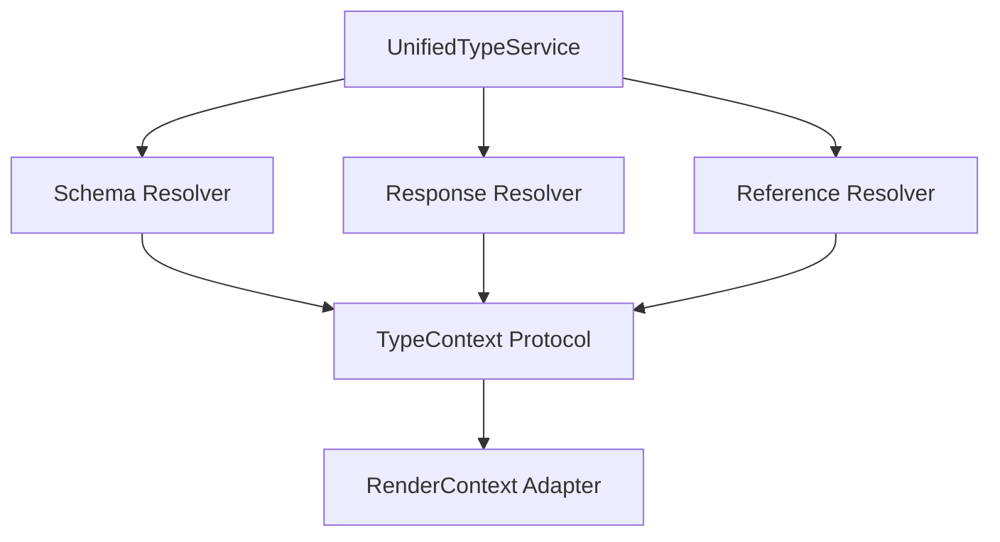

# Unified Type Resolution System

The unified type resolution system (`types/` package) provides a centralized, testable architecture for converting OpenAPI schemas, responses, and references to Python type strings.

## Architecture Overview

The system follows clean architecture principles with clear separation of concerns:



## Key Components

### Services (`types/services/`)

#### `UnifiedTypeService`
Main entry point for all type resolution needs. Provides high-level methods for:
- Schema type resolution
- Operation response type resolution  
- Specific response type resolution

**Usage Example**:
```python
from pyopenapi_gen.types.services import UnifiedTypeService

# Initialize with schemas and responses
type_service = UnifiedTypeService(schemas, responses)

# Resolve schema to Python type
python_type = type_service.resolve_schema_type(
    schema, context, required=True, resolve_underlying=False
)

# Resolve operation response type
response_type = type_service.resolve_operation_response_type(operation, context)

# Get response type with unwrapping info
response_type, was_unwrapped = type_service.resolve_operation_response_with_unwrap_info(
    operation, context
)
```

### Resolvers (`types/resolvers/`)

#### `OpenAPISchemaResolver`
Handles conversion of `IRSchema` objects to Python types:
- Primitive types (string, int, bool, etc.)
- Complex types (objects, arrays)
- Composition types (allOf, oneOf, anyOf)
- Named schema references
- Forward references for circular dependencies

#### `OpenAPIResponseResolver` 
Handles conversion of `IRResponse` objects to Python types:
- Response content schema resolution
- Data unwrapping (extracts `data` field from wrapper responses)
- Streaming response handling
- Response reference resolution

#### `OpenAPIReferenceResolver`
Handles `$ref` resolution for both schemas and responses:
- Schema reference resolution (`#/components/schemas/User`)
- Response reference resolution (`#/components/responses/ErrorResponse`)
- Cross-reference validation

### Contracts (`types/contracts/`)

#### Protocols (`protocols.py`)
Defines clean interfaces for dependency injection:
- `TypeContext`: Interface for managing imports and context
- `SchemaTypeResolver`: Protocol for schema resolution
- `ResponseTypeResolver`: Protocol for response resolution
- `ReferenceResolver`: Protocol for reference resolution

#### Types (`types.py`)
Defines core data structures:
- `ResolvedType`: Contains Python type string and metadata
- `TypeResolutionError`: Exception for resolution failures

## Benefits

### 1. **Consistency**
Single source of truth for all type resolution logic across the codebase. No more scattered type resolution code.

### 2. **Testability** 
Clean architecture with dependency injection enables comprehensive unit testing:
```python
def test_resolve_schema_type__string_schema__returns_str():
    # Arrange
    schema = IRSchema(type="string")
    mock_context = Mock(spec=TypeContext)
    
    # Act
    result = service.resolve_schema_type(schema, mock_context)
    
    # Assert
    assert result == "str"
```

### 3. **Maintainability**
Clear separation of concerns with focused responsibilities:
- Services orchestrate high-level operations
- Resolvers handle specific conversion logic
- Contracts define stable interfaces

### 4. **Extensibility**
Protocol-based design allows easy addition of new resolvers without changing existing code.

## Migration Guide

### From Legacy TypeHelper
**Old Code**:
```python
from pyopenapi_gen.helpers.type_helper import TypeHelper

python_type = TypeHelper.get_python_type_for_schema(
    schema, all_schemas, context, required, resolve_alias_target
)
```

**New Code**:
```python
from pyopenapi_gen.types.services import UnifiedTypeService

type_service = UnifiedTypeService(all_schemas)
python_type = type_service.resolve_schema_type(
    schema, context, required, resolve_underlying=resolve_alias_target
)
```

### From Legacy Endpoint Utils
**Old Code**:
```python
from pyopenapi_gen.helpers.endpoint_utils import get_return_type

return_type, was_unwrapped = get_return_type(operation, context, schemas)
```

**New Code**:
```python
from pyopenapi_gen.types.services import UnifiedTypeService

type_service = UnifiedTypeService(schemas, responses)
return_type, was_unwrapped = type_service.resolve_operation_response_with_unwrap_info(
    operation, context
)
```

## Advanced Features

### Data Unwrapping
Automatically extracts `data` fields from wrapper responses:
```json
{
  "UserResponse": {
    "type": "object", 
    "properties": {
      "data": { "$ref": "#/components/schemas/User" }
    }
  }
}
```
Resolves to `User` instead of `UserResponse` for cleaner APIs.

### Forward References
Handles circular dependencies with forward reference strings:
```python
# For circular references
parent: "TreeNode"  # Forward reference to avoid NameError
children: List["TreeNode"]
```

### Optional Type Handling
Correctly handles nullable and optional fields:
```python
# Required field: str
# Optional field: Optional[str] 
# Nullable schema: Optional[str] (regardless of required status)
```

## Testing

The unified system has comprehensive test coverage in `tests/types/`:
- Unit tests for each resolver
- Integration tests with real schemas
- Error handling and edge cases
- Performance and regression tests

Run type resolution tests:
```bash
# Run all type system tests
pytest tests/types/ -v

# Or use make commands for complete quality checks
make test                # All tests
make test-cov            # Tests with coverage
make quality             # Full quality gate (includes testing)
``` 