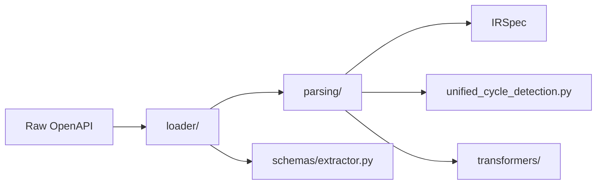

# core/ - OpenAPI Parsing and Runtime Components

## Why This Folder?
Raw OpenAPI spec → Intermediate Representation (IR) transformation. Contains parsing logic, cycle detection, and runtime components that get copied to generated clients.

## Key Dependencies
- **Input**: Raw OpenAPI spec dicts from YAML/JSON
- **Output**: `IRSpec`, `IRSchema`, `IRResponse`, `IROperation` objects
- **Runtime**: Components copied to generated clients (`auth/`, `exceptions.py`, `http_transport.py`)

## Essential Architecture

### 1. Parsing Pipeline


### 2. Cycle Detection State Machine
```python
# parsing/unified_cycle_detection.py
@dataclass
class CycleInfo:
    type: CycleType  # STRUCTURAL, SELF_REF, DEPTH_LIMIT
    action: CycleAction  # PLACEHOLDER, FORWARD_REF, DEPTH_CUTOFF
    depth: int
    
# Usage in parsing
if context.detect_cycle(schema_name, current_depth):
    return create_cycle_placeholder(schema_name, cycle_info)
```

## Critical Components

### parsing/schema_parser.py
**Purpose**: Main schema parsing with cycle detection
```python
def parse_schema(schema_data: Dict[str, Any], context: ParsingContext) -> IRSchema:
    # 1. Cycle detection
    # 2. Keyword parsing (allOf, oneOf, anyOf)
    # 3. Transformer application
    # 4. IR object creation
```

### parsing/transformers/
**Purpose**: Modify parsed schemas before IR creation
- **inline_enum_extractor.py**: Extract inline enums to global schemas
- **inline_object_promoter.py**: Promote inline objects to named schemas

### loader/
**Purpose**: Load and validate OpenAPI specs
```python
# loader/loader.py
def load_spec(spec_path: str) -> IRSpec:
    # 1. Load YAML/JSON
    # 2. Validate OpenAPI format
    # 3. Parse operations, schemas, responses
    # 4. Build IRSpec
```

### Runtime Components (Copied to Clients)

#### auth/
```python
# auth/base.py - Base authentication classes
class AuthBase(ABC):
    async def apply_auth(self, request: httpx.Request) -> httpx.Request:
        # Modify request with auth info
        
# auth/plugins.py - Concrete implementations
class BearerAuth(AuthBase):
    def __init__(self, token: str): ...
```

#### exceptions.py
```python
# Exception hierarchy for generated clients
class ClientError(Exception): ...
class ServerError(ClientError): ...
class ValidationError(ClientError): ...
```

#### http_transport.py
```python
# HTTP client abstraction
class HTTPTransport:
    def __init__(self, base_url: str, auth: Optional[AuthBase] = None):
        self.client = httpx.AsyncClient(base_url=base_url)
```

## Environment Variables
```python
# parsing/unified_cycle_detection.py
PYOPENAPI_MAX_DEPTH = int(os.getenv("PYOPENAPI_MAX_DEPTH", "150"))
PYOPENAPI_MAX_CYCLES = int(os.getenv("PYOPENAPI_MAX_CYCLES", "0"))
```

## Dependencies on Other Systems

### From types/
- Schema → Python type conversion after parsing
- Type resolution for complex compositions

### From context/
- `ParsingContext` for cycle detection state
- Import management during parsing

### To visit/
- Provides `IRSpec` for visitor pattern traversal
- IR objects consumed by code generators

## Common Parsing Patterns

### 1. Keyword Composition
```python
# parsing/keywords/all_of_parser.py
def parse_all_of(all_of_items: List[Dict], context: ParsingContext) -> IRSchema:
    # Merge all schemas into single IR object
    merged_schema = IRSchema(type="object")
    for item in all_of_items:
        parsed_item = parse_schema(item, context)
        merged_schema = merge_schemas(merged_schema, parsed_item)
    return merged_schema
```

### 2. Reference Resolution
```python
# parsing/common/ref_resolution/resolve_schema_ref.py
def resolve_schema_ref(ref: str, context: ParsingContext) -> IRSchema:
    if ref.startswith("#/components/schemas/"):
        schema_name = ref.split("/")[-1]
        return context.get_schema(schema_name)
    raise ValueError(f"Unsupported ref: {ref}")
```

### 3. Cycle Detection
```python
# parsing/unified_cycle_detection.py
def detect_cycle(schema_name: str, current_depth: int, context: ParsingContext) -> Optional[CycleInfo]:
    if current_depth > PYOPENAPI_MAX_DEPTH:
        return CycleInfo(CycleType.DEPTH_LIMIT, CycleAction.DEPTH_CUTOFF, current_depth)
    
    if schema_name in context.parsing_stack:
        return CycleInfo(CycleType.STRUCTURAL, CycleAction.PLACEHOLDER, current_depth)
    
    return None
```

## Testing Requirements

### Parser Tests
```python
def test_parse_schema__all_of_composition__merges_correctly():
    # Test keyword parsers with real OpenAPI data
    schema_data = {
        "allOf": [
            {"type": "object", "properties": {"name": {"type": "string"}}},
            {"type": "object", "properties": {"age": {"type": "integer"}}}
        ]
    }
    # Test parsing result
```

### Cycle Detection Tests
```python
def test_unified_cycle_detection__structural_cycle__creates_placeholder():
    # Test cycle detection with circular references
    context = ParsingContext()
    # Create circular reference scenario
    # Verify placeholder creation
```

## Extension Points

### Adding New Keywords
```python
# parsing/keywords/new_keyword_parser.py
def parse_new_keyword(keyword_data: Any, context: ParsingContext) -> IRSchema:
    # Custom keyword parsing logic
    pass
```

### Adding New Transformers
```python
# parsing/transformers/new_transformer.py
def transform_schema(schema: IRSchema, context: ParsingContext) -> IRSchema:
    # Custom transformation logic
    return modified_schema
```

## Critical Implementation Details

### IR Object Creation
```python
# Always use IRSchema constructor with all required fields
schema = IRSchema(
    name=schema_name,
    type=schema_type,
    properties=properties,
    required=required_fields,
    description=description,
    enum=enum_values,
    is_nullable=is_nullable
)
```

### Context State Management
```python
# parsing/context.py
class ParsingContext:
    def __init__(self):
        self.parsed_schemas: Dict[str, IRSchema] = {}
        self.parsing_stack: List[str] = []  # For cycle detection
        self.forward_refs: Set[str] = set()
        
    def enter_schema(self, schema_name: str):
        self.parsing_stack.append(schema_name)
        
    def exit_schema(self, schema_name: str):
        self.parsing_stack.remove(schema_name)
```