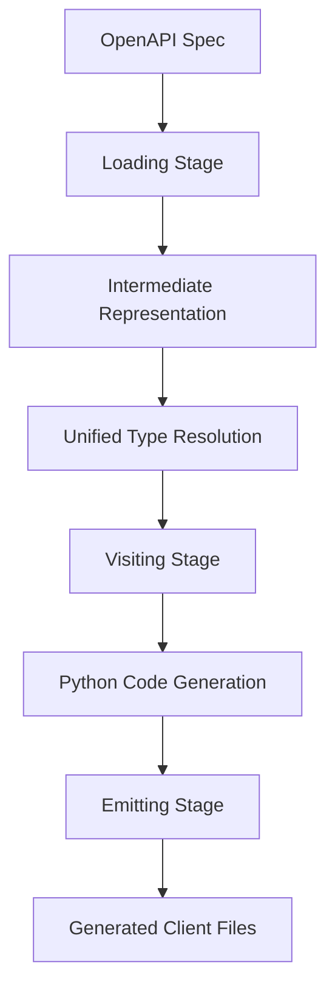

# Contributing to PyOpenAPI Generator

Thank you for your interest in contributing to PyOpenAPI Generator! This guide will help you get started with contributing to our project.

## 🎯 Table of Contents

- [Quick Start](#-quick-start)
- [Development Environment](#-development-environment)
- [Code Standards](#-code-standards)
- [Testing Guidelines](#-testing-guidelines)
- [Documentation Standards](#-documentation-standards)
- [Submitting Changes](#-submitting-changes)
- [Project Architecture](#-project-architecture)
- [Release Process](#-release-process)

## 🚀 Quick Start

### Prerequisites

- Python 3.12 or higher
- Poetry (recommended) or pip
- Git

### 1. Fork and Clone

```bash
# Fork the repository on GitHub, then clone your fork
git clone https://github.com/your-username/pyopenapi-gen.git
cd pyopenapi-gen

# Add the upstream repository
git remote add upstream https://github.com/original-owner/pyopenapi-gen.git
```

### 2. Set Up Development Environment

```bash
# Activate the virtual environment (REQUIRED)
source .venv/bin/activate

# Install dependencies with Poetry (recommended)
poetry install --with dev

# OR install with pip
pip install -e '.[dev]'
```

### 3. Verify Setup

```bash
# Run quality checks to ensure everything works
make quality-fix  # Auto-fix formatting and linting
make quality      # Run all quality checks  
make test         # Run tests with coverage

# If everything passes, you're ready to contribute!
```

## 🛠️ Development Environment

### Essential Commands

**Always activate the virtual environment first:**
```bash
source .venv/bin/activate
```

**Quality Workflow (run before every commit):**
```bash
# Auto-fix what's possible
make quality-fix

# Run all quality checks (must pass for PR approval)
make quality

# Individual commands
make format         # Auto-format with Black
make format-check   # Check formatting without fixing
make lint           # Check linting with Ruff
make lint-fix       # Auto-fix linting issues
make typecheck      # Type checking with mypy
make security       # Security scanning with Bandit
```

**Testing Workflow:**
```bash
# Standard testing (required for PRs)
make test           # Run all tests with 85% coverage requirement

# Development testing options  
make test-fast      # Run tests, stop on first failure
make test-serial    # Run tests sequentially (if parallel tests hang)
make test-no-cov    # Run tests without coverage (fastest)

# Specific test targeting
pytest tests/core/test_loader.py                    # Single test file
pytest tests/core/test_pagination.py::test_method   # Single test method
pytest -k "test_cycle_detection"                    # Tests by pattern
```

### Project Structure

```
pyopenapi_gen/
├── src/pyopenapi_gen/          # Main package
│   ├── core/                   # Core parsing and loading logic
│   │   ├── loader/            # OpenAPI spec loading
│   │   ├── parsing/           # Schema parsing and cycle detection
│   │   └── writers/           # Code formatting utilities
│   ├── types/                  # ⭐ NEW: Unified type resolution
│   │   ├── contracts/         # Interfaces and protocols
│   │   ├── resolvers/         # Core resolution logic
│   │   └── services/          # High-level orchestration
│   ├── visit/                  # Code generation visitors
│   ├── emitters/              # File generation and organization
│   └── helpers/               # Type resolution utilities
├── tests/                      # Comprehensive test suite
├── docs/                       # Technical documentation
└── input/                      # Sample OpenAPI specs for testing
```

## 🎨 Code Standards

### Code Quality Requirements

All contributions must pass our quality gates:

- ✅ **Formatting**: Black (120 character line length)
- ✅ **Linting**: Ruff for code quality and import sorting
- ✅ **Type Safety**: mypy strict mode with 100% type coverage
- ✅ **Security**: Bandit security scanning
- ✅ **Testing**: ≥85% branch coverage with pytest

### Style Guidelines

**Python Version Compatibility:**
- Python 3.12+ required
- Use modern Python features where appropriate
- Avoid deprecated features

**Code Organization:**
- Follow existing patterns and conventions in the codebase
- Use dataclasses for data structures
- Prefer composition over inheritance
- Keep functions focused and testable

**Naming Conventions:**
- Classes: `PascalCase` (e.g., `SchemaParser`)
- Functions/variables: `snake_case` (e.g., `parse_schema`)
- Constants: `UPPER_SNAKE_CASE` (e.g., `MAX_DEPTH`)
- Private members: prefix with `_` (e.g., `_internal_method`)

**Import Organization:**
```python
# Standard library imports
from pathlib import Path
from typing import Dict, List, Optional

# Third-party imports
import httpx
from jinja2 import Template

# Local imports
from .core.schemas import IRSchema
from .helpers.type_helper import resolve_type
```

## 🧪 Testing Guidelines

### Testing Philosophy

We follow strict testing standards to ensure reliability:

- **Framework**: pytest only (no unittest.TestCase)
- **Coverage**: ≥85% branch coverage required
- **Isolation**: Mock all external dependencies
- **Clarity**: Tests should be self-documenting

### Test Naming Convention

Use descriptive names that follow this pattern:
```
test_<unit_of_work>__<condition>__<expected_outcome>()
```

Examples:
```python
def test_parse_schema__with_circular_reference__returns_forward_reference():
def test_generate_client__missing_operations__raises_generation_error():
def test_resolve_type__unknown_schema__returns_any_type():
```

### Test Structure

Follow the Arrange/Act/Assert pattern:

```python
def test_schema_parser__with_circular_reference__handles_gracefully():
    """
    Scenario: Parser encounters a schema with circular references.
    Expected Outcome: Parser should detect the cycle and use forward references.
    """
    # Arrange
    spec_data = {
        "User": {
            "type": "object", 
            "properties": {
                "friend": {"$ref": "#/components/schemas/User"}
            }
        }
    }
    parser = SchemaParser()
    
    # Act
    result = parser.parse_schema("User", spec_data["User"], spec_data)
    
    # Assert
    assert result.type_hint == "User"
    assert result.forward_ref is True
```

### Test Documentation

Include clear docstrings with scenario and expected outcome:

```python
def test_complex_scenario():
    """
    Scenario: Detailed description of what's being tested.
    Expected Outcome: What should happen in this scenario.
    """
```

### Testing Best Practices

**Mock External Dependencies:**
```python
from unittest.mock import Mock, patch

@patch('httpx.AsyncClient')
def test_http_request__with_auth__includes_headers(mock_client):
    # Test implementation
    pass
```

**Use Parametrization for Multiple Cases:**
```python
@pytest.mark.parametrize("input_type,expected", [
    ("string", "str"),
    ("integer", "int"),
    ("boolean", "bool"),
])
def test_type_resolution__primitive_types__returns_correct_python_type(input_type, expected):
    # Test implementation
    pass
```

**Test Error Conditions:**
```python
def test_loader__invalid_spec__raises_validation_error():
    with pytest.raises(ValidationError) as exc_info:
        load_spec("invalid-spec.yaml")
    
    assert "Invalid OpenAPI specification" in str(exc_info.value)
```

## 📚 Documentation Standards

### Universal Documentation Conventions

All documentation in this project follows these standards:

#### 1. Mermaid Diagrams for Logic Visualization
- Always use mermaid diagrams to visualize complex logic, workflows, and system relationships
- Include diagrams before diving into implementation details
- Make abstract concepts concrete through visual representation

#### 2. Chapter Structure: Why → What → How
- **Why**: Start with the purpose, motivation, and context
- **What**: Explain what the component/feature/system does  
- **How**: Then provide implementation details, code examples, and technical specifics

#### 3. Progressive Information Architecture
- Orientation before implementation
- Context before code
- Understanding before examples
- Visual aids before bullet lists

### Documentation Types

**Code Documentation:**
- Use clear, descriptive docstrings for all public APIs
- Include type hints for all function parameters and return values
- Add examples for complex functions

**Architecture Documentation:**
- Follow the Why→What→How structure
- Include mermaid diagrams for system relationships
- Explain design decisions and trade-offs

**API Documentation:**
- Document all public interfaces
- Include usage examples
- Document error conditions and exceptions

### Example Documentation Structure

```python
class SchemaParser:
    """Parses OpenAPI schemas into typed IR models.
    
    Why: OpenAPI schemas contain complex nested structures and circular 
    references that need careful parsing to generate correct Python types.
    
    What: Transforms raw OpenAPI schema dictionaries into strongly-typed
    IRSchema objects with proper cycle detection and reference resolution.
    
    How: Uses a multi-pass approach with state tracking to handle complex
    schema relationships while building a clean intermediate representation.
    
    Example:
        >>> parser = SchemaParser()
        >>> schema = parser.parse_schema("User", schema_dict, all_schemas)
        >>> print(schema.type_hint)  # "User"
    """
    
    def parse_schema(self, name: str, schema_dict: Dict[str, Any], 
                    all_schemas: Dict[str, Any]) -> IRSchema:
        """Parse a single schema definition.
        
        Args:
            name: Schema name from OpenAPI spec
            schema_dict: Raw schema definition
            all_schemas: All available schemas for reference resolution
            
        Returns:
            Parsed schema with resolved types and cycle detection
            
        Raises:
            ParseError: When schema is malformed or contains unsupported features
        """
```

## 🔄 Submitting Changes

### Branch Naming

Use descriptive branch names:
- `feature/add-oauth2-support`
- `fix/handle-circular-references`
- `docs/improve-architecture-guide`
- `refactor/unify-type-resolution`

### Commit Messages

Write clear, descriptive commit messages:

```
Add OAuth2 authentication support

- Implement OAuth2Auth plugin with refresh token handling
- Add comprehensive tests for token refresh scenarios
- Update documentation with OAuth2 examples
- Ensure compatibility with existing auth plugins

Fixes #123
```

### Pull Request Process

1. **Before Creating PR:**
   ```bash
   # Ensure all quality checks pass
   make quality-fix
   make quality
   make test
   
   # Update documentation if needed
   # Add tests for new functionality
   ```

2. **PR Description Template:**
   ```markdown
   ## Summary
   Brief description of changes and motivation.
   
   ## Changes Made
   - Bullet point list of specific changes
   - Include new features, bug fixes, refactoring
   
   ## Testing
   - Describe how you tested your changes
   - Include any new test cases added
   
   ## Documentation
   - List any documentation updates
   - Note if docs need updating by reviewers
   
   ## Breaking Changes
   - List any breaking changes (if applicable)
   - Include migration instructions
   
   Fixes #issue_number
   ```

3. **Review Process:**
   - All PRs require review from maintainers
   - Address review feedback promptly
   - Keep PR scope focused and manageable
   - Ensure CI passes before requesting review

### PR Requirements Checklist

- [ ] All quality checks pass (`make quality`)
- [ ] Tests pass with ≥85% coverage (`make test`)
- [ ] Code follows project conventions
- [ ] Documentation updated for new features
- [ ] Clear commit messages and PR description
- [ ] No breaking changes without migration guide
- [ ] Branch is up to date with main

## 🏗️ Project Architecture

### Understanding the Codebase

PyOpenAPI Generator follows a three-stage pipeline:



**Stage 1: Loading (`core/loader/` & `core/parsing/`)**
- Parse OpenAPI specifications
- Detect and resolve circular references
- Build intermediate representation (IR)

**Stage 2: Visiting (`visit/`)**
- Transform IR into Python code
- Generate models, endpoints, and client classes
- Apply unified type resolution

**Stage 3: Emitting (`emitters/`)**
- Organize code into proper package structure
- Write files with correct imports
- Apply post-processing (formatting, type checking)

### Key Design Principles

**Separation of Concerns:**
- Each stage has clear responsibilities
- Clean interfaces between components
- Testable, focused modules

**Type Safety:**
- Strict mypy checking throughout
- Comprehensive type hints
- Runtime type validation where needed

**Extensibility:**
- Plugin-based authentication
- Configurable type resolution
- Modular emitters for different output formats

### Contributing to Architecture

When making architectural changes:

1. **Understand the Impact:**
   - Consider effects on all three stages
   - Ensure backward compatibility
   - Document design decisions

2. **Follow Existing Patterns:**
   - Use dataclasses for data structures
   - Implement protocols for interfaces
   - Keep classes focused and testable

3. **Comprehensive Testing:**
   - Test the happy path
   - Test error conditions
   - Test edge cases and complex scenarios

## 🔖 Release Process

### Version Management

We follow [Semantic Versioning](https://semver.org/):

- **MAJOR** (e.g., 1.0.0 → 2.0.0): Breaking changes
- **MINOR** (e.g., 1.0.0 → 1.1.0): New features, backward compatible
- **PATCH** (e.g., 1.0.0 → 1.0.1): Bug fixes, backward compatible

### Changelog Protocol

We maintain a changelog following [Keep a Changelog](https://keepachangelog.com/) format:

**Structure:**
```markdown
# Changelog

All notable changes to this project will be documented in this file.

## [Unreleased]

### Added
- New features that have been added

### Changed
- Changes in existing functionality

### Deprecated
- Soon-to-be removed features

### Removed
- Features that have been removed

### Fixed
- Bug fixes

### Security
- Security vulnerability fixes

## [1.0.0] - 2024-01-15

### Added
- Initial release with core functionality
```

**Updating the Changelog:**
1. Keep an `[Unreleased]` section at the top
2. Add entries as you develop features
3. Categorize changes appropriately
4. Use clear, descriptive language
5. Include issue/PR references where relevant

**Example Entries:**
```markdown
### Added
- OAuth2 authentication support with refresh token handling (#123)
- Automatic pagination detection for cursor-based APIs (#145)

### Fixed
- Circular reference detection in deeply nested schemas (#134)
- Import resolution for generated models with forward references (#142)

### Changed
- Improved error messages for schema parsing failures (#139)
- Updated type resolution to use unified service architecture (#151)
```

### Release Checklist

Before releasing a new version:

- [ ] Update version in `pyproject.toml`
- [ ] Update version in `src/pyopenapi_gen/__init__.py`
- [ ] Move `[Unreleased]` changes to new version section in CHANGELOG.md
- [ ] Ensure all tests pass (`make test`)
- [ ] Ensure all quality checks pass (`make quality`)
- [ ] Update documentation if needed
- [ ] Create release PR with version bump
- [ ] Tag release after merge
- [ ] Publish to PyPI (maintainers only)

## 🤝 Community Guidelines

### Code of Conduct

- Be respectful and inclusive
- Welcome newcomers and help them learn
- Focus on constructive feedback
- Assume positive intent

### Getting Help

- **Issues**: Report bugs and request features on GitHub Issues
- **Discussions**: Ask questions and share ideas in GitHub Discussions
- **Documentation**: Check our comprehensive docs in the `docs/` directory

### Recognition

We value all contributions, including:

- 🐛 Bug reports and fixes
- ✨ New features and enhancements
- 📚 Documentation improvements
- 🧪 Test coverage improvements
- 🎨 Code quality improvements
- 💡 Ideas and suggestions

Contributors will be recognized in our changelog and release notes.

---

Thank you for contributing to PyOpenAPI Generator! Your efforts help make Python API development more productive and enjoyable for everyone. 🚀