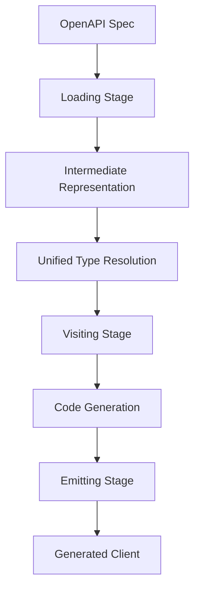

# PyOpenAPI Generator Documentation

Welcome to the PyOpenAPI Generator documentation! This directory contains comprehensive technical documentation for developers working with or contributing to the project.

## 📚 Documentation Index

### Getting Started
- **[Main README](../README.md)** - Project overview, installation, and quick start
- **[Contributing Guide](../CONTRIBUTING.md)** - How to contribute to the project
- **[Changelog](../CHANGELOG.md)** - Version history and release notes

### Architecture & Design
- **[Architecture Overview](architecture.md)** - System design and three-stage pipeline
- **[Unified Type Resolution](unified_type_resolution.md)** - Centralized type resolution system
- **[IR Models](ir_models.md)** - Intermediate representation dataclasses

### Component Guides
- **[Model Visitor](model_visitor.md)** - Dataclass and enum generation
- **[Endpoint Visitor](endpoint_visitor.md)** - API operation method generation with Protocol and Mock support
- **[Protocol & Mock Generation](protocol_and_mock_generation.md)** - Comprehensive guide to testing features
- **[Render Context](render_context.md)** - Import management and context handling
- **[Line Writer](line_writer.md)** - Code formatting utilities
- **[Loader System](loader.md)** - OpenAPI spec loading and parsing
- **[Helpers](helpers.md)** - Type resolution utilities (legacy)

## 🎯 Documentation Standards

All documentation in this project follows our universal standards:

### Why → What → How Structure
1. **Why**: Purpose, motivation, and context
2. **What**: What the component/feature/system does
3. **How**: Implementation details, code examples, and technical specifics

### Visual First Approach
- Mermaid diagrams for complex logic and workflows
- Visual aids before bullet lists
- Make abstract concepts concrete through visualization

### Progressive Information Architecture
- Orientation before implementation
- Context before code
- Understanding before examples

## 🏗️ Architecture Quick Reference

PyOpenAPI Generator transforms OpenAPI specifications into production-ready Python clients through a three-stage pipeline designed for enterprise-grade reliability and type safety.

## 🤝 Contributing to Documentation

When updating documentation:

1. **Follow the Standards**: Use Why→What→How structure with mermaid diagrams
2. **Keep it Current**: Update docs when changing code
3. **Test Examples**: Ensure all code examples work
4. **Link Appropriately**: Cross-reference related documentation

See our [Contributing Guide](../CONTRIBUTING.md) for detailed guidelines on documentation standards and the development workflow.

## 🔗 Quick Links

- **[Architecture Overview](architecture.md)** - Start here for system understanding
- **[Type Resolution](unified_type_resolution.md)** - Core type system documentation
- **[Contributing](../CONTRIBUTING.md)** - How to contribute
- **[Main Project](../README.md)** - Back to main documentation

---

**Need help?** Open an issue on [GitHub Issues](https://github.com/mindhiveoy/pyopenapi_gen/issues) or check our [Contributing Guide](../CONTRIBUTING.md) for support resources.
