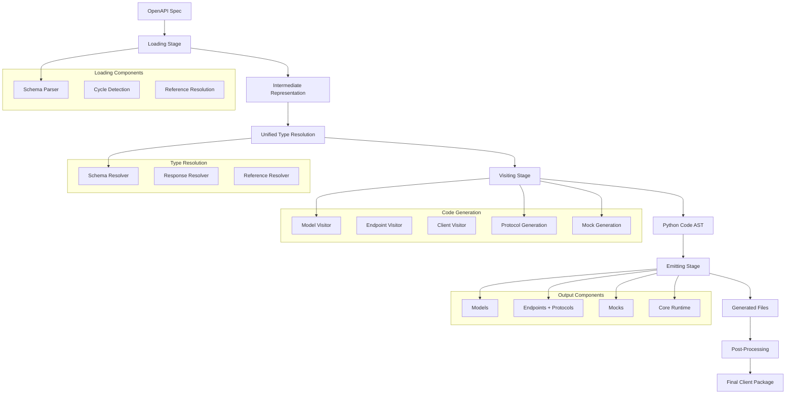

# Architecture Overview

## Why This Architecture?

Modern OpenAPI specifications contain complex schemas with circular references, deep nesting, and intricate type relationships. Traditional code generators struggle with these complexities, often producing broken code or failing entirely. 

**Key Challenges:**
- **Circular References**: Schema A references Schema B, which references back to Schema A
- **Type Safety**: Generated code must be strongly-typed with full mypy compatibility
- **Scalability**: Must handle enterprise-grade APIs with hundreds of schemas and operations
- **Maintainability**: Generated clients must be self-contained and production-ready

This architecture was designed to handle these enterprise-grade challenges while maintaining reliability and code quality.

## What Is the Architecture?

PyOpenAPI Generator implements a sophisticated three-stage pipeline with unified type resolution and advanced cycle detection. Each stage has distinct responsibilities and clean interfaces, enabling robust processing of complex schemas while maintaining code quality.



## How the Architecture Works

### Stage 1: Loading (Parse & Normalize)
1. **Parse**: YAML/JSON spec into structured data
2. **Detect Cycles**: Identify circular references and deep nesting
3. **Resolve References**: Handle `$ref` links across the specification
4. **Create IR**: Build normalized `IRSpec` with all schemas and operations

### Stage 2: Visiting (Transform & Generate)
1. **Type Resolution**: Convert IR schemas to Python types via `UnifiedTypeService`
2. **Code Generation**: Transform IR nodes into Python code strings using visitor pattern
3. **Protocol Generation**: Create `@runtime_checkable` Protocol classes for structural typing
4. **Mock Generation**: Generate mock helper classes with NotImplementedError stubs
5. **Import Management**: Track and resolve all necessary imports
6. **Code Formatting**: Apply consistent code structure and formatting

### Stage 3: Emitting (Write & Organize)
1. **Structure Creation**: Build proper package directory structure
2. **File Writing**: Write generated code to appropriate modules
3. **Import Resolution**: Ensure all imports are correctly formatted
4. **Post-Processing**: Apply formatting (Black) and type checking (mypy)

## Core Components

### 1. Loader System (`core/loader/` & `core/parsing/`)
Transforms OpenAPI specs into typed Intermediate Representation:
- **Unified Cycle Detection**: Handles complex schema relationships and recursion
- **Schema Parser**: Core parsing logic with reference resolution
- **Keyword Processors**: Specialized handlers for `allOf`, `oneOf`, `anyOf`
- **Transformers**: Extract inline enums, promote nested objects

### 2. Intermediate Representation (IR)
Typed dataclasses representing normalized OpenAPI components:
- `IRSpec`, `IROperation`, `IRSchema`, `IRParameter`
- Stable interface between parsing and code generation
- All generation based on IR, not raw spec

### 3. Unified Type Resolution System (`types/`)
Centralized, testable type resolution architecture:
- **Contracts** (`types/contracts/`): Protocols and interfaces for type resolution
- **Resolvers** (`types/resolvers/`): Core resolution logic for schemas, responses, and references
- **Services** (`types/services/`): High-level orchestration with `UnifiedTypeService`
- **Clean Architecture**: Dependency inversion with protocols, full test coverage
- **Consistent Resolution**: Single source of truth for all type resolution across the codebase

### 4. Visitor System (`visit/`)
Implements visitor pattern for code generation:
- **ModelVisitor**: Python dataclasses/enums from schemas
- **EndpointVisitor**: Async methods, Protocol definitions, and mock classes from operations
- **ClientVisitor**: Main API client class and mock client class
- **ExceptionVisitor**: Error hierarchies

**Protocol Generation**: The EndpointVisitor generates `@runtime_checkable` Protocol classes for each endpoint client, enabling structural typing and dependency injection with compile-time validation.

**Mock Generation**: The EndpointVisitor and ClientVisitor generate mock helper classes with NotImplementedError stubs, providing a fast path to testable code.

### 5. Emitter System (`emitters/`)
Orchestrates file generation:
- **ModelsEmitter**: Creates `models/` directory with dataclasses and enums
- **EndpointsEmitter**: Creates `endpoints/` with Protocol definitions and implementations
- **MocksEmitter**: Creates `mocks/` directory with mock helper classes
- **CoreEmitter**: Copies runtime dependencies to generated client
- **ClientEmitter**: Main client interface

**Mock Helper Generation**: The MocksEmitter generates a complete `mocks/` package structure with MockAPIClient and tag-based mock classes (e.g., MockUsersClient), enabling fast test creation with helpful NotImplementedError messages.

### 6. Supporting Systems
- **Context** (`context/`): Manages rendering state and imports
- **Writers** (`core/writers/`): Code formatting utilities
- **Helpers** (`helpers/`): Legacy type resolution (now delegates to unified system)

## Generation Pipeline

```
OpenAPI Spec → IR → Unified Type Resolution → Code → Files
```

1. **Load**: Parse YAML/JSON spec into `IRSpec` with cycle detection
2. **Resolve**: Convert IR schemas/responses to Python types via `UnifiedTypeService`
3. **Visit**: Transform IR nodes into Python code strings
4. **Emit**: Write structured package with proper imports  
5. **Post-process**: Format and type-check generated code

## Unified Type Resolution Architecture

The `types/` package provides centralized type resolution:

### Key Components
- **`UnifiedTypeService`**: Main entry point for all type resolution
- **Schema Resolver**: Handles IRSchema → Python type conversion
- **Response Resolver**: Handles IRResponse → Python type conversion  
- **Reference Resolver**: Handles `$ref` resolution across schemas and responses
- **Protocol-Based Design**: Clean interfaces enabling testing and extensibility

### Benefits
- **Consistency**: Single source of truth for type resolution logic
- **Testability**: Clean architecture with dependency injection
- **Maintainability**: Separation of concerns with clear contracts
- **Extensibility**: Protocol-based design allows easy additions

### Usage Example
```python
from pyopenapi_gen.types.services import UnifiedTypeService

# Initialize with all schemas
type_service = UnifiedTypeService(schemas, responses)

# Resolve schema to Python type
python_type = type_service.resolve_schema_type(schema, context, required=True)

# Resolve operation response
response_type = type_service.resolve_operation_response_type(operation, context)
```

## Unified Cycle Detection

Critical system preventing infinite recursion during schema parsing:

### Detection Types
- **Structural Cycles**: Reference loops (A → B → A)
- **Self-References**: Direct self-references (A → A)  
- **Depth Limits**: Configurable recursion limits

### Resolution Strategies
- **Referential Stubs**: For allowed self-references
- **Placeholders**: For problematic cycles and depth exceeded
- **State Tracking**: Schema lifecycle management

Implementation in `core/parsing/unified_cycle_detection.py` provides conflict-free detection across all parsing scenarios.

## Development Workflow

### Quality Assurance

The project enforces high code quality standards through automated tooling:

```bash
# Before any commit - auto-fix issues
make quality-fix

# Verify all quality gates pass (matches CI pipeline)
make quality
```

#### Quality Tools

- **Black**: Code formatting (120 char line length)
- **Ruff**: Fast Python linter with auto-fix capabilities
- **mypy**: Strict type checking with 100% coverage
- **Bandit**: Security vulnerability scanning
- **pytest**: Comprehensive test suite with ≥85% branch coverage

#### Individual Commands

```bash
make format               # Auto-format code
make lint-fix             # Auto-fix linting issues
make typecheck            # Type checking
make security             # Security scanning
make test                 # Run all tests
make test-cov             # Run tests with coverage
```

### Testing Strategy

The project follows a comprehensive testing approach:

- **Unit Tests**: Component-specific tests with high coverage
- **Integration Tests**: End-to-end generation workflows
- **Type Safety**: Full mypy coverage ensures type correctness
- **Quality Gates**: All checks must pass before merge

### CI/CD Integration

The `make quality` command exactly matches the GitHub Actions pipeline, ensuring local development aligns with CI requirements. This prevents "works on my machine" issues and provides fast feedback during development. 