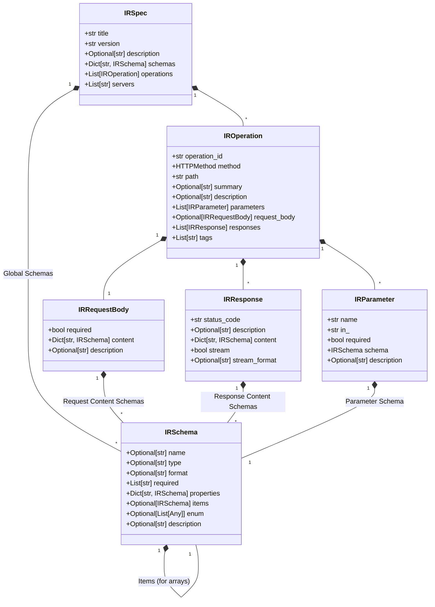

# Intermediate Representation (IR)

The IR provides a clean, typed interface between OpenAPI parsing and code generation. All visitors operate on IR objects, not raw spec dictionaries.

## Overview

The IR consists of dataclasses representing normalized OpenAPI components:

- **IRSpec**: Top-level specification container
- **IROperation**: API operations with parameters, request/response
- **IRSchema**: Type definitions (models, enums, primitives)
- **IRParameter**: Operation parameters (query, path, header, cookie)
- **IRRequestBody**: Request body specifications
- **IRResponse**: Response definitions with content types

## Key Benefits

- **Type Safety**: Full static typing for all OpenAPI elements
- **Normalization**: Consistent structure regardless of spec variations
- **Validation**: Early detection of specification issues
- **Extensibility**: Easy to add custom metadata or transformations

*Diagram: Relationship between core IR dataclasses.* 

Key aspects related to schema references:
*   `IRSchema` holds the parsed details of a schema, including type, format, properties, items (for arrays), enums, etc.
*   Relationships between schemas (e.g., nested objects, arrays of objects) are represented through nested `IRSchema` instances within `properties` or `items`.
*   The loader populates these structures after resolving `$ref`s. 