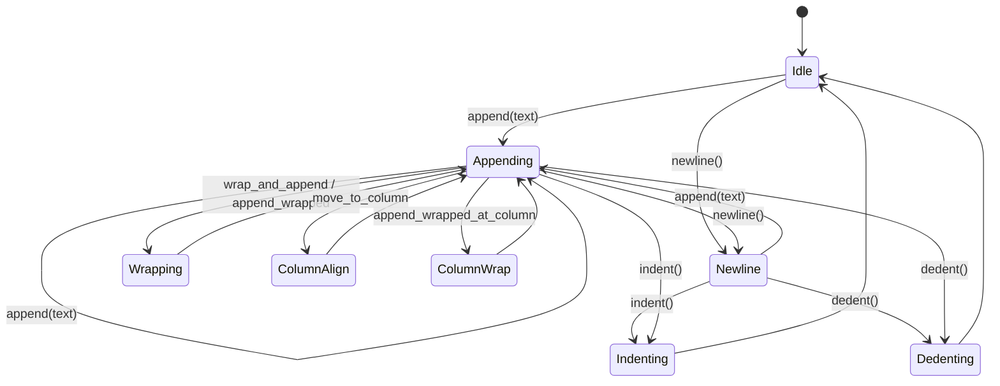

# LineWriter

> **Location:** `src/pyopenapi_gen/core/writers/line_writer.py`

## Overview

`LineWriter` is a utility class for building and formatting lines of text with precise control over indentation, column alignment, and line wrapping. It is designed for use in both code and documentation generation, supporting complex formatting scenarios such as Google-style docstrings, code blocks, and tabular output.

- **Strongly typed, single-class module**
- **Manages indentation and line state internally**
- **Supports column-based alignment and context-aware wrapping**
- **Ergonomic API for appending, wrapping, and aligning text**

---

## Key Features

- **Indentation Management:**  
  Supports increasing and decreasing indentation levels, automatically applying indentation to new lines.

- **Line Appending:**  
  Appends text to the current line, respecting indentation and line state.

- **Column Alignment:**  
  Pads the current line to a specified column, enabling precise alignment for docstrings and code.

- **Text Wrapping:**  
  Wraps and appends text to fit within a specified width, with support for custom prefixes and indents.

- **Column-Based Wrapping:**  
  Appends wrapped text so that the first line continues from the current position, and all subsequent lines start at a specified column.

---

## API Reference

### Initialization

```python
writer = LineWriter(indent_str="    ")  # Default: 4 spaces
```

### Indentation

```python
writer.indent()   # Increase indentation level by one
writer.dedent()   # Decrease indentation level by one (never below zero)
```

### Appending and Newlines

```python
writer.append("text")   # Append text to the current line
writer.newline()        # Start a new line (with current indentation)
```

### Wrapping

```python
writer.wrap_and_append(text, width, prefix="")
# Wraps text to width, using prefix for the first line, and appends to the writer

writer.append_wrapped(text, width, prefix="", subsequent_indent="")
# Appends text, wrapping as needed, with custom prefix and indent for wrapped lines
```

### Column Alignment

```python
writer.move_to_column(col)
# Pads the current line with spaces until the cursor is at column col

writer.append_wrapped_at_column(text, width, col)
# Appends wrapped text so that the first line continues from the current position,
# and all subsequent lines start at column col
```

### Output

```python
writer.getvalue()   # Returns the full text as a single string
writer.lines        # List of individual lines (strings)
writer.current_width()  # Width of the current line
```

---

## Internal State

- `lines: List[str]` — The accumulated lines of text.
- `indent_level: int` — The current indentation level.
- `indent_str: str` — The string used for one indentation level.
- `_just_newlined: bool` — Tracks if the last operation was a newline (for correct indentation).

---

## State Machine: Rendering Processor

Below is a state machine diagram describing the rendering process of `LineWriter`:



### **State Descriptions**

- **Idle:**  
  The initial state, waiting for an operation.

- **Appending:**  
  Appending text to the current line. If the line is empty and just newlined, indentation is applied.

- **Newline:**  
  Starts a new line, sets `_just_newlined` to `True`.

- **Indenting/Dedenting:**  
  Adjusts the indentation level.

- **Wrapping:**  
  Wraps and appends text, possibly with custom prefixes/indents.

- **ColumnAlign:**  
  Pads the current line to a specified column.

- **ColumnWrap:**  
  Appends wrapped text so that the first line continues from the current position, and subsequent lines start at a specified column.

---

## Usage Example

```python
writer = LineWriter()
writer.append("foo (str)")
writer.move_to_column(15)
writer.append(": ")
writer.append_wrapped_at_column(
    "This is a long description that should wrap to the next line for readability.",
    width=50,
    col=17,
)
print(writer.getvalue())
```

**Output:**

```bash
foo (str)       : This is a long description that
                  should wrap to the next line for
                  readability.
```

---

## Edge Cases & Guarantees

- **Dedent never goes below zero.**
- **move_to_column** does not pad if already at or past the target column.
- **append_wrapped_at_column** does nothing if text is empty.
- **All wrapping and alignment is context-aware** (respects current line position and indentation).

---

## Best Practices

- Use `append_wrapped_at_column` for docstring and code generation where column alignment is required.
- Use `indent`/`dedent` to manage block-level indentation.
- Always use `newline` before starting a new logical line.
- Query `current_width()` to check the current line's length before appending.

---

## Limitations

- Does not support tab characters for indentation (uses spaces).
- Does not handle multi-byte Unicode width (assumes 1 char = 1 column).
- Not thread-safe.

---

## Extensibility

- Can be subclassed for custom formatting or output sinks.
- Can be integrated with code and docstring generators for consistent formatting.

---

**For further details, see the full API and docstrings in the source code.**
