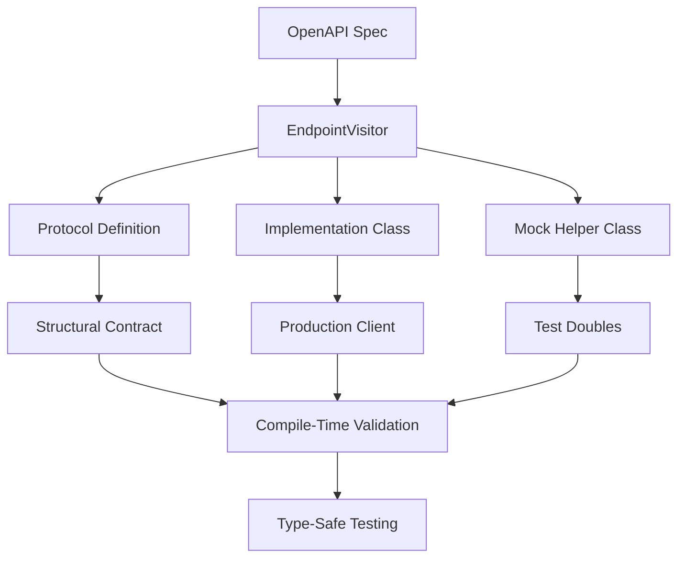
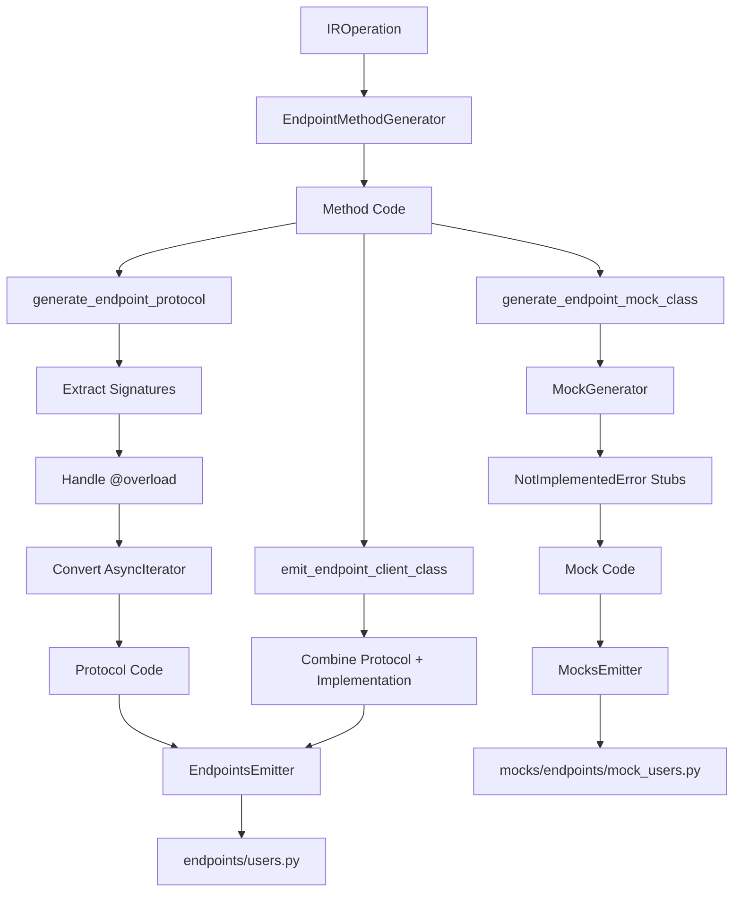

# Protocol and Mock Generation

## Why Protocol and Mock Generation?

Testing API clients requires separating business logic from HTTP transport. Traditional approaches either:
- **Tightly couple** tests to HTTP implementations, making them brittle and slow
- **Require manual mocking**, leading to stale tests that don't reflect API changes
- **Lack type safety**, allowing tests to pass even when mocks don't match reality

This generator solves these problems by automatically creating structural type contracts (Protocols) and mock helper classes directly from OpenAPI specifications, ensuring compile-time validation and easy testing.

## What Gets Generated?

For each OpenAPI tag (e.g., "Users", "Orders"), the generator creates three complementary outputs:



### 1. Protocol Definition (Structural Contract)

```python
@runtime_checkable
class UsersClientProtocol(Protocol):
    """Protocol defining the interface of UsersClient for dependency injection."""

    async def get_user(self, user_id: int) -> User: ...
    async def list_users(self, limit: int = 10) -> list[User]: ...
    async def create_user(self, user: User) -> User: ...
```

**Purpose**: Defines the structural contract that both the real implementation and mocks must satisfy.

**Key Features**:
- `@runtime_checkable`: Enables runtime type checking with `isinstance()`
- Method signatures with `...` bodies (stub implementations)
- Full type hints for compile-time validation
- AsyncIterator methods use `def` (not `async def`) per PEP 544

### 2. Implementation Class (Production Client)

```python
class UsersClient(UsersClientProtocol):
    """Real implementation - explicitly implements the protocol"""

    def __init__(self, transport: HttpTransport, base_url: str) -> None:
        self._transport = transport
        self.base_url = base_url

    async def get_user(self, user_id: int) -> User:
        # Full HTTP implementation
        request = self._transport.build_request(
            method="GET",
            url=f"{self.base_url}/users/{user_id}"
        )
        response = await self._transport.send(request)
        return User.model_validate(response.json())
```

**Purpose**: Concrete implementation with real HTTP calls.

**Key Features**:
- Explicitly inherits from Protocol
- Uses `HttpTransport` for all HTTP communication
- Type-checked against Protocol at compile time
- Self-contained with no external dependencies

### 3. Mock Helper Class (Test Double)

```python
class MockUsersClient:
    """
    Mock implementation of UsersClient for testing.

    Provides default implementations that raise NotImplementedError.
    Override methods as needed in your tests.
    """

    async def get_user(self, user_id: int) -> User:
        raise NotImplementedError(
            "MockUsersClient.get_user() not implemented.\n"
            "Override this method in your test:\n"
            "    class TestUsersClient(MockUsersClient):\n"
            "        async def get_user(self, user_id: int) -> User:\n"
            "            return User(...)"
        )

    async def list_users(self, limit: int = 10) -> list[User]:
        raise NotImplementedError("MockUsersClient.list_users() not implemented.")

    async def create_user(self, user: User) -> User:
        raise NotImplementedError("MockUsersClient.create_user() not implemented.")
```

**Purpose**: Base class for test-specific mock implementations.

**Key Features**:
- NotImplementedError with helpful guidance messages
- Maintains type compatibility with Protocol
- Allows selective method override
- No boilerplate required for basic mocking

## How It Works

### Generation Pipeline



### Step 1: Method Generation

`EndpointMethodGenerator` creates complete async methods:

```python
method_generator = EndpointMethodGenerator(schemas=self.schemas)
method_code = method_generator.generate(operation, context)
```

**Output**:
```python
async def get_user(self, user_id: int) -> User:
    """Get user by ID."""
    request = self._transport.build_request(
        method="GET",
        url=f"{self.base_url}/users/{user_id}"
    )
    response = await self._transport.send(request)
    return User.model_validate(response.json())
```

### Step 2: Protocol Extraction

`generate_endpoint_protocol()` parses generated method code to extract signatures:

```python
protocol_code = self.generate_endpoint_protocol(tag, operations, context)
```

**Processing**:
1. Parse method code line by line
2. Identify `@overload` decorators and async def signatures
3. Extract complete multi-line signatures
4. Convert signatures to Protocol stubs (`:` → `: ...`)
5. Handle AsyncIterator special case (`async def` → `def`)

**Output**:
```python
@runtime_checkable
class UsersClientProtocol(Protocol):
    """Protocol defining the interface of UsersClient for dependency injection."""

    async def get_user(self, user_id: int) -> User: ...
```

### Step 3: Implementation Generation

`emit_endpoint_client_class()` combines Protocol and implementation:

```python
impl_code = self._generate_endpoint_implementation(tag, method_codes, context)
```

**Output**:
```python
class UsersClient(UsersClientProtocol):
    def __init__(self, transport: HttpTransport, base_url: str) -> None:
        self._transport = transport
        self.base_url = base_url

    # All methods included here
    async def get_user(self, user_id: int) -> User: ...
```

### Step 4: Mock Generation

`generate_endpoint_mock_class()` creates mock helper:

```python
mock_code = self.generate_endpoint_mock_class(tag, operations, context)
```

Uses `MockGenerator` to create NotImplementedError stubs:

```python
mock_generator = MockGenerator(schemas=self.schemas)
mock_method_code = mock_generator.generate(operation, context)
```

## Usage Patterns

### Pattern 1: Manual Protocol Implementation

Full control over mock behavior:

```python
from my_api_client.endpoints.users import UsersClientProtocol
from my_api_client.models.user import User

class MockUsersClient(UsersClientProtocol):
    """Custom mock with full implementation."""

    def __init__(self):
        self.calls: list[tuple[str, dict]] = []
        self.mock_data: dict[int, User] = {}

    async def get_user(self, user_id: int) -> User:
        self.calls.append(("get_user", {"user_id": user_id}))
        return self.mock_data.get(user_id, User(id=user_id, name="Default"))

    async def list_users(self, limit: int = 10) -> list[User]:
        self.calls.append(("list_users", {"limit": limit}))
        return list(self.mock_data.values())[:limit]

    async def create_user(self, user: User) -> User:
        self.calls.append(("create_user", {"user": user}))
        user.id = len(self.mock_data) + 1
        self.mock_data[user.id] = user
        return user
```

**When to use**:
- Need to track all method calls
- Require stateful mock behavior
- Building reusable test fixtures

### Pattern 2: Auto-Generated Mock Helpers

Selective override with inheritance:

```python
from my_api_client.mocks import MockUsersClient
from my_api_client.models.user import User

class TestUsersClient(MockUsersClient):
    """Override only what you need for this test."""

    async def get_user(self, user_id: int) -> User:
        return User(id=user_id, name="Test User", email="test@example.com")

    # list_users and create_user inherited with NotImplementedError
```

**When to use**:
- Quick test setup
- Only need to mock specific methods
- Want helpful error messages for unimplemented methods

### Pattern 3: Hybrid Auto-Create with MockAPIClient

Let the client auto-create mocks for unused endpoints:

```python
from my_api_client.mocks import MockAPIClient, MockUsersClient
from my_api_client.models.user import User

class TestUsersClient(MockUsersClient):
    async def get_user(self, user_id: int) -> User:
        return User(id=user_id, name="Test User")

# Create client with partial overrides
client = MockAPIClient(
    users=TestUsersClient()
    # orders, products, etc. auto-created with NotImplementedError stubs
)

# Use your custom mock
user = await client.users.get_user(user_id=123)

# Attempting to use unimplemented endpoint provides clear guidance
# await client.orders.get_order(order_id=1)
# NotImplementedError: Override MockOrdersClient.get_order()
```

**When to use**:
- Testing code that uses multiple endpoint clients
- Only need to mock specific clients for each test
- Want automatic error messages for unimplemented clients

## Dependency Injection Pattern

### Business Logic Structure

Accept Protocol types for maximum flexibility:

```python
from my_api_client.endpoints.users import UsersClientProtocol
from my_api_client.endpoints.orders import OrdersClientProtocol

class OrderProcessingService:
    """Business logic that depends on API clients."""

    def __init__(
        self,
        users_client: UsersClientProtocol,  # Accept Protocol, not concrete class
        orders_client: OrdersClientProtocol
    ):
        self.users = users_client
        self.orders = orders_client

    async def process_order(self, user_id: int, order_data: dict):
        # Validate user exists
        user = await self.users.get_user(user_id=user_id)

        # Create order
        order = await self.orders.create_order(order_data)

        return {"user": user, "order": order}
```

### Production Usage

Inject real clients:

```python
from my_api_client.client import APIClient
from my_api_client.core.config import ClientConfig

config = ClientConfig(base_url="https://api.example.com")
async with APIClient(config) as client:
    service = OrderProcessingService(
        users_client=client.users,    # UsersClient implements UsersClientProtocol
        orders_client=client.orders   # OrdersClient implements OrdersClientProtocol
    )
    result = await service.process_order(user_id=123, order_data={...})
```

### Test Usage

Inject mocks:

```python
import pytest
from my_api_client.mocks import MockUsersClient, MockOrdersClient
from my_api_client.models.user import User
from my_api_client.models.order import Order

class TestUsersClient(MockUsersClient):
    async def get_user(self, user_id: int) -> User:
        return User(id=user_id, name="Test User", email="test@example.com")

class TestOrdersClient(MockOrdersClient):
    async def create_order(self, order_data: dict) -> Order:
        return Order(id=1, status="pending", user_id=order_data["user_id"])

@pytest.fixture
def service():
    return OrderProcessingService(
        users_client=TestUsersClient(),
        orders_client=TestOrdersClient()
    )

async def test_process_order__valid_data__creates_order(service):
    """
    When: Processing order with valid user
    Then: Order is created successfully
    """
    result = await service.process_order(user_id=123, order_data={"items": []})

    assert result["user"].name == "Test User"
    assert result["order"].status == "pending"
```

## Compile-Time Validation

### Protocol Enforcement

mypy catches implementation mismatches:

```python
# Real implementation MUST match Protocol
class UsersClient(UsersClientProtocol):
    async def get_user(self, user_id: int) -> User:  # ✅ Matches Protocol
        ...

    # Missing list_users method
    # mypy error: Cannot instantiate abstract class 'UsersClient' with abstract method 'list_users'
```

### Mock Validation

Mocks inherit type safety:

```python
class TestUsersClient(MockUsersClient):
    async def get_user(self, user_id: str) -> User:  # ❌ Wrong parameter type
        ...
    # mypy error: Signature of "get_user" incompatible with supertype "MockUsersClient"
```

### API Change Detection

When API changes, tests break at compile time:

```python
# OpenAPI spec updated: get_user now requires auth token
# Protocol automatically regenerated:
class UsersClientProtocol(Protocol):
    async def get_user(self, user_id: int, auth_token: str) -> User: ...

# Old mock now fails type checking:
class TestUsersClient(MockUsersClient):
    async def get_user(self, user_id: int) -> User:  # ❌ Missing auth_token
        ...
    # mypy error: Signature incompatible with "UsersClientProtocol"
```

## Generated File Structure

```
my_api_client/
├── endpoints/
│   ├── __init__.py
│   ├── users.py                    # UsersClientProtocol + UsersClient
│   └── orders.py                   # OrdersClientProtocol + OrdersClient
└── mocks/
    ├── __init__.py                 # Exports MockAPIClient and all mocks
    ├── mock_client.py              # MockAPIClient with auto-create pattern
    └── endpoints/
        ├── __init__.py             # Exports all MockXClient classes
        ├── mock_users.py           # MockUsersClient helper
        └── mock_orders.py          # MockOrdersClient helper
```

## Implementation Details

### Protocol Generation Algorithm

```python
def generate_endpoint_protocol(
    self,
    tag: str,
    operations: list[IROperation],
    context: RenderContext
) -> str:
    # 1. Generate Protocol header
    protocol_name = f"{sanitize_class_name(tag)}ClientProtocol"
    code = f"@runtime_checkable\\nclass {protocol_name}(Protocol):\\n"

    # 2. For each operation, extract method signature
    for op in operations:
        method_code = self.generate_method(op, context)

        # 3. Parse generated code to extract signature
        lines = method_code.split("\\n")
        signature = extract_signature(lines)

        # 4. Convert to Protocol stub (: → : ...)
        protocol_signature = signature.replace(":", ": ...", 1)

        # 5. Handle AsyncIterator special case
        if "AsyncIterator" in signature:
            protocol_signature = protocol_signature.replace("async def ", "def ", 1)

        code += f"    {protocol_signature}\\n"

    return code
```

### Mock Generation Algorithm

```python
def generate_endpoint_mock_class(
    self,
    tag: str,
    operations: list[IROperation],
    context: RenderContext
) -> str:
    # 1. Generate mock class header
    mock_name = f"Mock{sanitize_class_name(tag)}Client"
    code = f"class {mock_name}:\\n"
    code += '    """Mock implementation for testing."""\\n\\n'

    # 2. For each operation, generate NotImplementedError stub
    for op in operations:
        method_signature = extract_signature(op)

        # 3. Generate helpful error message
        error_msg = (
            f"{mock_name}.{op.operation_id}() not implemented.\\n"
            f"Override this method in your test:\\n"
            f"    class Test{class_name}({mock_name}):\\n"
            f"        {method_signature}\\n"
            f"            return ..."
        )

        # 4. Create method stub
        code += f"    {method_signature}\\n"
        code += f'        raise NotImplementedError("{error_msg}")\\n\\n'

    return code
```

## Testing Benefits

### 1. Fast Tests
- No HTTP calls
- No network delays
- No external dependencies

### 2. Compile-Time Safety
- API changes break tests at compile time
- Type mismatches caught by mypy
- No runtime surprises

### 3. Easy Setup
- Inherit from generated mocks
- Override only what you need
- Helpful error messages guide implementation

### 4. Maintainability
- Protocols auto-update with API changes
- Tests fail when mocks become stale
- Clear separation between business logic and HTTP

### 5. Refactoring Confidence
- Rename operations? All mocks must update
- Change parameter types? Type checking catches it
- Add new endpoints? Old tests continue working

## Comparison with Other Approaches

### Traditional Manual Mocking

**Without Protocols**:
```python
class MockUsersClient:
    async def get_user(self, user_id: int) -> User:
        return User(id=user_id, name="Test")

# No compile-time validation
# If UsersClient.get_user signature changes, mock doesn't break
# Tests pass even when mock is outdated
```

**With Protocols** (this approach):
```python
class MockUsersClient(UsersClientProtocol):  # Explicit Protocol inheritance
    async def get_user(self, user_id: int) -> User:
        return User(id=user_id, name="Test")

# mypy validates MockUsersClient against Protocol
# API changes break the mock at compile time
# Tests fail fast when mock is outdated
```

### HTTP Mocking Libraries

**HTTP Mocking** (e.g., httpx-mock):
```python
# Tests coupled to HTTP implementation details
httpx_mock.add_response(url="https://api.example.com/users/123", json={"id": 123})
```

**Protocol Mocking** (this approach):
```python
# Tests focus on business logic
class TestUsersClient(MockUsersClient):
    async def get_user(self, user_id: int) -> User:
        return User(id=user_id, name="Test")
```

**Benefit**: Tests are decoupled from HTTP transport, URL structure, and serialization details.

## Advanced Scenarios

### Stateful Mocks

Track method calls for verification:

```python
from my_api_client.mocks import MockUsersClient

class StatefulMockUsersClient(MockUsersClient):
    def __init__(self):
        self.calls: list[tuple[str, dict]] = []
        self.users: dict[int, User] = {}

    async def get_user(self, user_id: int) -> User:
        self.calls.append(("get_user", {"user_id": user_id}))
        return self.users.get(user_id, User(id=user_id, name="Default"))

    async def create_user(self, user: User) -> User:
        self.calls.append(("create_user", {"user": user}))
        user.id = len(self.users) + 1
        self.users[user.id] = user
        return user

# In tests:
mock = StatefulMockUsersClient()
await service.process_user(user_id=123)
assert ("get_user", {"user_id": 123}) in mock.calls
```

### Parametrized Mock Behavior

Control mock responses per test:

```python
from my_api_client.mocks import MockUsersClient

class ConfigurableMockUsersClient(MockUsersClient):
    def __init__(self, user_data: dict[int, User]):
        self.user_data = user_data

    async def get_user(self, user_id: int) -> User:
        if user_id not in self.user_data:
            raise ValueError(f"User {user_id} not found")
        return self.user_data[user_id]

# In tests:
@pytest.mark.parametrize("user_id,expected_name", [(1, "Alice"), (2, "Bob")])
async def test_get_user(user_id, expected_name):
    mock = ConfigurableMockUsersClient({
        1: User(id=1, name="Alice"),
        2: User(id=2, name="Bob")
    })
    user = await mock.get_user(user_id=user_id)
    assert user.name == expected_name
```

### Async Context Manager Support

For clients that need setup/teardown:

```python
from my_api_client.mocks import MockAPIClient

class AsyncMockAPIClient(MockAPIClient):
    async def __aenter__(self):
        # Setup logic
        await self.initialize()
        return self

    async def __aexit__(self, exc_type, exc_val, exc_tb):
        # Cleanup logic
        await self.cleanup()

# In tests:
async with AsyncMockAPIClient(users=TestUsersClient()) as client:
    result = await client.users.get_user(user_id=123)
```

## Summary

The Protocol and Mock generation system provides:

1. **Structural Type Safety**: Protocols enforce contracts at compile time
2. **Easy Testing**: Mock helpers eliminate boilerplate
3. **API Change Detection**: Stale mocks break at compile time, not runtime
4. **Developer Guidance**: NotImplementedError messages show exactly how to override methods
5. **Flexible Patterns**: Manual Protocols, auto-generated mocks, or hybrid approaches
6. **Production Ready**: Generated code requires no external dependencies

This approach combines the best of static typing, dependency injection, and test-driven development to create maintainable, reliable API client tests.
