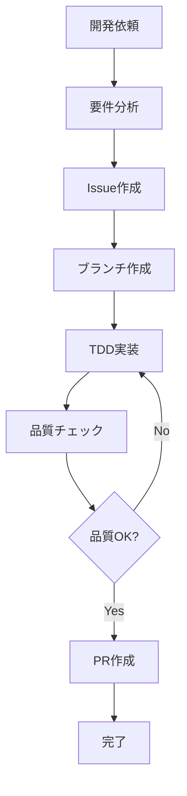

# 開発ワークフローコマンド

大まかな開発要求から完成したPull Requestまでの全プロセスを自動化します。

## 実行内容

1. **要件分析** - 開発依頼の詳細分析と技術要件特定
2. **Issue作成** - 構造化されたIssue作成（受入基準付き）
3. **ブランチ作成** - 適切な命名でのブランチ作成
4. **TDD実装** - テスト駆動での段階的実装
5. **品質チェック** - 統合品質チェック実行
6. **PR作成** - 包括的なPR作成

## 使用例

```bash
# シンプルな機能追加
/develop "CSVエクスポート機能を追加したい"

# 複雑な機能
/develop "ユーザー認証システム（JWT使用、セキュリティ重視）"

# バグ修正
/develop "メモリリークが発生している問題を修正"

# パフォーマンス改善
/develop "データベースクエリの最適化（N+1問題解決）"

# Issueを指定して開発
/develop "#42"
```

## ワークフロー



## 特徴

### 🚀 自動化された開発プロセス
- **要件の構造化**: 曖昧な依頼を具体的な技術要件に変換
- **適切なブランチ戦略**: feature/fix/refactor等の自動判別
- **段階的実装**: MVP → 機能拡張の戦略的アプローチ

### 🔍 品質保証統合
- **TDD実践**: テストファースト開発の自動化
- **コード品質**: ruff/mypy統合チェック
- **セキュリティ**: 脆弱性検証の組み込み

### 📋 完全な追跡性
- **Issue連携**: GitHub Issue自動作成・管理
- **コミット履歴**: Conventional Commits準拠
- **PR品質**: 包括的な説明・チェックリスト

## 実装

Development Workflow Agentを呼び出して全プロセスを管理:

```bash
# Development Workflow Agent起動
echo "🚀 開発ワークフロー開始: $ARGUMENTS"
echo ""
echo "📋 依頼内容: $ARGUMENTS"
echo "🤖 Development Workflow Agentに移譲します..."
echo ""

# サブエージェント呼び出し
# /agents dev-workflow が自動的に起動され、
# 以下の処理を順次実行:
#
# 1. 要件分析・計画
# 2. GitHub Issue作成
# 3. 適切なブランチ作成・切り替え
# 4. TDD実装プロセス
# 5. Code Reviewer/Test Engineer Agent連携
# 6. 統合品質チェック
# 7. PR作成・完了
```

## 連携エージェント

- **GitHub Agent**: Issue/PR作成管理
- **Code Reviewer Agent**: 品質チェック
- **Test Engineer Agent**: テスト戦略・実装
- **Development Workflow Agent**: 全体統括

このコマンドにより、「ユーザー認証機能を追加したい」のような大まかな依頼から、適切なIssue作成、ブランチ作成、TDD実装、PR作成まで一気通貫で実現できます。
