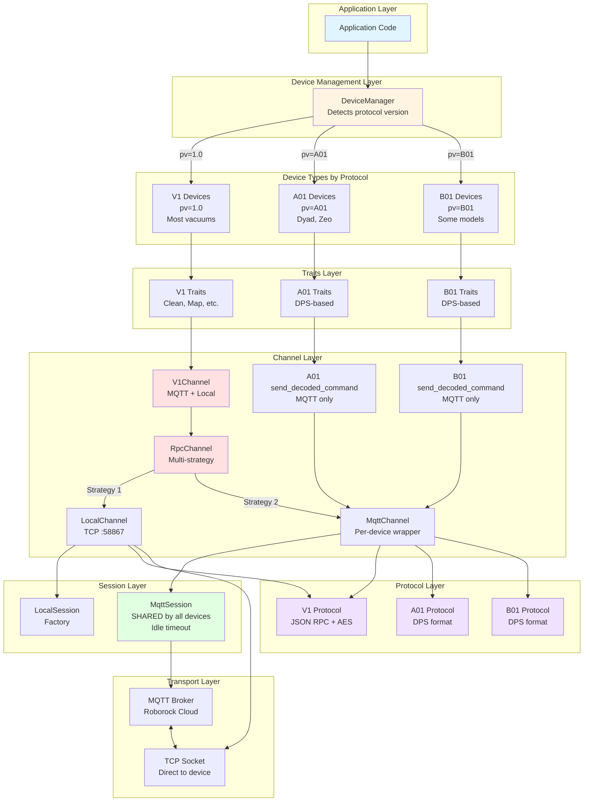
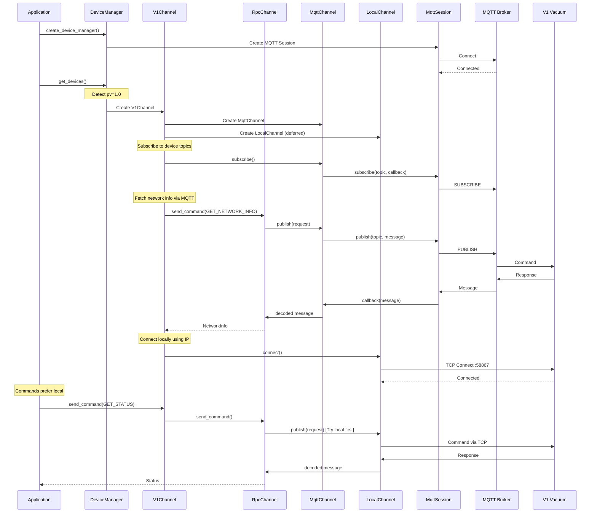
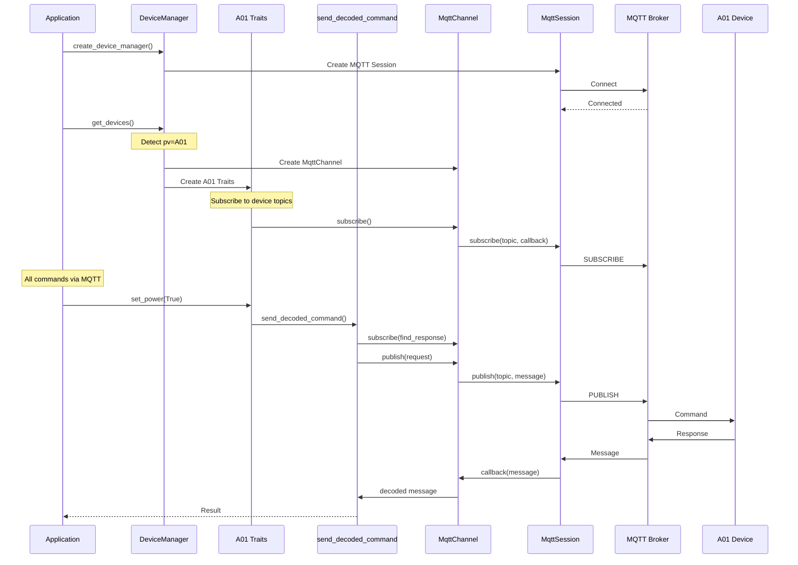
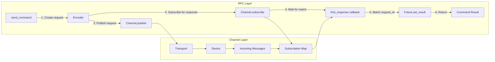
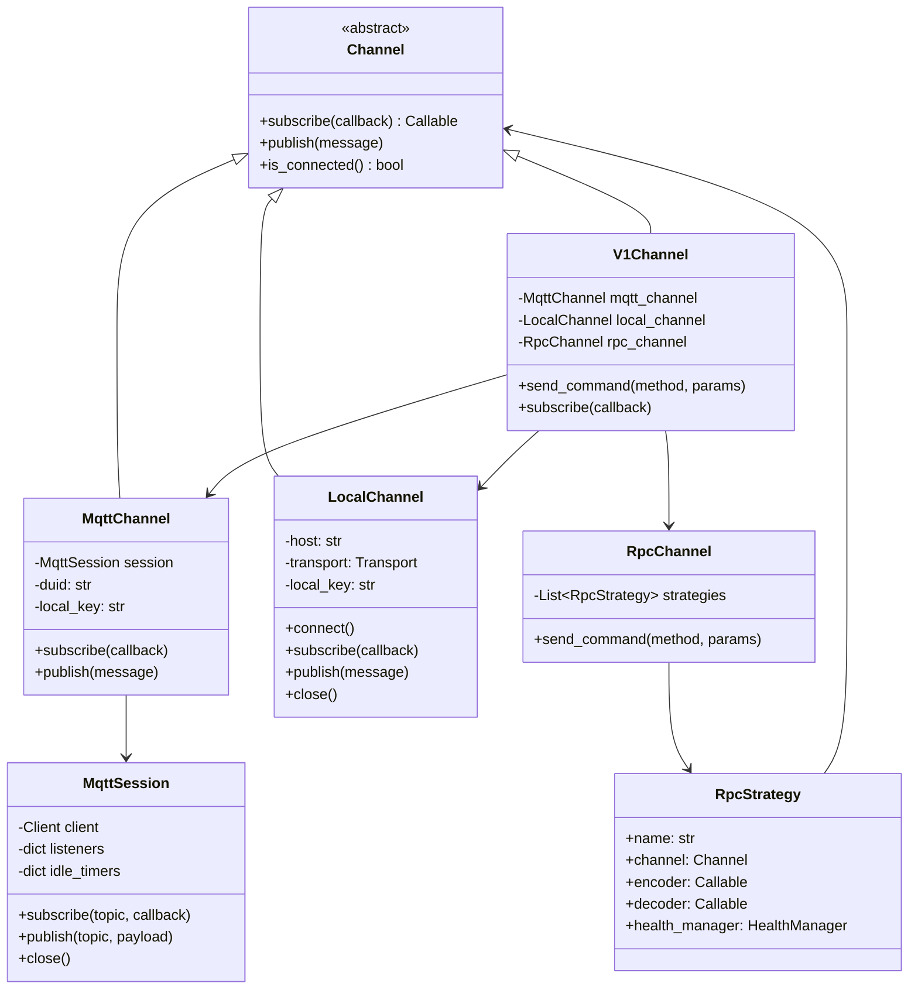
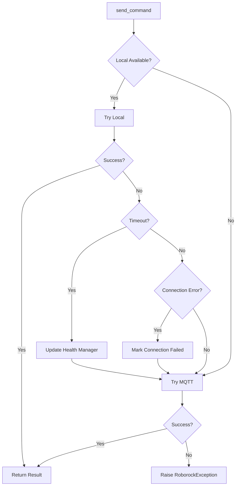

# Roborock Devices & Discovery

The devices module provides functionality to discover Roborock devices on the
network. This section documents the full lifecycle of device discovery across
Cloud and Network.

## Usage TL;DR

*   **Discovery**: Use `roborock.devices.device_manager.DeviceManager` to get device instances.
    *   Call `create_device_manager(user_params)` then `await device_manager.get_devices()`.
*   **Control**:
    *   **Vacuums (V1)**: Use `device.v1_properties` to access traits like `status` or `consumables`.
        *   Call `await trait.refresh()` to update state.
        *   Use `device.v1_properties.command.send()` for raw commands (start/stop).
    *   **Washers (A01)**: Use `device.a01_properties` for Dyad/Zeo devices.
        *   Use `await device.a01_properties.query_values([...])` to get state.
        *   Use `await device.a01_properties.set_value(protocol, value)` to control.

## Background: Understanding Device Protocols

**The library supports three device protocol versions, each with different capabilities:**

### Protocol Summary

| Protocol | Device Examples | MQTT | Local TCP | Channel Type | Notes |
|----------|----------------|------|-----------|--------------|-------|
| **V1** (`pv=1.0`) | Most vacuum robots (S7, S8, Q5, Q7, etc.) | ✅ | ✅ | `V1Channel` with `RpcChannel` | Prefers local, falls back to MQTT |
| **A01** (`pv=A01`) | Dyad, Zeo washers | ✅ | ❌ | `MqttChannel` + helpers | MQTT only, DPS protocol |
| **B01** (`pv=B01`) | Some newer models | ✅ | ❌ | `MqttChannel` + helpers | MQTT only, DPS protocol |

**Key Point:** The `DeviceManager` automatically detects the protocol version and creates the appropriate channel type. You don't need to handle this manually.

## Internal Architecture

The library is organized into distinct layers, each with a specific responsibility. **Different device protocols use different channel implementations:**



### Layer Responsibilities

1. **Device Management Layer**: Detects protocol version (`pv` field) and creates appropriate channels
2. **Device Types**: Different devices based on protocol version (V1, A01, B01)
3. **Traits Layer**: Protocol-specific device capabilities and commands
4. **Channel Layer**: Protocol-specific communication patterns
   - **V1**: Full RPC channel with local + MQTT fallback
   - **A01/B01**: Helper functions wrapping MqttChannel (MQTT only)
   - **MqttChannel**: Per-device wrapper that uses shared `MqttSession`
5. **Session Layer**: Connection pooling and subscription management
   - **MqttSession**: **Shared single connection** for all devices
   - **LocalSession**: Factory for creating device-specific local connections
6. **Protocol Layer**: Message encoding/decoding for different device versions
7. **Transport Layer**: Low-level MQTT and TCP communication

**Important:** All `MqttChannel` instances share the same `MqttSession`, which maintains a single MQTT connection to the broker. This means:
- Only one TCP connection to the MQTT broker regardless of device count
- Subscription management is centralized with idle timeout optimization
- All devices communicate through device-specific MQTT topics on the shared connection

### Protocol-Specific Architecture

| Protocol | Channel Type | Local Support | RPC Strategy | Use Case |
|----------|-------------|---------------|--------------|----------|
| **V1** (`pv=1.0`) | `V1Channel` with `RpcChannel` | ✅ Yes | Multi-strategy (Local → MQTT) | Most vacuum robots |
| **A01** (`pv=A01`) | `MqttChannel` + helpers | ❌ No | Direct MQTT | Dyad, Zeo washers |
| **B01** (`pv=B01`) | `MqttChannel` + helpers | ❌ No | Direct MQTT | Some newer models |

## Account Setup Internals

### Login

- Login can happen with either email and password or email and sending a code. We
  currently prefer email with sending a code -- however the roborock no longer
  supports this method of login. In the future we may want to migrate to password
  if this login method is no longer supported.
- The Login API provides a `userData` object with information on connecting to the cloud APIs
- This `rriot` data contains per-session information, unique each time you login.
  - This contains information used to connect to MQTT
  - You get an `-eu` suffix in the API URLs if you are in the eu and `-us` if you are in the us

## Home Data Internals

The `HomeData` includes information about the various devices in the home. We use `v3`
and it is notable that if devices don't show up in the `home_data` response it is likely
that a newer version of the API should be used.

- `products`: This is a list of all of the products you have on your account. These objects are always the same (i.e. a s7 maxv is always the exact same.)
  - It only shows the products for devices available on your account
- `devices` and `received_devices`:
  - These both share the same objects, but one is for devices that have been shared with you and one is those that are on your account.
  - The big things here are (MOST are static):
    - `duid`: A unique identifier for your device (this is always the same i think)
    - `name`: The name of the device in your app
    - `local_key`: The local key that is needed for encoding and decoding messages for the device. This stays the same unless someone sets their vacuum back up.
    - `pv`: the protocol version (i.e. 1.0 or A1 or B1)
    - `product_id`: The id of the product from the above products list.
    - `device_status`: An initial status for some of the data we care about, though this changes on each update.
- `rooms`: The rooms in the home.
  - This changes if the user adds a new room or changes its name.
  - We have to combine this with the room numbers from `GET_ROOM_MAPPING` on the device
  - There is another REST request `get_rooms` that will do the same thing.
  - Note: If we cache home_data, we likely need to use `get_rooms` to get rooms fresh

## Connection Implementation

### Connection Flow by Protocol

The connection flow differs based on the device protocol version:

#### V1 Devices (Most Vacuums) - MQTT + Local



#### A01/B01 Devices (Dyad, Zeo) - MQTT Only



### Key Differences

| Aspect | V1 Devices | A01/B01 Devices |
|--------|------------|-----------------|
| **Protocols** | V1 Protocol (JSON RPC) | DPS Protocol |
| **Transports** | MQTT + Local TCP | MQTT only |
| **Channel Type** | `V1Channel` with `RpcChannel` | `MqttChannel` with helpers |
| **Local Support** | ✅ Yes, preferred | ❌ No |
| **Fallback** | Local → MQTT | N/A |
| **Connection** | Requires network info fetch | Direct MQTT |
| **Examples** | Most vacuum robots | Dyad washers, Zeo models |

### MQTT Connection (All Devices)

- Initial device information must be obtained from MQTT
- For V1 devices, we set up the MQTT device connection before the local device connection
  - The `NetworkingInfo` needs to be fetched to get additional information about connecting to the device (e.g., Local IP Address)
  - This networking info can be cached to reduce network calls
  - MQTT is also the only way to get the device Map
- Incoming and outgoing messages are decoded/encoded using the device `local_key`
- For A01/B01 devices, MQTT is the only transport

### Local Connection (V1 Devices Only)

- We use the `ip` from the `NetworkingInfo` to find the device
- The local connection is preferred for improved latency and reducing load on the cloud servers to avoid rate limiting
- Connections are made using a normal TCP socket on port `58867`
- Incoming and outgoing messages are decoded/encoded using the device `local_key`
- Messages received on the stream may be partially received, so we keep a running buffer as messages are partially decoded
- **Not available for A01/B01 devices**

### RPC Pattern (V1 Devices)

V1 devices use a publish/subscribe model for both MQTT and local connections, with an RPC abstraction on top:



**Key Design Points:**

1. **Temporary Subscriptions**: Each RPC creates a temporary subscription that matches the request ID
2. **Subscription Reuse**: `MqttSession` keeps subscriptions alive for 60 seconds (or idle timeout) to enable reuse during command bursts
3. **Timeout Handling**: Commands timeout after 10 seconds if no response is received
4. **Multiple Strategies**: `V1Channel` tries local first, then falls back to MQTT if local fails

## Class Design & Components

### Current Architecture

The current design separates concerns into distinct layers:



### Key Components

#### Channel Interface

The `Channel` abstraction provides a uniform interface for both MQTT and local connections:

- **`subscribe(callback)`**: Register a callback for incoming messages
- **`publish(message)`**: Send a message to the device
- **`is_connected`**: Check connection status

This abstraction allows the RPC layer to work identically over both transports.

#### MqttSession (Shared Across All Devices)

The `MqttSession` manages a **single shared MQTT connection** for all devices:

- **Single Connection**: Only one TCP connection to the MQTT broker, regardless of device count
- **Per-Device Topics**: Each device communicates via its own MQTT topics (e.g., `rr/m/i/{user}/{username}/{duid}`)
- **Subscription Pooling**: Multiple callbacks can subscribe to the same topic
- **Idle Timeout**: Keeps subscriptions alive for 10 seconds after the last callback unsubscribes (enables reuse during command bursts)
- **Reconnection**: Automatically reconnects and re-establishes all subscriptions on connection loss
- **Thread-Safe**: Uses asyncio primitives for safe concurrent access

**Efficiency**: Creating 5 devices means 5 `MqttChannel` instances but only 1 `MqttSession` and 1 MQTT broker connection.

#### MqttChannel (Per-Device Wrapper)

Each device gets its own `MqttChannel` instance that:
- Wraps the shared `MqttSession`
- Manages device-specific topics (publish to `rr/m/i/.../duid`, subscribe to `rr/m/o/.../duid`)
- Handles protocol-specific encoding/decoding with the device's `local_key`
- Provides the same `Channel` interface as `LocalChannel`

#### RpcChannel with Multiple Strategies (V1 Only)

The `RpcChannel` implements the request/response pattern over pub/sub channels and is **only used by V1 devices**:

```python
# Example: V1Channel tries local first, then MQTT
strategies = [
    RpcStrategy(name="local", channel=local_channel, ...),
    RpcStrategy(name="mqtt", channel=mqtt_channel, ...),
]
rpc_channel = RpcChannel(strategies)
```

For each V1 command:
1. Try the first strategy (local)
2. If it fails, try the next strategy (MQTT)
3. Return the first successful result

**A01/B01 devices** don't use `RpcChannel`. Instead, they use helper functions (`send_decoded_command`) that directly wrap `MqttChannel`.

#### Protocol-Specific Channel Architecture

| Component | V1 Devices | A01/B01 Devices |
|-----------|------------|-----------------|
| **Channel Class** | `V1Channel` | `MqttChannel` directly |
| **RPC Abstraction** | `RpcChannel` with strategies | Helper functions |
| **Strategy Pattern** | ✅ Multi-strategy (Local → MQTT) | ❌ Direct MQTT only |
| **Health Manager** | ✅ Tracks local/MQTT health | ❌ Not needed |
| **Code Location** | `v1_channel.py` | `a01_channel.py`, `b01_q7_channel.py` |

#### Health Management (V1 Only)

Each V1 RPC strategy can have a `HealthManager` that tracks success/failure:

- **Exponential Backoff**: After failures, wait before retrying
- **Automatic Recovery**: Periodically attempt to restore failed connections
- **Network Info Refresh**: Refresh local IP addresses after extended periods

A01/B01 devices don't need health management since they only use MQTT (no fallback).

### Protocol Versions

Different device models use different protocol versions:

| Protocol | Devices | Encoding |
|----------|---------|----------|
| V1 | Most vacuum robots | JSON RPC with AES encryption |
| A01 | Dyad, Zeo | DPS-based protocol |
| B01 | Some newer models | DPS-based protocol |
| L01 | Local protocol variant | Binary protocol negotiation |

The protocol layer handles encoding/decoding transparently based on the device's `pv` field.

### Prior API Issues

- Complex Inheritance Hierarchy: Multiple inheritance with classes like RoborockMqttClientV1 inheriting from both RoborockMqttClient and RoborockClientV1

- Callback-Heavy Design: Heavy reliance on callbacks and listeners in RoborockClientV1.on_message_received and the ListenerModel system

- Version Fragmentation: Separate v1 and A01 APIs with different patterns and abstractions

- Mixed Concerns: Classes handle both communication protocols (MQTT/local) and device-specific logic

- Complex Caching: The AttributeCache system with RepeatableTask adds complexity

- Manual Connection Management: Users need to manually set up both MQTT and local clients as shown in the README example

### Design Goals

- Prefer a single unified client that handles both MQTT and local connections internally.

- Home and device discovery (fetching home data and device setup) will be behind a single API.

- Asyncio First: Everything should be asyncio as much as possible, with fewer callbacks.

- The clients should be working in terms of devices. We need to detect capabilities for each device and not expose details about API versions.

- Reliability issues: The current Home Assistant integration has issues with reliability and needs to be simplified. It may be that there are bugs with the exception handling and it's too heavy on the cloud APIs and could benefit from more seamless caching.

### Migration from Legacy APIs

The library previously had:
- Separate `RoborockMqttClientV1` and `RoborockLocalClientV1` classes
- Manual connection management
- Callback-heavy design with `on_message_received`
- Complex inheritance hierarchies

The new design:
- `DeviceManager` handles all connection management
- `V1Channel` automatically manages both MQTT and local
- Asyncio-first with minimal callbacks
- Clear separation of concerns through layers
- Users work with devices, not raw clients


## Implementation Details

### Code Organization

```
roborock/
├── devices/                    # Device management and channels
│   ├── device_manager.py      # High-level device lifecycle
│   ├── channel.py             # Base Channel interface
│   ├── mqtt_channel.py        # MQTT channel implementation
│   ├── local_channel.py       # Local TCP channel implementation
│   ├── v1_channel.py          # V1 protocol channel with RPC strategies
│   ├── a01_channel.py         # A01 protocol helpers
│   ├── b01_q7_channel.py      # B01 Q7 protocol helpers
│   └── traits/                # Device-specific command traits
│       └── v1/                # V1 device traits
│           ├── __init__.py    # Trait initialization
│           ├── clean.py       # Cleaning commands
│           ├── map.py         # Map management
│           └── ...
├── mqtt/                       # MQTT session management
│   ├── session.py             # Base session interface
│   └── roborock_session.py    # MQTT session with idle timeout
├── protocols/                  # Protocol encoders/decoders
│   ├── v1_protocol.py         # V1 JSON RPC protocol
│   ├── a01_protocol.py        # A01 protocol
│   ├── b01_q7_protocol.py     # B01 Q7 protocol
│   └── ...
└── data/                       # Data containers and mappings
    ├── containers.py          # Status, HomeData, etc.
    └── v1/                    # V1-specific data structures
```

### Threading Model

The library is **asyncio-only** with no threads:

- All I/O is non-blocking using `asyncio`
- No thread synchronization needed (single event loop)
- Callbacks are executed in the event loop
- Use `asyncio.create_task()` for background work

### Error Handling



**Exception Types:**

- `RoborockException`: Base exception for all library errors
- `RoborockConnectionException`: Connection-related failures
- `RoborockTimeout`: Command timeout (10 seconds)

### Caching Strategy

To reduce API calls and improve reliability:

1. **Home Data**: Cached on disk, refreshed periodically
2. **Network Info**: Cached for 12 hours
3. **Device Capabilities**: Detected once and cached
4. **MQTT Subscriptions**: Kept alive for 60 seconds (idle timeout)

### Testing

Test structure mirrors the python module structure. For example,
the module `roborock.devices.traits.v1.maps` is tested in the file
`tests/devices/traits/v1/test_maps.py`. Each test file corresponds to a python
module.

The test suite uses mocking extensively to avoid real devices:

- `Mock` and `AsyncMock` for channels and sessions
- Fake message generators (`mqtt_packet.gen_publish()`)
- Snapshot testing for complex data structures
- Time-based tests use small timeouts (10-50ms) for speed


Example test structure:
```python
@pytest.fixture
def mock_mqtt_channel():
    """Mock MQTT channel that simulates responses."""
    channel = AsyncMock(spec=MqttChannel)
    channel.response_queue = []

    async def publish_side_effect(message):
        # Simulate device response
        if channel.response_queue:
            response = channel.response_queue.pop(0)
            await callback(response)

    channel.publish.side_effect = publish_side_effect
    return channel
```
