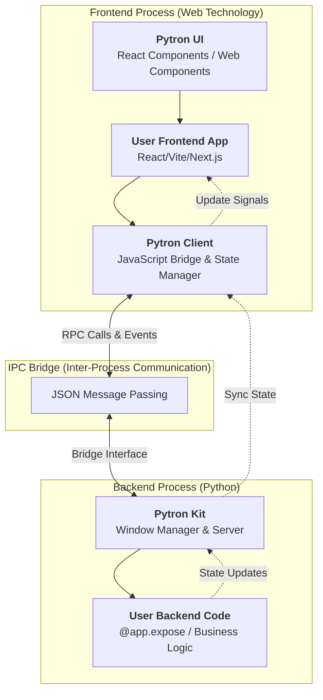

# Pytron Kit

[](https://pypi.org/project/pytron-kit/)
[](https://github.com/Ghua8088/pytron)
[](https://pytron-kit.github.io/)
[](https://github.com/Ghua8088/pytron/actions)

Pytron-kit is a modern framework for building desktop applications using Python for the backend and web technologies (React, Vite) for the frontend. It combines the power of Python's ecosystem with the rich user interfaces of the web.

## Framework workings


## Features

*   **Type-Safe Bridge**: Automatically generate TypeScript definitions (`.d.ts`) from your Python code.
*   **Reactive State**: Synchronize state seamlessly between Python and JavaScript.
*   **Advanced Serialization**: Built-in support for Pydantic models, PIL Images, UUIDs, and more.
*   **System Integration**: Native file dialogs, notifications, and shortcuts.
*   **Developer Experience**: Hot-reloading, automatic virtual environment management, and easy packaging.

## New / Notable Features (latest)

- **Daemon & System Integration**: New `hide`/`show` APIs and `system_notification` support allow apps to run as daemons, show/hide windows programmatically, and emit native notifications across Windows/macOS/Linux.
- **Taskbar / Dock Progress & Icons**: APIs to set taskbar progress and update the application icon at runtime (Windows taskbar, macOS Dock badge, basic Linux support).
- **Native Dialogs**: Cross-platform native file dialogs (open/save/folder) using the OS tools (Windows common dialogs, macOS AppleScript, Linux `zenity`/`kdialog`) are exposed to the `Webview` layer.
- **Message Boxes**: Unified `message_box` with cross-platform fallbacks (native MessageBox on Windows, `zenity`/`kdialog` on Linux, AppleScript on macOS).
- **Packaging Improvements**: `pytron package` can now bundle a splash screen into PyInstaller builds (`--splash` support), and the Windows installer compression has been updated for better AV compatibility.
- **Serializer Enhancements**: `PytronJSONEncoder` gained broader support (Pydantic models, PIL images -> data URIs, dataclasses, enums, timedeltas, complex numbers, __slots__, and iterable fallbacks) for safer frontend bridging.
- **Platform Interface Expanded**: Platform backends now provide richer capabilities (notifications, dialogs, icon/app-id management, tray/daemon helpers).


## Prerequisites

- **Python 3.7+**
- **Node.js & npm** (for frontend development)

### Linux (Ubuntu/Debian) Requirements
Pytron relies on standard system libraries for the webview. You must install them using your package manager:
```bash
sudo apt install libwebkit2gtk-4.1-0 
```
If you encounter `ImportError` or `OSError` related to `gobject` or `glib` (especially on Ubuntu 24.04+), you may also need:
```bash
sudo apt install libcairo2-dev pkg-config python3-dev libgirepository1.0-dev libgirepository-2.0-dev
```

## Quick Start

1.  **Install Pytron**:
**Windows**:
    ```bash
    pip install pytron-kit
    ```

    **Linux / macOS (Recommended)**:
    ```bash
    pipx install pytron-kit
    ```
    *Note: On modern Linux distros (Ubuntu 23.04+), `pipx` involves less risk of breaking system packages (PEP 668).*

2.  **Initialize a New Project**:
    This command scaffolds a new project, creates a virtual environment (`env/`), installs initial dependencies, and sets up a frontend.
    ```bash
    # Default (React + Vite)
    pytron init my_app

    # Using a specific template (vue, svelte, next, etc.)
    pytron init my_app --template next
    ```
    Supported templates: `react` (default), `vue`, `svelte`, `next` (Next.js), `vanilla`, `preact`, `lit`, `solid`, `qwik`.

3.  **Install project dependencies (recommended)**:
    After cloning or when you need to install/update dependencies for the project, use the CLI-managed installer which will create/use the `env/` virtual environment automatically:
    ```bash
    # Creates env/ if missing and installs from requirements.txt
    pytron install
    ```

    Notes:
    - This creates an `env/` directory in the project root (if not already present) and runs `pip install -r requirements.txt` inside it.
    - All subsequent `pytron` commands (`run`, `package`, etc.) will automatically prefer the project's `env/` Python when present.

4.  **Run the App**:
    Start the app in development mode (hot-reloading enabled). The CLI will use `env/` Python automatically if an `env/` exists in the project root.
    *   **Windows**: `run.bat`
    *   **Linux/Mac**: `./run.sh`
    
    Or manually via the CLI:
    ```bash
    pytron run --dev
    ```

## Core Concepts

### 1. Exposing Python Functions
Use the `@app.expose` decorator to make Python functions available to the frontend.

```python
from pytron import App
from pydantic import BaseModel

app = App()

class User(BaseModel):
    name: str
    age: int

@app.expose
def get_user(user_id: int) -> User:
    return User(name="Alice", age=30)

app.generate_types() # Generates frontend/src/pytron.d.ts
app.run()
```

### 2. Calling from Frontend
Import the client and call your functions with full TypeScript support.
any  registered function with "pytron_" prefix will be available as pytron_{function_name}
and will not be proxied into the pytron object.
```typescript
import pytron from 'pytron-client';

async function loadUser() {
    const user = await pytron.get_user(1);
    console.log(user.name); // Typed as string
}
```

### 3. Global Shortcuts
Register global keyboard shortcuts that work even when the window is not focused.

**Python:**
```python
def toggle_visibility():
    if app.is_visible:
        app.hide()
    else:
        app.show()

# Register shortcut (Ctrl+Shift+Space)
app.shortcut("Ctrl+Shift+SPACE", toggle_visibility)
app.shortcut("Alt+K", lambda: print("Shortcut triggered!"))
```

**JavaScript (Frontend Listener as Fallback/Manager):**
Using `pytron-ui`'s `ShortcutHandler` allows you to manage these from React context if preferred, but the backend registration above is robust for global OS-level events.

### 4. Lifecycle Hooks
Run cleanup code when the application closes.

```python
@app.on_exit
def cleanup():
    # Close database connections, save state, or cleanup temp files
    print("Application is shutting down...")
    db.close()
```

### 5. System Integration
Pytron gives you direct access to native OS features.

**System Tray & Taskbar:**
```python
# Create a standard tray
tray = app.setup_tray_standard()

# Show progress in Taskbar (Windows) or Dock (macOS)
# State: "normal", "indeterminate", "error", "paused", "none"
window.set_taskbar_progress("normal", 45) 
```

**High-Performance Binary IPC:**
```python
# Serve large binary data (like images/buffers) via memory
# Available at pytron://my-raw-frame
window.serve_data("my-raw-frame", binary_content, "image/jpeg")
```

**Native Dialogs & Notifications:**
```python
@app.expose
def export_data():
    # Native File Save Dialog
    path = app.dialog_save_file("Export Data", default_name="data.json")
    if path:
        # Show Native System Notification
        app.system_notification("Export Success", f"Saved to {path}")
        return True
    return False
```

### 6. Reactive State
Sync data automatically.

**Python:**
```python
app.state.counter = 0
```

**JavaScript:**
```javascript
console.log(pytron.state.counter); // 0

// Listen for changes
pytron.on('pytron:state-update', (change) => {
    console.log(change.key, change.value);
});
```

### 4. Window Management
Control the window directly from JS.

```javascript
pytron.minimize();
pytron.toggle_fullscreen();
pytron.close();
```

### 5. Development Workflow (`--dev`)
The development mode in Pytron is designed for modern web development workflows.
```bash
pytron run --dev
```
*   **Dual Hot Reloading**:
    *   **Frontend**: Pytron detects your `npm run dev` script (Vite/Next/WebPack) and proxies the window to your local dev server (e.g., `localhost:5173`). This gives you **Hot Module Replacement (HMR)**—UI changes update instantly without a reload.
    *   **Backend**: Pytron watches your Python files. If you change backend logic, the Python application performs a **Hot Restart** automatically.
*   **Debug Logging**: If `debug: true` is set in `settings.json`, Pytron switches to verbose logging, showing bridge messages and binding invocations.
*   **Non-Blocking UI**: Pytron automatically runs synchronous Python functions in a background thread pool, ensuring that heavy Python tasks never freeze the UI.

### 7. Deep Linking
Handle custom URI schemes (e.g., `pytron://my-action`).

**Python:**
```python
# Check for link that launched the app
if app.state.launch_url:
    print(f"Launched with: {app.state.launch_url}")

# Register a custom protocol on the OS
app.register_protocol("my-app")
```

### 8. Start on Boot
Easily allow your app to launch when the system starts.

```python
# Enable launching at startup
app.set_start_on_boot(True)

# Disable
app.set_start_on_boot(False)
```

## Configuration (settings.json)

Pytron uses a `settings.json` file in your project root to manage application configuration.

**Example `settings.json`:**
```json
{
    "title": "My App",
    "dimensions": [1024, 768],
    "frameless": true,
    "url": "frontend/dist/index.html",
    "debug": false,
    "icon": "icon.png",
    "version": "1.0.6",
    "splash_image": "splash.png",
    "author": "YourName",
    "description": "App Description",
    "copyright": "Copyright © 2025",
    "force-package": ["llama_cpp"],
    "default_context_menu": false,
    "close_to_tray": true
}
```

*   **title/author**: Used for the window title, application identity (AppUserModelID), and notification branding.
*   **splash_image**: Path to a PNG/JPG shown during the boot process of a packaged app.
*   **close_to_tray**: If `true`, clicking the 'X' button will hide the window to the system tray instead of exiting the process.
*   **force-package**: A list of Python modules that should be explicitly collected during `pytron package`.
*   **default_context_menu**: Set to `false` to disable the native browser right-click menu (highly recommended if using `pytron-ui` ContextMenu).
*   **url**: Entry point for the frontend. In `--dev` mode, this is overridden by the dev server.

## UI Components

Pytron provides a set of UI components to help you build a modern desktop application.
They have preimplemented window controls and are ready to use.

# Usage
```bash
npm install pytron-ui
```
then import the webcomponents into your frontend app
```javascript
import "pytron-ui/webcomponents/TitleBar.js";
//usage
<pytron-title-bar></pytron-title-bar>
//for react
import { TitleBar } from "pytron-ui/react";
//usage
<TitleBar></TitleBar>
```
## Packaging

Distribute your app as a standalone executable. Pytron automatically reads your `settings.json` to determine the app name, version, and icon.
**Note on File Permissions**: When your app is installed in `Program Files`, it is read-only. If your app writes logs or databases using relative paths (e.g., `logging.basicConfig(filename='app.log')`), it will crash with `PermissionError`.
**Pytron Solution**: When running as a packaged app, Pytron automatically changes the Current Working Directory (CWD) to a safe user-writable path (e.g., `%APPDATA%/MyApp`). Your relative writes will safely end up there.

1.  **Build**:
    ```bash
    pytron package
    ```

### Cross-Compilation (Build for Linux/macOS from Windows)
PyInstaller doesn't support true cross-compilation. To build for other platforms, you have two options:
1.  **CI/CD (Recommended)**: Run `pytron workflow init` to generate a GitHub Actions file. Push your code, and GitHub will build binaries for Windows, Ubuntu, and macOS automatically.
2.  **Local (Linux only)**: Use **WSL** (Windows Subsystem for Linux) to run `pytron package` inside a Linux environment.

## CLI Reference

*   `pytron init <name> [--template <name>]`: Create a new project.
*   `pytron install [package]`: Install dependencies.
    *   Pin versions in `requirements.json`.
    *   Smartly resolving local path installs to package names.
*   `pytron frontend install [package]`: Install npm packages for the frontend (auto-detects directory).
*   `pytron run [--dev]`: Run the application.
*   `pytron show`: List installed Python packages and versions.
*   `pytron package`: Build standalone executable.
*   `pytron workflow init`: Generate GitHub Actions for multi-platform packaging (Windows/Linux/macOS).

**Happy Coding with Pytron!**

## Repository Health
- [Roadmap](ROADMAP.md): Our vision and upcoming features.
- [Contributing](CONTRIBUTING.md): How to get involved in development.
- [Security Policy](SECURITY.md): How to report vulnerabilities.
- [Code of Conduct](CODE_OF_CONDUCT.md): Standards for community behavior.

## License
Pytron is licensed under the [MIT License](LICENSE).
