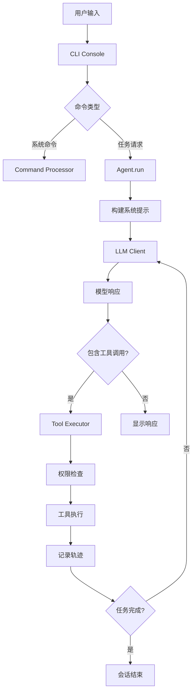
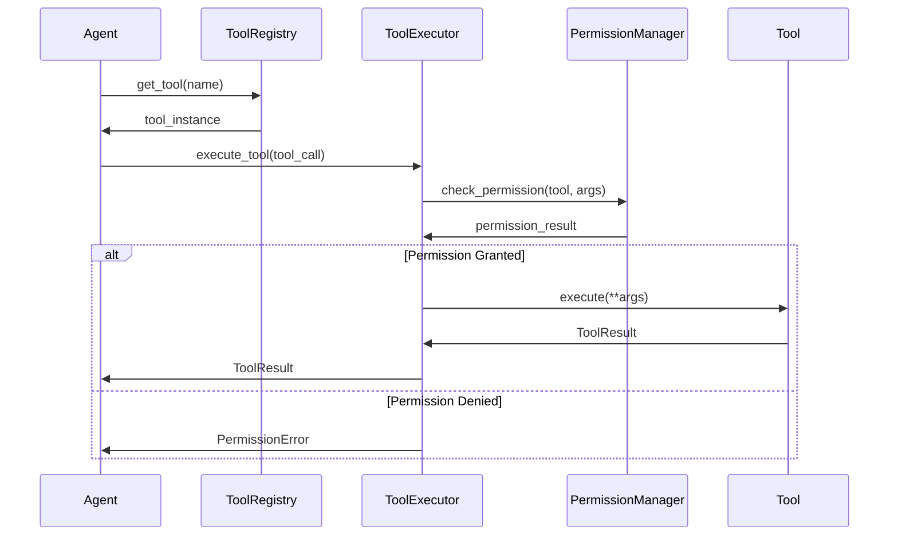

# Pywen 项目架构总览

## 项目概述

Pywen 是一个基于 Python 的智能代码助手框架，专门为软件工程任务设计。它采用模块化架构，支持多种 LLM 模型（主要基于 Qwen3-Coder），提供了丰富的工具生态系统和可扩展的 Agent 框架。

### 核心特性
- 🤖 **多 Agent 支持**: 支持 Qwen、Claude Code、Research 等多种专业化 Agent
- 🛠️ **丰富工具生态**: 文件操作、Shell 执行、网络搜索、内存管理等 15+ 工具
- 📊 **完整轨迹记录**: 详细记录所有 LLM 交互和工具调用，便于调试和分析
- ⚙️ **智能配置管理**: 支持环境变量、配置文件、命令行参数的多层级配置
- 🔒 **权限管理系统**: 基于风险等级的工具执行权限控制
- 📈 **会话统计**: 实时跟踪 API 调用、工具使用和 Token 消耗

## 整体架构设计

### 架构层次图

```
┌─────────────────────────────────────────────────────────────┐
│                    CLI Interface Layer                      │
│  ┌─────────────────┐  ┌─────────────────┐  ┌──────────────┐ │
│  │   CLI Console   │  │ Command Processor│  │Config Wizard │ │
│  └─────────────────┘  └─────────────────┘  └──────────────┘ │
└─────────────────────────────────────────────────────────────┘
                                │
┌─────────────────────────────────────────────────────────────┐
│                     Agent Layer                             │
│  ┌─────────────────┐  ┌─────────────────┐  ┌──────────────┐ │
│  │   Qwen Agent    │  │ Claude Agent    │  │Research Agent│ │
│  │                 │  │                 │  │              │ │
│  │ ┌─────────────┐ │  │ ┌─────────────┐ │  │ ┌──────────┐ │ │
│  │ │Loop Detector│ │  │ │Context Mgr  │ │  │ │Multi-step│ │ │
│  │ │Task Checker │ │  │ │Task Tools   │ │  │ │Research  │ │ │
│  │ └─────────────┘ │  │ └─────────────┘ │  │ └──────────┘ │ │
│  └─────────────────┘  └─────────────────┘  └──────────────┘ │
└─────────────────────────────────────────────────────────────┘
                                │
┌─────────────────────────────────────────────────────────────┐
│                      Core Layer                             │
│  ┌─────────────────┐  ┌─────────────────┐  ┌──────────────┐ │
│  │  Tool Registry  │  │  Tool Executor  │  │ LLM Client   │ │
│  │                 │  │                 │  │              │ │
│  │ ┌─────────────┐ │  │ ┌─────────────┐ │  │ ┌──────────┐ │ │
│  │ │Tool Factory │ │  │ │Permission   │ │  │ │Multi-LLM │ │ │
│  │ │Dynamic Load │ │  │ │Manager      │ │  │ │Support   │ │ │
│  │ └─────────────┘ │  │ └─────────────┘ │  │ └──────────┘ │ │
│  └─────────────────┘  └─────────────────┘  └──────────────┘ │
└─────────────────────────────────────────────────────────────┘
                                │
┌─────────────────────────────────────────────────────────────┐
│                     Tool Layer                              │
│  ┌─────────────────┐  ┌─────────────────┐  ┌──────────────┐ │
│  │   File Tools    │  │  System Tools   │  │  Web Tools   │ │
│  │                 │  │                 │  │              │ │
│  │ • read_file     │  │ • bash          │  │ • web_search │ │
│  │ • write_file    │  │ • ls            │  │ • web_fetch  │ │
│  │ • edit_file     │  │ • grep          │  │              │ │
│  │ • glob          │  │ • memory        │  │              │ │
│  └─────────────────┘  └─────────────────┘  └──────────────┘ │
└─────────────────────────────────────────────────────────────┘
                                │
┌─────────────────────────────────────────────────────────────┐
│                   Infrastructure Layer                      │
│  ┌─────────────────┐  ┌─────────────────┐  ┌──────────────┐ │
│  │ Config System   │  │ Memory System   │  │ Utils System │ │
│  │                 │  │                 │  │              │ │
│  │ • Multi-source  │  │ • Memory Monitor│  │ • Token Mgmt │ │
│  │ • Validation    │  │ • File Restorer │  │ • LLM Basics │ │
│  │ • Hot Reload    │  │ • Adaptive      │  │ • Content Gen│ │
│  └─────────────────┘  └─────────────────┘  └──────────────┘ │
└─────────────────────────────────────────────────────────────┘
```

## 核心模块详解

### 1. Agent 系统 (`pywen/agents/`)

Agent 系统是 Pywen 的核心，采用基于继承的设计模式，所有 Agent 都继承自 `BaseAgent`。

#### BaseAgent 基类
```python
class BaseAgent(ABC):
    def __init__(self, config: Config, cli_console=None):
        self.llm_client = LLMClient(config.model_config)
        self.tool_registry = ToolRegistry()
        self.tool_executor = NonInteractiveToolExecutor(self.tool_registry)
        self.trajectory_recorder = TrajectoryRecorder()
```

**核心职责:**
- 提供统一的 LLM 客户端接口
- 管理工具注册和执行
- 记录执行轨迹
- 处理配置管理

#### 具体 Agent 实现

**1. QwenAgent (`agents/qwen/`)**
- **特点**: 基于 Qwen3-Coder 模型，专注于代码生成和理解
- **核心组件**:
  - `Turn`: 回合管理，跟踪对话状态
  - `LoopDetectionService`: 检测和防止无限循环
  - `TaskContinuationChecker`: 判断任务是否需要继续
  - `MemoryMonitor`: 智能内存管理和上下文压缩

**2. ClaudeCodeAgent (`agents/claudecode/`)**
- **特点**: 模拟 Claude Code 的工作流程，提供结构化的代码开发体验
- **核心组件**:
  - `ContextManager`: 上下文管理
  - **专用工具集**: `TaskTool`, `ArchitectTool`, `ThinkTool`, `TodoTool`
  - **工具适配器系统**: `ClaudeCodeToolAdapter` 和 `ToolAdapterFactory`

**3. GeminiResearchDemo (`agents/research/`)**
- **特点**: 专门用于多步骤研究任务
- **工作流程**: 查询生成 → 网络搜索 → 内容抓取 → 总结分析 → 反思优化

### 2. 工具系统 (`pywen/tools/`)

工具系统采用插件化架构，所有工具都继承自 `BaseTool`。

#### 工具基类设计
```python
class BaseTool(ABC):
    def __init__(self, name: str, description: str, parameter_schema: Dict[str, Any], 
                 risk_level: ToolRiskLevel = ToolRiskLevel.SAFE):
        self.risk_level = risk_level  # 风险等级控制
    
    @abstractmethod
    async def execute(self, **kwargs) -> ToolResult:
        pass
```

#### 工具分类

**文件操作工具**
- `ReadFileTool`: 读取文件内容
- `WriteFileTool`: 写入文件内容  
- `EditTool`: 智能文件编辑（支持行号、搜索替换）
- `ReadManyFilesTool`: 批量读取多个文件

**系统工具**
- `BashTool`: Shell 命令执行（高风险，需要确认）
- `LSTool`: 目录列表
- `GrepTool`: 文件内容搜索
- `GlobTool`: 文件模式匹配

**网络工具**
- `WebSearchTool`: 基于 Serper API 的网络搜索
- `WebFetchTool`: 网页内容抓取

**专用工具**
- `MemoryTool`: 会话记忆管理
- `MCPTool`: MCP (Model Context Protocol) 服务器集成

**Claude Code 专用工具**
- `TaskTool`: 启动子任务代理，支持多步骤任务自动化执行
- `ArchitectTool`: 技术分析和实现规划，专门用于代码架构设计
- `ThinkTool`: 思考过程记录，透明化AI的推理过程
- `TodoTool`: TODO列表管理，跟踪任务进度

#### 工具适配器系统 (Tool Adapter System)

Pywen 实现了一个创新的工具适配器系统，允许同一个工具在不同的 Agent 上下文中具有不同的描述和行为，这是一个重要的架构特性。

**设计模式: 适配器模式 (Adapter Pattern)**
```python
class ClaudeCodeToolAdapter(BaseTool):
    def __init__(self, original_tool: BaseTool, claude_code_description: str):
        # 使用 Claude Code 特定的描述初始化
        super().__init__(
            name=original_tool.name,
            description=claude_code_description,  # 关键：使用适配后的描述
            parameter_schema=original_tool.parameter_schema,
            # ... 其他属性保持不变
        )
        self._original_tool = original_tool

    async def execute(self, **kwargs):
        # 委托给原始工具执行，保持功能不变
        return await self._original_tool.execute(**kwargs)
```

**适配器工厂 (ToolAdapterFactory)**
```python
class ToolAdapterFactory:
    # 预定义的 Claude Code 工具描述映射
    CLAUDE_CODE_DESCRIPTIONS = {
        "write_file": """详细的 Claude Code 风格描述...""",
        "read_file": """针对 Claude Code 优化的使用说明...""",
        "edit": """Claude Code 特定的编辑指导...""",
        # ... 更多工具描述
    }

    @classmethod
    def create_adapter(cls, original_tool: BaseTool) -> ClaudeCodeToolAdapter:
        # 为工具创建 Claude Code 适配器
        claude_code_description = cls.CLAUDE_CODE_DESCRIPTIONS.get(original_tool.name)
        return ClaudeCodeToolAdapter(original_tool, claude_code_description)
```

**适配器系统的核心价值:**

1. **上下文感知**: 同一工具在不同 Agent 中有不同的使用指导
2. **保持兼容**: 原始工具功能完全保留，只是描述不同
3. **易于扩展**: 可以轻松为新的 Agent 类型添加适配器
4. **集中管理**: 所有适配描述集中在工厂类中管理

### 3. 核心系统 (`pywen/core/`)

#### ToolRegistry - 工具注册中心
```python
class ToolRegistry:
    def __init__(self):
        self._tools: Dict[str, BaseTool] = {}
        self._tool_factories: Dict[str, Callable] = {}
    
    def register_tools_by_names(self, tool_names: List[str], config) -> List[str]:
        # 动态加载和注册工具
```

**特性:**
- 动态工具加载：支持运行时加载新工具
- 工厂模式：延迟实例化，提高启动性能
- 配置驱动：根据配置自动注册所需工具

#### ToolExecutor - 工具执行器
```python
class NonInteractiveToolExecutor:
    async def execute_tool(self, tool_call, permission_manager=None) -> ToolResult:
        # 权限检查 → 参数验证 → 工具执行 → 结果处理
```

**权限管理:**
- 基于风险等级的自动/手动确认
- YOLO 模式：跳过所有确认（开发时使用）
- 细粒度权限控制

#### LLMClient - 多模型客户端
```python
class LLMClient:
    def __init__(self, config: Union[Config, ModelConfig]):
        self.utils_config = self._convert_config(config)
        self.client = UtilsLLMClient(self.utils_config)
```

**支持的模型:**
- Qwen 系列（主要支持）
- OpenAI GPT 系列
- Anthropic Claude 系列
- Google Gemini 系列
- Ollama 本地模型

### 4. 配置系统 (`pywen/config/`)

#### 多层级配置
```python
class Config:
    def __init__(self):
        self.model_config: ModelConfig
        self.max_iterations: int = 20
        self.approval_mode: ApprovalMode = ApprovalMode.MANUAL
```

**配置优先级:**
1. 命令行参数（最高）
2. 配置文件
3. 环境变量
4. 默认值（最低）

**配置文件示例:**
```json
{
  "default_provider": "qwen",
  "max_steps": 20,
  "model_providers": {
    "qwen": {
      "api_key": "your-api-key",
      "base_url": "https://dashscope.aliyuncs.com/compatible-mode/v1",
      "model": "qwen3-coder-plus",
      "max_tokens": 4096,
      "temperature": 0.5
    }
  }
}
```

### 5. 用户界面 (`pywen/ui/`)

#### CLI Console
```python
class CLIConsole:
    def __init__(self, config: Optional[Config] = None):
        self.console: Console = Console()  # Rich console
        self.live_display: Live | None = None
```

**功能特性:**
- Rich 库支持的彩色输出
- 实时进度显示
- 工具调用确认界面
- 会话统计显示

#### 命令处理系统
支持的命令:
- `/about`: 版本信息
- `/auth`: 认证配置
- `/clear`: 清空会话
- `/memory`: 记忆管理
- `/stats`: 会话统计
- `/tools`: 工具列表
- `/agent <name>`: 切换 Agent
- `!<command>`: Shell 命令执行

### 6. 内存管理系统 (`pywen/memory/`)

#### MemoryMonitor - 智能内存监控
```python
class MemoryMonitor:
    def __init__(self, adaptive_threshold: AdaptiveThreshold):
        self.adaptive_threshold = adaptive_threshold
    
    def should_compress(self, current_tokens: int) -> bool:
        # 基于自适应阈值判断是否需要压缩
```

**自适应压缩策略:**
- 根据上下文使用率动态调整压缩阈值
- 保留重要信息，压缩冗余内容
- 支持多级压缩策略

#### FileRestorer - 智能文件恢复
```python
class IntelligentFileRestorer:
    def restore_files_from_context(self, context: str) -> Dict[str, str]:
        # 从上下文中智能恢复文件内容
```

## 数据流和执行流程

### 典型执行流程



### 工具调用流程



## 扩展和二次开发指南

### 1. 添加新的 Agent

#### 步骤 1: 创建 Agent 类
```python
# pywen/agents/my_agent/my_agent.py
from pywen.agents.base_agent import BaseAgent

class MyAgent(BaseAgent):
    def __init__(self, config, cli_console=None):
        super().__init__(config, cli_console)
        self.type = "MyAgent"

    def get_enabled_tools(self) -> List[str]:
        return ["read_file", "write_file", "bash"]  # 指定需要的工具

    async def run(self, user_message: str):
        # 实现具体的执行逻辑
        pass

    def _build_system_prompt(self) -> str:
        return "You are a specialized agent for..."
```

#### 步骤 2: 注册 Agent
```python
# pywen/core/agent_registry.py
from pywen.agents.my_agent.my_agent import MyAgent

class AgentRegistry:
    def __init__(self):
        self._agents = {
            "qwen": QwenAgent,
            "claude": ClaudeCodeAgent,
            "research": GeminiResearchDemo,
            "my_agent": MyAgent,  # 添加新 Agent
        }
```

#### 步骤 3: 添加切换命令
```python
# 用户可以通过 /agent my_agent 切换到新 Agent
```

### 2. 添加新的工具

#### 步骤 1: 创建工具类
```python
# pywen/tools/my_tool.py
from pywen.tools.base import BaseTool, ToolRiskLevel
from pywen.utils.tool_basics import ToolResult

class MyTool(BaseTool):
    def __init__(self, config=None):
        super().__init__(
            name="my_tool",
            display_name="My Custom Tool",
            description="Description of what this tool does",
            parameter_schema={
                "type": "object",
                "properties": {
                    "param1": {"type": "string", "description": "Parameter description"}
                },
                "required": ["param1"]
            },
            risk_level=ToolRiskLevel.LOW
        )

    async def execute(self, **kwargs) -> ToolResult:
        # 实现工具逻辑
        result = f"Tool executed with {kwargs}"
        return ToolResult(
            output=result,
            success=True
        )
```

#### 步骤 2: 注册工具
```python
# pywen/core/tool_registry.py
class ToolRegistry:
    def _setup_default_tool_factories(self):
        self._tool_factories.update({
            'my_tool': lambda config=None: self._import_and_create(
                'pywen.tools.my_tool', 'MyTool', config
            ),
        })
```

#### 步骤 3: 在 Agent 中启用
```python
class MyAgent(BaseAgent):
    def get_enabled_tools(self) -> List[str]:
        return ["read_file", "write_file", "my_tool"]  # 包含新工具
```

### 3. Claude Code 专用工具开发

Claude Code Agent 包含了四个专门设计的工具，每个都有特定的用途：

#### TaskTool - 子任务代理工具
```python
class TaskTool(BaseTool):
    def __init__(self, config=None):
        super().__init__(
            name="task_tool",
            display_name="Task Agent",
            description="""启动新的代理来自主处理复杂的多步骤任务。

可用的代理类型:
- general-purpose: 通用代理，用于研究复杂问题、搜索代码和执行多步骤任务

何时使用 Task 工具:
- 执行自定义斜杠命令时
- 需要多轮搜索和分析时
- 复杂的代码搜索任务

何时不使用:
- 读取特定文件路径时（使用 Read 工具）
- 搜索特定类定义时（使用 Glob 工具）
- 在特定文件中搜索代码时（使用 Read 工具）""",
            parameter_schema={
                "type": "object",
                "properties": {
                    "description": {"type": "string", "description": "任务的简短描述（3-5个词）"},
                    "prompt": {"type": "string", "description": "代理要执行的详细任务"}
                },
                "required": ["description", "prompt"]
            }
        )
```

#### ArchitectTool - 架构分析工具
```python
class ArchitectTool(BaseTool):
    def __init__(self, config=None):
        super().__init__(
            name="architect_tool",
            display_name="Architect",
            description="技术分析和实现规划的首选工具。分析需求并将其分解为清晰、可操作的实现步骤。",
            parameter_schema={
                "type": "object",
                "properties": {
                    "prompt": {"type": "string", "description": "要分析的技术请求或编码任务"},
                    "context": {"type": "string", "description": "可选的上下文信息"}
                },
                "required": ["prompt"]
            }
        )
```

#### ThinkTool - 思考记录工具
```python
class ThinkTool(BaseTool):
    def __init__(self, config=None):
        super().__init__(
            name="think",
            display_name="Think",
            description="与用户分享你的思考和推理过程。透明地展示你的思考、分析或决策过程。",
            parameter_schema={
                "type": "object",
                "properties": {
                    "thought": {"type": "string", "description": "你的思考、推理或分析"}
                },
                "required": ["thought"]
            }
        )
```

### 4. 工具适配器系统开发

#### 为新 Agent 创建适配器
```python
# 步骤 1: 定义新的适配器描述
class MyAgentToolAdapter(BaseTool):
    MY_AGENT_DESCRIPTIONS = {
        "read_file": "针对 MyAgent 优化的文件读取描述...",
        "write_file": "MyAgent 特定的文件写入指导...",
        # ... 更多工具描述
    }

# 步骤 2: 创建适配器工厂
class MyAgentAdapterFactory:
    @classmethod
    def create_adapter(cls, original_tool: BaseTool) -> MyAgentToolAdapter:
        my_agent_description = cls.MY_AGENT_DESCRIPTIONS.get(original_tool.name)
        return MyAgentToolAdapter(original_tool, my_agent_description)

# 步骤 3: 在 Agent 中使用适配器
class MyAgent(BaseAgent):
    def _setup_tools(self):
        # 获取原始工具
        super()._setup_tools()

        # 应用适配器
        original_tools = self.tool_registry.list_tools()
        adapted_tools = MyAgentAdapterFactory.create_adapters(original_tools)

        # 重新注册适配后的工具
        self.tool_registry.clear()
        for tool in adapted_tools:
            self.tool_registry.register(tool)
```

#### 扩展现有适配器
```python
# 为现有的 Claude Code 适配器添加新工具描述
ToolAdapterFactory.add_description(
    "my_new_tool",
    """Claude Code 风格的新工具描述...

使用说明:
- 详细的使用指导
- 注意事项和最佳实践
- 错误处理说明"""
)
```

## 性能优化和监控

### 1. Token 管理
- 自适应上下文压缩
- 智能历史记录管理
- Token 使用统计和预警

### 2. 缓存策略
- LLM 响应缓存
- 工具结果缓存
- 配置热重载

### 3. 并发处理
- 异步工具执行
- 并行文件操作
- 流式响应处理

### 4. 错误处理和恢复
- 自动重试机制
- 优雅降级
- 详细错误日志

## 部署和运维

### 1. 环境配置
```bash
# 开发环境
git clone https://github.com/PAMPAS-Lab/Pywen.git
cd Pywen
uv venv
uv sync --all-extras
source .venv/bin/activate

# 生产环境
pip install pywen
```

### 2. 配置管理
```bash
# 环境变量配置
export QWEN_API_KEY="your-api-key"
export SERPER_API_KEY="your-serper-key"
export JINA_API_KEY="your-jina-key"

# 配置文件
pywen --create-config
```

### 3. 监控和日志
- 轨迹文件：`trajectories/trajectory_*.json`
- 会话统计：`/stats` 命令
- 错误日志：集成 loguru 日志系统

## 项目文件结构详解

```
Pywen/
├── pywen/                              # 主要源代码目录
│   ├── __init__.py                     # 包初始化文件
│   ├── cli.py                          # CLI 入口点，处理命令行参数和启动逻辑
│   │
│   ├── agents/                         # Agent 系统
│   │   ├── __init__.py
│   │   ├── base_agent.py               # Agent 基类，定义通用接口和功能
│   │   ├── qwen/                       # Qwen Agent 实现
│   │   │   ├── __init__.py
│   │   │   ├── qwen_agent.py           # 主要的 Qwen Agent 类
│   │   │   ├── turn.py                 # 对话回合管理
│   │   │   ├── task_continuation_checker.py  # 任务继续检查器
│   │   │   └── loop_detection_service.py     # 循环检测服务
│   │   ├── claudecode/                 # Claude Code Agent 实现
│   │   │   ├── __init__.py
│   │   │   ├── claude_code_agent.py    # Claude Code Agent 主类
│   │   │   ├── context_manager.py      # 上下文管理器
│   │   │   ├── prompts.py              # 提示词模板
│   │   │   └── tools/                  # Claude 专用工具和适配器系统
│   │   │       ├── __init__.py
│   │   │       ├── tool_adapter.py     # 工具适配器系统核心
│   │   │       ├── task_tool.py        # 子任务代理工具
│   │   │       ├── architect_tool.py   # 技术架构分析工具
│   │   │       ├── think_tool.py       # 思考过程记录工具
│   │   │       └── todo_tool.py        # TODO 列表管理工具
│   │   └── research/                   # 研究 Agent 实现
│   │       ├── __init__.py
│   │       ├── google_research_agent.py # 研究 Agent 主类
│   │       └── research_prompts.py     # 研究专用提示词
│   │
│   ├── config/                         # 配置管理系统
│   │   ├── __init__.py
│   │   ├── config.py                   # 配置类定义和数据结构
│   │   └── loader.py                   # 配置加载器，支持多种配置源
│   │
│   ├── core/                           # 核心系统组件
│   │   ├── __init__.py
│   │   ├── client.py                   # LLM 客户端工厂和包装器
│   │   ├── agent_registry.py           # Agent 注册中心
│   │   ├── tool_registry.py            # 工具注册中心，支持动态加载
│   │   ├── tool_executor.py            # 工具执行器，处理权限和执行
│   │   ├── tool_scheduler.py           # 工具调度器
│   │   ├── permission_manager.py       # 权限管理系统
│   │   ├── session_stats.py            # 会话统计和监控
│   │   └── trajectory_recorder.py      # 执行轨迹记录器
│   │
│   ├── tools/                          # 工具生态系统
│   │   ├── __init__.py
│   │   ├── base.py                     # 工具基类和接口定义
│   │   ├── file_tools.py               # 文件操作工具（读写）
│   │   ├── edit_tool.py                # 智能文件编辑工具
│   │   ├── read_many_files_tool.py     # 批量文件读取工具
│   │   ├── bash_tool.py                # Shell 命令执行工具
│   │   ├── ls_tool.py                  # 目录列表工具
│   │   ├── grep_tool.py                # 文件搜索工具
│   │   ├── glob_tool.py                # 文件模式匹配工具
│   │   ├── web_search_tool.py          # 网络搜索工具
│   │   ├── web_fetch_tool.py           # 网页内容抓取工具
│   │   ├── memory_tool.py              # 记忆管理工具
│   │   └── mcp_tool.py                 # MCP 服务器集成工具
│   │
│   ├── ui/                             # 用户界面系统
│   │   ├── __init__.py
│   │   ├── cli_console.py              # CLI 控制台，处理显示和交互
│   │   ├── command_processor.py        # 命令处理器
│   │   ├── config_wizard.py            # 配置向导
│   │   ├── diff_display.py             # 差异显示工具
│   │   ├── highlighted_content.py      # 语法高亮内容显示
│   │   ├── commands/                   # 命令模块
│   │   │   ├── __init__.py
│   │   │   ├── base_command.py         # 命令基类
│   │   │   ├── about_command.py        # 关于命令
│   │   │   ├── auth_command.py         # 认证命令
│   │   │   ├── clear_command.py        # 清空命令
│   │   │   ├── help_command.py         # 帮助命令
│   │   │   ├── memory_command.py       # 记忆命令
│   │   │   └── quit_command.py         # 退出命令
│   │   └── utils/                      # UI 工具
│   │       └── keyboard.py             # 键盘绑定和快捷键
│   │
│   ├── memory/                         # 内存管理系统
│   │   ├── __init__.py
│   │   ├── memory_moniter.py           # 内存监控器
│   │   ├── file_restorer.py            # 智能文件恢复器
│   │   └── prompt.py                   # 提示词管理
│   │
│   └── utils/                          # 工具和实用程序
│       ├── __init__.py
│       ├── llm_basics.py               # LLM 基础数据结构
│       ├── llm_client.py               # LLM 客户端实现
│       ├── llm_config.py               # LLM 配置管理
│       ├── tool_basics.py              # 工具基础数据结构
│       ├── token_counter.py            # Token 计数器
│       ├── token_limits.py             # Token 限制管理
│       ├── tokens.py                   # Token 处理工具
│       ├── compression_token_handler.py # Token 压缩处理器
│       ├── base_content_generator.py   # 内容生成器基类
│       ├── qwen_content_generator.py   # Qwen 内容生成器
│       ├── openai_content_generator.py # OpenAI 内容生成器
│       └── google_content_generator.py # Google 内容生成器
│
├── docs/                               # 项目文档
│   ├── Pywen.png                       # 项目 Logo
│   ├── index.html                      # 文档首页
│   ├── UML.md                          # UML 图表文档
│   ├── project-structure.md            # 项目结构说明
│   └── html/                           # HTML 文档目录
│
├── test/                               # 测试文件
│   └── ...                             # 各种测试用例
│
├── trajectories/                       # 执行轨迹记录（运行时生成）
│   └── trajectory_*.json               # 会话轨迹文件
│
├── pyproject.toml                      # 项目配置文件
├── uv.lock                             # 依赖锁定文件
├── LICENSE                             # 开源许可证
├── README.md                           # 项目说明（英文）
├── README_ch.md                        # 项目说明（中文）
└── pywen_config.json                   # 运行时配置文件（用户生成）
```

## 关键设计模式和原则

### 1. 设计模式应用

**工厂模式 (Factory Pattern)**
- `ToolRegistry` 使用工厂模式动态创建工具实例
- `LLMClient` 作为客户端工厂，支持多种 LLM 提供商

**策略模式 (Strategy Pattern)**
- 不同的 Agent 实现不同的执行策略
- 工具的风险等级策略化管理

**观察者模式 (Observer Pattern)**
- `TrajectoryRecorder` 观察和记录所有执行事件
- `SessionStats` 监控会话状态变化

**模板方法模式 (Template Method Pattern)**
- `BaseAgent` 定义执行模板，子类实现具体步骤
- `BaseTool` 定义工具执行模板

### 2. 核心设计原则

**单一职责原则 (SRP)**
- 每个模块都有明确的单一职责
- 工具、Agent、配置系统各司其职

**开放封闭原则 (OCP)**
- 对扩展开放：易于添加新 Agent 和工具
- 对修改封闭：核心框架稳定，不需要修改

**依赖倒置原则 (DIP)**
- 高层模块不依赖低层模块，都依赖抽象
- Agent 依赖 Tool 接口，而非具体实现

**接口隔离原则 (ISP)**
- 工具接口精简，只包含必要方法
- Agent 接口分离，不同类型 Agent 有不同接口

## 技术栈和依赖

### 核心依赖
```toml
[project.dependencies]
openai = ">=1.86.0"              # OpenAI API 客户端
anthropic = ">=0.54.0"           # Anthropic API 客户端
google-genai = ">=1.24.0"        # Google Gemini API 客户端
rich = ">=13.0.0"                # 终端富文本显示
prompt-toolkit = ">=3.0.51"     # 交互式命令行界面
pydantic = ">=2.0.0"             # 数据验证和序列化
click = ">=8.0.0"                # 命令行界面框架
aiohttp = ">=3.12.13"            # 异步 HTTP 客户端
loguru = ">=0.7.3"               # 日志系统
mcp = ">=1.13.0"                 # Model Context Protocol
tree-sitter = "==0.21.3"        # 代码解析
tree-sitter-languages = "==1.10.2"  # 语言支持
```

### 开发工具
```toml
ruff = ">=0.12.4"                # 代码格式化和检查
keyboard = ">=0.13.5"            # 键盘事件处理
textual = ">=5.0.1"              # TUI 框架（未来使用）
```

## 最佳实践和建议

### 1. Agent 开发最佳实践

**继承 BaseAgent**
```python
class MyAgent(BaseAgent):
    def __init__(self, config, cli_console=None):
        super().__init__(config, cli_console)
        # 设置 Agent 类型
        self.type = "MyAgent"

        # 初始化专用组件
        self.my_component = MyComponent()
```

**实现必要方法**
```python
def get_enabled_tools(self) -> List[str]:
    # 返回此 Agent 需要的工具列表
    return ["read_file", "write_file", "my_custom_tool"]

async def run(self, user_message: str):
    # 实现主要执行逻辑
    # 使用 self.llm_client 与 LLM 交互
    # 使用 self.tool_executor 执行工具
    pass

def _build_system_prompt(self) -> str:
    # 构建系统提示词
    return f"You are {self.type} specialized for..."
```

### 2. 工具开发最佳实践

**继承 BaseTool**
```python
class MyTool(BaseTool):
    def __init__(self, config=None):
        super().__init__(
            name="my_tool",
            display_name="My Tool",
            description="Tool description",
            parameter_schema={...},
            risk_level=ToolRiskLevel.LOW  # 设置适当的风险等级
        )
```

**实现执行逻辑**
```python
async def execute(self, **kwargs) -> ToolResult:
    try:
        # 参数验证
        if not self.validate_parameters(**kwargs):
            return ToolResult(success=False, error="Invalid parameters")

        # 执行工具逻辑
        result = await self._do_work(**kwargs)

        return ToolResult(
            output=result,
            success=True
        )
    except Exception as e:
        return ToolResult(
            success=False,
            error=str(e)
        )
```

### 3. 工具适配器最佳实践

**使用适配器模式**
```python
# 为不同 Agent 提供上下文相关的工具描述
class MyAgentToolAdapter(ClaudeCodeToolAdapter):
    def __init__(self, original_tool: BaseTool, my_agent_description: str):
        super().__init__(original_tool, my_agent_description)
        self.agent_type = "MyAgent"

    def get_function_declaration(self) -> Dict[str, Any]:
        # 可以进一步定制函数声明
        declaration = super().get_function_declaration()
        declaration["agent_context"] = self.agent_type
        return declaration
```

**适配器描述编写原则**
```python
# 好的适配器描述应该：
GOOD_ADAPTER_DESCRIPTION = """
1. 明确工具的用途和适用场景
2. 提供具体的使用示例
3. 说明何时使用和何时不使用
4. 包含错误处理指导
5. 针对特定 Agent 的工作流程优化

示例：
write_file: '''写入文件到本地文件系统。

使用说明:
- 如果文件已存在，此工具会覆盖现有文件
- 对于现有文件，必须先使用 Read 工具读取文件内容
- 优先编辑现有文件，除非明确要求否则不要创建新文件
- 除非用户明确要求，否则不要主动创建文档文件'''
```

**适配器工厂扩展**
```python
# 动态添加新的工具描述
def register_custom_descriptions():
    ToolAdapterFactory.add_description("custom_tool", "自定义工具描述...")
    ToolAdapterFactory.add_description("another_tool", "另一个工具描述...")

# 批量创建适配器
def setup_agent_tools(agent_type: str, original_tools: List[BaseTool]):
    if agent_type == "claude_code":
        return ToolAdapterFactory.create_adapters(original_tools)
    elif agent_type == "my_agent":
        return MyAgentAdapterFactory.create_adapters(original_tools)
    else:
        return original_tools  # 使用原始工具
```

### 4. 配置管理最佳实践

**环境变量优先**
```bash
# 敏感信息使用环境变量
export QWEN_API_KEY="your-key"
export OPENAI_API_KEY="your-key"
```

**配置文件结构化**
```json
{
  "default_provider": "qwen",
  "max_iterations": 20,
  "approval_mode": "manual",
  "model_providers": {
    "qwen": {
      "model": "qwen3-coder-plus",
      "temperature": 0.5,
      "max_tokens": 4096
    }
  },
  "agent_configs": {
    "qwen": {
      "max_task_turns": 5,
      "enable_loop_detection": true
    }
  }
}
```

## 总结

Pywen 提供了一个完整、可扩展的 AI Agent 开发框架，具有以下优势：

### 🎯 核心优势

1. **模块化设计**: 清晰的分层架构，便于理解和扩展
2. **工具生态**: 丰富的内置工具，支持自定义工具开发
3. **多 Agent 支持**: 支持不同类型的专业化 Agent
4. **智能适配器系统**: 同一工具在不同 Agent 中具有上下文相关的描述和行为
5. **生产就绪**: 完整的配置管理、错误处理、监控系统
6. **研究友好**: 详细的轨迹记录，便于分析和改进

### 🚀 应用场景

**代码开发助手**
- 智能代码生成和重构
- 自动化测试编写
- 代码审查和优化建议

**研究和分析**
- 多步骤信息研究
- 数据分析和报告生成
- 学术文献调研

**系统运维**
- 自动化脚本生成
- 系统监控和诊断
- 配置管理和部署

### 🔧 扩展能力

通过这个架构，开发者可以：
- **快速构建专业化的 AI Agent**
- **复用现有的工具和组件**
- **利用适配器系统为不同 Agent 定制工具行为**
- **进行 Agent 行为的深入研究**
- **构建复杂的多 Agent 协作系统**

### 🌟 未来发展方向

1. **多 Agent 协作**: 支持多个 Agent 协同工作
2. **可视化界面**: 提供 Web 界面和图形化工具
3. **插件生态**: 建立第三方插件市场
4. **云端部署**: 支持云端服务和 API 接口
5. **性能优化**: 更好的并发处理和缓存机制

Pywen 不仅是一个实用的代码助手，更是一个强大的 AI Agent 研究和开发平台，为 AI Agent 技术的发展和应用提供了坚实的基础。
