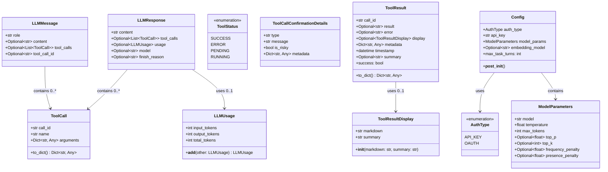

```mermaid
classDiagram
    %% llm_basics.py
    class LLMMessage {
        +str role
        +Optional~str~ content
        +Optional~List~ToolCall~~ tool_calls
        +Optional~str~ tool_call_id
    }

    class LLMUsage {
        +int input_tokens
        +int output_tokens
        +int total_tokens
        +__add__(other: LLMUsage) LLMUsage
    }

    class LLMResponse {
        +str content
        +Optional~List~ToolCall~~ tool_calls
        +Optional~LLMUsage~ usage
        +Optional~str~ model
        +Optional~str~ finish_reason
    }

    %% tool_basics.py
    class ToolCall {
        +str call_id
        +str name
        +Dict~str, Any~ arguments
        +to_dict() Dict~str, Any~
    }

    class ToolStatus {
        <<enumeration>>
        SUCCESS
        ERROR
        PENDING
        RUNNING
    }

    class ToolResultDisplay {
        +str markdown
        +str summary
        +__init__(markdown: str, summary: str)
    }

    class ToolCallConfirmationDetails {
        +str type
        +str message
        +bool is_risky
        +Dict~str, Any~ metadata
    }

    class ToolResult {
        +str call_id
        +Optional~str~ result
        +Optional~str~ error
        +Optional~ToolResultDisplay~ display
        +Dict~str, Any~ metadata
        +datetime timestamp
        +Optional~str~ summary
        +success: bool
        +to_dict() Dict~str, Any~
    }

    %% llm_config.py
    class AuthType {
        <<enumeration>>
        API_KEY
        OAUTH
    }

    class ModelParameters {
        +str model
        +float temperature
        +int max_tokens
        +Optional~float~ top_p
        +Optional~int~ top_k
        +Optional~float~ frequency_penalty
        +Optional~float~ presence_penalty
    }

    class Config {
        +AuthType auth_type
        +str api_key
        +ModelParameters model_params
        +Optional~str~ embedding_model
        +max_task_turns: int
        +__post_init__()
    }

    %% 关系
    LLMMessage --> ToolCall : contains 0..*
    LLMResponse --> ToolCall : contains 0..*
    LLMResponse --> LLMUsage : uses 0..1
    ToolResult --> ToolResultDisplay : uses 0..1
    Config --> AuthType : uses
    Config --> ModelParameters : contains

    %% 样式
    classDef enumClass fill:#e1f5fe
    classDef dataClass fill:#f3e5f5
    classDef configClass fill:#e8f5e8

```