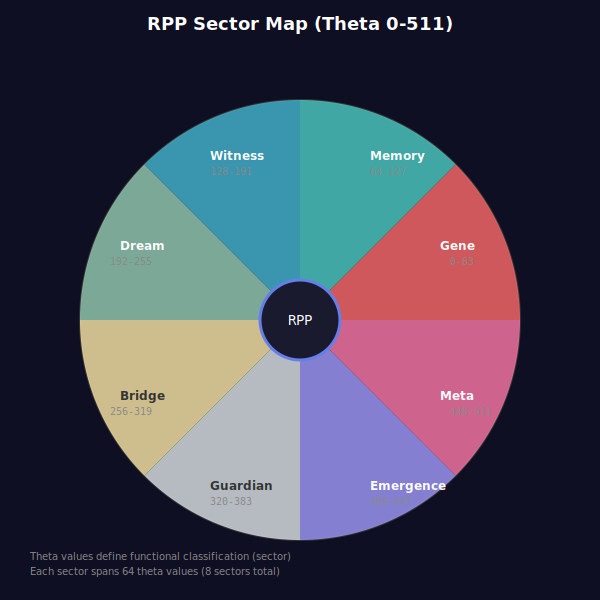

# RPP Diagrams and Visualizations

Visual documentation for the Rotational Packet Protocol specification.

## Static Diagrams

### Address Structure


Shows the 28-bit address layout with Shell, Theta, Phi, and Harmonic fields.

### Bridge Architecture


Illustrates how RPP routes to existing storage systems via the resolver layer.

### Sector Map


Circular diagram showing the 8 functional sectors defined by theta values.

## Interactive Visualization

### RPP Address Explorer
Open [interactive-explorer.html](interactive-explorer.html) in a browser to:

- Adjust Shell, Theta, Phi, and Harmonic values with sliders
- See real-time address encoding (hex and decimal)
- View bit-level representation with color-coded fields
- Understand semantic interpretation (sector, grounding level, tier)
- Visualize position on spherical coordinate representation

## Usage

All diagrams are released under CC BY 4.0 license.

### Embedding in Documentation

```html

```

### Hosting Interactive Explorer

The HTML file is self-contained with no external dependencies. Simply serve it from any web server or open directly in a browser.

## Author

Alexander Liam Lennon

## License

CC BY-SA 4.0 - See [LICENSE](../LICENSE) in repository root.
