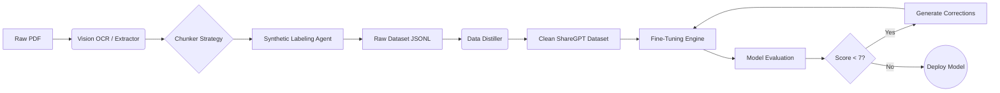

# 🧠 Saara: Advanced Document-to-LLM Data Engine

[](https://www.python.org/downloads/)
[](https://ollama.com/)
[](LICENSE)

**Saara** is an end-to-end autonomous data pipeline designed to transform raw, unstructured documents (PDFs, research papers) into high-quality, instruction-tuned datasets for fine-tuning Large Language Models (LLMs).

> **Why this exists**: Creating high-quality datasets is the bottleneck in training domain-specific AI. This tool automates the "boring stuff"—OCR, chunking, labeling, and cleaning—allowing you to go from PDF to fine-tuned model in hours, not weeks.

---

## 🚀 Key Features

### 1. 👁️ SOTA Vision-LLM OCR
- **No more Garbled Text**: Uses **Moondream** and **Qwen2.5-VL** (Vision-Language Models) to "read" PDFs visually.
- Handles complex double-column layouts, tables, and scientific diagrams that traditional OCR (Tesseract) fails on.
- **Hybrid Fallback**: Automatically switches between PyMuPDF (fast) and Vision OCR (accurate) based on page extractability.

### 2. 🤖 Autonomous Data Labeling
- Uses local LLMs (Granite 4.0, Llama 3) to generate diverse training tasks:
    - **Instruction Tuning**: "How do I treat X using Ayurveda?"
    - **Q&A Pairs**: Fact-based extraction.
    - **Summarization**: TL;DRs of complex sections.
    - **Classification**: Topic tagging.

### 3. 🧪 Data Distillation & Hygiene
- **Self-Cleaning**: The `distill` module removes low-quality generations, duplicates, and confabulations.
- **ShareGPT Formatting**: Automatically converts raw data into the industry-standard conversation format.

### 4. 🎓 Native Fine-Tuning Support
- **One-Command Training**: Built-in training loop using `SFTTrainer` (QLoRA) to fine-tune any HuggingFace model.
- **Multi-Format Support**: Automatically handles ShareGPT, Alpaca, and Raw Text formats.
- **Checkpoint Resume**: Continue training from any checkpoint.
- Optimized for consumer GPUs (supports 4-bit quantization).

### 5. 🧪 Model Evaluation & Self-Improvement *(NEW)*
- **Granite 4 as Judge**: Test your fine-tuned model with automatic quality scoring.
- **Self-Improvement Loop**: Low-scoring responses are corrected and used for next training round.
- **Iterative Enhancement**: Train → Evaluate → Improve → Repeat.

### 6.  Model Deployment *(NEW)*
- **Local Chat**: Interactive terminal testing with your model.
- **Ollama Export**: Convert to GGUF format for Ollama usage.
- **HuggingFace Hub**: Push your model to share with the community.
- **Cloud Deployment**: Docker + Google Cloud Run ready.

---

## 🛠️ Architecture



---

## 📦 Installation

1.  **Clone the repository**:
    ```bash
    git clone https://github.com/nikhil49023/Data-engine.git
    cd Data-engine
    ```

2.  **Install the CLI**:
    ```bash
    pip install -e .
    ```

3.  **Add Python Scripts to PATH** (Windows only):
    
    If `saara` command is not recognized, add the Python Scripts folder to your PATH:
    ```powershell
    # Find your Scripts path
    python -c "import sysconfig; print(sysconfig.get_path('scripts', 'nt_user'))"
    
    # Add it to PATH permanently (replace with your actual path)
    setx PATH "%PATH%;C:\Users\YOUR_USERNAME\AppData\Local\...\Scripts"
    ```
    
    **Or use the local launcher** (no PATH changes needed):
    ```bash
    .\saara.bat --help
    ```

4.  **Setup Ollama**:
    - Install [Ollama](https://ollama.ai)

For detailed usage instructions, please refer to the:
- [**CLI User Guide**](CLI_DOCUMENTATION.md) (Commands & Workflows)
- [**Functionality & Use Cases**](SAARA_FUNCTIONALITY_GUIDE.md) (capabilities & scenarios)

    - The setup wizard will help you install models automatically

### Quick Start

**First-time setup (recommended):**
```bash
pip install saara-ai
saara setup
```

The setup wizard will:
1. ✅ Detect your hardware (GPU, VRAM, RAM)
2. ✅ Recommend optimal models for your system
3. ✅ Install selected vision and analyzer models
4. ✅ Save configuration

**As a Python SDK:**
```python
from saara import DataPipeline

pipeline = DataPipeline("config.yaml")
result = pipeline.process_directory("./documents")
```
---

## ⚡ Usage

### 🚀 First-Time Setup

```bash
saara setup
```

This wizard detects your hardware and recommends models:

| Hardware Tier | VRAM | Recommended Models |
|--------------|------|-------------------|
| Minimal | < 4 GB | Moondream, Phi-3 Mini |
| Light | 4-8 GB | Qwen2.5-VL 3B, Llama 3.2 3B |
| Medium | 8-16 GB | Qwen2.5-VL 7B, Mistral 7B |
| Heavy | > 16 GB | Qwen2.5-VL 32B, Qwen 2.5 32B |

### 📦 Model Management

```bash
# List all available and installed models
saara models list

# Install a specific model  
saara models install moondream
saara models install llama3.2:3b
saara models install qwen2.5vl:7b

# Remove a model
saara models remove moondream

# Check status of all models
saara models status
```

### 🎯 Interactive Wizard

```bash
saara run
```

This launches a beautiful CLI wizard with 4 workflows:

| Option | Mode | Description |
|--------|------|-------------|
| 1 | 📄 Dataset Creation | Extract data from PDFs → Generate training datasets |
| 2 | 🧠 Model Training | Fine-tune LLMs on your prepared data |
| 3 | 🧪 Model Evaluation | Test & improve models with Granite 4 |
| 4 | 🚀 Model Deployment | Deploy locally (Ollama) or to cloud |


---

### 📄 Dataset Creation Flow

1. Select input PDF folder and output directory
2. Choose Vision OCR model (Moondream/Qwen) - auto-detects available models
3. Choose Analyzer model (Granite 4/Llama 3/Qwen 2.5/Mistral)
4. Configure advanced options (chunk size, Q&A density)
5. Pipeline automatically generates:
   - `*_instruction.jsonl` - Instruction tuning data
   - `*_qa.jsonl` - Q&A pairs
   - `*_sharegpt.jsonl` - Chat format (best for training)
   - `*_summarization.jsonl` - Summarization tasks

---

### 🔬 Distillation Pipeline (New!)

Generate high-quality synthetic training data from text/markdown files:

```bash
# Distill a markdown file into training data
saara distill document.md --type reasoning

# Process entire folder with custom settings
saara distill ./texts --pairs 5 --output ./my_dataset

# All options
saara distill input.md \
  --type all \           # factual, reasoning, conversational
  --pairs 3 \            # pairs per type per chunk
  --clean \              # enable text sanitization
  --filter \             # enable quality filtering
  --output ./datasets
```

**Pipeline Steps:**
1. **Sanitization** - Removes OCR artifacts and conversational filler
2. **Semantic Chunking** - Splits by Markdown headers (not character count)
3. **Multi-Type Generation** - Creates factual, reasoning, and conversational data
4. **Quality Filtering** - Rejects short answers and document-referencing phrases

**Data Types Generated:**
| Type | Description | Example |
|------|-------------|---------|
| Factual | Fact retrieval | "What is X?" → "X is..." |
| Reasoning | Why/How questions | "Why does X happen?" → Step-by-step |
| Conversational | User scenarios | "I need help with X..." → Helpful response |
| Instruction | Task completion | "Summarize..." → Summary |


### 🧠 Model Training Flow

**Features:**
- Select from preset models or enter any HuggingFace ID
- Auto-combine multiple datasets from a folder
- HuggingFace login for gated models (Gemma, Llama)
- Resume training from checkpoints
- Optimized hyperparameters for fast training

**Supported Base Models:**
| Model | Size | Best For |
|-------|------|----------|
| sarvamai/sarvam-1 | 2B | Indian Languages |
| google/gemma-2b | 2B | General Purpose |
| TinyLlama/TinyLlama-1.1B | 1.1B | Fast Testing |
| meta-llama/Llama-3.2-1B | 1B | English Tasks |
| Qwen/Qwen2.5-7B | 7B | Complex Reasoning |

**Output:** `models/{model-name}-finetuned/final_adapter/`

---

### 🧪 Model Evaluation Flow

Uses **Granite 4** to evaluate your fine-tuned model:

1. Runs test prompts through your model
2. Scores each response (1-10)
3. Generates improved responses for low scores
4. Creates correction data for next training round

**Self-Improvement Cycle:**
```
Train Model → Evaluate (Granite 4) → Generate Corrections → Retrain → Repeat
```

### 🧠 Autonomous Learning (New!)
Train your model by letting it learn autonomously from a superior "Teacher Model".

- **Concept**: Student (your model) answers questions; Teacher (GPT-4, Gemini, etc.) corrects them.
- **Result**: High-quality synthetic training data specific to your domain.

**Supported Teachers:**
- **Ollama** (Local): Granite 4, Llama 3
- **OpenAI** (Cloud): GPT-4o, GPT-3.5
- **Google** (Cloud): Gemini 1.5 Pro/Flash
- **DeepSeek** (Cloud): DeepSeek V3/R1
- **HuggingFace** (Cloud/Local): Any open weights model

**Output:** `evaluations/learned_data_{topic}_{date}.jsonl`

---

### 🚀 Model Deployment Flow

| Option | Platform | Description |
|--------|----------|-------------|
| 1 | Local Chat | Interactive terminal chat |
| 2 | Ollama Export | Convert to GGUF format |
| 3 | HuggingFace | Push to HF Hub |
| 4 | Cloud Deploy | Docker + Google Cloud Run |
| 5 | Merge Model | Merge adapter with base |

**API Server:** Creates a ready-to-deploy FastAPI server at `exports/api_server/`

---

### 🖥️ Command Line (Advanced)

```bash
# Process PDFs
saara batch "./input_pdfs" --name ayurveda_v1

# Distill & clean
saara distill --name ayurveda_v1

# Train model
saara train --data datasets/distilled_train.jsonl --model google/gemma-2b
```

---

##  CLI Command Reference

`saara` exposes a powerful command-line interface.

### 1. Process Data
Extract, chunk, and label documents.

**Single File:**
```bash
saara process <file_path> --name <dataset_name>
```

**Batch Directory:**
```bash
saara batch <dir_path> --name <dataset_name>
```

**Options:**
- `--config, -c`: Path to config YAML (default: `config.yaml`)
- `--name, -n`: Name for output files

### 2. Train Model
Fine-tune a base model on your datasets.

```bash
saara train --data <jsonl_path> --model <base_model_id>
```

**Options:**
- `--data, -d`: Path to ShareGPT .jsonl file
- `--model, -m`: HuggingFace model ID (e.g., `google/gemma-2b`, `sarvamai/sarvam-1`)

### 3. Evaluate Model (Autonomous Learning)
Evaluate a trained model or run the self-improvement loop.

```bash
saara evaluate <base_model> <adapter_path>
```

To run **Autonomous Learning** via CLI (advanced):
*(Currently best accessed via `saara run` for interactive config)*

### 4. Distill Data
Clean and filter low-quality generations.

```bash
saara distill --name <batch_name>
```

### 5. API Server
Start the local REST API.

```bash
saara serve --port 8000
```

---

## 📁 Project Structure

```
Data-engine/
├── setup.py                # Package setup
├── config.yaml             # Configuration settings
├── requirements.txt        # Dependencies
├── saara/                  # Source code
│   ├── cli.py             # CLI entry point
│   ├── pipeline.py         # Core data pipeline
│   ├── train.py            # LLM fine-tuning module
│   ├── evaluator.py        # Model evaluation with Granite 4
│   ├── deployer.py         # Deployment utilities
│   ├── distiller.py        # Data cleaning & distillation
│   ├── dataset_generator.py # Dataset format generation
│   └── ollama_client.py    # Ollama API client
├── models/                 # Saved fine-tuned adapters
├── datasets/               # Generated datasets
├── evaluations/            # Evaluation results & corrections
└── exports/                # Deployment artifacts
```

---

## 🔮 Roadmap

- [x] Vision-LLM OCR (Moondream, Qwen)
- [x] Autonomous data labeling
- [x] Multi-format dataset generation
- [x] Native fine-tuning with QLoRA
- [x] Model evaluation with Granite 4
- [x] Self-improvement training loop
- [x] Local & cloud deployment
- [ ] Multi-modal dataset generation (images + text)
- [ ] RAG-based factual verification
- [ ] Web UI dashboard

---

## 📄 License

**Proprietary License** - Copyright © 2024-2025 Nikhil. All Rights Reserved.

This software is provided under a proprietary license with the following terms:

✅ **Permitted:**
- Use the software for personal, educational, or commercial purposes
- Reference in academic/educational contexts with attribution

❌ **Not Permitted:**
- Modify, alter, or create derivative works
- Reproduce, copy, or duplicate the software
- Distribute, sublicense, or sell the software
- Reverse engineer or decompile the software

See the [LICENSE](LICENSE) file for full details.

---

## 👤 Author

**Nikhil** - [GitHub](https://github.com/nikhil49023)

---

*Built with ❤️ for the AI community*
