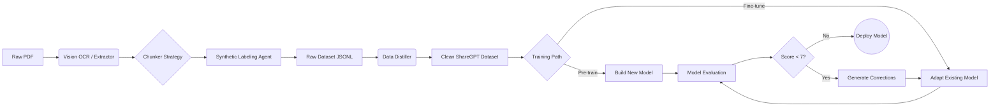

# 🧠 SAARA: Autonomous Document-to-LLM Data Engine

[](https://www.python.org/downloads/)
[](https://ollama.com/)
[](LICENSE)

**SAARA** is an end-to-end autonomous data pipeline designed to transform raw, unstructured documents (PDFs, research papers) into high-quality, instruction-tuned datasets for fine-tuning Large Language Models (LLMs).

> **Why this exists**: Creating high-quality datasets is the bottleneck in training domain-specific AI. This tool automates the "boring stuff"—OCR, chunking, labeling, and cleaning—allowing you to go from PDF to fine-tuned model in hours, not weeks.

---

## 🚀 Key Features

### 1. 👁️ SOTA Vision-LLM OCR
- **No more Garbled Text**: Uses **Moondream** and **Qwen2.5-VL** (Vision-Language Models) to "read" PDFs visually.
- Handles complex double-column layouts, tables, and scientific diagrams that traditional OCR (Tesseract) fails on.
- **Hybrid Fallback**: Automatically switches between PyMuPDF (fast) and Vision OCR (accurate) based on page extractability.

### 2. 🤖 Autonomous Data Labeling
- Uses local LLMs (Granite 4.0, Llama 3) to generate diverse training tasks:
    - **Instruction Tuning**: "How do I treat X using Ayurveda?"
    - **Q&A Pairs**: Fact-based extraction.
    - **Summarization**: TL;DRs of complex sections.
    - **Classification**: Topic tagging.

### 3. 🧪 Data Distillation & Hygiene
- **Self-Cleaning**: The `distill` module removes low-quality generations, duplicates, and confabulations.
- **ShareGPT Formatting**: Automatically converts raw data into the industry-standard conversation format.

### 4. 🏗️ Pre-training from Scratch *(NEW)*
- **Build Your Own LLM**: Create custom models from 15M to 3B parameters.
- **Custom Tokenizers**: Train domain-specific BPE tokenizers on your data.
- **Full Pipeline**: Pre-train → Fine-tune → Evaluate → Deploy.
- Production-ready LLaMA-style architectures.

### 5. 🎓 Native Fine-Tuning Support
- **One-Command Training**: Built-in training loop using `SFTTrainer` (QLoRA) to fine-tune any HuggingFace model.
- **Multi-Format Support**: Automatically handles ShareGPT, Alpaca, and Raw Text formats.
- **Checkpoint Resume**: Continue training from any checkpoint.
- **Iterative Fine-tuning**: Fine-tune your already fine-tuned models to keep improving.
- Optimized for consumer GPUs (supports 4-bit quantization).

### 6. 🧪 Model Evaluation & Self-Improvement
- **Granite 4 as Judge**: Test your fine-tuned model with automatic quality scoring.
- **Self-Improvement Loop**: Low-scoring responses are corrected and used for next training round.
- **Iterative Enhancement**: Train → Evaluate → Improve → Repeat.

### 7. 🚀 Model Deployment
- **Local Chat**: Interactive terminal testing with your model.
- **Ollama Export**: Convert to GGUF format for Ollama usage.
- **HuggingFace Hub**: Push your model to share with the community.
- **Cloud Deployment**: Docker + Google Cloud Run ready.

---

## 🛠️ Architecture



---

## 📦 Installation

1.  **Clone the repository**:
    ```bash
    git clone https://github.com/nikhil49023/Data-engine.git
    cd Data-engine
    ```

2.  **Install the CLI**:
    ```bash
    pip install -e .
    ```

3.  **Setup Ollama**:
    - Install [Ollama](https://ollama.ai)
    - The setup wizard will help you install models automatically

### Quick Start

**First-time setup (recommended):**
```bash
saara setup
```

The setup wizard will:
1. ✅ Detect your hardware (GPU, VRAM, RAM)
2. ✅ Recommend optimal models for your system
3. ✅ Install selected vision and analyzer models
4. ✅ Save configuration

---

## ⚡ Usage

### 🎯 Interactive Wizard (Recommended)

```bash
saara run
```

This launches a beautiful CLI wizard with 5 workflows:

| Option | Mode | Description |
|--------|------|-------------|
| 1 | 📄 Dataset Creation | Extract data from PDFs → Generate training datasets |
| 2 | 🧠 Model Training | Fine-tune LLMs on your prepared data |
| 3 | 🧪 Model Evaluation | Test & improve models with Granite 4 |
| 4 | 🚀 Model Deployment | Deploy locally (Ollama) or to cloud |
| 5 | 🏗️ Pre-training | Build & train a model from scratch |

---

### 🏗️ Pre-training from Scratch *(NEW)*

Build your own language model from the ground up:

```bash
saara pretrain
```

**Available Architectures:**

| Name | Parameters | VRAM | Use Case |
|------|-----------|------|----------|
| Nano | ~15M | 2GB+ | Testing, learning (CPU trainable) |
| Micro | ~50M | 4GB+ | Experimentation |
| Mini | ~125M | 6GB+ | Domain-specific pre-training |
| Small | ~350M | 8GB+ | Specialized tasks |
| Base | ~1B | 16GB+ | Production models |
| Large | ~3B | 24GB+ | High-capacity models |

**Pre-training Sub-menu:**
1. 📚 Create Pre-training Dataset
2. 🏗️ Build & Train New Model
3. 🔤 Train Custom Tokenizer
4. 🧪 Test Pre-trained Model
5. 📋 List Pre-trained Models

**Pre-training Dataset Creation:**
- Extracts raw text from PDFs, markdown, and text files
- Cleans OCR artifacts and normalizes unicode
- Chunks text into optimal sizes for language modeling
- **LLM-Enhanced Processing (Optional):**
  - Uses local LLM (Granite 4, Llama 3, Qwen) to clean and improve text
  - Fixes OCR errors and expands abbreviations
  - LLM-based quality scoring for more accurate filtering
- Quality filtering (removes low-quality/incoherent text)
- Deduplication (prevents model memorization)
- Outputs in JSONL format ready for training
- Optional train/validation split

**Workflow:**
```
Create Dataset → Train Tokenizer (optional) → Pre-train Model → Test → Fine-tune → Deploy
```

---


### 📄 Dataset Creation Flow

1. Select input PDF folder and output directory
2. Choose Vision OCR model (Moondream/Qwen) - auto-detects available models
3. Choose Analyzer model (Granite 4/Llama 3/Qwen 2.5/Mistral)
4. Configure advanced options (chunk size, Q&A density)
5. Pipeline automatically generates:
   - `*_instruction.jsonl` - Instruction tuning data
   - `*_qa.jsonl` - Q&A pairs
   - `*_sharegpt.jsonl` - Chat format (best for training)
   - `*_summarization.jsonl` - Summarization tasks

---

### 🧠 Model Training Flow

The training wizard now supports:
- **Base Models**: HuggingFace models (Gemma, Llama, Qwen, etc.)
- **Custom Pre-trained**: Your own pre-trained models
- **Fine-tuned Adapters**: Continue training existing adapters

**Supported Base Models:**
| Model | Size | Best For |
|-------|------|----------|
| sarvamai/sarvam-1 | 2B | Indian Languages |
| google/gemma-2b | 2B | General Purpose |
| TinyLlama/TinyLlama-1.1B | 1.1B | Fast Testing |
| meta-llama/Llama-3.2-1B | 1B | English Tasks |
| Qwen/Qwen2.5-7B | 7B | Complex Reasoning |

**Output:** `models/{model-name}-finetuned/final_adapter/`

---

### 🧪 Model Evaluation Flow

Uses **Granite 4** to evaluate your fine-tuned model:

1. Runs test prompts through your model
2. Scores each response (1-10)
3. Generates improved responses for low scores
4. Creates correction data for next training round

**Self-Improvement Cycle:**
```
Train Model → Evaluate (Granite 4) → Generate Corrections → Retrain → Repeat
```

---

### 🚀 Model Deployment Flow

| Option | Platform | Description |
|--------|----------|-------------|
| 1 | Local Chat | Interactive terminal chat |
| 2 | Ollama Export | Convert to GGUF format |
| 3 | HuggingFace | Push to HF Hub |
| 4 | Cloud Deploy | Docker + Google Cloud Run |
| 5 | Merge Model | Merge adapter with base |

---

## 📟 CLI Commands

### Core Commands

| Command | Description |
|---------|-------------|
| `saara run` | Start interactive wizard |
| `saara pretrain` | Build & train model from scratch |
| `saara setup` | First-time hardware detection & model setup |
| `saara version` | Show version information |

### Data Processing

| Command | Description |
|---------|-------------|
| `saara process <file>` | Process a single PDF file |
| `saara batch <dir>` | Process all PDFs in directory |
| `saara distill <input>` | Generate synthetic training data |

### Model Operations

| Command | Description |
|---------|-------------|
| `saara train` | Fine-tune a model (interactive) |
| `saara deploy` | Deploy a trained model |
| `saara evaluate <base> <adapter>` | Evaluate model quality |

### Model Management

| Command | Description |
|---------|-------------|
| `saara models list` | List all available models |
| `saara models install <name>` | Install an Ollama model |
| `saara models remove <name>` | Remove a model |
| `saara models status` | Show hardware & model status |

### Server

| Command | Description |
|---------|-------------|
| `saara serve` | Start REST API server |

---

## 📁 Project Structure

```
Data-engine/
├── setup.py                # Package setup
├── config.yaml             # Configuration settings
├── requirements.txt        # Dependencies
├── saara/                  # Source code
│   ├── cli.py             # CLI entry point
│   ├── pipeline.py         # Core data pipeline
│   ├── pretrain.py         # Pre-training module (NEW)
│   ├── train.py            # LLM fine-tuning module
│   ├── evaluator.py        # Model evaluation
│   ├── deployer.py         # Deployment utilities
│   ├── distiller.py        # Data cleaning
│   ├── model_manager.py    # Ollama model management
│   └── splash.py           # SAARA splash screen
├── models/                 # Saved models (pre-trained & fine-tuned)
├── datasets/               # Generated datasets
├── tokenizers/             # Custom tokenizers
├── evaluations/            # Evaluation results
└── exports/                # Deployment artifacts
```

---

## 🔮 Roadmap

- [x] Vision-LLM OCR (Moondream, Qwen)
- [x] Autonomous data labeling
- [x] Multi-format dataset generation
- [x] Native fine-tuning with QLoRA
- [x] Model evaluation with Granite 4
- [x] Self-improvement training loop
- [x] Local & cloud deployment
- [x] Pre-training from scratch
- [x] Custom tokenizer training
- [x] Iterative adapter fine-tuning
- [ ] Multi-modal dataset generation (images + text)
- [ ] RAG-based factual verification
- [ ] Web UI dashboard

---

## 📄 License

**Proprietary License** - Copyright © 2024-2025 Kilani Sai Nikhil. All Rights Reserved.

This software is provided under a proprietary license with the following terms:

✅ **Permitted:**
- Use the software for personal, educational, or commercial purposes
- Reference in academic/educational contexts with attribution

❌ **Not Permitted:**
- Modify, alter, or create derivative works
- Reproduce, copy, or duplicate the software
- Distribute, sublicense, or sell the software
- Reverse engineer or decompile the software

See the [LICENSE](LICENSE) file for full details.

---

## 👤 Author

**Kilani Sai Nikhil** - [GitHub](https://github.com/nikhil49023)

---

*Built with ❤️ for the AI community*
