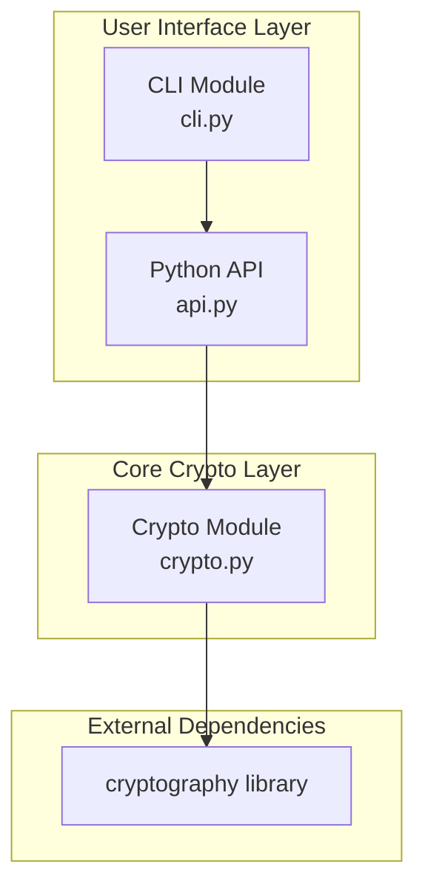

# Design Document: Shellock

## Overview

Shellock is a Python tool for encrypting and decrypting configuration files using modern cryptographic primitives. The design prioritizes security, simplicity, and auditability. The system uses Argon2id for key derivation and AES-256-GCM for authenticated encryption, packaged in a versioned binary envelope format.

## Modern Python Project Structure and Tooling

### Build System and Dependencies

Shellock follows modern Python packaging standards using `pyproject.toml` with Hatchling as the build backend:

```toml
[build-system]
requires = ["hatchling"]
build-backend = "hatchling.build"

[project]
name = "shellock"
version = "0.1.0"
description = "Secure encryption for configuration files using AES-256-GCM + Argon2id"
readme = "README.md"
requires-python = ">=3.8"
license = {text = "MIT"}
authors = [{name = "Shellock Team", email = "security@shellock.dev"}]

dependencies = [
    "cryptography>=41.0.0",
    "click>=8.0.0",
    "rich>=13.0.0",
    "zeroize-python>=0.1.0",
]

[project.optional-dependencies]
dev = [
    "pytest>=7.0",
    "pytest-cov>=4.0",
    "hypothesis>=6.0",
    "ruff>=0.1.0",
    "mypy>=1.0",
    "pre-commit>=3.0",
]

[project.scripts]
shellock = "shellock.cli:main"

[tool.ruff]
line-length = 88
target-version = "py38"
select = ["E", "F", "W", "C90", "I", "N", "UP", "S", "B", "A", "C4", "T20"]

[tool.mypy]
python_version = "3.8"
strict = true
warn_return_any = true
warn_unused_configs = true

[tool.pytest.ini_options]
minversion = "7.0"
testpaths = ["tests"]
addopts = "--cov=shellock --cov-report=html --cov-report=term-missing"
```

### Code Quality and Security Tools

- **Ruff**: Ultra-fast Python linter and formatter replacing Black, isort, and Flake8
- **MyPy**: Static type checker with strict mode for catching type-related bugs
- **Pre-commit**: Git hooks for automated code quality checks before commits
- **Pytest**: Modern testing framework with comprehensive plugin ecosystem
- **Hypothesis**: Property-based testing for discovering edge cases

### Security-Focused Dependencies

- **cryptography**: Modern cryptographic library with safe defaults
- **zeroize-python**: Secure memory cleanup to prevent data residue
- **click**: CLI framework with built-in input validation and security features
- **rich**: Terminal UI library with secure output handling

## Architecture



The architecture follows a layered approach:
1. **User Interface Layer**: CLI and Python API provide entry points
2. **Core Crypto Layer**: Handles all cryptographic operations
3. **External Dependencies**: Relies on the well-audited `cryptography` library

## Components and Interfaces

### crypto.py - Core Cryptographic Operations

This module contains all cryptographic primitives and envelope handling for both symmetric and asymmetric encryption.

```python
# Constants
MAGIC_HEADER: bytes = b"SHELLOCKv1"  # 10 bytes
MAGIC_HEADER_ASYMMETRIC: bytes = b"SHELLOCKa1"  # 10 bytes for asymmetric
SALT_SIZE: int = 16
NONCE_SIZE: int = 12
TAG_SIZE: int = 16
KEY_SIZE: int = 32

# Argon2id parameters
ARGON2_MEMORY_COST: int = 65536  # 64 MB
ARGON2_TIME_COST: int = 2
ARGON2_PARALLELISM: int = 4

class InvalidFileFormatError(Exception):
    """Raised when the encrypted file format is invalid."""
    pass

class AuthenticationError(Exception):
    """Raised when decryption fails due to wrong passphrase or tampering."""
    pass

# Symmetric encryption functions (existing)
def derive_key_from_passphrase(passphrase: str, salt: bytes) -> bytes:
    """Derive a 32-byte key from passphrase using Argon2id."""
    pass

def encrypt_bytes(plaintext: bytes, passphrase: str) -> bytes:
    """Encrypt plaintext bytes with passphrase."""
    pass

def decrypt_bytes(blob: bytes, passphrase: str) -> bytes:
    """Decrypt an encrypted envelope with passphrase."""
    pass

# Symmetric key-based encryption functions (new)
def encrypt_bytes_key(plaintext: bytes, symmetric_key: bytes) -> bytes:
    """
    Encrypt plaintext bytes with a pre-generated symmetric key.
    
    Args:
        plaintext: Data to encrypt
        symmetric_key: 32-byte symmetric key
    
    Returns:
        Binary envelope containing encrypted data (no key derivation)
    """
    pass

def decrypt_bytes_key(blob: bytes, symmetric_key: bytes) -> bytes:
    """
    Decrypt an encrypted envelope with a symmetric key.
    
    Args:
        blob: Binary envelope from encrypt_bytes_key
        symmetric_key: 32-byte symmetric key
    
    Returns:
        Original plaintext bytes
    
    Raises:
        InvalidFileFormatError: If magic header doesn't match
        AuthenticationError: If key is wrong or data is tampered
    """
    pass
# Asymmetric encryption functions (new)
def generate_keypair() -> tuple[bytes, bytes]:
    """
    Generate an Ed25519 keypair.
    
    Returns:
        tuple: (private_key_pem, public_key_pem) as bytes
    """
    pass

def encrypt_bytes_public(plaintext: bytes, public_key_pem: bytes) -> bytes:
    """
    Encrypt plaintext bytes with a public key using hybrid encryption.
    
    Args:
        plaintext: Data to encrypt
        public_key_pem: Ed25519 public key in PEM format
    
    Returns:
        Binary envelope containing encrypted symmetric key + encrypted data
    """
    pass

def decrypt_bytes_private(blob: bytes, private_key_pem: bytes, passphrase: str = None) -> bytes:
    """
    Decrypt an encrypted envelope with a private key.
    
    Args:
        blob: Binary envelope from encrypt_bytes_public
        private_key_pem: Ed25519 private key in PEM format
        passphrase: Optional passphrase if private key is encrypted
    
    Returns:
        Original plaintext bytes
    
    Raises:
        InvalidFileFormatError: If magic header doesn't match
        AuthenticationError: If private key is wrong or data is tampered
    """
    pass
```

### api.py - File-Based Operations

This module provides high-level file operations built on top of crypto.py for both symmetric and asymmetric encryption.

```python
# Symmetric encryption API (existing)
def encrypt_file(in_path: str, out_path: str, passphrase: str) -> None:
    """Encrypt a file and write the result to another file."""
    pass

def decrypt_file(in_path: str, out_path: str, passphrase: str) -> None:
    """Decrypt an encrypted file and write the result to another file."""
    pass

# Symmetric key-based encryption API (new)
def encrypt_file_key(in_path: str, out_path: str, key_file_path: str) -> None:
    """
    Encrypt a file with a symmetric key file and write the result to another file.
    
    Args:
        in_path: Path to plaintext input file
        out_path: Path to write encrypted output
        key_file_path: Path to base64-encoded symmetric key file
    
    Raises:
        FileNotFoundError: If input file or key file doesn't exist
        InvalidFileFormatError: If key file format is invalid
    """
    pass

def decrypt_file_key(in_path: str, out_path: str, key_file_path: str) -> None:
    """
    Decrypt an encrypted file with a symmetric key file and write the result to another file.
    
    Args:
        in_path: Path to encrypted input file
        out_path: Path to write decrypted output
        key_file_path: Path to base64-encoded symmetric key file
    
    Raises:
        FileNotFoundError: If input file or key file doesn't exist
        InvalidFileFormatError: If file format or key format is invalid
        AuthenticationError: If key is wrong or data is tampered
    """
    pass

# Asymmetric encryption API (new)
def encrypt_file_public(in_path: str, out_path: str, public_key_path: str) -> None:
    """
    Encrypt a file with a public key and write the result to another file.
    
    Args:
        in_path: Path to plaintext input file
        out_path: Path to write encrypted output
        public_key_path: Path to Ed25519 public key file (PEM format)
    
    Raises:
        FileNotFoundError: If input file or public key file doesn't exist
        InvalidFileFormatError: If public key format is invalid
    """
    pass

def decrypt_file_private(in_path: str, out_path: str, private_key_path: str, passphrase: str = None) -> None:
    """
    Decrypt an encrypted file with a private key and write the result to another file.
    
    Args:
        in_path: Path to encrypted input file
        out_path: Path to write decrypted output
        private_key_path: Path to Ed25519 private key file (PEM format)
        passphrase: Optional passphrase if private key is encrypted
    
    Raises:
        FileNotFoundError: If input file or private key file doesn't exist
        InvalidFileFormatError: If file format or key format is invalid
        AuthenticationError: If private key is wrong or data is tampered
    """
    pass
```

### cli.py - Command Line Interface

This module provides the CLI using Click framework for superior developer experience and user-friendly interfaces.

```python
import click
import getpass
from rich.console import Console
from rich.progress import Progress, SpinnerColumn, TextColumn

console = Console()

@click.group()
@click.version_option()
def cli():
    """Shellock - Secure encryption for configuration files."""
    pass

@cli.command()
@click.argument('input_file', type=click.Path(exists=True))
@click.option('--out', '-o', required=True, type=click.Path(), help='Output file path')
@click.option('--passphrase', '-p', help='Passphrase (will prompt if not provided)')
def encrypt(input_file: str, out: str, passphrase: str) -> None:
    """Encrypt a file with a passphrase."""
    if not passphrase:
        passphrase = getpass.getpass("Passphrase: ")
    
    with Progress(
        SpinnerColumn(),
        TextColumn("[progress.description]{task.description}"),
        console=console,
    ) as progress:
        task = progress.add_task("Encrypting...", total=None)
        # Implementation here
        progress.update(task, description="Encryption complete")

@cli.command()
@click.argument('input_file', type=click.Path(exists=True))
@click.option('--out', '-o', required=True, type=click.Path(), help='Output file path')
@click.option('--passphrase', '-p', help='Passphrase (will prompt if not provided)')
def decrypt(input_file: str, out: str, passphrase: str) -> None:
    """Decrypt a file with a passphrase."""
    if not passphrase:
        passphrase = getpass.getpass("Passphrase: ")
    
    with Progress(
        SpinnerColumn(),
        TextColumn("[progress.description]{task.description}"),
        console=console,
    ) as progress:
        task = progress.add_task("Decrypting...", total=None)
        # Implementation here
        progress.update(task, description="Decryption complete")

@cli.command('generate-key')
@click.option('--type', 'key_type', type=click.Choice(['symmetric', 'asymmetric']), 
              default='symmetric', help='Type of key to generate')
@click.option('--out', '-o', required=True, type=click.Path(), help='Output file path')
@click.confirmation_option(prompt='Generate a new encryption key?')
def generate_key(key_type: str, out: str) -> None:
    """Generate a random encryption key."""
    if key_type == 'symmetric':
        # Generate 32 random bytes for symmetric key
        key = secrets.token_bytes(32)
        key_b64 = base64.b64encode(key).decode()
        with open(out, 'w') as f:
            f.write(key_b64)
        console.print(f"[green]Symmetric key generated: {out}[/green]")
    else:
        # Generate Ed25519 keypair
        private_key_pem, public_key_pem = generate_keypair()
        
        # Write private key to file
        with open(out, 'wb') as f:
            f.write(private_key_pem)
        os.chmod(out, 0o600)  # Restrict permissions
        
        # Display public key for sharing
        console.print(f"[green]Keypair generated![/green]")
        console.print(f"Private key: {out}")
        console.print("\n[yellow]Public key (safe to share):[/yellow]")
        console.print(public_key_pem.decode())

@cli.command('encrypt-key')
@click.argument('input_file', type=click.Path(exists=True))
@click.option('--key', '-k', required=True, type=click.Path(exists=True), help='Symmetric key file path')
@click.option('--out', '-o', required=True, type=click.Path(), help='Output file path')
def encrypt_key(input_file: str, key: str, out: str) -> None:
    """Encrypt a file with a symmetric key file."""
    with Progress(
        SpinnerColumn(),
        TextColumn("[progress.description]{task.description}"),
        console=console,
    ) as progress:
        task = progress.add_task("Encrypting with symmetric key...", total=None)
        encrypt_file_key(input_file, out, key)
        progress.update(task, description="Encryption complete")

@cli.command('decrypt-key')
@click.argument('input_file', type=click.Path(exists=True))
@click.option('--key', '-k', required=True, type=click.Path(exists=True), help='Symmetric key file path')
@click.option('--out', '-o', required=True, type=click.Path(), help='Output file path')
def decrypt_key(input_file: str, key: str, out: str) -> None:
    """Decrypt a file with a symmetric key file."""
    with Progress(
        SpinnerColumn(),
        TextColumn("[progress.description]{task.description}"),
        console=console,
    ) as progress:
        task = progress.add_task("Decrypting with symmetric key...", total=None)
        decrypt_file_key(input_file, out, key)
        progress.update(task, description="Decryption complete")

@cli.command('encrypt-public')
@click.argument('input_file', type=click.Path(exists=True))
@click.option('--key', '-k', required=True, type=click.Path(exists=True), help='Public key file path')
@click.option('--out', '-o', required=True, type=click.Path(), help='Output file path')
def encrypt_public(input_file: str, key: str, out: str) -> None:
    """Encrypt a file with a public key."""
    with Progress(
        SpinnerColumn(),
        TextColumn("[progress.description]{task.description}"),
        console=console,
    ) as progress:
        task = progress.add_task("Encrypting with public key...", total=None)
        encrypt_file_public(input_file, out, key)
        progress.update(task, description="Encryption complete")

@cli.command('decrypt-private')
@click.argument('input_file', type=click.Path(exists=True))
@click.option('--key', '-k', required=True, type=click.Path(exists=True), help='Private key file path')
@click.option('--out', '-o', required=True, type=click.Path(), help='Output file path')
@click.option('--passphrase', '-p', help='Private key passphrase (will prompt if not provided)')
def decrypt_private(input_file: str, key: str, out: str, passphrase: str) -> None:
    """Decrypt a file with a private key."""
    if not passphrase:
        passphrase = getpass.getpass("Private key passphrase (leave empty if none): ")
        if not passphrase:
            passphrase = None
    
    with Progress(
        SpinnerColumn(),
        TextColumn("[progress.description]{task.description}"),
        console=console,
    ) as progress:
        task = progress.add_task("Decrypting with private key...", total=None)
        decrypt_file_private(input_file, out, key, passphrase)
        progress.update(task, description="Decryption complete")

def main() -> None:
    """Main entry point for the CLI."""
    cli()
```

## Data Models

### Encrypted Envelope Format

The binary envelope format is fixed-layout for simplicity and security:

```
┌─────────────────────────────────────────────────────────────────┐
│ Offset │ Size    │ Field      │ Description                    │
├────────┼─────────┼────────────┼────────────────────────────────┤
│ 0      │ 10      │ Magic      │ b"SHELLOCKv1" - version marker │
│ 10     │ 16      │ Salt       │ Random salt for Argon2id       │
│ 26     │ 12      │ Nonce      │ Random nonce for AES-GCM       │
│ 38     │ 16      │ Tag        │ GCM authentication tag         │
│ 54     │ varies  │ Ciphertext │ Encrypted data                 │
└─────────────────────────────────────────────────────────────────┘
```

### Asymmetric Envelope Format

For asymmetric encryption, a different envelope format is used:

```
┌─────────────────────────────────────────────────────────────────┐
│ Offset │ Size    │ Field           │ Description               │
├────────┼─────────┼─────────────────┼───────────────────────────┤
│ 0      │ 10      │ Magic           │ b"SHELLOCKa1" - asymmetric│
│ 10     │ 2       │ Key Length      │ Length of encrypted key   │
│ 12     │ varies  │ Encrypted Key   │ Symmetric key encrypted   │
│        │         │                 │ with Ed25519 public key   │
│ 12+N   │ 12      │ Nonce           │ Random nonce for AES-GCM  │
│ 24+N   │ 16      │ Tag             │ GCM authentication tag    │
│ 40+N   │ varies  │ Ciphertext      │ Data encrypted with       │
│        │         │                 │ symmetric key             │
└─────────────────────────────────────────────────────────────────┘
```

### Hybrid Encryption Workflow

1. **Encryption Process**:
   - Generate random 32-byte symmetric key
   - Encrypt data with AES-256-GCM using symmetric key
   - Encrypt symmetric key with recipient's Ed25519 public key
   - Package encrypted key + encrypted data in asymmetric envelope

2. **Decryption Process**:
   - Parse asymmetric envelope
   - Decrypt symmetric key using Ed25519 private key
   - Decrypt data using recovered symmetric key

### Envelope Data Class

```python
from dataclasses import dataclass

@dataclass
class Envelope:
    """Represents a parsed encrypted envelope."""
    magic: bytes      # 10 bytes
    salt: bytes       # 16 bytes
    nonce: bytes      # 12 bytes
    tag: bytes        # 16 bytes
    ciphertext: bytes # variable length
    
    @classmethod
    def from_bytes(cls, data: bytes) -> "Envelope":
        """Parse an envelope from raw bytes."""
        pass
    
    def to_bytes(self) -> bytes:
        """Serialize envelope to raw bytes."""
        pass
```

## Correctness Properties

*A property is a characteristic or behavior that should hold true across all valid executions of a system—essentially, a formal statement about what the system should do. Properties serve as the bridge between human-readable specifications and machine-verifiable correctness guarantees.*

### Property 1: Key Derivation Determinism

*For any* passphrase and salt combination, calling `derive_key_from_passphrase` multiple times SHALL produce the same 32-byte key.

**Validates: Requirements 1.3**

### Property 2: Key Derivation Salt Sensitivity

*For any* passphrase and two different salts, calling `derive_key_from_passphrase` SHALL produce different keys.

**Validates: Requirements 1.4**

### Property 3: Encryption-Decryption Round Trip

*For any* valid plaintext bytes and passphrase, encrypting with `encrypt_bytes` then decrypting with `decrypt_bytes` using the same passphrase SHALL return bytes equal to the original plaintext.

**Validates: Requirements 4.1**

### Property 4: Encryption Non-Determinism

*For any* plaintext bytes and passphrase, calling `encrypt_bytes` twice SHALL produce different ciphertexts (due to random salt and nonce).

**Validates: Requirements 4.2**

### Property 5: Envelope Serialization Round Trip

*For any* valid Envelope object, calling `to_bytes()` then `from_bytes()` SHALL produce an equivalent Envelope object.

**Validates: Requirements 2.5, 3.2**

### Property 6: Invalid Magic Header Detection

*For any* byte sequence that does not start with `b"ENVCRYPTv1"`, calling `decrypt_bytes` SHALL raise an InvalidFileFormatError.

**Validates: Requirements 3.3**

### Property 7: Wrong Passphrase Detection

*For any* encrypted envelope and a passphrase different from the one used for encryption, calling `decrypt_bytes` SHALL raise an AuthenticationError.

**Validates: Requirements 3.4**

### Property 8: Tamper Detection

*For any* encrypted envelope where any byte in the ciphertext or tag has been modified, calling `decrypt_bytes` with the correct passphrase SHALL raise an AuthenticationError.

### Property 9: Asymmetric Encryption Round Trip

*For any* valid plaintext bytes and Ed25519 keypair, encrypting with the public key then decrypting with the private key SHALL return bytes equal to the original plaintext.

**Validates: Requirements 9.1, 9.4**

### Property 10: Asymmetric Key Generation

*For any* generated Ed25519 keypair, the public key SHALL be derivable from the private key and both keys SHALL be in valid PEM format.

### Property 11: Symmetric Key-Based Encryption Round Trip

*For any* valid plaintext bytes and 32-byte symmetric key, encrypting with `encrypt_bytes_key` then decrypting with `decrypt_bytes_key` using the same key SHALL return bytes equal to the original plaintext.

**Validates: Requirements 11.1, 11.2**

## Error Handling

### Exception Hierarchy

```python
class EnvCryptError(Exception):
    """Base exception for all Shellock errors."""
    pass

class InvalidFileFormatError(EnvCryptError):
    """Raised when the encrypted file format is invalid."""
    pass

class AuthenticationError(EnvCryptError):
    """Raised when decryption fails due to wrong passphrase or tampering."""
    pass

class SecureMemoryError(EnvCryptError):
    """Raised when secure memory operations fail."""
    pass
```

### Error Scenarios

| Scenario | Exception | CLI Exit Code | User Message | Log Message |
|----------|-----------|---------------|--------------|-------------|
| Invalid magic header | InvalidFileFormatError | 1 | "Invalid file format" | "Magic header mismatch: expected SHELLOCKv1" |
| Wrong passphrase | AuthenticationError | 1 | "Authentication failed" | "Decryption failed: authentication error" |
| Tampered ciphertext | AuthenticationError | 1 | "Authentication failed" | "Decryption failed: integrity check failed" |
| Input file not found | FileNotFoundError | 1 | "File not found: {path}" | "Input file not accessible: {path}" |
| Output dir not found | FileNotFoundError | 1 | "Directory not found" | "Output directory not accessible: {path}" |

### Security Considerations

1. **No passphrase logging**: Passphrases are never logged or echoed
2. **Secure input**: CLI uses `getpass.getpass()` for passphrase prompts
3. **Constant-time comparison**: Use `secrets.compare_digest()` for all credential comparisons
4. **Memory cleanup**: Sensitive data should be zeroed using `zeroize-python` library
5. **Error message sanitization**: Generic user messages, detailed logging to protected audit logs
6. **Timing attack prevention**: All error paths execute for consistent duration

## Testing Strategy

### Unit Tests

Unit tests verify specific examples and edge cases:

- Test KDF with known test vectors
- Test encryption produces valid envelope structure
- Test decryption with known ciphertext
- Test error conditions (invalid header, wrong passphrase)
- Test CLI argument parsing and user interaction
- Test file operations with temporary files
- Test secure memory cleanup and zeroization

### Property-Based Tests

Property-based tests verify universal properties using the `hypothesis` library:

- **Minimum 100 iterations** per property test
- Each test references its design document property
- Tag format: **Feature: shellock, Property {number}: {property_text}**

Property tests to implement:
1. Key derivation determinism (Property 1)
2. Key derivation salt sensitivity (Property 2)
3. Encryption-decryption round trip (Property 3)
4. Encryption non-determinism (Property 4)
5. Envelope serialization round trip (Property 5)
6. Invalid magic header detection (Property 6)
7. Wrong passphrase detection (Property 7)
8. Tamper detection (Property 8)

### Security Testing

Additional security-focused testing:

- **Timing attack resistance**: Verify constant-time operations using statistical analysis
- **Memory residue testing**: Verify sensitive data is properly zeroed after use
- **Error message analysis**: Ensure no information leakage through error messages
- **Fuzzing**: Test with malformed inputs using `atheris` or similar fuzzing frameworks
- **Side-channel analysis**: Monitor for information leakage through timing, power, or electromagnetic channels

### Test Configuration

```python
# pytest configuration for property tests
from hypothesis import settings

settings.register_profile("ci", max_examples=100, deadline=5000)
settings.register_profile("dev", max_examples=20, deadline=2000)
settings.register_profile("security", max_examples=1000, deadline=30000)

# Security test configuration
TIMING_SAMPLES = 10000  # For timing attack resistance tests
MEMORY_ITERATIONS = 100  # For memory residue tests
```

### Test File Structure

```
tests/
    conftest.py          # Shared fixtures and security test utilities
    test_crypto.py       # Crypto module tests (unit + property + security)
    test_api.py          # API module tests
    test_cli.py          # CLI tests with subprocess and interaction testing
    test_security.py     # Dedicated security tests (timing, memory, fuzzing)
    fixtures/            # Test data and known test vectors
```
