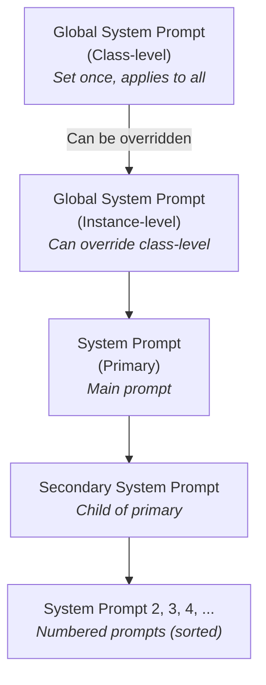

# Swarms System Prompt Manager (swarms-spm)

A lightweight, standalone Python library for managing hierarchical system prompts with support for global, primary, secondary, and numbered prompts. Perfect for AI agent systems, LLM applications, and multi-agent swarms.

**Note:** The package is installed as `swarms-spm` but imported as `swarms_spm` (Python package names cannot contain hyphens).

## Features

- **Hierarchical Prompt Management**: Organize prompts in a clear hierarchy (Global → Primary → Secondary → Numbered)
- **Global System Prompts**: Set class-level prompts that automatically apply to all instances
- **Instance-Level Overrides**: Override global prompts on a per-instance basis
- **Secondary Prompts**: Add specialized prompts as children of primary prompts
- **Numbered Prompts**: Support for multiple numbered prompts (system_prompt_2, system_prompt_3, etc.)
- **Zero Dependencies**: Only uses Python standard library - no external dependencies
- **Type Hints**: Full type annotations for better IDE support and code clarity
- **Standalone**: Can be used independently or integrated with any AI framework

## Installation

```bash
pip install swarms-spm
```

Or install from source:

```bash
git clone https://github.com/IlumCI/swarms-spm.git
cd swarms-spm
pip install -e .
```

## Quick Start

```python
from swarms_spm import SystemPromptManager

# Set a global system prompt (applies to all instances)
SystemPromptManager.set_global_system_prompt(
    "You are a helpful AI assistant."
)

# Create a manager instance
manager = SystemPromptManager(
    secondary_system_prompt="Always provide clear, structured responses."
)

# Assemble prompts hierarchically
combined_prompt = manager.assemble_system_prompts(
    system_prompt="Your primary role is data analysis.",
    system_prompts_n={
        2: "Check for outliers and anomalies.",
        3: "Format reports with clear sections."
    }
)

print(combined_prompt)
```

Output:
```
[Global System Prompt]
You are a helpful AI assistant.

[System Prompt]
Your primary role is data analysis.

[Secondary System Prompt]
Always provide clear, structured responses.

[System Prompt 2]
Check for outliers and anomalies.

[System Prompt 3]
Format reports with clear sections.
```

## Usage Guide

### Setting Global System Prompts

Global system prompts are set at the class level and automatically apply to all instances:

```python
from swarms_spm import SystemPromptManager

# Set global prompt (applies to all instances)
SystemPromptManager.set_global_system_prompt(
    "You are a professional AI assistant."
)

# Get the current global prompt
current = SystemPromptManager.get_global_system_prompt()
print(current)  # "You are a professional AI assistant."

# Clear the global prompt
SystemPromptManager.clear_global_system_prompt()
```

### Creating Manager Instances

```python
from swarms_spm import SystemPromptManager

# Use class-level global prompt
manager1 = SystemPromptManager(
    secondary_system_prompt="Focus on accuracy."
)

# Override global prompt at instance level
manager2 = SystemPromptManager(
    global_system_prompt="You are a creative writer.",
    secondary_system_prompt="Use vivid descriptions."
)
```

### Assembling Prompts

The `assemble_system_prompts()` method combines prompts in hierarchical order:

```python
manager = SystemPromptManager(
    secondary_system_prompt="Provide detailed explanations."
)

combined = manager.assemble_system_prompts(
    system_prompt="You are a data analyst.",
    system_prompts_n={
        2: "Always verify data sources.",
        3: "Include statistical context."
    }
)
```

**Prompt Hierarchy:**
1. **Global System Prompt** (highest priority)
   - Checks instance-level first, then class-level
2. **System Prompt** (primary prompt)
3. **Secondary System Prompt** (child of system prompt)
4. **System Prompt N** (numbered prompts, sorted by n)

### Integration with Swarms

Perfect for use with the [Swarms](https://github.com/kyegomez/swarms) framework:

```python
from swarms_spm import SystemPromptManager
from swarms import Agent
from swarms.structs.hiearchical_swarm import HierarchicalSwarm

# Set global prompt for all agents
SystemPromptManager.set_global_system_prompt(
    "You are part of Swarms Corporation Operations."
)

# Get global prompt
global_prompt = SystemPromptManager.get_global_system_prompt()

# Create agents with hierarchical prompts
research_agent = Agent(
    agent_name="Research-Analyst",
    global_system_prompt=global_prompt,
    system_prompt="You are a Research Analyst.",
    secondary_system_prompt="Focus on comprehensive research.",
    model_name="gpt-4o-mini",
    max_loops=1,
)

analysis_agent = Agent(
    agent_name="Data-Analyst",
    global_system_prompt=global_prompt,
    system_prompt="You are a Data Analyst.",
    secondary_system_prompt="Focus on data analysis.",
    model_name="gpt-4o-mini",
    max_loops=1,
)

# Create hierarchical swarm
swarm = HierarchicalSwarm(
    name="Operations",
    agents=[research_agent, analysis_agent],
    max_loops=1,
)

# Run task
output = swarm.run("Analyze market trends and provide recommendations.")
```

## API Reference

### SystemPromptManager

#### Class Methods

##### `set_global_system_prompt(prompt: str) -> None`

Set a global system prompt that applies to all instances.

**Parameters:**
- `prompt` (str): The global system prompt to apply

**Example:**
```python
SystemPromptManager.set_global_system_prompt("You are a helpful assistant.")
```

##### `get_global_system_prompt() -> Optional[str]`

Get the current global system prompt.

**Returns:**
- `Optional[str]`: The current global system prompt, or None if not set

**Example:**
```python
prompt = SystemPromptManager.get_global_system_prompt()
```

##### `clear_global_system_prompt() -> None`

Clear the global system prompt.

**Example:**
```python
SystemPromptManager.clear_global_system_prompt()
```

#### Instance Methods

##### `__init__(global_system_prompt: Optional[str] = None, secondary_system_prompt: Optional[str] = None)`

Initialize a SystemPromptManager instance.

**Parameters:**
- `global_system_prompt` (Optional[str]): Instance-level global prompt. If None, uses class-level global prompt.
- `secondary_system_prompt` (Optional[str]): Secondary system prompt to include in assembly.

**Example:**
```python
manager = SystemPromptManager(
    global_system_prompt="Custom global prompt",
    secondary_system_prompt="Secondary instructions"
)
```

##### `assemble_system_prompts(system_prompt: Optional[str] = None, system_prompts_n: Optional[Dict[int, str]] = None) -> str`

Assemble system prompts in hierarchical order with formatted headers.

**Parameters:**
- `system_prompt` (Optional[str]): The primary system prompt. Defaults to None.
- `system_prompts_n` (Optional[Dict[int, str]]): Dictionary of numbered prompts where keys are integers (n) and values are prompt strings. Defaults to None.

**Returns:**
- `str`: Combined system prompt string with headers and separators. Returns empty string if no prompts are provided.

**Example:**
```python
combined = manager.assemble_system_prompts(
    system_prompt="Main prompt",
    system_prompts_n={2: "Prompt 2", 3: "Prompt 3"}
)
```

## Examples

### Example 1: Basic Usage

```python
from swarms_spm import SystemPromptManager

# Set global prompt
SystemPromptManager.set_global_system_prompt("You are helpful.")

# Create manager
manager = SystemPromptManager(
    secondary_system_prompt="Be concise."
)

# Assemble
result = manager.assemble_system_prompts(
    system_prompt="Answer questions."
)

print(result)
```

### Example 2: Multiple Numbered Prompts

```python
from swarms_spm import SystemPromptManager

manager = SystemPromptManager()

result = manager.assemble_system_prompts(
    system_prompt="You are a data analyst.",
    system_prompts_n={
        2: "Check data quality.",
        3: "Identify patterns.",
        4: "Provide insights.",
        1: "Verify sources."  # Will be sorted: 1, 2, 3, 4
    }
)
```

### Example 3: Instance-Level Override

```python
from swarms_spm import SystemPromptManager

# Set class-level global
SystemPromptManager.set_global_system_prompt("Default global prompt")

# Instance 1: Uses class-level global
manager1 = SystemPromptManager()
prompt1 = manager1.assemble_system_prompts(system_prompt="Prompt 1")
# Includes: "Default global prompt"

# Instance 2: Overrides with instance-level global
manager2 = SystemPromptManager(
    global_system_prompt="Custom global prompt"
)
prompt2 = manager2.assemble_system_prompts(system_prompt="Prompt 2")
# Includes: "Custom global prompt"
```

## Architecture

### Prompt Hierarchy



### Design Principles

1. **Zero Dependencies**: Only uses Python standard library
2. **Type Safety**: Full type hints for better developer experience
3. **Flexibility**: Support for multiple prompt hierarchies
4. **Simplicity**: Clean, intuitive API
5. **Standalone**: Can be used independently or integrated with any framework

## Requirements

- Python >= 3.8
- No external dependencies (only uses `typing` from standard library)

## Contributing

Contributions are welcome! Please feel free to submit a Pull Request.

1. Fork the repository
2. Create your feature branch (`git checkout -b feature/amazing-feature`)
3. Commit your changes (`git commit -m 'Add some amazing feature'`)
4. Push to the branch (`git push origin feature/amazing-feature`)
5. Open a Pull Request

## License

This project is licensed under the MIT License - see the [LICENSE](LICENSE) file for details.

## Acknowledgments

- Inspired by the hierarchical prompt management needs in multi-agent systems
- Designed to work seamlessly with [Swarms](https://github.com/kyegomez/swarms)

## Support

For issues, questions, or contributions, please open an issue on the [GitHub repository](https://github.com/IlumCI/swarms-spm).

## Changelog

### Version 1.0.0
- Initial release
- Support for global, primary, secondary, and numbered prompts
- Hierarchical prompt assembly
- Zero dependencies

