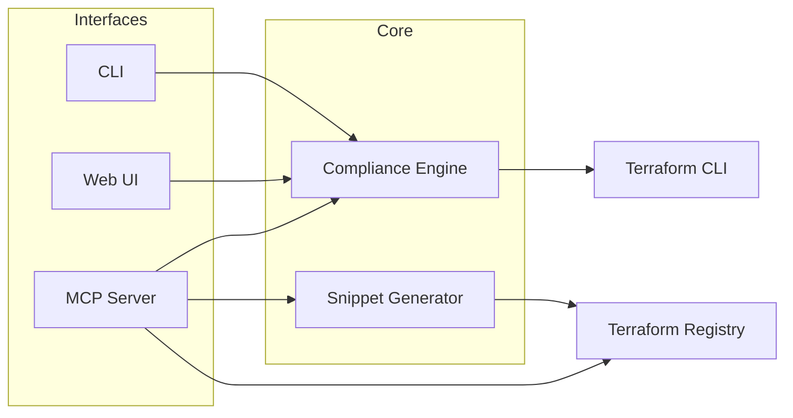
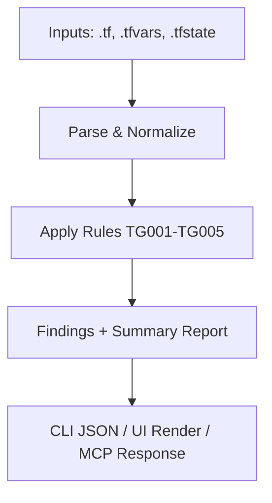

# Terraform Guardrail MCP

Terraform Guardrail MCP is a Python-based MCP server + CLI + minimal web UI that helps AI assistants
and platform teams generate valid Terraform code and enforce ephemeral-values compliance. It targets
multi-cloud teams and focuses on reducing configuration drift, secret leakage, and invalid provider
usage.

## What it does

- MCP server that exposes provider metadata and compliance checks
- CLI for scanning Terraform configs and state for sensitive leaks
- Minimal web UI for quick scans and reports
- Rules engine focused on ephemeral values, write-only arguments, and secret hygiene

## Architecture





## MVP scope (v0.1)

- Scan `.tf` and `.tfvars` for sensitive values and missing `ephemeral = true`
- Scan `.tfstate` for leaked sensitive values
- Provider metadata retrieval for AWS and Azure via Terraform Registry
- MCP server with `scan_terraform` and `get_provider_metadata` tools
- Minimal web UI for uploading a file and viewing the report

## Quickstart

```bash
python -m venv .venv
source .venv/bin/activate
pip install -e "[dev]"

# CLI scan
terraform-guardrail scan examples

# snippet generation
terraform-guardrail generate aws aws_s3_bucket --name demo

# MCP server (stdio)
terraform-guardrail mcp

# Web UI
terraform-guardrail web
```

## CLI examples

```bash
# scan a directory
terraform-guardrail scan ./examples --format json

# scan state files too
terraform-guardrail scan ./examples --state ./examples/sample.tfstate

# enable schema-aware validation (requires terraform CLI + initialized workspace)
terraform-guardrail scan ./examples --schema
```

## Web UI

Visit `http://127.0.0.1:8000` and upload a Terraform file to view a compliance report.

## Streamlit App

```bash
streamlit run streamlit_app.py
```

### Streamlit Cloud deployment

1. Push this repo to GitHub.
2. Create a new Streamlit Cloud app.
3. Set the main file path to `streamlit_app.py`.
4. Deploy (Streamlit will install from `requirements.txt`).

## MCP tools (current)

- `scan_terraform`: Run compliance checks over a path and optional state file.
- `get_provider_metadata`: Fetch provider metadata from Terraform Registry (AWS + Azure).
- `generate_snippet`: Generate Terraform snippets for common AWS/Azure resources.

## Roadmap

- Schema-aware code generation using provider schemas
- `fix` command to apply safe rewrites for ephemeral values
- Multi-environment policies and OPA-compatible output
- Stack-aware orchestration and drift detection

## License

MIT
