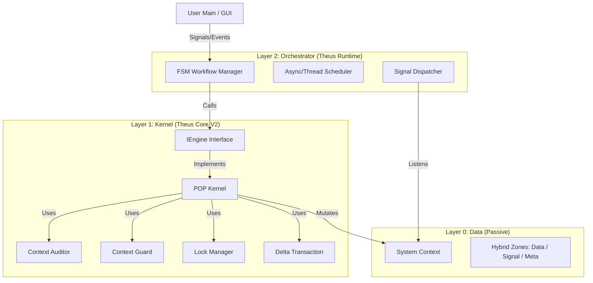

# Theus V2.1 Architecture Specification: The Industrial Microkernel

## 1. Tầm nhìn (Vision)
Từ bản V2 tập trung vào **An toàn (Safety/Strictness)**, V2.1 mở rộng sang **Khả năng Điều phối (Orchestration)** để hỗ trợ các ứng dụng phức tạp (GUI, Robot, Websocket) nhưng vẫn giữ vững triết lý "Process-Oriented" thông qua kiến trúc **Microkernel**.

## 2. Kiến trúc Tổng quan (High-Level Architecture)

Hệ thống được chia thành 3 lớp riêng biệt theo nguyên lý Clean Architecture:

## 3. Danh mục Thành phần (Component Inventory)

### A. Lớp Nhân (Layer 1: Theus Core)
*Nhiệm vụ: Thực thi 1 Process đơn lẻ an toàn tuyệt đối.*

| Thành phần | Trạng thái | Chức năng (Role) | Ghi chú |
| :--- | :--- | :--- | :--- |
| **POPEngine** | ✅ Có sẵn | Thực thi Process, quản lý vòng đời Transaction. | Cần tách ra khỏi Logic Workflow tuần tự. |
| **ContextGuard** | ✅ Có sẵn | Proxy bảo vệ Read/Write Permissions. | Chặn truy cập trái phép. |
| **ContextAuditor** | ✅ Có sẵn | Kiểm tra Business Rules (S/A/B/C). | Chặn dữ liệu bẩn. |
| **LockManager** | ✅ Có sẵn | Quản lý Thread Locks cho Context. | Chống Race Conditions (Critical cho V2.1). |
| **Transaction** | ✅ Có sẵn | Ghi Log thay đổi (Delta), hỗ trợ Rollback. | Đảm bảo tính nguyên vẹn (Atomicity). |
| **Contract** | ✅ Có sẵn | Định nghĩa Inputs/Outputs cho Process. | Metadata cho Kernel. |

### B. Lớp Giao diện (The Interface)
*Nhiệm vụ: Đảo ngược sự phụ thuộc (DIP).*

| Thành phần | Trạng thái | Chức năng (Role) | Ghi chú |
| :--- | :--- | :--- | :--- |
| **IEngine** | 🆕 Mới | Abstract Base Class cho Engine. | `execute(process_name, ctx) -> ctx` |
| **IScheduler** | 🆕 Mới | Abstract cho việc lập lịch chạy. | `submit(fn, *args)` |

### C. Lớp Điều phối (Layer 2: Theus Orchestrator)
*Nhiệm vụ: Quản lý luồng, thời gian và sự kiện.*

| Thành phần | Trạng thái | Chức năng (Role) | Ghi chú |
| :--- | :--- | :--- | :--- |
| **WorkflowManager** | ✅ Có sẵn | Đọc `workflow.yaml` (dạng Graph/State), điều phối toàn bộ luồng. | Thay thế `FSMManager` trong thiết kế cũ. |
| **SignalBus** | ✅ Có sẵn | Hàng đợi tin nhắn (Thread-safe Queue). | Cầu nối giữa GUI và Engine. |
| **ThreadExecutor** | ✅ Có sẵn | Wrapper quanh `ThreadPoolExecutor` (max_workers). | Chạy Process ở Background để không block GUI. |

## 4. Luồng dữ liệu (Data Flow) - Kịch bản GUI Async

1.  **User Action:** Người dùng bấm nút "Scan" trên GUI.
2.  **Signal:** GUI gọi `ctx.signals.put("CMD_SCAN")`.
3.  **Event Loop:**
    *   `FSMManager` (chạy ở thread nền) phát hiện Signal "CMD_SCAN".
    *   Tra cứu YAML: Trạng thái `IDLE` + Signal `CMD_SCAN` -> Action `p_scan`.
4.  **Dispatch:**
    *   `FSMManager` gọi `AsyncExecutor.submit(kernel.execute, "p_scan", ctx)`.
5.  **Kernel Execution:**
    *   `POPEngine` nhận lệnh.
    *   Lock Context (Write Mode).
    *   Chạy `p_scan`.
    *   Audit Output OK -> Commit Transaction -> Unlock.
6.  **Callback/Feedback:**
    *   `p_scan` ghi kết quả vào `ctx.domain.results`.
    *   `p_scan` gửi signal `EVT_SCAN_DONE` trước khi kết thúc.
7.  **UI Update:**
    *   GUI Loop đọc `ctx.domain.results` (Read Lock) và hiển thị.

## 5. Lộ trình Tái cấu trúc (Refactoring Roadmap)

1.  **Phase 1: Interface Extraction**
    *   Tách `POPEngine` hiện tại thành `IEngine` và `StandardKernel`.
2.  **Phase 2: Signal Bus Integration**
    *   Bổ sung `SignalQueue` vào `SystemContext` (Template mặc định).
3.  **Phase 3: FSM Parser**
    *   Viết module đọc file `workflow.yaml` định dạng State Machine.
4.  **Phase 4: Concurrency Hardening**
    *   Kiểm tra kỹ `LockManager` với Multi-thread.

## 6. Tự Đánh giá (Self-Audit with 8 Elements)

**1. Mục đích:** Mở rộng khả năng của Theus sang miền ứng dụng thời gian thực (GUI/Robotics) mà không hy sinh sự an toàn vốn có.
**2. Vấn đề:** Làm sao quản lý sự phức tạp của tính bất đồng bộ (Async race conditions)?
**3. Thông tin:** Chúng ta đã có `LockManager` (V2) và `ContextGuard`, đây là nền tảng vững chắc để chuyển sang Async.
**4. Khái niệm:** Sử dụng **Microkernel** dể cô lập sự phức tạp vào lớp Orchestrator, giữ Kernel đơn giản.
**5. Giả định:** Dev sẽ chấp nhận viết FSM trong YAML. *Rủi ro:* YAML quá dài. *Giải pháp:* Cần Visual Editor cho Workflow.
**6. Suy luận:** Nếu không tách lớp Interface (`IEngine`), ta sẽ bị kẹt với `POPEngine` cục bộ mãi mãi (Khó mở rộng Distributed).
**7. Hàm ý:** Việc debug sẽ khó hơn (Deadlock). Cần phát triển thêm công cụ **Theus Debugger** (tương lai).
**8. Góc nhìn:** Đây là kiến trúc của một "Hệ điều hành cho Agent" (Agent OS), không chỉ là một thư viện chạy script.
