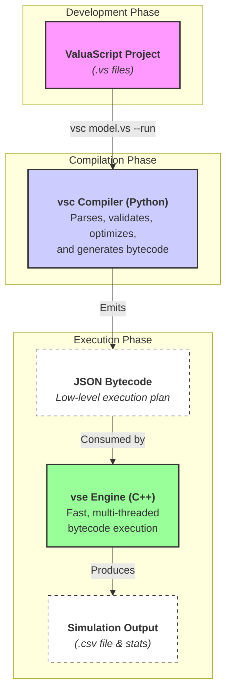

# ValuaScript: A Declarative Language for High-Performance Monte Carlo Simulations

[](https://github.com/Alessio2704/monte-carlo-simulator/actions)
[](https://opensource.org/licenses/MIT)
[](https://isocpp.org/std/the-standard)
[](https://www.python.org/downloads/)

ValuaScript combines a simple, declarative scripting language with a high-performance, multi-threaded C++ engine to create, run, and analyze complex quantitative models. It is purpose-built to deliver both **clarity and speed**, making sophisticated Monte Carlo simulations accessible and maintainable.

---

## The Core Philosophy: A Vocabulary for Simulations

Financial and scientific modeling often forces a choice between two extremes: the intuitive but slow, error-prone nature of spreadsheets, and the powerful but verbose, complex nature of general-purpose programming languages.

ValuaScript was created to bridge this gap. It is not a general-purpose language; it is a **vocabulary for describing simulations.**

This approach is guided by three principles:

- **Declarative & Readable:** A ValuaScript file describes **what** the model is, not **how** to compute it. There are no loops, complex data structures, or pointers. The script reads like a novel or a specification sheet, making models easy to write, review, and maintain for domain experts and programmers alike.

- **High-Performance by Design:** All the heavy lifting—numerical calculations, statistical sampling, and data aggregation—is handled by a multi-threaded C++17 engine. Scripting a model in ValuaScript is simply wiring together these pre-compiled, high-speed components. A simulation that might take minutes in other tools is executed in seconds.

- **Extensible through Contribution:** The language grows by expanding its C++ core. Need a niche financial model or a specific epidemiological simulation? Implement it once in optimized C++, and it instantly becomes a new "word" in the ValuaScript vocabulary for everyone to use. This creates a powerful, community-driven flywheel for growth.

## See it in Action: A Powerful SIR Epidemic Model

This example demonstrates how ValuaScript's new **tuple and multi-assignment** feature can handle complex, multi-output system models with clarity and power.

```valuascript
# --- SIR Epidemic Model ---
# This model simulates the spread of a disease through a population.

@iterations = 500
@output = peak_infected_count
@output_file = "sir_model_results.csv"

# --- Model Parameters ---
let population = 1_000_000
let initial_infected = 10

# The transmission rate is stochastic, making this a Monte Carlo simulation.
let transmission_rate = Normal(0.35, 0.05)
let recovery_rate = 1 / 14 # 14-day recovery period

# --- Simulation ---
# Call the SirModel function, which returns three vectors in a single tuple.
# We use multi-assignment to unpack the results into three new variables.
let susceptible, infected, recovered = SirModel(
    population - initial_infected,
    initial_infected,
    0,
    transmission_rate,
    recovery_rate,
    120, # Simulate for 120 days
    dt = 1.0
)

# --- Analysis ---
# We can now work with the returned vectors. For our output, we can analyze
# the results. A 'max_series' function would be useful, but for now we
# will output the entire 'infected' vector.
let peak_infected_count = infected
```

#### Run the Simulation

One command compiles, runs 500 trials with optimizations, and plots the results for the first vector.

```bash
vsc sir_model.vs --run -O --plot
```

## Architecture: AOT Compiler & Virtual Machine

The project follows a modern Ahead-of-Time (AOT) Compiler and Virtual Machine (VM) model. This clean separation of concerns ensures maximum performance and compile-time safety by eliminating runtime analysis and interpretation.

1.  **The `vsc` Compiler (Python):** This is the "brain." It parses the high-level `.vs` script, resolves the `@import` graph, performs deep semantic validation, runs optimizations, and emits a low-level **JSON bytecode**.
2.  **The `vse` Engine (C++):** This is the "muscle." It is a fast, multi-threaded executable that does no analysis; it simply loads the pre-compiled bytecode and executes the instructions at maximum speed.



## Key Features

### ✨ The ValuaScript Language

- **Intuitive Syntax:** A clean, declarative language with a familiar, spreadsheet-like formula syntax.
- **📦 Code Modularity:** Organize models into reusable modules with `@import`. The compiler resolves the entire dependency graph, including nested and shared ("diamond") dependencies.
- **🔧 User-Defined Functions:** Create reusable, type-safe functions with docstrings, strict lexical scoping, and compile-time recursion detection.
- **✨ Tuples & Multi-Assignment:** Functions can return multiple values (including mixed types like scalars and vectors), which can be unpacked into multiple variables in a single, clean assignment.
- **🛡️ Compile-Time Safety:** Catch logical errors like type mismatches, incorrect function arguments, undefined variables, and circular imports before you run.
- **🎲 Integrated Monte Carlo Support:** Natively supports a rich library of statistical distributions (`Normal`, `Pert`, `Lognormal`, `Beta`, etc.).

### 🚀 The AOT Compiler & C++ Engine

- **High-Performance Backend:** A multi-threaded Virtual Machine (VM) written in modern C++17, designed to leverage all available CPU cores for maximum parallelism.
- **🧠 Intelligent AOT Compiler:** Performs all semantic analysis and optimization _before_ execution, generating a low-level JSON bytecode for the engine.
- **⚙️ Advanced Optimizations:**
  - **Function Inlining:** User-defined functions are seamlessly inlined, eliminating call overhead.
  - **Loop-Invariant Code Motion:** Deterministic calculations are automatically identified and run only once.
  - **Dead Code Elimination:** Unused variables are stripped from the final bytecode.

### ⚡ The VS Code Extension

- **Live Value Preview:** Hover over any variable to see its calculated value instantly. For stochastic variables, the engine runs a sample simulation in the background and displays the mean.
- **Real-Time Diagnostics:** Get immediate, as-you-type feedback on errors.
- **Hover-for-Help:** See full signatures and docstrings for all built-in and user-defined functions.
- **Go-to-Definition:** Seamlessly navigate to the source of any user-defined function.

## Quick Start: Installation

Get started in minutes with our automated installation scripts.

#### Prerequisites

1.  **Python 3.13+** must be installed and available in your PATH.
2.  **Administrator/sudo privileges** are required to add the tools to your system's PATH.

#### macOS & Linux

Open your terminal and run the following one-line command:

```bash
/bin/bash -c "$(curl -fsSL https://raw.githubusercontent.com/Alessio2704/monte-carlo-simulator/main/scripts/install.sh)"
```

#### Windows

Open a new **PowerShell terminal as Administrator** and run:

```powershell
Set-ExecutionPolicy Bypass -Scope Process -Force; [System.Net.ServicePointManager]::SecurityProtocol = [System.Net.ServicePointManager]::SecurityProtocol -bor 3072; iex ((New-Object System.Net.WebClient).DownloadString('https://raw.githubusercontent.com/Alessio2704/monte-carlo-simulator/main/scripts/install.ps1'))
```

After installation, **you must open a new terminal window** for the changes to take effect.

#### Uninstalling

The same scripts can be used to uninstall the tools. Simply replace `install.sh` with `uninstall.sh` (for Mac/Linux) or `install.ps1` with `uninstall.ps1` (for Windows) in the commands above.

## ValuaScript Language Guide

<details>
<summary><strong>Directives & The Compiler</strong></summary>

- `@iterations = <number>`: **(Required)** Defines the number of Monte Carlo trials to run.
- `@output = <variable>`: **(Required)** Specifies which variable's final value should be collected.
- `@output_file = "<path>"`: **(Optional)** Exports all trial results to a CSV file.
- `@module`: Declares a file as a module containing only `func` definitions.
- `@import "<path>"`: Imports all functions from a module file.

The compiler `vsc` can be invoked with several flags:

- `--run`: Compiles and then immediately executes the simulation.
- `-O` or `--optimize`: Enables **Dead Code Elimination**.
- `--plot`: Automatically generates a histogram of the simulation output.
- `-v` or `--verbose`: Provides detailed feedback on the compiler's optimization process.

</details>

<details>
<summary><strong>Variables, Expressions, and Conditionals</strong></summary>

```valuascript
# --- Variable Assignment (`let`) ---

# Literals (with numeric separators for readability)
let tax_rate = 0.21
let initial_investment = 1_500_000

# Infix Expressions
let cost_of_equity = risk_free_rate + beta * equity_risk_premium

# Vector Literals
let margin_forecast = [0.25, 0.26, 0.28]

# --- Element Access ---
let my_vector = [100, 200, 300]
let first_element = my_vector[0]   # Accesses the first element (100)
let last_element = my_vector[-1]    # Accesses the last element (300)

# To create a new vector with an element removed, use the `delete_element` function.
let vector_without_last = delete_element(my_vector, -1) # Returns a new vector [100, 200]

# --- Conditional Logic (if/then/else) ---
let tax_regime = if is_high_income then 0.40 else 0.25
```

</details>

<details>
<summary><strong>User-Defined Functions (UDFs), Tuples & Modules</strong></summary>

ValuaScript supports fully type-checked, user-defined functions that can return multiple values using tuples.

- **Strict Scoping:** Functions can only access their own parameters and locally defined variables. They cannot access global variables, ensuring pure, predictable behavior.
- **Compile-Time Validation:** The compiler checks for correct types, argument counts, and prevents recursion.
- **Optimization:** Functions are inlined by the compiler to eliminate call overhead.

```valuascript
# Define a reusable function with typed parameters and a tuple return type.
# This function returns two values: a scalar and a vector.
func process_inputs(base_value: scalar, rates: vector) -> (scalar, vector) {
    """Processes inputs and returns a discounted value and the original vector."""
    let projected = compound_series(base_value, rates)
    let total_value = sum_series(projected)
    let discounted_value = total_value / (1 + 0.05)
    return (discounted_value, projected)
}

# --- Main script body ---
@iterations = 1000
@output = final_value

let initial = 100
let growth_rates = [0.1, 0.12, 0.15]

# Use multi-assignment to unpack the tuple returned by the function.
let final_value, projected_series = process_inputs(initial, growth_rates)
```

</details>

<details>
<summary><strong>Built-in Function Reference</strong></summary>

A comprehensive library of built-in functions is available for math, series manipulation, I/O, and statistical sampling. Functions that return multiple values are noted with a tuple return type.

| Category       | Functions                                                                                                                                      |
| -------------- | ---------------------------------------------------------------------------------------------------------------------------------------------- |
| **Core**       | `log`, `log10`, `exp`, `sin`, `cos`, `tan`, `identity`                                                                                         |
| **Series**     | `grow_series`, `compound_series`, `interpolate_series`, `sum_series`, `series_delta`, `npv`, `get_element`, `delete_element`, `compose_vector` |
| **Statistics** | `Normal`, `Lognormal`, `Beta`, `Uniform`, `Bernoulli`, `Pert`, `Triangular`                                                                    |
| **Data I/O**   | `read_csv_scalar`, `read_csv_vector`                                                                                                           |
| **Financial**  | `BlackScholes`, `capitalize_expense` -> `(scalar, scalar, string)`                                                                             |
| **Scientific** | `SirModel` -> `(vector, vector, vector)`                                                                                                       |

</details>

## Contributing: How to Extend ValuaScript

Contributions are welcome! The architecture is designed to make adding new functions—or even entirely new domains of science and engineering—as simple and safe as possible.

<details>
<summary><strong>Tutorial: How to Add a New Function (with Single or Multiple Return Values)</strong></summary>

Let's walk through adding a function named `NewFunction` to the `financial` domain.

**Step 1: Create the C++ Header (`.h`)**
Define your operation's class interface. The build system will find this automatically.
_File: `engine/include/engine/functions/financial/NewFunction.h`_

```cpp
#pragma once
#include "include/engine/core/IExecutable.h"

class NewFunctionOperation : public IExecutable
{
public:
    // All functions now return a vector of TrialValue.
    std::vector<TrialValue> execute(const std::vector<TrialValue> &args) const override;
};
```

**Step 2: Create the C++ Implementation (`.cpp`)**
Implement the function's logic and its local registration function.
_File: `engine/src/engine/functions/financial/NewFunction.cpp`_

```cpp
#include "include/engine/functions/financial/NewFunction.h"
#include "include/engine/functions/FunctionRegistry.h"

// Local registrar for this specific function
void register_new_function_operation(FunctionRegistry& registry)
{
    registry.register_function("NewFunction", []{
        return std::make_unique<NewFunctionOperation>();
    });
}

std::vector<TrialValue> NewFunctionOperation::execute(const std::vector<TrialValue> &args) const
{
    // For a single return value, wrap it in a vector:
    // return { TrialValue(42.0) };

    // For multiple return values (a tuple):
    double val1 = 123.45;
    std::string val2 = "status_ok";
    return { TrialValue(val1), TrialValue(val2) };
}
```

**Step 3: Update the Private Domain Manifest**
Declare your new function's registrar in the domain's internal manifest.
_File: `engine/src/engine/functions/financial/financial_registration.h`_

```cpp
#pragma once
class FunctionRegistry;

// Declare all registrars for this domain
void register_black_scholes_operation(FunctionRegistry& registry);
void register_new_function_operation(FunctionRegistry& registry); // Add this line
```

**Step 4: Update the Domain Orchestrator**
Call your new registrar from the domain's main orchestrator file.
_File: `engine/src/engine/functions/financial/financial.cpp`_

```cpp
#include "include/engine/functions/financial/financial.h"
#include "engine/src/engine/functions/financial/financial_registration.h"
#include "include/engine/functions/FunctionRegistry.h"

void register_financial_functions(FunctionRegistry& registry)
{
    register_black_scholes_operation(registry);
    register_new_function_operation(registry); // Add this line
}
```

**Step 5: Define the Python Signature**
Finally, teach the compiler about your new function. The dynamic loader will find this automatically.
_File: `compiler/vsc/functions/financial.py`_

```python
SIGNATURES = {
    "BlackScholes": { ... },
    "NewFunction": {
        "variadic": False,
        "arg_types": ["scalar"], # Example arguments
        "return_type": ["scalar", "string"], # A tuple return type
        "is_stochastic": False,
        "doc": {
            "summary": "A brief description of what NewFunction does.",
            "params": [ {"name": "param1", "desc": "Description of the first parameter."} ],
            "returns": "A tuple containing the calculated value and a status message.",
        },
    },
}
```

**Step 6: Add Tests!**
A pull request must include tests. Add a new test file `engine/test/functions/financial/test_new_function.cpp` and update the `CMakeLists.txt` to include it. Also add a compiler test to `compiler/tests/functions/test_financial_functions.py`.

Your function is now fully integrated!

</details>

<details>
<summary><strong>Tutorial: How to Add a Completely New Domain</strong></summary>

If your function belongs to a new field (e.g., epidemiology, physics), you should first create a new domain. Let's add an `epidemiology` domain.

**Step 1: Create the Domain Directory Structure**
Create folders for your new domain in both the `engine` source and header directories.

```
engine/include/engine/functions/epidemiology/
engine/src/engine/functions/epidemiology/
```

**Step 2: Create the Public Domain Header**
This is the clean, public-facing header for the entire domain.
_File: `engine/include/engine/functions/epidemiology/epidemiology.h`_

```cpp
#pragma once
class FunctionRegistry;
void register_epidemiology_functions(FunctionRegistry& registry);
```

**Step 3: Create the Domain Orchestrator and Private Manifest**
These files will organize and register all functions within the new domain. Initially, they will be empty placeholders.
_File: `engine/src/engine/functions/epidemiology/epidemiology_registration.h`_

```cpp
#pragma once
class FunctionRegistry;
// This file will list all individual function registrars for this domain.
```

_File: `engine/src/engine/functions/epidemiology/epidemiology.cpp`_

```cpp
#include "include/engine/functions/epidemiology/epidemiology.h"
#include "engine/src/engine/functions/epidemiology/epidemiology_registration.h"
#include "include/engine/functions/FunctionRegistry.h"

void register_epidemiology_functions(FunctionRegistry& registry)
{
    // This function will call all registrars from the private header.
}
```

**Step 4: Register the New Domain with the Engine**
This is the **only time you will edit the core engine code**. Add your new domain's registration function to the main list.
_File: `engine/src/engine/core/SimulationEngine.cpp`_

```cpp
// ... inside SimulationEngine::build_function_registry() ...
#include "include/engine/functions/financial/financial.h"
#include "include/engine/functions/epidemiology/epidemiology.h" // Add this line

void SimulationEngine::build_function_registry()
{
    // ...
    register_financial_functions(*m_function_registry);
    register_epidemiology_functions(*m_function_registry); // Add this line
    // ...
}
```

**Step 5: Create the Python Signature File**
The compiler's dynamic loader will automatically discover this new file.
_File: `compiler/vsc/functions/epidemiology.py`_

```python
"""
Signatures for epidemiological modeling functions.
"""
SIGNATURES = {
    # Initially empty. Add function signatures here.
}
```

Your new domain is now set up! From here, you can follow the guide "How to Add a New Function" to populate your `epidemiology` domain with models like `SIR`, `SEIR`, etc.

</details>

### Running the Test Suite

A pull request must include tests for any new functionality.

#### 1. C++ Engine Tests (GoogleTest & CTest)

From the root directory of the project:

```bash
# Configure and build the project
cmake -S . -B build
cmake --build build

# Run the full test suite
cd build
ctest --verbose
```

#### 2. Python Compiler Tests (Pytest)

```bash
# Navigate to the compiler directory
cd compiler

# (Recommended) Create and activate a virtual environment
python3 -m venv venv
source venv/bin/activate  # On Windows: .\venv\Scripts\activate

# Install the compiler and its development dependencies
pip install -e .[dev]

# Run the tests
pytest -v
```

## Roadmap

- [ ] **Empirical Distribution Sampling:** Add a function to create a custom sampler from a real-world data series (e.g., historical stock returns), allowing models to be driven by actual data instead of theoretical distributions.
- [ ] **GPU Acceleration:** Explore CUDA/OpenCL to offload the "embarrassingly parallel" Monte Carlo workload to the GPU, providing an order-of-magnitude performance increase for simulations with millions of trials.

## License

This project is distributed under the MIT License. See the `LICENSE` file for more information.
